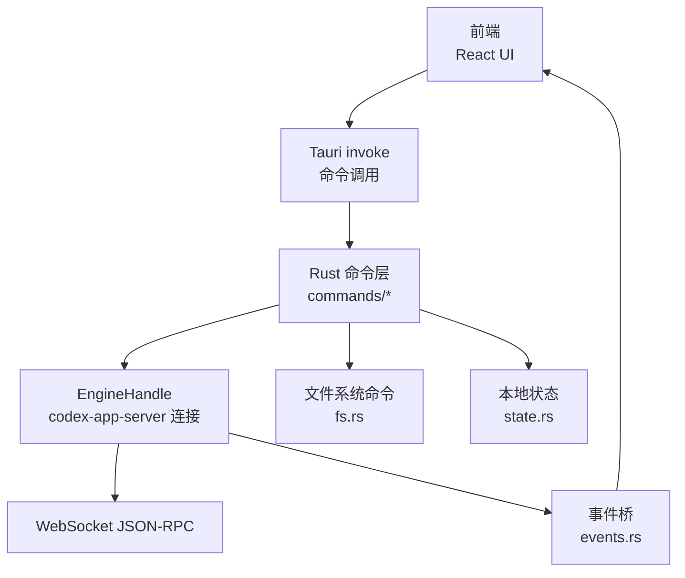
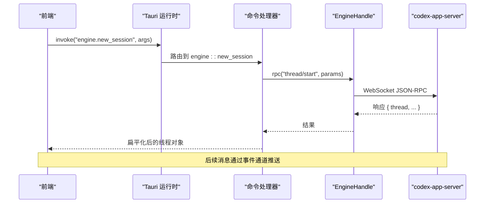
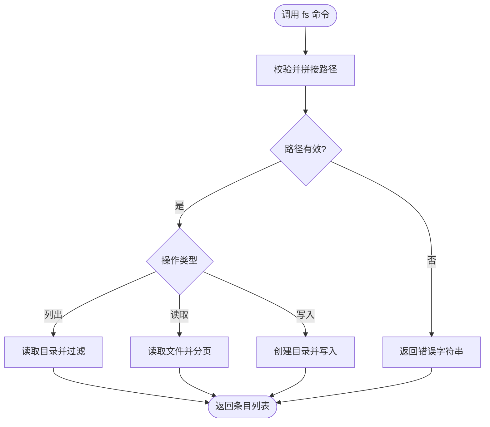
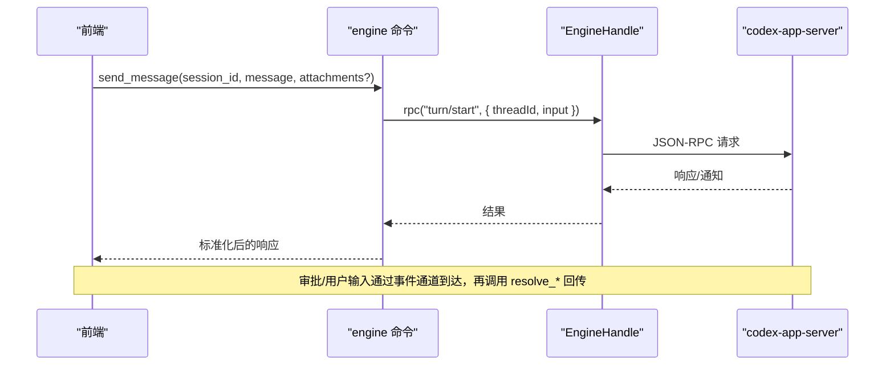
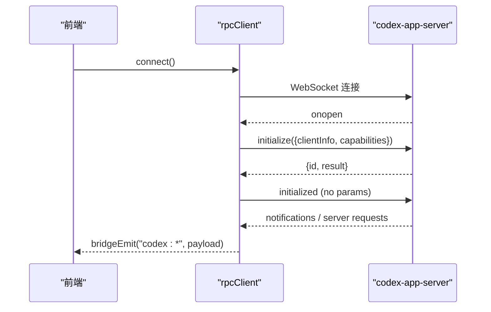
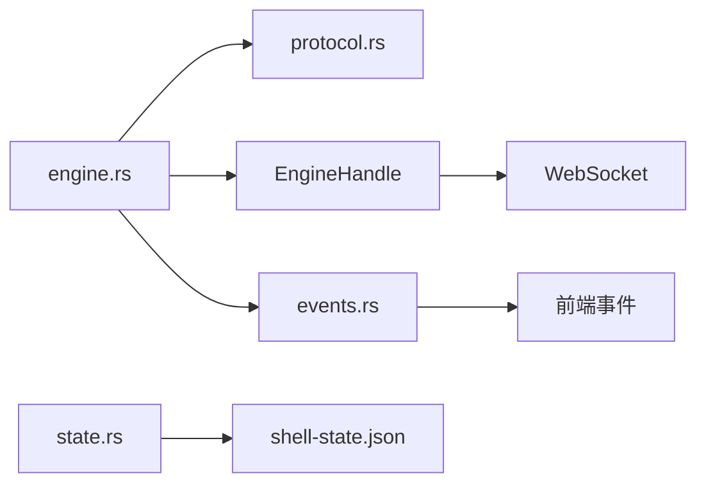

# API 参考

<cite>
**本文引用的文件**
- [main.rs](file://src-tauri/src/main.rs)
- [lib.rs](file://src-tauri/src/lib.rs)
- [commands/mod.rs](file://src-tauri/src/commands/mod.rs)
- [commands/fs.rs](file://src-tauri/src/commands/fs.rs)
- [commands/engine.rs](file://src-tauri/src/commands/engine.rs)
- [commands/settings.rs](file://src-tauri/src/commands/settings.rs)
- [commands/app_state.rs](file://src-tauri/src/commands/app_state.rs)
- [state.rs](file://src-tauri/src/state.rs)
- [protocol.rs](file://src-tauri/src/codex/protocol.rs)
- [events.rs](file://src-tauri/src/codex/events.rs)
- [tauri-core.ts](file://frontend/app/devbridge/tauri-core.ts)
- [rpcClient.ts](file://frontend/app/devbridge/rpcClient.ts)
- [commands.ts](file://frontend/app/devbridge/commands.ts)
- [eventBus.ts](file://frontend/app/devbridge/eventBus.ts)
- [events.ts](file://frontend/app/bridge/events.ts)
</cite>

## 目录
1. [简介](#简介)
2. [项目结构](#项目结构)
3. [核心组件](#核心组件)
4. [架构总览](#架构总览)
5. [详细组件分析](#详细组件分析)
6. [依赖关系分析](#依赖关系分析)
7. [性能考虑](#性能考虑)
8. [故障排查指南](#故障排查指南)
9. [结论](#结论)
10. [附录](#附录)

## 简介
本 API 参考文档面向 Codex-Tauri 的开发者，系统化说明 Tauri 命令接口、前后端通信协议（JSON-RPC + WebSocket）、事件模型与错误处理约定，覆盖文件系统、系统服务、引擎会话、提供商配置、MCP/插件/技能等第三方集成能力。文档同时提供浏览器开发模式下的等价实现说明，便于在本地快速联调。

## 项目结构
- Rust 后端位于 src-tauri/src，负责：
  - 启动 Tauri 应用、注册命令、管理状态、桥接 codex-app-server 侧进程。
  - 将引擎通知转发为前端可订阅的 Tauri 事件。
- 前端位于 frontend，包含：
  - 桌面端通过 Tauri invoke 调用命令；
  - 浏览器开发模式通过 devbridge 将相同命令路由到本地 WebSocket 客户端与内存存储。

图表来源
- [lib.rs:16-148](file://src-tauri/src/lib.rs#L16-L148)
- [commands/engine.rs:13-20](file://src-tauri/src/commands/engine.rs#L13-L20)
- [events.rs:12-43](file://src-tauri/src/codex/events.rs#L12-L43)

章节来源
- [lib.rs:16-148](file://src-tauri/src/lib.rs#L16-L148)
- [commands/mod.rs:1-11](file://src-tauri/src/commands/mod.rs#L1-L11)

## 核心组件
- Tauri 应用入口与初始化
  - 入口 main.rs 调用库函数 run()。
  - run() 初始化日志、加载插件、构建菜单、注册命令、启动协议适配器与 sidecar、广播事件桥。
- 命令层
  - 按功能模块划分：engine、fs、settings、app_state 等。
  - 所有命令统一返回 Result<T, String>，错误以字符串形式返回给前端。
- 引擎代理
  - 通过 EngineHandle 与 codex-app-server 建立 WebSocket JSON-RPC 连接，封装方法名常量与请求/响应解析。
- 事件桥
  - 订阅引擎通知，映射为 Tauri 事件 codex:*，供前端监听。
- 本地状态
  - 持久化用户设置、偏好、宠物、日历、连接器、快捷键等。

章节来源
- [main.rs:4-6](file://src-tauri/src/main.rs#L4-L6)
- [lib.rs:8-160](file://src-tauri/src/lib.rs#L8-L160)
- [commands/engine.rs:13-20](file://src-tauri/src/commands/engine.rs#L13-L20)
- [events.rs:12-82](file://src-tauri/src/codex/events.rs#L12-L82)
- [state.rs:176-232](file://src-tauri/src/state.rs#L176-L232)

## 架构总览
Codex-Tauri 采用“命令 + 事件”的双通道设计：
- 命令通道：前端通过 Tauri invoke 调用命令，命令内部可能直接操作本地资源或转发到 codex-app-server。
- 事件通道：引擎主动推送的通知和请求被转换为 Tauri 事件，前端订阅后更新界面或触发交互。

图表来源
- [lib.rs:71-148](file://src-tauri/src/lib.rs#L71-L148)
- [commands/engine.rs:31-52](file://src-tauri/src/commands/engine.rs#L31-L52)
- [protocol.rs:12-24](file://src-tauri/src/codex/protocol.rs#L12-L24)

## 详细组件分析

### 文件系统 API（fs）
- 暴露命令
  - list_files(cwd, dir) → FileEntry[]
    - cwd: 工作区根路径
    - dir: 相对 cwd 的子目录
    - 返回条目包含 name/path/absPath/isDirectory/ext，自动忽略隐藏文件和指定目录
  - read_file(cwd, path, offset?, limit?) → string
    - 限制最大读取大小，支持行级分页
  - write_file(cwd, path, content) → void
    - 自动创建父目录，写入文本内容
- 安全策略
  - 拒绝路径穿越（..），校验规范化路径是否仍在 cwd 下
- 错误码约定
  - 返回字符串错误，如“path traversal rejected”、“cwd is not a directory”、“file exceeds 1MiB read cap”

图表来源
- [commands/fs.rs:31-48](file://src-tauri/src/commands/fs.rs#L31-L48)
- [commands/fs.rs:50-132](file://src-tauri/src/commands/fs.rs#L50-L132)

章节来源
- [commands/fs.rs:1-132](file://src-tauri/src/commands/fs.rs#L1-L132)

### 引擎会话与消息（engine）
- 会话管理
  - engine_status() → { connected, initialize }
  - new_session(project_path?) → 线程对象（已扁平化）
  - list_sessions(archived?) → 会话列表
  - get_session(session_id) → 线程对象
  - delete_session(session_id)
  - archive_session(session_id) / unarchive_session(session_id)
- 消息发送与中断
  - send_message(session_id, message, attachments?) → TurnStart 参数转换后转发
  - interrupt_session(session_id)
- 审批与用户输入
  - resolve_approval(request_id, approved, kind?, session_scope?) → 决策回传
  - respond_server_request(request_id, result) → 通用结果回传
- 提供商与配置
  - list_providers() → { providers, raw }
  - save_provider(provider) → 写入配置、注入环境变量键、激活适配器路由
  - probe_provider(provider_id?, base_url?, protocol?, api_key?, model?) → 连通性探测
- MCP/技能/插件
  - list_mcp_servers() / save_mcp_server(server) / test_mcp_connection(server) / set_mcp_server_enabled(name, enabled)
  - list_skills() / reload_skills()
  - list_plugins() / set_plugin_enabled(id, enabled)
- Shell 执行
  - open_shell(session_id?, shell?, cwd?) → 返回 processId
  - write_shell(session_id, data) → base64 编码写入
  - read_shell(session_id) → 输出通过通知流式返回
  - close_shell(session_id) → 关闭 stdin 并终止进程
- 其他
  - git_status(thread_id?) → 通过线程内 shellCommand 执行
  - get_runtime_events(session_id) → 时间线列表
  - list_agent_tools() → 工具列表（当前为空）
  - rpc_raw(method, params?) → 透传 JSON-RPC

图表来源
- [commands/engine.rs:103-127](file://src-tauri/src/commands/engine.rs#L103-L127)
- [commands/engine.rs:137-183](file://src-tauri/src/commands/engine.rs#L137-L183)
- [protocol.rs:27-39](file://src-tauri/src/codex/protocol.rs#L27-L39)

章节来源
- [commands/engine.rs:1-861](file://src-tauri/src/commands/engine.rs#L1-L861)
- [protocol.rs:1-207](file://src-tauri/src/codex/protocol.rs#L1-L207)

### 设置与本地状态（settings, app_state, state）
- 设置
  - get_settings() → Settings
  - save_settings(settings) → 保存并同步活动提供商到适配器
  - get_preferences() → Preferences
  - save_preferences(preferences) → 保存
  - list_shortcuts() / save_shortcuts(shortcuts)
- 应用状态快照
  - get_state() → StateSnapshot（包含 settings/preferences/pets/calendar/connectors/shortcuts）
  - check_dependencies() → 检查 tauri-shell、codex-app-server、ripgrep 可用性
- 本地状态持久化
  - 数据目录：用户配置目录下 CodexDesktop/shell-state.json
  - 字段包括设置、偏好、宠物、日历、电影时间线、作业、连接器、快捷键、计划任务、PR 列表、提供商密钥/协议/端点

章节来源
- [commands/settings.rs:1-69](file://src-tauri/src/commands/settings.rs#L1-L69)
- [commands/app_state.rs:1-62](file://src-tauri/src/commands/app_state.rs#L1-L62)
- [state.rs:27-174](file://src-tauri/src/state.rs#L27-L174)
- [state.rs:176-232](file://src-tauri/src/state.rs#L176-L232)

### 前后端通信协议（JSON-RPC + WebSocket）
- 握手流程
  - 客户端发送 initialize（含 clientInfo、capabilities）
  - 服务端返回 initialize 响应
  - 客户端发送 initialized 通知（无 params）
- 请求/响应格式
  - 请求：{ jsonrpc: "2.0", id, method, params? }
  - 响应：{ id, result? | error? }
  - 通知：{ method, params? }
  - 服务器→客户端请求（审批/用户输入）：{ id, method, params? }，需按 id 回复结果
- 超时与重连
  - initialize 超时：10s
  - 普通请求超时：120s
  - 断线重连：2s 退避
- 事件命名规范
  - 通知：codex:{method with / and . replaced by -}
  - 服务器请求：codex:approval、codex:user-input、codex:server-request-{sanitized}

图表来源
- [rpcClient.ts:70-101](file://frontend/app/devbridge/rpcClient.ts#L70-L101)
- [rpcClient.ts:103-148](file://frontend/app/devbridge/rpcClient.ts#L103-L148)
- [events.rs:45-82](file://src-tauri/src/codex/events.rs#L45-L82)
- [events.ts:23-30](file://frontend/app/bridge/events.ts#L23-L30)

章节来源
- [rpcClient.ts:1-230](file://frontend/app/devbridge/rpcClient.ts#L1-L230)
- [events.rs:1-82](file://src-tauri/src/codex/events.rs#L1-L82)
- [events.ts:1-172](file://frontend/app/bridge/events.ts#L1-L172)
- [protocol.rs:103-156](file://src-tauri/src/codex/protocol.rs#L103-L156)

### 浏览器开发模式（devbridge）
- 命令路由
  - tauri-core.ts 的 invoke 调用 dispatchCommand，将命令分发到 engine/store/market/plugin 三类处理器
  - engineCommands 复现 Rust 命令行为，调用 rpcClient 与 codex-app-server 通信
  - storeCommands 使用 localStorage 镜像 shell-state.json
  - pluginCommands 提供浏览器降级实现（对话框取消、窗口控制空操作等）
- 事件总线
  - eventBus.ts 提供 listen/emit 语义，模拟 Tauri 事件
- 一致性原则
  - 无法完成的操作明确报错，不伪造成功
  - 与 Rust 命令保持一致的请求/响应归一化

章节来源
- [tauri-core.ts:1-24](file://frontend/app/devbridge/tauri-core.ts#L1-L24)
- [commands.ts:1-683](file://frontend/app/devbridge/commands.ts#L1-L683)
- [eventBus.ts:1-47](file://frontend/app/devbridge/eventBus.ts#L1-L47)

## 依赖关系分析
- 命令到引擎
  - commands/engine.rs 通过 EngineHandle.rpc 调用 codex-app-server 的 JSON-RPC 方法
  - 方法名常量集中在 protocol.rs，确保与官方协议一致
- 事件到前端
  - events.rs 将 ServerMessage 映射为 Tauri 事件名称与负载，前端通过 events.ts 订阅
- 状态到磁盘
  - state.rs 负责读写 shell-state.json，并提供快照与默认值填充

图表来源
- [commands/engine.rs:13-20](file://src-tauri/src/commands/engine.rs#L13-L20)
- [protocol.rs:1-92](file://src-tauri/src/codex/protocol.rs#L1-L92)
- [events.rs:12-43](file://src-tauri/src/codex/events.rs#L12-L43)
- [state.rs:176-232](file://src-tauri/src/state.rs#L176-L232)

章节来源
- [commands/engine.rs:1-861](file://src-tauri/src/commands/engine.rs#L1-L861)
- [protocol.rs:1-207](file://src-tauri/src/codex/protocol.rs#L1-L207)
- [events.rs:1-82](file://src-tauri/src/codex/events.rs#L1-L82)
- [state.rs:1-331](file://src-tauri/src/state.rs#L1-L331)

## 性能考虑
- 文件读取限制：read_file 限制单次读取上限，避免大文件阻塞
- Shell 输出：通过通知流式传输，避免一次性拉取大量数据
- 重连与超时：WebSocket 具备超时与重连机制，提升鲁棒性
- 配置批量写入：save_provider/save_mcp_server 使用 batchWrite 减少往返

[本节为通用指导，无需特定文件引用]

## 故障排查指南
- 常见错误来源
  - 文件系统：路径穿越、非目录、超出读取限制
  - 引擎连接：未连接、握手超时、请求超时
  - 提供商探测：Base URL 格式错误、鉴头不匹配、HTTP 非成功状态
- 定位步骤
  - 检查 engine_status 的 connected 与 initialize 元信息
  - 查看事件桥日志，确认 codex:* 事件是否正常发出
  - 对 provider 使用 probe_provider 获取 endpoint/status/models/hint
- 恢复建议
  - 修复 Base URL 与鉴权头（OpenAI 兼容用 Bearer，Anthropic 用 x-api-key）
  - 重启应用以重新注入环境变量密钥
  - 若事件丢失，检查前端是否正确订阅对应频道

章节来源
- [commands/fs.rs:31-48](file://src-tauri/src/commands/fs.rs#L31-L48)
- [commands/engine.rs:416-521](file://src-tauri/src/commands/engine.rs#L416-L521)
- [rpcClient.ts:70-101](file://frontend/app/devbridge/rpcClient.ts#L70-L101)
- [events.rs:33-43](file://src-tauri/src/codex/events.rs#L33-L43)

## 结论
Codex-Tauri 通过清晰的命令/事件分层与严格的 JSON-RPC 协议，实现了与 codex-app-server 的稳定通信。文件系统、设置、提供商配置、MCP/插件/技能等能力均通过统一的命令接口暴露，并在浏览器开发模式下提供等价实现，便于快速迭代与调试。遵循本文档的协议与错误约定，可确保前后端集成的一致性与可维护性。

[本节为总结性内容，无需特定文件引用]

## 附录

### 命令清单与用途速览
- 应用状态
  - get_state：获取本地状态快照
  - check_dependencies：检查依赖可用性
- 设置
  - get_settings/save_settings：读取/保存应用设置
  - get_preferences/save_preferences：读取/保存偏好
  - list_shortcuts/save_shortcuts：快捷键管理
- 文件系统
  - list_files/read_file/write_file：工作区文件浏览与读写
- 引擎
  - engine_status/new_session/list_sessions/get_session/delete_session/archive_session/unarchive_session
  - send_message/interrupt_session
  - resolve_approval/respond_server_request
  - list_providers/save_provider/probe_provider
  - list_mcp_servers/save_mcp_server/test_mcp_connection/set_mcp_server_enabled
  - list_skills/reload_skills
  - list_plugins/set_plugin_enabled
  - open_shell/write_shell/read_shell/close_shell
  - git_status/get_runtime_events/list_agent_tools/rpc_raw

章节来源
- [lib.rs:71-148](file://src-tauri/src/lib.rs#L71-L148)
- [commands/fs.rs:50-132](file://src-tauri/src/commands/fs.rs#L50-L132)
- [commands/engine.rs:22-861](file://src-tauri/src/commands/engine.rs#L22-L861)
- [commands/settings.rs:8-69](file://src-tauri/src/commands/settings.rs#L8-L69)
- [commands/app_state.rs:5-62](file://src-tauri/src/commands/app_state.rs#L5-L62)

### 事件类型与消息格式
- 通知事件
  - 名称：codex:{method with / and . replaced by -}
  - 负载：原始 params
- 服务器请求事件
  - 名称：codex:approval、codex:user-input、codex:server-request-{sanitized}
  - 负载：{ id, method, params }
- 前端订阅
  - 通过 events.ts 的 startEventBridge 统一绑定通知与请求频道

章节来源
- [events.rs:45-82](file://src-tauri/src/codex/events.rs#L45-L82)
- [events.ts:23-30](file://frontend/app/bridge/events.ts#L23-L30)
- [events.ts:119-159](file://frontend/app/bridge/events.ts#L119-L159)

### 客户端调用示例（概念性）
- 发起会话
  - 调用 engine.new_session，传入可选 project_path
  - 接收扁平化的线程对象，用于后续消息发送
- 发送消息
  - 调用 engine.send_message，传入 session_id、message、可选 attachments
  - 通过事件通道接收 turn 相关通知
- 审批交互
  - 监听 codex:approval 事件，根据 availableDecisions 展示选项
  - 调用 engine.resolve_approval 回传决策
- 提供商探测
  - 调用 engine.probe_provider，依据返回的 ok/error/hint 调整配置

[本节为概念性示例，不直接引用具体代码片段]