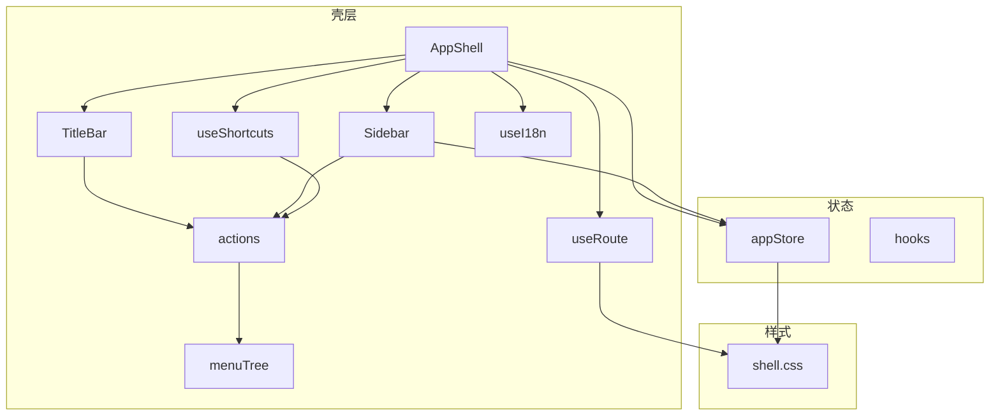
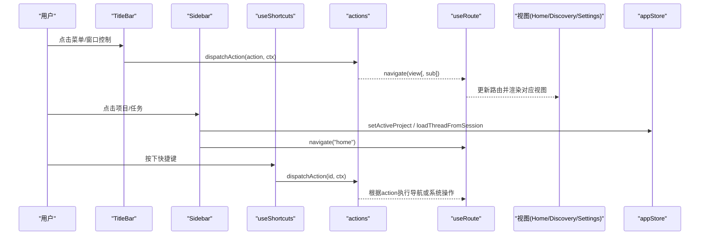
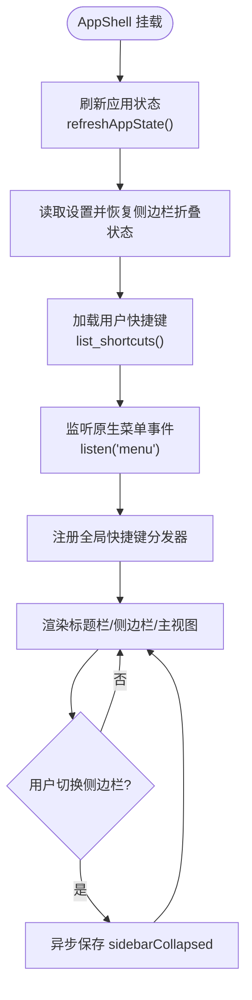
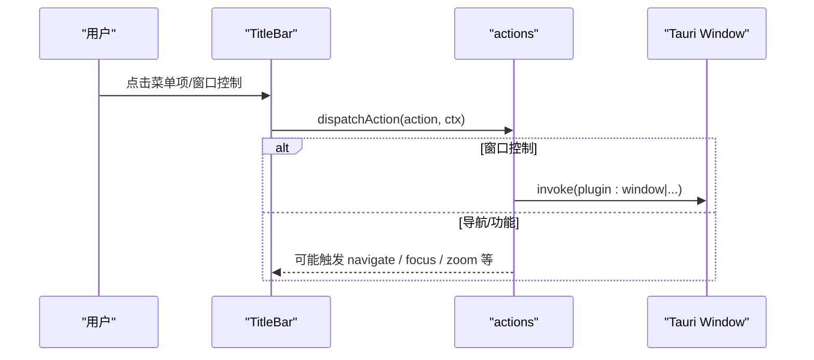
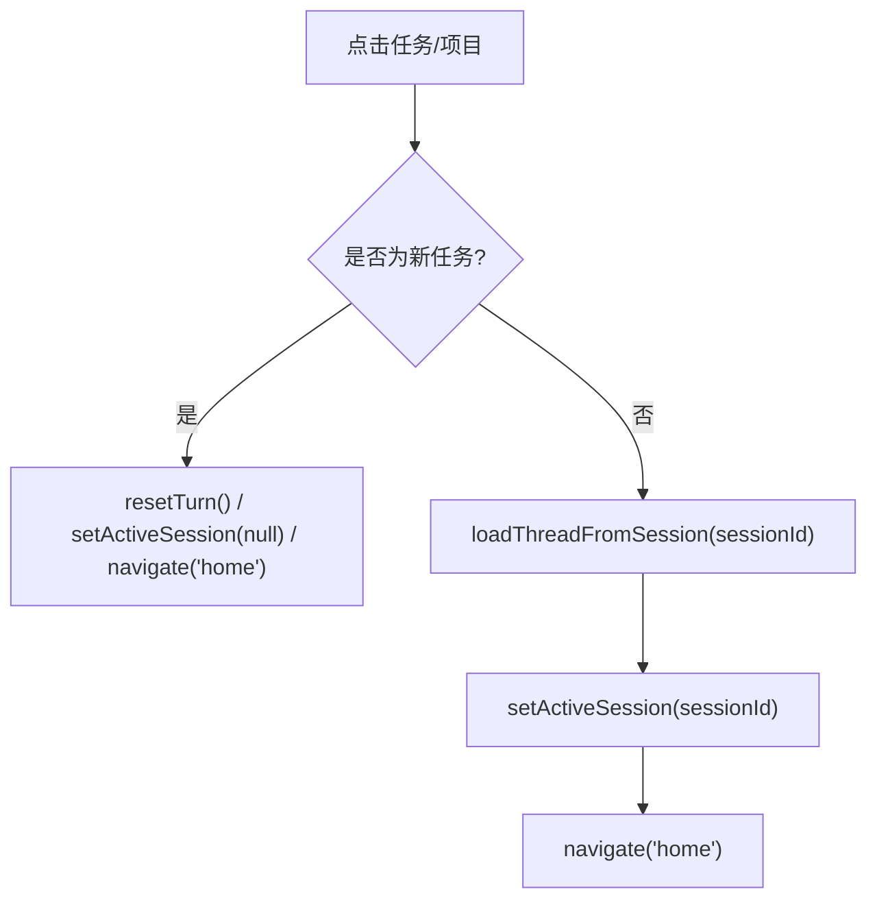
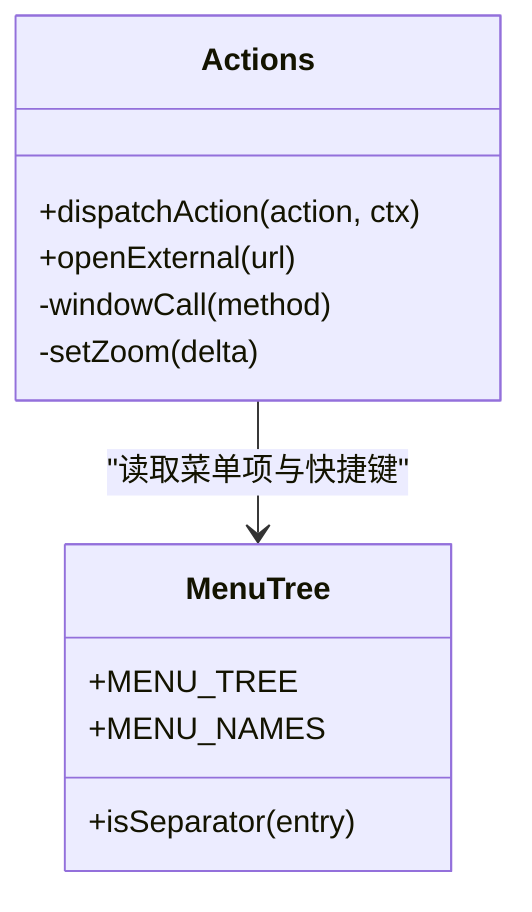
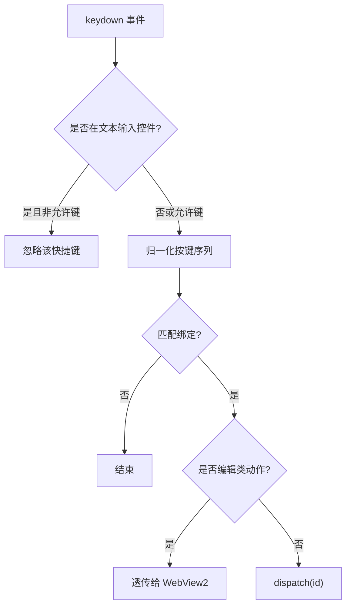
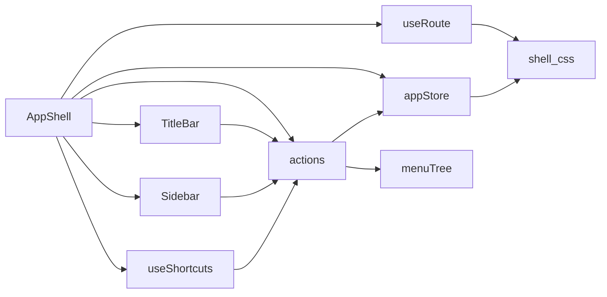

# AppShell主壳层组件

<cite>
**本文引用的文件**
- [AppShell.tsx](file://frontend/app/shell/AppShell.tsx)
- [TitleBar.tsx](file://frontend/app/shell/TitleBar.tsx)
- [Sidebar.tsx](file://frontend/app/shell/Sidebar.tsx)
- [actions.ts](file://frontend/app/shell/actions.ts)
- [menuTree.ts](file://frontend/app/shell/menuTree.ts)
- [useShortcuts.ts](file://frontend/app/shell/useShortcuts.ts)
- [useRoute.ts](file://frontend/app/shell/useRoute.ts)
- [useI18n.ts](file://frontend/app/shell/useI18n.ts)
- [appStore.ts](file://frontend/app/state/appStore.ts)
- [hooks.ts](file://frontend/app/state/hooks.ts)
- [i18n.js](file://frontend/src/js/i18n.js)
- [shell.css](file://frontend/src/styles/shell.css)
</cite>

## 目录
1. [简介](#简介)
2. [项目结构](#项目结构)
3. [核心组件](#核心组件)
4. [架构总览](#架构总览)
5. [详细组件分析](#详细组件分析)
6. [依赖关系分析](#依赖关系分析)
7. [性能考虑](#性能考虑)
8. [故障排查指南](#故障排查指南)
9. [结论](#结论)
10. [附录](#附录)

## 简介
本文件为 AppShell 主壳层组件的权威技术文档，聚焦应用壳层的整体架构与实现：标题栏、侧边栏与主视图容器的组织方式；ShellContext 上下文的设计模式与作用域管理（导航控制、侧边栏状态、快捷键处理等）；组件生命周期、事件监听机制与后端服务通信模式；响应式布局、国际化支持与错误处理策略；并提供使用示例、配置选项与扩展点说明。

## 项目结构
AppShell 位于前端 React 应用中，采用“壳层 + 视图”的分层组织：
- 壳层（shell）：负责全局 UI 框架（标题栏、侧边栏、主内容区）、全局快捷键、菜单分发、路由与国际化刷新。
- 状态（state）：集中管理应用数据（会话、项目、设置、引擎状态），通过 useSyncExternalStore 暴露给任意组件订阅。
- 样式（styles）：基于 CSS Grid 的响应式布局，配合 body 类名切换不同布局模式（如侧边栏收起、设置页全屏）。

图表来源
- [AppShell.tsx:78-205](file://frontend/app/shell/AppShell.tsx#L78-L205)
- [TitleBar.tsx:26-164](file://frontend/app/shell/TitleBar.tsx#L26-L164)
- [Sidebar.tsx:89-351](file://frontend/app/shell/Sidebar.tsx#L89-L351)
- [useRoute.ts:1-79](file://frontend/app/shell/useRoute.ts#L1-L79)
- [useShortcuts.ts:1-146](file://frontend/app/shell/useShortcuts.ts#L1-L146)
- [actions.ts:1-201](file://frontend/app/shell/actions.ts#L1-L201)
- [menuTree.ts:1-87](file://frontend/app/shell/menuTree.ts#L1-L87)
- [useI18n.ts:1-15](file://frontend/app/shell/useI18n.ts#L1-L15)
- [appStore.ts:1-519](file://frontend/app/state/appStore.ts#L1-L519)
- [shell.css:85-105](file://frontend/src/styles/shell.css#L85-L105)

章节来源
- [AppShell.tsx:78-205](file://frontend/app/shell/AppShell.tsx#L78-L205)
- [shell.css:85-105](file://frontend/src/styles/shell.css#L85-L105)

## 核心组件
- AppShell：应用壳层根组件，组合标题栏、侧边栏与主视图容器；初始化全局快捷键、监听原生菜单事件、维护侧边栏折叠状态与 ShellContext。
- TitleBar：无框标题栏，包含导航按钮、菜单栏（File/Edit/View/Help）与窗口控制按钮；所有菜单项来自 menuTree，确保渲染与动作一致。
- Sidebar：侧边栏，提供品牌区、主导航、项目列表、最近任务、模型与思考等级快速调节、待决权限提示与底部操作区。
- actions：统一的动作分发器，将字符串 action 映射到具体行为（导航、窗口控制、剪贴板、缩放、任务切换等）。
- useRoute：Hash 路由，支持 view/sub 形式，驱动 #view 与 body 类名同步，供任意组件读取当前路由。
- useShortcuts：全局快捷键分发，支持绑定归一化、冲突检测、文本输入时跳过普通键、编辑命令透传。
- useI18n：在语言切换时触发重渲染，保证壳层始终显示最新文案。
- appStore：应用级状态（会话、项目、提供者、设置、引擎状态），提供持久化保存、设置同步与数据刷新。

章节来源
- [AppShell.tsx:78-205](file://frontend/app/shell/AppShell.tsx#L78-L205)
- [TitleBar.tsx:26-164](file://frontend/app/shell/TitleBar.tsx#L26-L164)
- [Sidebar.tsx:89-351](file://frontend/app/shell/Sidebar.tsx#L89-L351)
- [actions.ts:1-201](file://frontend/app/shell/actions.ts#L1-L201)
- [useRoute.ts:1-79](file://frontend/app/shell/useRoute.ts#L1-L79)
- [useShortcuts.ts:1-146](file://frontend/app/shell/useShortcuts.ts#L1-L146)
- [useI18n.ts:1-15](file://frontend/app/shell/useI18n.ts#L1-L15)
- [appStore.ts:1-519](file://frontend/app/state/appStore.ts#L1-L519)

## 架构总览
AppShell 作为顶层容器，负责：
- 组装标题栏、侧边栏与主视图容器，并通过 useRoute 决定渲染哪个视图。
- 构建并注入 ShellContext，向子组件提供导航、侧边栏切换、焦点控制、任务切换等能力。
- 启动时从后端加载应用状态与用户可编辑的快捷键，并在运行时监听原生菜单事件与全局快捷键，统一派发至 actions。
- 通过 appStore 与后端 IPC 交互，完成设置持久化、项目选择、会话管理等。

图表来源
- [TitleBar.tsx:48-51](file://frontend/app/shell/TitleBar.tsx#L48-L51)
- [actions.ts:57-201](file://frontend/app/shell/actions.ts#L57-L201)
- [useRoute.ts:48-79](file://frontend/app/shell/useRoute.ts#L48-L79)
- [Sidebar.tsx:124-128](file://frontend/app/shell/Sidebar.tsx#L124-L128)
- [useShortcuts.ts:104-133](file://frontend/app/shell/useShortcuts.ts#L104-L133)
- [appStore.ts:249-277](file://frontend/app/state/appStore.ts#L249-L277)

## 详细组件分析

### AppShell：壳层根组件
- 职责
  - 初始化并维护侧边栏折叠状态，同步到 body 类名以复用现有样式规则。
  - 启动时刷新应用状态、恢复侧边栏折叠偏好、加载用户自定义快捷键（失败则回退到菜单树默认绑定）。
  - 构建 ShellContext，提供 navigate、toggleSidebar、focusComposer、addProject、stepTask 等方法。
  - 监听原生菜单事件（来自 Rust 菜单），统一调用 dispatchAction。
  - 注册全局快捷键分发器，将按键匹配到的 action id 交由 actions 处理。
  - 根据 route.view 渲染主视图或设置视图（设置视图作为 .main 的同级元素，由样式控制隐藏/显示）。
- 关键流程
  - 启动：refreshAppState → get_settings → list_shortcuts → install shortcut dispatcher → listen("menu")。
  - 侧边栏切换：toggleSidebar → 本地状态更新 → 异步保存 sidebarCollapsed。
  - 任务切换：stepTask → 计算下一个会话 → 更新 activeSessionId → 必要时加载线程 → navigate("home")。

图表来源
- [AppShell.tsx:84-110](file://frontend/app/shell/AppShell.tsx#L84-L110)
- [AppShell.tsx:112-130](file://frontend/app/shell/AppShell.tsx#L112-L130)
- [AppShell.tsx:163-186](file://frontend/app/shell/AppShell.tsx#L163-L186)
- [appStore.ts:378-408](file://frontend/app/state/appStore.ts#L378-L408)

章节来源
- [AppShell.tsx:78-205](file://frontend/app/shell/AppShell.tsx#L78-L205)

### TitleBar：无框标题栏与菜单
- 职责
  - 渲染导航按钮（后退/前进）、桌面菜单栏（File/Edit/View/Help）与窗口控制（最小化/最大化/关闭）。
  - 菜单项来源于 menuTree，确保 UI 与动作定义一致。
  - 点击菜单项或窗口控制按钮时，调用 dispatchAction 执行相应动作。
  - 支持 Escape 与外部点击关闭菜单。
- 关键点
  - 菜单面板通过固定定位弹出，避免被拖拽区域影响。
  - 窗口控制通过 Tauri 插件 window 能力调用 minimize/toggle_maximize/close。

图表来源
- [TitleBar.tsx:48-51](file://frontend/app/shell/TitleBar.tsx#L48-L51)
- [TitleBar.tsx:132-160](file://frontend/app/shell/TitleBar.tsx#L132-L160)
- [actions.ts:39-47](file://frontend/app/shell/actions.ts#L39-L47)

章节来源
- [TitleBar.tsx:26-164](file://frontend/app/shell/TitleBar.tsx#L26-L164)
- [actions.ts:39-47](file://frontend/app/shell/actions.ts#L39-L47)

### Sidebar：侧边栏与业务入口
- 职责
  - 展示品牌区、主导航（新任务、定时任务、插件、PR）、待决权限提示、模型与思考等级快速调节、项目列表与最近任务。
  - 支持删除会话、选择项目、切换到目标会话并导航到首页。
  - 集成右键上下文菜单用于快捷删除会话。
- 关键点
  - 最近任务按更新时间排序，最多显示 20 条。
  - 模型与思考等级通过 Dropdown 直接修改设置并持久化。
  - 删除会话后重置 turn 并刷新应用状态。

图表来源
- [Sidebar.tsx:124-128](file://frontend/app/shell/Sidebar.tsx#L124-L128)
- [Sidebar.tsx:269-276](file://frontend/app/shell/Sidebar.tsx#L269-L276)
- [Sidebar.tsx:105-122](file://frontend/app/shell/Sidebar.tsx#L105-L122)

章节来源
- [Sidebar.tsx:89-351](file://frontend/app/shell/Sidebar.tsx#L89-L351)

### actions：动作分发器
- 职责
  - 将字符串 action 映射到具体行为：新建任务/项目、打开设置、退出登录、切换侧边栏、剪贴板操作、窗口控制、缩放、全屏、任务切换、打开外部链接等。
  - 对未知 action 静默忽略，保证健壮性。
- 关键点
  - 剪贴板相关动作通过 document.execCommand 调用，因为 WebView2 中这是唯一能到达系统剪贴板的途径。
  - 窗口控制通过 Tauri 插件 window 能力调用。
  - 缩放通过调整 root.style.zoom 实现。

图表来源
- [actions.ts:57-201](file://frontend/app/shell/actions.ts#L57-L201)
- [menuTree.ts:24-87](file://frontend/app/shell/menuTree.ts#L24-L87)

章节来源
- [actions.ts:1-201](file://frontend/app/shell/actions.ts#L1-L201)
- [menuTree.ts:1-87](file://frontend/app/shell/menuTree.ts#L1-L87)

### useShortcuts：全局快捷键分发
- 职责
  - 安装全局 keydown 监听，将按键序列归一化为应用内部格式，匹配绑定并派发 action id。
  - 在文本输入控件聚焦时跳过普通键（保留 Esc/Enter/Tab），允许带修饰键的快捷键继续生效。
  - 编辑类快捷键（撤销/重做/剪切/复制/粘贴/删除/全选）透传给 WebView2 原生处理。
  - 提供冲突检测与格式化显示。
- 关键点
  - 使用 ref 缓存最新绑定与回调，避免重复注册监听器。
  - 修饰键顺序标准化，便于比较与显示。

图表来源
- [useShortcuts.ts:92-133](file://frontend/app/shell/useShortcuts.ts#L92-L133)
- [useShortcuts.ts:47-73](file://frontend/app/shell/useShortcuts.ts#L47-L73)

章节来源
- [useShortcuts.ts:1-146](file://frontend/app/shell/useShortcuts.ts#L1-L146)

### useRoute：Hash 路由
- 职责
  - 解析 #view 或 #view/sub，暴露当前路由快照与订阅机制。
  - 将路由变化同步到 body 类名（如 settings-open），以便样式层控制布局。
  - 提供 navigate(view, sub) 进行页面跳转。
- 关键点
  - 使用 useSyncExternalStore 让任意组件无需 Provider 即可读取路由。
  - 初始路由为空时回退到 home。

章节来源
- [useRoute.ts:1-79](file://frontend/app/shell/useRoute.ts#L1-L79)

### useI18n：国际化刷新
- 职责
  - 订阅语言版本变更，触发组件重渲染，确保壳层（如菜单、侧边栏）始终显示最新文案。
  - 与 i18n.js 的 applyLanguage 协作，保持 React 与旧版 DOM 文案同步。

章节来源
- [useI18n.ts:1-15](file://frontend/app/shell/useI18n.ts#L1-L15)
- [i18n.js:1-800](file://frontend/src/js/i18n.js#L1-L800)

### 状态管理与后端通信
- appStore
  - 集中管理 sessions、projects、providers、settings、engineStatus 等。
  - refreshAppState 并发调用 list_sessions、list_providers、get_settings，归一化后提交状态。
  - saveSettings 同时写入 shell 设置与引擎配置（config/batchWrite），并同步语言到旧版 store。
  - openProjectPicker/pickAttachmentFiles 通过 Tauri 插件 dialog 调用原生对话框。
- hooks
  - 提供 useTurnState、useTurnItems、useTurnActive、usePendingRequests 等便捷钩子，订阅高频流式状态。

章节来源
- [appStore.ts:15-155](file://frontend/app/state/appStore.ts#L15-L155)
- [appStore.ts:249-277](file://frontend/app/state/appStore.ts#L249-L277)
- [appStore.ts:378-408](file://frontend/app/state/appStore.ts#L378-L408)
- [appStore.ts:446-511](file://frontend/app/state/appStore.ts#L446-L511)
- [hooks.ts:1-43](file://frontend/app/state/hooks.ts#L1-L43)

## 依赖关系分析
- 组件耦合
  - AppShell 依赖 TitleBar、Sidebar、useRoute、useShortcuts、actions、appStore。
  - TitleBar 与 Sidebar 均通过 actions 与 menuTree 解耦具体行为。
  - useShortcuts 与 actions 通过 id 字符串松耦合，便于配置化扩展。
- 外部依赖
  - Tauri core invoke：用于调用后端命令与插件能力（dialog、window、rpc_raw）。
  - Tauri event listen：监听原生菜单事件。
  - CSS Grid：通过 shell.css 实现响应式布局与状态切换。

图表来源
- [AppShell.tsx:78-205](file://frontend/app/shell/AppShell.tsx#L78-L205)
- [TitleBar.tsx:26-164](file://frontend/app/shell/TitleBar.tsx#L26-L164)
- [Sidebar.tsx:89-351](file://frontend/app/shell/Sidebar.tsx#L89-L351)
- [actions.ts:1-201](file://frontend/app/shell/actions.ts#L1-L201)
- [menuTree.ts:1-87](file://frontend/app/shell/menuTree.ts#L1-L87)
- [useRoute.ts:1-79](file://frontend/app/shell/useRoute.ts#L1-L79)
- [appStore.ts:1-519](file://frontend/app/state/appStore.ts#L1-L519)
- [shell.css:85-105](file://frontend/src/styles/shell.css#L85-L105)

章节来源
- [AppShell.tsx:78-205](file://frontend/app/shell/AppShell.tsx#L78-L205)
- [actions.ts:1-201](file://frontend/app/shell/actions.ts#L1-L201)
- [shell.css:85-105](file://frontend/src/styles/shell.css#L85-L105)

## 性能考虑
- 事件监听优化
  - useShortcuts 使用 ref 缓存最新绑定与回调，避免每次渲染重新注册 keydown 监听器。
- 状态更新策略
  - appStore 使用 useSyncExternalStore，避免频繁重渲染导致的性能问题；高频流式数据通过 hooks 切片订阅。
- 网络请求合并
  - refreshAppState 并发调用多个后端接口，减少首屏等待时间。
- 样式与布局
  - 通过 body 类名切换布局（sidebar-collapsed、settings-open），复用现有 CSS 规则，避免复杂条件渲染。

[本节为通用性能建议，不直接分析具体代码文件]

## 故障排查指南
- 快捷键无效
  - 检查是否在文本输入控件聚焦且未带修饰键；确认绑定 keys 是否正确归一化；查看是否存在冲突绑定。
  - 参考：[useShortcuts.ts:92-133](file://frontend/app/shell/useShortcuts.ts#L92-L133)、[useShortcuts.ts:75-90](file://frontend/app/shell/useShortcuts.ts#L75-L90)
- 菜单动作不生效
  - 确认 menuTree 中定义了 action 与 keys；检查 actions 中是否有对应分支；查看 Tauri 插件能力是否可用。
  - 参考：[menuTree.ts:24-87](file://frontend/app/shell/menuTree.ts#L24-L87)、[actions.ts:57-201](file://frontend/app/shell/actions.ts#L57-L201)
- 侧边栏状态未持久化
  - 检查 get_settings/save_settings 调用是否成功；确认 sidebarCollapsed 字段是否正确读写。
  - 参考：[AppShell.tsx:89-130](file://frontend/app/shell/AppShell.tsx#L89-L130)
- 设置保存失败
  - saveSettings 会先更新本地状态再尝试写后端；若 engine 离线，仅记录警告；检查 rpc_raw 调用与 edits 构造。
  - 参考：[appStore.ts:446-511](file://frontend/app/state/appStore.ts#L446-L511)
- 国际化未刷新
  - 确保 useI18n 已调用；检查 i18n.js 的 applyLanguage 是否被正确触发。
  - 参考：[useI18n.ts:1-15](file://frontend/app/shell/useI18n.ts#L1-L15)、[i18n.js:1-800](file://frontend/src/js/i18n.js#L1-L800)

章节来源
- [useShortcuts.ts:75-133](file://frontend/app/shell/useShortcuts.ts#L75-L133)
- [menuTree.ts:24-87](file://frontend/app/shell/menuTree.ts#L24-L87)
- [actions.ts:57-201](file://frontend/app/shell/actions.ts#L57-L201)
- [AppShell.tsx:89-130](file://frontend/app/shell/AppShell.tsx#L89-L130)
- [appStore.ts:446-511](file://frontend/app/state/appStore.ts#L446-L511)
- [useI18n.ts:1-15](file://frontend/app/shell/useI18n.ts#L1-L15)
- [i18n.js:1-800](file://frontend/src/js/i18n.js#L1-L800)

## 结论
AppShell 通过清晰的组件分层与统一的动作分发机制，实现了标题栏、侧边栏与主视图的高效组织；ShellContext 提供了跨组件的能力注入，结合 Hash 路由与全局快捷键分发，形成一致的交互体验；appStore 与 Tauri 后端通信保证了状态的一致性与持久化；CSS Grid 与 body 类名切换实现了响应式布局与多模式显示。整体设计兼顾可维护性与可扩展性，适合持续迭代与功能增强。

[本节为总结性内容，不直接分析具体代码文件]

## 附录

### 使用示例
- 新增任务
  - 通过 TitleBar 菜单或快捷键触发 new-task，actions 会重置 turn、清空活跃会话并导航到 home。
  - 参考：[actions.ts:59-65](file://frontend/app/shell/actions.ts#L59-L65)
- 切换侧边栏
  - 调用 toggleSidebar，更新本地状态并异步保存 sidebarCollapsed。
  - 参考：[AppShell.tsx:119-130](file://frontend/app/shell/AppShell.tsx#L119-L130)
- 打开项目文件夹
  - 通过 openProjectPicker 调用原生对话框，选择路径后添加到项目列表并选中。
  - 参考：[appStore.ts:315-372](file://frontend/app/state/appStore.ts#L315-L372)
- 设置模型与思考等级
  - 在 Sidebar 中使用 Dropdown 修改设置，自动持久化到 shell 与引擎配置。
  - 参考：[Sidebar.tsx:203-228](file://frontend/app/shell/Sidebar.tsx#L203-L228)、[appStore.ts:446-511](file://frontend/app/state/appStore.ts#L446-L511)

### 配置选项
- 快捷键绑定
  - 通过 list_shortcuts 返回的用户可编辑绑定覆盖菜单树默认绑定；支持冲突检测与格式化显示。
  - 参考：[AppShell.tsx:100-110](file://frontend/app/shell/AppShell.tsx#L100-L110)、[useShortcuts.ts:75-90](file://frontend/app/shell/useShortcuts.ts#L75-L90)
- 侧边栏折叠
  - 通过 get_settings 恢复 sidebarCollapsed；toggleSidebar 时异步保存。
  - 参考：[AppShell.tsx:89-130](file://frontend/app/shell/AppShell.tsx#L89-L130)
- 语言与国际化
  - 设置 language 后，appStore 同步到旧版 store 并触发 applyLanguage；useI18n 保证壳层重渲染。
  - 参考：[appStore.ts:446-450](file://frontend/app/state/appStore.ts#L446-L450)、[useI18n.ts:1-15](file://frontend/app/shell/useI18n.ts#L1-L15)

### 扩展点
- 新增菜单项
  - 在 menuTree 中添加条目（action/key/keys），actions 中实现对应分支。
  - 参考：[menuTree.ts:24-87](file://frontend/app/shell/menuTree.ts#L24-L87)、[actions.ts:57-201](file://frontend/app/shell/actions.ts#L57-L201)
- 新增快捷键
  - 在 list_shortcuts 返回的绑定中增加新的 id/keys；useShortcuts 会自动匹配并派发。
  - 参考：[useShortcuts.ts:104-133](file://frontend/app/shell/useShortcuts.ts#L104-L133)
- 新增视图
  - 在 ViewHost 中增加路由映射，或通过 useRoute 的 sub 参数扩展子页面。
  - 参考：[AppShell.tsx:26-32](file://frontend/app/shell/AppShell.tsx#L26-L32)、[useRoute.ts:16-20](file://frontend/app/shell/useRoute.ts#L16-L20)