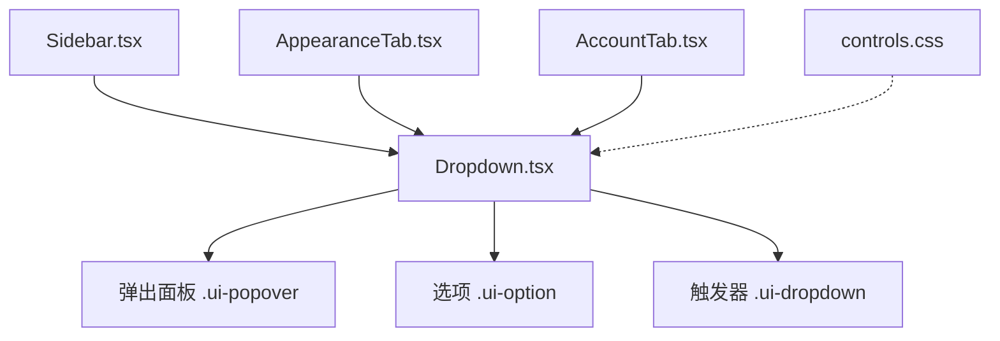
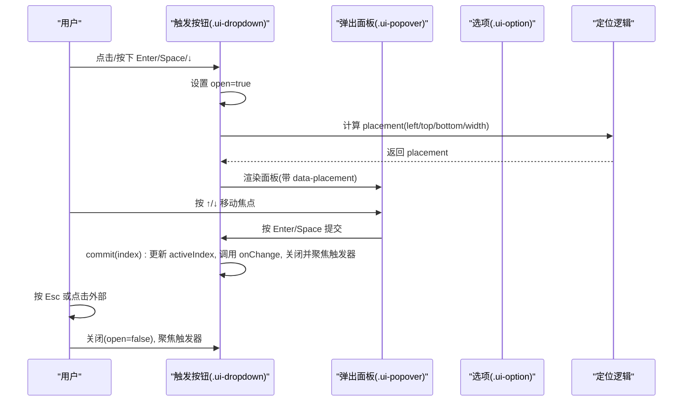
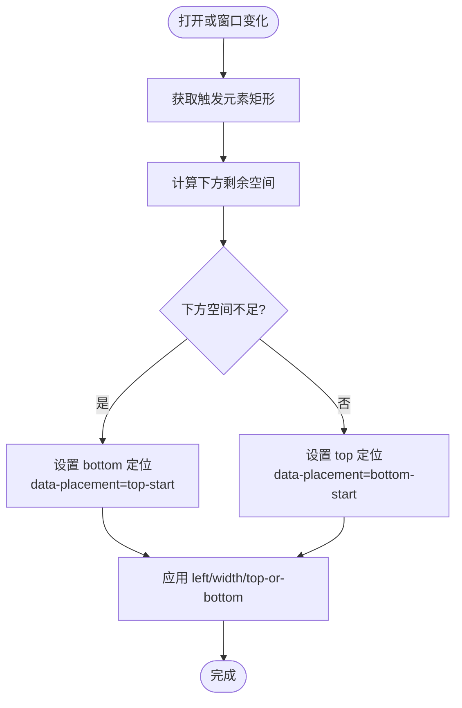
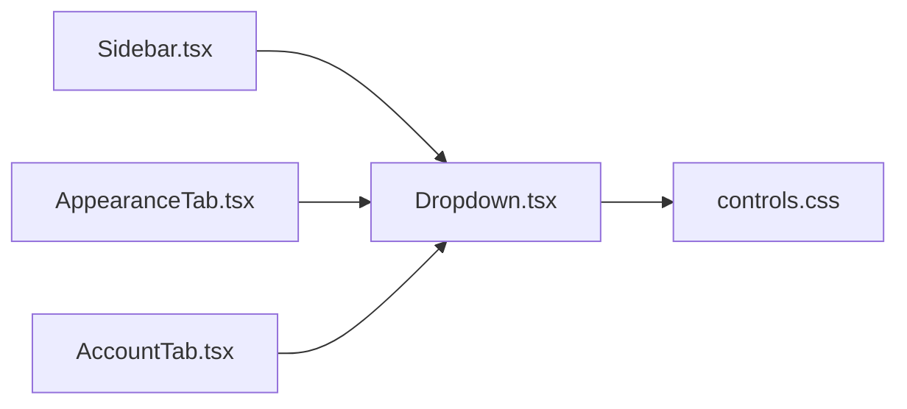

# Dropdown下拉菜单组件

<cite>
**本文引用的文件**
- [Dropdown.tsx](file://frontend/app/shell/Dropdown.tsx)
- [controls.css](file://frontend/src/styles/controls.css)
- [Sidebar.tsx](file://frontend/app/shell/Sidebar.tsx)
- [AppearanceTab.tsx](file://frontend/app/views/settings/tabs/AppearanceTab.tsx)
- [AccountTab.tsx](file://frontend/app/views/settings/tabs/AccountTab.tsx)
</cite>

## 目录
1. [简介](#简介)
2. [项目结构](#项目结构)
3. [核心组件](#核心组件)
4. [架构总览](#架构总览)
5. [详细组件分析](#详细组件分析)
6. [依赖关系分析](#依赖关系分析)
7. [性能考虑](#性能考虑)
8. [故障排查指南](#故障排查指南)
9. [结论](#结论)
10. [附录：使用示例与配置参数](#附录使用示例与配置参数)

## 简介
本组件为声明式列表框（listbox）风格的下拉菜单，提供键盘导航、无障碍访问和智能定位能力。它通过一个触发按钮与一个固定定位的弹出面板组成，支持以下交互：
- 打开：点击、向下箭头、回车、空格
- 导航：向上/向下箭头移动焦点项；回车或空格确认选择；Esc 取消并返回触发按钮
- 关闭：点击外部区域、Esc、选择后自动关闭
- 定位：根据视口空间自动翻转至上方或下方显示

该实现保持与原有命令式实现的交互一致性，同时以 React 声明式方式组织状态与渲染。

## 项目结构
- 组件实现位于前端应用壳层中，作为通用 UI 控件被多处复用
- 样式定义在统一的控件样式文件中，包含弹出面板、选项、触发器及主题适配
- 多个页面通过传入 items/value/onChange 等属性进行数据绑定与事件处理

图表来源
- [Dropdown.tsx:15-214](file://frontend/app/shell/Dropdown.tsx#L15-L214)
- [controls.css:193-328](file://frontend/src/styles/controls.css#L193-L328)

章节来源
- [Dropdown.tsx:15-214](file://frontend/app/shell/Dropdown.tsx#L15-L214)
- [controls.css:193-328](file://frontend/src/styles/controls.css#L193-L328)

## 核心组件
- 组件名称：Dropdown
- 输入数据结构：
  - items：数组，每项包含 value 与 label
  - value：当前选中值
  - onChange：选择变更回调
  - disabled：是否禁用
  - className：附加类名
  - ariaLabel：无障碍标签
  - children：自定义触发内容（可选）
  - showDefaultLabel：是否显示默认标签与箭头（默认 true）
- 内部状态：
  - open：是否展开
  - activeIndex：当前高亮/聚焦的索引
  - placement：弹出面板位置信息（left/top/bottom/width）
- 关键行为：
  - 键盘导航：ArrowUp/ArrowDown 切换 activeIndex；Enter/Space 提交；Esc 关闭并回到触发器
  - 外部点击：pointerdown 监听文档级事件，点击非触发器和面板区域时关闭
  - 定位计算：基于触发元素矩形与窗口高度判断是否需要翻转到上方
  - 焦点管理：选择后聚焦回触发器；面板可聚焦用于键盘操作

章节来源
- [Dropdown.tsx:17-37](file://frontend/app/shell/Dropdown.tsx#L17-L37)
- [Dropdown.tsx:44-127](file://frontend/app/shell/Dropdown.tsx#L44-L127)
- [Dropdown.tsx:129-157](file://frontend/app/shell/Dropdown.tsx#L129-L157)
- [Dropdown.tsx:159-214](file://frontend/app/shell/Dropdown.tsx#L159-L214)

## 架构总览
下图展示了用户交互到状态更新与渲染的流程，以及定位算法的关键分支。

图表来源
- [Dropdown.tsx:69-120](file://frontend/app/shell/Dropdown.tsx#L69-L120)
- [Dropdown.tsx:138-157](file://frontend/app/shell/Dropdown.tsx#L138-L157)
- [Dropdown.tsx:159-214](file://frontend/app/shell/Dropdown.tsx#L159-L214)

## 详细组件分析

### 交互模式
- 打开方式：点击触发器、按下 Enter/Space、按下向下箭头
- 关闭方式：
  - 选择某项后自动关闭
  - 按下 Esc 取消并返回触发器
  - 点击面板外任意区域关闭
- 键盘导航：
  - 在面板内：↑/↓ 移动焦点项；Enter/Space 确认；Esc 取消
  - 在触发器上：↓/Enter/Space 打开；其他键不触发（避免冲突）
- 焦点管理：
  - 打开时面板可聚焦（tabIndex=-1），确保键盘可达
  - 选择后焦点回到触发器，保证连续操作的连贯性
  - 外部点击时关闭并聚焦触发器

章节来源
- [Dropdown.tsx:98-127](file://frontend/app/shell/Dropdown.tsx#L98-L127)
- [Dropdown.tsx:138-157](file://frontend/app/shell/Dropdown.tsx#L138-L157)
- [Dropdown.tsx:159-214](file://frontend/app/shell/Dropdown.tsx#L159-L214)

### 定位算法
- 计算触发元素的 getBoundingClientRect，取宽度与最小宽度约束
- 计算剩余空间：window.innerHeight - rect.bottom
- 若下方空间不足且顶部高于剩余空间，则翻转至上侧（bottom 定位）；否则置于下侧（top 定位）
- 监听 window resize 与 scroll 事件，动态更新 placement，确保始终可见
- 通过 data-placement 区分 bottom-start 与 top-start，配合 CSS 控制偏移

图表来源
- [Dropdown.tsx:71-96](file://frontend/app/shell/Dropdown.tsx#L71-L96)
- [controls.css:216-229](file://frontend/src/styles/controls.css#L216-L229)

章节来源
- [Dropdown.tsx:71-96](file://frontend/app/shell/Dropdown.tsx#L71-L96)
- [controls.css:193-229](file://frontend/src/styles/controls.css#L193-L229)

### 键盘导航支持
- 触发器按键：
  - ArrowDown / Enter / Space：阻止默认行为并打开面板
- 面板按键：
  - ArrowDown：activeIndex+1（边界保护）
  - ArrowUp：activeIndex-1（边界保护）
  - Enter / Space：commit(activeIndex)，更新值并关闭
  - Escape：关闭并聚焦触发器
- 无障碍语义：
  - 触发器：aria-haspopup="listbox"，aria-expanded 反映展开状态
  - 面板：role="listbox"，tabIndex=-1 以便键盘聚焦
  - 选项：role="option"，aria-selected 标记当前选中项

章节来源
- [Dropdown.tsx:138-157](file://frontend/app/shell/Dropdown.tsx#L138-L157)
- [Dropdown.tsx:159-214](file://frontend/app/shell/Dropdown.tsx#L159-L214)

### 菜单项数据结构与动态渲染
- 数据结构：
  - items: Array<{value: string; label: string}>
  - value: string（当前选中值）
  - onChange(value: string): void（选择变更回调）
- 渲染策略：
  - 默认显示 selected.label 与下拉箭头；可通过 children 自定义触发内容
  - 选项列表通过 items.map 渲染，每个选项为 button，具备 role="option" 与 aria-selected
  - 支持 showDefaultLabel 控制是否显示默认标签与箭头

章节来源
- [Dropdown.tsx:17-37](file://frontend/app/shell/Dropdown.tsx#L17-L37)
- [Dropdown.tsx:159-214](file://frontend/app/shell/Dropdown.tsx#L159-L214)

### 事件处理机制
- 打开/关闭：
  - 触发器 onClick：切换 open 状态（disabled 时忽略）
  - 外部 pointerdown：检测目标是否在面板或触发器内，否则关闭
  - 文档 keydown：Escape 关闭并聚焦触发器
- 选择提交：
  - commit(index)：更新 activeIndex，调用 onChange（仅当值变化），关闭并聚焦触发器
- 键盘事件：
  - onAnchorKeyDown：打开面板
  - onListKeyDown：导航与提交

章节来源
- [Dropdown.tsx:98-127](file://frontend/app/shell/Dropdown.tsx#L98-L127)
- [Dropdown.tsx:129-157](file://frontend/app/shell/Dropdown.tsx#L129-L157)
- [Dropdown.tsx:159-178](file://frontend/app/shell/Dropdown.tsx#L159-L178)

### 与焦点管理、无障碍访问和屏幕阅读器的兼容性
- 焦点管理：
  - 面板可聚焦（tabIndex=-1），键盘可在面板内导航
  - 选择后焦点回到触发器，保证可预测的焦点流
- 无障碍语义：
  - 触发器：aria-haspopup="listbox"，aria-expanded 同步展开状态
  - 面板：role="listbox"，aria-labelledby 可由 ariaLabel 提供
  - 选项：role="option"，aria-selected 指示当前选中项
- 屏幕阅读器：
  - 通过语义化角色与属性，屏幕阅读器可正确播报“列表框”、“选项”、“已选择”等信息
  - 禁用态通过 disabled 与样式提示，减少误操作

章节来源
- [Dropdown.tsx:159-214](file://frontend/app/shell/Dropdown.tsx#L159-L214)

### 样式定制方法
- 触发器：
  - 基础类：ui-dropdown
  - 禁用态：ui-dropdown:disabled
  - 标签与箭头：ui-dropdown-label、ui-dropdown-caret
- 弹出面板：
  - 容器：ui-popover，支持滚动与最大尺寸限制
  - 定位：data-placement 控制 bottom-start 或 top-start
- 选项：
  - 类：ui-option
  - 悬停/激活：ui-option:hover、[data-active="true"]
  - 选中：[aria-selected="true"]
  - 禁用：:disabled 或 [aria-disabled="true"]
- 主题：
  - 深色模式：html.theme-dark .ui-popover 覆盖背景色
  - 自定义主题：settings-pages.css 中的 .ui-dropdown.theme-font-select 展示如何扩展样式

章节来源
- [controls.css:193-328](file://frontend/src/styles/controls.css#L193-L328)
- [controls.css:211-229](file://frontend/src/styles/controls.css#L211-L229)
- [controls.css:243-279](file://frontend/src/styles/controls.css#L243-L279)
- [controls.css:297-328](file://frontend/src/styles/controls.css#L297-L328)

## 依赖关系分析
- 组件依赖：
  - React Hooks：useState、useEffect、useRef、useCallback
  - DOM API：getBoundingClientRect、addEventListener/removeEventListener
- 样式依赖：
  - controls.css 中的 ui-popover、ui-option、ui-dropdown 等类
- 使用方依赖：
  - Sidebar.tsx：传递模型与思考等级数据
  - AppearanceTab.tsx：字体与代码字体选择
  - AccountTab.tsx：协议选择与提供者选择

图表来源
- [Sidebar.tsx:207-226](file://frontend/app/shell/Sidebar.tsx#L207-L226)
- [AppearanceTab.tsx:289-357](file://frontend/app/views/settings/tabs/AppearanceTab.tsx#L289-L357)
- [AccountTab.tsx:161-173](file://frontend/app/views/settings/tabs/AccountTab.tsx#L161-L173)
- [Dropdown.tsx:15-214](file://frontend/app/shell/Dropdown.tsx#L15-L214)
- [controls.css:193-328](file://frontend/src/styles/controls.css#L193-L328)

章节来源
- [Sidebar.tsx:207-226](file://frontend/app/shell/Sidebar.tsx#L207-L226)
- [AppearanceTab.tsx:289-357](file://frontend/app/views/settings/tabs/AppearanceTab.tsx#L289-L357)
- [AccountTab.tsx:161-173](file://frontend/app/views/settings/tabs/AccountTab.tsx#L161-L173)
- [Dropdown.tsx:15-214](file://frontend/app/shell/Dropdown.tsx#L15-L214)
- [controls.css:193-328](file://frontend/src/styles/controls.css#L193-L328)

## 性能考虑
- 定位计算：
  - 仅在 open 为真时注册 resize/scroll 监听，避免不必要的开销
  - 使用 requestAnimationFrame 或节流可进一步优化高频滚动场景（当前实现直接监听，适合一般场景）
- 渲染优化：
  - items 数量较大时可考虑虚拟滚动（当前未实现，按需扩展）
  - 使用 key={item.value} 提升列表渲染效率
- 事件处理：
  - 外部点击使用捕获阶段监听，确保先于子元素冒泡处理关闭逻辑
- 无障碍与可访问性：
  - 合理设置 role/aria-* 属性，有助于屏幕阅读器高效解析

[本节为通用指导，不直接分析具体文件]

## 故障排查指南
- 问题：面板被遮挡或溢出视口
  - 检查定位逻辑是否正确计算 spaceBelow 与 FLIP_THRESHOLD
  - 确认 CSS 中 data-placement 对应的 top/bottom 偏移是否正确
- 问题：键盘导航无效
  - 确认面板具有 tabIndex=-1 且 role="listbox"
  - 检查 onListKeyDown 是否正确阻止默认行为并更新 activeIndex
- 问题：选择后未聚焦回触发器
  - 确认 commit 中调用了 anchorRef.current?.focus()
- 问题：外部点击未关闭
  - 检查 pointerdown 监听是否注册在文档捕获阶段，且排除面板与触发器
- 问题：禁用态仍可操作
  - 确认 disabled 属性正确传递并在 onClick/onKeyDown 中提前返回

章节来源
- [Dropdown.tsx:71-96](file://frontend/app/shell/Dropdown.tsx#L71-L96)
- [Dropdown.tsx:98-127](file://frontend/app/shell/Dropdown.tsx#L98-L127)
- [Dropdown.tsx:129-157](file://frontend/app/shell/Dropdown.tsx#L129-L157)
- [Dropdown.tsx:159-214](file://frontend/app/shell/Dropdown.tsx#L159-L214)
- [controls.css:216-229](file://frontend/src/styles/controls.css#L216-L229)

## 结论
Dropdown 组件以声明式方式实现了稳定的下拉菜单交互，具备完善的键盘导航、无障碍支持与智能定位。其简洁的数据结构与清晰的职责划分使其易于复用与扩展。结合样式系统，可快速适配不同主题与布局需求。对于大数据量场景，可进一步引入虚拟化与节流优化以提升性能。

[本节为总结性内容，不直接分析具体文件]

## 附录：使用示例与配置参数

### 基本用法
- 传入 items/value/onChange 即可实现受控下拉菜单
- 示例参考：
  - 模型选择：[Sidebar.tsx:207-218](file://frontend/app/shell/Sidebar.tsx#L207-L218)
  - 思考等级选择：[Sidebar.tsx:222-226](file://frontend/app/shell/Sidebar.tsx#L222-L226)
  - 字体选择：[AppearanceTab.tsx:289-357](file://frontend/app/views/settings/tabs/AppearanceTab.tsx#L289-L357)
  - 协议选择：[AccountTab.tsx:287-297](file://frontend/app/views/settings/tabs/AccountTab.tsx#L287-L297)

### 配置参数
- items：[{value, label}] 数组
- value：当前选中值
- onChange：选择变更回调
- disabled：是否禁用
- className：附加类名
- ariaLabel：无障碍标签
- children：自定义触发内容
- showDefaultLabel：是否显示默认标签与箭头

### 样式定制
- 触发器：.ui-dropdown、.ui-dropdown-label、.ui-dropdown-caret
- 弹出面板：.ui-popover（含 data-placement）
- 选项：.ui-option（含 :hover、[aria-selected="true"]、:disabled）
- 主题：html.theme-dark .ui-popover 覆盖背景；settings-pages.css 中的 .ui-dropdown.theme-font-select 展示扩展方式

章节来源
- [Sidebar.tsx:207-226](file://frontend/app/shell/Sidebar.tsx#L207-L226)
- [AppearanceTab.tsx:289-357](file://frontend/app/views/settings/tabs/AppearanceTab.tsx#L289-L357)
- [AccountTab.tsx:287-297](file://frontend/app/views/settings/tabs/AccountTab.tsx#L287-L297)
- [controls.css:193-328](file://frontend/src/styles/controls.css#L193-L328)