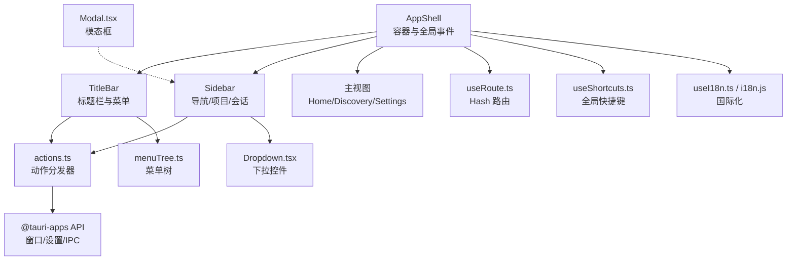
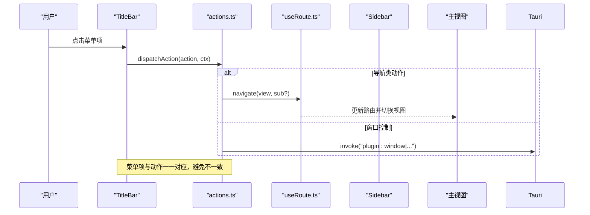
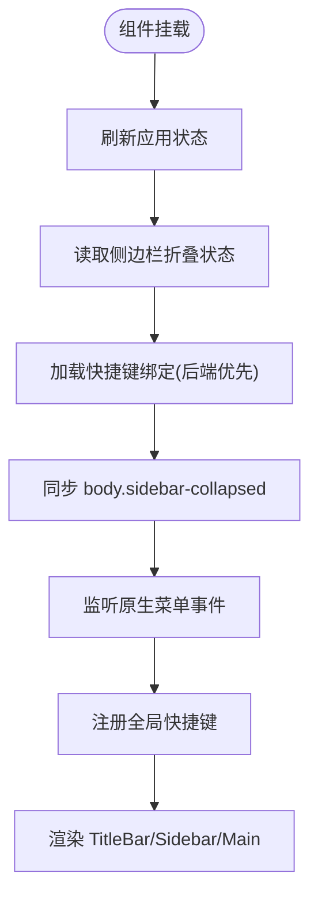
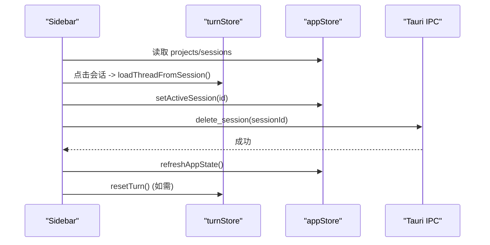
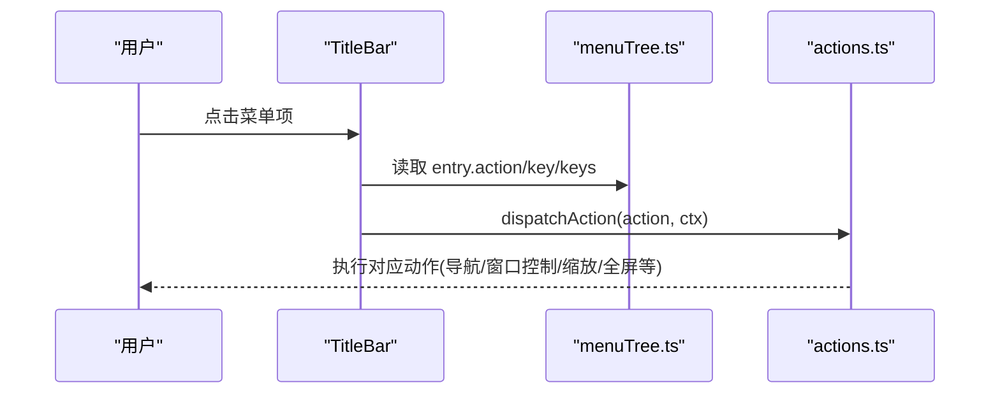
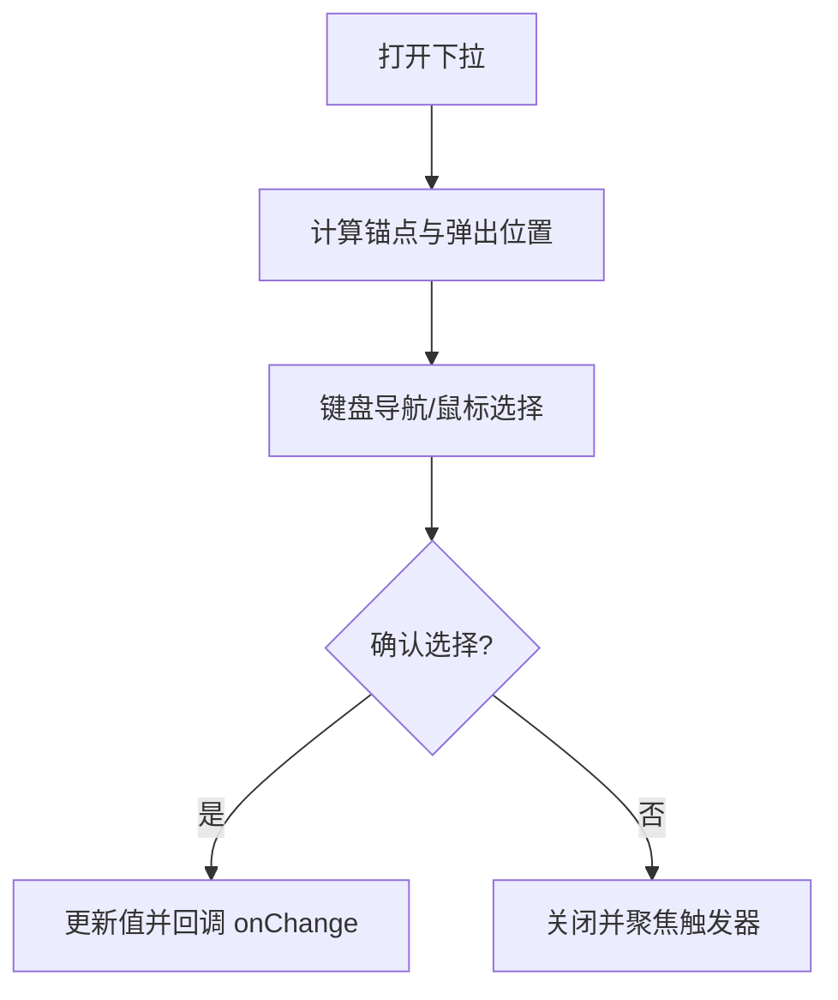
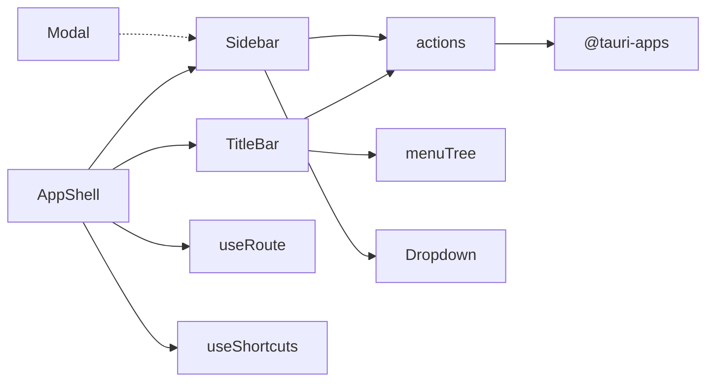

# Shell组件

<cite>
**本文引用的文件**
- [AppShell.tsx](file://frontend/app/shell/AppShell.tsx)
- [Sidebar.tsx](file://frontend/app/shell/Sidebar.tsx)
- [TitleBar.tsx](file://frontend/app/shell/TitleBar.tsx)
- [Dropdown.tsx](file://frontend/app/shell/Dropdown.tsx)
- [Modal.tsx](file://frontend/app/shell/Modal.tsx)
- [actions.ts](file://frontend/app/shell/actions.ts)
- [menuTree.ts](file://frontend/app/shell/menuTree.ts)
- [useRoute.ts](file://frontend/app/shell/useRoute.ts)
- [useShortcuts.ts](file://frontend/app/shell/useShortcuts.ts)
- [useI18n.ts](file://frontend/app/shell/useI18n.ts)
- [i18n.js](file://frontend/src/js/i18n.js)
- [shell.css](file://frontend/src/styles/shell.css)
</cite>

## 目录
1. [简介](#简介)
2. [项目结构](#项目结构)
3. [核心组件](#核心组件)
4. [架构总览](#架构总览)
5. [详细组件分析](#详细组件分析)
6. [依赖关系分析](#依赖关系分析)
7. [性能考虑](#性能考虑)
8. [故障排查指南](#故障排查指南)
9. [结论](#结论)
10. [附录：接口与使用示例](#附录接口与使用示例)

## 简介
本文件为 Codex-Tauri 的 Shell 组件系统提供系统化文档，聚焦应用壳层（AppShell、Sidebar、TitleBar）以及下拉菜单、模态框等关键 UI 组件。内容涵盖设计模式、实现原理、组件通信机制、状态管理、事件处理、响应式布局、国际化支持、可访问性设计、生命周期管理、性能优化策略与错误处理机制，并提供具体使用示例、Props 接口定义与样式定制指南。

## 项目结构
Shell 相关代码集中在 frontend/app/shell 目录下，配合全局路由、快捷键、国际化与样式形成完整的“外壳”体系：
- 顶层容器：AppShell 负责标题栏、侧边栏与主视图的编排，并挂载全局事件与快捷键。
- 导航与布局：Sidebar 提供导航、项目列表、最近会话、模型与思考等级调节；TitleBar 提供窗口控制与内嵌菜单。
- 通用控件：Dropdown 提供声明式下拉列表；Modal 提供对话框。
- 行为中枢：actions.ts 集中分发所有菜单/快捷键动作；menuTree.ts 作为菜单树唯一数据源。
- 基础设施：useRoute.ts 基于 Hash 的路由；useShortcuts.ts 全局快捷键监听；useI18n.ts 订阅语言变更以驱动重渲染；i18n.js 提供多语言资源；shell.css 提供响应式布局与主题变量。

图表来源
- [AppShell.tsx:78-205](file://frontend/app/shell/AppShell.tsx#L78-L205)
- [TitleBar.tsx:26-164](file://frontend/app/shell/TitleBar.tsx#L26-L164)
- [Sidebar.tsx:89-351](file://frontend/app/shell/Sidebar.tsx#L89-L351)
- [actions.ts:57-201](file://frontend/app/shell/actions.ts#L57-L201)
- [menuTree.ts:24-87](file://frontend/app/shell/menuTree.ts#L24-L87)
- [useRoute.ts:40-79](file://frontend/app/shell/useRoute.ts#L40-L79)
- [useShortcuts.ts:104-146](file://frontend/app/shell/useShortcuts.ts#L104-L146)
- [useI18n.ts:12-14](file://frontend/app/shell/useI18n.ts#L12-L14)
- [i18n.js:4-12](file://frontend/src/js/i18n.js#L4-L12)

章节来源
- [AppShell.tsx:78-205](file://frontend/app/shell/AppShell.tsx#L78-L205)
- [TitleBar.tsx:26-164](file://frontend/app/shell/TitleBar.tsx#L26-L164)
- [Sidebar.tsx:89-351](file://frontend/app/shell/Sidebar.tsx#L89-L351)
- [actions.ts:57-201](file://frontend/app/shell/actions.ts#L57-L201)
- [menuTree.ts:24-87](file://frontend/app/shell/menuTree.ts#L24-L87)
- [useRoute.ts:40-79](file://frontend/app/shell/useRoute.ts#L40-L79)
- [useShortcuts.ts:104-146](file://frontend/app/shell/useShortcuts.ts#L104-L146)
- [useI18n.ts:12-14](file://frontend/app/shell/useI18n.ts#L12-L14)
- [i18n.js:4-12](file://frontend/src/js/i18n.js#L4-L12)

## 核心组件
- AppShell：应用壳层容器，组合标题栏、侧边栏与主视图；初始化全局事件监听（原生菜单事件）、加载设置、恢复侧边栏折叠状态、注册全局快捷键；通过上下文对象向子组件暴露导航、焦点、任务切换等操作能力。
- Sidebar：品牌区、顶部导航、待决权限提示、模型与思考等级快速调节、项目列表、最近会话、底部用户与帮助入口；支持删除会话、右键菜单、国际化文案。
- TitleBar：无装饰标题栏，包含导航按钮、内嵌菜单（File/Edit/View/Help）、窗口控制（最小化/最大化/关闭）；菜单项来自 menuTree，点击后统一走 actions 分发。
- Dropdown：声明式下拉列表，支持键盘导航、自动翻转定位、无障碍属性、自定义触发器与标签。
- Modal：对话框，支持 Esc/遮罩关闭、首选项聚焦、动作回调与防重复关闭。

章节来源
- [AppShell.tsx:78-205](file://frontend/app/shell/AppShell.tsx#L78-L205)
- [Sidebar.tsx:89-351](file://frontend/app/shell/Sidebar.tsx#L89-L351)
- [TitleBar.tsx:26-164](file://frontend/app/shell/TitleBar.tsx#L26-L164)
- [Dropdown.tsx:44-215](file://frontend/app/shell/Dropdown.tsx#L44-L215)
- [Modal.tsx:33-126](file://frontend/app/shell/Modal.tsx#L33-L126)

## 架构总览
Shell 采用“容器 + 行为中枢 + 数据源”的分层模式：
- 容器层：AppShell 组织 UI 布局与生命周期；TitleBar/Sidebar 负责各自区域交互。
- 行为中枢：actions.ts 集中处理所有动作（菜单/快捷键/窗口控制/剪贴板/缩放/全屏等），屏蔽底层差异。
- 数据源：menuTree.ts 提供菜单树；useRoute.ts 提供路由；useShortcuts.ts 提供快捷键绑定；i18n.js 提供多语言。
- 外部集成：@tauri-apps 用于窗口控制、设置读写、IPC；CSS 变量与 body class 驱动响应式布局。

图表来源
- [TitleBar.tsx:48-51](file://frontend/app/shell/TitleBar.tsx#L48-L51)
- [actions.ts:57-201](file://frontend/app/shell/actions.ts#L57-L201)
- [useRoute.ts:48-54](file://frontend/app/shell/useRoute.ts#L48-L54)

## 详细组件分析

### AppShell：应用壳层容器
- 职责
  - 组合 TitleBar、Sidebar、主视图与设置页。
  - 启动时刷新应用状态、读取侧边栏折叠偏好、加载快捷键绑定（优先后端列表，否则回退到菜单树）。
  - 同步 body 的 sidebar-collapsed/settings-open class，使 CSS 规则生效。
  - 监听原生菜单事件（menu），将 action 字符串交由 dispatchAction 处理。
  - 通过 useShortcutDispatcher 将全局快捷键映射到同一动作通道。
  - 提供 ShellContext：navigate、toggleSidebar、focusComposer、addProject、stepTask。
- 关键点
  - 侧边栏折叠通过 body class 控制，保持与现有样式一致。
  - 设置持久化采用“尽力而为”，不阻塞渲染。
  - 快捷键绑定支持字符串或数组形式，解析为标准化键序列。
  - 原生菜单事件与全局快捷键最终汇聚到同一动作分发器，保证一致性。

图表来源
- [AppShell.tsx:84-117](file://frontend/app/shell/AppShell.tsx#L84-L117)
- [AppShell.tsx:163-186](file://frontend/app/shell/AppShell.tsx#L163-L186)

章节来源
- [AppShell.tsx:78-205](file://frontend/app/shell/AppShell.tsx#L78-L205)

### Sidebar：侧边栏导航与项目管理
- 职责
  - 顶部导航（新任务、定时任务、插件、PR）。
  - 待决权限请求徽章入口。
  - 模型与思考等级快速调节（使用 Dropdown）。
  - 项目列表与最近会话列表，支持选择、删除、右键菜单。
  - 底部用户与帮助入口。
- 交互与状态
  - 使用 appStore 获取项目与会话数据，结合 turnStore 进行会话切换与重置。
  - 删除会话调用后端 IPC，成功后刷新状态并清理当前会话。
  - 通过 useI18n 确保界面文本随语言切换而更新。
- 可访问性
  - 图标按钮提供 aria-label/title；导航项使用 button 元素；列表项具备语义化结构。

图表来源
- [Sidebar.tsx:98-128](file://frontend/app/shell/Sidebar.tsx#L98-L128)
- [Sidebar.tsx:265-297](file://frontend/app/shell/Sidebar.tsx#L265-L297)

章节来源
- [Sidebar.tsx:89-351](file://frontend/app/shell/Sidebar.tsx#L89-L351)

### TitleBar：标题栏与内嵌菜单
- 职责
  - 导航按钮（后退/前进）、侧边栏切换。
  - 内嵌菜单（File/Edit/View/Help），菜单项来自 menuTree。
  - 窗口控制（最小化/最大化/关闭）。
- 交互
  - 菜单打开/关闭状态本地维护，点击外部或按 Escape 关闭。
  - 菜单项点击统一调用 dispatchAction，确保与快捷键路径一致。
- 可访问性
  - 菜单面板 role="menu"，菜单项 role="menuitem"，分隔符 role="separator"。
  - 按钮具备 aria-label，菜单触发器具备 aria-haspopup/aria-expanded。

图表来源
- [TitleBar.tsx:92-127](file://frontend/app/shell/TitleBar.tsx#L92-L127)
- [menuTree.ts:24-87](file://frontend/app/shell/menuTree.ts#L24-L87)
- [actions.ts:57-201](file://frontend/app/shell/actions.ts#L57-L201)

章节来源
- [TitleBar.tsx:26-164](file://frontend/app/shell/TitleBar.tsx#L26-L164)
- [menuTree.ts:24-87](file://frontend/app/shell/menuTree.ts#L24-L87)
- [actions.ts:57-201](file://frontend/app/shell/actions.ts#L57-L201)

### Dropdown：下拉控件
- 行为
  - 支持点击/Enter/Space 打开，ArrowUp/Down 移动，Enter/Space 提交，Escape 取消。
  - 自动计算弹出位置，空间不足时向上翻转。
  - 支持自定义触发器与默认标签显示。
- 可访问性
  - 触发器 aria-haspopup="listbox"，弹出列表 role="listbox"，选项 role="option"，active 项 aria-selected。
- 性能
  - 使用固定定位减少重排；在 open 状态下监听 resize/scroll 仅做必要定位计算。

图表来源
- [Dropdown.tsx:71-96](file://frontend/app/shell/Dropdown.tsx#L71-L96)
- [Dropdown.tsx:129-157](file://frontend/app/shell/Dropdown.tsx#L129-L157)
- [Dropdown.tsx:159-215](file://frontend/app/shell/Dropdown.tsx#L159-L215)

章节来源
- [Dropdown.tsx:44-215](file://frontend/app/shell/Dropdown.tsx#L44-L215)

### Modal：模态框
- 行为
  - 支持 Esc/遮罩关闭，首次打开聚焦主操作按钮。
  - 动作回调中可选择是否保持打开。
  - 防止重复关闭（竞态保护）。
- 可访问性
  - 面板 role="dialog"，aria-modal="true"，标题 aria-label。

章节来源
- [Modal.tsx:33-126](file://frontend/app/shell/Modal.tsx#L33-L126)

## 依赖关系分析
- 组件耦合
  - AppShell 强依赖 TitleBar、Sidebar、useRoute、useShortcuts、actions、menuTree。
  - Sidebar 依赖 appStore、turnStore、useI18n、Dropdown、ContextMenu（未在本节展开）。
  - TitleBar 依赖 menuTree、actions、useI18n。
  - Dropdown 与 Modal 为独立通用控件，低耦合。
- 外部依赖
  - @tauri-apps/api/core 用于 IPC（get_settings/save_settings/delete_session 等）。
  - @tauri-apps/api/event 用于监听原生菜单事件。
  - shell.css 通过 body class 与 CSS 变量控制布局与主题。
- 潜在循环依赖
  - 通过 actions 解耦 UI 与业务逻辑，避免组件间直接调用导致的循环依赖。

图表来源
- [AppShell.tsx:14-24](file://frontend/app/shell/AppShell.tsx#L14-L24)
- [TitleBar.tsx:9-13](file://frontend/app/shell/TitleBar.tsx#L9-L13)
- [Sidebar.tsx:7-27](file://frontend/app/shell/Sidebar.tsx#L7-L27)
- [actions.ts:14-17](file://frontend/app/shell/actions.ts#L14-L17)
- [menuTree.ts:24-87](file://frontend/app/shell/menuTree.ts#L24-L87)
- [useRoute.ts:9-14](file://frontend/app/shell/useRoute.ts#L9-L14)
- [useShortcuts.ts:11-17](file://frontend/app/shell/useShortcuts.ts#L11-L17)

章节来源
- [AppShell.tsx:14-24](file://frontend/app/shell/AppShell.tsx#L14-L24)
- [TitleBar.tsx:9-13](file://frontend/app/shell/TitleBar.tsx#L9-L13)
- [Sidebar.tsx:7-27](file://frontend/app/shell/Sidebar.tsx#L7-L27)
- [actions.ts:14-17](file://frontend/app/shell/actions.ts#L14-L17)
- [menuTree.ts:24-87](file://frontend/app/shell/menuTree.ts#L24-L87)
- [useRoute.ts:9-14](file://frontend/app/shell/useRoute.ts#L9-L14)
- [useShortcuts.ts:11-17](file://frontend/app/shell/useShortcuts.ts#L11-L17)

## 性能考虑
- 渲染优化
  - 使用 useMemo 缓存 ShellContext，避免不必要的重新创建。
  - 使用 useCallback 稳定事件处理器引用，减少子组件重渲染。
  - 快捷键监听使用 useRef 保存最新绑定与回调，避免重复注册。
- 布局与重排
  - 侧边栏折叠通过 body class 切换，利用 CSS Grid 与 visibility 控制，减少 DOM 操作。
  - Dropdown 使用 fixed 定位与最小宽度约束，降低重排成本。
- 网络与 I/O
  - 设置读取/写入采用“尽力而为”，失败不影响渲染流程。
  - 删除会话后异步刷新状态，避免阻塞用户操作。
- 可访问性与输入
  - 编辑类快捷键（撤销/重做/剪切/复制/粘贴/删除/全选）透传给 WebView 原生处理，避免覆盖浏览器默认行为导致性能与体验问题。

章节来源
- [AppShell.tsx:132-160](file://frontend/app/shell/AppShell.tsx#L132-L160)
- [useShortcuts.ts:104-146](file://frontend/app/shell/useShortcuts.ts#L104-L146)
- [Dropdown.tsx:71-96](file://frontend/app/shell/Dropdown.tsx#L71-L96)
- [actions.ts:101-122](file://frontend/app/shell/actions.ts#L101-L122)

## 故障排查指南
- 菜单与快捷键无效
  - 检查 menuTree 是否定义了相应 action。
  - 确认 actions.ts 已实现该 action 分支。
  - 验证 useShortcutDispatcher 是否正确注册且未被输入框拦截。
- 侧边栏状态不同步
  - 检查 AppShell 是否在挂载时读取了设置并同步 body class。
  - 确认 toggleSidebar 调用 save_settings 成功。
- 国际化未更新
  - 确认组件使用了 useI18n hook 订阅语言变更。
  - 检查 i18n.js 是否包含对应 key 及翻译。
- 下拉菜单定位异常
  - 检查父级滚动容器与窗口尺寸变化事件是否触发定位更新。
  - 确认 CSS 未覆盖 ui-popover 的定位样式。
- 模态框重复关闭
  - 确认 onClose 回调未抛出异常；Modal 内部已做竞态保护。

章节来源
- [AppShell.tsx:84-130](file://frontend/app/shell/AppShell.tsx#L84-L130)
- [useI18n.ts:12-14](file://frontend/app/shell/useI18n.ts#L12-L14)
- [i18n.js:4-12](file://frontend/src/js/i18n.js#L4-L12)
- [Dropdown.tsx:71-96](file://frontend/app/shell/Dropdown.tsx#L71-L96)
- [Modal.tsx:45-77](file://frontend/app/shell/Modal.tsx#L45-L77)

## 结论
Codex-Tauri 的 Shell 组件系统通过清晰的容器-行为-数据分层，实现了可扩展、可维护的壳层架构。AppShell 作为编排中心，TitleBar 与 Sidebar 专注各自领域，actions 统一收敛所有交互意图，配合 menuTree、useRoute、useShortcuts、i18n 与 shell.css，提供了完善的导航、菜单、快捷键、路由、国际化与响应式布局能力。组件遵循可访问性规范，注重性能与健壮性，适合持续演进与扩展。

## 附录：接口与使用示例

### Props 接口定义
- TitleBar
  - ctx: ShellContext
  - sidebarCollapsed: boolean
  - onToggleSidebar: () => void
- Sidebar
  - ctx: ShellContext
  - collapsed: boolean
- Dropdown
  - items: { value: string; label: string }[]
  - value: string
  - onChange: (value: string) => void
  - disabled?: boolean
  - className?: string
  - ariaLabel?: string
  - children?: React.ReactNode
  - showDefaultLabel?: boolean
- Modal
  - open: boolean
  - title?: string
  - children?: ReactNode
  - actions?: Array<{ label: string; variant?: "primary" | "ghost"; closeOnClick?: boolean; onClick?: (close: (reason?: string) => void) => void }>
  - dismissible?: boolean
  - onClose: (reason: string) => void

章节来源
- [TitleBar.tsx:15-19](file://frontend/app/shell/TitleBar.tsx#L15-L19)
- [Sidebar.tsx:84-87](file://frontend/app/shell/Sidebar.tsx#L84-L87)
- [Dropdown.tsx:22-37](file://frontend/app/shell/Dropdown.tsx#L22-L37)
- [Modal.tsx:15-31](file://frontend/app/shell/Modal.tsx#L15-L31)

### 使用示例（概念性说明）
- 在 AppShell 中组合组件
  - 传入 ShellContext 给 TitleBar 与 Sidebar。
  - 根据 route.view 渲染主视图或设置页。
- 在 Sidebar 中使用 Dropdown
  - 传入模型与思考等级选项，onChange 调用 saveSettings 持久化。
- 在 TitleBar 中渲染菜单
  - 遍历 MENU_TREE 生成菜单项，点击调用 dispatchAction。
- 使用 Modal
  - 控制 open 状态，提供 actions 与 onClose 回调，处理用户确认。

章节来源
- [AppShell.tsx:190-205](file://frontend/app/shell/AppShell.tsx#L190-L205)
- [Sidebar.tsx:203-228](file://frontend/app/shell/Sidebar.tsx#L203-L228)
- [TitleBar.tsx:92-127](file://frontend/app/shell/TitleBar.tsx#L92-L127)
- [Modal.tsx:79-126](file://frontend/app/shell/Modal.tsx#L79-L126)

### 样式定制指南
- 主题变量
  - 通过 CSS 变量（如 --bg-sidebar、--fg-primary、--accent 等）调整颜色与字体。
- 布局开关
  - 通过 body.sidebar-collapsed 控制侧边栏显隐与网格列宽。
  - 通过 body.settings-open 切换设置页全屏布局。
- 标题栏拖拽区域
  - 使用 data-tauri-drag-region 或 app-region: drag 启用无边框拖拽。
- 菜单与下拉
  - 菜单面板使用 .desktop-menu-panel，下拉使用 .ui-popover，可通过 CSS 调整阴影、圆角与间距。

章节来源
- [shell.css:85-105](file://frontend/src/styles/shell.css#L85-L105)
- [shell.css:107-133](file://frontend/src/styles/shell.css#L107-L133)
- [shell.css:154-192](file://frontend/src/styles/shell.css#L154-L192)

### 生命周期管理与错误处理
- 生命周期
  - AppShell 在挂载时加载设置与快捷键，并在卸载时移除事件监听。
  - Dropdown/Modal 在 open/close 时注册/移除全局事件，避免内存泄漏。
- 错误处理
  - IPC 调用失败时记录日志且不中断主流程。
  - 未知 action 被忽略，避免崩溃。
  - Modal 动作回调异常捕获并记录。

章节来源
- [AppShell.tsx:84-110](file://frontend/app/shell/AppShell.tsx#L84-L110)
- [actions.ts:31-47](file://frontend/app/shell/actions.ts#L31-L47)
- [Modal.tsx:108-115](file://frontend/app/shell/Modal.tsx#L108-L115)