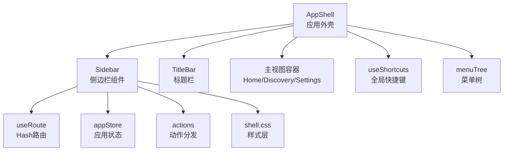
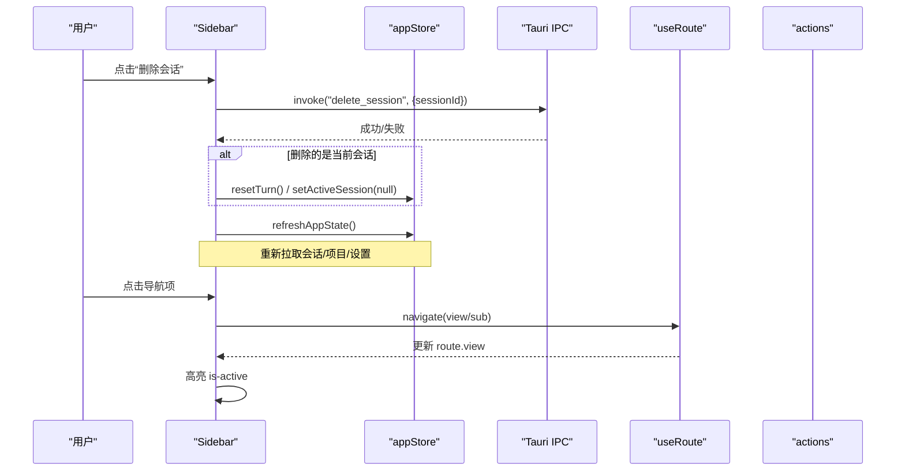
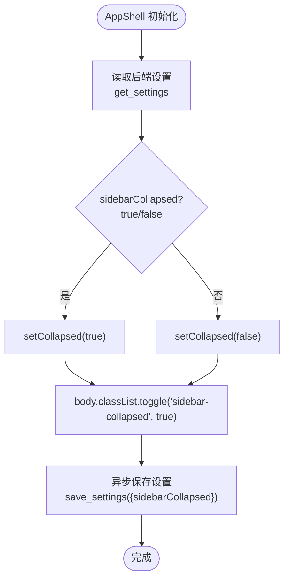
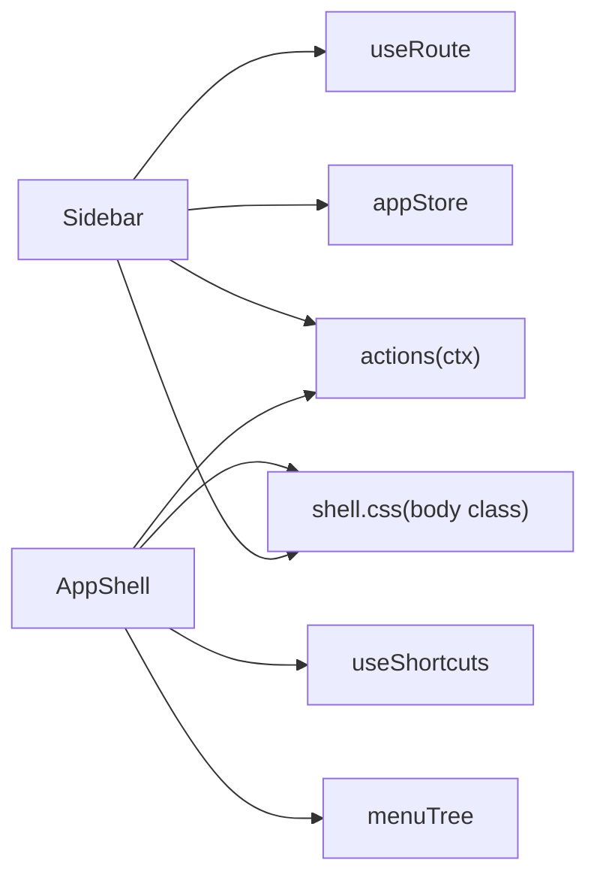

# Sidebar侧边栏组件

<cite>
**本文引用的文件**
- [Sidebar.tsx](file://frontend/app/shell/Sidebar.tsx)
- [AppShell.tsx](file://frontend/app/shell/AppShell.tsx)
- [useRoute.ts](file://frontend/app/shell/useRoute.ts)
- [actions.ts](file://frontend/app/shell/actions.ts)
- [menuTree.ts](file://frontend/app/shell/menuTree.ts)
- [useShortcuts.ts](file://frontend/app/shell/useShortcuts.ts)
- [appStore.ts](file://frontend/app/state/appStore.ts)
- [shell.css](file://frontend/src/styles/shell.css)
</cite>

## 目录
1. [简介](#简介)
2. [项目结构](#项目结构)
3. [核心组件](#核心组件)
4. [架构总览](#架构总览)
5. [详细组件分析](#详细组件分析)
6. [依赖关系分析](#依赖关系分析)
7. [性能考虑](#性能考虑)
8. [故障排查指南](#故障排查指南)
9. [结论](#结论)
10. [附录：使用示例与样式定制](#附录使用示例与样式定制)

## 简介
本文件为 Sidebar 侧边栏组件的完整技术文档，覆盖导航结构设计、菜单项渲染逻辑、用户交互处理、折叠/展开状态管理、响应式行为适配、样式定制选项、与路由系统的集成、活动状态视觉反馈、键盘导航支持、可访问性设计、性能优化策略以及具体使用方式与 Props 接口。

## 项目结构
侧边栏位于前端应用壳（AppShell）中，作为左侧导航区域，承载品牌区、顶部导航、模型与思考等级设置、项目列表、最近会话列表、底部工具区（账户与帮助），并集成权限待决提示与右键上下文菜单。其布局与样式由 shell.css 统一控制，路由通过 useRoute 实现基于 hash 的轻量路由，全局快捷键与菜单动作通过 actions.ts 分发。

图表来源
- [AppShell.tsx:78-205](file://frontend/app/shell/AppShell.tsx#L78-L205)
- [Sidebar.tsx:84-351](file://frontend/app/shell/Sidebar.tsx#L84-L351)
- [useRoute.ts:1-79](file://frontend/app/shell/useRoute.ts#L1-L79)
- [actions.ts:1-201](file://frontend/app/shell/actions.ts#L1-L201)
- [menuTree.ts:1-87](file://frontend/app/shell/menuTree.ts#L1-L87)
- [useShortcuts.ts:1-146](file://frontend/app/shell/useShortcuts.ts#L1-L146)
- [shell.css:85-105](file://frontend/src/styles/shell.css#L85-L105)

章节来源
- [AppShell.tsx:78-205](file://frontend/app/shell/AppShell.tsx#L78-L205)
- [shell.css:85-105](file://frontend/src/styles/shell.css#L85-L105)

## 核心组件
- Sidebar：负责侧边栏 UI 与交互，包括导航按钮、项目列表、最近会话、模型与思考等级选择、权限待决提示、删除会话、上下文菜单等。
- AppShell：应用外壳，维护侧边栏折叠状态、注入 ShellContext、监听菜单事件与全局快捷键、渲染标题栏与主内容区。
- useRoute：基于 window.location.hash 的轻量路由，提供当前路由读取与 navigate 跳转。
- actions：集中处理菜单/快捷键触发的动作（如切换侧边栏、新建任务、打开设置等）。
- menuTree：定义标题栏菜单树及快捷键映射，作为全局快捷键的后备绑定。
- useShortcuts：全局键盘事件监听与匹配，将按键组合映射到动作 id。
- appStore：应用级状态（会话、项目、提供者、设置等），提供刷新、保存设置、切换项目与会话等方法。
- shell.css：侧边栏布局、折叠态、主题与交互样式。

章节来源
- [Sidebar.tsx:84-351](file://frontend/app/shell/Sidebar.tsx#L84-L351)
- [AppShell.tsx:78-205](file://frontend/app/shell/AppShell.tsx#L78-L205)
- [useRoute.ts:1-79](file://frontend/app/shell/useRoute.ts#L1-L79)
- [actions.ts:1-201](file://frontend/app/shell/actions.ts#L1-L201)
- [menuTree.ts:1-87](file://frontend/app/shell/menuTree.ts#L1-L87)
- [useShortcuts.ts:1-146](file://frontend/app/shell/useShortcuts.ts#L1-L146)
- [appStore.ts:1-519](file://frontend/app/state/appStore.ts#L1-L519)
- [shell.css:291-752](file://frontend/src/styles/shell.css#L291-L752)

## 架构总览
侧边栏在 AppShell 中以 props 形式接收 ctx（包含导航、切换侧边栏、聚焦输入框、添加项目、切换任务等能力）与 collapsed（折叠状态）。AppShell 负责：
- 从后端恢复侧边栏折叠状态并同步至 body 类名以驱动样式；
- 监听 Rust 菜单事件并通过 dispatchAction 转发；
- 注册全局快捷键，将按键组合映射到动作 id；
- 根据当前路由决定主视图与设置页显示。

Sidebar 内部：
- 使用 useRoute 获取当前 view 以高亮对应导航项；
- 使用 appStore 获取项目与会话数据，计算“最近会话”列表；
- 通过 invoke 调用后端删除会话，并在需要时重置当前会话；
- 通过 Dropdown 调整模型与思考等级，调用 saveSettings 持久化；
- 通过 useContextMenu 实现右键上下文菜单删除会话。

图表来源
- [Sidebar.tsx:105-128](file://frontend/app/shell/Sidebar.tsx#L105-L128)
- [Sidebar.tsx:171-193](file://frontend/app/shell/Sidebar.tsx#L171-L193)
- [useRoute.ts:48-54](file://frontend/app/shell/useRoute.ts#L48-L54)
- [appStore.ts:378-408](file://frontend/app/state/appStore.ts#L378-L408)

## 详细组件分析

### 导航结构与菜单项渲染
- 顶部导航：NAV_ITEMS 定义四个入口（home、pullrequests、scheduled、plugins），每个条目渲染图标与国际化文本，点击时若为 home 则执行新建任务流程，否则调用 navigate(view)。
- 活动状态：通过 route.view === item.view 判断是否添加 is-active 类，配合 shell.css 的高亮样式。
- 项目列表：按 activeProjectId 过滤未归档会话，排序后展示最近最多20条；点击项目行切换 activeProjectId。
- 最近会话：点击加载线程并切换到 home；支持右键上下文菜单删除。
- 权限待决提示：当存在 pendingRequests 时显示徽章，点击跳转到首页。
- 模型与思考等级：通过 Dropdown 选择并调用 saveSettings 持久化。
- 底部区域：账户与帮助按钮，分别跳转到设置页相应子页面。

章节来源
- [Sidebar.tsx:29-42](file://frontend/app/shell/Sidebar.tsx#L29-L42)
- [Sidebar.tsx:171-193](file://frontend/app/shell/Sidebar.tsx#L171-L193)
- [Sidebar.tsx:230-256](file://frontend/app/shell/Sidebar.tsx#L230-L256)
- [Sidebar.tsx:258-298](file://frontend/app/shell/Sidebar.tsx#L258-L298)
- [Sidebar.tsx:195-228](file://frontend/app/shell/Sidebar.tsx#L195-L228)
- [Sidebar.tsx:300-335](file://frontend/app/shell/Sidebar.tsx#L300-L335)
- [shell.css:504-531](file://frontend/src/styles/shell.css#L504-L531)
- [shell.css:551-590](file://frontend/src/styles/shell.css#L551-L590)

### 折叠/展开状态管理与响应式行为
- 状态源：AppShell 内 useState(false) 管理 collapsed，并在初始化时尝试从后端 get_settings 恢复 sidebarCollapsed。
- 样式联动：通过 document.body.classList.toggle("sidebar-collapsed", collapsed) 切换 body 类名，shell.css 据此隐藏侧边栏并调整网格布局。
- 持久化：切换时异步保存 sidebarCollapsed，不阻塞 UI。
- 响应式：通过 CSS 变量 --spacing-token-sidebar 控制侧边栏宽度区间，结合 grid-template-columns 实现自适应。

图表来源
- [AppShell.tsx:89-98](file://frontend/app/shell/AppShell.tsx#L89-L98)
- [AppShell.tsx:112-130](file://frontend/app/shell/AppShell.tsx#L112-L130)
- [shell.css:85-105](file://frontend/src/styles/shell.css#L85-L105)

章节来源
- [AppShell.tsx:89-130](file://frontend/app/shell/AppShell.tsx#L89-L130)
- [shell.css:85-105](file://frontend/src/styles/shell.css#L85-L105)

### 与路由系统的集成与活动状态反馈
- 路由实现：useRoute 解析 window.location.hash，暴露 useRoute() 与 navigate(view, sub?)。
- 集成点：Sidebar 顶部导航点击时调用 navigate；最近会话点击时先加载线程再 navigate("home")。
- 活动反馈：根据 route.view 动态添加 is-active 类，配合样式高亮当前项。
- 设置页布局：当 route.view === "settings" 时，AppShell 将 main 隐藏并渲染 SettingsShell，同时 body 添加 settings-open 类以隐藏侧边栏与主内容。

章节来源
- [useRoute.ts:1-79](file://frontend/app/shell/useRoute.ts#L1-L79)
- [Sidebar.tsx:171-193](file://frontend/app/shell/Sidebar.tsx#L171-L193)
- [Sidebar.tsx:265-276](file://frontend/app/shell/Sidebar.tsx#L265-L276)
- [AppShell.tsx:188-201](file://frontend/app/shell/AppShell.tsx#L188-L201)
- [shell.css:100-105](file://frontend/src/styles/shell.css#L100-L105)

### 键盘导航支持与全局快捷键
- 全局监听：useShortcuts 安装 document keydown 监听，将按键组合标准化并与 bindings 匹配。
- 文本输入保护：在 INPUT/TEXTAREA/SELECT 或 contentEditable 中，非允许键且无修饰键时不触发全局快捷键。
- 编辑操作透传：剪贴板/编辑相关动作（undo/copy/paste 等）直接交由 WebView 原生处理，避免吞掉系统行为。
- 菜单树后备：AppShell 启动时从 menuTree 生成 fallback bindings，确保在 list_shortcuts 返回前快捷键可用。
- 动作分发：匹配到的 id 通过 dispatchAction 进入统一动作分支，其中 toggle-sidebar 会调用 ctx.toggleSidebar()。

章节来源
- [useShortcuts.ts:104-133](file://frontend/app/shell/useShortcuts.ts#L104-L133)
- [menuTree.ts:24-79](file://frontend/app/shell/menuTree.ts#L24-L79)
- [AppShell.tsx:66-76](file://frontend/app/shell/AppShell.tsx#L66-L76)
- [AppShell.tsx:179-186](file://frontend/app/shell/AppShell.tsx#L179-L186)
- [actions.ts:97-99](file://frontend/app/shell/actions.ts#L97-L99)

### 用户交互处理
- 新建任务：清空当前会话与线程，navigate("home")。
- 删除会话：二次确认后调用后端删除，若删除的是当前会话则重置并刷新应用状态。
- 切换项目：设置 activeProjectId 并持久化 activeProjectPath。
- 切换模型/思考等级：通过 Dropdown 选择并调用 saveSettings 持久化。
- 上下文菜单：右键任务行弹出菜单，点击删除会话。

章节来源
- [Sidebar.tsx:124-128](file://frontend/app/shell/Sidebar.tsx#L124-L128)
- [Sidebar.tsx:105-122](file://frontend/app/shell/Sidebar.tsx#L105-L122)
- [Sidebar.tsx:237-256](file://frontend/app/shell/Sidebar.tsx#L237-L256)
- [Sidebar.tsx:204-228](file://frontend/app/shell/Sidebar.tsx#L204-L228)
- [Sidebar.tsx:337-347](file://frontend/app/shell/Sidebar.tsx#L337-L347)
- [appStore.ts:249-277](file://frontend/app/state/appStore.ts#L249-L277)
- [appStore.ts:446-511](file://frontend/app/state/appStore.ts#L446-L511)

### 可访问性设计
- 语义化标签：使用 aside、nav、button 等语义元素。
- 无障碍属性：aria-hidden 随折叠状态切换；搜索与通知按钮提供 aria-label；头像与帮助按钮提供 title/aria-label。
- 焦点可见性：通过 :focus-visible 统一强调环，保证键盘导航可见性。
- 图标标注：所有装饰性 SVG 使用 aria-hidden="true" 避免读屏干扰。

章节来源
- [Sidebar.tsx:131-168](file://frontend/app/shell/Sidebar.tsx#L131-L168)
- [shell.css:75-83](file://frontend/src/styles/shell.css#L75-L83)

## 依赖关系分析
- Sidebar 依赖：
  - useRoute：读取当前路由并导航；
  - appStore：读取项目/会话/设置，刷新与保存；
  - actions：通过 ctx 间接使用 navigate/toggleSidebar/focusComposer/addProject/stepTask；
  - 上下文菜单：自定义 hook 提供右键菜单能力；
  - 下拉选择：Dropdown 组件用于模型与思考等级选择。
- AppShell 依赖：
  - TitleBar：传递 ctx 与折叠状态；
  - useShortcutDispatcher：注册全局快捷键；
  - menuTree：提供快捷键后备绑定；
  - actions：分发菜单/快捷键动作；
  - shell.css：通过 body 类名控制布局与可见性。
- 样式依赖：
  - shell.css：定义侧边栏网格布局、折叠态、主题、交互样式。

图表来源
- [Sidebar.tsx:84-351](file://frontend/app/shell/Sidebar.tsx#L84-L351)
- [AppShell.tsx:78-205](file://frontend/app/shell/AppShell.tsx#L78-L205)
- [useRoute.ts:1-79](file://frontend/app/shell/useRoute.ts#L1-L79)
- [actions.ts:1-201](file://frontend/app/shell/actions.ts#L1-L201)
- [menuTree.ts:1-87](file://frontend/app/shell/menuTree.ts#L1-L87)
- [shell.css:85-105](file://frontend/src/styles/shell.css#L85-L105)

章节来源
- [Sidebar.tsx:84-351](file://frontend/app/shell/Sidebar.tsx#L84-L351)
- [AppShell.tsx:78-205](file://frontend/app/shell/AppShell.tsx#L78-L205)
- [useRoute.ts:1-79](file://frontend/app/shell/useRoute.ts#L1-L79)
- [actions.ts:1-201](file://frontend/app/shell/actions.ts#L1-L201)
- [menuTree.ts:1-87](file://frontend/app/shell/menuTree.ts#L1-L87)
- [shell.css:85-105](file://frontend/src/styles/shell.css#L85-L105)

## 性能考虑
- 列表渲染优化：
  - 最近会话仅保留最多20条，减少 DOM 节点数量；
  - 项目与会话数据来自 appStore 的一次性刷新，避免重复请求。
- 状态同步最小化：
  - 折叠状态通过 body 类名切换，避免频繁重绘；
  - 设置保存采用异步 best-effort，不阻塞 UI。
- 路由与事件：
  - useRoute 基于 hashchange 事件，轻量高效；
  - 全局快捷键使用 ref 缓存最新值，避免重复注册监听器。
- 样式性能：
  - 使用 CSS Grid 与 visibility 控制侧边栏显隐，减少布局抖动；
  - 主题与网格宽度通过 CSS 变量统一管理，便于优化与扩展。

[本节为通用性能建议，无需特定文件引用]

## 故障排查指南
- 侧边栏无法折叠：
  - 检查 AppShell 是否正确设置 body.sidebar-collapsed 类；
  - 确认 shell.css 中 body.sidebar-collapsed 规则生效。
- 导航高亮异常：
  - 检查 useRoute 的 parse 与 navigate 是否正确更新 window.location.hash；
  - 确认 Sidebar 中 route.view 与 NAV_ITEMS 的 view 一致。
- 删除会话失败：
  - 查看 invoke("delete_session") 的错误日志；
  - 确认当前会话被正确重置与刷新。
- 快捷键无效：
  - 检查 useShortcuts 是否在 AppShell 中注册；
  - 确认 menuTree 中的 keys 与 normalizeKey 输出一致；
  - 注意文本输入时的编辑操作透传机制。

章节来源
- [AppShell.tsx:112-130](file://frontend/app/shell/AppShell.tsx#L112-L130)
- [shell.css:97-105](file://frontend/src/styles/shell.css#L97-L105)
- [useRoute.ts:16-54](file://frontend/app/shell/useRoute.ts#L16-L54)
- [Sidebar.tsx:171-193](file://frontend/app/shell/Sidebar.tsx#L171-L193)
- [Sidebar.tsx:105-122](file://frontend/app/shell/Sidebar.tsx#L105-L122)
- [useShortcuts.ts:104-133](file://frontend/app/shell/useShortcuts.ts#L104-L133)
- [menuTree.ts:24-79](file://frontend/app/shell/menuTree.ts#L24-L79)

## 结论
Sidebar 组件通过清晰的职责划分与模块化设计，实现了完整的侧边导航、项目与会话管理、模型配置与权限提示等功能。其与 AppShell、useRoute、appStore、actions、useShortcuts 和 shell.css 的紧密协作，确保了良好的用户体验、可维护性与可扩展性。通过合理的性能优化与可访问性设计，该组件能够在不同场景下稳定运行并提供一致的交互体验。

[本节为总结性内容，无需特定文件引用]

## 附录：使用示例与样式定制

### 组件使用示例
- 在 AppShell 中引入并渲染 Sidebar，传入 ctx 与 collapsed：
  - ctx 包含 navigate、toggleSidebar、focusComposer、addProject、stepTask；
  - collapsed 表示侧边栏是否折叠。
- 通过 useRoute 读取当前路由并高亮导航项；
- 通过 appStore 获取项目与会话数据，渲染列表；
- 通过 Dropdown 选择模型与思考等级，调用 saveSettings 持久化；
- 通过 invoke 调用后端删除会话，并刷新状态。

章节来源
- [AppShell.tsx:190-201](file://frontend/app/shell/AppShell.tsx#L190-L201)
- [Sidebar.tsx:84-351](file://frontend/app/shell/Sidebar.tsx#L84-L351)
- [appStore.ts:446-511](file://frontend/app/state/appStore.ts#L446-L511)

### Props 接口定义
- SidebarProps：
  - ctx: ShellContext（navigate、toggleSidebar、focusComposer、addProject、stepTask）；
  - collapsed: boolean（侧边栏折叠状态）。

章节来源
- [Sidebar.tsx:84-87](file://frontend/app/shell/Sidebar.tsx#L84-L87)
- [actions.ts:18-28](file://frontend/app/shell/actions.ts#L18-L28)

### 样式定制指南
- 主题与背景：
  - 通过 html[data-sidebar-style="classic"|"lavender"] 与 html.theme-dark 切换侧边栏背景与噪点；
  - 使用 CSS 变量 --sidebar-surface、--sidebar-mesh、--sidebar-noise-op 控制外观。
- 布局与宽度：
  - 通过 --spacing-token-sidebar 控制侧边栏列宽区间；
  - 使用 body.sidebar-collapsed 隐藏侧边栏并调整主内容区。
- 交互样式：
  - .nav-item、.project-row、.task-row 的 hover 与 is-active 状态；
  - .sidebar-permission-badge、.sidebar-model-box、.task-delete-btn 的视觉反馈。
- 焦点与可访问性：
  - :focus-visible 统一强调环；
  - 装饰性图标使用 aria-hidden="true"。

章节来源
- [shell.css:322-434](file://frontend/src/styles/shell.css#L322-L434)
- [shell.css:85-105](file://frontend/src/styles/shell.css#L85-L105)
- [shell.css:504-531](file://frontend/src/styles/shell.css#L504-L531)
- [shell.css:551-590](file://frontend/src/styles/shell.css#L551-L590)
- [shell.css:656-752](file://frontend/src/styles/shell.css#L656-L752)
- [shell.css:75-83](file://frontend/src/styles/shell.css#L75-L83)