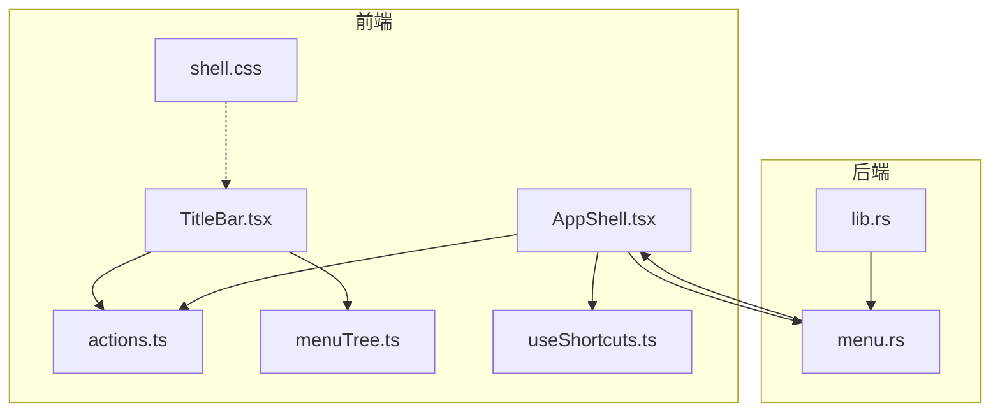
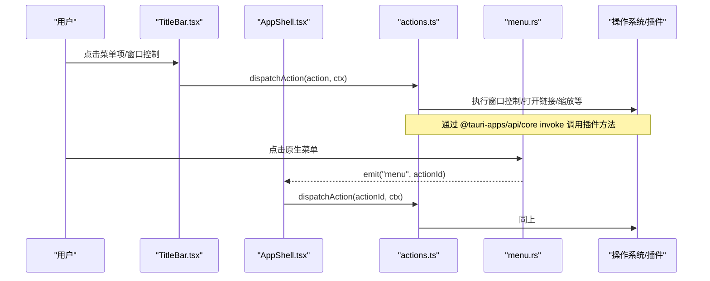
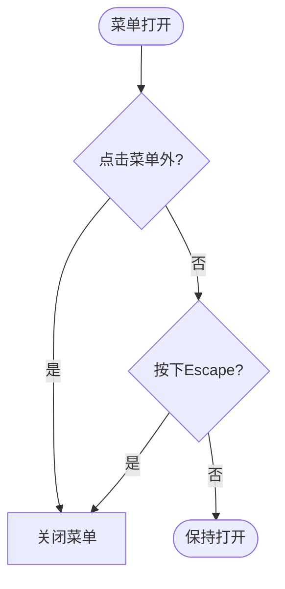
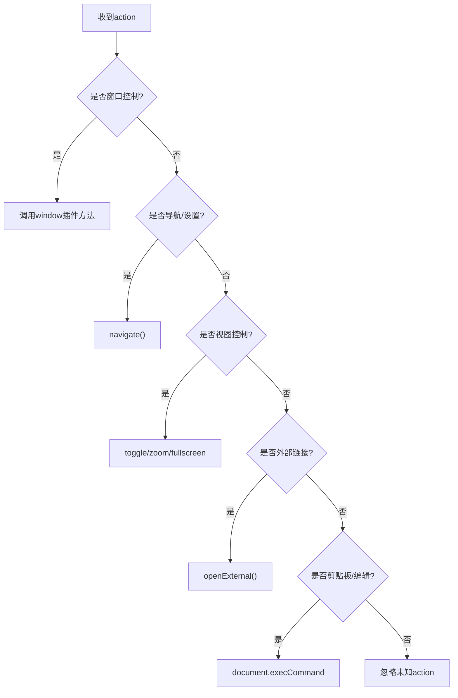
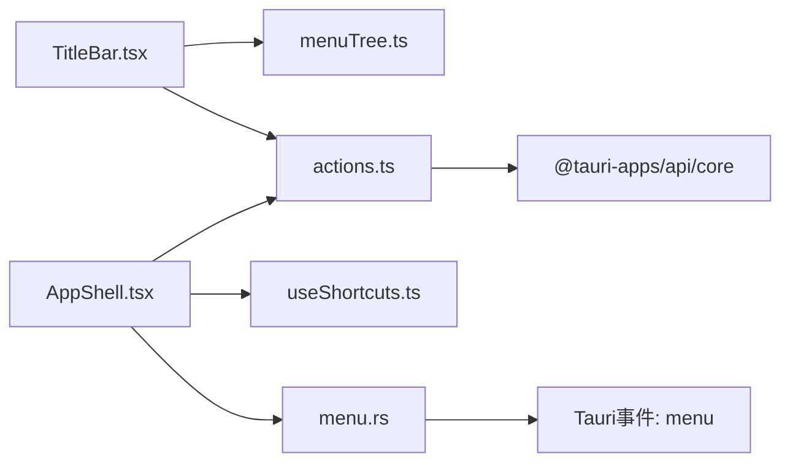

# TitleBar标题栏组件

<cite>
**本文引用的文件**
- [TitleBar.tsx](file://frontend/app/shell/TitleBar.tsx)
- [AppShell.tsx](file://frontend/app/shell/AppShell.tsx)
- [actions.ts](file://frontend/app/shell/actions.ts)
- [menuTree.ts](file://frontend/app/shell/menuTree.ts)
- [useShortcuts.ts](file://frontend/app/shell/useShortcuts.ts)
- [shell.css](file://frontend/src/styles/shell.css)
- [menu.rs](file://src-tauri/src/menu.rs)
- [lib.rs](file://src-tauri/src/lib.rs)
</cite>

## 目录
1. [简介](#简介)
2. [项目结构](#项目结构)
3. [核心组件](#核心组件)
4. [架构总览](#架构总览)
5. [详细组件分析](#详细组件分析)
6. [依赖关系分析](#依赖关系分析)
7. [性能与体验优化](#性能与体验优化)
8. [故障排查指南](#故障排查指南)
9. [结论](#结论)
10. [附录：配置、事件与样式定制](#附录：配置事件与样式定制)

## 简介
本组件文档聚焦于无框窗口下的自定义标题栏（TitleBar），涵盖以下能力：
- 窗口控制：最小化、最大化/还原、关闭，以及全屏切换。
- 菜单系统：在标题栏内渲染 File/Edit/View/Help 菜单，并与原生菜单双向同步。
- 搜索功能：通过“查找”动作聚焦输入区域，实现快速定位。
- 用户操作入口：侧边栏切换、任务切换、设置页跳转、外部链接打开等。
- 跨平台兼容：基于 Tauri 插件进行窗口控制，使用 CSS app-region 实现拖拽区域。
- 原生系统集成：构建原生应用菜单并通过 IPC 将事件转发到前端统一处理。
- 全局快捷键：前端监听键盘事件，按绑定表分发到同一 action 通道。
- 与系统托盘/通知：当前仓库未包含系统托盘与桌面通知实现；如需扩展可参考后端事件桥接模式。

## 项目结构
标题栏由前端 React 组件与 Rust 原生菜单共同组成，通过事件总线与动作分发器协同工作：
- 前端
  - TitleBar：渲染导航按钮、菜单条、窗口控制按钮。
  - AppShell：组装标题栏、侧边栏与主视图，订阅原生菜单事件并注册全局快捷键。
  - actions：集中处理所有菜单/快捷键触发的业务逻辑。
  - menuTree：声明式菜单树，作为 UI 与动作的单一事实来源。
  - useShortcuts：全局快捷键监听与冲突检测。
  - shell.css：标题栏布局、拖拽区域、菜单面板与窗口控制样式。
- 后端
  - menu.rs：构建原生菜单项与快捷键，并将点击事件以“menu”事件广播给前端。
  - lib.rs：初始化菜单、注册 on_menu_event 处理器，并在窗口关闭时优雅退出。

图表来源
- [TitleBar.tsx:26-161](file://frontend/app/shell/TitleBar.tsx#L26-L161)
- [AppShell.tsx:78-205](file://frontend/app/shell/AppShell.tsx#L78-L205)
- [actions.ts:57-200](file://frontend/app/shell/actions.ts#L57-L200)
- [menuTree.ts:24-82](file://frontend/app/shell/menuTree.ts#L24-L82)
- [useShortcuts.ts:104-133](file://frontend/app/shell/useShortcuts.ts#L104-L133)
- [menu.rs:8-219](file://src-tauri/src/menu.rs#L8-L219)
- [lib.rs:16-23](file://src-tauri/src/lib.rs#L16-L23)

章节来源
- [TitleBar.tsx:26-161](file://frontend/app/shell/TitleBar.tsx#L26-L161)
- [AppShell.tsx:78-205](file://frontend/app/shell/AppShell.tsx#L78-L205)
- [actions.ts:57-200](file://frontend/app/shell/actions.ts#L57-L200)
- [menuTree.ts:24-82](file://frontend/app/shell/menuTree.ts#L24-L82)
- [useShortcuts.ts:104-133](file://frontend/app/shell/useShortcuts.ts#L104-L133)
- [menu.rs:8-219](file://src-tauri/src/menu.rs#L8-L219)
- [lib.rs:16-23](file://src-tauri/src/lib.rs#L16-L23)

## 核心组件
- 标题栏组件（TitleBar）
  - 导航区：侧边栏开关、前进/后退。
  - 菜单区：File/Edit/View/Help 四个菜单，支持下拉展开、分隔符、快捷键显示。
  - 窗口控制：最小化、最大化/还原、关闭。
  - 拖拽区域：整个 header 标记为可拖拽，菜单和按钮区域禁用拖拽。
- 应用外壳（AppShell）
  - 加载并持久化侧边栏折叠状态。
  - 订阅原生菜单事件，统一调用 dispatchAction。
  - 注册全局快捷键，将按键组合映射到 action id。
- 动作分发器（actions）
  - 统一处理所有菜单/快捷键动作：导航、窗口控制、缩放、全屏、外部链接、剪贴板命令等。
- 菜单树（menuTree）
  - 定义菜单结构与键位，作为 UI 渲染与动作分发的唯一数据源。
- 全局快捷键（useShortcuts）
  - 监听键盘事件，规范化键名，避免在文本输入时误触发，提供冲突检测与格式化显示。
- 原生菜单（menu.rs）
  - 构建与前端一致的菜单项与快捷键，点击后通过 Tauri 事件“menu”将 action id 发送到前端。
- 样式（shell.css）
  - 标题栏高度、拖拽区域、菜单面板、窗口控制按钮样式，以及主题变量适配。

章节来源
- [TitleBar.tsx:26-161](file://frontend/app/shell/TitleBar.tsx#L26-L161)
- [AppShell.tsx:78-205](file://frontend/app/shell/AppShell.tsx#L78-L205)
- [actions.ts:57-200](file://frontend/app/shell/actions.ts#L57-L200)
- [menuTree.ts:24-82](file://frontend/app/shell/menuTree.ts#L24-L82)
- [useShortcuts.ts:104-133](file://frontend/app/shell/useShortcuts.ts#L104-L133)
- [menu.rs:8-219](file://src-tauri/src/menu.rs#L8-L219)
- [shell.css:107-259](file://frontend/src/styles/shell.css#L107-L259)

## 架构总览
标题栏采用“前端渲染 + 后端菜单 + 统一动作分发”的架构：
- 前端渲染菜单与窗口控件，用户交互先走本地逻辑（如侧边栏切换）。
- 需要系统级能力的操作（如窗口控制、外部链接）通过 Tauri 插件或浏览器 API 完成。
- 原生菜单点击会触发“menu”事件，前端统一进入 dispatchAction，保证行为一致。
- 全局快捷键与菜单共享同一 action 通道，便于维护与测试。

图表来源
- [TitleBar.tsx:48-51](file://frontend/app/shell/TitleBar.tsx#L48-L51)
- [actions.ts:39-47](file://frontend/app/shell/actions.ts#L39-L47)
- [AppShell.tsx:163-177](file://frontend/app/shell/AppShell.tsx#L163-L177)
- [menu.rs:215-219](file://src-tauri/src/menu.rs#L215-L219)

## 详细组件分析

### 标题栏组件（TitleBar）
- 功能模块
  - 导航按钮：侧边栏切换、历史前进/后退。
  - 菜单系统：基于 MENU_TREE 渲染，支持分隔符、快捷键提示、国际化标签。
  - 窗口控制：最小化、最大化/还原、关闭，调用统一动作分发。
  - 拖拽区域：header 整体可拖拽，菜单与按钮区域禁用拖拽。
- 交互细节
  - 点击菜单外区域或按下 Escape 关闭菜单。
  - 菜单项点击后关闭菜单并派发 action。
  - 窗口控制按钮直接派发对应 action。
- 可访问性
  - 按钮具备 aria-label，菜单项使用 role="menuitem"，菜单容器 role="menu"。

图表来源
- [TitleBar.tsx:31-46](file://frontend/app/shell/TitleBar.tsx#L31-L46)

章节来源
- [TitleBar.tsx:26-161](file://frontend/app/shell/TitleBar.tsx#L26-L161)
- [shell.css:107-259](file://frontend/src/styles/shell.css#L107-L259)

### 应用外壳（AppShell）
- 职责
  - 管理侧边栏折叠状态并持久化。
  - 订阅原生菜单事件，统一派发 action。
  - 注册全局快捷键，将按键组合映射到 action。
  - 渲染 TitleBar、Sidebar、主视图与设置页。
- 与后端集成
  - 启动时刷新应用状态。
  - 读取设置以恢复侧边栏状态。
  - 获取快捷键列表（若失败则回退到菜单树中的默认绑定）。

章节来源
- [AppShell.tsx:78-205](file://frontend/app/shell/AppShell.tsx#L78-L205)

### 动作分发器（actions）
- 支持的 action 类别
  - 会话与导航：新建任务、设置页、登录登出、任务切换。
  - 窗口控制：最小化、最大化/还原、关闭、全屏切换。
  - 视图控制：侧边栏、底部面板、文件树、缩放、实际大小。
  - 剪贴板与编辑：撤销/重做、剪切/复制/粘贴、删除、全选。
  - 外部资源：打开文档、更新日志、故障排除、系统状态、反馈。
- 实现要点
  - 窗口控制通过 Tauri 插件 window 接口调用。
  - 缩放通过修改根元素 zoom 属性实现。
  - 剪贴板命令在当前环境下使用 document.execCommand。

图表来源
- [actions.ts:57-200](file://frontend/app/shell/actions.ts#L57-L200)

章节来源
- [actions.ts:57-200](file://frontend/app/shell/actions.ts#L57-L200)

### 菜单树（menuTree）
- 作用
  - 定义 File/Edit/View/Help 四个菜单的结构、动作 id、显示键与快捷键。
  - 作为前端菜单渲染与全局快捷键绑定的单一事实来源。
- 设计原则
  - 菜单项与动作一一对应，避免 UI 与逻辑不一致。
  - 支持分隔符与可选快捷键显示。

章节来源
- [menuTree.ts:24-82](file://frontend/app/shell/menuTree.ts#L24-L82)

### 全局快捷键（useShortcuts）
- 功能
  - 监听全局键盘事件，规范化键名，匹配绑定表。
  - 在文本输入场景下仅允许特定键（Esc/Enter/Tab）或通过修饰键的组合。
  - 对编辑类快捷键（撤销/重做/剪切/复制/粘贴/删除/全选）透传给 WebView 原生处理。
  - 提供冲突检测与键序列格式化显示。
- 与菜单联动
  - 启动时优先从后端获取用户自定义快捷键，否则回退到菜单树中的默认绑定。

章节来源
- [useShortcuts.ts:104-133](file://frontend/app/shell/useShortcuts.ts#L104-L133)
- [AppShell.tsx:100-110](file://frontend/app/shell/AppShell.tsx#L100-L110)
- [menuTree.ts:24-82](file://frontend/app/shell/menuTree.ts#L24-L82)

### 原生菜单（menu.rs）
- 功能
  - 构建与前端一致的 File/Edit/View/Help 菜单及快捷键。
  - 将菜单点击事件转换为“menu”事件，携带 action id 发送给前端。
- 与前端一致性
  - 菜单项 id 与 actions.ts 中处理的 action 名称保持一致。
  - 快捷键字符串与 menuTree 中的 keys 字段保持一致，便于前端解析与展示。

章节来源
- [menu.rs:8-219](file://src-tauri/src/menu.rs#L8-L219)
- [lib.rs:16-23](file://src-tauri/src/lib.rs#L16-L23)

### 样式与拖拽（shell.css）
- 标题栏
  - 高度、背景色、字体与间距通过 CSS 变量统一管理。
  - 使用 app-region: drag/no-drag 控制拖拽区域。
- 菜单面板
  - 固定定位、阴影、圆角、分隔线样式。
- 窗口控制
  - 最小化/最大化/关闭按钮尺寸、悬停效果、关闭高亮。
- 主题适配
  - 通过 html.theme-dark 与 data-sidebar-style 等选择器调整外观。

章节来源
- [shell.css:107-259](file://frontend/src/styles/shell.css#L107-L259)

## 依赖关系分析
- 组件耦合
  - TitleBar 依赖 menuTree 渲染菜单，依赖 actions 执行动作。
  - AppShell 订阅原生菜单事件并注入全局快捷键分发。
  - actions 依赖 Tauri 插件 window/shell 与浏览器 API。
- 外部依赖
  - Tauri 插件：dialog、shell、fs、store。
  - 原生菜单事件：通过 on_menu_event 转发到前端。
- 潜在循环
  - 前端与后端通过事件解耦，无明显循环依赖。

图表来源
- [TitleBar.tsx:26-161](file://frontend/app/shell/TitleBar.tsx#L26-L161)
- [AppShell.tsx:163-177](file://frontend/app/shell/AppShell.tsx#L163-L177)
- [actions.ts:39-47](file://frontend/app/shell/actions.ts#L39-L47)
- [menu.rs:215-219](file://src-tauri/src/menu.rs#L215-L219)

章节来源
- [TitleBar.tsx:26-161](file://frontend/app/shell/TitleBar.tsx#L26-L161)
- [AppShell.tsx:163-177](file://frontend/app/shell/AppShell.tsx#L163-L177)
- [actions.ts:39-47](file://frontend/app/shell/actions.ts#L39-L47)
- [menu.rs:215-219](file://src-tauri/src/menu.rs#L215-L219)

## 性能与体验优化
- 渲染性能
  - 菜单树集中管理，减少重复计算；菜单面板使用固定定位避免重排。
  - 使用 CSS 变量与主题类切换，避免频繁样式计算。
- 事件处理
  - 全局快捷键监听仅在必要时生效，文本输入时过滤普通键，降低干扰。
  - 剪贴板命令透传给 WebView，避免重复处理导致的性能损耗。
- 用户体验
  - 菜单外点击与 Escape 关闭，符合预期交互。
  - 窗口控制按钮具备明确的可访问性标签与视觉反馈。
  - 缩放与全屏切换提供即时反馈。
- 可扩展性
  - 新增菜单项只需在 menuTree 中添加，无需改动渲染逻辑。
  - 新增 action 只需在 actions.ts 中增加分支，保持单一职责。

[本节为通用指导，不直接分析具体文件]

## 故障排查指南
- 菜单点击无效
  - 检查 menuTree 中 action 是否与 actions.ts 中处理一致。
  - 确认原生菜单已正确构建并触发“menu”事件。
- 快捷键不生效
  - 检查 useShortcuts 是否正确注册，是否在文本输入时被过滤。
  - 查看是否存在快捷键冲突（findConflicts）。
- 窗口控制失败
  - 确认 Tauri 插件 window 可用，label 为 "main"。
  - 检查 actions.ts 中 windowCall 的错误日志。
- 拖拽区域异常
  - 确认 header 设置了 app-region: drag，菜单与按钮区域设置为 no-drag。
- 设置页无法打开
  - 检查 actions.ts 中 settings/about 对应的 navigate 路径。

章节来源
- [actions.ts:39-47](file://frontend/app/shell/actions.ts#L39-L47)
- [useShortcuts.ts:75-90](file://frontend/app/shell/useShortcuts.ts#L75-L90)
- [shell.css:107-133](file://frontend/src/styles/shell.css#L107-L133)

## 结论
TitleBar 组件通过前端渲染与后端原生菜单的统一动作分发机制，实现了跨平台的无框标题栏。其设计强调单一事实来源（menuTree）、统一的 action 通道与良好的可访问性。结合全局快捷键与样式变量，提供了灵活且易维护的标题栏解决方案。对于系统托盘与通知，当前仓库未实现，但可通过后端事件桥接模式扩展。

[本节为总结，不直接分析具体文件]

## 附录：配置、事件与样式定制

### 组件配置选项
- TitleBar 属性
  - ctx：ShellContext，包含导航、侧边栏切换、焦点与任务切换等方法。
  - sidebarCollapsed：布尔值，控制侧边栏折叠状态。
  - onToggleSidebar：回调函数，切换侧边栏并持久化状态。
- 菜单配置
  - 在 menuTree 中新增菜单项，指定 action、key（国际化键）与 keys（快捷键）。
- 快捷键配置
  - 通过后端 list_shortcuts 返回用户自定义绑定，前端 normaliseBindings 解析。
  - 若后端不可用，回退到 menuTree 中的默认绑定。

章节来源
- [TitleBar.tsx:15-19](file://frontend/app/shell/TitleBar.tsx#L15-L19)
- [menuTree.ts:24-82](file://frontend/app/shell/menuTree.ts#L24-L82)
- [AppShell.tsx:100-110](file://frontend/app/shell/AppShell.tsx#L100-L110)

### 事件处理方法
- 原生菜单事件
  - 后端 menu.rs 将菜单点击事件以“menu”事件发送，携带 action id。
  - 前端 AppShell 监听该事件并调用 dispatchAction。
- 全局快捷键事件
  - useShortcuts 监听 keydown，规范化键名并匹配绑定表，调用传入的 dispatch。
- 窗口控制事件
  - actions.ts 中 windowCall 调用 Tauri 插件 window 方法。

章节来源
- [menu.rs:215-219](file://src-tauri/src/menu.rs#L215-L219)
- [AppShell.tsx:163-177](file://frontend/app/shell/AppShell.tsx#L163-L177)
- [useShortcuts.ts:104-133](file://frontend/app/shell/useShortcuts.ts#L104-L133)
- [actions.ts:39-47](file://frontend/app/shell/actions.ts#L39-L47)

### 样式定制指南
- 标题栏高度与颜色
  - 通过 --height-toolbar-sm 与 --bg-sidebar 等变量调整。
- 拖拽区域
  - header 设置 app-region: drag，菜单与按钮区域设置 no-drag。
- 菜单面板
  - 使用 .desktop-menu-panel 与 .desktop-menu-item 调整外观。
- 窗口控制按钮
  - 使用 .window-control 与 .caption-glyph 调整图标与悬停效果。
- 主题适配
  - 通过 html.theme-dark 与 data-sidebar-style 切换深色与侧边栏风格。

章节来源
- [shell.css:107-259](file://frontend/src/styles/shell.css#L107-L259)