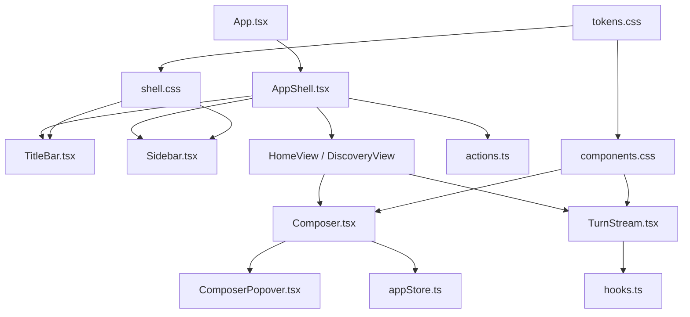
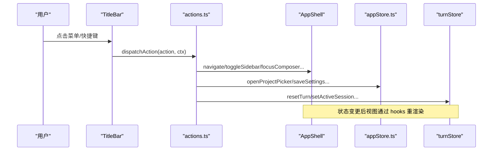
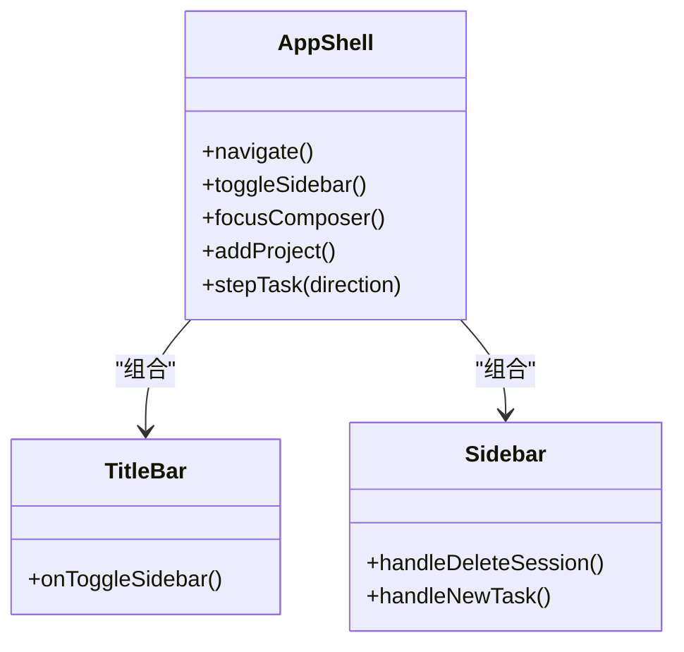
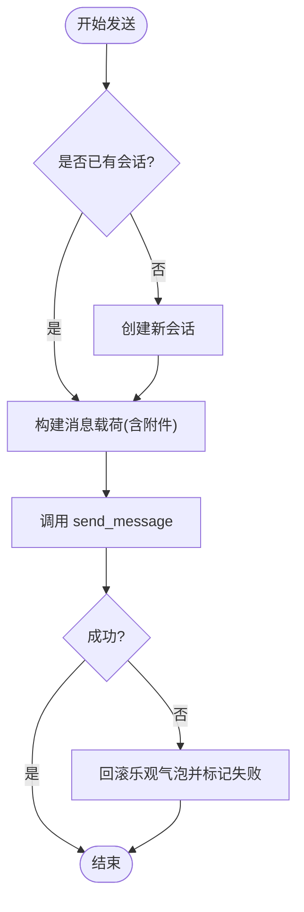
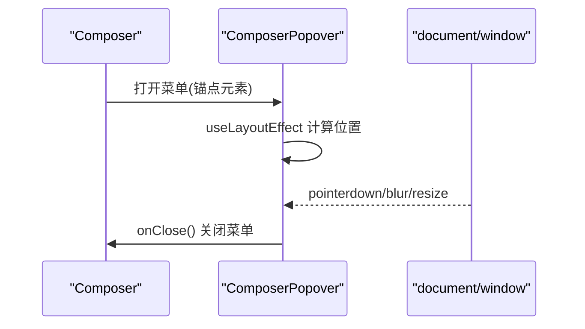
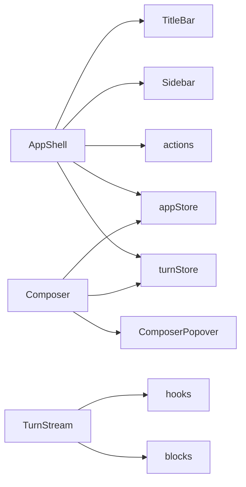

# UI组件

<cite>
**本文引用的文件**
- [App.tsx](file://frontend/app/App.tsx)
- [AppShell.tsx](file://frontend/app/shell/AppShell.tsx)
- [TitleBar.tsx](file://frontend/app/shell/TitleBar.tsx)
- [Sidebar.tsx](file://frontend/app/shell/Sidebar.tsx)
- [ComposerPopover.tsx](file://frontend/app/shell/ComposerPopover.tsx)
- [actions.ts](file://frontend/app/shell/actions.ts)
- [Composer.tsx](file://frontend/app/views/Composer.tsx)
- [TurnStream.tsx](file://frontend/app/views/TurnStream.tsx)
- [appStore.ts](file://frontend/app/state/appStore.ts)
- [hooks.ts](file://frontend/app/state/hooks.ts)
- [tokens.css](file://frontend/src/styles/tokens.css)
- [shell.css](file://frontend/src/styles/shell.css)
- [components.css](file://frontend/src/styles/components.css)
</cite>

## 目录
1. [简介](#简介)
2. [项目结构](#项目结构)
3. [核心组件](#核心组件)
4. [架构总览](#架构总览)
5. [详细组件分析](#详细组件分析)
6. [依赖关系分析](#依赖关系分析)
7. [性能与可访问性](#性能与可访问性)
8. [故障排查指南](#故障排查指南)
9. [结论](#结论)
10. [附录：样式与主题、响应式与动画、最佳实践](#附录样式与主题响应式与动画最佳实践)

## 简介
本文件为 Codex-Tauri 前端 UI 组件系统的权威文档，聚焦 React 组件层次结构、复用模式、CSS 样式系统（设计令牌 tokens）、主题机制、响应式设计、动画与过渡、组件 props 接口、事件处理与状态提升策略，并给出开发最佳实践、可访问性与跨浏览器兼容性建议。

## 项目结构
前端采用“外壳 + 视图”的分层组织：
- 外壳层（Shell）：标题栏、侧边栏、应用容器，负责全局导航、窗口控制、快捷键与菜单分发。
- 视图层（Views）：Composer（输入与发送）、TurnStream（对话流渲染）、设置页等。
- 状态层（State）：应用级 store（会话、项目、提供者、设置），以及 Turn 流状态。
- 样式层（Styles）：设计令牌（tokens）、基础壳样式（shell）、通用组件样式（components）。

图表来源
- [App.tsx:1-47](file://frontend/app/App.tsx#L1-L47)
- [AppShell.tsx:1-205](file://frontend/app/shell/AppShell.tsx#L1-L205)
- [TitleBar.tsx:1-164](file://frontend/app/shell/TitleBar.tsx#L1-L164)
- [Sidebar.tsx:1-351](file://frontend/app/shell/Sidebar.tsx#L1-L351)
- [Composer.tsx:1-800](file://frontend/app/views/Composer.tsx#L1-L800)
- [TurnStream.tsx:1-187](file://frontend/app/views/TurnStream.tsx#L1-L187)
- [actions.ts:1-201](file://frontend/app/shell/actions.ts#L1-L201)
- [ComposerPopover.tsx:1-169](file://frontend/app/shell/ComposerPopover.tsx#L1-L169)
- [appStore.ts:1-532](file://frontend/app/state/appStore.ts#L1-L532)
- [hooks.ts:1-43](file://frontend/app/state/hooks.ts#L1-L43)
- [tokens.css:1-676](file://frontend/src/styles/tokens.css#L1-L676)
- [shell.css:1-800](file://frontend/src/styles/shell.css#L1-L800)
- [components.css:1-200](file://frontend/src/styles/components.css#L1-L200)

章节来源
- [App.tsx:1-47](file://frontend/app/App.tsx#L1-L47)
- [AppShell.tsx:1-205](file://frontend/app/shell/AppShell.tsx#L1-L205)

## 核心组件
- Shell 组件
  - TitleBar：无框标题栏，包含导航按钮、桌面菜单、窗口控制；通过 actions 统一派发操作。
  - Sidebar：品牌区、主导航、项目列表、最近任务、模型与思考等级选择、待决权限入口、上下文菜单。
  - AppShell：组装 TitleBar、Sidebar、主内容区与设置页；管理侧边栏折叠、全局快捷键、路由与菜单事件。
- 视图组件
  - Composer：输入、附件、三个功能胶囊（项目、权限、模型），发送/停止逻辑，弹出菜单定位。
  - TurnStream：实时对话流渲染，头部状态机（思考/进行中/完成），折叠与摘要展示。
- 基础组件
  - ComposerPopover：固定定位的弹出面板宿主，自动计算位置、支持翻转、外部点击关闭、键盘 Escape 关闭。
  - 通用控件：按钮、输入、选择等，基于 tokens 的主题化样式。

章节来源
- [TitleBar.tsx:1-164](file://frontend/app/shell/TitleBar.tsx#L1-L164)
- [Sidebar.tsx:1-351](file://frontend/app/shell/Sidebar.tsx#L1-L351)
- [AppShell.tsx:1-205](file://frontend/app/shell/AppShell.tsx#L1-L205)
- [Composer.tsx:1-800](file://frontend/app/views/Composer.tsx#L1-L800)
- [TurnStream.tsx:1-187](file://frontend/app/views/TurnStream.tsx#L1-L187)
- [ComposerPopover.tsx:1-169](file://frontend/app/shell/ComposerPopover.tsx#L1-L169)
- [components.css:1-200](file://frontend/src/styles/components.css#L1-L200)

## 架构总览
- 数据流
  - 应用启动后，App 订阅通知与服务器请求通道，将消息写入 turnStore。
  - AppShell 初始化时刷新应用状态（会话、项目、提供者、设置），恢复侧边栏折叠状态，加载快捷键绑定。
  - 用户交互（菜单、快捷键、侧边栏、Composer）通过 actions 统一派发，调用 Tauri IPC 或更新本地状态。
  - 视图组件通过 hooks 订阅 turnStore 快照，实现高频流式渲染。
- 样式体系
  - tokens.css 定义字体、字号、间距、圆角、动效、阴影、语义色、主题变量等。
  - shell.css 构建页面骨架、标题栏、侧边栏、网格布局与主题切换。
  - components.css 提供可复用控件样式，全部基于 tokens。

图表来源
- [TitleBar.tsx:1-164](file://frontend/app/shell/TitleBar.tsx#L1-L164)
- [actions.ts:1-201](file://frontend/app/shell/actions.ts#L1-L201)
- [AppShell.tsx:1-205](file://frontend/app/shell/AppShell.tsx#L1-L205)
- [appStore.ts:1-532](file://frontend/app/state/appStore.ts#L1-L532)
- [hooks.ts:1-43](file://frontend/app/state/hooks.ts#L1-L43)

## 详细组件分析

### Shell 组件：AppShell、TitleBar、Sidebar
- AppShell
  - 职责：装配 TitleBar、Sidebar、主视图与设置页；维护 body 类名以驱动 CSS 布局；监听 Rust 菜单事件；注册全局快捷键。
  - 关键行为：首次加载刷新应用状态；读取设置恢复侧边栏折叠；根据路由显示不同视图；设置页作为 main 的同级元素以避免被隐藏。
- TitleBar
  - 职责：渲染导航按钮、桌面菜单、窗口控制；通过 actions 派发最小化/最大化/关闭等操作。
  - 可访问性：所有按钮具备 aria-label；菜单项使用 role="menu"/role="menuitem"；Escape 关闭菜单。
- Sidebar
  - 职责：品牌区、导航、项目列表、最近任务、模型与思考等级快速调节、待决权限入口、删除会话、上下文菜单。
  - 交互：删除会话前确认；选中项目/会话高亮；右侧点击触发上下文菜单。

图表来源
- [AppShell.tsx:1-205](file://frontend/app/shell/AppShell.tsx#L1-L205)
- [TitleBar.tsx:1-164](file://frontend/app/shell/TitleBar.tsx#L1-L164)
- [Sidebar.tsx:1-351](file://frontend/app/shell/Sidebar.tsx#L1-L351)

章节来源
- [AppShell.tsx:1-205](file://frontend/app/shell/AppShell.tsx#L1-L205)
- [TitleBar.tsx:1-164](file://frontend/app/shell/TitleBar.tsx#L1-L164)
- [Sidebar.tsx:1-351](file://frontend/app/shell/Sidebar.tsx#L1-L351)

### 视图组件：Composer、TurnStream
- Composer
  - 职责：文本输入、附件选择、三个胶囊（项目、权限、模型），发送/停止；弹出菜单定位与关闭。
  - 发送流程：若无会话则先创建会话；构造消息载荷（含附件）；调用 IPC 发送；失败时回滚乐观气泡并标记失败。
  - 快捷键：Enter 发送，Shift+Enter 换行；支持配置 Cmd/Ctrl+Enter 发送。
- TurnStream
  - 职责：按 Turn 生命周期渲染头部状态（思考/进行中/用时），折叠已完成 Turn，聚合连续工具输出，展示警告信息。
  - 实时更新：运行中每 250ms 刷新已处理时长；完成后自动折叠。

图表来源
- [Composer.tsx:1-800](file://frontend/app/views/Composer.tsx#L1-L800)

章节来源
- [Composer.tsx:1-800](file://frontend/app/views/Composer.tsx#L1-L800)
- [TurnStream.tsx:1-187](file://frontend/app/views/TurnStream.tsx#L1-L187)

### 基础组件：ComposerPopover
- 职责：固定定位弹出面板宿主，自动计算位置（支持上下翻转），外部点击关闭、Escape 关闭、窗口失焦关闭。
- 使用场景：Composer 的项目/权限/模型菜单；保持与历史 DOM 类名一致，确保样式兼容。

图表来源
- [ComposerPopover.tsx:1-169](file://frontend/app/shell/ComposerPopover.tsx#L1-L169)
- [Composer.tsx:1-800](file://frontend/app/views/Composer.tsx#L1-L800)

章节来源
- [ComposerPopover.tsx:1-169](file://frontend/app/shell/ComposerPopover.tsx#L1-L169)

## 依赖关系分析
- 组件耦合
  - AppShell 依赖 TitleBar、Sidebar、useRoute、actions、appStore、turnStore。
  - Composer 依赖 appStore、turnStore、ComposerPopover、Tauri IPC。
  - TurnStream 依赖 turnStore hooks、blocks 注册表、ApprovalHost。
- 外部依赖
  - Tauri IPC：invoke/listen 用于窗口控制、设置读写、会话管理、菜单事件。
  - 样式：tokens.css 提供主题变量；shell.css 提供布局；components.css 提供控件样式。

图表来源
- [AppShell.tsx:1-205](file://frontend/app/shell/AppShell.tsx#L1-L205)
- [Composer.tsx:1-800](file://frontend/app/views/Composer.tsx#L1-L800)
- [TurnStream.tsx:1-187](file://frontend/app/views/TurnStream.tsx#L1-L187)
- [actions.ts:1-201](file://frontend/app/shell/actions.ts#L1-L201)
- [appStore.ts:1-532](file://frontend/app/state/appStore.ts#L1-L532)
- [hooks.ts:1-43](file://frontend/app/state/hooks.ts#L1-L43)

章节来源
- [AppShell.tsx:1-205](file://frontend/app/shell/AppShell.tsx#L1-L205)
- [Composer.tsx:1-800](file://frontend/app/views/Composer.tsx#L1-L800)
- [TurnStream.tsx:1-187](file://frontend/app/views/TurnStream.tsx#L1-L187)

## 性能与可访问性
- 性能
  - 使用 useSyncExternalStore 订阅高频 turnStore，避免 Context Provider 与 prop drilling 带来的重渲染。
  - Composer 文本域高度自适应，限制最大高度，减少布局抖动。
  - TurnStream 在运行中以 250ms 间隔刷新时长，避免频繁全量重绘。
- 可访问性
  - 标题栏按钮与菜单项具备 aria-label、role、aria-expanded 等属性。
  - 焦点可见性统一使用 :focus-visible，并提供主题化的轮廓颜色。
  - 图标使用 aria-hidden 避免屏幕阅读器重复朗读。
- 跨浏览器兼容
  - tokens.css 提供 color-mix 不可用时的降级方案。
  - 字体回退链覆盖多平台，CJK 友好。
  - 使用 -webkit-app-region 与 app-region 兼容 Tauri 无框拖拽区域。

章节来源
- [hooks.ts:1-43](file://frontend/app/state/hooks.ts#L1-L43)
- [Composer.tsx:1-800](file://frontend/app/views/Composer.tsx#L1-L800)
- [TurnStream.tsx:1-187](file://frontend/app/views/TurnStream.tsx#L1-L187)
- [TitleBar.tsx:1-164](file://frontend/app/shell/TitleBar.tsx#L1-L164)
- [tokens.css:1-676](file://frontend/src/styles/tokens.css#L1-L676)
- [shell.css:1-800](file://frontend/src/styles/shell.css#L1-L800)

## 故障排查指南
- 发送失败
  - 现象：Composer 发送后出现错误提示或气泡消失。
  - 排查：检查 IPC 调用是否成功；若失败会回滚乐观气泡并标记失败；查看控制台日志。
- 菜单不关闭
  - 现象：点击外部未关闭弹出菜单。
  - 排查：确认 ComposerPopover 的外部点击监听与 ignoreRefs 配置是否正确；检查 Escape 键监听。
- 侧边栏折叠异常
  - 现象：侧边栏未隐藏或布局错乱。
  - 排查：确认 AppShell 同步 body.sidebar-collapsed 类名；检查 shell.css 中 grid-template-columns 规则。
- 主题/样式异常
  - 现象：颜色或字体不正确。
  - 排查：确认 html.theme-dark 或 data-font-family 等属性是否正确设置；检查 tokens.css 变量覆盖。

章节来源
- [Composer.tsx:1-800](file://frontend/app/views/Composer.tsx#L1-L800)
- [ComposerPopover.tsx:1-169](file://frontend/app/shell/ComposerPopover.tsx#L1-L169)
- [AppShell.tsx:1-205](file://frontend/app/shell/AppShell.tsx#L1-L205)
- [shell.css:1-800](file://frontend/src/styles/shell.css#L1-L800)
- [tokens.css:1-676](file://frontend/src/styles/tokens.css#L1-L676)

## 结论
Codex-Tauri 的前端 UI 系统以清晰的 Shell/Views 分层、统一的 actions 派发、基于 tokens 的主题化样式与高性能的状态订阅为核心。组件间职责明确、复用性强，具备良好的可访问性与跨浏览器兼容性。遵循本文档的最佳实践与样式规范，可高效扩展与维护 UI 组件。

## 附录：样式与主题、响应式与动画、最佳实践

### 样式系统与主题机制
- 设计令牌（tokens）
  - 字体族、字号、字重、行高、字距、圆角、动效时长、阴影、语义色、主题变量等集中定义于 tokens.css。
  - 通过 html.theme-dark 切换深色主题；通过 data-font-family 切换字体族；通过 data-contrast 调整对比度。
- 基础壳样式
  - shell.css 定义 body、grid 布局、标题栏、侧边栏、菜单、按钮等基础视觉值，确保 UA 默认清零后的显式表现。
- 组件样式
  - components.css 提供按钮、输入、选择等控件样式，全部引用 tokens 的语义变量，保证主题一致性。

章节来源
- [tokens.css:1-676](file://frontend/src/styles/tokens.css#L1-L676)
- [shell.css:1-800](file://frontend/src/styles/shell.css#L1-L800)
- [components.css:1-200](file://frontend/src/styles/components.css#L1-L200)

### 响应式设计实现
- 侧边栏宽度使用 clamp 与 CSS 变量，适配不同视口。
- 设置页打开时隐藏侧边栏与主内容，使设置页占满 #app。
- 标题栏与菜单使用固定定位与 z-index，确保在不同尺寸下正确显示。

章节来源
- [shell.css:1-800](file://frontend/src/styles/shell.css#L1-L800)

### 动画效果与过渡动画
- 动效令牌：motion-fast/base/slow/xslow、ease-standard/enter/enter-snappy。
- 组件过渡：按钮悬停/激活态、输入框焦点边框与阴影、菜单展开/收起等。
- 减少动效：html[data-reduce-motion=true] 禁用动画与过渡，满足无障碍需求。

章节来源
- [tokens.css:1-676](file://frontend/src/styles/tokens.css#L1-L676)
- [components.css:1-200](file://frontend/src/styles/components.css#L1-L200)

### 组件 Props 接口设计与事件处理模式
- ShellContext
  - 提供 navigate、toggleSidebar、focusComposer、addProject、stepTask 等方法，供 actions 与 TitleBar/Sidebar 调用。
- 事件处理
  - 菜单与快捷键统一通过 dispatchAction 派发；Composer 通过 IPC 发送消息；TurnStream 通过 hooks 订阅 turnStore 变化。
- 状态提升
  - 应用级状态集中在 appStore，Turn 状态集中在 turnStore；组件通过 hooks 订阅，避免深层 prop 传递。

章节来源
- [actions.ts:1-201](file://frontend/app/shell/actions.ts#L1-L201)
- [AppShell.tsx:1-205](file://frontend/app/shell/AppShell.tsx#L1-L205)
- [Composer.tsx:1-800](file://frontend/app/views/Composer.tsx#L1-L800)
- [hooks.ts:1-43](file://frontend/app/state/hooks.ts#L1-L43)

### 组件开发最佳实践
- 使用 tokens 而非硬编码颜色/尺寸，确保主题一致。
- 为所有可交互元素添加合适的 aria-* 属性与 role。
- 使用 useSyncExternalStore 订阅高频状态，避免不必要的重渲染。
- 弹出面板使用 ComposerPopover，确保定位与关闭行为一致。
- 对外部 IPC 调用进行错误处理与降级，保证 UI 稳定性。

### 自定义样式指南
- 新增组件样式应放在 components.css，并引用 tokens 变量。
- 布局相关样式放在 shell.css，避免破坏全局布局。
- 主题变量优先使用语义化命名（如 --semantic-button-primary-surface-light），便于深色模式切换。