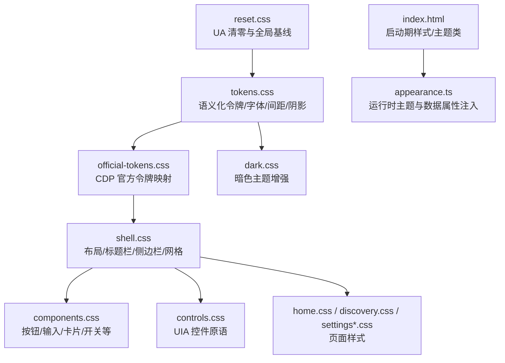
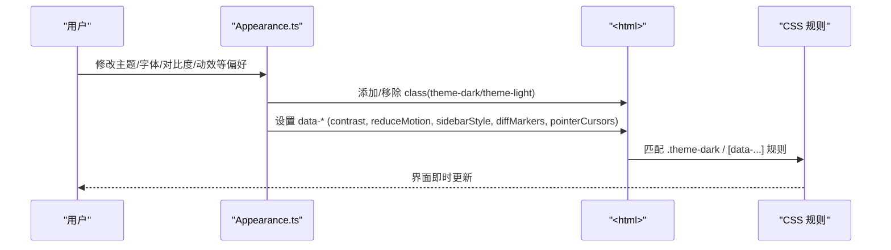
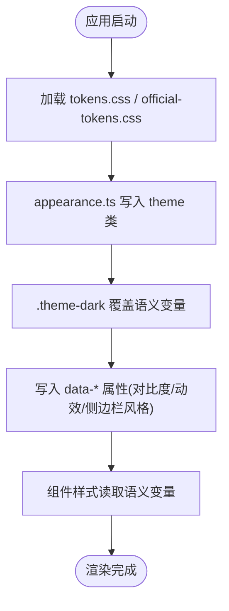
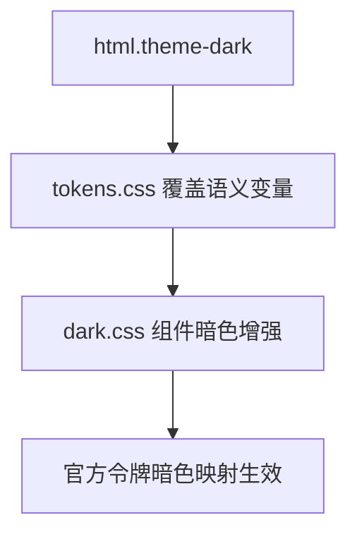
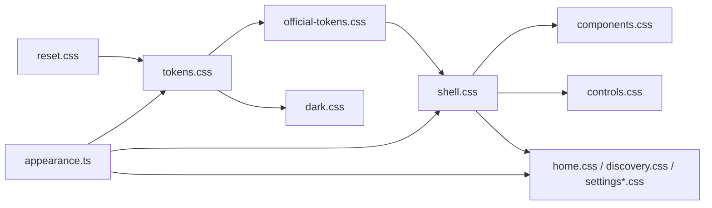

# 样式系统

<cite>
**本文引用的文件**
- [frontend/src/styles/tokens.css](file://frontend/src/styles/tokens.css)
- [frontend/src/styles/official-tokens.css](file://frontend/src/styles/official-tokens.css)
- [frontend/src/styles/reset.css](file://frontend/src/styles/reset.css)
- [frontend/src/styles/shell.css](file://frontend/src/styles/shell.css)
- [frontend/src/styles/components.css](file://frontend/src/styles/components.css)
- [frontend/src/styles/controls.css](file://frontend/src/styles/controls.css)
- [frontend/src/styles/dark.css](file://frontend/src/styles/dark.css)
- [frontend/src/styles/home.css](file://frontend/src/styles/home.css)
- [frontend/src/styles/discovery.css](file://frontend/src/styles/discovery.css)
- [frontend/src/styles/settings.css](file://frontend/src/styles/settings.css)
- [frontend/src/styles/settings-pages.css](file://frontend/src/styles/settings-pages.css)
- [frontend/app/state/appearance.ts](file://frontend/app/state/appearance.ts)
- [frontend/index.html](file://frontend/index.html)
</cite>

## 目录
1. [简介](#简介)
2. [项目结构](#项目结构)
3. [核心组件](#核心组件)
4. [架构总览](#架构总览)
5. [详细组件分析](#详细组件分析)
6. [依赖关系分析](#依赖关系分析)
7. [性能考量](#性能考量)
8. [故障排查指南](#故障排查指南)
9. [结论](#结论)
10. [附录](#附录)

## 简介
本文件为 Codex-Tauri 前端样式系统的权威说明，覆盖设计令牌（tokens）、主题系统、组件样式架构与最佳实践。重点解释颜色变量、字体规范、间距系统、响应式原则、暗色主题实现、样式模块化组织、可访问性与跨浏览器兼容策略；并提供样式定制指南、主题切换机制、动画与性能优化建议以及自定义主题开发流程。

## 项目结构
样式层按职责分层加载：
- 基础重置与全局基线：reset.css
- 设计令牌与官方 CDP 令牌：tokens.css、official-tokens.css
- 应用壳层与布局：shell.css
- 通用组件库：components.css、controls.css
- 页面级样式：home.css、discovery.css、settings.css、settings-pages.css
- 暗色主题增强：dark.css
- 启动页与运行时主题类：index.html、appearance.ts



**图表来源**
- [frontend/src/styles/reset.css:1-284](file://frontend/src/styles/reset.css#L1-L284)
- [frontend/src/styles/tokens.css:21-676](file://frontend/src/styles/tokens.css#L21-L676)
- [frontend/src/styles/official-tokens.css:40-146](file://frontend/src/styles/official-tokens.css#L40-L146)
- [frontend/src/styles/shell.css:10-121](file://frontend/src/styles/shell.css#L10-L121)
- [frontend/src/styles/components.css:15-112](file://frontend/src/styles/components.css#L15-L112)
- [frontend/src/styles/controls.css:18-131](file://frontend/src/styles/controls.css#L18-L131)
- [frontend/src/styles/dark.css:1-61](file://frontend/src/styles/dark.css#L1-L61)
- [frontend/index.html:72-127](file://frontend/index.html#L72-L127)
- [frontend/app/state/appearance.ts:62-177](file://frontend/app/state/appearance.ts#L62-L177)

**章节来源**
- [frontend/src/styles/reset.css:1-284](file://frontend/src/styles/reset.css#L1-L284)
- [frontend/src/styles/tokens.css:21-676](file://frontend/src/styles/tokens.css#L21-L676)
- [frontend/src/styles/official-tokens.css:40-146](file://frontend/src/styles/official-tokens.css#L40-L146)
- [frontend/src/styles/shell.css:10-121](file://frontend/src/styles/shell.css#L10-L121)
- [frontend/src/styles/components.css:15-112](file://frontend/src/styles/components.css#L15-L112)
- [frontend/src/styles/controls.css:18-131](file://frontend/src/styles/controls.css#L18-L131)
- [frontend/src/styles/dark.css:1-61](file://frontend/src/styles/dark.css#L1-L61)
- [frontend/index.html:72-127](file://frontend/index.html#L72-L127)
- [frontend/app/state/appearance.ts:62-177](file://frontend/app/state/appearance.ts#L62-L177)

## 核心组件
- 设计令牌层
  - 颜色：语义化前景/背景/边框/强调色，分 light/dark 两套变量，并通过 html.theme-dark 切换。
  - 字体：OpenAI Sans 与 Carlito 字族，提供 UI/代码/品牌字体栈与权重、行高、字距。
  - 间距与尺寸：--space-* 与 --spacing-token-*，统一字号阶梯与圆角尺度。
  - 动效：统一时长与缓动曲线，支持减少动效。
  - 阴影与层级：elevation/stroke/prominent/menu/toast 等。
- 官方令牌层
  - 从 CDP 解析的 --official-* 值，作为灰阶、强调环、表面色的权威来源。
- 组件库
  - components.css：业务组件（按钮、输入、卡片、开关、分段控件、药丸标签、滑块、复选/单选、图标按钮）。
  - controls.css：UIA 控件原语（按钮、输入、开关、弹出层、列表框、组合框），无 JS 亦可渲染。
- 页面样式
  - home.css：首页/Composer/线程布局与交互。
  - discovery.css：发现页（计划/插件/PR）布局与卡片。
  - settings.css/settings-pages.css：设置壳与页面布局、主题选择器、对比度调节等。
- 暗色主题增强
  - dark.css：对关键组件在暗色下的背景、边框、消息气泡等进行细化。

**章节来源**
- [frontend/src/styles/tokens.css:21-676](file://frontend/src/styles/tokens.css#L21-L676)
- [frontend/src/styles/official-tokens.css:40-146](file://frontend/src/styles/official-tokens.css#L40-L146)
- [frontend/src/styles/components.css:15-620](file://frontend/src/styles/components.css#L15-L620)
- [frontend/src/styles/controls.css:18-328](file://frontend/src/styles/controls.css#L18-L328)
- [frontend/src/styles/home.css:1-800](file://frontend/src/styles/home.css#L1-L800)
- [frontend/src/styles/discovery.css:1-800](file://frontend/src/styles/discovery.css#L1-L800)
- [frontend/src/styles/settings.css:1-316](file://frontend/src/styles/settings.css#L1-L316)
- [frontend/src/styles/settings-pages.css:1-378](file://frontend/src/styles/settings-pages.css#L1-L378)
- [frontend/src/styles/dark.css:1-61](file://frontend/src/styles/dark.css#L1-L61)

## 架构总览
样式系统采用“令牌驱动 + 主题类 + 数据属性”的分层架构：
- tokens.css 定义全部语义化变量与字体/间距/动效/阴影。
- official-tokens.css 将 CDP 官方值映射到 --official-*，供 tokens 与组件引用。
- shell.css 建立应用骨架（工具栏、侧边栏、网格布局）。
- components.css/controls.css 基于令牌构建可复用控件。
- dark.css 在 html.theme-dark 下覆盖特定组件视觉。
- appearance.ts 在运行时根据偏好设置向 <html> 写入 theme 类与 data-* 属性，触发 CSS 规则变化。
- index.html 提供启动期样式与主题类初始状态。



**图表来源**
- [frontend/app/state/appearance.ts:62-177](file://frontend/app/state/appearance.ts#L62-L177)
- [frontend/src/styles/tokens.css:546-676](file://frontend/src/styles/tokens.css#L546-L676)
- [frontend/index.html:72-127](file://frontend/index.html#L72-L127)

**章节来源**
- [frontend/app/state/appearance.ts:62-177](file://frontend/app/state/appearance.ts#L62-L177)
- [frontend/src/styles/tokens.css:546-676](file://frontend/src/styles/tokens.css#L546-L676)
- [frontend/index.html:72-127](file://frontend/index.html#L72-L127)

## 详细组件分析

### 设计令牌与主题系统
- 颜色与语义
  - 前景/背景/边框/强调色均通过 --fg-*、--bg-*、--border-*、--accent* 等语义变量使用，light/dark 分别定义并在 html.theme-dark 下覆盖。
  - 官方灰阶与强调环来自 --official-*，保证与官方设计一致。
- 字体规范
  - OpenAI Sans 由 official-tokens.css 唯一声明，避免重复 @font-face 冲突。
  - 字体栈通过 --font-sans/--font-mono/--font-brand 暴露，支持系统/Segoe/PingFang/YaHei 等多语言回退。
  - 运行时可通过 appearance.ts 覆盖 --font-sans 与 --font-mono。
- 间距与尺寸
  - 统一的 --space-* 与 --spacing-token-* 控制内边距、行高、圆角、字号阶梯。
- 动效与可访问性
  - 统一时长与缓动，支持 prefers-reduced-motion 与 data-reduce-motion。
  - 焦点环统一使用 --accent-ring，确保可访问性一致性。



**图表来源**
- [frontend/src/styles/tokens.css:21-676](file://frontend/src/styles/tokens.css#L21-L676)
- [frontend/src/styles/official-tokens.css:40-146](file://frontend/src/styles/official-tokens.css#L40-L146)
- [frontend/app/state/appearance.ts:62-177](file://frontend/app/state/appearance.ts#L62-L177)

**章节来源**
- [frontend/src/styles/tokens.css:21-676](file://frontend/src/styles/tokens.css#L21-L676)
- [frontend/src/styles/official-tokens.css:40-146](file://frontend/src/styles/official-tokens.css#L40-L146)
- [frontend/app/state/appearance.ts:62-177](file://frontend/app/state/appearance.ts#L62-L177)

### 组件样式架构
- 组件库（components.css）
  - 按钮：主/次/危险/幽灵/尺寸变体，hover/active/disabled/focus-visible 状态完整。
  - 输入/文本域：聚焦时以 accent-ring 外发光，占位符使用 --fg-muted。
  - 开关/分段控件/药丸标签/滑块/复选/单选：统一圆角、过渡与暗色适配。
- 控件原语（controls.css）
  - 按钮/输入/开关/弹出层/列表框/组合框，遵循 token 驱动，无 JS 也可展示。
- 页面组件
  - Composer：单行/多行圆角、投影、底部留白与项目托盘。
  - 发现页：搜索胶囊、筛选芯片、插件网格、抽屉动画。
  - 设置页：双栏布局、卡片、开关、范围条、模态与 Toast。

```mermaid
classDiagram
class Tokens {
"+颜色/字体/间距/动效/阴影"
}
class Components {
"+按钮/输入/卡片/开关/分段/药丸/滑块/复选/单选/图标按钮"
}
class Controls {
"+ui-button/ui-input/ui-toggle/ui-popover/ui-listbox/ui-combobox"
}
class Shell {
"+工具栏/侧边栏/网格布局"
}
Tokens --> Components : "被引用"
Tokens --> Controls : "被引用"
Shell --> Components : "布局承载"
Shell --> Controls : "布局承载"
```

**图表来源**
- [frontend/src/styles/tokens.css:21-676](file://frontend/src/styles/tokens.css#L21-L676)
- [frontend/src/styles/components.css:15-620](file://frontend/src/styles/components.css#L15-L620)
- [frontend/src/styles/controls.css:18-328](file://frontend/src/styles/controls.css#L18-L328)
- [frontend/src/styles/shell.css:85-121](file://frontend/src/styles/shell.css#L85-L121)

**章节来源**
- [frontend/src/styles/components.css:15-620](file://frontend/src/styles/components.css#L15-L620)
- [frontend/src/styles/controls.css:18-328](file://frontend/src/styles/controls.css#L18-L328)
- [frontend/src/styles/shell.css:85-121](file://frontend/src/styles/shell.css#L85-L121)

### 暗色主题实现
- 通过 html.theme-dark 类切换大量语义变量（前景、背景、边框、阴影、面板等）。
- dark.css 针对提示卡、Composer、设置区、消息气泡、差异行等组件进行暗色细化。
- 官方令牌在暗色下也重新映射灰阶与强调色，保证一致性。



**图表来源**
- [frontend/src/styles/tokens.css:546-598](file://frontend/src/styles/tokens.css#L546-L598)
- [frontend/src/styles/dark.css:1-61](file://frontend/src/styles/dark.css#L1-L61)
- [frontend/src/styles/official-tokens.css:97-129](file://frontend/src/styles/official-tokens.css#L97-L129)

**章节来源**
- [frontend/src/styles/tokens.css:546-598](file://frontend/src/styles/tokens.css#L546-L598)
- [frontend/src/styles/dark.css:1-61](file://frontend/src/styles/dark.css#L1-L61)
- [frontend/src/styles/official-tokens.css:97-129](file://frontend/src/styles/official-tokens.css#L97-L129)

### 响应式设计原则
- 侧边栏宽度使用 clamp() 动态计算，兼顾最小/首选/最大宽度。
- 首页 Composer 与线程内容最大宽度受令牌约束，保持阅读体验。
- 媒体查询用于小屏提示卡片列数调整与设置页栅格收缩。

**章节来源**
- [frontend/src/styles/tokens.css:162-168](file://frontend/src/styles/tokens.css#L162-L168)
- [frontend/src/styles/home.css:750-755](file://frontend/src/styles/home.css#L750-L755)
- [frontend/src/styles/settings.css:312-315](file://frontend/src/styles/settings.css#L312-L315)

### 可访问性与跨浏览器兼容
- 焦点可见性统一使用 :focus-visible 与 --accent-ring，避免默认 outline。
- 滚动条、打印模式、选择背景、减少动效均有专门处理。
- color-mix 不可用时提供降级方案，确保旧浏览器可读性。
- 字体平滑与抗锯齿、CJK 安全回退保障多语言显示。

**章节来源**
- [frontend/src/styles/reset.css:230-283](file://frontend/src/styles/reset.css#L230-L283)
- [frontend/src/styles/tokens.css:617-676](file://frontend/src/styles/tokens.css#L617-L676)
- [frontend/src/styles/shell.css:75-83](file://frontend/src/styles/shell.css#L75-L83)

## 依赖关系分析
- 加载顺序：reset.css → tokens.css → official-tokens.css → shell.css → components/controls → 页面样式 → dark.css。
- 组件与令牌耦合：所有组件仅引用语义变量，不直接写死颜色/尺寸，便于主题切换。
- 运行时依赖：appearance.ts 负责注入 theme 类与 data-* 属性，驱动 CSS 规则变化。



**图表来源**
- [frontend/src/styles/reset.css:1-284](file://frontend/src/styles/reset.css#L1-L284)
- [frontend/src/styles/tokens.css:21-676](file://frontend/src/styles/tokens.css#L21-L676)
- [frontend/src/styles/official-tokens.css:40-146](file://frontend/src/styles/official-tokens.css#L40-L146)
- [frontend/src/styles/shell.css:10-121](file://frontend/src/styles/shell.css#L10-L121)
- [frontend/src/styles/components.css:15-620](file://frontend/src/styles/components.css#L15-L620)
- [frontend/src/styles/controls.css:18-328](file://frontend/src/styles/controls.css#L18-L328)
- [frontend/src/styles/dark.css:1-61](file://frontend/src/styles/dark.css#L1-L61)
- [frontend/app/state/appearance.ts:62-177](file://frontend/app/state/appearance.ts#L62-L177)

**章节来源**
- [frontend/src/styles/reset.css:1-284](file://frontend/src/styles/reset.css#L1-L284)
- [frontend/src/styles/tokens.css:21-676](file://frontend/src/styles/tokens.css#L21-L676)
- [frontend/src/styles/official-tokens.css:40-146](file://frontend/src/styles/official-tokens.css#L40-L146)
- [frontend/src/styles/shell.css:10-121](file://frontend/src/styles/shell.css#L10-L121)
- [frontend/src/styles/components.css:15-620](file://frontend/src/styles/components.css#L15-L620)
- [frontend/src/styles/controls.css:18-328](file://frontend/src/styles/controls.css#L18-L328)
- [frontend/src/styles/dark.css:1-61](file://frontend/src/styles/dark.css#L1-L61)
- [frontend/app/state/appearance.ts:62-177](file://frontend/app/state/appearance.ts#L62-L177)

## 性能考量
- 令牌集中管理，减少重复计算与硬编码，降低样式体积与复杂度。
- 使用 CSS 变量与 color-mix 提升主题切换效率，避免重绘大面积样式。
- 限制动画与过渡时长，尊重 prefers-reduced-motion 与 data-reduce-motion。
- 字体加载使用 swap 策略，避免 FOIT；官方字族单一声明，避免重复下载。
- 滚动条与选择背景统一，减少平台差异带来的额外样式分支。

[本节为通用指导，无需具体文件引用]

## 故障排查指南
- 主题未生效
  - 检查 <html> 是否包含 theme-dark 或 theme-light 类。
  - 确认 appearance.ts 已调用 applyTheme 并监听系统主题变化。
- 字体未正确显示
  - 确认 official-tokens.css 中 OpenAI Sans 已声明且未被 tokens.css 重复覆盖。
  - 检查 appearance.ts 是否正确设置 --font-sans 与 --font-mono。
- 对比度/动效/侧边栏风格无效
  - 检查 <html> 的 data-contrast、data-reduce-motion、data-sidebarStyle 等属性是否被设置。
- 旧浏览器兼容性
  - 若 color-mix 不支持，确认 tokens.css 中的 @supports 降级块生效。

**章节来源**
- [frontend/app/state/appearance.ts:62-177](file://frontend/app/state/appearance.ts#L62-L177)
- [frontend/src/styles/tokens.css:617-676](file://frontend/src/styles/tokens.css#L617-L676)
- [frontend/src/styles/official-tokens.css:6-38](file://frontend/src/styles/official-tokens.css#L6-L38)

## 结论
Codex-Tauri 的样式系统以令牌为核心，结合官方 CDP 令牌、主题类与数据属性，实现了高度一致的视觉体系与灵活的运行时定制。组件与页面样式严格依赖语义变量，保证了主题切换的一致性与可维护性。配合可访问性与跨浏览器兼容策略，提供了稳定可靠的桌面端用户体验。

[本节为总结，无需具体文件引用]

## 附录

### 样式定制指南
- 新增/修改令牌
  - 在 tokens.css 中扩展语义变量，或在 official-tokens.css 中追加 --official-* 映射。
  - 组件样式仅引用语义变量，避免引入新 hex。
- 自定义主题
  - 通过 appearance.ts 的 applyAppearanceVars 设置 accent、sidebarStyle、contrast、reduceMotion、pointerCursors、diffMarkers。
  - 如需覆盖字体栈，可在运行时设置 --font-sans 与 --font-mono。
- 主题切换机制
  - 使用 applyTheme 切换 theme-dark/theme-light，或跟随系统主题。
  - 通过 data-* 属性驱动 CSS 规则变化（如对比度、动效、侧边栏风格）。

**章节来源**
- [frontend/app/state/appearance.ts:62-177](file://frontend/app/state/appearance.ts#L62-L177)
- [frontend/src/styles/tokens.css:546-676](file://frontend/src/styles/tokens.css#L546-L676)
- [frontend/src/styles/official-tokens.css:40-146](file://frontend/src/styles/official-tokens.css#L40-L146)

### 样式使用示例（路径指引）
- 按钮使用：参考 [frontend/src/styles/components.css:15-112](file://frontend/src/styles/components.css#L15-L112)
- 输入/文本域：参考 [frontend/src/styles/components.css:116-166](file://frontend/src/styles/components.css#L116-L166)
- 开关/分段控件：参考 [frontend/src/styles/components.css:241-339](file://frontend/src/styles/components.css#L241-L339)
- 弹出层/列表框：参考 [frontend/src/styles/controls.css:193-279](file://frontend/src/styles/controls.css#L193-L279)
- Composer 样式：参考 [frontend/src/styles/home.css:285-449](file://frontend/src/styles/home.css#L285-L449)
- 发现页搜索与卡片：参考 [frontend/src/styles/discovery.css:71-169](file://frontend/src/styles/discovery.css#L71-L169)
- 设置页主题选择器：参考 [frontend/src/styles/settings-pages.css:3-61](file://frontend/src/styles/settings-pages.css#L3-L61)

[本节为路径指引，无需展开代码内容]