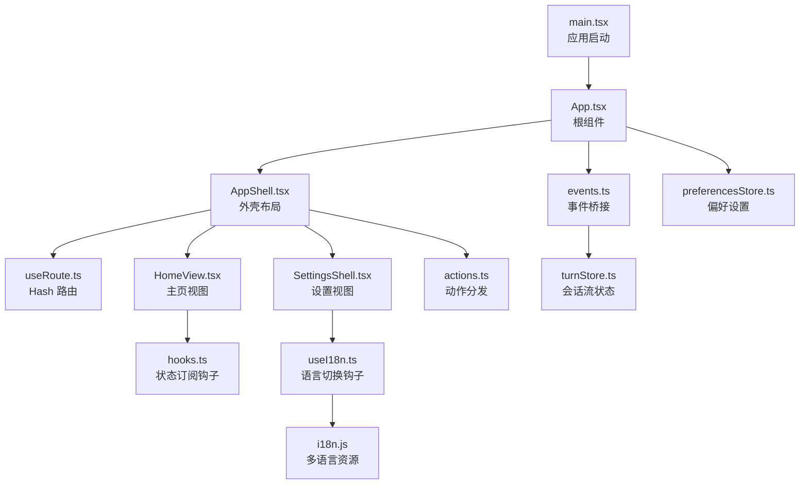
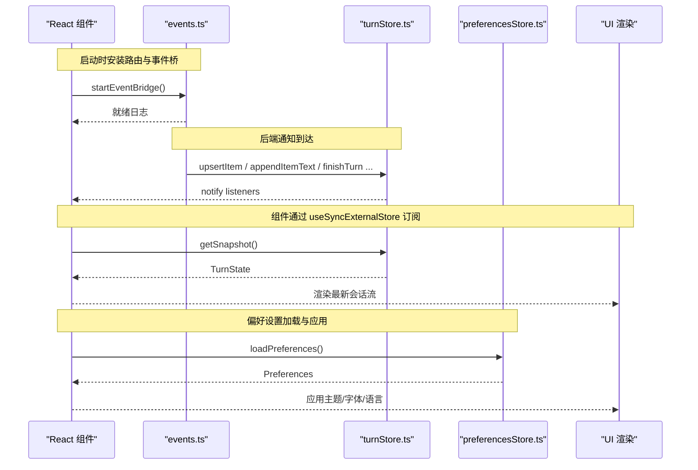
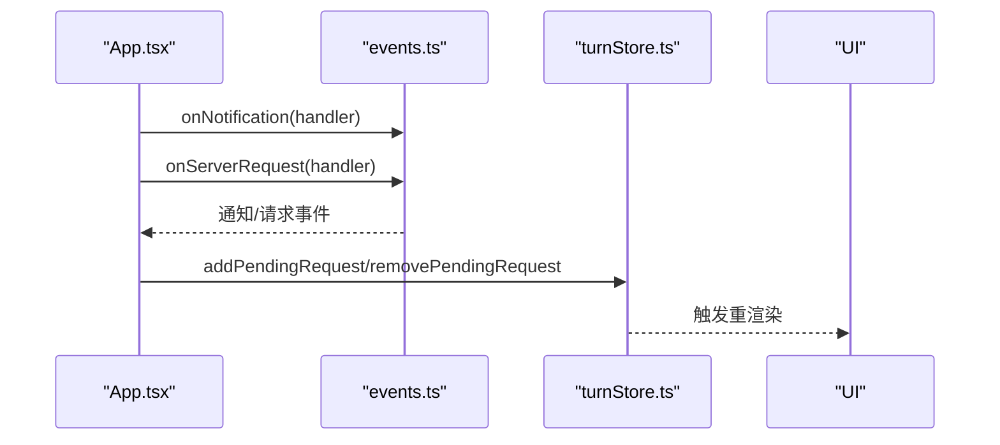
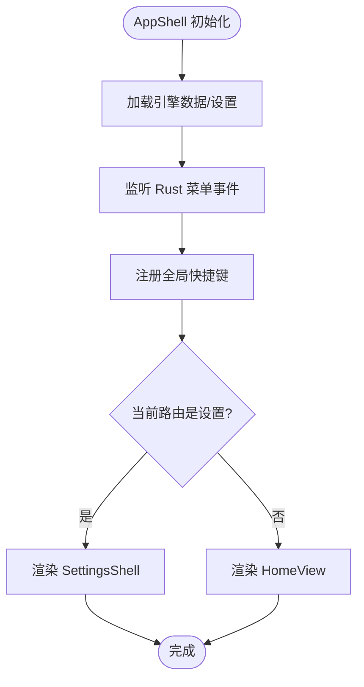
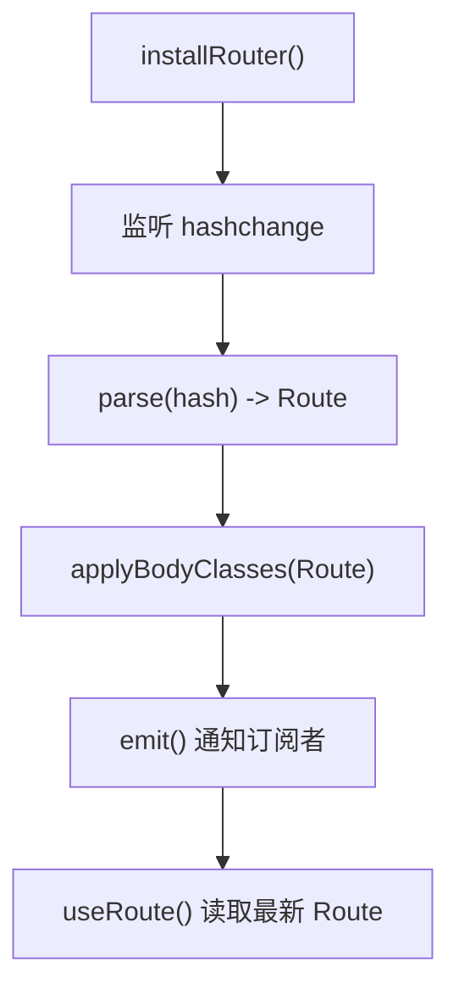
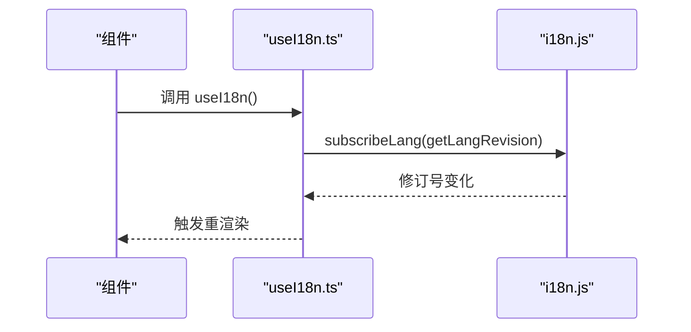
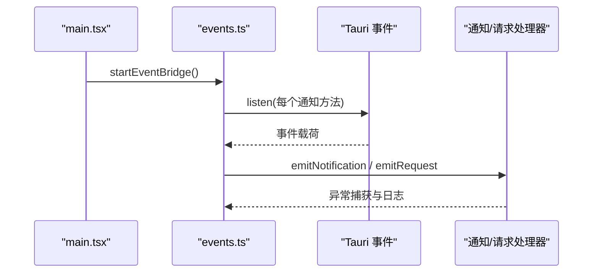
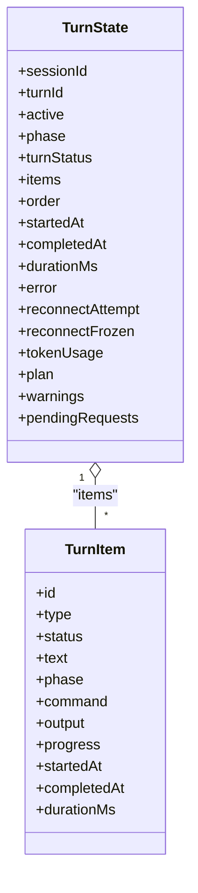
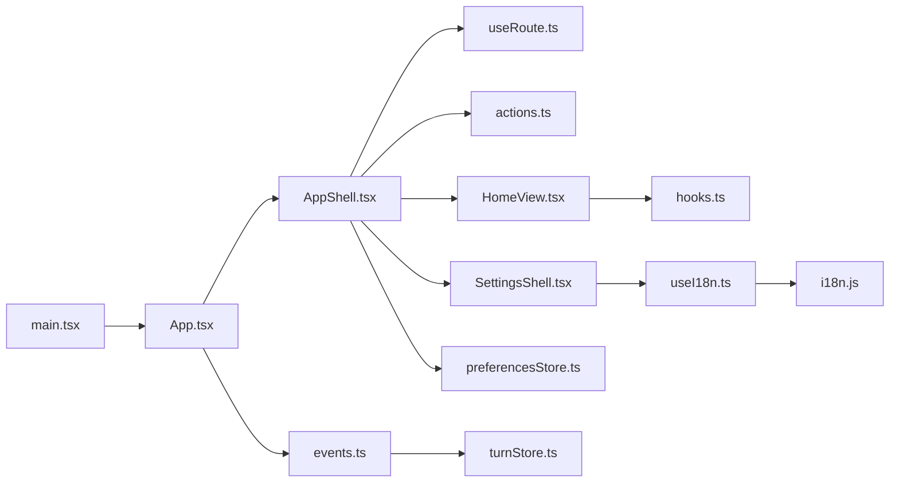

# 组件模式

<cite>
**本文引用的文件**
- [frontend/app/main.tsx](file://frontend/app/main.tsx)
- [frontend/app/App.tsx](file://frontend/app/App.tsx)
- [frontend/app/shell/useRoute.ts](file://frontend/app/shell/useRoute.ts)
- [frontend/app/shell/useI18n.ts](file://frontend/app/shell/useI18n.ts)
- [frontend/app/shell/AppShell.tsx](file://frontend/app/shell/AppShell.tsx)
- [frontend/app/shell/actions.ts](file://frontend/app/shell/actions.ts)
- [frontend/app/views/settings/SettingsShell.tsx](file://frontend/app/views/settings/SettingsShell.tsx)
- [frontend/app/views/HomeView.tsx](file://frontend/app/views/HomeView.tsx)
- [frontend/app/state/hooks.ts](file://frontend/app/state/hooks.ts)
- [frontend/app/state/turnStore.ts](file://frontend/app/state/turnStore.ts)
- [frontend/app/state/types.ts](file://frontend/app/state/types.ts)
- [frontend/app/state/preferencesStore.ts](file://frontend/app/state/preferencesStore.ts)
- [frontend/app/bridge/events.ts](file://frontend/app/bridge/events.ts)
- [frontend/src/js/i18n.js](file://frontend/src/js/i18n.js)
- [frontend/package.json](file://frontend/package.json)
</cite>

## 目录
1. [简介](#简介)
2. [项目结构](#项目结构)
3. [核心组件](#核心组件)
4. [架构总览](#架构总览)
5. [详细组件分析](#详细组件分析)
6. [依赖关系分析](#依赖关系分析)
7. [性能考虑](#性能考虑)
8. [故障排查指南](#故障排查指南)
9. [结论](#结论)
10. [附录](#附录)

## 简介
本文件面向 Codex-Tauri 的 React 前端，系统化梳理组件开发模式、状态管理、事件处理、路由与国际化集成、错误处理、组件复用与性能优化、测试策略以及文档与 API 设计实践。目标是帮助开发者在现有工程基础上高效扩展与维护，同时保持与原生样式和后端协议的一致性。

## 项目结构
前端采用 Vite + React（TypeScript）构建，入口位于 frontend/app/main.tsx，根组件为 App.tsx，外壳布局由 shell/AppShell.tsx 提供，视图层按功能划分到 views 目录，状态集中在 state 目录并通过 useSyncExternalStore 暴露给组件，事件桥接统一在 bridge/events.ts，国际化在 src/js/i18n.js。

图表来源
- [frontend/app/main.tsx:25-59](file://frontend/app/main.tsx#L25-L59)
- [frontend/app/App.tsx:15-45](file://frontend/app/App.tsx#L15-L45)
- [frontend/app/shell/AppShell.tsx:78-205](file://frontend/app/shell/AppShell.tsx#L78-L205)
- [frontend/app/shell/useRoute.ts:1-79](file://frontend/app/shell/useRoute.ts#L1-L79)
- [frontend/app/bridge/events.ts:145-159](file://frontend/app/bridge/events.ts#L145-L159)
- [frontend/app/state/turnStore.ts:1-49](file://frontend/app/state/turnStore.ts#L1-L49)
- [frontend/app/state/preferencesStore.ts:20-68](file://frontend/app/state/preferencesStore.ts#L20-L68)
- [frontend/app/shell/actions.ts:57-201](file://frontend/app/shell/actions.ts#L57-L201)
- [frontend/app/state/hooks.ts:17-43](file://frontend/app/state/hooks.ts#L17-L43)
- [frontend/app/shell/useI18n.ts:1-15](file://frontend/app/shell/useI18n.ts#L1-L15)
- [frontend/src/js/i18n.js:1-12](file://frontend/src/js/i18n.js#L1-L12)

章节来源
- [frontend/app/main.tsx:25-59](file://frontend/app/main.tsx#L25-L59)
- [frontend/package.json:7-13](file://frontend/package.json#L7-L13)

## 核心组件
- 根组件 App：负责将后端通知与请求接入状态层，并渲染外壳。
- 外壳 AppShell：组织标题栏、侧边栏、主内容区与设置页；监听菜单事件、快捷键，驱动导航与上下文能力。
- 视图 HomeView：对话入口，组合空态引导、Composer 与会话流 TurnStream。
- 设置 SettingsShell：基于路由 sub 参数切换标签页，支持搜索过滤与返回。
- 路由 useRoute：基于 Hash 的轻量路由，暴露 useSyncExternalStore 供任意组件读取。
- 国际化 useI18n：订阅语言修订号，强制界面刷新以响应语言切换。
- 事件桥 events：集中订阅 Tauri 事件，统一派发通知与服务端请求。
- 状态 turnStore：会话流单源事实，通过 subscribe/getSnapshot 暴露，避免高频更新导致重渲染风暴。
- 偏好 preferencesStore：合并默认值与后端配置，持久化保存。

章节来源
- [frontend/app/App.tsx:15-45](file://frontend/app/App.tsx#L15-L45)
- [frontend/app/shell/AppShell.tsx:78-205](file://frontend/app/shell/AppShell.tsx#L78-L205)
- [frontend/app/views/HomeView.tsx:135-207](file://frontend/app/views/HomeView.tsx#L135-L207)
- [frontend/app/views/settings/SettingsShell.tsx:66-162](file://frontend/app/views/settings/SettingsShell.tsx#L66-L162)
- [frontend/app/shell/useRoute.ts:1-79](file://frontend/app/shell/useRoute.ts#L1-L79)
- [frontend/app/shell/useI18n.ts:1-15](file://frontend/app/shell/useI18n.ts#L1-L15)
- [frontend/app/bridge/events.ts:1-172](file://frontend/app/bridge/events.ts#L1-L172)
- [frontend/app/state/turnStore.ts:1-49](file://frontend/app/state/turnStore.ts#L1-L49)
- [frontend/app/state/preferencesStore.ts:20-94](file://frontend/app/state/preferencesStore.ts#L20-L94)

## 架构总览
整体数据流遵循“事件驱动 + 外部存储”的模式：Tauri 事件经 events.ts 分发至各处理器，写入 turnStore 或 preferencesStore；React 组件通过自定义 Hook 使用 useSyncExternalStore 订阅这些外部 store，实现最小化重渲染与稳定排序。

图表来源
- [frontend/app/main.tsx:38-54](file://frontend/app/main.tsx#L38-L54)
- [frontend/app/bridge/events.ts:145-159](file://frontend/app/bridge/events.ts#L145-L159)
- [frontend/app/state/turnStore.ts:33-49](file://frontend/app/state/turnStore.ts#L33-L49)
- [frontend/app/state/preferencesStore.ts:59-68](file://frontend/app/state/preferencesStore.ts#L59-L68)

## 详细组件分析

### 根组件 App：事件接入与状态同步
- 职责：订阅通知与服务端请求，维护待处理请求集合，确保 UI 始终反映后端真实状态。
- 关键点：
  - onNotification → reduceNotification → turnStore
  - onServerRequest → addPendingRequest
  - serverRequest/resolved → removePendingRequest

图表来源
- [frontend/app/App.tsx:15-45](file://frontend/app/App.tsx#L15-L45)
- [frontend/app/bridge/events.ts:57-87](file://frontend/app/bridge/events.ts#L57-L87)
- [frontend/app/state/turnStore.ts:274-281](file://frontend/app/state/turnStore.ts#L274-L281)

章节来源
- [frontend/app/App.tsx:15-45](file://frontend/app/App.tsx#L15-L45)

### 外壳 AppShell：布局、导航与动作分发
- 职责：组装 TitleBar、Sidebar、主视图与设置视图；监听 Rust 菜单事件与全局快捷键；维护侧边栏折叠状态；提供 ShellContext 给动作系统。
- 关键点：
  - 通过 useRoute 获取当前视图，动态渲染 HomeView 或 SettingsShell
  - 通过 listen("menu") 接收 Rust 菜单事件，调用 dispatchAction
  - 通过 useShortcutDispatcher 绑定快捷键到同一动作通道
  - 通过 body class 控制样式（sidebar-collapsed、settings-open）

图表来源
- [frontend/app/shell/AppShell.tsx:78-205](file://frontend/app/shell/AppShell.tsx#L78-L205)
- [frontend/app/shell/useRoute.ts:40-54](file://frontend/app/shell/useRoute.ts#L40-L54)
- [frontend/app/shell/actions.ts:57-201](file://frontend/app/shell/actions.ts#L57-L201)

章节来源
- [frontend/app/shell/AppShell.tsx:78-205](file://frontend/app/shell/AppShell.tsx#L78-L205)
- [frontend/app/shell/actions.ts:57-201](file://frontend/app/shell/actions.ts#L57-L201)

### 路由 useRoute：Hash 路由与 DOM 同步
- 设计：基于 window.location.hash 解析 view/sub，暴露 useSyncExternalStore 订阅，避免 Provider 注入。
- 行为：navigate 修改 hash；installRouter 监听 hashchange 并同步 body class，兼容旧样式规则。

图表来源
- [frontend/app/shell/useRoute.ts:16-79](file://frontend/app/shell/useRoute.ts#L16-L79)

章节来源
- [frontend/app/shell/useRoute.ts:1-79](file://frontend/app/shell/useRoute.ts#L1-L79)

### 国际化 useI18n：语言切换与强制刷新
- 问题：applyLanguage 仅修补 data-i18n 节点，不重新挂载的组件会停留在初始语言。
- 方案：useI18n 订阅语言修订号，触发组件重渲染，保证所有层级及时刷新。

图表来源
- [frontend/app/shell/useI18n.ts:1-15](file://frontend/app/shell/useI18n.ts#L1-L15)
- [frontend/src/js/i18n.js:1-12](file://frontend/src/js/i18n.js#L1-L12)

章节来源
- [frontend/app/shell/useI18n.ts:1-15](file://frontend/app/shell/useI18n.ts#L1-L15)
- [frontend/src/js/i18n.js:1-12](file://frontend/src/js/i18n.js#L1-L12)

### 事件桥 events：统一事件接入
- 职责：为所有 NOTIFICATION_METHODS 建立 Tauri 监听，并将服务端请求映射到固定通道；对未知方法发出警告但不中断流程。
- 健壮性：单个通道失败不影响其他通道；提供 stopEventBridge 用于测试与热重载清理。

图表来源
- [frontend/app/main.tsx:38-43](file://frontend/app/main.tsx#L38-L43)
- [frontend/app/bridge/events.ts:99-159](file://frontend/app/bridge/events.ts#L99-L159)

章节来源
- [frontend/app/bridge/events.ts:1-172](file://frontend/app/bridge/events.ts#L1-L172)

### 状态 turnStore：会话流单源事实
- 设计：外部 store 通过 subscribe/getSnapshot 暴露，配合 useSyncExternalStore 实现高频增量更新下的稳定渲染。
- 关键操作：
  - beginTurn：重置会话级字段，跨线程时清空 items/order
  - beginUserTurn：乐观插入用户消息气泡，便于快速反馈
  - appendItemText/appendItemOutput/pushItemProgress：增量追加文本/输出/进度
  - completeItem：标记完成并计算耗时
  - finishTurn：结束会话，记录状态与耗时
  - loadThreadFromSession：从后端拉取历史并填充 store

图表来源
- [frontend/app/state/types.ts:12-109](file://frontend/app/state/types.ts#L12-L109)
- [frontend/app/state/turnStore.ts:28-49](file://frontend/app/state/turnStore.ts#L28-L49)

章节来源
- [frontend/app/state/turnStore.ts:51-285](file://frontend/app/state/turnStore.ts#L51-L285)
- [frontend/app/state/types.ts:12-109](file://frontend/app/state/types.ts#L12-L109)

### 偏好 preferencesStore：设置合并与持久化
- 设计：以 section 为单位维护 map，合并默认值后持久化；loadPreferences 幂等且容错。
- 使用：应用启动时加载，随后根据 general.language 选择语言并应用。

章节来源
- [frontend/app/state/preferencesStore.ts:20-94](file://frontend/app/state/preferencesStore.ts#L20-L94)
- [frontend/app/main.tsx:44-54](file://frontend/app/main.tsx#L44-L54)

### 视图 HomeView：对话入口与历史装载
- 职责：组合空态引导、TurnStream 与 Composer；当 activeSessionId 变化时装载历史；探测引擎状态。
- 交互：提示卡片通过 CustomEvent 向 Composer 注入提示词；发送走后端 new_session/send_message。

章节来源
- [frontend/app/views/HomeView.tsx:135-207](file://frontend/app/views/HomeView.tsx#L135-L207)

### 设置 SettingsShell：标签导航与搜索
- 职责：基于 route.sub 渲染对应标签；支持搜索过滤组与链接；返回与关闭按钮均通过 navigate 回到 home。
- 兼容性：严格遵循 settings.css 的 DOM 契约，确保样式正确。

章节来源
- [frontend/app/views/settings/SettingsShell.tsx:66-162](file://frontend/app/views/settings/SettingsShell.tsx#L66-L162)

## 依赖关系分析
- main.tsx 负责安装路由、事件桥、加载偏好并启动 React 树。
- App.tsx 连接事件桥与状态层，渲染 AppShell。
- AppShell 依赖 useRoute、actions、appStore、turnStore，并承载视图容器。
- HomeView 依赖 appStore、turnStore、i18n。
- SettingsShell 依赖 useRoute、useI18n、sections 配置。
- events.ts 依赖 @protocol/notifications 与 @protocol/requests。
- turnStore 依赖 types 与 Tauri invoke。
- preferencesStore 依赖 i18n pages 与默认值合并逻辑。

图表来源
- [frontend/app/main.tsx:25-59](file://frontend/app/main.tsx#L25-L59)
- [frontend/app/App.tsx:15-45](file://frontend/app/App.tsx#L15-L45)
- [frontend/app/shell/AppShell.tsx:78-205](file://frontend/app/shell/AppShell.tsx#L78-L205)
- [frontend/app/bridge/events.ts:145-159](file://frontend/app/bridge/events.ts#L145-L159)
- [frontend/app/state/turnStore.ts:1-49](file://frontend/app/state/turnStore.ts#L1-L49)
- [frontend/app/state/preferencesStore.ts:20-68](file://frontend/app/state/preferencesStore.ts#L20-L68)
- [frontend/app/shell/useI18n.ts:1-15](file://frontend/app/shell/useI18n.ts#L1-L15)
- [frontend/src/js/i18n.js:1-12](file://frontend/src/js/i18n.js#L1-L12)

章节来源
- [frontend/app/main.tsx:25-59](file://frontend/app/main.tsx#L25-L59)
- [frontend/app/App.tsx:15-45](file://frontend/app/App.tsx#L15-L45)
- [frontend/app/shell/AppShell.tsx:78-205](file://frontend/app/shell/AppShell.tsx#L78-L205)
- [frontend/app/bridge/events.ts:145-159](file://frontend/app/bridge/events.ts#L145-L159)
- [frontend/app/state/turnStore.ts:1-49](file://frontend/app/state/turnStore.ts#L1-L49)
- [frontend/app/state/preferencesStore.ts:20-68](file://frontend/app/state/preferencesStore.ts#L20-L68)
- [frontend/app/shell/useI18n.ts:1-15](file://frontend/app/shell/useI18n.ts#L1-L15)
- [frontend/src/js/i18n.js:1-12](file://frontend/src/js/i18n.js#L1-L12)

## 性能考虑
- 使用 useSyncExternalStore 订阅外部 store（turnStore、preferencesStore、i18n），避免 Context 与 prop drilling 带来的不必要重渲染。
- turnStore 通过 items+order 的结构保证 O(1) 查找与稳定渲染顺序，适合高频增量更新。
- 事件桥对每个通道独立 try/catch，单个失败不影响整体可用性。
- 偏好设置先本地 commit 再异步持久化，提升 UI 响应速度。
- 路由变更通过 body class 复用已有样式规则，减少额外计算。

[本节为通用指导，无需特定文件引用]

## 故障排查指南
- 事件桥未就绪：检查 main.tsx 是否在 createRoot 前调用 installRouter 与 startEventBridge。
- 通知丢失：确认 NOTIFICATION_METHODS 已生成并全部绑定；查看 events.ts 中 bindNotification 的错误日志。
- 语言未刷新：确保组件内调用 useI18n 以订阅语言修订号。
- 设置页样式错乱：确认 body.settings-open 类被正确切换；检查 SettingsShell 的 DOM 结构与 class 命名。
- 会话历史为空：检查 loadThreadFromSession 是否成功调用；关注 get_session 与 get_runtime_events 的返回结构。
- 动作无效：核对 actions.ts 中的 action 字符串是否与菜单/快捷键一致；确认 ShellContext 已注入。

章节来源
- [frontend/app/main.tsx:38-54](file://frontend/app/main.tsx#L38-L54)
- [frontend/app/bridge/events.ts:99-159](file://frontend/app/bridge/events.ts#L99-L159)
- [frontend/app/shell/useI18n.ts:1-15](file://frontend/app/shell/useI18n.ts#L1-L15)
- [frontend/app/views/settings/SettingsShell.tsx:66-162](file://frontend/app/views/settings/SettingsShell.tsx#L66-L162)
- [frontend/app/state/turnStore.ts:328-467](file://frontend/app/state/turnStore.ts#L328-L467)
- [frontend/app/shell/actions.ts:57-201](file://frontend/app/shell/actions.ts#L57-L201)

## 结论
Codex-Tauri 的前端采用“事件驱动 + 外部 store + useSyncExternalStore”的轻量架构，结合 Hash 路由与严格的 DOM 契约，既保证了与原有样式的一致，又实现了高性能的实时会话流渲染。通过统一的动作分发与国际化订阅机制，组件间通信清晰可测，扩展与维护成本低。建议在新增功能时遵循现有模式：事件进入 events.ts，状态变更集中在 state/*，UI 通过 Hook 订阅，路由与国际化保持一致。

[本节为总结，无需特定文件引用]

## 附录

### 组件复用策略
- 将通用 UI 片段抽取为独立组件（如设置项、卡片、图标），通过 props 传递数据与回调。
- 使用 ShellContext 共享导航与窗口控制能力，避免重复实现。
- 通过 sections 配置驱动设置页标签，便于扩展新标签而不改动核心逻辑。

章节来源
- [frontend/app/views/settings/SettingsShell.tsx:66-162](file://frontend/app/views/settings/SettingsShell.tsx#L66-L162)
- [frontend/app/shell/AppShell.tsx:132-161](file://frontend/app/shell/AppShell.tsx#L132-L161)

### 性能优化技巧
- 使用 useSyncExternalStore 订阅外部 store，减少重渲染范围。
- 增量更新 turnStore（appendItemText/appendItemOutput/pushItemProgress），避免全量重建。
- 偏好设置先本地提交再异步持久化，提升交互响应。
- 路由变更通过 body class 复用样式，避免复杂条件渲染。

章节来源
- [frontend/app/state/hooks.ts:17-43](file://frontend/app/state/hooks.ts#L17-L43)
- [frontend/app/state/turnStore.ts:159-207](file://frontend/app/state/turnStore.ts#L159-L207)
- [frontend/app/state/preferencesStore.ts:76-88](file://frontend/app/state/preferencesStore.ts#L76-L88)
- [frontend/app/shell/useRoute.ts:63-79](file://frontend/app/shell/useRoute.ts#L63-L79)

### 测试模式
- 使用 stopEventBridge 在测试中清理事件监听，避免跨用例污染。
- 模拟 turnStore 的 subscribe/getSnapshot 行为，验证组件在不同状态下的渲染。
- 通过 actions.ts 的动作字符串断言菜单/快捷键路径是否正确。

章节来源
- [frontend/app/bridge/events.ts:161-172](file://frontend/app/bridge/events.ts#L161-L172)
- [frontend/app/state/turnStore.ts:33-49](file://frontend/app/state/turnStore.ts#L33-L49)
- [frontend/app/shell/actions.ts:57-201](file://frontend/app/shell/actions.ts#L57-L201)

### 文档生成与 API 设计
- 对外暴露的 store 方法（如 beginTurn、finishTurn、loadThreadFromSession）应保持稳定接口，便于上层组件与测试依赖。
- 类型定义集中在 types.ts，作为组件与 store 之间的契约。
- 路由与动作字符串需与菜单/快捷键保持一致，避免漂移。

章节来源
- [frontend/app/state/types.ts:12-109](file://frontend/app/state/types.ts#L12-L109)
- [frontend/app/state/turnStore.ts:51-285](file://frontend/app/state/turnStore.ts#L51-L285)
- [frontend/app/shell/useRoute.ts:40-54](file://frontend/app/shell/useRoute.ts#L40-L54)
- [frontend/app/shell/actions.ts:57-201](file://frontend/app/shell/actions.ts#L57-L201)

### 向后兼容性考虑
- 路由保持 #view 与 #view/sub 格式，兼容深链。
- 设置页严格遵循 settings.css 的 DOM 契约，确保样式不变。
- 事件桥对未知方法发出警告而非抛出异常，保证升级过程中的稳定性。

章节来源
- [frontend/app/shell/useRoute.ts:1-79](file://frontend/app/shell/useRoute.ts#L1-L79)
- [frontend/app/views/settings/SettingsShell.tsx:1-18](file://frontend/app/views/settings/SettingsShell.tsx#L1-L18)
- [frontend/app/bridge/events.ts:119-139](file://frontend/app/bridge/events.ts#L119-L139)

### 开发工具链配置
- 使用 Vite 进行开发与构建，脚本包括 dev、build、preview 与浏览器模式。
- TypeScript 用于类型检查与编译，React 插件支持 JSX。
- Tauri 客户端 API 用于 IPC、事件监听与窗口控制。

章节来源
- [frontend/package.json:7-29](file://frontend/package.json#L7-L29)