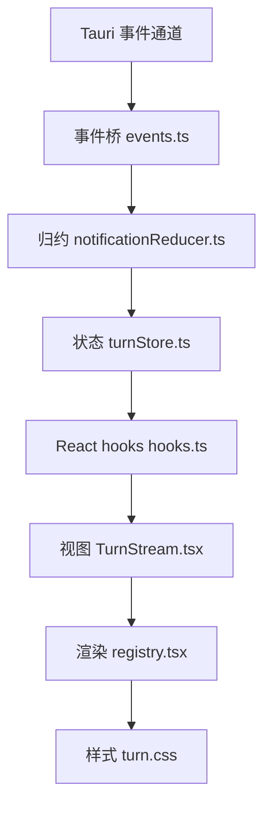
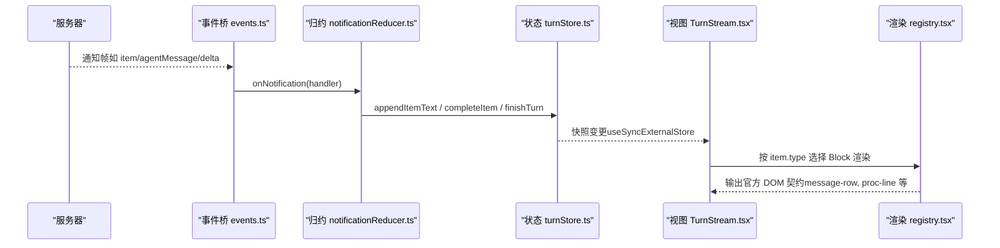
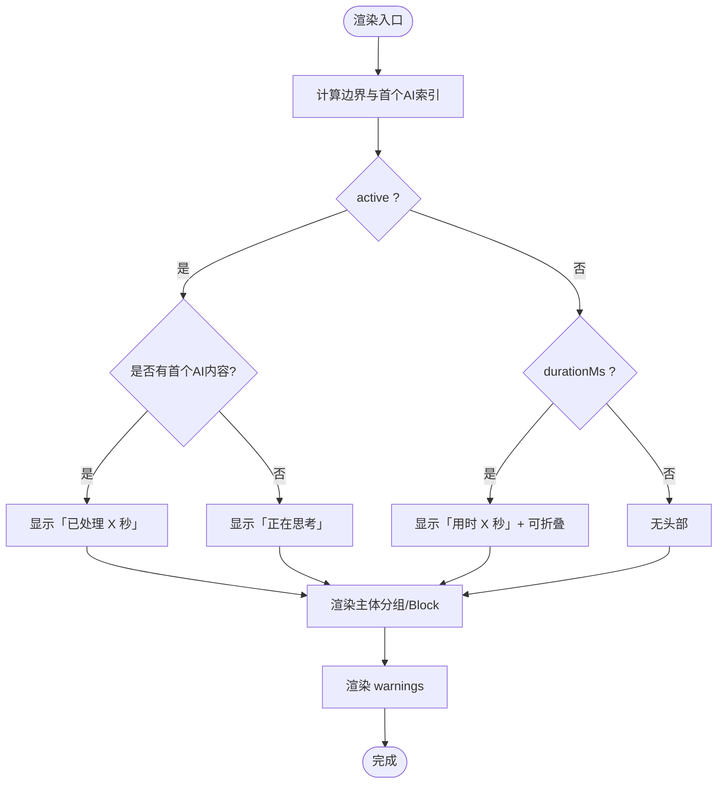
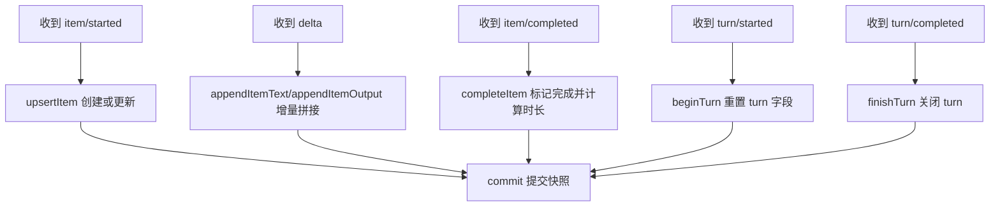
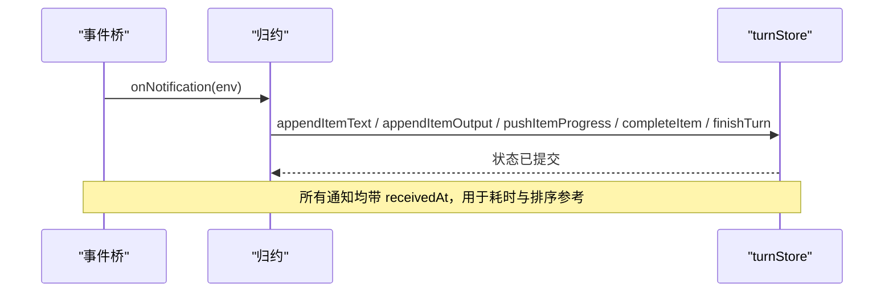
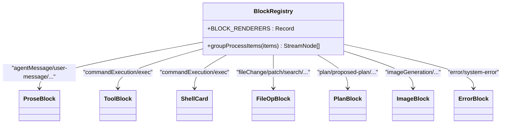
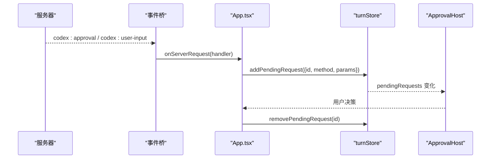
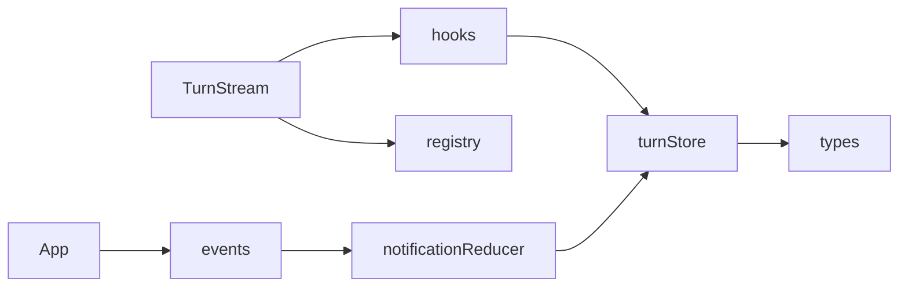

# 对话流组件 (TurnStream)

<cite>
**本文引用的文件**
- [TurnStream.tsx](file://frontend/app/views/TurnStream.tsx)
- [turnStore.ts](file://frontend/app/state/turnStore.ts)
- [types.ts](file://frontend/app/state/types.ts)
- [hooks.ts](file://frontend/app/state/hooks.ts)
- [registry.tsx](file://frontend/app/blocks/registry.tsx)
- [events.ts](file://frontend/app/bridge/events.ts)
- [notificationReducer.ts](file://frontend/app/state/notificationReducer.ts)
- [appearance.ts](file://frontend/app/state/appearance.ts)
- [turn.css](file://frontend/app/styles/turn.css)
- [App.tsx](file://frontend/app/App.tsx)
</cite>

## 目录
1. [简介](#简介)
2. [项目结构](#项目结构)
3. [核心组件](#核心组件)
4. [架构总览](#架构总览)
5. [详细组件分析](#详细组件分析)
6. [依赖关系分析](#依赖关系分析)
7. [性能考量](#性能考量)
8. [故障排查指南](#故障排查指南)
9. [结论](#结论)
10. [附录](#附录)

## 简介
本文件为 Codex-Tauri 的对话流组件 TurnStream 提供系统化、可操作的文档。内容覆盖：
- 如何渲染与管理对话历史（用户消息、AI响应、系统通知、审批请求）
- 实时消息流处理机制（事件桥接、状态归约、排序与时间戳）
- 不同消息类型的渲染策略（文本、代码块、文件附件、交互式元素）
- 消息状态管理（加载、错误、重试）
- 性能优化（虚拟滚动、消息缓存、内存管理）
- 消息格式规范、自定义渲染器与主题适配指南

## 项目结构
TurnStream 位于前端 React 应用，围绕“会话轮次（turn）”组织数据与渲染：
- 视图层：TurnStream 负责当前 turn 的头部状态机、折叠展示、警告条等
- 状态层：turnStore 维护 items/order、turn 生命周期、token 用量、计划、警告、待处理请求
- 事件桥：events.ts 订阅 Tauri 事件通道，将服务器推送的消息分发给 reducer
- 归约层：notificationReducer.ts 将协议方法映射到 store 动作
- 渲染层：blocks/registry.tsx 根据 item.type 选择 Block 渲染器，输出官方 DOM 契约类名
- 样式层：turn.css 定义运行中头部的 spinner、命令面板、文件操作行、diff 面板等

**图表来源**
- [events.ts:57-159](file://frontend/app/bridge/events.ts#L57-L159)
- [notificationReducer.ts:189-445](file://frontend/app/state/notificationReducer.ts#L189-L445)
- [turnStore.ts:28-157](file://frontend/app/state/turnStore.ts#L28-L157)
- [hooks.ts:17-42](file://frontend/app/state/hooks.ts#L17-L42)
- [TurnStream.tsx:64-186](file://frontend/app/views/TurnStream.tsx#L64-L186)
- [registry.tsx:749-800](file://frontend/app/blocks/registry.tsx#L749-L800)
- [turn.css:1-205](file://frontend/app/styles/turn.css#L1-L205)

**章节来源**
- [TurnStream.tsx:1-186](file://frontend/app/views/TurnStream.tsx#L1-L186)
- [turnStore.ts:1-467](file://frontend/app/state/turnStore.ts#L1-L467)
- [events.ts:1-172](file://frontend/app/bridge/events.ts#L1-L172)
- [notificationReducer.ts:1-446](file://frontend/app/state/notificationReducer.ts#L1-L446)
- [registry.tsx:1-824](file://frontend/app/blocks/registry.tsx#L1-L824)
- [turn.css:1-205](file://frontend/app/styles/turn.css#L1-L205)

## 核心组件
- TurnStream：当前 turn 的头部状态机（思考/进行中/完成）、折叠控制、警告提示；按边界定位首个 AI 内容并锚定头部
- turnStore：单一事实源，维护 items（字典）+ order（数组），保证 O(1) 查找与稳定渲染顺序；提供 beginUserTurn、appendItemText、appendItemOutput、completeItem 等原子更新
- blocks/registry：BlockType → 渲染器的注册表，输出官方 CSS 类名契约，支持工具行、文件操作、diff、计划、图片/附件、错误等
- events + notificationReducer：事件桥接收 Tauri 事件，reducer 将协议方法转为 store 动作，确保 UI 不臆造状态

**章节来源**
- [TurnStream.tsx:64-186](file://frontend/app/views/TurnStream.tsx#L64-L186)
- [turnStore.ts:28-157](file://frontend/app/state/turnStore.ts#L28-L157)
- [registry.tsx:749-800](file://frontend/app/blocks/registry.tsx#L749-L800)
- [events.ts:57-159](file://frontend/app/bridge/events.ts#L57-L159)
- [notificationReducer.ts:189-445](file://frontend/app/state/notificationReducer.ts#L189-L445)

## 架构总览
TurnStream 的数据流遵循“事件驱动 + 单向数据流”：
- 服务器通过 Tauri 事件推送通知（如 item/agentMessage/delta、item/completed、turn/completed）
- 事件桥统一封装为 NotificationEnvelope，调用已注册的处理器
- notificationReducer 将方法映射为 turnStore 的动作（追加文本、追加输出、完成项、结束 turn 等）
- turnStore 以不可变方式提交新快照，触发订阅者重渲染
- TurnStream 读取 useTurnState/useTurnItems，计算节点分组与可见性，交由 Block 渲染

**图表来源**
- [events.ts:57-159](file://frontend/app/bridge/events.ts#L57-L159)
- [notificationReducer.ts:276-357](file://frontend/app/state/notificationReducer.ts#L276-L357)
- [turnStore.ts:159-234](file://frontend/app/state/turnStore.ts#L159-L234)
- [hooks.ts:17-42](file://frontend/app/state/hooks.ts#L17-L42)
- [registry.tsx:749-800](file://frontend/app/blocks/registry.tsx#L749-L800)

## 详细组件分析

### TurnStream：头部状态机与折叠逻辑
- 状态机：thinking（无 AI 内容）→ live（有首个 AI 内容，计时跳动）→ done（完成，显示用时并可折叠）
- 边界定位：以最后一个 user-message 作为 turn 边界，避免后续 turn 的头部插入上一 turn 的回答中
- 折叠：仅对已完成 turn 生效，用户气泡始终可见；首次进入 turn 时展开
- 警告：底部渲染 warnings 列表（来自 server warning/configWarning 等）

**图表来源**
- [TurnStream.tsx:64-186](file://frontend/app/views/TurnStream.tsx#L64-L186)

**章节来源**
- [TurnStream.tsx:33-186](file://frontend/app/views/TurnStream.tsx#L33-L186)

### turnStore：消息排序、增量追加与历史装载
- 数据结构：items 字典 + order 数组，保证稳定渲染顺序与高效查找
- 乐观用户消息：beginUserTurn 立即插入用户气泡，失败时可 discardItem 回滚
- 增量追加：appendItemText/appendItemOutput 支持流式拼接，避免全量重建
- 完成与时长：completeItem 计算 durationMs，用于单条 item 耗时展示
- 历史装载：loadThreadFromSession 优先 thread.messages，否则 fallback 到 timeline；将服务端数据映射为 TurnItem

**图表来源**
- [turnStore.ts:71-157](file://frontend/app/state/turnStore.ts#L71-L157)
- [turnStore.ts:159-234](file://frontend/app/state/turnStore.ts#L159-L234)
- [turnStore.ts:241-256](file://frontend/app/state/turnStore.ts#L241-L256)

**章节来源**
- [turnStore.ts:28-157](file://frontend/app/state/turnStore.ts#L28-L157)
- [turnStore.ts:159-234](file://frontend/app/state/turnStore.ts#L159-L234)
- [turnStore.ts:328-467](file://frontend/app/state/turnStore.ts#L328-L467)

### 事件桥与归约：WebSocket/事件监听与消息排序
- 事件桥：startEventBridge 动态绑定所有 NOTIFICATION_METHODS 与两个固定请求通道（approval、user-input）
- 归约：reduceNotification 将协议方法映射为 store 动作，包括：
  - 流式文本：item/agentMessage/delta、item/reasoning/textDelta、item/plan/delta
  - 流式输出：item/commandExecution/outputDelta、item/fileChange/outputDelta
  - 进度：item/mcpToolCall/progress
  - 完成：item/completed、process/exited、turn/completed
  - 诊断：error、warning、configWarning、model/rerouted
- 未知方法：记录为 warnings，便于发现未处理的协议扩展

**图表来源**
- [events.ts:57-159](file://frontend/app/bridge/events.ts#L57-L159)
- [notificationReducer.ts:276-357](file://frontend/app/state/notificationReducer.ts#L276-L357)
- [notificationReducer.ts:391-445](file://frontend/app/state/notificationReducer.ts#L391-L445)

**章节来源**
- [events.ts:1-172](file://frontend/app/bridge/events.ts#L1-L172)
- [notificationReducer.ts:189-445](file://frontend/app/state/notificationReducer.ts#L189-L445)

### 渲染器注册表：消息类型与渲染策略
- 文本消息：agentMessage/user-message/paragraph/realtime-transcript → ProseBlock
- 推理：reasoning → 隐藏（ReasoningBlock 返回 null）
- 工具/命令：commandExecution/exec → ShellCard；其他工具 → ProcLine（含自动折叠）
- 文件操作：fileChange/patch/search/read/list_files → FileOpBlock（差异统计、复制 diff）
- 计划：plan/proposed-plan/codexDirective → PlanBlock
- 图片/附件：imageGeneration/generated-image → ImageBlock；AttachmentBlock 用于通用附件
- 错误：error/system-error → ErrorBlock
- 分组：groupProcessItems 将连续完成的同类工具合并为 ProcGroup，减少视觉噪音

**图表来源**
- [registry.tsx:127-163](file://frontend/app/blocks/registry.tsx#L127-L163)
- [registry.tsx:235-241](file://frontend/app/blocks/registry.tsx#L235-L241)
- [registry.tsx:305-404](file://frontend/app/blocks/registry.tsx#L305-L404)
- [registry.tsx:416-509](file://frontend/app/blocks/registry.tsx#L416-L509)
- [registry.tsx:664-686](file://frontend/app/blocks/registry.tsx#L664-L686)
- [registry.tsx:688-713](file://frontend/app/blocks/registry.tsx#L688-L713)
- [registry.tsx:715-723](file://frontend/app/blocks/registry.tsx#L715-L723)
- [registry.tsx:558-595](file://frontend/app/blocks/registry.tsx#L558-L595)
- [registry.tsx:749-800](file://frontend/app/blocks/registry.tsx#L749-L800)

**章节来源**
- [registry.tsx:1-824](file://frontend/app/blocks/registry.tsx#L1-L824)

### 审批请求与交互
- 审批/用户输入：App.tsx 订阅 onServerRequest，将 pendingRequests 加入 turnStore；当 serverRequest/resolved 时移除
- ApprovalHost：在 TurnStream 中挂载，承载审批卡片与用户输入卡片（由 approvals 模块实现）

**图表来源**
- [App.tsx:15-45](file://frontend/app/App.tsx#L15-L45)
- [events.ts:119-139](file://frontend/app/bridge/events.ts#L119-L139)
- [turnStore.ts:274-281](file://frontend/app/state/turnStore.ts#L274-L281)

**章节来源**
- [App.tsx:15-45](file://frontend/app/App.tsx#L15-L45)
- [events.ts:119-139](file://frontend/app/bridge/events.ts#L119-L139)
- [turnStore.ts:274-281](file://frontend/app/state/turnStore.ts#L274-L281)

## 依赖关系分析
- TurnStream 依赖 hooks 提供的 useTurnState/useTurnItems
- hooks 使用 useSyncExternalStore 订阅 turnStore 的 subscribe/getSnapshot
- turnStore 依赖 types 中的 TurnItem/TurnState/newItem/emptyTurn
- registry 依赖 @protocol/blocks 的 BlockType 枚举进行类型安全映射
- events 依赖 @protocol/notifications 的 NOTIFICATION_METHODS 动态绑定
- notificationReducer 依赖 status 与 plan/tokenUsage 等类型

**图表来源**
- [hooks.ts:17-42](file://frontend/app/state/hooks.ts#L17-L42)
- [turnStore.ts:13-26](file://frontend/app/state/turnStore.ts#L13-L26)
- [types.ts:1-146](file://frontend/app/state/types.ts#L1-L146)
- [registry.tsx:17-20](file://frontend/app/blocks/registry.tsx#L17-L20)
- [events.ts:13-21](file://frontend/app/bridge/events.ts#L13-L21)
- [notificationReducer.ts:12-15](file://frontend/app/state/notificationReducer.ts#L12-L15)

**章节来源**
- [hooks.ts:17-42](file://frontend/app/state/hooks.ts#L17-L42)
- [turnStore.ts:13-26](file://frontend/app/state/turnStore.ts#L13-L26)
- [types.ts:1-146](file://frontend/app/state/types.ts#L1-L146)
- [registry.tsx:17-20](file://frontend/app/blocks/registry.tsx#L17-L20)
- [events.ts:13-21](file://frontend/app/bridge/events.ts#L13-L21)
- [notificationReducer.ts:12-15](file://frontend/app/state/notificationReducer.ts#L12-L15)

## 性能考量
- 渲染顺序稳定：items 字典 + order 数组，避免重排抖动
- 增量更新：appendItemText/appendItemOutput 仅拼接字符串片段，避免重建整段文本
- 流式输出限制：ShellCard 对输出行做尾部窗口（默认最多保留最近 400 行），防止长构建/目录列表撑爆 DOM
- 分组折叠：groupProcessItems 将连续完成的同类工具合并为一组，减少条目数量
- 头部节流：live 状态下使用 ~4Hz 定时器刷新“已处理 X 秒”，降低高频重绘开销
- 主题与字体缩放：appearance.ts 通过 CSS 变量比例缩放，避免大量内联样式
- 建议（未在仓库实现但可参考）：
  - 虚拟滚动：对超长历史列表可采用基于可视区域的虚拟滚动（如 react-window），结合 order 切片渲染
  - 消息缓存：对大文本/大 diff 可考虑惰性解析与分页加载
  - 内存管理：对长时间运行的进程输出采用环形缓冲，丢弃最旧行

[本节为通用性能建议，不直接分析具体文件]

## 故障排查指南
- 未知协议方法：notificationReducer 会将未处理的方法记录为 warnings，可在 TurnStream 底部查看
- 连接/事件失败：events.ts 在 bindNotification/bindServerRequest 捕获异常并记录日志，不影响其他通道
- 发送失败回滚：beginUserTurn 返回 id，若发送失败可通过 discardItem 移除乐观气泡而不清空历史
- 错误信息：error 通知会设置 turnStore.error，可用于全局错误提示
- 审批卡消失：serverRequest/resolved 会移除对应 pendingRequest，确认 requestId 匹配

**章节来源**
- [notificationReducer.ts:437-445](file://frontend/app/state/notificationReducer.ts#L437-L445)
- [events.ts:99-139](file://frontend/app/bridge/events.ts#L99-L139)
- [turnStore.ts:118-141](file://frontend/app/state/turnStore.ts#L118-L141)
- [turnStore.ts:283-285](file://frontend/app/state/turnStore.ts#L283-L285)
- [App.tsx:35-43](file://frontend/app/App.tsx#L35-L43)

## 结论
TurnStream 通过事件驱动的单向数据流，实现了高保真、低耦合的对话流渲染：
- 以 turnStore 为单一事实源，确保消息顺序与一致性
- 通过事件桥与归约层解耦协议与 UI，新增协议方法只需在 reducer 添加分支
- 渲染器注册表严格对齐官方 DOM 契约，保障样式一致性与可维护性
- 针对流式场景做了多项优化（增量拼接、行窗口、分组折叠、节流刷新）
- 审批与交互通过独立通道与 UI 表面呈现，提升用户体验

[本节总结性内容，不直接分析具体文件]

## 附录

### 消息格式规范（节选）
- TurnItem：包含 id、type、status、text/output/diff/path/tool 等字段，以及 startedAt/completedAt/durationMs
- TurnState：包含 sessionId/turnId、active/phase/turnStatus、items/order、tokenUsage/plan/warnings/pendingRequests
- 协议方法：NOTIFICATION_METHODS 由生成文件提供，reducer 必须全部覆盖

**章节来源**
- [types.ts:11-109](file://frontend/app/state/types.ts#L11-L109)
- [events.ts:13-21](file://frontend/app/bridge/events.ts#L13-L21)
- [notificationReducer.ts:189-445](file://frontend/app/state/notificationReducer.ts#L189-L445)

### 自定义渲染器与主题适配
- 自定义渲染器：在 BLOCK_RENDERERS 中为新 BlockType 添加映射，输出官方类名与层级
- 主题适配：appearance.ts 通过 CSS 变量与 data-* 属性切换主题与对比度；turn.css 使用 CSS 变量着色
- 国际化：i18n.js 提供 t(key, fallback, vars)，所有用户可见文案通过 t() 获取

**章节来源**
- [registry.tsx:749-800](file://frontend/app/blocks/registry.tsx#L749-L800)
- [appearance.ts:62-176](file://frontend/app/state/appearance.ts#L62-L176)
- [turn.css:1-205](file://frontend/app/styles/turn.css#L1-L205)