# 消息输入组件 (Composer)

<cite>
**本文引用的文件**
- [Composer.tsx](file://frontend/app/views/Composer.tsx)
- [ComposerPopover.tsx](file://frontend/app/shell/ComposerPopover.tsx)
- [appStore.ts](file://frontend/app/state/appStore.ts)
- [turnStore.ts](file://frontend/app/state/turnStore.ts)
- [preferencesStore.ts](file://frontend/app/state/preferencesStore.ts)
- [i18n.js](file://frontend/src/js/i18n.js)
</cite>

## 目录
1. [简介](#简介)
2. [项目结构](#项目结构)
3. [核心组件](#核心组件)
4. [架构总览](#架构总览)
5. [详细组件分析](#详细组件分析)
6. [依赖关系分析](#依赖关系分析)
7. [性能考量](#性能考量)
8. [故障排查指南](#故障排查指南)
9. [结论](#结论)
10. [附录：扩展与自定义样式](#附录扩展与自定义样式)

## 简介
Composer 是 Codex-Tauri 的消息输入组件，负责文本输入、附件上传、模型选择、权限设置和项目配置。它提供自适应高度的输入框、快捷键支持（Enter 发送、Shift+Enter 换行）、以及“发送/停止”按钮的状态切换。同时提供三个主要菜单：
- 权限模式：工作区、帮助审批、完全访问
- 模型选择器：提供商分组、推理强度滑块
- 项目选择器：搜索、新建项目、脱离项目

本文件从系统架构、数据流、交互流程、状态管理、错误处理与国际化等维度进行详细说明，并给出扩展与自定义样式的实践建议。

## 项目结构
Composer 位于前端 React 层，围绕以下模块协作：
- 视图层：Composer 主组件与弹出面板 ComposerPopover
- 状态层：应用状态 appStore、回合状态 turnStore、偏好 preferencesStore
- 国际化：i18n 资源字典
- 后端交互：通过 Tauri invoke 调用 send_message、new_session、interrupt_session 等命令

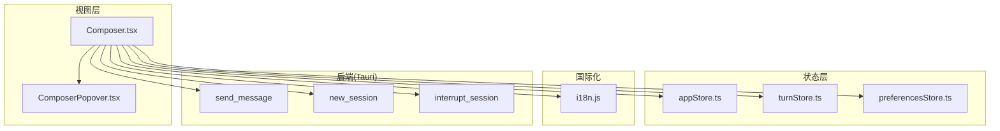

图表来源
- [Composer.tsx:600-1089](file://frontend/app/views/Composer.tsx#L600-L1089)
- [ComposerPopover.tsx:72-158](file://frontend/app/shell/ComposerPopover.tsx#L72-L158)
- [appStore.ts:1-151](file://frontend/app/state/appStore.ts#L1-L151)
- [turnStore.ts:1-256](file://frontend/app/state/turnStore.ts#L1-L256)
- [preferencesStore.ts:45-93](file://frontend/app/state/preferencesStore.ts#L45-L93)
- [i18n.js:790-989](file://frontend/src/js/i18n.js#L790-L989)

章节来源
- [Composer.tsx:1-17](file://frontend/app/views/Composer.tsx#L1-L17)

## 核心组件
- Composer：承载输入框、附件列表、工具栏（添加文件、权限、模型、模拟回合、发送/停止），以及三个弹出菜单的宿主。
- ComposerPopover：固定定位的弹出容器，负责对齐、翻转、关闭策略（点击外部、Esc、窗口失焦）。
- 子菜单：
  - PermissionMenuContent：权限模式选择（工作区/帮助审批/完全访问）
  - ModelMenuContent：模型选择与推理强度滑块
  - ProjectMenuContent：项目搜索、新建、脱离项目

章节来源
- [Composer.tsx:185-598](file://frontend/app/views/Composer.tsx#L185-L598)
- [ComposerPopover.tsx:1-169](file://frontend/app/shell/ComposerPopover.tsx#L1-L169)

## 架构总览
Composer 作为入口，将用户输入与配置转化为对后端的调用，并通过状态层驱动 UI 更新。

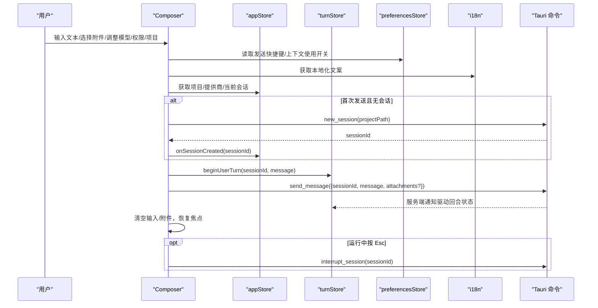

图表来源
- [Composer.tsx:711-785](file://frontend/app/views/Composer.tsx#L711-L785)
- [turnStore.ts:57-93](file://frontend/app/state/turnStore.ts#L57-L93)
- [appStore.ts:279-319](file://frontend/app/state/appStore.ts#L279-L319)
- [preferencesStore.ts:45-93](file://frontend/app/state/preferencesStore.ts#L45-L93)
- [i18n.js:790-989](file://frontend/src/js/i18n.js#L790-L989)

## 详细组件分析

### 文本输入与自适应高度
- 输入框根据内容自动增长，最大高度限制为常量上限，超过阈值时进入多行模式以显示更多工具栏区域。
- 监听文本变化，计算 scrollHeight 并设置 height，同时标记 multiline 状态用于样式切换。

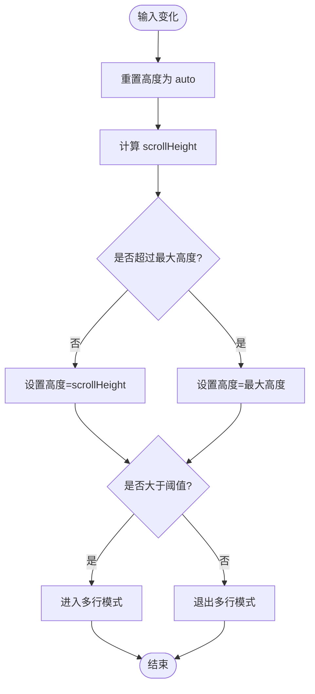

图表来源
- [Composer.tsx:662-670](file://frontend/app/views/Composer.tsx#L662-L670)

章节来源
- [Composer.tsx:662-670](file://frontend/app/views/Composer.tsx#L662-L670)

### 快捷键支持（Enter 发送、Shift+Enter 换行、Esc 停止）
- 支持两种发送模式：默认 Enter 发送；或 Ctrl/Cmd+Enter 发送（由偏好设置控制）。
- Shift+Enter 插入换行，保持光标位置。
- 运行中按 Esc 触发中断。

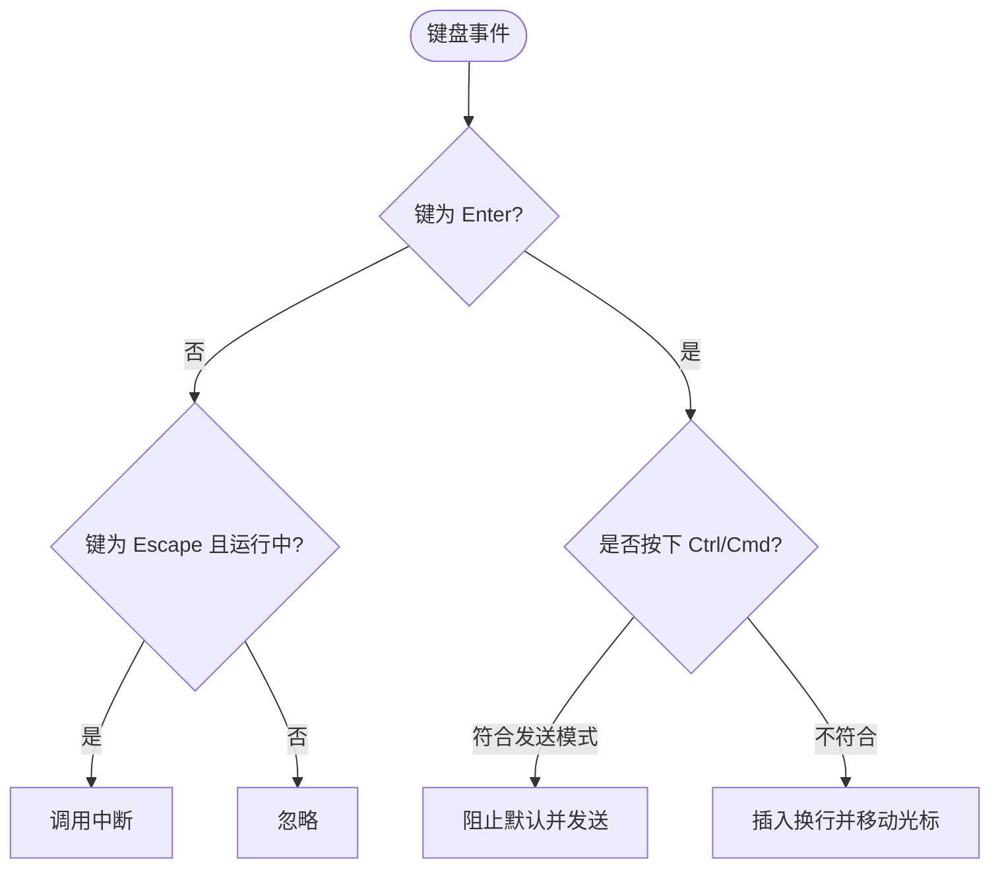

图表来源
- [Composer.tsx:787-813](file://frontend/app/views/Composer.tsx#L787-L813)

章节来源
- [Composer.tsx:787-813](file://frontend/app/views/Composer.tsx#L787-L813)

### 发送与停止按钮状态切换
- 当有会话正在运行时，按钮切换为“停止”，点击触发中断；否则为“发送”，禁用条件为无文本或未运行。
- 发送成功后清空输入与附件，恢复焦点到输入框。

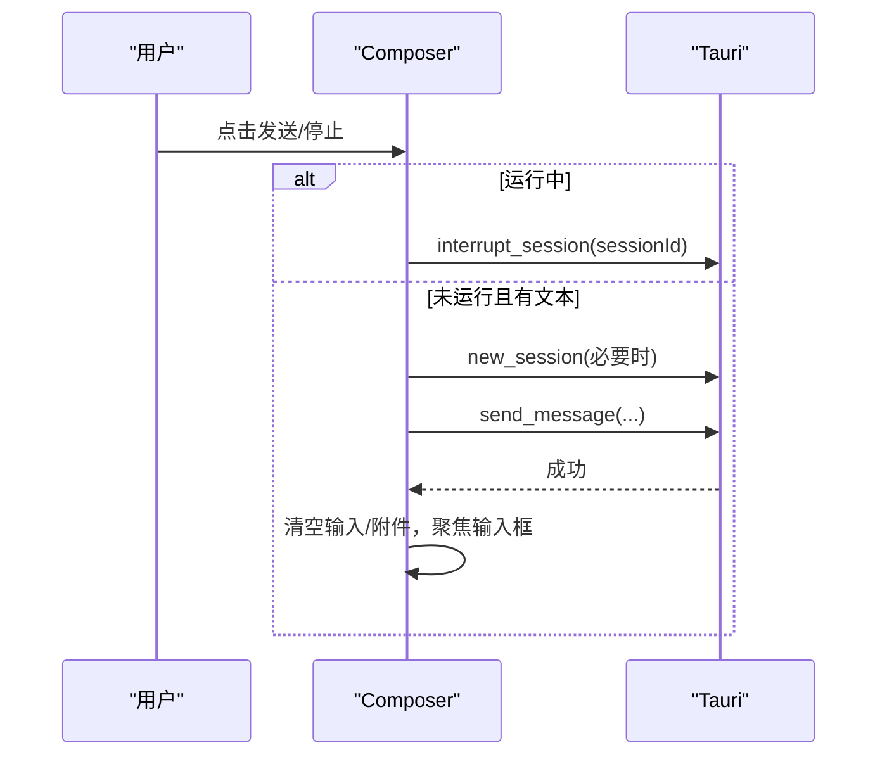

图表来源
- [Composer.tsx:684-785](file://frontend/app/views/Composer.tsx#L684-L785)

章节来源
- [Composer.tsx:684-785](file://frontend/app/views/Composer.tsx#L684-L785)

### 附件上传
- 通过原生对话框选择多个文件，去重后加入附件列表，支持移除单个附件。
- 发送时将附件转换为标准 UserInput 结构（图片与文件类型区分）。

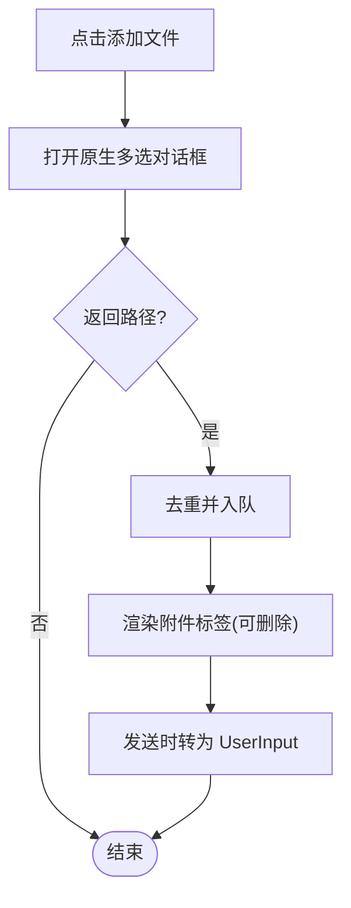

图表来源
- [Composer.tsx:695-709](file://frontend/app/views/Composer.tsx#L695-L709)
- [appStore.ts:296-308](file://frontend/app/state/appStore.ts#L296-L308)

章节来源
- [Composer.tsx:695-709](file://frontend/app/views/Composer.tsx#L695-L709)
- [appStore.ts:296-308](file://frontend/app/state/appStore.ts#L296-L308)

### 权限模式（工作区、帮助审批、完全访问）
- 三种模式映射到设置项 approvalPolicy 与 fullAccess：
  - 工作区：approvalPolicy="ask", fullAccess=false
  - 帮助审批：approvalPolicy="ask", fullAccess=true
  - 完全访问：approvalPolicy="never", fullAccess=true
- 菜单包含图标、描述与“了解更多”跳转至配置页。

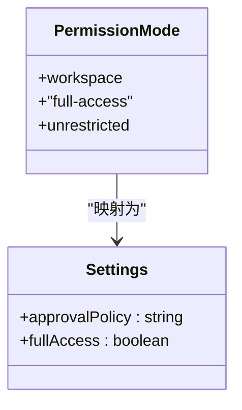

图表来源
- [Composer.tsx:120-262](file://frontend/app/views/Composer.tsx#L120-L262)
- [Composer.tsx:636-642](file://frontend/app/views/Composer.tsx#L636-L642)
- [Composer.tsx:1044-1053](file://frontend/app/views/Composer.tsx#L1044-L1053)

章节来源
- [Composer.tsx:120-262](file://frontend/app/views/Composer.tsx#L120-L262)
- [Composer.tsx:636-642](file://frontend/app/views/Composer.tsx#L636-L642)
- [Composer.tsx:1044-1053](file://frontend/app/views/Composer.tsx#L1044-L1053)

### 模型选择器（提供商分组、推理强度滑块）
- 提供商分组过滤空模型，仅展示有效模型组。
- 推理强度滑块支持拖拽与键盘方向键调整，提交时持久化到 settings.modelReasoningEffort。
- 未配置模型时引导前往“供应商设置”。

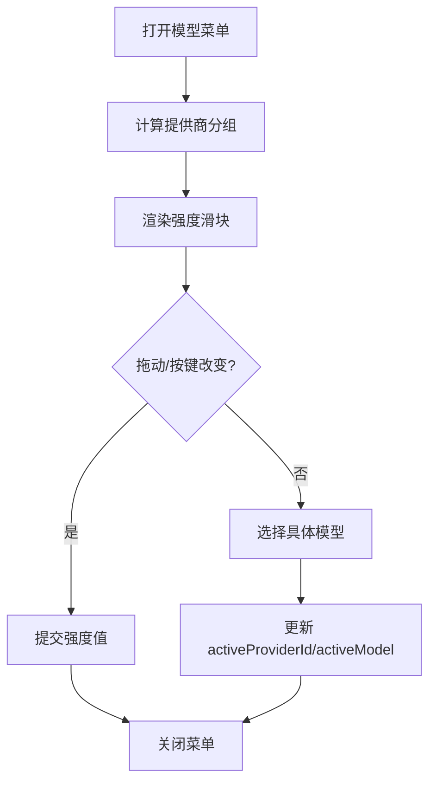

图表来源
- [Composer.tsx:105-116](file://frontend/app/views/Composer.tsx#L105-L116)
- [Composer.tsx:264-462](file://frontend/app/views/Composer.tsx#L264-L462)

章节来源
- [Composer.tsx:105-116](file://frontend/app/views/Composer.tsx#L105-L116)
- [Composer.tsx:264-462](file://frontend/app/views/Composer.tsx#L264-L462)

### 项目选择器（搜索、新建项目、脱离项目）
- 支持按名称/路径模糊搜索项目。
- 新建项目通过原生文件夹选择器添加并刷新。
- 脱离项目会清空当前会话与项目选择。

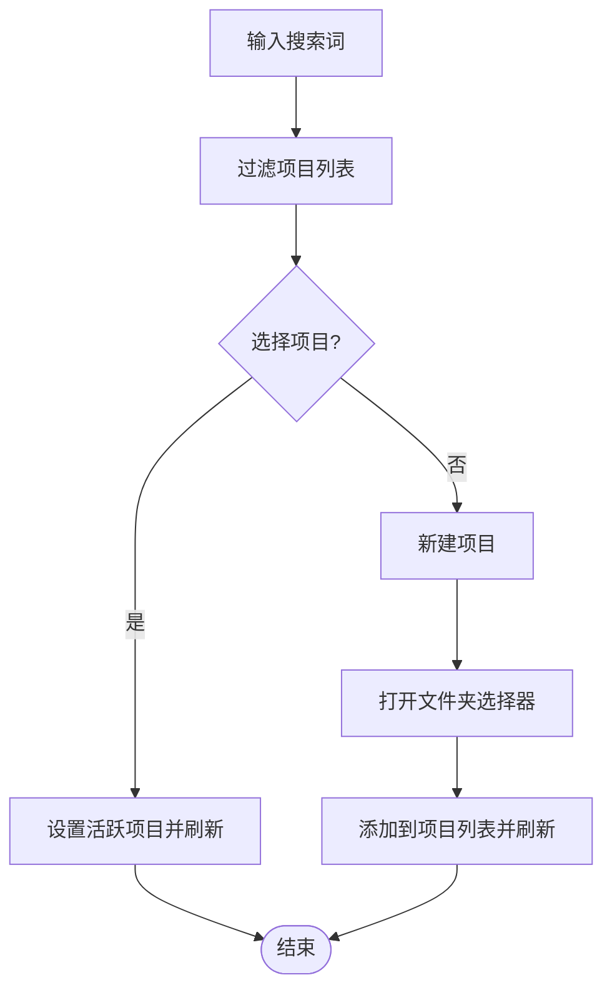

图表来源
- [Composer.tsx:464-598](file://frontend/app/views/Composer.tsx#L464-L598)
- [appStore.ts:279-319](file://frontend/app/state/appStore.ts#L279-L319)

章节来源
- [Composer.tsx:464-598](file://frontend/app/views/Composer.tsx#L464-L598)
- [appStore.ts:279-319](file://frontend/app/state/appStore.ts#L279-L319)

### 用户交互流程与状态管理
- 输入与附件：本地状态 text、attachments 控制 UI，发送后清空。
- 会话与回合：若无会话则先创建；beginUserTurn 乐观插入用户气泡；失败时回滚并 finishTurn("failed")。
- 运行态：running 来自父级，决定按钮行为与 Esc 中断。
- 偏好：sendShortcut 控制发送快捷键；showContextUsage 控制上下文使用百分比显示。

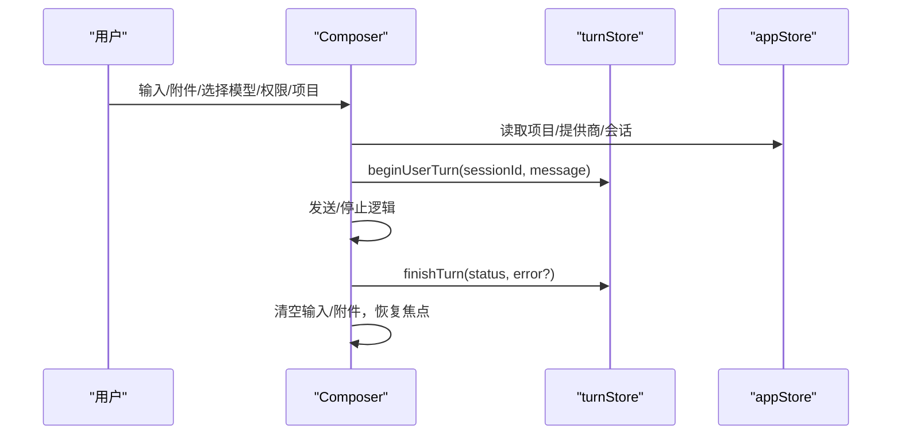

图表来源
- [Composer.tsx:711-785](file://frontend/app/views/Composer.tsx#L711-L785)
- [turnStore.ts:57-93](file://frontend/app/state/turnStore.ts#L57-L93)

章节来源
- [Composer.tsx:711-785](file://frontend/app/views/Composer.tsx#L711-L785)
- [turnStore.ts:57-93](file://frontend/app/state/turnStore.ts#L57-L93)

### 错误处理
- 发送失败：记录错误日志，丢弃乐观插入的用户项，finishTurn("failed", error)，并触发刷新。
- 中断失败：捕获异常并记录日志。
- 附件选择失败：返回空数组，不中断流程。

章节来源
- [Composer.tsx:684-693](file://frontend/app/views/Composer.tsx#L684-L693)
- [Composer.tsx:762-773](file://frontend/app/views/Composer.tsx#L762-L773)
- [appStore.ts:296-308](file://frontend/app/state/appStore.ts#L296-L308)

### 国际化支持
- 所有用户可见文案通过 i18n 的 t() 函数获取，支持中英文等多语言。
- 关键文案包括：占位符、权限模式、模型相关、发送/停止、模拟回合等。

章节来源
- [Composer.tsx:196-262](file://frontend/app/views/Composer.tsx#L196-L262)
- [Composer.tsx:275-462](file://frontend/app/views/Composer.tsx#L275-L462)
- [Composer.tsx:818-1019](file://frontend/app/views/Composer.tsx#L818-L1019)
- [i18n.js:790-989](file://frontend/src/js/i18n.js#L790-L989)

## 依赖关系分析
- Composer 依赖：
  - ComposerPopover：弹出定位与关闭策略
  - appStore：项目、提供商、会话、设置
  - turnStore：回合生命周期与乐观更新
  - preferencesStore：偏好（发送快捷键、上下文使用）
  - i18n：本地化文案
  - Tauri invoke：send_message、new_session、interrupt_session

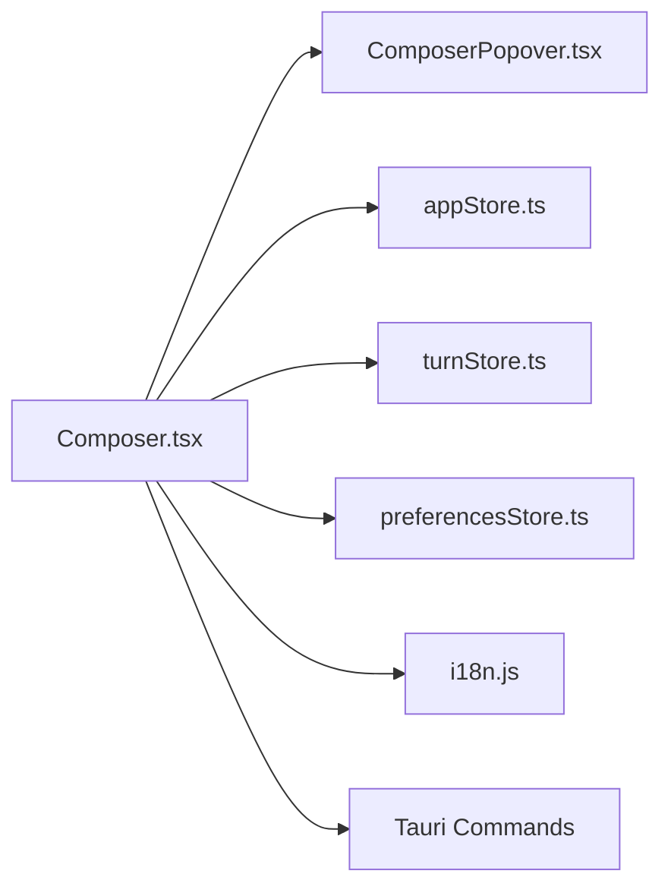

图表来源
- [Composer.tsx:18-35](file://frontend/app/views/Composer.tsx#L18-L35)
- [ComposerPopover.tsx:13-31](file://frontend/app/shell/ComposerPopover.tsx#L13-L31)
- [appStore.ts:14-17](file://frontend/app/state/appStore.ts#L14-L17)
- [turnStore.ts:13-23](file://frontend/app/state/turnStore.ts#L13-L23)
- [preferencesStore.ts:45-93](file://frontend/app/state/preferencesStore.ts#L45-L93)

章节来源
- [Composer.tsx:18-35](file://frontend/app/views/Composer.tsx#L18-L35)

## 性能考量
- 输入自适应高度：避免频繁重排，仅在文本变化时计算一次高度，并使用 requestAnimationFrame 维护光标位置。
- 弹出面板定位：使用 ResizeObserver 与 window resize 监听，减少重复计算。
- 模型分组：使用 useMemo 缓存 providersWithModels，降低重渲染成本。
- 附件去重：Set 去重避免重复 DOM 节点。
- 发送流程：乐观更新用户气泡，失败时精准回滚，避免整轮重置。

[本节为通用性能指导，无需特定文件引用]

## 故障排查指南
- 无法发送：检查是否有文本、是否处于发送中、是否已创建会话；查看控制台日志中的 "[composer] send failed"。
- 中断无效：确认 activeSessionId 存在；查看 "[composer] interrupt failed" 日志。
- 附件未生效：确认原生对话框返回路径非空；检查 toUserInput 转换逻辑。
- 模型未配置：若模型为空，前往“供应商设置”添加自定义接口并探测模型。
- 快捷键不生效：检查 general.sendShortcut 设置是否为 cmdenter；确认组合键未被系统占用。

章节来源
- [Composer.tsx:762-773](file://frontend/app/views/Composer.tsx#L762-L773)
- [Composer.tsx:684-693](file://frontend/app/views/Composer.tsx#L684-L693)
- [appStore.ts:296-308](file://frontend/app/state/appStore.ts#L296-L308)
- [preferencesStore.ts:45-93](file://frontend/app/state/preferencesStore.ts#L45-L93)

## 结论
Composer 提供了完整的消息输入体验，涵盖文本、附件、模型、权限与项目配置，结合快捷键与自适应高度提升易用性。通过清晰的状态管理与错误处理，确保在复杂交互下的稳定性。国际化支持使得界面在多语言环境下保持一致体验。

[本节为总结性内容，无需特定文件引用]

## 附录：扩展与自定义样式
- 扩展功能
  - 新增快捷操作：可在工具栏增加按钮，复用 addAttachments 或调用 Tauri 命令实现新能力。
  - 自定义模型分组：修改 providersWithModels 逻辑，支持更多字段或筛选规则。
  - 增强权限提示：在 PermissionMenuContent 中添加说明或链接，跳转到更详细的帮助页面。
- 自定义样式
  - 多行模式：通过 .is-multiline 类名控制布局与间距。
  - 弹出面板：ComposerPopover 输出 composer-menu 类，可通过 CSS 调整定位与动画。
  - 附件标签：.attach-chip 样式可定制外观与交互。
  - 上下文使用指示：.composer-context 可调整颜色与宽度。
- 代码示例路径（参考）
  - 自适应高度实现：[Composer.tsx:662-670](file://frontend/app/views/Composer.tsx#L662-L670)
  - 快捷键处理：[Composer.tsx:787-813](file://frontend/app/views/Composer.tsx#L787-L813)
  - 发送与中断：[Composer.tsx:711-785](file://frontend/app/views/Composer.tsx#L711-L785)
  - 附件选择与转换：[Composer.tsx:695-709](file://frontend/app/views/Composer.tsx#L695-L709), [appStore.ts:296-308](file://frontend/app/state/appStore.ts#L296-L308)
  - 权限模式映射：[Composer.tsx:636-642](file://frontend/app/views/Composer.tsx#L636-L642), [Composer.tsx:1044-1053](file://frontend/app/views/Composer.tsx#L1044-L1053)
  - 模型选择与强度滑块：[Composer.tsx:264-462](file://frontend/app/views/Composer.tsx#L264-L462)
  - 项目搜索与新建：[Composer.tsx:464-598](file://frontend/app/views/Composer.tsx#L464-L598), [appStore.ts:279-319](file://frontend/app/state/appStore.ts#L279-L319)
  - 弹出面板定位：[ComposerPopover.tsx:39-70](file://frontend/app/shell/ComposerPopover.tsx#L39-L70), [ComposerPopover.tsx:85-114](file://frontend/app/shell/ComposerPopover.tsx#L85-L114)
  - 国际化文案：[i18n.js:790-989](file://frontend/src/js/i18n.js#L790-L989)