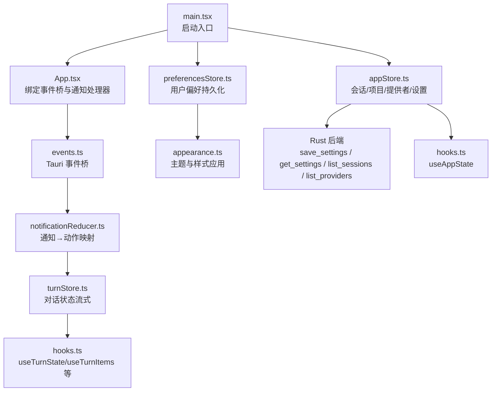
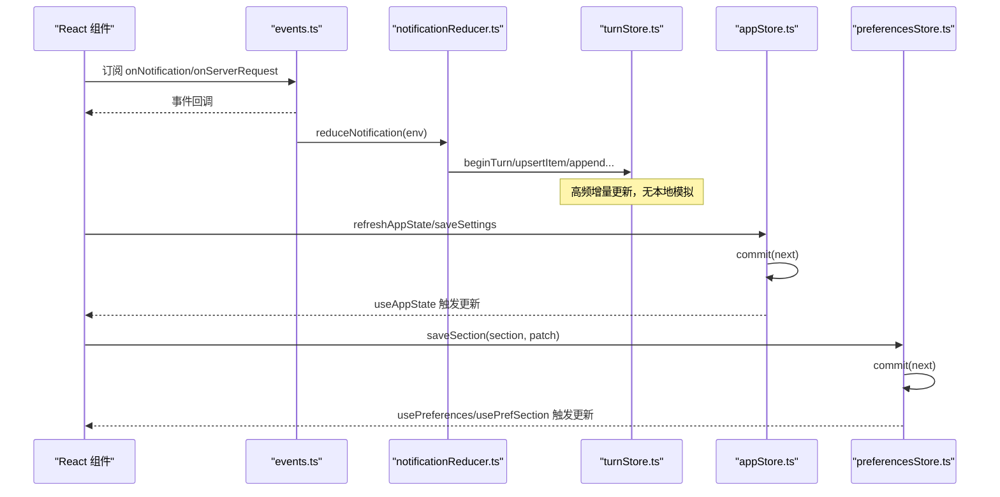
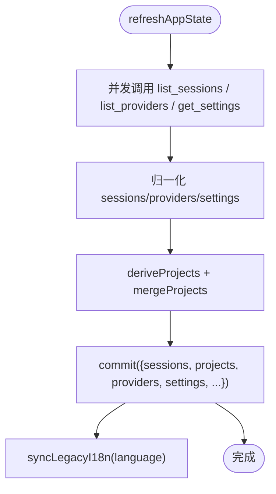
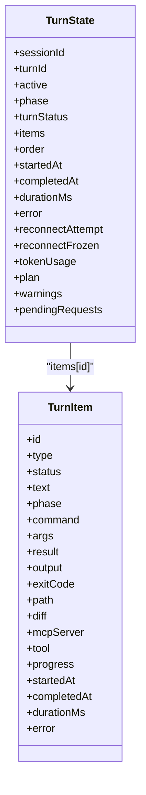
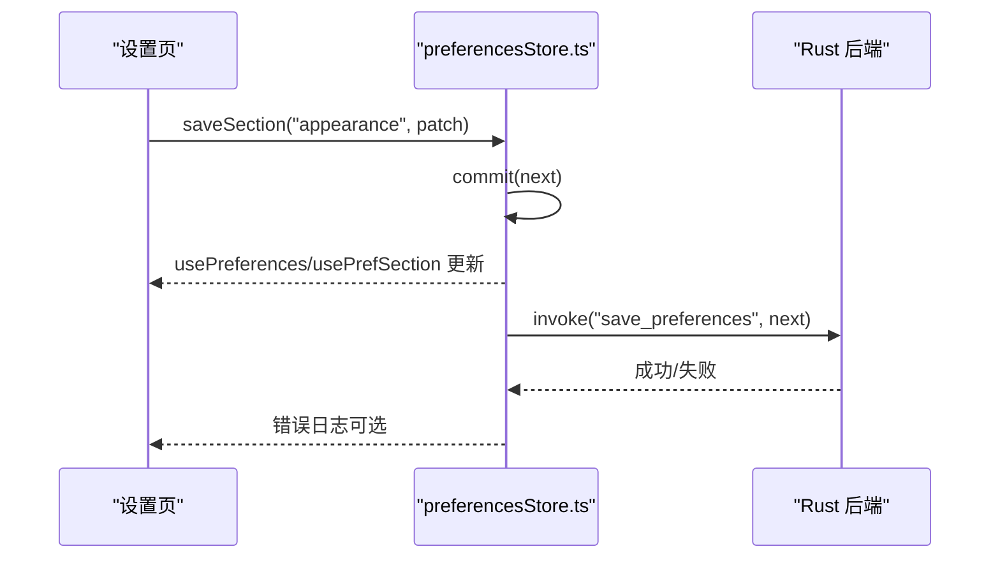
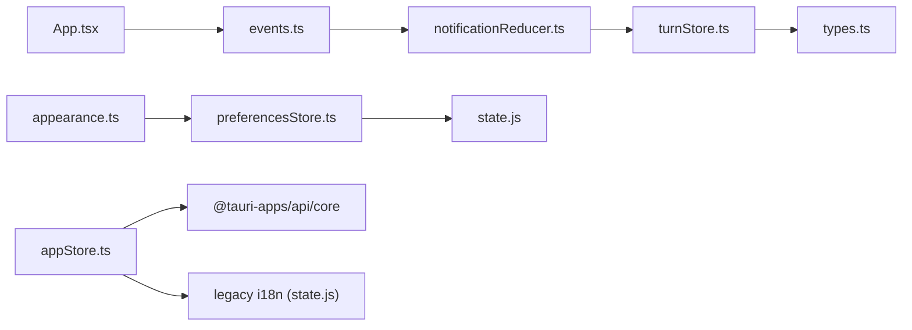

# 视图状态管理

<cite>
**本文引用的文件**
- [frontend/app/state/appStore.ts](file://frontend/app/state/appStore.ts)
- [frontend/app/state/turnStore.ts](file://frontend/app/state/turnStore.ts)
- [frontend/app/state/preferencesStore.ts](file://frontend/app/state/preferencesStore.ts)
- [frontend/app/state/hooks.ts](file://frontend/app/state/hooks.ts)
- [frontend/app/state/types.ts](file://frontend/app/state/types.ts)
- [frontend/app/state/notificationReducer.ts](file://frontend/app/state/notificationReducer.ts)
- [frontend/app/state/appearance.ts](file://frontend/app/state/appearance.ts)
- [frontend/app/bridge/events.ts](file://frontend/app/bridge/events.ts)
- [frontend/src/js/state.js](file://frontend/src/js/state.js)
- [frontend/app/App.tsx](file://frontend/app/App.tsx)
- [frontend/app/main.tsx](file://frontend/app/main.tsx)
</cite>

## 目录
1. [简介](#简介)
2. [项目结构](#项目结构)
3. [核心组件](#核心组件)
4. [架构总览](#架构总览)
5. [详细组件分析](#详细组件分析)
6. [依赖关系分析](#依赖关系分析)
7. [性能考量](#性能考量)
8. [故障排查指南](#故障排查指南)
9. [结论](#结论)
10. [附录：扩展指南与最佳实践](#附录扩展指南与最佳实践)

## 简介
本文件面向 Codex-Tauri 的视图层状态管理系统，聚焦全局状态、局部状态与持久化状态的分离设计；说明基于 React Hooks 的状态管理模式、更新策略与副作用处理；详解三大关键状态模块：appStore（应用配置与会话）、turnStore（对话状态与消息历史）、preferencesStore（用户偏好与主题设置）；阐述前后端数据同步、实时更新与冲突解决机制；并提供调试工具、性能监控与错误恢复策略，以及新功能的扩展指南。

## 项目结构
前端状态管理采用“外部 Store + useSyncExternalStore”的模式，将高频流式数据与全局配置从 React 树中解耦，避免不必要的重渲染与上下文传递。事件桥负责接收后端通知并分发到通知规约器，最终写入 turnStore；appStore 与 preferencesStore 分别承载应用级与偏好级状态，并通过 Tauri invoke 与 Rust 后端交互实现持久化。

图表来源
- [frontend/app/main.tsx:38-54](file://frontend/app/main.tsx#L38-L54)
- [frontend/app/App.tsx:15-45](file://frontend/app/App.tsx#L15-L45)
- [frontend/app/bridge/events.ts:145-159](file://frontend/app/bridge/events.ts#L145-L159)
- [frontend/app/state/notificationReducer.ts:189-445](file://frontend/app/state/notificationReducer.ts#L189-L445)
- [frontend/app/state/turnStore.ts:28-55](file://frontend/app/state/turnStore.ts#L28-L55)
- [frontend/app/state/preferencesStore.ts:20-43](file://frontend/app/state/preferencesStore.ts#L20-L43)
- [frontend/app/state/appearance.ts:152-176](file://frontend/app/state/appearance.ts#L152-L176)
- [frontend/app/state/appStore.ts:130-155](file://frontend/app/state/appStore.ts#L130-L155)

章节来源
- [frontend/app/main.tsx:38-54](file://frontend/app/main.tsx#L38-L54)
- [frontend/app/App.tsx:15-45](file://frontend/app/App.tsx#L15-L45)
- [frontend/app/bridge/events.ts:145-159](file://frontend/app/bridge/events.ts#L145-L159)

## 核心组件
- appStore：维护会话列表、项目、提供者、引擎状态与应用设置；提供刷新、保存设置、选择项目等操作；通过 Tauri invoke 与后端同步。
- turnStore：维护当前对话的流式状态（消息、工具调用、计划、警告、待审批请求等），由通知驱动，支持乐观用户消息与回滚。
- preferencesStore：维护按分区的用户偏好（外观、语音、浏览器、Git 等），合并默认值后持久化；配合 appearance 模块应用主题与样式。
- hooks：为 turnStore 与 appStore 暴露 React 订阅接口，使用 useSyncExternalStore 避免上下文开销。
- notificationReducer：将后端通知映射为 turnStore 的动作，保证所有协议方法均有处理或记录。
- events：统一监听 Tauri 事件通道，封装通知与服务器请求的分发。

章节来源
- [frontend/app/state/appStore.ts:98-155](file://frontend/app/state/appStore.ts#L98-L155)
- [frontend/app/state/turnStore.ts:28-55](file://frontend/app/state/turnStore.ts#L28-L55)
- [frontend/app/state/preferencesStore.ts:20-43](file://frontend/app/state/preferencesStore.ts#L20-L43)
- [frontend/app/state/hooks.ts:17-43](file://frontend/app/state/hooks.ts#L17-L43)
- [frontend/app/state/notificationReducer.ts:189-445](file://frontend/app/state/notificationReducer.ts#L189-L445)
- [frontend/app/bridge/events.ts:57-87](file://frontend/app/bridge/events.ts#L57-L87)

## 架构总览
整体采用“事件驱动 + 单向数据流”的架构：
- 后端通过 Tauri 事件推送通知，events.ts 统一接收并转发给 notificationReducer。
- notificationReducer 将通知转换为对 turnStore 的原子操作（开始/完成项、追加文本/输出、更新计划与用量等）。
- appStore 与 preferencesStore 作为独立的外部存储，通过 useSyncExternalStore 被 React 订阅，避免频繁 re-render。
- 持久化通过 Tauri invoke 调用 Rust 命令（如 save_settings、get_preferences），失败时 UI 仍保持可用。

图表来源
- [frontend/app/bridge/events.ts:57-87](file://frontend/app/bridge/events.ts#L57-L87)
- [frontend/app/state/notificationReducer.ts:189-445](file://frontend/app/state/notificationReducer.ts#L189-L445)
- [frontend/app/state/turnStore.ts:71-107](file://frontend/app/state/turnStore.ts#L71-L107)
- [frontend/app/state/appStore.ts:378-408](file://frontend/app/state/appStore.ts#L378-L408)
- [frontend/app/state/preferencesStore.ts:76-88](file://frontend/app/state/preferencesStore.ts#L76-L88)

## 详细组件分析

### appStore（应用配置与会话管理）
- 职责
  - 管理 sessions、projects、providers、settings、engineStatus、activeSessionId、activeProjectId、extraProjects 等。
  - 提供刷新、保存设置、打开项目目录、选择附件等能力。
  - 将语言设置同步到 legacy i18n，确保非 React 层也能获取最新语言。
- 数据流
  - 初始化空状态，commit 函数集中更新并通知订阅者。
  - refreshAppState 并发拉取 sessions/providers/settings，归一化后提交。
  - saveSettings 同时写 shell 设置与 engine 配置（config/batchWrite），失败不阻断 UI。
- 关键点
  - projects 由 sessions 的 cwd 推导，额外项目来自对话框选择，二者合并。
  - 设置字段兼容驼峰与下划线命名，提升跨层兼容性。
  - 使用 invoke("plugin:dialog|open") 调用原生对话框。

图表来源
- [frontend/app/state/appStore.ts:378-408](file://frontend/app/state/appStore.ts#L378-L408)
- [frontend/app/state/appStore.ts:215-245](file://frontend/app/state/appStore.ts#L215-L245)
- [frontend/app/state/appStore.ts:446-511](file://frontend/app/state/appStore.ts#L446-L511)

章节来源
- [frontend/app/state/appStore.ts:98-155](file://frontend/app/state/appStore.ts#L98-L155)
- [frontend/app/state/appStore.ts:249-376](file://frontend/app/state/appStore.ts#L249-L376)
- [frontend/app/state/appStore.ts:378-511](file://frontend/app/state/appStore.ts#L378-L511)

### turnStore（对话状态与消息历史）
- 职责
  - 维护当前 turn 的生命周期（active、phase、startedAt/completedAt/durationMs）。
  - 维护消息与工具调用的流式增量（items 字典 + order 数组）。
  - 管理 tokenUsage、plan、warnings、pendingRequests 等。
- 数据流
  - beginUserTurn 立即插入用户气泡（乐观），若发送失败可 discardItem 回滚。
  - beginTurn 根据 threadId 切换线程，必要时清空 items/order 等。
  - upsertItem/appendItemText/appendItemOutput/pushItemProgress/completeItem 等用于增量更新。
  - loadThreadFromSession 从后端加载历史（优先 thread.messages，否则 fallback 到 timeline）。
- 关键点
  - 严格遵循“UI 不发明状态”，所有显示均来自服务器通知或历史加载。
  - 使用 userSeq 避免 id 碰撞；reconnectAttempt/reconnectFrozen 处理断线重连残留。

图表来源
- [frontend/app/state/types.ts:11-109](file://frontend/app/state/types.ts#L11-L109)
- [frontend/app/state/turnStore.ts:28-55](file://frontend/app/state/turnStore.ts#L28-L55)

章节来源
- [frontend/app/state/turnStore.ts:53-285](file://frontend/app/state/turnStore.ts#L53-L285)
- [frontend/app/state/turnStore.ts:321-467](file://frontend/app/state/turnStore.ts#L321-L467)
- [frontend/app/state/types.ts:11-146](file://frontend/app/state/types.ts#L11-L146)

### preferencesStore（用户偏好与主题设置）
- 职责
  - 维护分区化的偏好（appearance、voice、browser、git 等），合并默认值。
  - 提供 usePreferences/usePrefSection 钩子读取偏好。
  - 通过 saveSection 持久化整个 preferences 对象。
  - 发射 shell 级别 CustomEvent 以通知其他子系统（如 pet、appearance）。
- 数据流
  - loadPreferences 首次加载，mergePreferences 合并默认值。
  - saveSection 先本地 commit，再异步持久化，失败仅记录日志。
  - emitShellEvent 用于跨模块通信（例如外观变化）。

图表来源
- [frontend/app/state/preferencesStore.ts:59-88](file://frontend/app/state/preferencesStore.ts#L59-L88)

章节来源
- [frontend/app/state/preferencesStore.ts:20-94](file://frontend/app/state/preferencesStore.ts#L20-L94)
- [frontend/src/js/state.js:60-136](file://frontend/src/js/state.js#L60-L136)

### 通知规约器（notificationReducer）
- 职责
  - 将后端通知映射为 turnStore 的动作，覆盖 turn 生命周期、item 生命周期、流式增量、计划与用量、警告与错误、hook 等。
  - 对未处理的协议方法记录警告，避免静默丢弃。
- 关键点
  - 使用 str/num/obj/itemOf/statusOf/phaseOf/blockTypeOf 等辅助函数做健壮解析。
  - 区分“环境通知”（AMBIENT_METHODS）与需要渲染的通知。

章节来源
- [frontend/app/state/notificationReducer.ts:189-445](file://frontend/app/state/notificationReducer.ts#L189-L445)

### 事件桥（events.ts）
- 职责
  - 监听 Tauri 事件通道，将通知与服务器请求分发到各自处理器集合。
  - 自动绑定所有 NOTIFICATION_METHODS 与固定请求通道（approval、user-input）。
- 关键点
  - tauriEventName 规范化事件名，避免特殊字符。
  - 每个监听失败不影响其余通道建立。

章节来源
- [frontend/app/bridge/events.ts:23-30](file://frontend/app/bridge/events.ts#L23-L30)
- [frontend/app/bridge/events.ts:57-87](file://frontend/app/bridge/events.ts#L57-L87)
- [frontend/app/bridge/events.ts:95-159](file://frontend/app/bridge/events.ts#L95-L159)

### 外观应用（appearance.ts）
- 职责
  - 根据 preferencesStore 的 appearance 分区应用主题、字体、字号、强调色、侧边栏风格、对比度、动效、光标、差异标记等。
  - 监听系统主题变化与偏好变更，动态重新应用。
- 关键点
  - 类型比例缩放基于 tokens.css 基准，避免覆盖 --text-base。
  - startAppearance 返回清理函数以便测试与热重载。

章节来源
- [frontend/app/state/appearance.ts:62-176](file://frontend/app/state/appearance.ts#L62-L176)

## 依赖关系分析
- 模块耦合
  - App.tsx 依赖 events.ts 与 notificationReducer.ts，并将服务器请求加入 pendingRequests。
  - turnStore 依赖 types.ts 定义的数据模型，notificationReducer 依赖 turnStore 的动作。
  - preferencesStore 依赖 src/js/state.js 的默认值与合并逻辑。
  - appearance.ts 依赖 preferencesStore 的 getPrefSection 与 subscribe。
  - appStore 依赖 Tauri invoke 与 legacy i18n 更新。
- 外部依赖
  - @tauri-apps/api/core/event 用于事件监听与 invoke。
  - @protocol/notifications、@protocol/requests 提供协议表与方法类型。
  - @protocol/status 提供 ItemStatus、TurnPhase 等枚举。

图表来源
- [frontend/app/App.tsx:15-45](file://frontend/app/App.tsx#L15-L45)
- [frontend/app/bridge/events.ts:145-159](file://frontend/app/bridge/events.ts#L145-L159)
- [frontend/app/state/notificationReducer.ts:189-445](file://frontend/app/state/notificationReducer.ts#L189-L445)
- [frontend/app/state/turnStore.ts:28-55](file://frontend/app/state/turnStore.ts#L28-L55)
- [frontend/app/state/preferencesStore.ts:20-43](file://frontend/app/state/preferencesStore.ts#L20-L43)
- [frontend/app/state/appearance.ts:152-176](file://frontend/app/state/appearance.ts#L152-L176)
- [frontend/app/state/appStore.ts:130-155](file://frontend/app/state/appStore.ts#L130-L155)

章节来源
- [frontend/app/App.tsx:15-45](file://frontend/app/App.tsx#L15-L45)
- [frontend/app/bridge/events.ts:145-159](file://frontend/app/bridge/events.ts#L145-L159)
- [frontend/app/state/notificationReducer.ts:189-445](file://frontend/app/state/notificationReducer.ts#L189-L445)
- [frontend/app/state/turnStore.ts:28-55](file://frontend/app/state/turnStore.ts#L28-L55)
- [frontend/app/state/preferencesStore.ts:20-43](file://frontend/app/state/preferencesStore.ts#L20-L43)
- [frontend/app/state/appearance.ts:152-176](file://frontend/app/state/appearance.ts#L152-L176)
- [frontend/app/state/appStore.ts:130-155](file://frontend/app/state/appStore.ts#L130-L155)

## 性能考量
- 高频流式更新
  - turnStore 使用 items 字典与 order 数组，O(1) 查找与稳定渲染顺序，避免全量重建。
  - 增量追加文本/输出（appendItemText/appendItemOutput）减少中间态计算。
- 外部存储与订阅
  - 使用 useSyncExternalStore 将 store 置于 React 外部，避免 Context 与 prop drilling 带来的重渲染。
  - 订阅仅在 commit 时触发，降低渲染频率。
- 并发与降级
  - refreshAppState 并发拉取 sessions/providers/settings，缩短首屏等待。
  - 设置持久化失败不阻断 UI，仅记录日志，保障可用性。
- 样式与主题
  - appearance 模块按需设置 CSS 变量与 dataset，避免大规模 DOM 操作。
  - 类型比例缩放基于 tokens.css 基准，防止覆盖基础样式导致重排。

[本节为通用性能建议，无需特定文件引用]

## 故障排查指南
- 通知未生效
  - 检查 events.ts 是否已启动事件桥（startEventBridge），确认 NOTIFICATION_METHODS 已绑定。
  - 查看 notificationReducer 是否有对应 handler；未处理的方法会记录警告。
- 对话状态异常
  - 检查 beginTurn 是否正确识别 threadId 切换；必要时清空 items/order。
  - 确认 upsertItem/completeItem 的 id 与 type 一致；检查 item 生命周期是否完整。
- 设置未持久化
  - 检查 saveSettings/saveSection 的 invoke 调用是否成功；失败仅记录日志，需查看控制台。
  - 确认 Rust 后端权限与 capabilities 允许相关命令。
- 主题未应用
  - 确认 preferencesStore 已加载并合并默认值；appearance.startAppearance 已执行。
  - 检查系统主题监听与偏好变更订阅是否生效。

章节来源
- [frontend/app/bridge/events.ts:145-159](file://frontend/app/bridge/events.ts#L145-L159)
- [frontend/app/state/notificationReducer.ts:437-445](file://frontend/app/state/notificationReducer.ts#L437-L445)
- [frontend/app/state/turnStore.ts:71-107](file://frontend/app/state/turnStore.ts#L71-L107)
- [frontend/app/state/appStore.ts:446-511](file://frontend/app/state/appStore.ts#L446-L511)
- [frontend/app/state/preferencesStore.ts:59-88](file://frontend/app/state/preferencesStore.ts#L59-L88)
- [frontend/app/state/appearance.ts:152-176](file://frontend/app/state/appearance.ts#L152-L176)

## 结论
Codex-Tauri 的视图层状态管理以“事件驱动 + 外部 Store + useSyncExternalStore”为核心，实现了高内聚、低耦合的状态架构。appStore、turnStore、preferencesStore 各司其职，分别承担应用级、对话级与偏好级状态；通过 notificationReducer 将后端通知转化为原子动作，保证 UI 与后端一致。结合 Tauri 的持久化能力与外观应用模块，系统在实时性、可维护性与用户体验方面达到良好平衡。

[本节为总结性内容，无需特定文件引用]

## 附录：扩展指南与最佳实践
- 新增功能的状态设计
  - 明确状态归属：全局（appStore）、对话（turnStore）、偏好（preferencesStore）。
  - 定义数据类型：在 types.ts 中新增接口，保持向后兼容。
  - 设计动作：在对应 store 中提供 commit 与 action，确保不可变更新。
- 状态更新策略
  - 优先使用增量更新（append/patch），避免全量重建。
  - 对外部副作用（invoke）进行 try/catch，失败不阻断主流程。
  - 对高频流式数据使用外部 Store + useSyncExternalStore，减少重渲染。
- 副作用处理
  - 在 App.tsx 中集中订阅事件桥与通知处理器，避免分散副作用。
  - 使用 emitShellEvent 通知其他子系统（如外观、宠物）。
- 前后端同步与冲突解决
  - 设置持久化采用双写（shell 设置与 engine 配置），失败降级。
  - 对话历史加载优先 thread.messages，fallback 到 timeline，确保完整性。
  - 对未知通知记录警告，便于发现协议演进缺口。
- 调试与监控
  - 利用 console.warn/error 记录关键路径错误与警告。
  - 通过 pendingRequests 与 warnings 观察服务端交互与异常。
  - 使用 useTurnSelector 派生切片，便于性能分析与定位。
- 最佳实践
  - 保持 store 纯函数化（commit 只更新状态与通知）。
  - 对外部依赖（Tauri、协议）进行抽象与容错。
  - 在迁移过程中保留兼容字段（驼峰/下划线），逐步替换。

[本节为通用指导，无需特定文件引用]