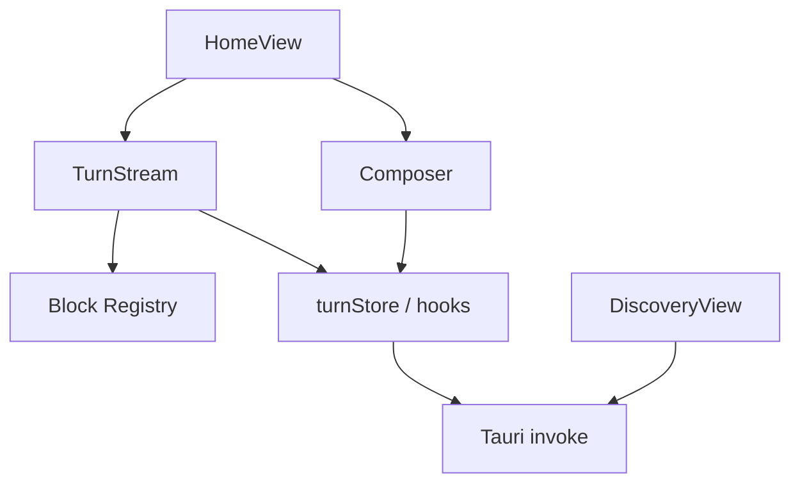
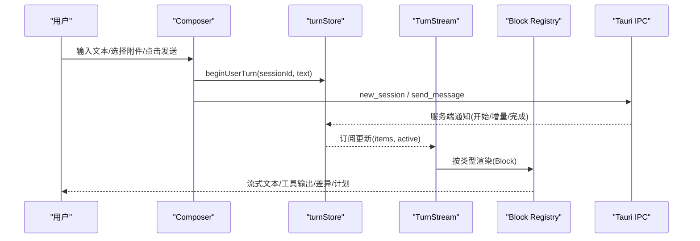
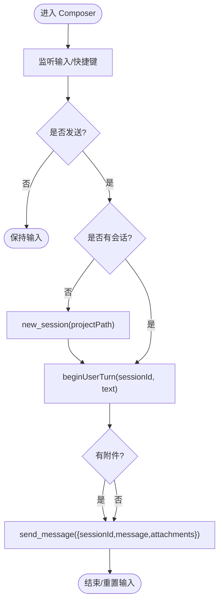
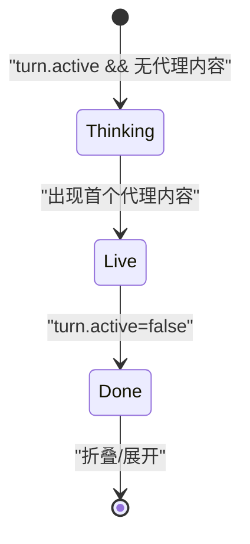
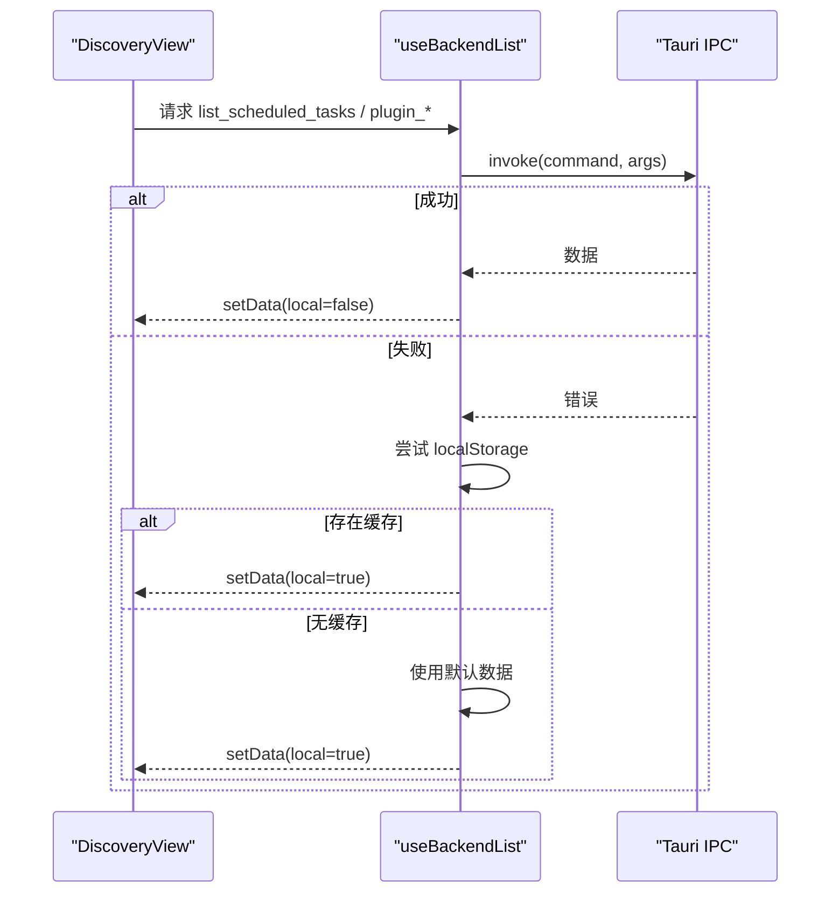
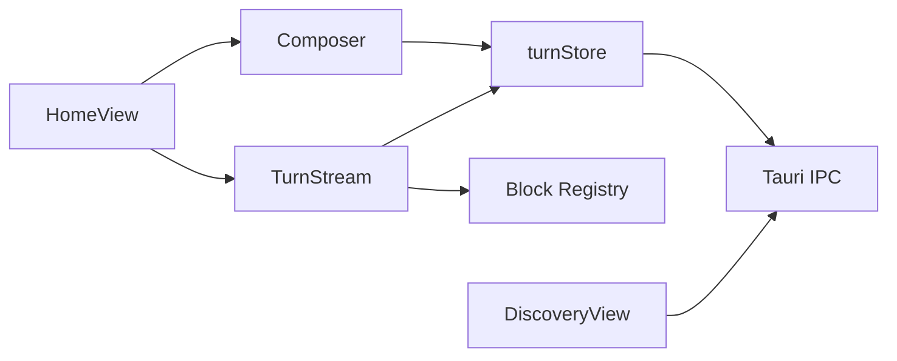

# 视图组件

<cite>
**本文引用的文件**
- [Composer.tsx](file://frontend/app/views/Composer.tsx)
- [TurnStream.tsx](file://frontend/app/views/TurnStream.tsx)
- [HomeView.tsx](file://frontend/app/views/HomeView.tsx)
- [DiscoveryView.tsx](file://frontend/app/views/DiscoveryView.tsx)
- [turnStore.ts](file://frontend/app/state/turnStore.ts)
- [hooks.ts](file://frontend/app/state/hooks.ts)
- [types.ts](file://frontend/app/state/types.ts)
- [registry.tsx](file://frontend/app/blocks/registry.tsx)
- [home.css](file://frontend/src/styles/home.css)
- [discovery.css](file://frontend/src/styles/discovery.css)
</cite>

## 目录
1. [简介](#简介)
2. [项目结构](#项目结构)
3. [核心组件](#核心组件)
4. [架构总览](#架构总览)
5. [详细组件分析](#详细组件分析)
6. [依赖关系分析](#依赖关系分析)
7. [性能考量](#性能考量)
8. [故障排查指南](#故障排查指南)
9. [结论](#结论)
10. [附录](#附录)

## 简介
本文件面向 Codex-Tauri 的视图组件系统，聚焦四大主要视图：Composer（消息输入与发送）、TurnStream（对话流展示）、HomeView（首页布局与引导）、DiscoveryView（发现页：定时任务、插件、技能等）。文档将说明各组件的功能实现、用户交互设计、状态管理、数据绑定与实时更新机制，并给出关键流程的代码路径引用。同时涵盖可扩展性设计、自定义配置选项与主题适配方案。

## 项目结构
前端采用 React + TypeScript，视图位于 frontend/app/views，状态集中在 frontend/app/state，渲染块注册器在 frontend/app/blocks，样式在 frontend/src/styles。整体遵循“视图-状态-渲染”分层：
- 视图层：HomeView、Composer、TurnStream、DiscoveryView
- 状态层：turnStore（会话轮次状态）、appStore（应用级设置/会话/项目）
- 渲染层：blocks/registry（按类型渲染不同消息块）
- 样式层：home.css、discovery.css 等

图表来源
- [HomeView.tsx:135-206](file://frontend/app/views/HomeView.tsx#L135-L206)
- [Composer.tsx:600-785](file://frontend/app/views/Composer.tsx#L600-L785)
- [TurnStream.tsx:64-186](file://frontend/app/views/TurnStream.tsx#L64-L186)
- [registry.tsx:749-800](file://frontend/app/blocks/registry.tsx#L749-L800)
- [turnStore.ts:28-49](file://frontend/app/state/turnStore.ts#L28-L49)

章节来源
- [HomeView.tsx:135-206](file://frontend/app/views/HomeView.tsx#L135-L206)
- [turnStore.ts:28-49](file://frontend/app/state/turnStore.ts#L28-L49)

## 核心组件
- Composer：负责用户输入、附件选择、模型/权限/项目选择、发送与中断；支持快捷键、自动高度、Mock 模式。
- TurnStream：基于 turnStore 实时渲染当前轮次的消息流，包含头部状态机（思考/进行中/完成）、折叠与摘要。
- HomeView：组合 Hero（空态引导）、TurnStream、Composer；同步会话、加载历史、探测引擎状态。
- DiscoveryView：统一入口，分发到 Scheduled/Plugins/PullRequests 子视图；通过 Tauri IPC 拉取与持久化数据，提供搜索、筛选、抽屉式创建。

章节来源
- [Composer.tsx:50-785](file://frontend/app/views/Composer.tsx#L50-L785)
- [TurnStream.tsx:23-186](file://frontend/app/views/TurnStream.tsx#L23-L186)
- [HomeView.tsx:14-206](file://frontend/app/views/HomeView.tsx#L14-L206)
- [DiscoveryView.tsx:261-800](file://frontend/app/views/DiscoveryView.tsx#L261-L800)

## 架构总览
视图与状态、IPC 的交互如下：
- 用户输入由 Composer 处理，必要时调用 new_session/send_message/interrupt 等 Tauri 命令。
- 发送后乐观插入用户消息，随后通过 turnStore 接收服务端通知更新流式内容。
- TurnStream 订阅 turnStore，使用 hooks 获取最新 items，并按类型交由 blocks/registry 渲染。
- HomeView 负责页面级装配与生命周期（切换会话时加载历史、刷新应用状态）。
- DiscoveryView 通过 useBackendList 封装 IPC 请求，失败时回退到 localStorage 或默认数据。

图表来源
- [Composer.tsx:711-785](file://frontend/app/views/Composer.tsx#L711-L785)
- [turnStore.ts:118-176](file://frontend/app/state/turnStore.ts#L118-L176)
- [TurnStream.tsx:64-186](file://frontend/app/views/TurnStream.tsx#L64-L186)
- [registry.tsx:749-800](file://frontend/app/blocks/registry.tsx#L749-L800)

## 详细组件分析

### Composer（消息输入与发送）
- 功能要点
  - 输入框自适应高度，最大高度限制，Enter/Ctrl+Enter 发送，Shift+Enter 换行，Esc 中断。
  - 三个弹出菜单：权限（workspace/help/unrestricted）、模型（提供商分组、强度滑块）、项目（搜索、新建、无项目）。
  - 附件选择：本地文件/图片识别，附带至消息。
  - Mock 模式：前端模拟一轮，走真实通知通道，便于开发调试。
  - 发送流程：若无会话则先 new_session，再 send_message；错误时仅回滚乐观气泡，不破坏历史。
  - 国际化：所有文案通过 i18n 函数包装。
- 状态管理
  - 本地状态：text、sending、multiline、attachments、openMenu、mockMode。
  - 全局状态：useAppState 读取 projects/providers/activeProjectId；useTurnState 获取运行态。
  - 设置变更：onSettingsChange 保存模型/权限/强度等偏好。
- 用户交互
  - 键盘事件：根据通用设置决定发送快捷键。
  - 菜单联动：锚点定位、关闭回调、选择后更新设置或导航。
  - 提示卡片：通过自定义事件 codex:use-prompt 填充输入框。
- 代码路径参考
  - 发送与中断：[Composer.tsx:711-785](file://frontend/app/views/Composer.tsx#L711-L785)
  - 输入高度自适应：[Composer.tsx:662-670](file://frontend/app/views/Composer.tsx#L662-L670)
  - 快捷键处理：[Composer.tsx:787-800](file://frontend/app/views/Composer.tsx#L787-L800)
  - 权限/模型/项目菜单：[Composer.tsx:185-598](file://frontend/app/views/Composer.tsx#L185-L598)

图表来源
- [Composer.tsx:711-785](file://frontend/app/views/Composer.tsx#L711-L785)

章节来源
- [Composer.tsx:50-785](file://frontend/app/views/Composer.tsx#L50-L785)

### TurnStream（对话流展示）
- 功能要点
  - 头部状态机：thinking（正在思考）→ live（已处理 X 秒，约 4Hz 刷新）→ done（用时 X 秒，可折叠）。
  - 锚定策略：将头部固定在当前轮首次代理内容之前，避免跨轮浮动。
  - 折叠逻辑：完成后可折叠，用户消息始终可见。
  - 流式渲染：通过 groupProcessItems 合并连续完成的同类工具，减少视觉噪音。
  - 警告展示：底部显示服务器警告（方法名与消息）。
- 状态管理
  - 使用 useTurnState/useTurnItems 订阅 turnStore 的最新快照。
  - 使用 useLiveElapsed 定时器计算实时时长。
- 代码路径参考
  - 头部状态机与渲染：[TurnStream.tsx:64-186](file://frontend/app/views/TurnStream.tsx#L64-L186)
  - 实时时长计算：[TurnStream.tsx:51-60](file://frontend/app/views/TurnStream.tsx#L51-L60)
  - 分组聚合：[registry.tsx:558-595](file://frontend/app/blocks/registry.tsx#L558-L595)

图表来源
- [TurnStream.tsx:88-103](file://frontend/app/views/TurnStream.tsx#L88-L103)

章节来源
- [TurnStream.tsx:23-186](file://frontend/app/views/TurnStream.tsx#L23-L186)
- [registry.tsx:558-595](file://frontend/app/blocks/registry.tsx#L558-L595)

### HomeView（首页布局与引导）
- 功能要点
  - 空态引导（Hero）：当无历史且无活跃轮时显示，含标题与提示卡片。
  - 线程区域：承载 TurnStream 渲染的消息流。
  - 组合 Composer：传入 running/session/settings 等上下文。
  - 会话同步：创建会话后更新 activeSession；切换会话时加载历史。
  - 引擎探测：启动时调用 engine_status 以更新连接状态。
- 状态管理
  - useAppState 获取 settings/activeSessionId/projects/loaded。
  - useTurnState 判断 running 与历史。
- 代码路径参考
  - 组装与条件渲染：[HomeView.tsx:135-206](file://frontend/app/views/HomeView.tsx#L135-L206)
  - 空态引导与提示卡片：[HomeView.tsx:36-133](file://frontend/app/views/HomeView.tsx#L36-L133)
  - 会话加载与刷新：[HomeView.tsx:154-162](file://frontend/app/views/HomeView.tsx#L154-L162)

章节来源
- [HomeView.tsx:14-206](file://frontend/app/views/HomeView.tsx#L14-L206)

### DiscoveryView（发现页：定时任务/插件/技能）
- 功能要点
  - 路由分发：根据 view 参数渲染 Scheduled/Plugins/PullRequests。
  - 数据获取：useBackendList 封装 invoke，失败时回退到 localStorage 或默认数据。
  - 定时任务：创建、启用/禁用、搜索、抽屉式表单（重复频率、时间、通知级别）。
  - 插件市场：添加市场源、浏览/安装/启用/卸载插件，本地目录添加。
  - 技能：系统/插件技能列表，创建技能并通过 Composer 引导。
- 状态管理
  - 本地状态：query、busyId、notice、tab、scope、installedOnly、addOpen/marketOpen。
  - 后端状态：通过 invoke 获取 installed/markets/catalog/skills/engineSkills。
- 代码路径参考
  - 调度视图与抽屉：[DiscoveryView.tsx:573-800](file://frontend/app/views/DiscoveryView.tsx#L573-L800)
  - 插件视图与市场对话框：[DiscoveryView.tsx:1068-1600](file://frontend/app/views/DiscoveryView.tsx#L1068-L1600)
  - 通用数据钩子：[DiscoveryView.tsx:144-210](file://frontend/app/views/DiscoveryView.tsx#L144-L210)

图表来源
- [DiscoveryView.tsx:144-210](file://frontend/app/views/DiscoveryView.tsx#L144-L210)

章节来源
- [DiscoveryView.tsx:261-800](file://frontend/app/views/DiscoveryView.tsx#L261-L800)
- [DiscoveryView.tsx:1068-1600](file://frontend/app/views/DiscoveryView.tsx#L1068-L1600)

## 依赖关系分析
- 组件耦合
  - HomeView 强耦合 Composer 与 TurnStream，承担页面装配职责。
  - Composer 依赖 appStore（项目/提供商/设置）与 turnStore（会话/轮次）。
  - TurnStream 依赖 turnStore 与 blocks/registry 进行渲染。
  - DiscoveryView 依赖 Tauri IPC 与本地存储作为回退。
- 外部依赖
  - Tauri invoke：用于会话管理、消息发送、引擎状态、插件管理等。
  - i18n：所有用户可见文案通过 t() 包装，确保多语言一致性。
  - CSS 变量：主题通过 CSS 变量（如 --bg-canvas、--fg-primary）统一控制。
- 潜在循环
  - 视图与 store 之间为单向数据流（视图读 store，store 由 IPC/通知驱动），无明显循环依赖。

图表来源
- [HomeView.tsx:135-206](file://frontend/app/views/HomeView.tsx#L135-L206)
- [Composer.tsx:600-785](file://frontend/app/views/Composer.tsx#L600-L785)
- [TurnStream.tsx:64-186](file://frontend/app/views/TurnStream.tsx#L64-L186)
- [DiscoveryView.tsx:144-210](file://frontend/app/views/DiscoveryView.tsx#L144-L210)

章节来源
- [turnStore.ts:28-49](file://frontend/app/state/turnStore.ts#L28-L49)
- [registry.tsx:749-800](file://frontend/app/blocks/registry.tsx#L749-L800)

## 性能考量
- 高频更新优化
  - TurnStream 使用 ~4Hz 定时器刷新“已处理 X 秒”，避免每帧重绘。
  - blocks/registry 对连续完成的工具进行分组，减少 DOM 节点数量。
  - ShellCard 限制日志行数（MAX_LINES=400），防止长输出导致卡顿。
- 状态订阅
  - 使用 useSyncExternalStore 将高频率 stream 与 React 解耦，避免不必要的重渲染。
- 网络与 I/O
  - DiscoveryView 的 useBackendList 在失败时快速回退到本地缓存或默认数据，提升首屏体验。
- 建议
  - 对大段 diff/输出考虑虚拟滚动或分页加载。
  - 对 IPC 调用增加重试与超时处理，提升健壮性。

## 故障排查指南
- 发送失败
  - 现象：发送后未出现响应或出现错误提示。
  - 检查点：Composer 的错误分支会 discardItem 并 finishTurn("failed")，查看控制台日志与 turnStore 的 error 字段。
  - 参考路径：[Composer.tsx:762-769](file://frontend/app/views/Composer.tsx#L762-L769)
- 会话切换异常
  - 现象：切换会话后历史未正确加载或出现残留数据。
  - 检查点：HomeView 在 activeSessionId 变化时调用 loadThreadFromSession；turnStore 在 beginTurn 中检测线程切换并清理 items。
  - 参考路径：[HomeView.tsx:154-162](file://frontend/app/views/HomeView.tsx#L154-L162)、[turnStore.ts:71-107](file://frontend/app/state/turnStore.ts#L71-L107)
- 发现页数据为空
  - 现象：Scheduled/Plugins 页面空白。
  - 检查点：useBackendList 失败时尝试 localStorage 或默认数据；确认 IPC 命令是否可用。
  - 参考路径：[DiscoveryView.tsx:144-210](file://frontend/app/views/DiscoveryView.tsx#L144-L210)
- 流式输出不更新
  - 现象：TurnStream 长时间停留在“正在思考”。
  - 检查点：确认 turnStore 收到 item 增量（appendItemText/appendItemOutput）；检查 blocks/registry 的类型映射是否正确。
  - 参考路径：[turnStore.ts:159-194](file://frontend/app/state/turnStore.ts#L159-L194)、[registry.tsx:749-800](file://frontend/app/blocks/registry.tsx#L749-L800)

章节来源
- [Composer.tsx:762-769](file://frontend/app/views/Composer.tsx#L762-L769)
- [turnStore.ts:71-107](file://frontend/app/state/turnStore.ts#L71-L107)
- [DiscoveryView.tsx:144-210](file://frontend/app/views/DiscoveryView.tsx#L144-L210)
- [turnStore.ts:159-194](file://frontend/app/state/turnStore.ts#L159-L194)

## 结论
Codex-Tauri 的视图组件系统以清晰的职责划分与稳定的数据流为核心：Composer 负责输入与发送，TurnStream 专注流式渲染，HomeView 组织页面与生命周期，DiscoveryView 提供扩展能力。通过 turnStore 与 blocks/registry 的配合，实现了高性能、可扩展的对话体验。主题与国际化通过 CSS 变量与 i18n 统一管理，便于定制与维护。

## 附录
- 主题适配
  - 使用 CSS 变量（如 --bg-canvas、--fg-primary、--border-default）统一配色与边框。
  - 参考样式：[home.css:1-200](file://frontend/src/styles/home.css#L1-L200)、[discovery.css:1-200](file://frontend/src/styles/discovery.css#L1-L200)
- 数据模型
  - TurnItem/TurnState 定义消息项与会话轮次状态，保证 O(1) 查找与稳定渲染顺序。
  - 参考路径：[types.ts:11-146](file://frontend/app/state/types.ts#L11-L146)
- 渲染块类型
  - 通过 BLOCK_RENDERERS 将协议类型映射到具体组件，便于扩展新类型。
  - 参考路径：[registry.tsx:749-800](file://frontend/app/blocks/registry.tsx#L749-L800)