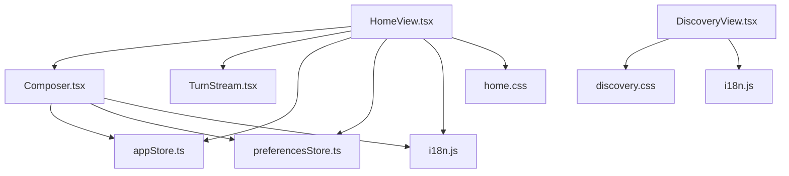
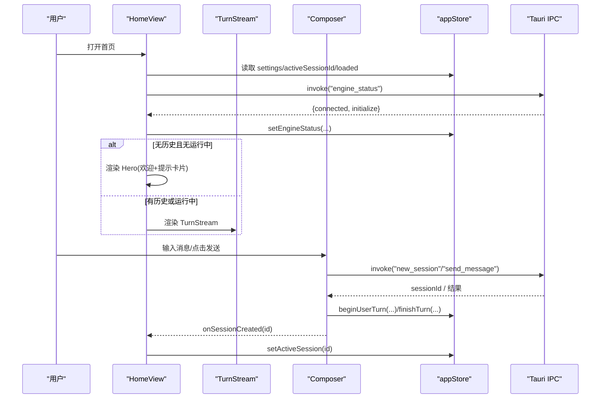
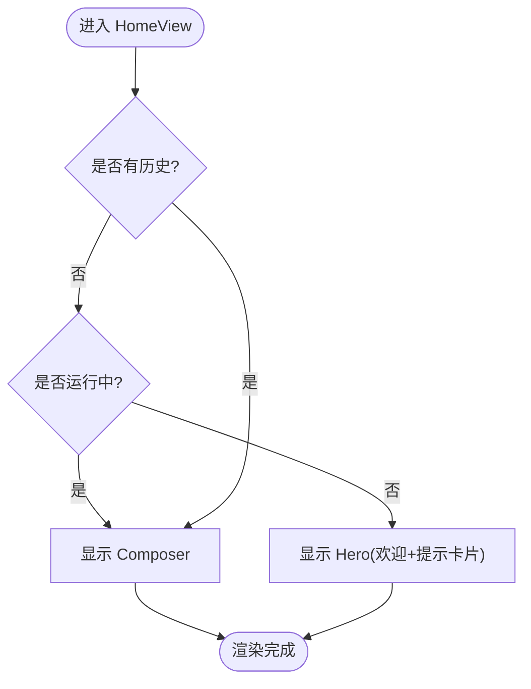
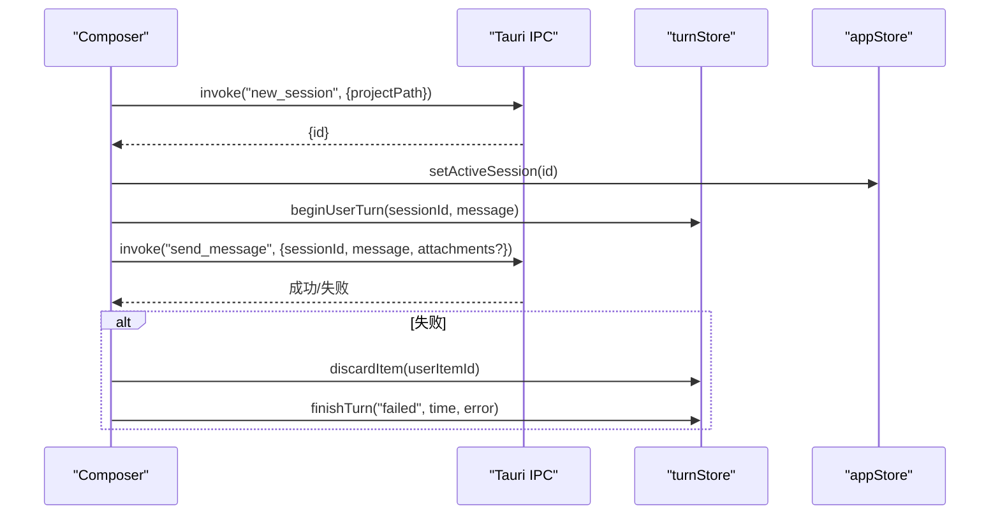
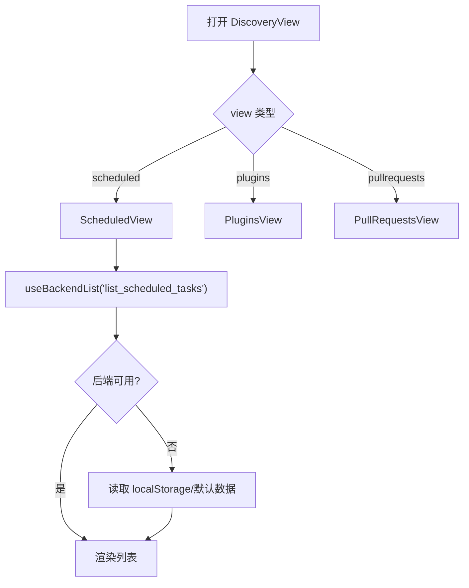
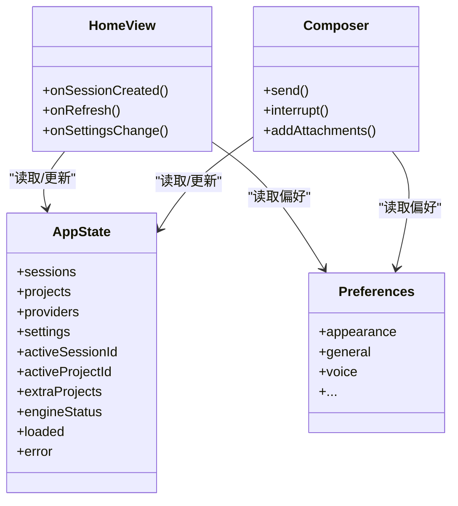
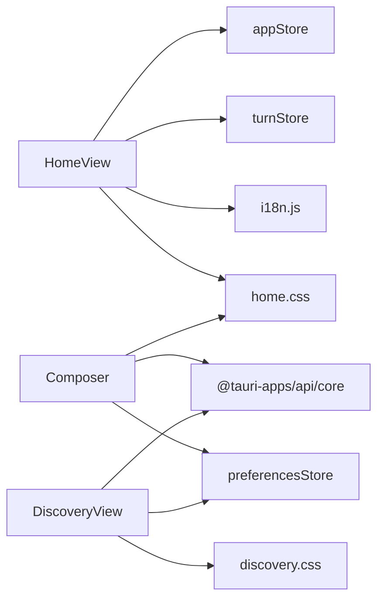

# 首页视图 (HomeView)

<cite>
**本文引用的文件**
- [HomeView.tsx](file://frontend/app/views/HomeView.tsx)
- [Composer.tsx](file://frontend/app/views/Composer.tsx)
- [DiscoveryView.tsx](file://frontend/app/views/DiscoveryView.tsx)
- [appStore.ts](file://frontend/app/state/appStore.ts)
- [preferencesStore.ts](file://frontend/app/state/preferencesStore.ts)
- [i18n.js](file://frontend/src/js/i18n.js)
- [home.css](file://frontend/src/styles/home.css)
- [discovery.css](file://frontend/src/styles/discovery.css)
</cite>

## 目录
1. [简介](#简介)
2. [项目结构](#项目结构)
3. [核心组件](#核心组件)
4. [架构总览](#架构总览)
5. [详细组件分析](#详细组件分析)
6. [依赖关系分析](#依赖关系分析)
7. [性能考虑](#性能考虑)
8. [故障排查指南](#故障排查指南)
9. [结论](#结论)
10. [附录](#附录)

## 简介
本文件为 Codex-Tauri 的首页视图 HomeView 提供完整的技术与使用文档。内容涵盖：
- 首页整体布局：欢迎界面、快速开始引导（提示卡片）、最近会话列表（线程流）与 Composer 输入区。
- 状态管理：应用初始化、会话加载、用户偏好设置与引擎状态探测。
- 与 Composer 的集成：消息发送、停止、附件、模型/权限/项目选择，以及通过事件与 HomeView 的状态同步。
- 发现页面 DiscoveryView：定时任务、插件、拉取请求等功能的展示与交互。
- 响应式设计与无障碍：CSS 媒体查询、容器查询、ARIA 属性与键盘导航。
- 多语言本地化：i18n 键值与动态切换。
- 定制与扩展：主题变量、可配置项与扩展点建议。

## 项目结构
前端采用 React + Tauri 的组合，首页由 HomeView 作为入口视图，内部组合 Hero（空态欢迎）、TurnStream（历史消息流）与 Composer（输入与发送）。样式通过 home.css 与 discovery.css 实现官方视觉一致性。状态集中在 appStore 与 preferencesStore，国际化通过 i18n.js 提供。

图表来源
- [HomeView.tsx:135-206](file://frontend/app/views/HomeView.tsx#L135-L206)
- [Composer.tsx:600-800](file://frontend/app/views/Composer.tsx#L600-L800)
- [appStore.ts:98-155](file://frontend/app/state/appStore.ts#L98-L155)
- [preferencesStore.ts:40-94](file://frontend/app/state/preferencesStore.ts#L40-L94)
- [i18n.js:4-10](file://frontend/src/js/i18n.js#L4-L10)
- [home.css:3-126](file://frontend/src/styles/home.css#L3-L126)
- [discovery.css:3-116](file://frontend/src/styles/discovery.css#L3-L116)

章节来源
- [HomeView.tsx:1-207](file://frontend/app/views/HomeView.tsx#L1-L207)
- [Composer.tsx:1-1089](file://frontend/app/views/Composer.tsx#L1-L1089)
- [DiscoveryView.tsx:1-800](file://frontend/app/views/DiscoveryView.tsx#L1-L800)
- [appStore.ts:1-200](file://frontend/app/state/appStore.ts#L1-L200)
- [preferencesStore.ts:1-94](file://frontend/app/state/preferencesStore.ts#L1-L94)
- [i18n.js:1-200](file://frontend/src/js/i18n.js#L1-L200)
- [home.css:1-800](file://frontend/src/styles/home.css#L1-L800)
- [discovery.css:1-800](file://frontend/src/styles/discovery.css#L1-L800)

## 核心组件
- HomeView：负责空态欢迎区、线程流与 Composer 的组合；监听会话变化并加载历史；探测引擎状态；将 Prompt 卡片事件传递给 Composer。
- Composer：输入框、发送/停止、附件、项目/权限/模型选择；通过 Tauri IPC 调用 new_session/send_message/interrupt_session；维护本地 mock 模式。
- DiscoveryView：统一调度 Scheduled/Plugins/PullRequests 子视图；提供搜索、筛选、创建抽屉、菜单弹出层；数据通过 useBackendList 从后端或 localStorage 获取。
- appStore：集中管理 sessions/projects/providers/settings/engineStatus/activeSessionId 等全局状态，并提供刷新与保存接口。
- preferencesStore：按 section 管理偏好设置，支持读取、合并、持久化与事件发射。
- i18n：提供多语言资源与当前语言检测/切换。

章节来源
- [HomeView.tsx:135-206](file://frontend/app/views/HomeView.tsx#L135-L206)
- [Composer.tsx:600-800](file://frontend/app/views/Composer.tsx#L600-L800)
- [DiscoveryView.tsx:261-800](file://frontend/app/views/DiscoveryView.tsx#L261-L800)
- [appStore.ts:98-200](file://frontend/app/state/appStore.ts#L98-L200)
- [preferencesStore.ts:40-94](file://frontend/app/state/preferencesStore.ts#L40-L94)
- [i18n.js:4-10](file://frontend/src/js/i18n.js#L4-L10)

## 架构总览
HomeView 作为顶层视图，协调以下职责：
- 空态显示：当无历史且无运行中的 turn 时，渲染 Hero（Logo+标题+提示卡片）。
- 会话同步：当 activeSessionId 变化时，加载对应线程历史；避免在 turn 进行中重复加载。
- 引擎探测：启动时调用 engine_status，更新连接状态与初始化信息。
- 事件桥接：Prompt 卡片通过自定义事件 codex:use-prompt 将文本注入 Composer。

图表来源
- [HomeView.tsx:158-179](file://frontend/app/views/HomeView.tsx#L158-L179)
- [HomeView.tsx:181-206](file://frontend/app/views/HomeView.tsx#L181-L206)
- [Composer.tsx:711-785](file://frontend/app/views/Composer.tsx#L711-L785)
- [appStore.ts:98-155](file://frontend/app/state/appStore.ts#L98-L155)

## 详细组件分析

### HomeView 组件
- 布局与状态
  - 根据 turn.order 长度与 turn.active 决定 showHero，控制空态与聊天态切换。
  - 通过 useAppState 获取 settings、activeSessionId、projects、loaded。
  - 通过 loadThreadFromSession 在 activeSessionId 变化时加载线程历史，避开正在运行的 turn。
- 引擎状态
  - 启动时调用 engine_status，捕获 connected 与 initialize，用于诊断与空态提示。
- 事件桥接
  - Prompt 卡片触发 codex:use-prompt 事件，Composer 监听该事件并填充输入框。

图表来源
- [HomeView.tsx:181-206](file://frontend/app/views/HomeView.tsx#L181-L206)

章节来源
- [HomeView.tsx:135-206](file://frontend/app/views/HomeView.tsx#L135-L206)

### Composer 组件
- 输入与发送
  - Enter 发送，Shift+Enter 换行；Esc 中断运行中的 turn。
  - 无 session 时先调用 new_session，再 send_message；携带 attachments（图片/文件）。
  - 错误时回滚乐观气泡并标记失败。
- 模型/权限/项目
  - 模型面板：强度滑块、模型列表、重置默认。
  - 权限面板：ask/help/unrestricted 三种策略。
  - 项目面板：搜索、新建、选择项目或“不在项目中工作”。
- 与 HomeView 的协作
  - 通过 onSessionCreated 通知 HomeView 更新 activeSessionId。
  - 通过 onRefresh 触发 appStore.refreshAppState。
  - 通过 onSettingsChange 持久化设置。

图表来源
- [Composer.tsx:711-785](file://frontend/app/views/Composer.tsx#L711-L785)
- [appStore.ts:98-155](file://frontend/app/state/appStore.ts#L98-L155)

章节来源
- [Composer.tsx:600-800](file://frontend/app/views/Composer.tsx#L600-L800)
- [Composer.tsx:1-1089](file://frontend/app/views/Composer.tsx#L1-L1089)

### DiscoveryView 组件
- 路由分发
  - 根据 view 参数渲染 Scheduled/Plugins/PullRequests。
- 数据获取
  - useBackendList 封装 invoke 调用，失败时回退到 localStorage 或内置默认数据。
- 定时任务
  - 搜索、启用/禁用、手动创建（抽屉），支持 cron 表达式校验与时间选择器。
  - 通过 save_scheduled_tasks 持久化。
- 插件与 PR
  - 插件网格、市场浏览、安装开关；PR 列表与空态。

图表来源
- [DiscoveryView.tsx:261-265](file://frontend/app/views/DiscoveryView.tsx#L261-L265)
- [DiscoveryView.tsx:144-210](file://frontend/app/views/DiscoveryView.tsx#L144-L210)
- [DiscoveryView.tsx:573-800](file://frontend/app/views/DiscoveryView.tsx#L573-L800)

章节来源
- [DiscoveryView.tsx:1-800](file://frontend/app/views/DiscoveryView.tsx#L1-L800)

### 状态管理与初始化
- 应用初始化
  - appStore 提供 defaultSettings、emptyState，并通过 useSyncExternalStore 暴露快照。
  - HomeView 启动时探测 engine_status，更新连接状态。
- 会话加载
  - activeSessionId 变化时，HomeView 调用 loadThreadFromSession 加载线程历史。
- 用户偏好
  - preferencesStore 提供 usePrefSection 读取某 section 的偏好，saveSection 合并并持久化。
  - i18n 语言来自 settings.language，并在 appStore 中同步到 legacy store。

图表来源
- [appStore.ts:98-155](file://frontend/app/state/appStore.ts#L98-L155)
- [preferencesStore.ts:40-94](file://frontend/app/state/preferencesStore.ts#L40-L94)
- [HomeView.tsx:135-206](file://frontend/app/views/HomeView.tsx#L135-L206)
- [Composer.tsx:600-800](file://frontend/app/views/Composer.tsx#L600-L800)

章节来源
- [appStore.ts:1-200](file://frontend/app/state/appStore.ts#L1-L200)
- [preferencesStore.ts:1-94](file://frontend/app/state/preferencesStore.ts#L1-L94)
- [HomeView.tsx:135-206](file://frontend/app/views/HomeView.tsx#L135-L206)

### 响应式设计适配
- 容器与布局
  - .view-home 使用 container-type: size 与 max-width 约束，确保在不同视口下居中与自适应。
  - .home-main-col.is-empty 与 .is-empty 外的行为差异，保证空态与聊天态的布局一致。
- 提示卡片网格
  - 媒体查询在 960px 与 640px 断点调整列数，提升小屏可用性。
- Composer 输入区
  - 单行圆角与多行圆角半径不同，聚焦时提升阴影层级，保持官方风格。
- 发现页
  - 搜索栏、按钮、卡片网格与抽屉动画均遵循官方规范，支持减少动效。

章节来源
- [home.css:3-126](file://frontend/src/styles/home.css#L3-L126)
- [home.css:225-755](file://frontend/src/styles/home.css#L225-L755)
- [discovery.css:71-116](file://frontend/src/styles/discovery.css#L71-L116)
- [discovery.css:147-196](file://frontend/src/styles/discovery.css#L147-L196)
- [discovery.css:648-686](file://frontend/src/styles/discovery.css#L648-L686)

### 无障碍支持
- 语义化标签与 ARIA
  - 按钮具备 aria-label、aria-haspopup、aria-expanded、aria-checked 等属性，便于屏幕阅读器理解。
  - 图标使用 aria-hidden="true" 避免冗余朗读。
- 键盘导航
  - 模型强度滑块支持方向键调整；Composer 支持 Enter/Shift+Enter/Esc 操作。
- 动效与可访问性
  - 使用 prefers-reduced-motion 禁用不必要的动画。

章节来源
- [Composer.tsx:352-373](file://frontend/app/views/Composer.tsx#L352-L373)
- [Composer.tsx:787-800](file://frontend/app/views/Composer.tsx#L787-L800)
- [DiscoveryView.tsx:301-379](file://frontend/app/views/DiscoveryView.tsx#L301-L379)
- [discovery.css:684-686](file://frontend/src/styles/discovery.css#L684-L686)

### 多语言本地化
- 资源与键值
  - i18n.js 定义 LOCALES 与大量键值，包括 home.*、discovery.*、scheduled.* 等。
- 动态切换
  - appStore 在 settings.language 变更时同步到 legacy store 并应用语言。
- 使用方式
  - 组件内通过 t(key, fallback) 获取文案，确保缺失键时回退到英文。

章节来源
- [i18n.js:4-10](file://frontend/src/js/i18n.js#L4-L10)
- [i18n.js:83-139](file://frontend/src/js/i18n.js#L83-L139)
- [appStore.ts:20-28](file://frontend/app/state/appStore.ts#L20-L28)
- [HomeView.tsx:111-127](file://frontend/app/views/HomeView.tsx#L111-L127)
- [DiscoveryView.tsx:59-65](file://frontend/app/views/DiscoveryView.tsx#L59-L65)

### 首页定制选项、主题配置与扩展点
- 主题与样式变量
  - 使用 CSS 变量如 --bg-canvas、--fg-primary、--accent-ring、--elevation-prominent 等，便于深色/浅色主题切换。
  - Composer 的单行/多行圆角、阴影与尺寸通过变量控制。
- 可配置项
  - settings.modelReasoningEffort、approvalPolicy、fullAccess、language、sandbox、webSearch、outputVerbosity、reasoningSummary 等。
  - 通过 onSettingsChange 持久化到后端。
- 扩展点
  - Prompt 卡片可通过新增 PROMPT_CARDS 与 i18n 键扩展。
  - DiscoveryView 的 useBackendList 可复用至其他模块以接入新后端能力。
  - Composer 的模型/权限/项目菜单可扩展新的选择维度。

章节来源
- [home.css:285-755](file://frontend/src/styles/home.css#L285-L755)
- [appStore.ts:63-96](file://frontend/app/state/appStore.ts#L63-L96)
- [HomeView.tsx:36-88](file://frontend/app/views/HomeView.tsx#L36-L88)
- [Composer.tsx:264-462](file://frontend/app/views/Composer.tsx#L264-L462)

## 依赖关系分析
- 组件耦合
  - HomeView 依赖 appStore 与 turnStore，通过回调与 Composer 解耦。
  - Composer 依赖 Tauri IPC 与 preferencesStore，通过事件与 HomeView 通信。
  - DiscoveryView 依赖 useBackendList 与 ComposerPopover，复用通用 UI 组件。
- 外部依赖
  - @tauri-apps/api/core 用于 IPC 调用。
  - React hooks 用于状态与副作用管理。
  - CSS 变量与媒体查询实现主题与响应式。

图表来源
- [HomeView.tsx:135-206](file://frontend/app/views/HomeView.tsx#L135-L206)
- [Composer.tsx:600-800](file://frontend/app/views/Composer.tsx#L600-L800)
- [DiscoveryView.tsx:261-800](file://frontend/app/views/DiscoveryView.tsx#L261-L800)
- [appStore.ts:98-155](file://frontend/app/state/appStore.ts#L98-L155)
- [preferencesStore.ts:40-94](file://frontend/app/state/preferencesStore.ts#L40-L94)
- [home.css:1-800](file://frontend/src/styles/home.css#L1-L800)
- [discovery.css:1-800](file://frontend/src/styles/discovery.css#L1-L800)

章节来源
- [HomeView.tsx:135-206](file://frontend/app/views/HomeView.tsx#L135-L206)
- [Composer.tsx:600-800](file://frontend/app/views/Composer.tsx#L600-L800)
- [DiscoveryView.tsx:261-800](file://frontend/app/views/DiscoveryView.tsx#L261-L800)

## 性能考虑
- 避免重复加载
  - HomeView 在 turn.active 且 sessionId 匹配时跳过 loadThreadFromSession，防止覆盖乐观气泡。
- 本地缓存与回退
  - DiscoveryView 的 useBackendList 在 IPC 失败时回退到 localStorage 或默认数据，提升离线体验。
- 输入优化
  - Composer 限制最大高度，避免过大文本框影响滚动性能。
- 渲染优化
  - 使用 useMemo/useCallback 减少不必要重渲染（如 providersWithModels、anchorFor）。

[本节为通用指导，不直接分析具体文件]

## 故障排查指南
- 引擎未连接
  - 检查 HomeView 的 engine_status 调用与 setEngineStatus 更新逻辑。
  - 确认后端服务已启动并可被 IPC 调用。
- 发送失败
  - 查看 Composer 的错误处理：discardItem 与 finishTurn 是否执行。
  - 检查 new_session 与 send_message 的参数是否正确。
- 本地存储不可用
  - DiscoveryView 在浏览器预览模式下可能无法写入 localStorage，需确认环境。
- 多语言未生效
  - 确认 settings.language 已更新并同步到 legacy store，调用 applyLanguage。

章节来源
- [HomeView.tsx:167-179](file://frontend/app/views/HomeView.tsx#L167-L179)
- [Composer.tsx:762-773](file://frontend/app/views/Composer.tsx#L762-L773)
- [DiscoveryView.tsx:154-196](file://frontend/app/views/DiscoveryView.tsx#L154-L196)
- [appStore.ts:20-28](file://frontend/app/state/appStore.ts#L20-L28)

## 结论
HomeView 作为 Codex-Tauri 的核心入口，提供了清晰的空态引导、高效的会话加载与稳定的 Composer 集成。通过 appStore 与 preferencesStore 的状态管理，结合 i18n 的多语言支持与 CSS 变量的主题化，实现了高可定制性与良好的用户体验。DiscoveryView 进一步扩展了功能发现与管理能力。建议在扩展新功能时复用现有模式（useBackendList、ComposerPopover、CSS 变量），以保持代码一致性与可维护性。

[本节为总结，不直接分析具体文件]

## 附录
- 关键路径参考
  - 首页布局与空态：[home.css:3-126](file://frontend/src/styles/home.css#L3-L126)
  - Composer 输入与发送：[Composer.tsx:711-785](file://frontend/app/views/Composer.tsx#L711-L785)
  - 发现页数据获取：[DiscoveryView.tsx:144-210](file://frontend/app/views/DiscoveryView.tsx#L144-L210)
  - 应用状态结构：[appStore.ts:98-155](file://frontend/app/state/appStore.ts#L98-L155)
  - 偏好设置读写：[preferencesStore.ts:40-94](file://frontend/app/state/preferencesStore.ts#L40-L94)
  - 多语言资源：[i18n.js:83-139](file://frontend/src/js/i18n.js#L83-L139)

[本节为附录，不直接分析具体文件]