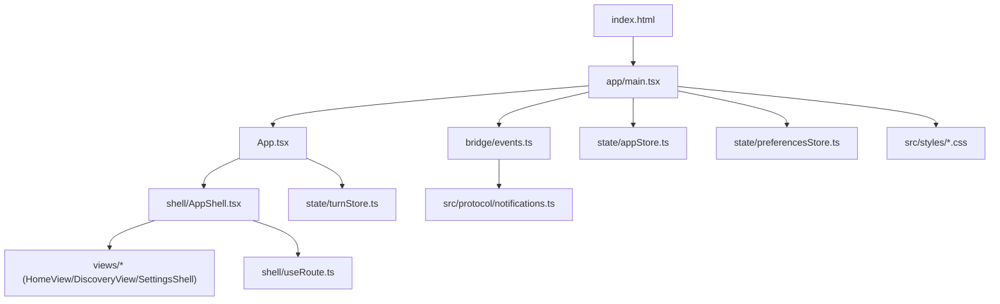
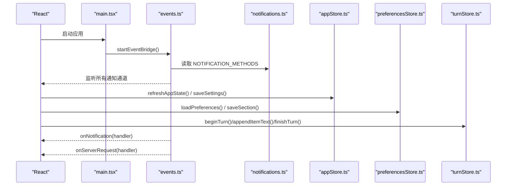
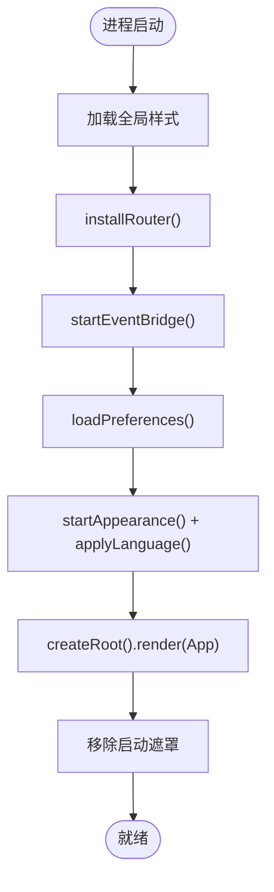
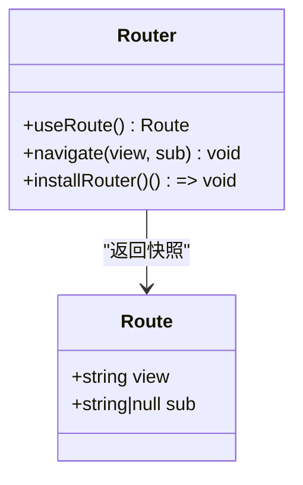
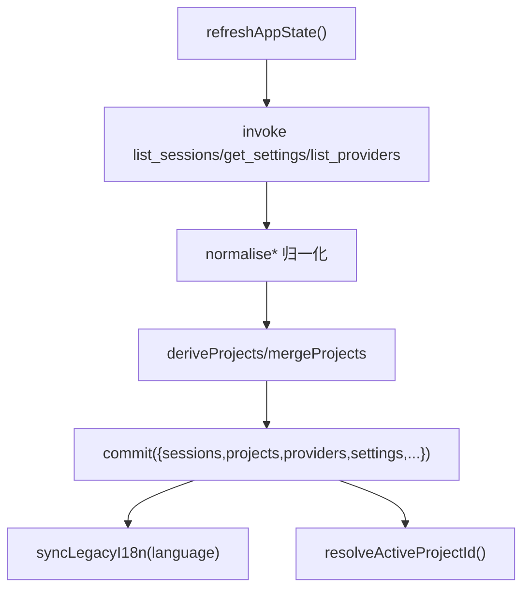
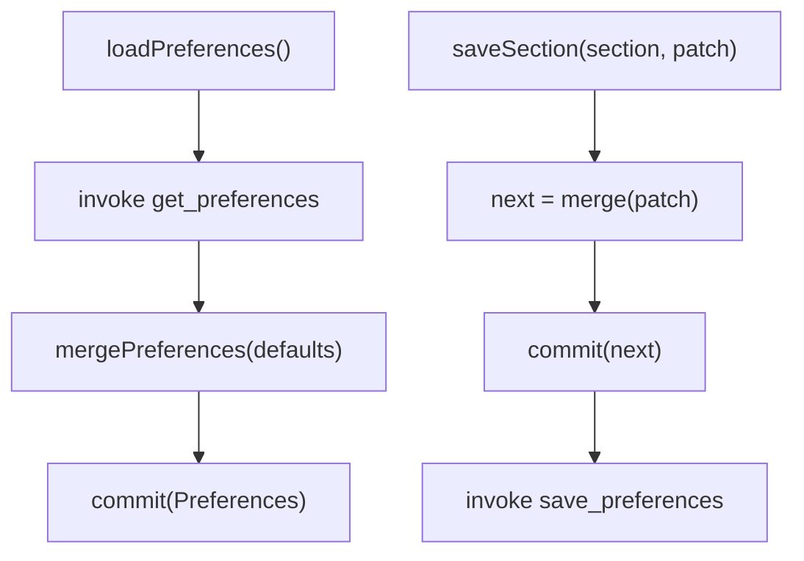
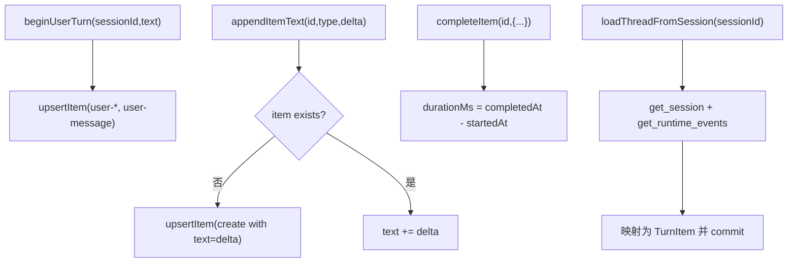
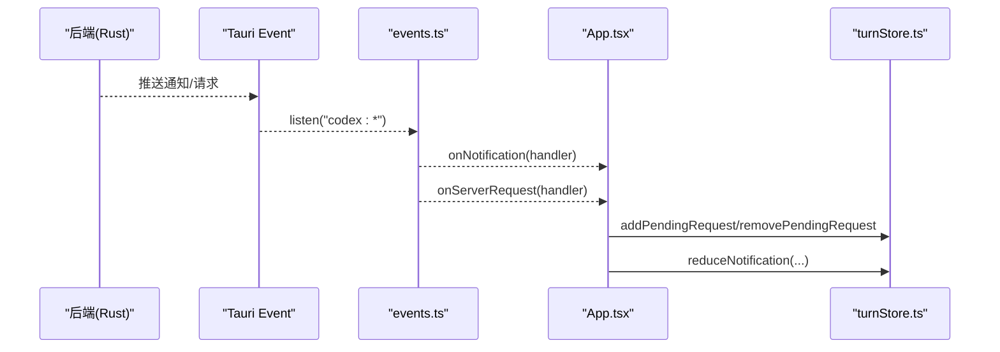
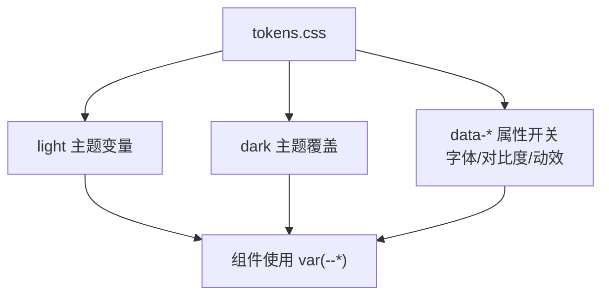
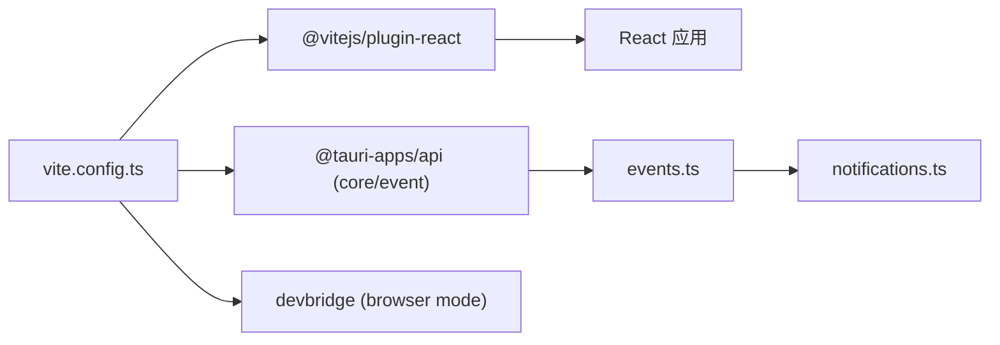

# 前端开发

<cite>
**本文引用的文件**
- [frontend/package.json](file://frontend/package.json)
- [frontend/vite.config.ts](file://frontend/vite.config.ts)
- [frontend/tsconfig.json](file://frontend/tsconfig.json)
- [frontend/index.html](file://frontend/index.html)
- [frontend/app/main.tsx](file://frontend/app/main.tsx)
- [frontend/app/App.tsx](file://frontend/app/App.tsx)
- [frontend/app/shell/AppShell.tsx](file://frontend/app/shell/AppShell.tsx)
- [frontend/app/shell/useRoute.ts](file://frontend/app/shell/useRoute.ts)
- [frontend/app/bridge/events.ts](file://frontend/app/bridge/events.ts)
- [frontend/app/state/appStore.ts](file://frontend/app/state/appStore.ts)
- [frontend/app/state/preferencesStore.ts](file://frontend/app/state/preferencesStore.ts)
- [frontend/app/state/turnStore.ts](file://frontend/app/state/turnStore.ts)
- [frontend/app/state/types.ts](file://frontend/app/state/types.ts)
- [frontend/src/styles/tokens.css](file://frontend/src/styles/tokens.css)
- [frontend/src/protocol/notifications.ts](file://frontend/src/protocol/notifications.ts)
</cite>

## 目录
1. [简介](#简介)
2. [项目结构](#项目结构)
3. [核心组件](#核心组件)
4. [架构总览](#架构总览)
5. [详细组件分析](#详细组件分析)
6. [依赖关系分析](#依赖关系分析)
7. [性能考虑](#性能考虑)
8. [故障排查指南](#故障排查指南)
9. [结论](#结论)
10. [附录](#附录)

## 简介
本文件面向 Codex-Tauri 的前端开发者，系统性说明基于 React + TypeScript 的前端应用组织方式、状态管理方案（appStore、preferencesStore、turnStore）、路由与导航系统、Vite 构建配置、TypeScript 类型体系、CSS 样式系统与主题机制，以及与后端的 IPC 通信协议和事件处理流程。文档同时提供组件开发最佳实践、状态同步策略与性能优化建议，并给出可操作的代码路径引用，帮助快速上手与维护。

## 项目结构
前端位于 frontend 目录，采用“React 应用层在 app，遗留静态资源与协议定义在 src”的混合迁移模式：
- app：React 应用入口、视图、壳层、状态、桥接、样式等
- src：遗留的样式、字体、协议生成文件、JS 数据表等
- index.html：启动页、启动动画、错误兜底与根挂载点
- vite.config.ts：Vite 构建与浏览器开发代理配置
- tsconfig.json：TS 编译与模块解析配置
- package.json：脚本、依赖与版本

图表来源
- [frontend/index.html:147-160](file://frontend/index.html#L147-L160)
- [frontend/app/main.tsx:33-59](file://frontend/app/main.tsx#L33-L59)
- [frontend/app/App.tsx:15-46](file://frontend/app/App.tsx#L15-L46)
- [frontend/app/shell/AppShell.tsx:78-205](file://frontend/app/shell/AppShell.tsx#L78-L205)
- [frontend/app/bridge/events.ts:145-159](file://frontend/app/bridge/events.ts#L145-L159)
- [frontend/src/protocol/notifications.ts:10-95](file://frontend/src/protocol/notifications.ts#L10-L95)
- [frontend/app/state/appStore.ts:130-155](file://frontend/app/state/appStore.ts#L130-L155)
- [frontend/app/state/preferencesStore.ts:20-43](file://frontend/app/state/preferencesStore.ts#L20-L43)
- [frontend/app/state/turnStore.ts:28-49](file://frontend/app/state/turnStore.ts#L28-L49)
- [frontend/src/styles/tokens.css:21-676](file://frontend/src/styles/tokens.css#L21-L676)

章节来源
- [frontend/package.json:1-31](file://frontend/package.json#L1-L31)
- [frontend/vite.config.ts:1-104](file://frontend/vite.config.ts#L1-L104)
- [frontend/tsconfig.json:1-36](file://frontend/tsconfig.json#L1-L36)
- [frontend/index.html:1-163](file://frontend/index.html#L1-L163)

## 核心组件
- 应用入口与初始化
  - main.tsx：加载全局样式、安装路由、启动事件桥、加载偏好与语言、渲染 App，并控制启动遮罩显示/隐藏
  - App.tsx：订阅通知与服务器请求，驱动 turnStore 与待处理请求集合，渲染 AppShell
- 壳层与导航
  - AppShell.tsx：标题栏、侧边栏、主内容区；根据路由切换 Home/Discovery/Settings；监听菜单事件与快捷键；维护侧边栏折叠状态
  - useRoute.ts：基于 URL hash 的轻量路由，暴露 useSyncExternalStore 读取，避免上下文依赖
- 状态管理
  - appStore.ts：会话、项目、提供商、设置、引擎状态；通过 Tauri invoke 拉取与持久化；useSyncExternalStore 暴露给 React
  - preferencesStore.ts：按 section 分区的偏好存储；合并默认值；持久化 save_preferences
  - turnStore.ts：当前对话轮次（turn）的状态机；增量追加文本/输出/进度；从后端历史重建
- 协议与事件
  - events.ts：统一接收 Tauri 事件，映射到 NOTIFICATION_METHODS/SERVER_REQUEST_METHODS，分发到各处理器
  - notifications.ts：自动生成通知方法清单与类型，保证前后端契约一致
- 样式与主题
  - tokens.css：设计令牌、字体栈、明暗主题变量、对比度与动效开关
  - 其他 CSS：按页面/组件拆分，保持与官方外观一致

章节来源
- [frontend/app/main.tsx:1-87](file://frontend/app/main.tsx#L1-L87)
- [frontend/app/App.tsx:1-47](file://frontend/app/App.tsx#L1-L47)
- [frontend/app/shell/AppShell.tsx:1-205](file://frontend/app/shell/AppShell.tsx#L1-L205)
- [frontend/app/shell/useRoute.ts:1-79](file://frontend/app/shell/useRoute.ts#L1-L79)
- [frontend/app/state/appStore.ts:1-526](file://frontend/app/state/appStore.ts#L1-L526)
- [frontend/app/state/preferencesStore.ts:1-94](file://frontend/app/state/preferencesStore.ts#L1-L94)
- [frontend/app/state/turnStore.ts:1-451](file://frontend/app/state/turnStore.ts#L1-L451)
- [frontend/app/bridge/events.ts:1-172](file://frontend/app/bridge/events.ts#L1-L172)
- [frontend/src/protocol/notifications.ts:1-222](file://frontend/src/protocol/notifications.ts#L1-L222)
- [frontend/src/styles/tokens.css:1-676](file://frontend/src/styles/tokens.css#L1-L676)

## 架构总览
整体采用“事件驱动 + 外部 Store + useSyncExternalStore”的模式：
- 事件桥将后端推送的通知与请求分发到各 store 或 UI 逻辑
- 三个 store 分别负责应用级数据、用户偏好、当前对话流
- 路由基于 hash，配合 body class 控制布局
- 样式通过 CSS 变量实现主题与多字体切换

图表来源
- [frontend/app/main.tsx:38-54](file://frontend/app/main.tsx#L38-L54)
- [frontend/app/bridge/events.ts:145-159](file://frontend/app/bridge/events.ts#L145-L159)
- [frontend/src/protocol/notifications.ts:10-95](file://frontend/src/protocol/notifications.ts#L10-L95)
- [frontend/app/state/appStore.ts:378-408](file://frontend/app/state/appStore.ts#L378-L408)
- [frontend/app/state/preferencesStore.ts:59-88](file://frontend/app/state/preferencesStore.ts#L59-L88)
- [frontend/app/state/turnStore.ts:68-117](file://frontend/app/state/turnStore.ts#L68-L117)

## 详细组件分析

### 应用启动与初始化流程
- 安装路由、启动事件桥、加载偏好与语言，然后渲染 App
- 启动遮罩的最小展示时间，避免闪屏过快

图表来源
- [frontend/app/main.tsx:38-59](file://frontend/app/main.tsx#L38-L59)
- [frontend/app/main.tsx:62-87](file://frontend/app/main.tsx#L62-L87)

章节来源
- [frontend/app/main.tsx:1-87](file://frontend/app/main.tsx#L1-L87)

### 路由与导航系统
- 使用 URL hash 作为路由，支持 view/subpage
- 通过 useSyncExternalStore 暴露 useRoute，避免 Context 依赖
- 根据 route.view 切换 body class，兼容现有样式规则

图表来源
- [frontend/app/shell/useRoute.ts:11-79](file://frontend/app/shell/useRoute.ts#L11-L79)

章节来源
- [frontend/app/shell/useRoute.ts:1-79](file://frontend/app/shell/useRoute.ts#L1-L79)

### 状态管理：appStore
- 职责：会话、项目、提供商、设置、引擎状态
- 数据源：全部来自后端；本地仅做派生与缓存
- 更新：commit 触发 listeners；React 通过 useSyncExternalStore 订阅
- 持久化：save_settings 与 engine config/batchWrite 双写

图表来源
- [frontend/app/state/appStore.ts:378-408](file://frontend/app/state/appStore.ts#L378-L408)
- [frontend/app/state/appStore.ts:215-245](file://frontend/app/state/appStore.ts#L215-L245)
- [frontend/app/state/appStore.ts:446-511](file://frontend/app/state/appStore.ts#L446-L511)

章节来源
- [frontend/app/state/appStore.ts:1-526](file://frontend/app/state/appStore.ts#L1-L526)

### 状态管理：preferencesStore
- 职责：按 section 管理的用户偏好，合并默认值，持久化保存
- 特点：失败不阻断 UI；支持 emitShellEvent 触发 shell 级事件

图表来源
- [frontend/app/state/preferencesStore.ts:59-88](file://frontend/app/state/preferencesStore.ts#L59-L88)

章节来源
- [frontend/app/state/preferencesStore.ts:1-94](file://frontend/app/state/preferencesStore.ts#L1-L94)

### 状态管理：turnStore
- 职责：当前对话轮次的单一事实来源；严格由服务端通知驱动
- 能力：开始/结束 turn、乐观插入用户消息、增量追加文本/输出/进度、完成 item、加载历史
- 数据结构：items 字典 + order 数组，O(1) 查找与稳定渲染顺序

图表来源
- [frontend/app/state/turnStore.ts:102-117](file://frontend/app/state/turnStore.ts#L102-L117)
- [frontend/app/state/turnStore.ts:143-191](file://frontend/app/state/turnStore.ts#L143-L191)
- [frontend/app/state/turnStore.ts:193-240](file://frontend/app/state/turnStore.ts#L193-L240)
- [frontend/app/state/turnStore.ts:312-450](file://frontend/app/state/turnStore.ts#L312-L450)

章节来源
- [frontend/app/state/turnStore.ts:1-451](file://frontend/app/state/turnStore.ts#L1-L451)
- [frontend/app/state/types.ts:1-146](file://frontend/app/state/types.ts#L1-L146)

### IPC 通信与事件处理
- 事件桥：监听 Tauri 事件，将 method 规范化为 codex:*，分发到通知/请求处理器
- 协议：NOTIFICATION_METHODS 与 SERVER_REQUEST_METHODS 由生成文件保障一致性
- 请求：server→client 的请求（审批、用户输入等）固定通道，客户端需按 id 回复

图表来源
- [frontend/app/bridge/events.ts:23-30](file://frontend/app/bridge/events.ts#L23-L30)
- [frontend/app/bridge/events.ts:145-159](file://frontend/app/bridge/events.ts#L145-L159)
- [frontend/app/App.tsx:15-46](file://frontend/app/App.tsx#L15-L46)
- [frontend/src/protocol/notifications.ts:10-95](file://frontend/src/protocol/notifications.ts#L10-L95)

章节来源
- [frontend/app/bridge/events.ts:1-172](file://frontend/app/bridge/events.ts#L1-L172)
- [frontend/src/protocol/notifications.ts:1-222](file://frontend/src/protocol/notifications.ts#L1-L222)

### 样式系统与主题机制
- 设计令牌：tokens.css 集中定义字体、间距、字号、圆角、阴影、语义色、组件表面色等
- 主题：通过 html.theme-dark 与 data-* 属性切换明暗、对比度、字体族、动效等
- 迁移策略：React 仅替换渲染层，样式尽量复用官方 CSS，确保视觉一致性

图表来源
- [frontend/src/styles/tokens.css:21-676](file://frontend/src/styles/tokens.css#L21-L676)

章节来源
- [frontend/src/styles/tokens.css:1-676](file://frontend/src/styles/tokens.css#L1-L676)

## 依赖关系分析
- 构建与模块
  - Vite 插件：@vitejs/plugin-react
  - 别名：@ → app，@protocol → src/protocol
  - 浏览器模式：将 @tauri-apps/api 重定向到 devbridge，便于浏览器调试
- 运行时依赖
  - @tauri-apps/api/core、event：用于 invoke 与 listen
  - react/react-dom：UI 框架
- 协议依赖
  - 生成的 notifications.ts 决定事件桥监听的方法集

图表来源
- [frontend/vite.config.ts:1-104](file://frontend/vite.config.ts#L1-L104)
- [frontend/package.json:15-29](file://frontend/package.json#L15-L29)
- [frontend/src/protocol/notifications.ts:10-95](file://frontend/src/protocol/notifications.ts#L10-L95)

章节来源
- [frontend/vite.config.ts:1-104](file://frontend/vite.config.ts#L1-L104)
- [frontend/package.json:1-31](file://frontend/package.json#L1-L31)

## 性能考虑
- 高频率流式更新
  - turnStore 使用 items 字典 + order 数组，避免全量 diff；增量追加文本/输出/进度
  - 使用 useSyncExternalStore 减少不必要的重渲染
- 网络与 I/O
  - 批量刷新：refreshAppState 并行获取 sessions/providers/settings
  - 异步持久化：saveSettings/saveSection 先提交本地再落盘，避免阻塞 UI
- 构建产物
  - 目标 es2022，开启 sourcemap，输出文件名带 hash，利于缓存
- 启动体验
  - 最小启动遮罩时长，避免闪烁；错误兜底显示错误信息

[本节为通用指导，无需具体文件引用]

## 故障排查指南
- 启动失败
  - index.html 内置启动失败兜底：超时或全局 error 会显示错误提示并移除遮罩
- 事件未生效
  - 检查 events.ts 是否已调用 startEventBridge；确认 NOTIFICATION_METHODS 包含对应方法
- 偏好未持久化
  - 检查 preferencesStore.saveSection 是否成功；查看控制台日志中的错误
- 设置未生效
  - 检查 appStore.saveSettings 的双写路径（shell settings 与 engine config）
- 路由异常
  - 检查 useRoute 的 navigate 调用与 body class 同步逻辑

章节来源
- [frontend/index.html:15-62](file://frontend/index.html#L15-L62)
- [frontend/app/bridge/events.ts:145-159](file://frontend/app/bridge/events.ts#L145-L159)
- [frontend/app/state/preferencesStore.ts:76-88](file://frontend/app/state/preferencesStore.ts#L76-L88)
- [frontend/app/state/appStore.ts:446-511](file://frontend/app/state/appStore.ts#L446-L511)
- [frontend/app/shell/useRoute.ts:48-79](file://frontend/app/shell/useRoute.ts#L48-L79)

## 结论
Codex-Tauri 前端以事件驱动为核心，结合外部 Store 与 useSyncExternalStore，实现了低耦合、易扩展的状态管理；通过协议生成文件与事件桥，保证了前后端契约的一致性；样式系统通过设计令牌与主题变量，兼顾了与官方外观的一致性与可定制性。遵循本文档的组件开发最佳实践与性能优化建议，可高效推进功能迭代与重构迁移。

## 附录
- 常用命令
  - 开发：npm run dev
  - 构建：npm run build
  - 类型检查：npm run typecheck
  - 浏览器模式：npm run dev:browser
- 关键路径参考
  - 入口：frontend/app/main.tsx
  - 根组件：frontend/app/App.tsx
  - 壳层：frontend/app/shell/AppShell.tsx
  - 路由：frontend/app/shell/useRoute.ts
  - 事件桥：frontend/app/bridge/events.ts
  - 协议：frontend/src/protocol/notifications.ts
  - 样式：frontend/src/styles/tokens.css

[本节为补充信息，无需具体文件引用]