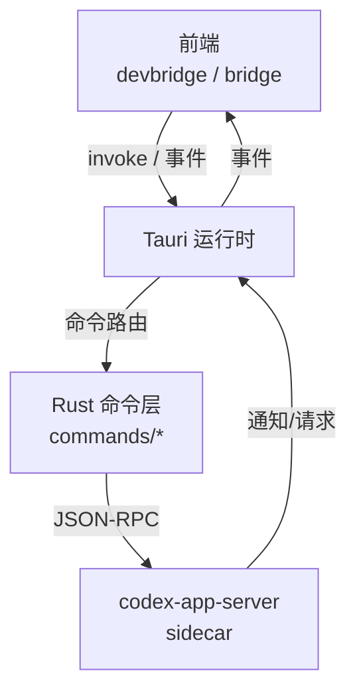
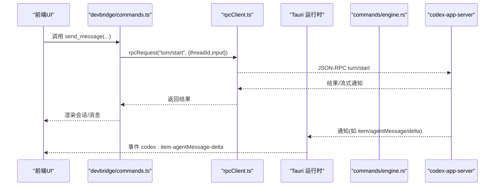
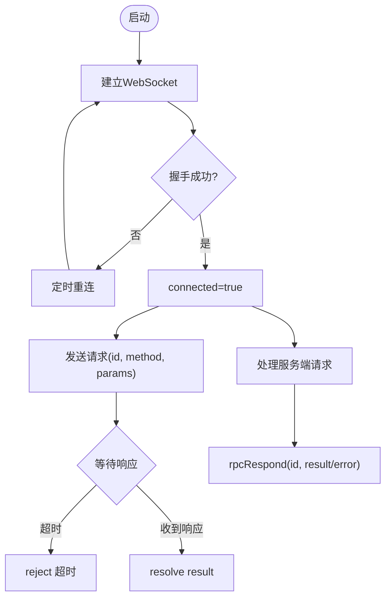
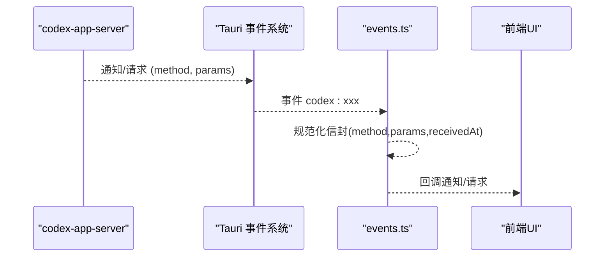
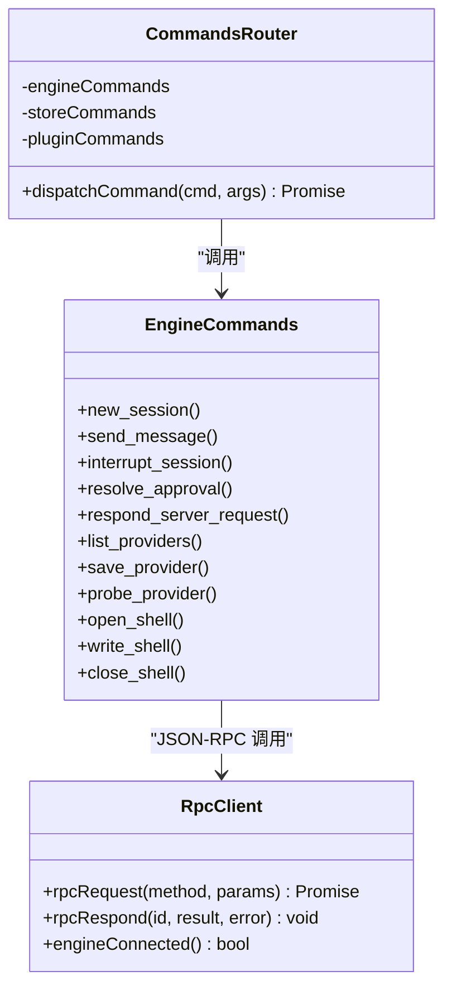
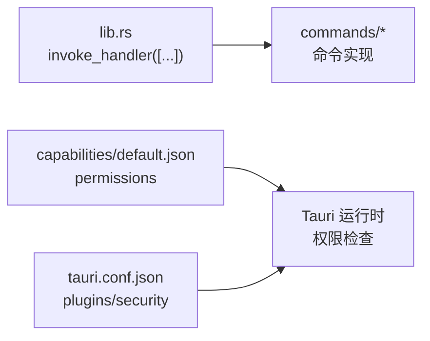
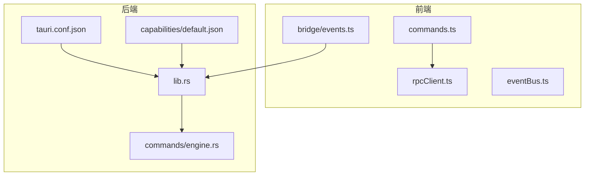

# IPC 通信机制

<cite>
**本文引用的文件**
- [frontend/app/devbridge/rpcClient.ts](file://frontend/app/devbridge/rpcClient.ts)
- [frontend/app/devbridge/commands.ts](file://frontend/app/devbridge/commands.ts)
- [frontend/app/devbridge/eventBus.ts](file://frontend/app/devbridge/eventBus.ts)
- [frontend/app/devbridge/tauri-core.ts](file://frontend/app/devbridge/tauri-core.ts)
- [frontend/app/bridge/events.ts](file://frontend/app/bridge/events.ts)
- [src-tauri/src/lib.rs](file://src-tauri/src/lib.rs)
- [src-tauri/src/main.rs](file://src-tauri/src/main.rs)
- [src-tauri/src/commands/engine.rs](file://src-tauri/src/commands/engine.rs)
- [src-tauri/tauri.conf.json](file://src-tauri/tauri.conf.json)
- [src-tauri/capabilities/default.json](file://src-tauri/capabilities/default.json)
</cite>

## 目录
1. [简介](#简介)
2. [项目结构](#项目结构)
3. [核心组件](#核心组件)
4. [架构总览](#架构总览)
5. [详细组件分析](#详细组件分析)
6. [依赖关系分析](#依赖关系分析)
7. [性能考虑](#性能考虑)
8. [故障排查指南](#故障排查指南)
9. [结论](#结论)
10. [附录：自定义命令与最佳实践](#附录自定义命令与最佳实践)

## 简介
本文件系统性说明 Codex-Tauri 的 IPC 通信机制，覆盖前后端通信协议、消息格式与类型、RPC 客户端实现、事件总线设计与分发、安全权限模型与命令注册流程，并提供调用示例、调试技巧、性能优化建议以及自定义命令添加指南。

## 项目结构
Codex-Tauri 的 IPC 由前端（浏览器/开发模式桥接）与后端（Tauri + Rust）共同组成：
- 前端在“浏览器开发模式”下通过 devbridge 将 Tauri invoke 映射到本地 WebSocket 与内存存储；生产模式下则走 Tauri 原生能力。
- 后端通过 Tauri 命令暴露能力，并将引擎侧（codex-app-server）的 JSON-RPC 请求转发给 sidecar，同时将 sidecar 通知广播为 Tauri 事件。

图表来源
- [src-tauri/src/lib.rs:16-69](file://src-tauri/src/lib.rs#L16-L69)
- [src-tauri/src/commands/engine.rs:13-20](file://src-tauri/src/commands/engine.rs#L13-L20)
- [frontend/app/devbridge/commands.ts:69-368](file://frontend/app/devbridge/commands.ts#L69-L368)
- [frontend/app/bridge/events.ts:145-159](file://frontend/app/bridge/events.ts#L145-L159)

章节来源
- [src-tauri/src/lib.rs:16-69](file://src-tauri/src/lib.rs#L16-L69)
- [frontend/app/devbridge/commands.ts:1-19](file://frontend/app/devbridge/commands.ts#L1-L19)
- [frontend/app/bridge/events.ts:1-172](file://frontend/app/bridge/events.ts#L1-L172)

## 核心组件
- 前端 RPC 客户端：基于 WebSocket 的 JSON-RPC 2.0 客户端，负责握手、请求/响应匹配、超时与重连、服务端请求应答。
- 前端事件总线：模拟 Tauri 事件 API，提供监听与发射，用于开发模式下的事件分发。
- 命令路由器：在开发模式下将 Tauri 命令名映射到具体处理逻辑（引擎转发、本地存储、虚拟 FS、插件兼容）。
- 后端命令层：将 Tauri 命令转换为 codex-app-server 的 JSON-RPC 方法，并进行数据归一化与错误返回。
- 事件桥：将 sidecar 的通知与请求以 Tauri 事件形式推送至前端。

章节来源
- [frontend/app/devbridge/rpcClient.ts:20-230](file://frontend/app/devbridge/rpcClient.ts#L20-L230)
- [frontend/app/devbridge/eventBus.ts:1-47](file://frontend/app/devbridge/eventBus.ts#L1-L47)
- [frontend/app/devbridge/commands.ts:69-683](file://frontend/app/devbridge/commands.ts#L69-L683)
- [src-tauri/src/commands/engine.rs:13-800](file://src-tauri/src/commands/engine.rs#L13-L800)
- [frontend/app/bridge/events.ts:1-172](file://frontend/app/bridge/events.ts#L1-L172)

## 架构总览
下图展示了从 UI 发起一次“发送消息”到引擎并接收通知的完整链路。

图表来源
- [frontend/app/devbridge/commands.ts:99-107](file://frontend/app/devbridge/commands.ts#L99-L107)
- [frontend/app/devbridge/rpcClient.ts:201-221](file://frontend/app/devbridge/rpcClient.ts#L201-L221)
- [src-tauri/src/commands/engine.rs:102-127](file://src-tauri/src/commands/engine.rs#L102-L127)
- [frontend/app/bridge/events.ts:99-113](file://frontend/app/bridge/events.ts#L99-L113)

## 详细组件分析

### 前端 RPC 客户端（WebSocket JSON-RPC 2.0）
- 连接与握手：建立 WebSocket，执行三步握手（initialize → response → initialized），成功后标记已连接。
- 请求/响应：为每个请求分配唯一 id，维护 pending 表，设置超时；收到响应后 resolve/reject。
- 服务端请求：当服务器主动发起请求（审批、用户输入等），通过事件总线转发到前端处理器，前端使用 rpcRespond 按 id 回复。
- 错误与重连：连接关闭时清理 pending 并定时重连；初始化失败记录日志并在下次重连重试。

图表来源
- [frontend/app/devbridge/rpcClient.ts:70-101](file://frontend/app/devbridge/rpcClient.ts#L70-L101)
- [frontend/app/devbridge/rpcClient.ts:103-148](file://frontend/app/devbridge/rpcClient.ts#L103-L148)
- [frontend/app/devbridge/rpcClient.ts:150-189](file://frontend/app/devbridge/rpcClient.ts#L150-L189)
- [frontend/app/devbridge/rpcClient.ts:201-229](file://frontend/app/devbridge/rpcClient.ts#L201-L229)

章节来源
- [frontend/app/devbridge/rpcClient.ts:20-230](file://frontend/app/devbridge/rpcClient.ts#L20-L230)

### 事件总线与事件桥
- 开发模式事件总线：提供 bridgeListen/bridgeEmit，模拟 Tauri 事件语义，用于 devbridge 内部分发。
- 生产模式事件桥：监听 Tauri 事件通道（如 codex:*），将通知与服务器请求封装为统一信封，分发给订阅者。
- 命名规范：方法名中的 “.” 和 “/” 会被替换为 “-”，确保与 Tauri 事件名兼容。

图表来源
- [frontend/app/bridge/events.ts:23-30](file://frontend/app/bridge/events.ts#L23-L30)
- [frontend/app/bridge/events.ts:99-159](file://frontend/app/bridge/events.ts#L99-L159)
- [frontend/app/devbridge/eventBus.ts:21-47](file://frontend/app/devbridge/eventBus.ts#L21-L47)

章节来源
- [frontend/app/bridge/events.ts:1-172](file://frontend/app/bridge/events.ts#L1-L172)
- [frontend/app/devbridge/eventBus.ts:1-47](file://frontend/app/devbridge/eventBus.ts#L1-L47)

### 命令路由与引擎转发
- 开发模式命令路由：将 Tauri 命令名映射到 engineCommands/storeCommands/pluginCommands/marketUnavailable，最终调用 rpcClient 或本地存储。
- 后端命令层：将 Tauri 命令参数转换为 JSON-RPC 方法调用，并对返回值进行归一化（如 threadStart 扁平化、providers/servers/skills/plugins 包裹）。
- 审批与用户输入：通过 resolve_approval/respond_server_request 将前端决策回传给引擎。

图表来源
- [frontend/app/devbridge/commands.ts:69-368](file://frontend/app/devbridge/commands.ts#L69-L368)
- [src-tauri/src/commands/engine.rs:22-800](file://src-tauri/src/commands/engine.rs#L22-L800)
- [frontend/app/devbridge/rpcClient.ts:201-229](file://frontend/app/devbridge/rpcClient.ts#L201-L229)

章节来源
- [frontend/app/devbridge/commands.ts:1-683](file://frontend/app/devbridge/commands.ts#L1-L683)
- [src-tauri/src/commands/engine.rs:1-800](file://src-tauri/src/commands/engine.rs#L1-L800)

### 安全权限模型与命令注册
- 命令注册：在应用启动时集中注册所有 Tauri 命令（本地命令与引擎转发命令），形成稳定的前端可调用接口集。
- 权限控制：通过 capabilities 声明窗口与插件权限（如 shell、fs、dialog、store），限制前端可访问的系统能力。
- 配置与安全：t aur i.conf.json 中启用全局 Tauri、配置资源与插件行为；CSP 为空以允许开发环境。

图表来源
- [src-tauri/src/lib.rs:71-148](file://src-tauri/src/lib.rs#L71-L148)
- [src-tauri/capabilities/default.json:1-31](file://src-tauri/capabilities/default.json#L1-L31)
- [src-tauri/tauri.conf.json:29-59](file://src-tauri/tauri.conf.json#L29-L59)

章节来源
- [src-tauri/src/lib.rs:71-148](file://src-tauri/src/lib.rs#L71-L148)
- [src-tauri/capabilities/default.json:1-31](file://src-tauri/capabilities/default.json#L1-L31)
- [src-tauri/tauri.conf.json:1-61](file://src-tauri/tauri.conf.json#L1-L61)

## 依赖关系分析
- 前端依赖：
  - devbridge/rpcClient.ts：WebSocket JSON-RPC 客户端，负责与 codex-app-server 通信。
  - devbridge/commands.ts：命令路由，将 Tauri 命令映射到 RPC 或本地存储。
  - devbridge/eventBus.ts：开发模式事件总线。
  - bridge/events.ts：生产模式事件桥，绑定 Tauri 事件通道。
- 后端依赖：
  - lib.rs：应用初始化、命令注册、事件桥启动、sidecar 管理。
  - commands/engine.rs：引擎命令实现，JSON-RPC 方法与数据归一化。
  - tauri.conf.json 与 capabilities：权限与插件配置。

图表来源
- [frontend/app/devbridge/rpcClient.ts:20-230](file://frontend/app/devbridge/rpcClient.ts#L20-L230)
- [frontend/app/devbridge/commands.ts:69-683](file://frontend/app/devbridge/commands.ts#L69-L683)
- [frontend/app/devbridge/eventBus.ts:1-47](file://frontend/app/devbridge/eventBus.ts#L1-L47)
- [frontend/app/bridge/events.ts:1-172](file://frontend/app/bridge/events.ts#L1-L172)
- [src-tauri/src/lib.rs:16-148](file://src-tauri/src/lib.rs#L16-L148)
- [src-tauri/src/commands/engine.rs:13-800](file://src-tauri/src/commands/engine.rs#L13-L800)
- [src-tauri/tauri.conf.json:29-59](file://src-tauri/tauri.conf.json#L29-L59)
- [src-tauri/capabilities/default.json:1-31](file://src-tauri/capabilities/default.json#L1-L31)

章节来源
- [frontend/app/devbridge/rpcClient.ts:20-230](file://frontend/app/devbridge/rpcClient.ts#L20-L230)
- [frontend/app/devbridge/commands.ts:69-683](file://frontend/app/devbridge/commands.ts#L69-L683)
- [frontend/app/devbridge/eventBus.ts:1-47](file://frontend/app/devbridge/eventBus.ts#L1-L47)
- [frontend/app/bridge/events.ts:1-172](file://frontend/app/bridge/events.ts#L1-L172)
- [src-tauri/src/lib.rs:16-148](file://src-tauri/src/lib.rs#L16-L148)
- [src-tauri/src/commands/engine.rs:13-800](file://src-tauri/src/commands/engine.rs#L13-L800)
- [src-tauri/tauri.conf.json:29-59](file://src-tauri/tauri.conf.json#L29-L59)
- [src-tauri/capabilities/default.json:1-31](file://src-tauri/capabilities/default.json#L1-L31)

## 性能考虑
- 请求超时与重连：前端对 initialize 与常规请求分别设置超时，避免阻塞；连接断开后自动重连，提升鲁棒性。
- 批量写入与配置热重载：保存 provider/MCP 时使用 batchWrite 并触发 reloadUserConfig，减少多次往返。
- 事件去抖与最小化处理：事件桥仅做信封转换与分发，避免在事件回调中进行重型计算。
- 网络探测优化：provider probe 支持多种候选端点与协议头，快速失败并返回结构化错误，便于 UI 降级。

[本节为通用指导，不直接分析具体文件]

## 故障排查指南
- 无法连接引擎：
  - 检查 WebSocket 是否成功建立与握手完成；查看控制台日志确认 connected 状态。
  - 若握手超时，确认 vite 代理路径与 Origin 头是否符合要求。
- 命令未找到：
  - 确认命令已在 lib.rs 中注册；开发模式下检查 commands.ts 的路由表是否包含该命令。
- 事件未触发：
  - 确认事件名符合命名规范（方法名中的 “.” 和 “/” 替换为 “-”）；检查 bridge/events.ts 是否正确绑定通道。
- 权限不足：
  - 检查 capabilities/default.json 是否授予所需权限（shell、fs、dialog、store 等）。
- 配置未生效：
  - 保存 provider/MCP 后需触发 reloadUserConfig；重启应用以确保环境变量注入。

章节来源
- [frontend/app/devbridge/rpcClient.ts:70-101](file://frontend/app/devbridge/rpcClient.ts#L70-L101)
- [frontend/app/devbridge/rpcClient.ts:150-189](file://frontend/app/devbridge/rpcClient.ts#L150-L189)
- [src-tauri/src/lib.rs:71-148](file://src-tauri/src/lib.rs#L71-L148)
- [frontend/app/bridge/events.ts:99-159](file://frontend/app/bridge/events.ts#L99-L159)
- [src-tauri/capabilities/default.json:1-31](file://src-tauri/capabilities/default.json#L1-L31)

## 结论
Codex-Tauri 的 IPC 通过 Tauri 命令层与 codex-app-server 的 JSON-RPC 紧密集成，前端在开发模式下通过 devbridge 复现相同的行为，保证跨环境一致性。事件系统与命令路由提供了清晰的消息分发与处理能力，配合权限模型与配置管理，实现了安全可控的桌面应用通信。

[本节为总结，不直接分析具体文件]

## 附录：自定义命令与最佳实践

### 添加自定义命令（后端）
- 在 commands 目录下新增模块并实现函数。
- 在 lib.rs 的 invoke_handler 中注册命令。
- 如需访问引擎，使用 State<'_, EngineHandle> 并通过 rpc 方法调用 JSON-RPC。
- 对返回值进行必要归一化，保持前端契约稳定。

章节来源
- [src-tauri/src/lib.rs:71-148](file://src-tauri/src/lib.rs#L71-L148)
- [src-tauri/src/commands/engine.rs:13-20](file://src-tauri/src/commands/engine.rs#L13-L20)

### 添加自定义命令（前端开发模式）
- 在 commands.ts 中添加对应键值到 engineCommands/storeCommands/pluginCommands。
- 如需调用引擎，使用 rpcRequest；如需本地存储，操作 shellState。
- 保持参数命名兼容 camelCase/snake_case，提高兼容性。

章节来源
- [frontend/app/devbridge/commands.ts:69-683](file://frontend/app/devbridge/commands.ts#L69-L683)

### 事件订阅与响应
- 订阅通知：使用 bridge/events.ts 的 onNotification 或在 devbridge 中使用 eventBus。
- 响应服务器请求：使用 rpcRespond 按 id 回复，确保 approval/user-input 等交互正确闭环。

章节来源
- [frontend/app/bridge/events.ts:57-87](file://frontend/app/bridge/events.ts#L57-L87)
- [frontend/app/devbridge/rpcClient.ts:223-229](file://frontend/app/devbridge/rpcClient.ts#L223-L229)

### 权限与配置
- 在 capabilities 中按需开启权限，避免过度授权。
- 在 tauri.conf.json 中配置插件与安全策略，确保开发与生产环境一致。

章节来源
- [src-tauri/capabilities/default.json:1-31](file://src-tauri/capabilities/default.json#L1-L31)
- [src-tauri/tauri.conf.json:29-59](file://src-tauri/tauri.conf.json#L29-L59)

### 调试技巧
- 打开 Tauri 日志：通过环境变量过滤日志级别，定位命令与事件问题。
- 前端控制台：关注 devbridge 与 events 的日志输出，确认连接与事件绑定状态。
- 网络面板：观察 WebSocket 帧与 JSON-RPC 报文，验证握手与请求/响应。

章节来源
- [src-tauri/src/lib.rs:8-14](file://src-tauri/src/lib.rs#L8-L14)
- [frontend/app/devbridge/rpcClient.ts:70-101](file://frontend/app/devbridge/rpcClient.ts#L70-L101)
- [frontend/app/bridge/events.ts:145-159](file://frontend/app/bridge/events.ts#L145-L159)