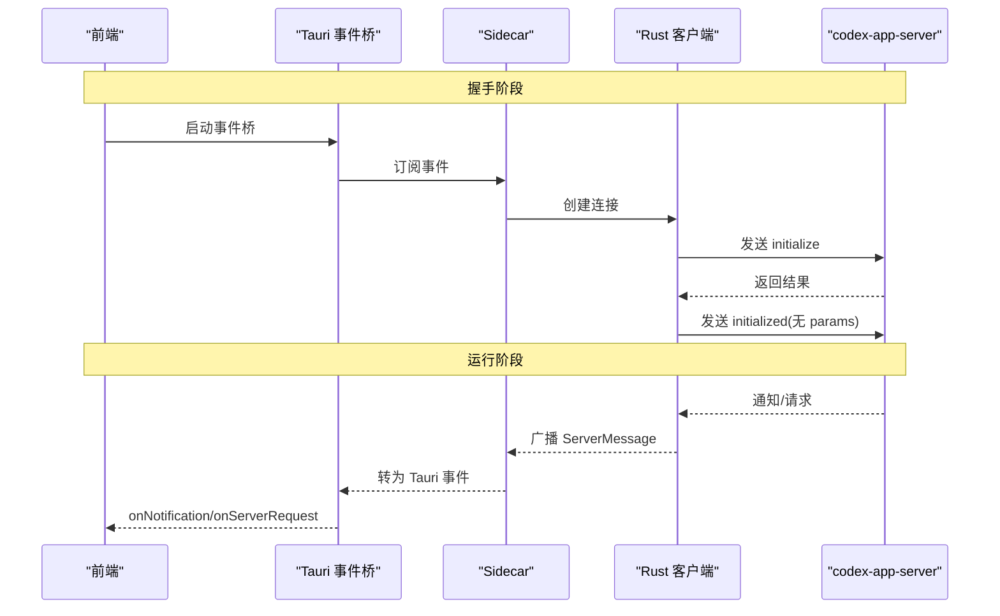
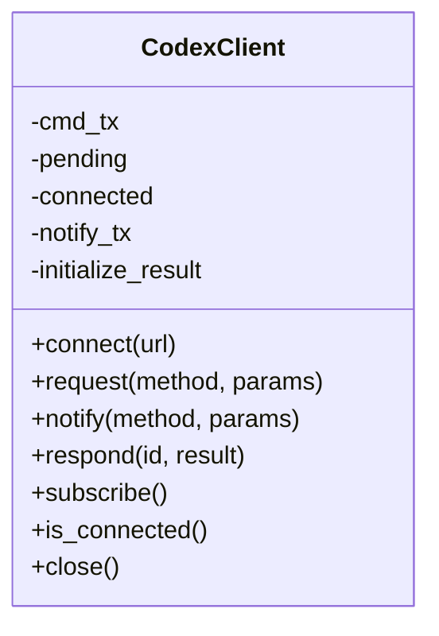
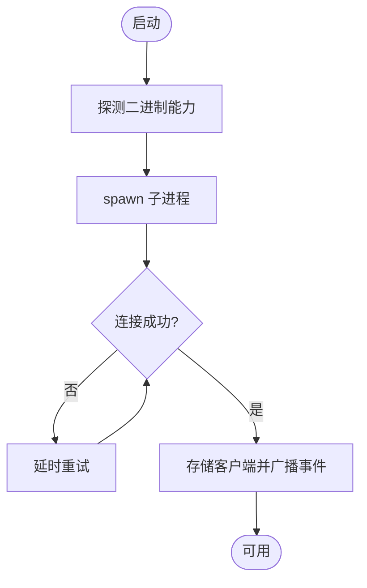
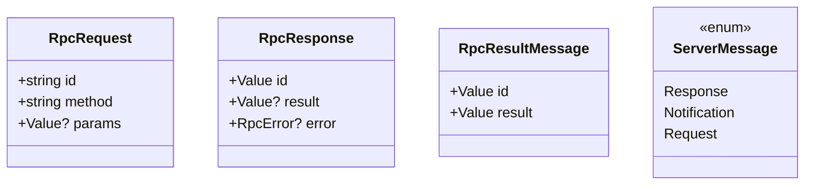
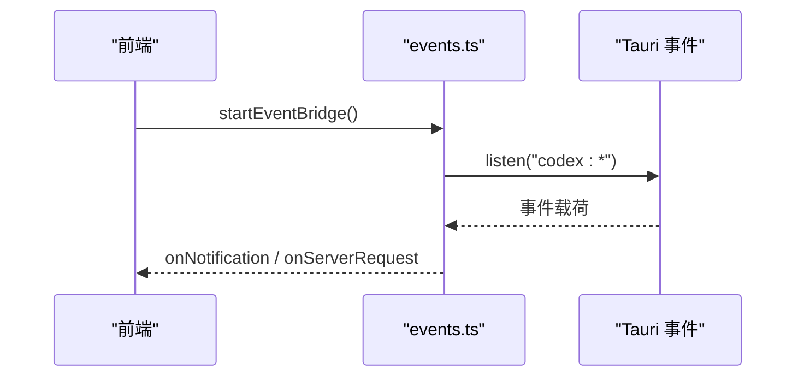
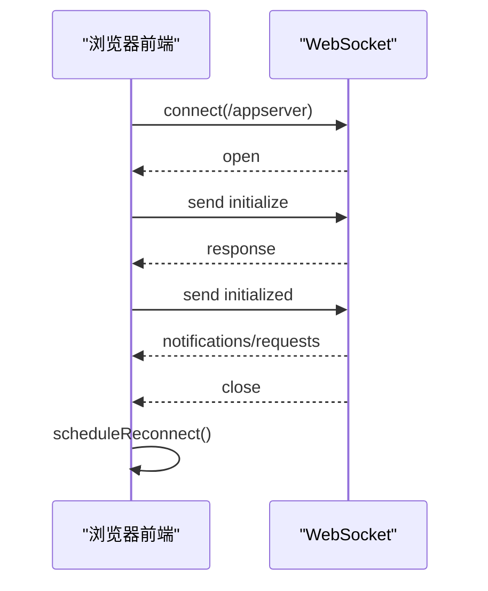
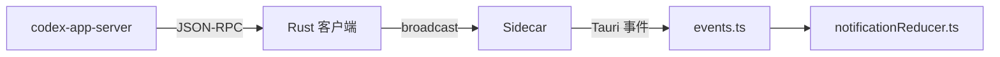
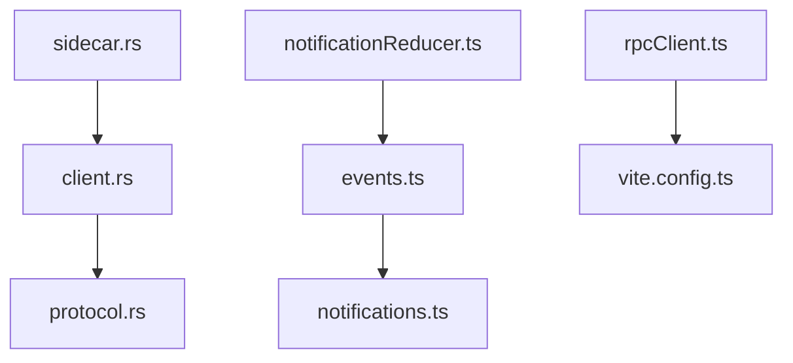

# WebSocket 实时通信

<cite>
**本文引用的文件**
- [client.rs](file://src-tauri/src/codex/client.rs)
- [sidecar.rs](file://src-tauri/src/codex/sidecar.rs)
- [protocol.rs](file://src-tauri/src/codex/protocol.rs)
- [rpcClient.ts](file://frontend/app/devbridge/rpcClient.ts)
- [events.ts](file://frontend/app/bridge/events.ts)
- [notifications.ts](file://frontend/src/protocol/notifications.ts)
- [notificationReducer.ts](file://frontend/app/state/notificationReducer.ts)
- [App.tsx](file://frontend/app/App.tsx)
- [vite.config.ts](file://frontend/vite.config.ts)
</cite>

## 目录
1. [简介](#简介)
2. [项目结构](#项目结构)
3. [核心组件](#核心组件)
4. [架构总览](#架构总览)
5. [详细组件分析](#详细组件分析)
6. [依赖关系分析](#依赖关系分析)
7. [性能考量](#性能考量)
8. [故障排除指南](#故障排除指南)
9. [结论](#结论)
10. [附录](#附录)

## 简介
本文件系统性说明 Codex-Tauri 的 WebSocket 实时通信机制，涵盖连接建立、维护与重连；事件数据结构与传输协议（JSON-RPC）；事件订阅/发布模式；前端事件监听器实现；连接状态管理、心跳与异常处理策略；并提供使用示例、优化技巧与调试排障方法。

## 项目结构
Codex-Tauri 在 Tauri 后端通过 sidecar 启动官方 codex-app-server，并以 WebSocket JSON-RPC 与其通信；前端通过两种通道接收事件：
- Tauri 事件桥：Rust 将服务端通知转发为 Tauri 事件，前端统一订阅并分发到业务 reducer。
- 开发期浏览器直连：开发模式下，前端通过 Vite 代理直接以 WebSocket 连接引擎，用于快速迭代。

```mermaid
graph TB
subgraph "前端"
FE_App["App.tsx"]
FE_Bridge["events.ts"]
FE_DevRPC["devbridge/rpcClient.ts"]
end
subgraph "Tauri 后端"
T_Sidecar["sidecar.rs"]
T_Client["client.rs"]
T_Protocol["protocol.rs"]
end
subgraph "外部服务"
Engine["codex-app-server<br/>WebSocket(JSON-RPC)"]
end
FE_App --> FE_Bridge
FE_DevRPC --> Engine
FE_Bridge --> T_Sidecar
T_Sidecar --> T_Client
T_Client --> Engine
T_Protocol < --> T_Client
```

图表来源
- [App.tsx:15-46](file://frontend/app/App.tsx#L15-L46)
- [events.ts:145-159](file://frontend/app/bridge/events.ts#L145-L159)
- [rpcClient.ts:150-189](file://frontend/app/devbridge/rpcClient.ts#L150-L189)
- [sidecar.rs:31-125](file://src-tauri/src/codex/sidecar.rs#L31-L125)
- [client.rs:37-94](file://src-tauri/src/codex/client.rs#L37-L94)
- [protocol.rs:103-156](file://src-tauri/src/codex/protocol.rs#L103-L156)

章节来源
- [App.tsx:15-46](file://frontend/app/App.tsx#L15-L46)
- [events.ts:145-159](file://frontend/app/bridge/events.ts#L145-L159)
- [rpcClient.ts:150-189](file://frontend/app/devbridge/rpcClient.ts#L150-L189)
- [sidecar.rs:31-125](file://src-tauri/src/codex/sidecar.rs#L31-L125)
- [client.rs:37-94](file://src-tauri/src/codex/client.rs#L37-L94)
- [protocol.rs:103-156](file://src-tauri/src/codex/protocol.rs#L103-L156)

## 核心组件
- Rust 客户端（client.rs）：封装 WebSocket JSON-RPC 请求/响应、通知广播、初始化握手、超时控制、待处理请求映射。
- Sidecar 管理（sidecar.rs）：负责启动/探测/安装 sidecar 二进制、重试连接、稳定事件广播、关闭流程。
- 协议定义（protocol.rs）：定义 JSON-RPC 消息结构、方法名常量、解析逻辑。
- 前端事件桥（events.ts）：统一订阅所有通知与服务器请求，转换为应用层事件。
- 前端开发 RPC（rpcClient.ts）：浏览器直连引擎，实现握手、请求、响应、重连。
- 通知类型与覆盖（notifications.ts + notificationReducer.ts）：生成式通知方法清单与处理器，保证覆盖率。

章节来源
- [client.rs:1-234](file://src-tauri/src/codex/client.rs#L1-L234)
- [sidecar.rs:1-276](file://src-tauri/src/codex/sidecar.rs#L1-L276)
- [protocol.rs:1-207](file://src-tauri/src/codex/protocol.rs#L1-L207)
- [events.ts:1-172](file://frontend/app/bridge/events.ts#L1-L172)
- [rpcClient.ts:1-230](file://frontend/app/devbridge/rpcClient.ts#L1-L230)
- [notifications.ts:1-222](file://frontend/src/protocol/notifications.ts#L1-L222)
- [notificationReducer.ts:1-446](file://frontend/app/state/notificationReducer.ts#L1-L446)

## 架构总览
系统采用“后端侧车 + 前端双通道”的架构：
- 生产环境：前端通过 Tauri 事件桥接收由 Rust 转发的服务端通知与请求。
- 开发环境：前端通过 Vite 代理直连引擎 WebSocket，便于本地调试。



图表来源
- [client.rs:96-133](file://src-tauri/src/codex/client.rs#L96-L133)
- [sidecar.rs:146-168](file://src-tauri/src/codex/sidecar.rs#L146-L168)
- [events.ts:145-159](file://frontend/app/bridge/events.ts#L145-L159)

章节来源
- [client.rs:96-133](file://src-tauri/src/codex/client.rs#L96-L133)
- [sidecar.rs:146-168](file://src-tauri/src/codex/sidecar.rs#L146-L168)
- [events.ts:145-159](file://frontend/app/bridge/events.ts#L145-L159)

## 详细组件分析

### Rust WebSocket 客户端（client.rs）
- 连接与读写分离：使用 tokio_tungstenite 建立连接，拆分读写任务；写任务通过命令通道发送文本帧；读任务循环读取消息并分派。
- 初始化握手：发送 initialize 请求，等待响应后发送 initialized 通知（无 params），完成握手。
- 请求/响应：为每个请求分配唯一 id，维护 pending map；响应到达时根据 id 完成对应 oneshot 通道。
- 通知广播：所有通知和服务器请求通过 broadcast channel 广播给多个订阅者。
- 超时与错误：initialize 与 request 均设置超时；连接关闭时置位 connected=false。



图表来源
- [client.rs:23-30](file://src-tauri/src/codex/client.rs#L23-L30)
- [client.rs:37-94](file://src-tauri/src/codex/client.rs#L37-L94)
- [client.rs:148-199](file://src-tauri/src/codex/client.rs#L148-L199)

章节来源
- [client.rs:37-94](file://src-tauri/src/codex/client.rs#L37-L94)
- [client.rs:148-199](file://src-tauri/src/codex/client.rs#L148-L199)

### Sidecar 管理与连接重试（sidecar.rs）
- 进程管理：启动 codex-app-server，支持多调用入口探测与参数适配，隐藏控制台窗口。
- 连接重试：冷启动时短间隔多次尝试连接，避免端口未就绪导致的瞬时失败。
- 事件稳定化：将客户端的广播转发到 EngineHandle 的稳定广播通道，屏蔽客户端重连带来的抖动。
- 生命周期：提供 rpc、respond、initialize_meta、shutdown 等接口。



图表来源
- [sidecar.rs:31-125](file://src-tauri/src/codex/sidecar.rs#L31-L125)
- [sidecar.rs:188-222](file://src-tauri/src/codex/sidecar.rs#L188-L222)
- [sidecar.rs:146-168](file://src-tauri/src/codex/sidecar.rs#L146-L168)

章节来源
- [sidecar.rs:31-125](file://src-tauri/src/codex/sidecar.rs#L31-L125)
- [sidecar.rs:188-222](file://src-tauri/src/codex/sidecar.rs#L188-L222)
- [sidecar.rs:146-168](file://src-tauri/src/codex/sidecar.rs#L146-L168)

### 协议与消息格式（protocol.rs）
- JSON-RPC 2.0 风格：请求包含 id/method/params；响应包含 id/result 或 id/error；通知包含 method/params。
- 服务器→客户端请求：如审批、用户输入、elicitation，需按 id 回复结果。
- 解析规则：根据字段组合区分 Response/Notification/Request。



图表来源
- [protocol.rs:103-156](file://src-tauri/src/codex/protocol.rs#L103-L156)
- [protocol.rs:158-198](file://src-tauri/src/codex/protocol.rs#L158-L198)

章节来源
- [protocol.rs:103-156](file://src-tauri/src/codex/protocol.rs#L103-L156)
- [protocol.rs:158-198](file://src-tauri/src/codex/protocol.rs#L158-L198)

### 前端事件桥（events.ts）
- 统一入口：onNotification/onServerRequest 注册处理器；startEventBridge 一次性绑定所有通知与两类服务器请求通道。
- 通道命名：将方法中的 / 与 . 替换为 -，形成 Tauri 事件名（如 codex:thread/status/changed → codex:thread-status-changed）。
- 健壮性：单个通道绑定失败不影响其他通道；处理器异常被捕获并记录。



图表来源
- [events.ts:23-30](file://frontend/app/bridge/events.ts#L23-L30)
- [events.ts:145-159](file://frontend/app/bridge/events.ts#L145-L159)

章节来源
- [events.ts:23-30](file://frontend/app/bridge/events.ts#L23-L30)
- [events.ts:145-159](file://frontend/app/bridge/events.ts#L145-L159)

### 前端开发期直连（rpcClient.ts）
- 直连 URL：默认通过 Vite 代理 /appserver 路径连接，可 ?engine= 覆盖。
- 握手：initialize → response → initialized（无 params）。
- 请求/响应：带 id 的请求，120s 超时；服务器请求路由到特定频道（approval/user-input/server-request-*）。
- 重连：连接关闭后延迟重连，清空 pending 并重置状态。



图表来源
- [rpcClient.ts:43-50](file://frontend/app/devbridge/rpcClient.ts#L43-L50)
- [rpcClient.ts:70-101](file://frontend/app/devbridge/rpcClient.ts#L70-L101)
- [rpcClient.ts:150-189](file://frontend/app/devbridge/rpcClient.ts#L150-L189)

章节来源
- [rpcClient.ts:70-101](file://frontend/app/devbridge/rpcClient.ts#L70-L101)
- [rpcClient.ts:150-189](file://frontend/app/devbridge/rpcClient.ts#L150-L189)

### 事件订阅与发布模式
- 后端：Rust 客户端通过 broadcast 将通知与服务器请求广播给所有订阅者；Sidecar 再转发到稳定的 EngineHandle 广播通道。
- 前端：Tauri 事件桥集中订阅所有通知方法，并将事件派发至业务 reducer；服务器请求通过固定频道（approval/user-input）分发。
- 协议驱动：NOTIFICATION_METHODS 来自生成文件，确保新增方法自动接入。



图表来源
- [client.rs:143-146](file://src-tauri/src/codex/client.rs#L143-L146)
- [sidecar.rs:146-168](file://src-tauri/src/codex/sidecar.rs#L146-L168)
- [events.ts:145-159](file://frontend/app/bridge/events.ts#L145-L159)
- [notifications.ts:11-95](file://frontend/src/protocol/notifications.ts#L11-L95)

章节来源
- [client.rs:143-146](file://src-tauri/src/codex/client.rs#L143-L146)
- [sidecar.rs:146-168](file://src-tauri/src/codex/sidecar.rs#L146-L168)
- [events.ts:145-159](file://frontend/app/bridge/events.ts#L145-L159)
- [notifications.ts:11-95](file://frontend/src/protocol/notifications.ts#L11-L95)

### 连接状态管理、心跳检测与异常处理
- 连接状态：
  - Rust：AtomicBool 标记 connected；Sidecar 暴露 is_running/is_connected。
  - 前端：devbridge 维护 connected 标志；Tauri 桥通过事件可用性间接反映连接。
- 心跳检测：
  - 代码库中未发现显式心跳帧；可靠性通过超时与重连保障。
- 异常处理：
  - 请求超时：initialize 10s、request 120s。
  - 连接关闭：清理 pending、触发重连。
  - 单通道失败不阻断整体桥接。

章节来源
- [client.rs:19-21](file://src-tauri/src/codex/client.rs#L19-L21)
- [client.rs:121-133](file://src-tauri/src/codex/client.rs#L121-L133)
- [client.rs:161-169](file://src-tauri/src/codex/client.rs#L161-L169)
- [rpcClient.ts:22-24](file://frontend/app/devbridge/rpcClient.ts#L22-L24)
- [rpcClient.ts:62-68](file://frontend/app/devbridge/rpcClient.ts#L62-L68)
- [events.ts:95-113](file://frontend/app/bridge/events.ts#L95-L113)

### 具体使用示例与最佳实践
- 发起请求（Rust）：使用 client.request(method, params)，注意超时与错误处理。
- 响应服务器请求（Rust）：使用 respond(id, result) 回复审批/用户输入等。
- 订阅通知（前端）：调用 onNotification(handler) 并在 App 根组件中启动。
- 开发期直连：通过 devbridge/rpcClient.ts 的 rpcRequest 与 rpcRespond 进行交互。
- 性能优化：
  - 批量订阅：startEventBridge 一次性绑定所有通知，减少重复开销。
  - 广播容量：合理设置 broadcast 容量以避免丢帧。
  - 超时配置：根据业务调整 initialize/request 超时。
  - 重连退避：前端使用固定延迟，可按需改为指数退避。

章节来源
- [client.rs:148-199](file://src-tauri/src/codex/client.rs#L148-L199)
- [events.ts:145-159](file://frontend/app/bridge/events.ts#L145-L159)
- [rpcClient.ts:201-229](file://frontend/app/devbridge/rpcClient.ts#L201-L229)
- [App.tsx:15-46](file://frontend/app/App.tsx#L15-L46)

## 依赖关系分析
- 模块耦合：
  - sidecar.rs 依赖 client.rs 与 protocol.rs。
  - events.ts 依赖生成的 NOTIFICATION_METHODS 与 SERVER_REQUEST_METHODS。
  - notificationReducer.ts 依赖 events.ts 的 NotificationEnvelope。
- 外部依赖：
  - tokio_tungstenite（Rust WebSocket）。
  - @tauri-apps/api/event（前端事件 API）。
  - Vite 开发代理（前端直连引擎）。



图表来源
- [sidecar.rs:1-276](file://src-tauri/src/codex/sidecar.rs#L1-L276)
- [client.rs:1-234](file://src-tauri/src/codex/client.rs#L1-L234)
- [protocol.rs:1-207](file://src-tauri/src/codex/protocol.rs#L1-L207)
- [events.ts:1-172](file://frontend/app/bridge/events.ts#L1-L172)
- [notifications.ts:1-222](file://frontend/src/protocol/notifications.ts#L1-L222)
- [notificationReducer.ts:1-446](file://frontend/app/state/notificationReducer.ts#L1-L446)
- [rpcClient.ts:1-230](file://frontend/app/devbridge/rpcClient.ts#L1-L230)
- [vite.config.ts:15-31](file://frontend/vite.config.ts#L15-L31)

章节来源
- [sidecar.rs:1-276](file://src-tauri/src/codex/sidecar.rs#L1-L276)
- [client.rs:1-234](file://src-tauri/src/codex/client.rs#L1-L234)
- [protocol.rs:1-207](file://src-tauri/src/codex/protocol.rs#L1-L207)
- [events.ts:1-172](file://frontend/app/bridge/events.ts#L1-L172)
- [notifications.ts:1-222](file://frontend/src/protocol/notifications.ts#L1-L222)
- [notificationReducer.ts:1-446](file://frontend/app/state/notificationReducer.ts#L1-L446)
- [rpcClient.ts:1-230](file://frontend/app/devbridge/rpcClient.ts#L1-L230)
- [vite.config.ts:15-31](file://frontend/vite.config.ts#L15-L31)

## 性能考量
- 事件广播容量：Rust 端使用 broadcast channel，容量不足会丢弃旧消息；可根据吞吐调优。
- 超时与重连：合理的超时能避免阻塞 UI；重连频率影响资源占用。
- 前端事件分发：事件处理器应轻量，避免阻塞主线程；对高频 delta 事件建议节流或批处理。
- 开发代理：Vite 代理去除 Origin 头以满足引擎要求，避免升级失败。

[本节为通用指导，不直接分析具体文件]

## 故障排除指南
- 无法连接引擎：
  - 检查 sidecar 是否成功启动与监听地址；查看日志输出。
  - 确认端口未被占用；必要时重启应用。
- 握手失败：
  - 确认 initialize 请求已发送且收到响应；initialized 通知必须发送且无 params。
- 事件未到达前端：
  - 确认 startEventBridge 已调用；检查 NOTIFICATION_METHODS 是否包含目标方法。
  - 查看 Tauri 事件名是否正确转换（/ 与 . 替换为 -）。
- 请求超时：
  - 调整 REQUEST_TIMEOUT；检查网络与引擎负载。
- 连接断开重连：
  - 观察 onclose 回调是否触发；确认重连定时器是否工作。

章节来源
- [sidecar.rs:188-222](file://src-tauri/src/codex/sidecar.rs#L188-L222)
- [client.rs:121-133](file://src-tauri/src/codex/client.rs#L121-L133)
- [events.ts:145-159](file://frontend/app/bridge/events.ts#L145-L159)
- [rpcClient.ts:169-187](file://frontend/app/devbridge/rpcClient.ts#L169-L187)

## 结论
Codex-Tauri 的 WebSocket 实时通信基于 JSON-RPC，通过 Rust 客户端与 sidecar 管理连接与事件广播，前端通过 Tauri 事件桥或开发期直连消费事件。系统具备完善的握手、超时、重连与错误处理机制，并通过生成式协议表保证事件覆盖。遵循本文的最佳实践与排障步骤，可有效提升稳定性与可维护性。

## 附录
- 关键方法名参考：见 protocol.rs 中的常量定义。
- 通知方法清单：见 notifications.ts 的 NOTIFICATION_METHODS。
- 事件桥用法：见 events.ts 的 onNotification/onServerRequest/startEventBridge。
- 开发期直连：见 rpcClient.ts 的 rpcRequest/rpcRespond/engineConnected。