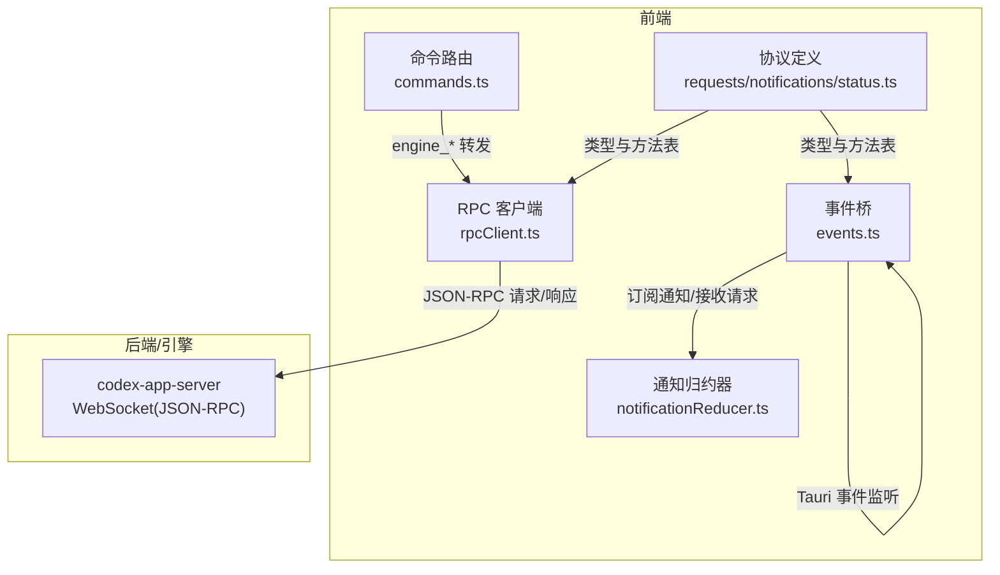
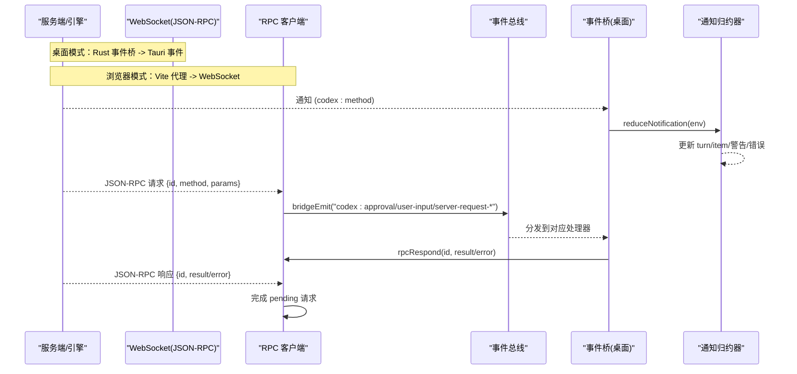
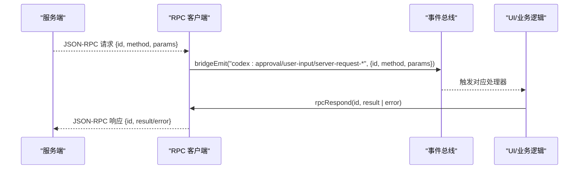
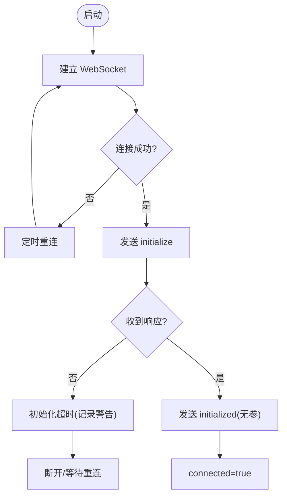
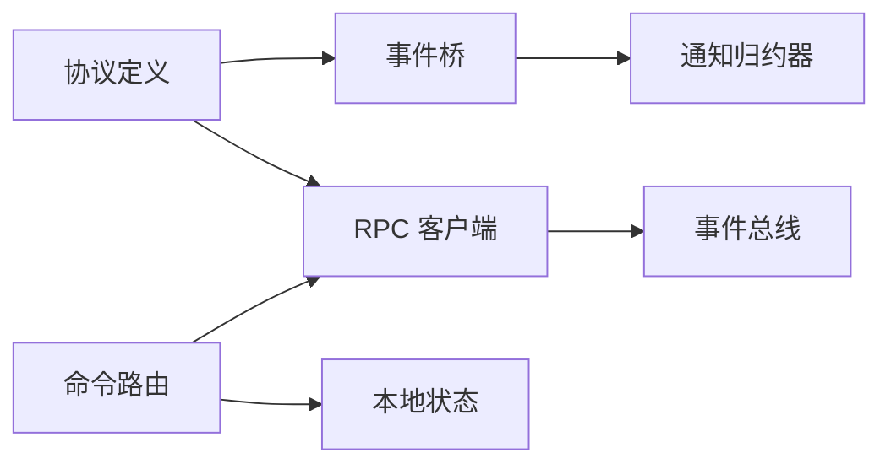

# 协议通信

<cite>
**本文引用的文件**
- [frontend/src/protocol/requests.ts](file://frontend/src/protocol/requests.ts)
- [frontend/src/protocol/notifications.ts](file://frontend/src/protocol/notifications.ts)
- [frontend/src/protocol/status.ts](file://frontend/src/protocol/status.ts)
- [frontend/app/bridge/events.ts](file://frontend/app/bridge/events.ts)
- [frontend/app/devbridge/rpcClient.ts](file://frontend/app/devbridge/rpcClient.ts)
- [frontend/app/devbridge/eventBus.ts](file://frontend/app/devbridge/eventBus.ts)
- [frontend/app/devbridge/tauri-event.ts](file://frontend/app/devbridge/tauri-event.ts)
- [frontend/app/devbridge/tauri-core.ts](file://frontend/app/devbridge/tauri-core.ts)
- [frontend/app/devbridge/commands.ts](file://frontend/app/devbridge/commands.ts)
- [frontend/app/state/notificationReducer.ts](file://frontend/app/state/notificationReducer.ts)
</cite>

## 目录
1. [简介](#简介)
2. [项目结构](#项目结构)
3. [核心组件](#核心组件)
4. [架构总览](#架构总览)
5. [详细组件分析](#详细组件分析)
6. [依赖关系分析](#依赖关系分析)
7. [性能考量](#性能考量)
8. [故障排查指南](#故障排查指南)
9. [结论](#结论)
10. [附录](#附录)

## 简介
本文件为 Codex-Tauri 前端协议通信系统的权威文档，聚焦以下主题：
- 前后端 IPC 通信机制（Tauri 事件桥与浏览器开发模式下的 WebSocket JSON-RPC）
- WebSocket 实时通信与事件驱动架构
- 请求-响应模式的实现、通知系统消息格式与状态同步
- TypeScript 类型定义、协议版本管理与向后兼容策略
- 错误处理、重试机制与连接状态管理
- 通信示例、调试技巧与性能优化建议
- 协议扩展指南与新消息类型的添加方法

## 项目结构
前端协议通信由“协议定义”“事件桥”“RPC 客户端”“命令路由”“通知归约器”等模块组成。在桌面模式下，Rust Tauri 通过事件通道将后端通知与服务器请求转发到前端；在浏览器开发模式下，通过 Vite 代理的 WebSocket 直接对接 codex-app-server，并以本地事件总线模拟 Tauri 事件语义。

图表来源
- [frontend/app/bridge/events.ts:1-172](file://frontend/app/bridge/events.ts#L1-L172)
- [frontend/app/devbridge/rpcClient.ts:1-230](file://frontend/app/devbridge/rpcClient.ts#L1-L230)
- [frontend/app/devbridge/commands.ts:1-683](file://frontend/app/devbridge/commands.ts#L1-L683)
- [frontend/src/protocol/requests.ts:1-50](file://frontend/src/protocol/requests.ts#L1-L50)
- [frontend/src/protocol/notifications.ts:1-222](file://frontend/src/protocol/notifications.ts#L1-L222)
- [frontend/src/protocol/status.ts:1-48](file://frontend/src/protocol/status.ts#L1-L48)

章节来源
- [frontend/app/bridge/events.ts:1-172](file://frontend/app/bridge/events.ts#L1-L172)
- [frontend/app/devbridge/rpcClient.ts:1-230](file://frontend/app/devbridge/rpcClient.ts#L1-L230)
- [frontend/app/devbridge/commands.ts:1-683](file://frontend/app/devbridge/commands.ts#L1-L683)
- [frontend/src/protocol/requests.ts:1-50](file://frontend/src/protocol/requests.ts#L1-L50)
- [frontend/src/protocol/notifications.ts:1-222](file://frontend/src/protocol/notifications.ts#L1-L222)
- [frontend/src/protocol/status.ts:1-48](file://frontend/src/protocol/status.ts#L1-L48)

## 核心组件
- 协议定义层
  - 通知方法清单、实验性通知白名单、方法到 Rust 变体名映射
  - 服务器→客户端请求方法清单、审批/用户输入分类
  - 统一的状态词表（项状态、轮次阶段）
- 事件桥（桌面模式）
  - 基于 Tauri 事件 API 监听所有通知方法，并将服务器请求路由到固定频道
  - 提供 onNotification/onServerRequest 订阅接口
- RPC 客户端（浏览器开发模式）
  - 通过 WebSocket 与 codex-app-server 建立连接，执行三步握手
  - 维护 pending 请求表、超时控制、自动重连
  - 将服务器→客户端请求按规则分发到事件总线
- 命令路由（浏览器开发模式）
  - 将 Tauri shell 命令表面（engine_*、store_*、plugin_*）转发到 RPC 或本地存储
  - 对无法实现的命令进行诚实拒绝
- 通知归约器
  - 将每条通知转换为 UI 状态变更（turn/item 生命周期、流式增量、警告/错误）
  - 未处理的方法记录为告警，保证可观测性

章节来源
- [frontend/src/protocol/notifications.ts:1-222](file://frontend/src/protocol/notifications.ts#L1-L222)
- [frontend/src/protocol/requests.ts:1-50](file://frontend/src/protocol/requests.ts#L1-L50)
- [frontend/src/protocol/status.ts:1-48](file://frontend/src/protocol/status.ts#L1-L48)
- [frontend/app/bridge/events.ts:1-172](file://frontend/app/bridge/events.ts#L1-L172)
- [frontend/app/devbridge/rpcClient.ts:1-230](file://frontend/app/devbridge/rpcClient.ts#L1-L230)
- [frontend/app/devbridge/commands.ts:1-683](file://frontend/app/devbridge/commands.ts#L1-L683)
- [frontend/app/state/notificationReducer.ts:1-446](file://frontend/app/state/notificationReducer.ts#L1-L446)

## 架构总览
下图展示了从后端通知/请求到前端状态更新的端到端流程，涵盖桌面与浏览器两种运行模式。

图表来源
- [frontend/app/bridge/events.ts:1-172](file://frontend/app/bridge/events.ts#L1-L172)
- [frontend/app/devbridge/rpcClient.ts:1-230](file://frontend/app/devbridge/rpcClient.ts#L1-L230)
- [frontend/app/devbridge/eventBus.ts:1-47](file://frontend/app/devbridge/eventBus.ts#L1-L47)
- [frontend/app/state/notificationReducer.ts:1-446](file://frontend/app/state/notificationReducer.ts#L1-L446)

## 详细组件分析

### 协议定义层（TypeScript 类型与常量）
- 通知方法集合与实验性方法白名单，用于构建监听与校验
- 服务器→客户端请求方法集合，并标注审批/用户输入两类
- 项状态与轮次阶段的枚举集合，供 UI 渲染与状态机使用
- 生成方式：由脚本根据冻结的协议快照生成，确保前后端一致

要点
- 新增通知/请求时，需先更新协议源并重新生成 TS 文件
- 实验性功能通过 capabilities.experimentalApi 开关控制

章节来源
- [frontend/src/protocol/notifications.ts:1-222](file://frontend/src/protocol/notifications.ts#L1-L222)
- [frontend/src/protocol/requests.ts:1-50](file://frontend/src/protocol/requests.ts#L1-L50)
- [frontend/src/protocol/status.ts:1-48](file://frontend/src/protocol/status.ts#L1-L48)

### 事件桥（桌面模式）
职责
- 启动时根据 NOTIFICATION_METHODS 批量绑定 Tauri 事件监听
- 将服务器请求路由到固定频道（如 approval、user-input），并携带 id 以便回复
- 提供 onNotification/onServerRequest 订阅接口，统一封装 envelope

设计约束
- 事件名规范化：将 / 和 . 替换为 -，避免 Tauri 限制
- 未知请求方法会记录警告，不中断其他通道

章节来源
- [frontend/app/bridge/events.ts:1-172](file://frontend/app/bridge/events.ts#L1-L172)

### RPC 客户端（浏览器开发模式）
职责
- 建立 WebSocket 连接到 /appserver（经 Vite 代理）
- 执行三步握手：initialize → response → initialized（无参通知）
- 维护 pending 请求表，支持超时与错误传播
- 将服务器→客户端请求按规则分发到事件总线，UI 通过事件总线消费

关键行为
- 连接失败/关闭后定时重连
- 初始化超时仅记录警告，等待下次重连继续握手
- 请求超时抛出错误，调用方可捕获并重试

章节来源
- [frontend/app/devbridge/rpcClient.ts:1-230](file://frontend/app/devbridge/rpcClient.ts#L1-L230)

### 命令路由（浏览器开发模式）
职责
- 将 Tauri shell 命令表面（engine_*、store_*、plugin_*）映射到具体实现
- engine_*：转发到 RPC 客户端，并对返回结果做扁平化/包装以对齐桌面行为
- store_*：读写 localStorage 中的 shell state 镜像
- plugin_*：在不具备能力的场景下给出诚实拒绝或浏览器降级

注意
- 市场相关命令在浏览器模式下不可用，会抛出错误
- 部分能力（如进程、文件系统）通过虚拟 FS 或通知流模拟

章节来源
- [frontend/app/devbridge/commands.ts:1-683](file://frontend/app/devbridge/commands.ts#L1-L683)

### 通知归约器（状态同步）
职责
- 将每条通知转换为 turn/item 状态变更、流式增量、警告/错误
- 区分“环境型通知”（不直接渲染）与“可见通知”（影响 UI）
- 对未处理的通知记录告警，保证覆盖率可测

典型路径
- turn/started → 开始一轮
- item/started → 创建项
- item/* delta → 追加文本/输出
- item/completed → 完成项并设置状态
- error/warning → 设置错误或推入警告队列

章节来源
- [frontend/app/state/notificationReducer.ts:1-446](file://frontend/app/state/notificationReducer.ts#L1-L446)

### 浏览器事件总线与 Tauri 别名
- eventBus：实现 listen/emit，模拟 Tauri 事件语义，供 devbridge 使用
- tauri-event：将 @tauri-apps/api/event 的 listen/emit 别名到 eventBus
- tauri-core：将 @tauri-apps/api/core 的 invoke 别名到命令路由

作用
- 使同一份前端代码在桌面与浏览器模式下共用相同的事件与命令入口

章节来源
- [frontend/app/devbridge/eventBus.ts:1-47](file://frontend/app/devbridge/eventBus.ts#L1-L47)
- [frontend/app/devbridge/tauri-event.ts:1-23](file://frontend/app/devbridge/tauri-event.ts#L1-L23)
- [frontend/app/devbridge/tauri-core.ts:1-24](file://frontend/app/devbridge/tauri-core.ts#L1-L24)

### 请求-响应时序（审批/用户输入/通用请求）

图表来源
- [frontend/app/devbridge/rpcClient.ts:103-148](file://frontend/app/devbridge/rpcClient.ts#L103-L148)
- [frontend/app/devbridge/rpcClient.ts:223-229](file://frontend/app/devbridge/rpcClient.ts#L223-L229)
- [frontend/app/devbridge/eventBus.ts:36-46](file://frontend/app/devbridge/eventBus.ts#L36-L46)

### 连接与握手流程

图表来源
- [frontend/app/devbridge/rpcClient.ts:70-101](file://frontend/app/devbridge/rpcClient.ts#L70-L101)
- [frontend/app/devbridge/rpcClient.ts:150-189](file://frontend/app/devbridge/rpcClient.ts#L150-L189)

## 依赖关系分析
- 事件桥依赖协议定义（NOTIFICATION_METHODS/SERVER_REQUEST_METHODS）
- RPC 客户端依赖事件总线（devbridge 模式）
- 命令路由依赖 RPC 客户端与本地状态（浏览器模式）
- 通知归约器依赖事件桥的 envelope 与协议状态词表

图表来源
- [frontend/src/protocol/notifications.ts:1-222](file://frontend/src/protocol/notifications.ts#L1-L222)
- [frontend/src/protocol/requests.ts:1-50](file://frontend/src/protocol/requests.ts#L1-L50)
- [frontend/app/bridge/events.ts:1-172](file://frontend/app/bridge/events.ts#L1-L172)
- [frontend/app/devbridge/rpcClient.ts:1-230](file://frontend/app/devbridge/rpcClient.ts#L1-L230)
- [frontend/app/devbridge/eventBus.ts:1-47](file://frontend/app/devbridge/eventBus.ts#L1-L47)
- [frontend/app/devbridge/commands.ts:1-683](file://frontend/app/devbridge/commands.ts#L1-L683)
- [frontend/app/state/notificationReducer.ts:1-446](file://frontend/app/state/notificationReducer.ts#L1-L446)

章节来源
- [frontend/app/bridge/events.ts:1-172](file://frontend/app/bridge/events.ts#L1-L172)
- [frontend/app/devbridge/rpcClient.ts:1-230](file://frontend/app/devbridge/rpcClient.ts#L1-L230)
- [frontend/app/devbridge/commands.ts:1-683](file://frontend/app/devbridge/commands.ts#L1-L683)
- [frontend/app/state/notificationReducer.ts:1-446](file://frontend/app/state/notificationReducer.ts#L1-L446)

## 性能考量
- 批量监听：事件桥一次性并行绑定所有通知通道，减少启动开销
- 流式增量：item/* delta 类通知采用增量追加，避免全量重建
- 超时与退避：请求超时与重连延迟避免雪崩与频繁重试
- 最小化序列化：envelope 仅包含必要字段，降低网络与解析成本
- 本地缓存：浏览器模式下命令路由对配置/状态进行本地持久化，减少往返

[本节为通用指导，无需特定文件引用]

## 故障排查指南
常见问题与定位
- 连接失败：检查 WebSocket 地址与代理配置；查看重连日志
- 握手超时：确认服务端已就绪；观察 initialize 超时提示
- 请求超时：检查服务端是否响应；必要时增加超时或重试
- 未知通知方法：事件桥会记录警告；需在归约器中补充处理
- 命令不可用：浏览器模式下部分命令被拒绝，属预期行为

建议步骤
- 启用控制台日志，关注 [devbridge]/[events] 前缀
- 使用浏览器开发者工具监控 WebSocket 帧
- 逐步缩小问题范围：先验证连接与握手，再验证请求/响应

章节来源
- [frontend/app/devbridge/rpcClient.ts:85-99](file://frontend/app/devbridge/rpcClient.ts#L85-L99)
- [frontend/app/devbridge/rpcClient.ts:164-189](file://frontend/app/devbridge/rpcClient.ts#L164-L189)
- [frontend/app/bridge/events.ts:119-139](file://frontend/app/bridge/events.ts#L119-L139)
- [frontend/app/state/notificationReducer.ts:437-443](file://frontend/app/state/notificationReducer.ts#L437-L443)

## 结论
Codex-Tauri 的前端协议通信系统通过“协议定义 + 事件桥 + RPC 客户端 + 命令路由 + 通知归约器”的分层设计，实现了跨平台一致的 IPC 与实时通信体验。其关键点包括：
- 严格的协议类型与常量保障一致性
- 事件驱动的异步消息模型
- 健壮的连接与错误处理
- 可扩展的通知处理与状态同步
- 浏览器与桌面双模式的平滑兼容

## 附录

### 通信示例（说明性）
- 发起会话：调用 engine.new_session，内部转发 thread/start，收到 turn/started 后 UI 进入新轮次
- 发送消息：调用 engine.send_message，内部转发 turn/start，后续通过 item/* delta 流式渲染
- 审批交互：服务端推送 approval 请求，UI 展示决策按钮，调用 resolve_approval 通过 rpcRespond 回写决定
- 文件变更：收到 item/fileChange/outputDelta 与 patchUpdated，合并 diff 并高亮变更

[本节为概念性示例，不直接引用具体代码行]

### 调试技巧
- 在浏览器模式通过 ?engine=ws://... 指定直连地址，绕过代理
- 监听 codex:* 事件，观察原始消息结构
- 在命令路由中添加临时日志，追踪参数与返回值
- 使用通知覆盖率校验脚本，确保新增通知均有处理

章节来源
- [frontend/app/devbridge/rpcClient.ts:43-50](file://frontend/app/devbridge/rpcClient.ts#L43-L50)
- [frontend/app/devbridge/eventBus.ts:21-46](file://frontend/app/devbridge/eventBus.ts#L21-L46)
- [frontend/app/devbridge/commands.ts:669-683](file://frontend/app/devbridge/commands.ts#L669-L683)

### 性能优化建议
- 合并高频小消息：在 UI 层节流渲染
- 按需订阅：仅在需要时注册事件监听
- 避免重复计算：对长列表使用稳定 key 与增量更新
- 合理设置超时：根据业务复杂度调整 REQUEST_TIMEOUT_MS

[本节为通用指导，无需特定文件引用]

### 协议扩展指南与新消息类型添加方法
步骤
- 在后端协议源中新增通知/请求方法
- 重新生成 TypeScript 协议定义（requests/notifications/status）
- 在事件桥中无需额外改动即可自动监听新通知
- 在通知归约器中为新通知添加处理分支，避免“未处理”告警
- 若新增服务器→客户端请求，确保命令路由能正确转发与响应

注意事项
- 实验性功能需开启 experimentalApi 能力
- 保持方法命名规范，避免破坏现有通道映射
- 对破坏性变更进行版本迁移与兼容性测试

章节来源
- [frontend/src/protocol/notifications.ts:1-222](file://frontend/src/protocol/notifications.ts#L1-L222)
- [frontend/src/protocol/requests.ts:1-50](file://frontend/src/protocol/requests.ts#L1-L50)
- [frontend/app/bridge/events.ts:145-159](file://frontend/app/bridge/events.ts#L145-L159)
- [frontend/app/state/notificationReducer.ts:437-443](file://frontend/app/state/notificationReducer.ts#L437-L443)