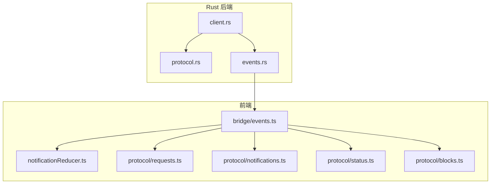
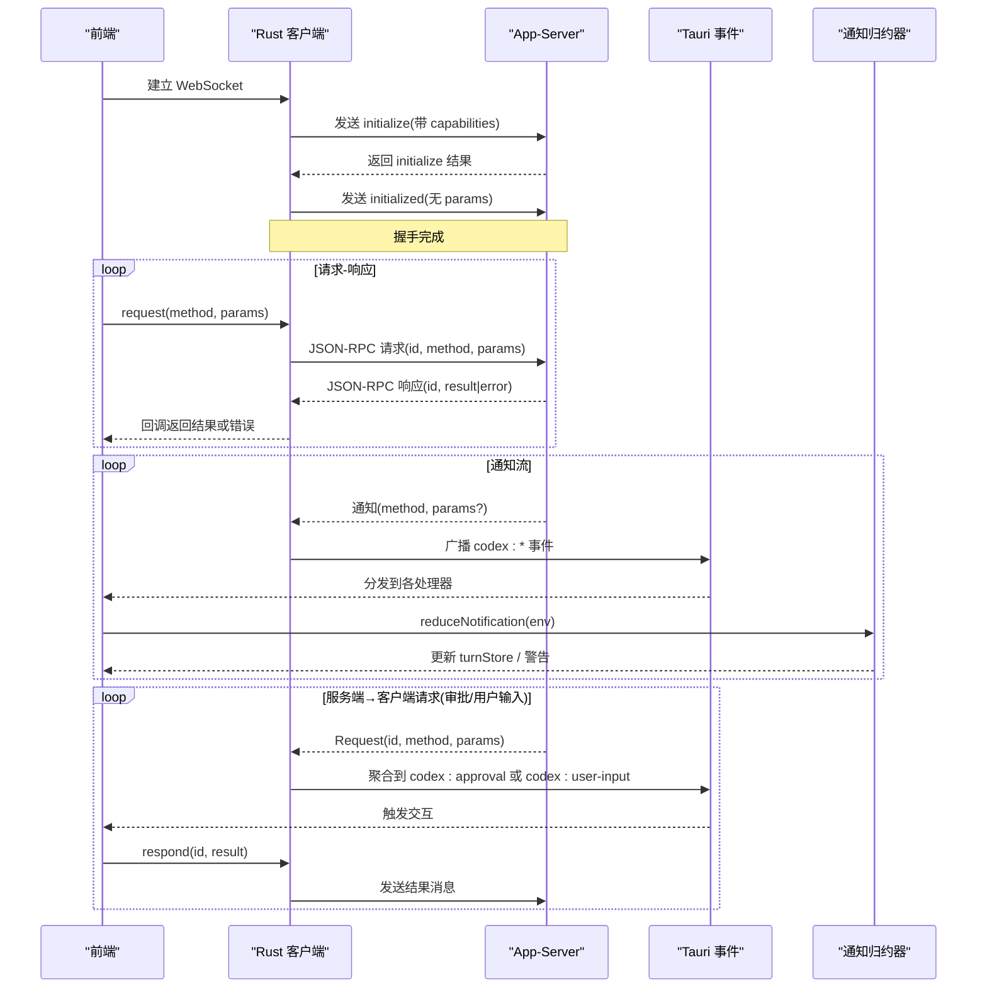
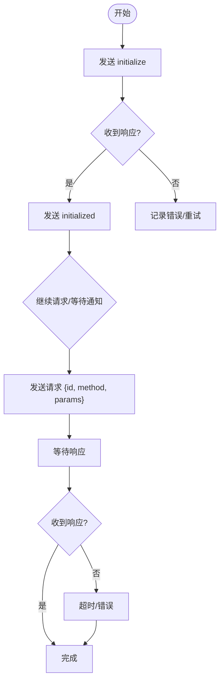
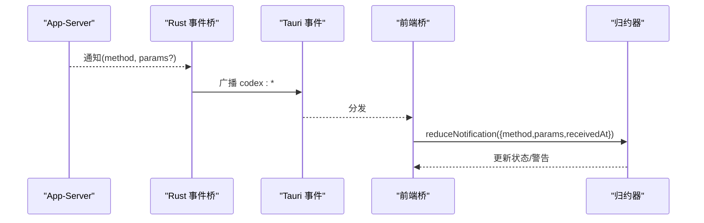
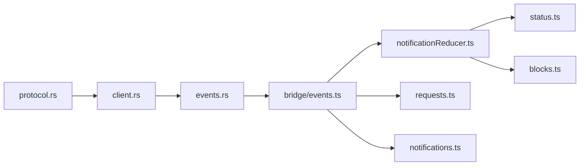

# 消息协议定义

<cite>
**本文引用的文件**
- [src-tauri/src/codex/protocol.rs](file://src-tauri/src/codex/protocol.rs)
- [src-tauri/src/codex/client.rs](file://src-tauri/src/codex/client.rs)
- [src-tauri/src/codex/events.rs](file://src-tauri/src/codex/events.rs)
- [frontend/src/protocol/requests.ts](file://frontend/src/protocol/requests.ts)
- [frontend/src/protocol/notifications.ts](file://frontend/src/protocol/notifications.ts)
- [frontend/src/protocol/status.ts](file://frontend/src/protocol/status.ts)
- [frontend/src/protocol/blocks.ts](file://frontend/src/protocol/blocks.ts)
- [frontend/app/bridge/events.ts](file://frontend/app/bridge/events.ts)
- [frontend/app/state/notificationReducer.ts](file://frontend/app/state/notificationReducer.ts)
- [scripts/verify-protocol-usage.mjs](file://scripts/verify-protocol-usage.mjs)
- [scripts/verify-notification-coverage.mjs](file://scripts/verify-notification-coverage.mjs)
- [docs/RUST_BACKEND.md](file://docs/RUST_BACKEND.md)
- [docs/official-ui/APPSERVER-METHOD-INVENTORY-0.154.0.md](file://docs/official-ui/APPSERVER-METHOD-INVENTORY-0.154.0.md)
</cite>

## 目录
1. [简介](#简介)
2. [项目结构](#项目结构)
3. [核心组件](#核心组件)
4. [架构总览](#架构总览)
5. [详细组件分析](#详细组件分析)
6. [依赖关系分析](#依赖关系分析)
7. [性能与一致性](#性能与一致性)
8. [故障排查指南](#故障排查指南)
9. [结论](#结论)
10. [附录：API 参考与扩展指南](#附录api-参考与扩展指南)

## 简介
本文件为 Codex-Tauri 的消息协议定义文档，覆盖请求-响应协议、通知系统、状态同步与数据一致性、版本管理与向后兼容策略，并提供完整的 API 参考、数据类型定义与使用示例。该协议基于 JSON-RPC 风格，通过 WebSocket 与后端 app-server 通信；Rust 侧负责连接、握手、解析与事件桥接，前端侧负责订阅、分发与状态更新。

## 项目结构
- Rust 后端（src-tauri）
  - protocol.rs：定义 JSON-RPC 方法名、消息结构与解析器。
  - client.rs：WebSocket 客户端、initialize 握手、请求/通知/响应的收发与超时处理。
  - events.rs：将服务端消息映射为 Tauri 事件（codex:*），并聚合审批/用户输入等请求通道。
- 前端（frontend）
  - protocol/*：生成的协议常量与方法表（请求、通知、状态、块类型）。
  - bridge/events.ts：Tauri 事件桥，统一订阅所有通知与服务器请求，封装为标准化信封。
  - state/notificationReducer.ts：将所有通知归约到应用状态，保证 UI 仅由服务端驱动。
- 脚本与文档
  - verify-*：校验协议方法引用与覆盖率，确保新增方法必须被处理或显式声明。
  - RUST_BACKEND.md、APPSERVER-METHOD-INVENTORY-0.154.0.md：官方协议版本与清单。

图表来源
- [src-tauri/src/codex/protocol.rs:1-207](file://src-tauri/src/codex/protocol.rs#L1-L207)
- [src-tauri/src/codex/client.rs:1-234](file://src-tauri/src/codex/client.rs#L1-L234)
- [src-tauri/src/codex/events.rs:1-82](file://src-tauri/src/codex/events.rs#L1-L82)
- [frontend/app/bridge/events.ts:1-172](file://frontend/app/bridge/events.ts#L1-L172)
- [frontend/app/state/notificationReducer.ts:1-446](file://frontend/app/state/notificationReducer.ts#L1-L446)
- [frontend/src/protocol/requests.ts:1-50](file://frontend/src/protocol/requests.ts#L1-L50)
- [frontend/src/protocol/notifications.ts:1-222](file://frontend/src/protocol/notifications.ts#L1-L222)
- [frontend/src/protocol/status.ts:1-48](file://frontend/src/protocol/status.ts#L1-L48)
- [frontend/src/protocol/blocks.ts:1-87](file://frontend/src/protocol/blocks.ts#L1-L87)

章节来源
- [src-tauri/src/codex/protocol.rs:1-207](file://src-tauri/src/codex/protocol.rs#L1-L207)
- [src-tauri/src/codex/client.rs:1-234](file://src-tauri/src/codex/client.rs#L1-L234)
- [src-tauri/src/codex/events.rs:1-82](file://src-tauri/src/codex/events.rs#L1-L82)
- [frontend/app/bridge/events.ts:1-172](file://frontend/app/bridge/events.ts#L1-L172)
- [frontend/app/state/notificationReducer.ts:1-446](file://frontend/app/state/notificationReducer.ts#L1-L446)
- [frontend/src/protocol/requests.ts:1-50](file://frontend/src/protocol/requests.ts#L1-L50)
- [frontend/src/protocol/notifications.ts:1-222](file://frontend/src/protocol/notifications.ts#L1-L222)
- [frontend/src/protocol/status.ts:1-48](file://frontend/src/protocol/status.ts#L1-L48)
- [frontend/src/protocol/blocks.ts:1-87](file://frontend/src/protocol/blocks.ts#L1-L87)

## 核心组件
- JSON-RPC 消息模型
  - 请求：包含 id、method、可选 params。
  - 响应：包含 id、result 或 error。
  - 通知：包含 method、可选 params。
  - 服务端→客户端请求（如审批、用户输入）：以 Request 形式到达，需以结果消息回复对应 id。
- 客户端握手
  - initialize：携带客户端信息、能力标志（experimentalApi）。
  - initialized：成功响应后发送的通知。
- 事件桥
  - Rust 将通知映射为 codex:<method-with-dashes> 事件。
  - 审批/用户输入/elicitation 请求聚合到固定通道（codex:approval、codex:user-input）。
- 前端桥接与归约
  - 统一订阅所有通知，构造 NotificationEnvelope。
  - 将通知归约到 turnStore，保持 UI 仅由服务端驱动。

章节来源
- [src-tauri/src/codex/protocol.rs:103-156](file://src-tauri/src/codex/protocol.rs#L103-L156)
- [src-tauri/src/codex/client.rs:96-133](file://src-tauri/src/codex/client.rs#L96-L133)
- [src-tauri/src/codex/events.rs:45-81](file://src-tauri/src/codex/events.rs#L45-L81)
- [frontend/app/bridge/events.ts:32-47](file://frontend/app/bridge/events.ts#L32-L47)
- [frontend/app/state/notificationReducer.ts:189-446](file://frontend/app/state/notificationReducer.ts#L189-L446)

## 架构总览
下图展示从 WebSocket 连接到前端状态更新的端到端流程，包括握手、请求-响应、通知与事件桥。

图表来源
- [src-tauri/src/codex/client.rs:96-133](file://src-tauri/src/codex/client.rs#L96-L133)
- [src-tauri/src/codex/client.rs:148-194](file://src-tauri/src/codex/client.rs#L148-L194)
- [src-tauri/src/codex/events.rs:45-81](file://src-tauri/src/codex/events.rs#L45-L81)
- [frontend/app/bridge/events.ts:57-159](file://frontend/app/bridge/events.ts#L57-L159)
- [frontend/app/state/notificationReducer.ts:189-446](file://frontend/app/state/notificationReducer.ts#L189-L446)

## 详细组件分析

### 请求-响应协议规范
- 传输与格式
  - 传输：WebSocket 文本帧。
  - 格式：JSON-RPC 风格，不强制 jsonrpc 字段；id 可为字符串或整数。
- 握手
  - initialize：客户端发送，携带 clientInfo(name/title/version)、capabilities(experimentalApi)。
  - initialized：成功后客户端发送的无参通知。
- 通用请求
  - 客户端发起：{ id, method, params? }。
  - 服务端响应：{ id, result? | error? }。
- 服务端→客户端请求（审批/用户输入/elicitation）
  - 到达方式：Request(id, method, params)。
  - 回复方式：发送 { id, result } 的结果消息（无 jsonrpc 字段）。
  - 审批决策集合来自请求中的 availableDecisions；某些决策需回显服务端提供的修正载荷。
- 超时与错误
  - initialize 超时：10 秒。
  - 普通请求超时：120 秒。
  - 错误对象包含 code、message、data。

图表来源
- [src-tauri/src/codex/client.rs:96-133](file://src-tauri/src/codex/client.rs#L96-L133)
- [src-tauri/src/codex/client.rs:148-194](file://src-tauri/src/codex/client.rs#L148-L194)
- [src-tauri/src/codex/protocol.rs:103-156](file://src-tauri/src/codex/protocol.rs#L103-L156)

章节来源
- [src-tauri/src/codex/protocol.rs:1-207](file://src-tauri/src/codex/protocol.rs#L1-L207)
- [src-tauri/src/codex/client.rs:1-234](file://src-tauri/src/codex/client.rs#L1-L234)
- [docs/RUST_BACKEND.md:173-239](file://docs/RUST_BACKEND.md#L173-L239)

### 通知系统
- 方法列表
  - NOTIFICATION_METHODS：完整通知方法集（含 thread、turn、item、mcpServer、account、model 等）。
  - EXPERIMENTAL_NOTIFICATION_METHODS：受 experimentalApi 能力门控的通知。
- 事件映射
  - Rust 将通知映射为 codex:<method-with-dashes> 事件，params 作为 payload。
  - 审批/用户输入/elicitation 请求聚合到固定通道（codex:approval、codex:user-input）。
- 前端处理
  - bridge/events.ts 订阅所有通知，构造 NotificationEnvelope（method、params、receivedAt）。
  - notificationReducer.ts 将通知归约到 turnStore，未处理的已知方法会记录为警告而非静默丢弃。

图表来源
- [src-tauri/src/codex/events.rs:45-81](file://src-tauri/src/codex/events.rs#L45-L81)
- [frontend/app/bridge/events.ts:57-159](file://frontend/app/bridge/events.ts#L57-L159)
- [frontend/app/state/notificationReducer.ts:189-446](file://frontend/app/state/notificationReducer.ts#L189-L446)

章节来源
- [frontend/src/protocol/notifications.ts:1-222](file://frontend/src/protocol/notifications.ts#L1-L222)
- [src-tauri/src/codex/events.rs:1-82](file://src-tauri/src/codex/events.rs#L1-L82)
- [frontend/app/bridge/events.ts:1-172](file://frontend/app/bridge/events.ts#L1-L172)
- [frontend/app/state/notificationReducer.ts:1-446](file://frontend/app/state/notificationReducer.ts#L1-L446)

### 状态同步与数据一致性
- 单一数据源原则
  - UI 不本地模拟状态，所有可见状态均来自服务端通知。
  - 归约器集中处理通知，避免分散逻辑导致不一致。
- 幂等与顺序
  - 通知按到达顺序处理；对 item 的 started/completed/delta 进行有序更新。
  - 未知但已注册的方法会被记录为警告，便于发现遗漏。
- 能力门控
  - experimentalApi=true 时启用实验性通知；旧客户端可忽略未知方法并通过警告提示。

章节来源
- [frontend/app/bridge/events.ts:1-172](file://frontend/app/bridge/events.ts#L1-L172)
- [frontend/app/state/notificationReducer.ts:1-446](file://frontend/app/state/notificationReducer.ts#L1-L446)
- [src-tauri/src/codex/client.rs:96-133](file://src-tauri/src/codex/client.rs#L96-L133)

### 协议版本管理与向后兼容性
- 版本锚定
  - 协议常量注释指明与官方 app-server-protocol v0.154.0 保持一致。
  - 官方方法清单在 docs/official-ui/APPSERVER-METHOD-INVENTORY-0.154.0.md。
- 向后兼容策略
  - 客户端发送 experimentalApi=true 以启用实验特性。
  - 前端对未知方法采用“记录警告”策略，避免静默失败。
  - 生成脚本与 CI 校验确保新增方法必须有处理或显式声明。

章节来源
- [src-tauri/src/codex/protocol.rs:1-9](file://src-tauri/src/codex/protocol.rs#L1-L9)
- [docs/official-ui/APPSERVER-METHOD-INVENTORY-0.154.0.md:1-114](file://docs/official-ui/APPSERVER-METHOD-INVENTORY-0.154.0.md#L1-L114)
- [scripts/verify-notification-coverage.mjs:1-83](file://scripts/verify-notification-coverage.mjs#L1-L83)
- [scripts/verify-protocol-usage.mjs:1-154](file://scripts/verify-protocol-usage.mjs#L1-L154)

## 依赖关系分析
- Rust 层
  - protocol.rs 提供 RPC 方法常量与消息解析。
  - client.rs 依赖 protocol 实现握手、请求与通知分发。
  - events.rs 依赖 protocol 与 EngineHandle，将消息转为 Tauri 事件。
- 前端层
  - bridge/events.ts 依赖 protocol/requests.ts 与 protocol/notifications.ts 的方法表，动态绑定监听。
  - notificationReducer.ts 依赖 status.ts 与 blocks.ts 的类型与标签映射。
- 校验脚本
  - verify-protocol-usage.mjs：校验源码中协议方法引用是否存在于生成表。
  - verify-notification-coverage.mjs：确保每个通知都有处理或显式声明。

图表来源
- [src-tauri/src/codex/protocol.rs:1-207](file://src-tauri/src/codex/protocol.rs#L1-L207)
- [src-tauri/src/codex/client.rs:1-234](file://src-tauri/src/codex/client.rs#L1-L234)
- [src-tauri/src/codex/events.rs:1-82](file://src-tauri/src/codex/events.rs#L1-L82)
- [frontend/app/bridge/events.ts:1-172](file://frontend/app/bridge/events.ts#L1-L172)
- [frontend/app/state/notificationReducer.ts:1-446](file://frontend/app/state/notificationReducer.ts#L1-L446)
- [frontend/src/protocol/requests.ts:1-50](file://frontend/src/protocol/requests.ts#L1-L50)
- [frontend/src/protocol/notifications.ts:1-222](file://frontend/src/protocol/notifications.ts#L1-L222)
- [frontend/src/protocol/status.ts:1-48](file://frontend/src/protocol/status.ts#L1-L48)
- [frontend/src/protocol/blocks.ts:1-87](file://frontend/src/protocol/blocks.ts#L1-L87)

章节来源
- [scripts/verify-protocol-usage.mjs:1-154](file://scripts/verify-protocol-usage.mjs#L1-L154)
- [scripts/verify-notification-coverage.mjs:1-83](file://scripts/verify-notification-coverage.mjs#L1-L83)

## 性能与一致性
- 并发与背压
  - 通知通过 broadcast channel 扇出，容量有限；接收滞后时会记录日志并丢弃部分通知。
- 超时控制
  - initialize 与普通请求分别设置超时，避免阻塞。
- 归约效率
  - 通知归约器集中处理，减少重复逻辑；对未知方法记录警告，便于快速定位问题。
- 建议
  - 合理调整 broadcast 容量与消费者处理速度，避免堆积。
  - 对高频 delta 通知进行节流或合并渲染。

[本节为通用指导，无需特定文件来源]

## 故障排查指南
- 常见问题
  - 初始化超时：检查网络与服务端可用性，确认 capabilities 与客户端信息正确。
  - 请求超时：检查服务端负载与网络延迟，必要时调整超时。
  - 通知未处理：运行 verify-notification-coverage.mjs 检查缺失处理；查看 UI 警告。
  - 方法拼写错误：运行 verify-protocol-usage.mjs 检查未知方法引用。
- 调试步骤
  - 查看 Rust 日志（event bridge lagged、emit failed 等）。
  - 在前端控制台查看 [events] 相关错误与警告。
  - 核对 protocol.json 与前端方法表是否一致。

章节来源
- [src-tauri/src/codex/events.rs:12-43](file://src-tauri/src/codex/events.rs#L12-L43)
- [frontend/app/bridge/events.ts:69-87](file://frontend/app/bridge/events.ts#L69-L87)
- [scripts/verify-notification-coverage.mjs:1-83](file://scripts/verify-notification-coverage.mjs#L1-L83)
- [scripts/verify-protocol-usage.mjs:1-154](file://scripts/verify-protocol-usage.mjs#L1-L154)

## 结论
Codex-Tauri 的消息协议以 JSON-RPC 为基础，通过 WebSocket 实现可靠的请求-响应与通知机制。Rust 侧负责连接、握手与事件桥接，前端侧通过统一的桥接与归约器维护状态一致性。严格的生成与校验脚本确保协议演进的可维护性与向后兼容性。遵循本文档的规范与最佳实践，可安全地扩展新方法与类型。

[本节为总结，无需特定文件来源]

## 附录：API 参考与扩展指南

### API 参考
- 握手
  - initialize：客户端 → 服务端，参数包含 clientInfo、capabilities。
  - initialized：客户端 → 服务端，无参通知。
- 通用请求
  - 客户端 → 服务端：{ id, method, params? }。
  - 服务端 → 客户端：{ id, result? | error? }。
- 服务端→客户端请求（审批/用户输入/elicitation）
  - 到达：Request(id, method, params)。
  - 回复：{ id, result }。
  - 审批决策集合来自请求的 availableDecisions；某些决策需回显修正载荷。
- 通知
  - 方法集：NOTIFICATION_METHODS（含 thread、turn、item、mcpServer、account、model 等）。
  - 实验性通知：EXPERIMENTAL_NOTIFICATION_METHODS（需 experimentalApi=true）。
  - 事件名：codex:<method-with-dashes>，payload 为 params。
- 状态与块类型
  - 状态：ITEM_STATUSES、ACTIVE_STATUSES、FAILURE_STATUSES、TURN_PHASES。
  - 块类型：BLOCK_TYPES、TOOL_BLOCK_TYPES、TEXT_BLOCK_TYPES、PLAN_BLOCK_TYPES。

章节来源
- [src-tauri/src/codex/protocol.rs:1-207](file://src-tauri/src/codex/protocol.rs#L1-L207)
- [frontend/src/protocol/requests.ts:1-50](file://frontend/src/protocol/requests.ts#L1-L50)
- [frontend/src/protocol/notifications.ts:1-222](file://frontend/src/protocol/notifications.ts#L1-L222)
- [frontend/src/protocol/status.ts:1-48](file://frontend/src/protocol/status.ts#L1-L48)
- [frontend/src/protocol/blocks.ts:1-87](file://frontend/src/protocol/blocks.ts#L1-L87)
- [docs/RUST_BACKEND.md:173-239](file://docs/RUST_BACKEND.md#L173-L239)

### 使用示例
- 初始化流程
  - 建立 WebSocket，发送 initialize，收到响应后发送 initialized。
  - 参考路径：[client.rs:96-133](file://src-tauri/src/codex/client.rs#L96-L133)
- 发起请求
  - 调用 request(method, params)，等待超时内响应。
  - 参考路径：[client.rs:148-194](file://src-tauri/src/codex/client.rs#L148-L194)
- 订阅通知
  - 启动事件桥，自动订阅所有 NOTIFICATION_METHODS。
  - 参考路径：[bridge/events.ts:57-159](file://frontend/app/bridge/events.ts#L57-L159)
- 处理审批/用户输入
  - 监听 codex:approval 或 codex:user-input，收集用户决策后 respond(id, result)。
  - 参考路径：[events.rs:58-79](file://src-tauri/src/codex/events.rs#L58-L79)、[bridge/events.ts:115-139](file://frontend/app/bridge/events.ts#L115-L139)

[本节为示例说明，具体代码片段请参见上述路径]

### 扩展指南：添加新消息类型
- 新增通知方法
  - 在后端定义方法名（若为官方协议则保持与 v0.154.0 一致）。
  - 前端重新生成 protocol 表（gen-protocol-ts.py），确保 NOTIFICATION_METHODS 包含新方法。
  - 在 notificationReducer.ts 中添加处理分支，或将方法加入 AMBIENT_METHODS 显式声明。
  - 运行 verify-notification-coverage.mjs 确保覆盖率通过。
- 新增服务端→客户端请求
  - 在 requests.ts 中更新 SERVER_REQUEST_METHODS 与映射。
  - 在 events.rs 中确保聚合到固定通道（approval/user-input/elicitation）。
  - 在前端监听相应通道并实现 respond。
- 验证
  - 运行 verify-protocol-usage.mjs 检查方法引用合法性。
  - 运行 verify-notification-coverage.mjs 检查覆盖率。

章节来源
- [frontend/src/protocol/notifications.ts:1-222](file://frontend/src/protocol/notifications.ts#L1-L222)
- [frontend/src/protocol/requests.ts:1-50](file://frontend/src/protocol/requests.ts#L1-L50)
- [src-tauri/src/codex/events.rs:45-81](file://src-tauri/src/codex/events.rs#L45-L81)
- [frontend/app/state/notificationReducer.ts:128-183](file://frontend/app/state/notificationReducer.ts#L128-L183)
- [scripts/verify-notification-coverage.mjs:1-83](file://scripts/verify-notification-coverage.mjs#L1-L83)
- [scripts/verify-protocol-usage.mjs:1-154](file://scripts/verify-protocol-usage.mjs#L1-L154)