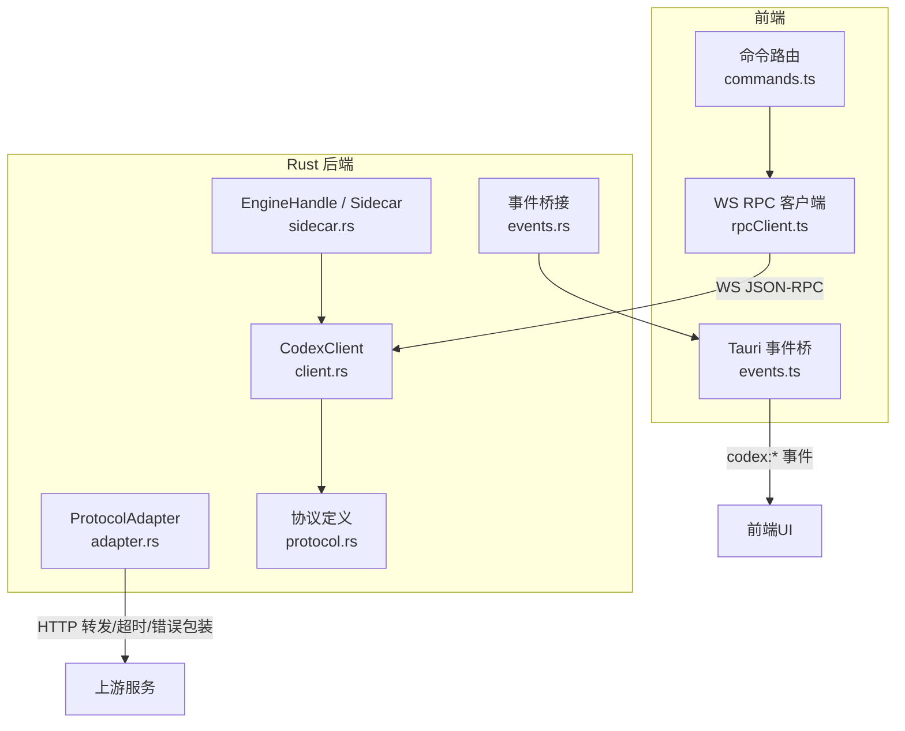
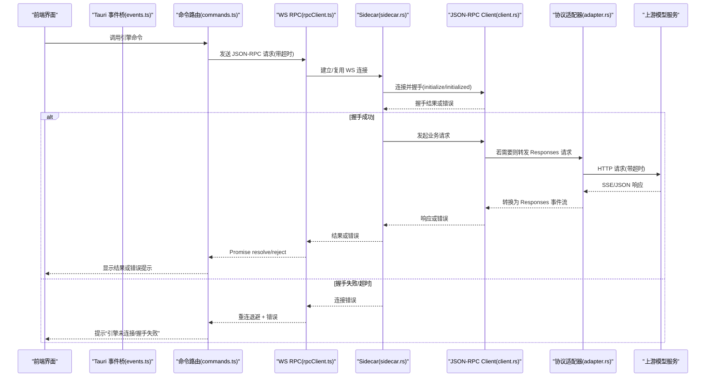
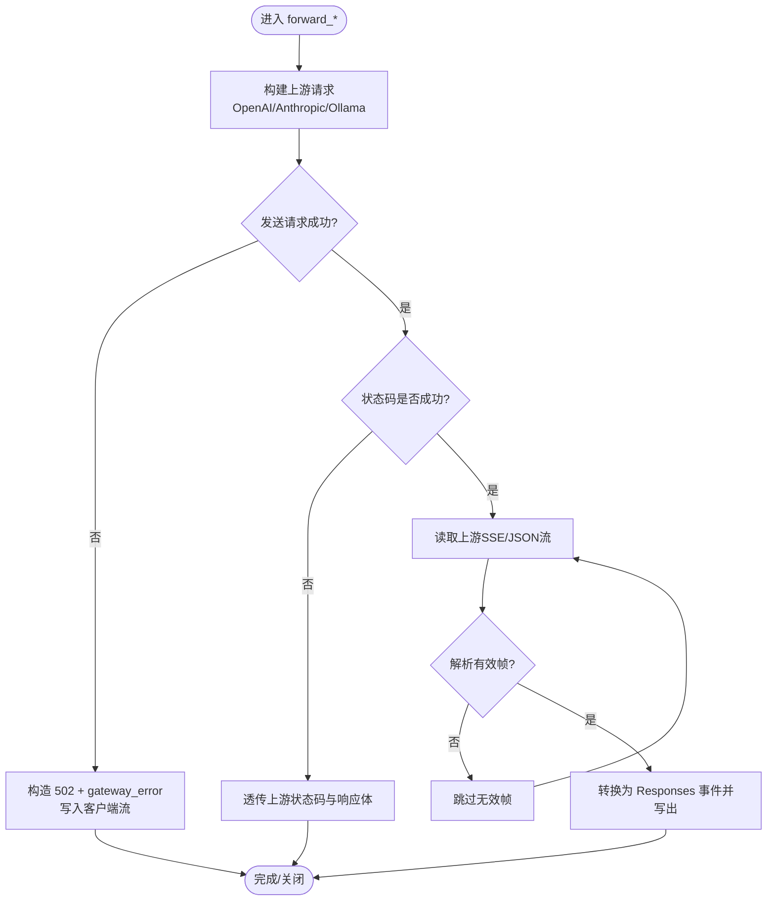
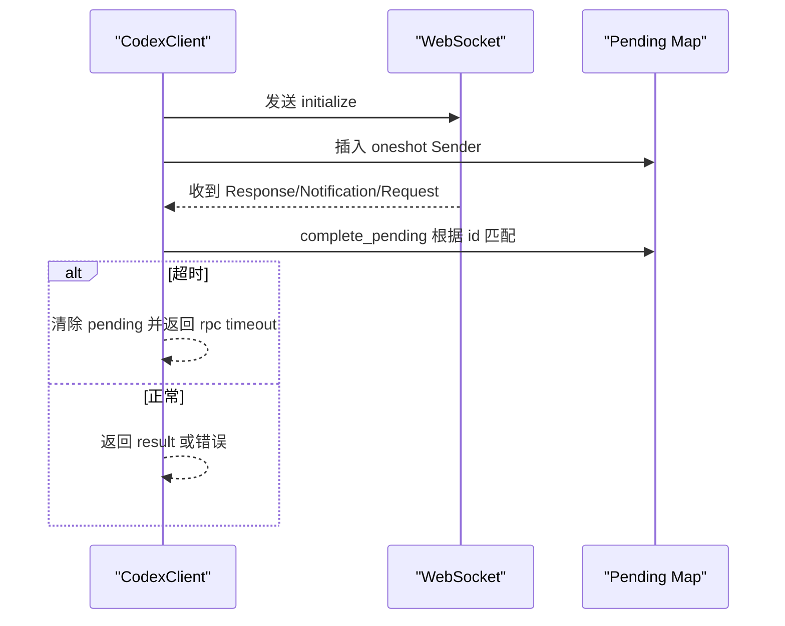
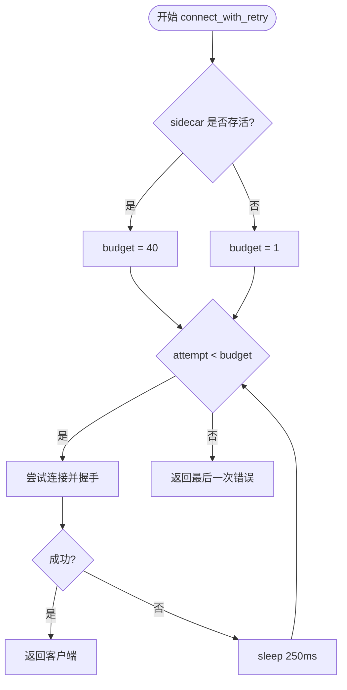
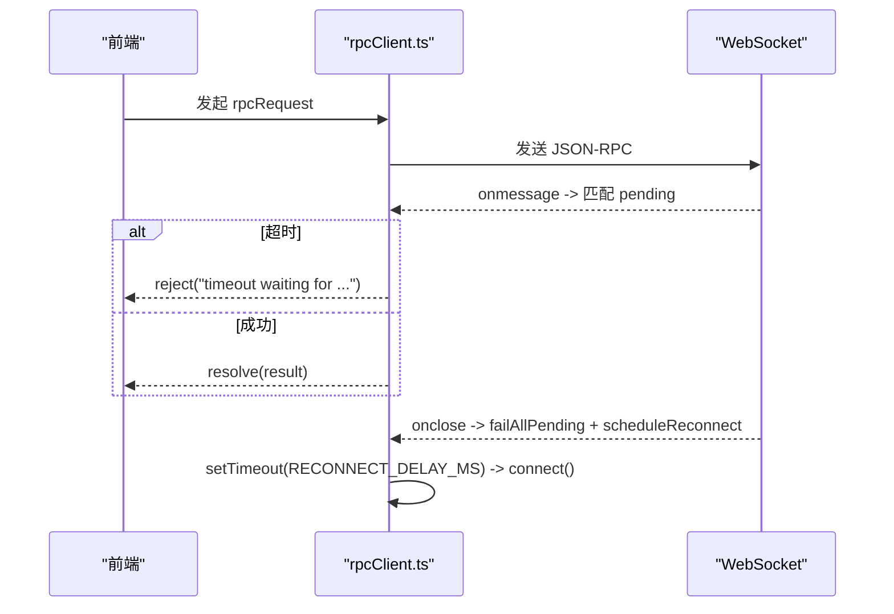
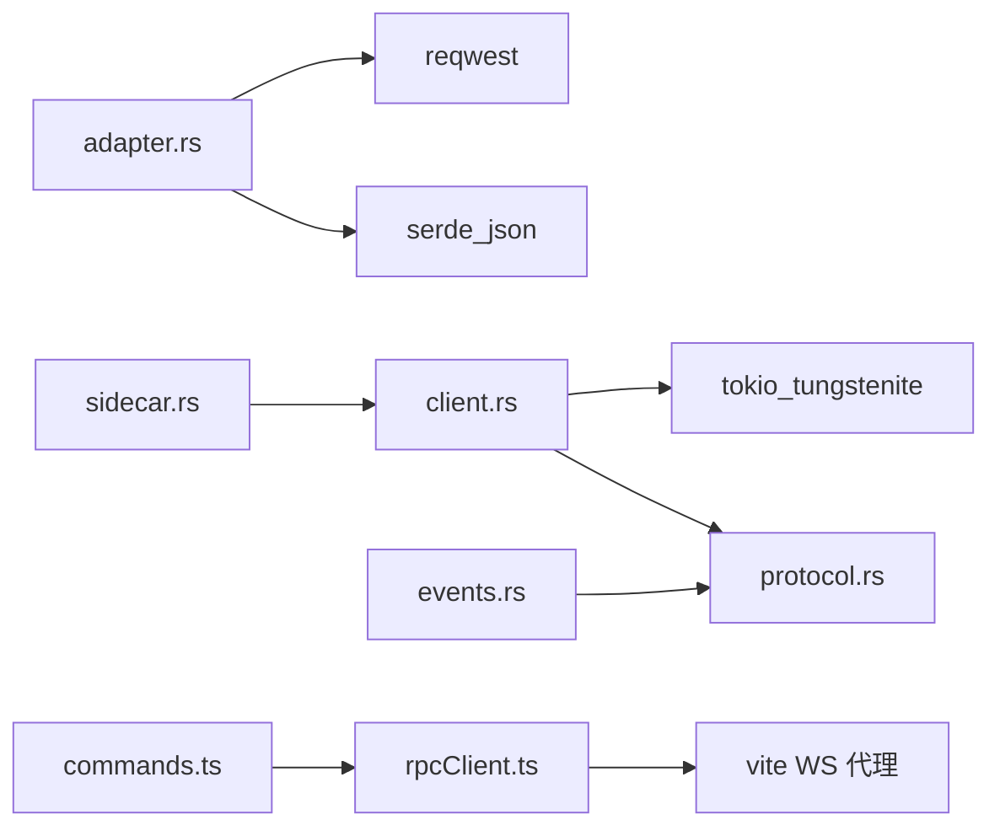

# 错误处理与重试机制

<cite>
**本文引用的文件**
- [adapter.rs](file://src-tauri/src/codex/adapter.rs)
- [client.rs](file://src-tauri/src/codex/client.rs)
- [protocol.rs](file://src-tauri/src/codex/protocol.rs)
- [sidecar.rs](file://src-tauri/src/codex/sidecar.rs)
- [events.rs](file://src-tauri/src/codex/events.rs)
- [rpcClient.ts](file://frontend/app/devbridge/rpcClient.ts)
- [commands.ts](file://frontend/app/devbridge/commands.ts)
- [events.ts](file://frontend/app/bridge/events.ts)
</cite>

## 目录
1. [简介](#简介)
2. [项目结构](#项目结构)
3. [核心组件](#核心组件)
4. [架构总览](#架构总览)
5. [详细组件分析](#详细组件分析)
6. [依赖关系分析](#依赖关系分析)
7. [性能考量](#性能考量)
8. [故障排查指南](#故障排查指南)
9. [结论](#结论)
10. [附录](#附录)

## 简介
本文件系统性梳理 Codex-Tauri 的错误处理与重试机制，覆盖通信层（WebSocket、HTTP）、协议层（JSON-RPC、Responses SSE）以及业务逻辑层的错误分类、处理策略、自动重试、超时控制、连接管理、日志上报与用户提示设计。文档同时给出调试技巧与性能监控建议，帮助在复杂网络与上游服务不稳定场景下保持系统稳定与可观测性。

## 项目结构
Codex-Tauri 的错误与重试涉及前后端多模块协作：
- Rust 后端
  - WebSocket JSON-RPC 客户端与事件广播：client.rs、protocol.rs、events.rs
  - Sidecar 进程管理与连接重试：sidecar.rs
  - 协议适配器（将 Responses 请求转发到 OpenAI/Anthropic/Ollama），含 HTTP 超时与错误包装：adapter.rs
- 前端（浏览器开发模式桥接）
  - WS JSON-RPC 客户端与重连退避：rpcClient.ts
  - 命令路由与错误归一化：commands.ts
  - Tauri 事件桥接与异常隔离：events.ts

**图表来源**
- [adapter.rs:1-220](file://src-tauri/src/codex/adapter.rs#L1-L220)
- [client.rs:1-234](file://src-tauri/src/codex/client.rs#L1-L234)
- [sidecar.rs:188-244](file://src-tauri/src/codex/sidecar.rs#L188-L244)
- [events.rs:1-82](file://src-tauri/src/codex/events.rs#L1-L82)
- [protocol.rs:103-207](file://src-tauri/src/codex/protocol.rs#L103-L207)
- [rpcClient.ts:1-230](file://frontend/app/devbridge/rpcClient.ts#L1-L230)
- [commands.ts:1-683](file://frontend/app/devbridge/commands.ts#L1-L683)
- [events.ts:1-172](file://frontend/app/bridge/events.ts#L1-L172)

**章节来源**
- [adapter.rs:1-220](file://src-tauri/src/codex/adapter.rs#L1-L220)
- [client.rs:1-234](file://src-tauri/src/codex/client.rs#L1-L234)
- [sidecar.rs:188-244](file://src-tauri/src/codex/sidecar.rs#L188-L244)
- [events.rs:1-82](file://src-tauri/src/codex/events.rs#L1-L82)
- [protocol.rs:103-207](file://src-tauri/src/codex/protocol.rs#L103-L207)
- [rpcClient.ts:1-230](file://frontend/app/devbridge/rpcClient.ts#L1-L230)
- [commands.ts:1-683](file://frontend/app/devbridge/commands.ts#L1-L683)
- [events.ts:1-172](file://frontend/app/bridge/events.ts#L1-L172)

## 核心组件
- 协议适配器（adapter.rs）
  - 职责：接收本地 Responses 请求，按 provider 协议（OpenAI Chat、Anthropic Messages、Ollama）转换并转发；将上游 SSE 流转换为 Responses 事件流返回给引擎。
  - 错误处理：对上游连接失败返回 502 并附带 gateway_error；对非成功状态码透传上游错误体；SSE 解析失败时跳过无效帧。
  - 超时：HTTP 客户端设置 180 秒超时，避免长连接挂起。
- JSON-RPC 客户端（client.rs）
  - 职责：建立 WebSocket 连接，执行 initialize → initialized 握手；维护 pending 请求映射；订阅通知广播。
  - 错误处理：initialize 超时或拒绝时抛出明确错误；普通请求超时返回 rpc timeout；响应通道关闭时报告 channel closed。
  - 超时：initialize 10s，普通请求 120s。
- Sidecar 管理（sidecar.rs）
  - 职责：启动/停止 codex-app-server 子进程；维护 EngineHandle 与事件广播；按需连接并重试。
  - 重试：connect_with_retry 固定次数与固定间隔重试，区分“已存活 sidecar”和“未启动”两种预算；首次冷启动避免 UI 卡顿。
- 事件桥（events.rs）
  - 职责：将 engine 的 ServerMessage 广播为 Tauri 事件（codex:*），并对 lagged/closed 做降级处理。
  - 错误处理：Lagged 记录丢弃数量；Closed 退出事件循环。
- 前端 RPC 客户端（rpcClient.ts）
  - 职责：浏览器模式下通过 vite WS 代理与引擎通信；实现 initialize 握手、请求超时、重连退避。
  - 错误处理：连接失败、握手超时、请求超时均记录日志并尝试重连；断开后清理 pending 并统一失败原因。
- 命令路由（commands.ts）
  - 职责：将 Tauri 命令转发到引擎 RPC；对部分能力缺失场景返回诚实错误；对 shell 等 I/O 操作进行超时/阻塞识别与友好提示。
- Tauri 事件桥（events.ts）
  - 职责：监听 codex:* 事件，分发给通知/请求处理器；单个处理器异常不影响其他处理器。

**章节来源**
- [adapter.rs:194-343](file://src-tauri/src/codex/adapter.rs#L194-L343)
- [adapter.rs:345-494](file://src-tauri/src/codex/adapter.rs#L345-L494)
- [adapter.rs:496-601](file://src-tauri/src/codex/adapter.rs#L496-L601)
- [client.rs:37-170](file://src-tauri/src/codex/client.rs#L37-L170)
- [sidecar.rs:188-244](file://src-tauri/src/codex/sidecar.rs#L188-L244)
- [events.rs:12-43](file://src-tauri/src/codex/events.rs#L12-L43)
- [rpcClient.ts:70-189](file://frontend/app/devbridge/rpcClient.ts#L70-L189)
- [commands.ts:187-239](file://frontend/app/devbridge/commands.ts#L187-L239)
- [events.ts:69-139](file://frontend/app/bridge/events.ts#L69-L139)

## 架构总览
下图展示从前端到后端再到上游模型服务的完整错误与重试路径。

**图表来源**
- [rpcClient.ts:70-189](file://frontend/app/devbridge/rpcClient.ts#L70-L189)
- [sidecar.rs:188-244](file://src-tauri/src/codex/sidecar.rs#L188-L244)
- [client.rs:96-170](file://src-tauri/src/codex/client.rs#L96-L170)
- [adapter.rs:194-343](file://src-tauri/src/codex/adapter.rs#L194-L343)

## 详细组件分析

### 协议适配器（adapter.rs）错误分类与处理
- 网络错误
  - 上游连接失败：返回 502 Bad Gateway，并在 body 中携带 gateway_error 类型信息，便于上层识别。
  - 上游非成功状态码：透传上游状态码与响应体，供上层进一步判断。
- 协议错误
  - SSE 数据行解析失败：跳过无效帧，避免中断流式处理。
  - tool_calls 聚合不完整：使用聚合器在流结束时输出完整函数调用。
- 业务逻辑错误
  - 未配置活动 provider：返回 400 Bad Request，并包含 invalid_request_error。
- 超时与连接池
  - HTTP 客户端设置 180 秒超时，防止长时间无响应的请求占用资源。
  - 每次请求新建 reqwest::Client（简单实现），在高并发场景可考虑连接池复用以提升吞吐。

**图表来源**
- [adapter.rs:222-343](file://src-tauri/src/codex/adapter.rs#L222-L343)
- [adapter.rs:345-494](file://src-tauri/src/codex/adapter.rs#L345-L494)
- [adapter.rs:496-601](file://src-tauri/src/codex/adapter.rs#L496-L601)

**章节来源**
- [adapter.rs:162-191](file://src-tauri/src/codex/adapter.rs#L162-L191)
- [adapter.rs:200-220](file://src-tauri/src/codex/adapter.rs#L200-L220)
- [adapter.rs:270-295](file://src-tauri/src/codex/adapter.rs#L270-L295)
- [adapter.rs:388-412](file://src-tauri/src/codex/adapter.rs#L388-L412)
- [adapter.rs:527-545](file://src-tauri/src/codex/adapter.rs#L527-L545)

### JSON-RPC 客户端（client.rs）超时与错误传播
- 初始化握手
  - 超时：10 秒，超时后报错 initialize timed out。
  - 拒绝：当服务端返回 error 时，封装为 initialize rejected 并带上 code/message。
- 普通请求
  - 超时：120 秒，超时后移除 pending 并返回 rpc timeout。
  - 错误：服务端 error 被转换为 “code: message” 字符串。
  - 通道关闭：response channel closed。
- 连接状态
  - 通过 AtomicBool 标记 connected，用于上层快速判断。

**图表来源**
- [client.rs:96-170](file://src-tauri/src/codex/client.rs#L96-L170)
- [client.rs:201-234](file://src-tauri/src/codex/client.rs#L201-L234)

**章节来源**
- [client.rs:19-21](file://src-tauri/src/codex/client.rs#L19-L21)
- [client.rs:121-133](file://src-tauri/src/codex/client.rs#L121-L133)
- [client.rs:148-170](file://src-tauri/src/codex/client.rs#L148-L170)
- [client.rs:201-234](file://src-tauri/src/codex/client.rs#L201-L234)

### Sidecar 连接重试（sidecar.rs）
- 重试策略
  - 固定次数 ATTEMPTS=40，固定延迟 DELAY_MS=250ms。
  - 若 sidecar 已存活，允许重试；否则仅尝试一次，快速失败。
- 目的
  - 避免冷启动时因 sidecar 尚未绑定端口导致的瞬时连接失败。
- 日志
  - 记录重试次数与累计耗时，便于定位启动慢问题。

**图表来源**
- [sidecar.rs:188-222](file://src-tauri/src/codex/sidecar.rs#L188-L222)

**章节来源**
- [sidecar.rs:188-244](file://src-tauri/src/codex/sidecar.rs#L188-L244)

### 前端重连与退避（rpcClient.ts）
- 重连策略
  - 固定延迟 RECONNECT_DELAY_MS=2000ms，onclose/onerror 触发 scheduleReconnect。
  - 连接成功后执行 initialize 握手，成功后置 connected=true。
- 超时
  - initialize 超时 10s；普通请求超时 120s。
- 错误处理
  - 连接失败、握手超时、请求超时均记录日志；断开时清理所有 pending 并统一失败原因。

**图表来源**
- [rpcClient.ts:70-189](file://frontend/app/devbridge/rpcClient.ts#L70-L189)
- [rpcClient.ts:201-230](file://frontend/app/devbridge/rpcClient.ts#L201-L230)

**章节来源**
- [rpcClient.ts:22-24](file://frontend/app/devbridge/rpcClient.ts#L22-L24)
- [rpcClient.ts:70-101](file://frontend/app/devbridge/rpcClient.ts#L70-L101)
- [rpcClient.ts:150-189](file://frontend/app/devbridge/rpcClient.ts#L150-L189)
- [rpcClient.ts:201-230](file://frontend/app/devbridge/rpcClient.ts#L201-L230)

### 事件桥与异常隔离（events.rs, events.ts）
- Rust 侧
  - 广播 Lagged：记录丢弃数量；Closed：退出事件循环。
  - 将 server→client 请求映射为专用事件（如 codex:approval、codex:user-input）。
- 前端侧
  - 每个通知/请求处理器独立 try/catch，单个失败不影响其他处理器。
  - 未知方法记录警告，不中断流程。

**章节来源**
- [events.rs:24-43](file://src-tauri/src/codex/events.rs#L24-L43)
- [events.rs:45-82](file://src-tauri/src/codex/events.rs#L45-L82)
- [events.ts:69-139](file://frontend/app/bridge/events.ts#L69-L139)

### 业务逻辑错误与用户提示（commands.ts）
- 参数校验错误：如 provider id 为空、base_url 格式不正确，直接返回结构化错误。
- 能力缺失：browser-dev 模式下插件市场不可用，抛出明确错误消息。
- I/O 超时/阻塞：shell 命令检测到 timeout 或 WouldBlock，返回 note 而非抛错，便于 UI 降级显示。
- 探测上游：probe_provider 尝试多个候选 endpoint，收集最后错误以便诊断。

**章节来源**
- [commands.ts:146-185](file://frontend/app/devbridge/commands.ts#L146-L185)
- [commands.ts:187-239](file://frontend/app/devbridge/commands.ts#L187-L239)
- [commands.ts:295-319](file://frontend/app/devbridge/commands.ts#L295-L319)
- [commands.ts:612-615](file://frontend/app/devbridge/commands.ts#L612-L615)

## 依赖关系分析
- 耦合关系
  - adapter.rs 依赖 reqwest 进行 HTTP 请求，依赖 serde_json 进行序列化/反序列化。
  - client.rs 依赖 tokio_tungstenite 进行 WebSocket 通信，依赖 protocol.rs 中的消息类型。
  - sidecar.rs 依赖 client.rs 进行连接与握手，并通过 broadcast 分发事件。
  - events.rs 依赖 protocol.rs 的消息枚举，将事件映射为 Tauri 事件名。
  - 前端 rpcClient.ts 与 commands.ts 共同实现浏览器模式的等价行为。
- 外部依赖
  - 上游模型服务（OpenAI/Anthropic/Ollama）可能返回不同协议与错误格式，adapter 负责适配与错误包装。
  - Tauri 事件系统对事件名有命名限制（不支持 . 与 /），由 events.rs 与 events.ts 统一替换为 -。

**图表来源**
- [adapter.rs:17-26](file://src-tauri/src/codex/adapter.rs#L17-L26)
- [client.rs:8-15](file://src-tauri/src/codex/client.rs#L8-L15)
- [sidecar.rs:1-11](file://src-tauri/src/codex/sidecar.rs#L1-L11)
- [events.rs:1-9](file://src-tauri/src/codex/events.rs#L1-L9)
- [rpcClient.ts:1-18](file://frontend/app/devbridge/rpcClient.ts#L1-L18)
- [commands.ts:1-19](file://frontend/app/devbridge/commands.ts#L1-L19)

**章节来源**
- [adapter.rs:17-26](file://src-tauri/src/codex/adapter.rs#L17-L26)
- [client.rs:8-15](file://src-tauri/src/codex/client.rs#L8-L15)
- [sidecar.rs:1-11](file://src-tauri/src/codex/sidecar.rs#L1-L11)
- [events.rs:1-9](file://src-tauri/src/codex/events.rs#L1-L9)
- [rpcClient.ts:1-18](file://frontend/app/devbridge/rpcClient.ts#L1-L18)
- [commands.ts:1-19](file://frontend/app/devbridge/commands.ts#L1-L19)

## 性能考量
- 超时设置
  - 适配器 HTTP 超时 180s，避免长连接占用；客户端 initialize 10s、请求 120s，平衡用户体验与稳定性。
- 重试策略
  - Sidecar 固定次数与固定延迟重试，适合冷启动场景；前端固定 2s 重连，避免频繁风暴。
- 流式处理
  - 适配器对 SSE 流逐行解析，避免大缓冲；工具调用聚合减少重复事件。
- 连接管理
  - 当前适配器每请求新建 HTTP 客户端，高并发时可引入连接池提升吞吐。
- 事件广播容量
  - 广播通道容量 256，Lagged 会丢弃事件并记录，必要时需扩容或优化消费者速度。

[本节为通用性能讨论，无需具体文件引用]

## 故障排查指南
- 常见问题定位
  - 连接失败：检查 sidecar 是否已启动且监听地址正确；查看 connect_with_retry 日志。
  - 握手失败：确认 initialize 超时与拒绝错误；检查客户端与服务端版本兼容性。
  - 上游错误：adapter 返回 502 或透传上游状态码；检查 base_url、鉴权头与模型可用性。
  - 事件丢失：关注 Lagged 日志；增加消费者处理速度或增大广播容量。
- 调试技巧
  - 启用 tracing 日志，观察重试次数与耗时。
  - 使用 probe_provider 验证上游端点与鉴权。
  - 在 commands.ts 中对 shell 命令捕获 timeout/WouldBlock，结合 UI 提示。
- 性能监控
  - 统计请求超时比例、重试成功率、上游错误分布。
  - 监控事件 Lagged 频率，评估是否需要扩容或优化。

**章节来源**
- [sidecar.rs:188-222](file://src-tauri/src/codex/sidecar.rs#L188-L222)
- [client.rs:121-170](file://src-tauri/src/codex/client.rs#L121-L170)
- [adapter.rs:270-295](file://src-tauri/src/codex/adapter.rs#L270-L295)
- [events.rs:33-43](file://src-tauri/src/codex/events.rs#L33-L43)
- [commands.ts:187-239](file://frontend/app/devbridge/commands.ts#L187-L239)

## 结论
Codex-Tauri 通过分层错误处理与重试机制，确保在网络波动与上游不稳定情况下仍能提供稳定体验。Rust 后端以明确的超时、错误包装与重试预算保障健壮性；前端通过重连退避与异常隔离提升容错能力。建议在后续迭代中引入连接池、指数退避与更细粒度的指标采集，进一步优化性能与可观测性。

[本节为总结性内容，无需具体文件引用]

## 附录
- 错误分类速查
  - 网络错误：连接失败、超时、上游非成功状态码。
  - 协议错误：SSE 解析失败、JSON 解析失败、消息格式不符。
  - 业务逻辑错误：未配置 provider、参数校验失败、能力缺失。
- 恢复策略
  - 短期重试：固定次数与延迟，适用于启动阶段。
  - 长期恢复：前端重连退避，等待上游恢复。
  - 降级显示：I/O 超时/阻塞时返回 note，UI 友好提示。
- 容错设计原则
  - 快速失败：无法恢复的错误立即返回，避免阻塞。
  - 可观测性：关键路径记录日志与指标。
  - 隔离性：单点异常不影响整体流程。

[本节为概念性内容，无需具体文件引用]