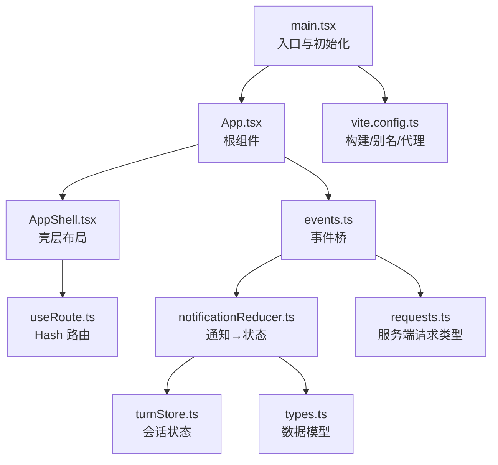
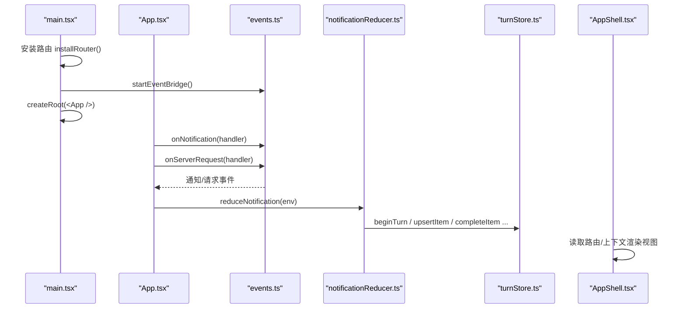
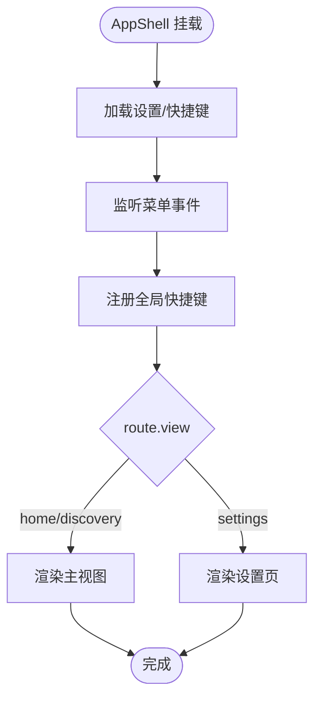
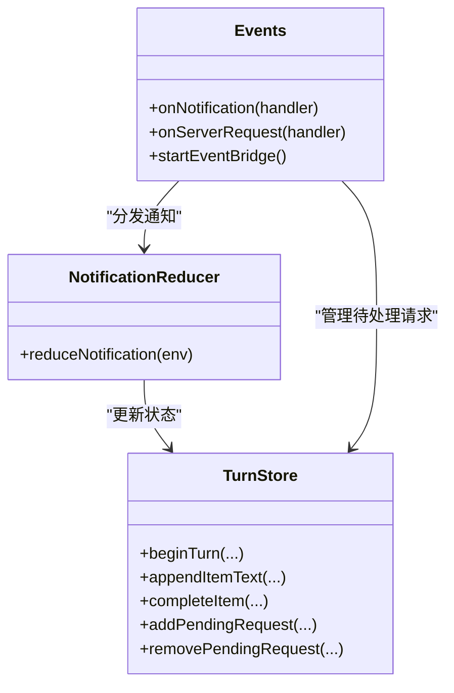
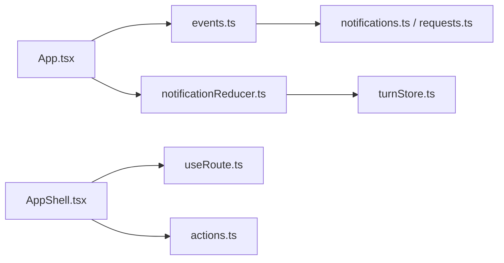

# 应用结构

<cite>
**本文引用的文件**
- [frontend/app/App.tsx](file://frontend/app/App.tsx)
- [frontend/app/main.tsx](file://frontend/app/main.tsx)
- [frontend/app/shell/AppShell.tsx](file://frontend/app/shell/AppShell.tsx)
- [frontend/vite.config.ts](file://frontend/vite.config.ts)
- [frontend/package.json](file://frontend/package.json)
- [frontend/app/bridge/events.ts](file://frontend/app/bridge/events.ts)
- [frontend/app/shell/useRoute.ts](file://frontend/app/shell/useRoute.ts)
- [frontend/app/state/notificationReducer.ts](file://frontend/app/state/notificationReducer.ts)
- [frontend/app/state/turnStore.ts](file://frontend/app/state/turnStore.ts)
- [frontend/src/protocol/notifications.ts](file://frontend/src/protocol/notifications.ts)
- [frontend/src/protocol/requests.ts](file://frontend/src/protocol/requests.ts)
- [frontend/app/state/types.ts](file://frontend/app/state/types.ts)
- [frontend/app/shell/actions.ts](file://frontend/app/shell/actions.ts)
</cite>

## 目录
1. [简介](#简介)
2. [项目结构](#项目结构)
3. [核心组件](#核心组件)
4. [架构总览](#架构总览)
5. [详细组件分析](#详细组件分析)
6. [依赖关系分析](#依赖关系分析)
7. [性能考量](#性能考量)
8. [故障排查指南](#故障排查指南)
9. [结论](#结论)
10. [附录：模块组织与最佳实践](#附录：模块组织与最佳实践)

## 简介
本文件面向 Codex-Tauri 前端应用的 React 层，聚焦根组件设计、应用初始化流程、Vite 构建配置与模块组织方式。重点说明：
- App.tsx 作为根组件的职责：协议事件通道绑定、通知处理、请求管理。
- AppShell 主壳层的作用与布局结构（标题栏、侧边栏、主视图）。
- main.tsx 中的路由安装、样式注入、国际化与渲染流程。
- Vite 配置要点：别名、浏览器开发模式代理、产物输出策略。
- 目录结构与命名约定、模块导入最佳实践，并给出新增功能模块的组织示例。

## 项目结构
前端采用“React 应用 + 静态资源”的混合结构：
- frontend/app：React 应用源码（入口、状态、桥接、壳层、视图等）。
- frontend/src：保留的旧版静态资源与协议定义（CSS、JS、协议表）。
- vite.config.ts：构建与开发期行为（别名、插件、代理、输出）。
- package.json：脚本与依赖。

图表来源
- [frontend/app/main.tsx:1-87](file://frontend/app/main.tsx#L1-L87)
- [frontend/app/App.tsx:1-47](file://frontend/app/App.tsx#L1-L47)
- [frontend/app/shell/AppShell.tsx:1-205](file://frontend/app/shell/AppShell.tsx#L1-L205)
- [frontend/app/bridge/events.ts:1-172](file://frontend/app/bridge/events.ts#L1-L172)
- [frontend/app/state/notificationReducer.ts:1-446](file://frontend/app/state/notificationReducer.ts#L1-L446)
- [frontend/app/state/turnStore.ts:1-451](file://frontend/app/state/turnStore.ts#L1-L451)
- [frontend/src/protocol/requests.ts:1-50](file://frontend/src/protocol/requests.ts#L1-L50)
- [frontend/vite.config.ts:1-104](file://frontend/vite.config.ts#L1-L104)

章节来源
- [frontend/app/main.tsx:1-87](file://frontend/app/main.tsx#L1-L87)
- [frontend/vite.config.ts:1-104](file://frontend/vite.config.ts#L1-L104)
- [frontend/package.json:1-31](file://frontend/package.json#L1-L31)

## 核心组件
- App.tsx：根组件，职责单一——订阅通知与服务端请求，将事件写入状态；渲染 AppShell。
- AppShell.tsx：应用壳层，负责标题栏、侧边栏、主视图容器、设置页切换、全局快捷键与菜单动作分发。
- events.ts：Tauri 事件桥，统一监听所有通知与方法，分发给订阅者。
- notificationReducer.ts：将协议通知映射为 turnStore 的状态变更。
- turnStore.ts：当前会话（turn）的唯一真实状态源，提供订阅与快照能力。
- useRoute.ts：基于 URL hash 的路由，暴露 useRoute Hook 与 navigate API。
- types.ts：TurnItem/TurnState 等核心数据结构。

章节来源
- [frontend/app/App.tsx:1-47](file://frontend/app/App.tsx#L1-L47)
- [frontend/app/shell/AppShell.tsx:1-205](file://frontend/app/shell/AppShell.tsx#L1-L205)
- [frontend/app/bridge/events.ts:1-172](file://frontend/app/bridge/events.ts#L1-L172)
- [frontend/app/state/notificationReducer.ts:1-446](file://frontend/app/state/notificationReducer.ts#L1-L446)
- [frontend/app/state/turnStore.ts:1-451](file://frontend/app/state/turnStore.ts#L1-L451)
- [frontend/app/shell/useRoute.ts:1-79](file://frontend/app/shell/useRoute.ts#L1-L79)
- [frontend/app/state/types.ts:1-146](file://frontend/app/state/types.ts#L1-L146)

## 架构总览
下图展示了从启动到渲染的关键路径：入口加载样式与路由 → 启动事件桥 → 根组件订阅事件 → 通知驱动状态 → 壳层根据路由渲染视图。

图表来源
- [frontend/app/main.tsx:38-60](file://frontend/app/main.tsx#L38-L60)
- [frontend/app/App.tsx:15-45](file://frontend/app/App.tsx#L15-L45)
- [frontend/app/bridge/events.ts:145-159](file://frontend/app/bridge/events.ts#L145-L159)
- [frontend/app/state/notificationReducer.ts:189-446](file://frontend/app/state/notificationReducer.ts#L189-L446)
- [frontend/app/state/turnStore.ts:68-265](file://frontend/app/state/turnStore.ts#L68-L265)
- [frontend/app/shell/AppShell.tsx:78-205](file://frontend/app/shell/AppShell.tsx#L78-L205)

## 详细组件分析

### App.tsx 根组件
- 职责边界：仅做事件通道绑定与状态更新，不持有业务逻辑。
- 通知处理：通过 onNotification 订阅所有通知，调用 reduceNotification 更新 turnStore。
- 请求管理：通过 onServerRequest 收集待处理请求，并在 serverRequest/resolved 时移除。
- 渲染：返回 <AppShell />。

章节来源
- [frontend/app/App.tsx:15-45](file://frontend/app/App.tsx#L15-L45)
- [frontend/app/state/notificationReducer.ts:189-446](file://frontend/app/state/notificationReducer.ts#L189-L446)
- [frontend/app/state/turnStore.ts:258-265](file://frontend/app/state/turnStore.ts#L258-L265)

### AppShell.tsx 主壳层
- 布局契约：遵循 body > #root > .app-toolbar + #app > .sidebar + .main 的结构，设置页以兄弟节点方式显示。
- 状态与交互：
  - 侧边栏折叠状态持久化。
  - 快捷键绑定：优先后端 list_shortcuts，否则回退到菜单树。
  - 菜单事件监听：接收 Rust 菜单事件并分发到 dispatchAction。
  - 全局快捷键：使用 useShortcutDispatcher 触发同一动作路径。
- 视图宿主：根据 route.view 选择 HomeView/DiscoveryView/SettingsShell。

图表来源
- [frontend/app/shell/AppShell.tsx:78-205](file://frontend/app/shell/AppShell.tsx#L78-L205)
- [frontend/app/shell/actions.ts:57-201](file://frontend/app/shell/actions.ts#L57-L201)

章节来源
- [frontend/app/shell/AppShell.tsx:1-205](file://frontend/app/shell/AppShell.tsx#L1-L205)
- [frontend/app/shell/actions.ts:1-201](file://frontend/app/shell/actions.ts#L1-L201)

### main.tsx 初始化流程
- 样式注入：一次性引入主题与页面样式，保持与旧版一致。
- 路由安装：在首次渲染前安装路由，确保初始路由已知。
- 事件桥启动：在首屏前启动事件桥，避免丢失通知。
- 偏好与国际化：加载偏好后启动外观系统，并应用语言。
- 渲染：创建 React 根并挂载 <App />。
- 启动遮罩：最小展示时间后移除启动加载器。

章节来源
- [frontend/app/main.tsx:1-87](file://frontend/app/main.tsx#L1-L87)

### 事件桥与通知处理
- 事件桥：集中监听所有 NOTIFICATION_METHODS 以及固定请求通道（approval、user-input），将事件转为统一信封并广播给订阅者。
- 通知归约：notificationReducer 将每种通知映射为 turnStore 的动作（开始/结束 turn、追加文本/输出、完成项、警告、错误等）。
- 请求管理：App.tsx 将服务端请求加入 pendingRequests，并在 resolved 时移除。

图表来源
- [frontend/app/bridge/events.ts:57-159](file://frontend/app/bridge/events.ts#L57-L159)
- [frontend/app/state/notificationReducer.ts:189-446](file://frontend/app/state/notificationReducer.ts#L189-L446)
- [frontend/app/state/turnStore.ts:68-265](file://frontend/app/state/turnStore.ts#L68-L265)

章节来源
- [frontend/app/bridge/events.ts:1-172](file://frontend/app/bridge/events.ts#L1-L172)
- [frontend/app/state/notificationReducer.ts:1-446](file://frontend/app/state/notificationReducer.ts#L1-L446)
- [frontend/app/state/turnStore.ts:1-451](file://frontend/app/state/turnStore.ts#L1-L451)

### 路由与视图
- Hash 路由：支持 view 与 sub 两级，自动同步 body 类名以复用现有样式规则。
- 视图选择：默认 home，特定值走 discovery，settings 走独立设置壳层。

章节来源
- [frontend/app/shell/useRoute.ts:1-79](file://frontend/app/shell/useRoute.ts#L1-L79)
- [frontend/app/shell/AppShell.tsx:26-32](file://frontend/app/shell/AppShell.tsx#L26-L32)

### 数据模型
- TurnItem：描述一个可渲染单元（消息、命令执行、推理、工具调用等），包含状态、时间戳、输出、进度等。
- TurnState：会话级状态，包括 items、order、tokenUsage、plan、warnings、pendingRequests 等。
- 协议常量：NOTIFICATION_METHODS、SERVER_REQUEST_METHODS 来自自动生成文件，保证前后端一致性。

章节来源
- [frontend/app/state/types.ts:1-146](file://frontend/app/state/types.ts#L1-L146)
- [frontend/src/protocol/notifications.ts:10-95](file://frontend/src/protocol/notifications.ts#L10-L95)
- [frontend/src/protocol/requests.ts:10-48](file://frontend/src/protocol/requests.ts#L10-L48)

## 依赖关系分析
- 模块耦合：
  - App.tsx 依赖 events.ts 与 state/*，低耦合于 UI。
  - AppShell.tsx 依赖 useRoute、actions、state/*，承担导航与交互编排。
  - events.ts 依赖 @tauri-apps/api/event 与协议常量，屏蔽底层差异。
  - notificationReducer.ts 依赖 turnStore 与协议类型，是通知到状态的桥梁。
- 外部依赖：
  - @tauri-apps/api：窗口、事件、IPC。
  - React 19：StrictMode、Hooks。
  - Vite：构建与开发代理。

图表来源
- [frontend/app/App.tsx:15-45](file://frontend/app/App.tsx#L15-L45)
- [frontend/app/bridge/events.ts:145-159](file://frontend/app/bridge/events.ts#L145-L159)
- [frontend/app/state/notificationReducer.ts:189-446](file://frontend/app/state/notificationReducer.ts#L189-L446)
- [frontend/app/shell/AppShell.tsx:78-205](file://frontend/app/shell/AppShell.tsx#L78-L205)
- [frontend/src/protocol/notifications.ts:10-95](file://frontend/src/protocol/notifications.ts#L10-L95)
- [frontend/src/protocol/requests.ts:10-48](file://frontend/src/protocol/requests.ts#L10-L48)

章节来源
- [frontend/package.json:15-29](file://frontend/package.json#L15-L29)
- [frontend/vite.config.ts:61-103](file://frontend/vite.config.ts#L61-L103)

## 性能考量
- 事件桥并行订阅：对 NOTIFICATION_METHODS 使用 Promise.all 并行绑定，减少启动耗时。
- 高频流式更新：turnStore 通过 subscribe/getSnapshot 暴露快照，避免不必要的重渲染。
- 构建目标：target es2022，利用现代引擎特性提升运行效率。
- 资源加载：一次性注入 CSS，避免运行时动态样式开销。

[本节为通用指导，无需具体文件引用]

## 故障排查指南
- 事件桥未就绪：检查 startEventBridge 是否被调用且成功；查看控制台日志中“bridge ready”信息。
- 通知无响应：确认 notificationReducer 已覆盖对应方法；未处理的方法会记录警告。
- 请求未消失：确认 serverRequest/resolved 能正确移除 pendingRequests。
- 路由异常：检查 installRouter 是否在渲染前执行；确认 body 类名随路由变化。
- 构建问题：确认 publicDir 关闭、别名配置正确；浏览器模式下 ws 代理是否可用。

章节来源
- [frontend/app/bridge/events.ts:145-159](file://frontend/app/bridge/events.ts#L145-L159)
- [frontend/app/state/notificationReducer.ts:437-446](file://frontend/app/state/notificationReducer.ts#L437-L446)
- [frontend/app/state/turnStore.ts:258-265](file://frontend/app/state/turnStore.ts#L258-L265)
- [frontend/app/shell/useRoute.ts:68-79](file://frontend/app/shell/useRoute.ts#L68-L79)
- [frontend/vite.config.ts:19-57](file://frontend/vite.config.ts#L19-L57)

## 结论
Codex-Tauri 前端采用清晰的职责分层：入口负责初始化与装配，根组件专注事件绑定与状态更新，壳层负责布局与交互，状态层以 turnStore 为核心，协议常量保障前后端一致性。Vite 配置提供了稳定的构建与浏览器开发体验。按本文规范组织新模块，可快速集成到现有架构中。

[本节为总结性内容，无需具体文件引用]

## 附录：模块组织与最佳实践
- 目录与命名
  - app/*：React 应用代码，按职责划分（shell、views、state、bridge）。
  - src/*：静态资源与协议定义（CSS、JS、协议表）。
  - 文件名使用 PascalCase 表示组件，camelCase 表示函数/变量。
- 模块导入
  - 使用 @ 别名指向 app 目录，@protocol 指向协议定义，避免相对路径地狱。
  - 跨层依赖顺序：UI → bridge → state → protocol。
- 新增功能模块步骤示例
  1) 在 app/views 下新建功能视图组件（如 NewFeatureView.tsx），并通过 useRoute 控制显示。
  2) 若需监听新通知：
     - 在 notificationReducer.ts 中添加对应 case，调用 turnStore 相应动作。
     - 确保 NOTIFICATION_METHODS 已包含该通知（自动生成）。
  3) 若需处理新请求：
     - 在 App.tsx 中通过 onServerRequest 捕获并加入 pendingRequests。
     - 在 resolved 时移除。
  4) 如需与后端交互：
     - 在 actions.ts 或 shell 相关文件中封装 invoke 调用。
     - 通过 AppShell 的上下文暴露给子组件。
  5) 样式与资源：
     - 新增 CSS 在 app/styles 或 src/styles 中引入。
     - 静态资源放入 src/assets，通过 Vite 管线处理。
- 最佳实践
  - 保持根组件职责单一，复杂逻辑下沉到 state 与 shell。
  - 所有 UI 状态应来源于服务器通知或显式用户操作，避免本地模拟。
  - 使用 turnStore 的 subscribe 与 getSnapshot 实现高性能订阅。
  - 路由变化通过 navigate 进行，不要直接修改 window.location.hash。
  - 对外部 IPC 调用增加错误处理与降级策略。

章节来源
- [frontend/app/shell/useRoute.ts:48-54](file://frontend/app/shell/useRoute.ts#L48-L54)
- [frontend/app/state/notificationReducer.ts:189-446](file://frontend/app/state/notificationReducer.ts#L189-L446)
- [frontend/app/state/turnStore.ts:40-49](file://frontend/app/state/turnStore.ts#L40-L49)
- [frontend/app/shell/actions.ts:57-201](file://frontend/app/shell/actions.ts#L57-L201)
- [frontend/vite.config.ts:65-80](file://frontend/vite.config.ts#L65-L80)