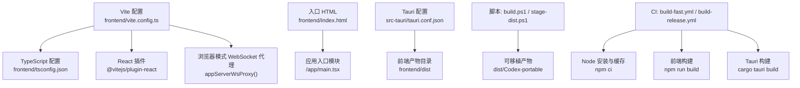
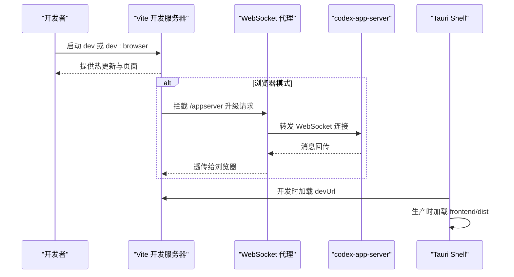
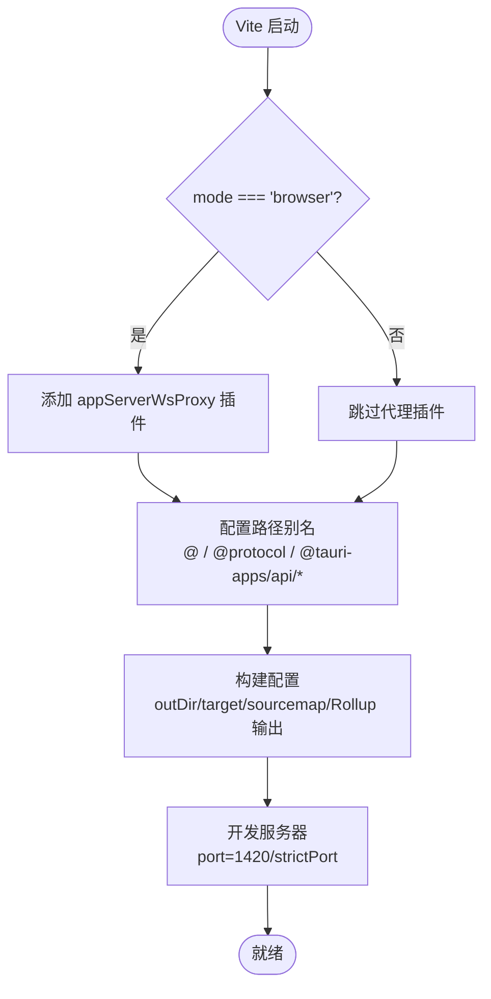
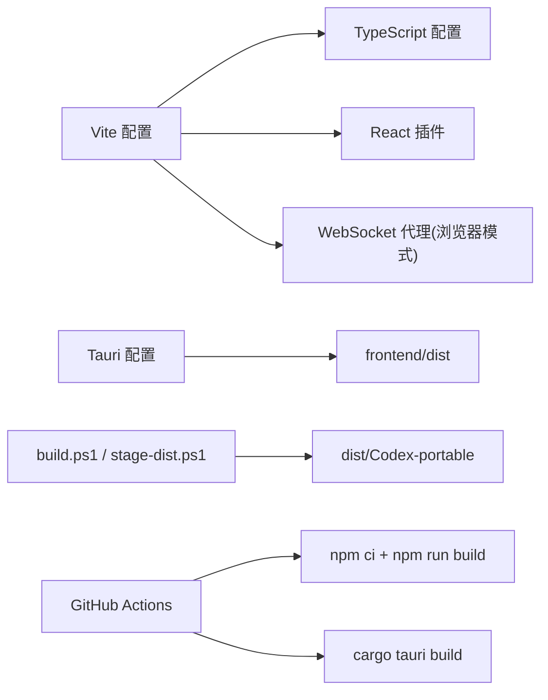

# 构建配置

<cite>
**本文引用的文件**
- [frontend/vite.config.ts](file://frontend/vite.config.ts)
- [frontend/tsconfig.json](file://frontend/tsconfig.json)
- [frontend/package.json](file://frontend/package.json)
- [frontend/index.html](file://frontend/index.html)
- [src-tauri/tauri.conf.json](file://src-tauri/tauri.conf.json)
- [scripts/build.ps1](file://scripts/build.ps1)
- [scripts/stage-dist.ps1](file://scripts/stage-dist.ps1)
- [scripts/dev-browser.ps1](file://scripts/dev-browser.ps1)
- [.github/workflows/build-fast.yml](file://.github/workflows/build-fast.yml)
- [.github/workflows/build-release.yml](file://.github/workflows/build-release.yml)
</cite>

## 目录
1. [简介](#简介)
2. [项目结构](#项目结构)
3. [核心组件](#核心组件)
4. [架构总览](#架构总览)
5. [详细组件分析](#详细组件分析)
6. [依赖关系分析](#依赖关系分析)
7. [性能考虑](#性能考虑)
8. [故障排除指南](#故障排除指南)
9. [结论](#结论)
10. [附录](#附录)

## 简介
本文件面向 Codex-Tauri 前端构建配置，系统性说明 Vite 构建工具的配置选项、插件系统与开发服务器设置；解释 TypeScript 编译配置、路径别名与类型检查规则；介绍包管理器配置、依赖管理与脚本命令；说明环境变量、构建优化与打包策略；并提供开发环境搭建、生产构建流程与部署配置建议，以及构建性能优化与故障排除指南。

## 项目结构
前端位于 frontend 目录，使用 Vite + React + TypeScript 进行开发与构建，产物输出到 frontend/dist。Tauri 壳工程在 src-tauri，通过 tauri.conf.json 指定前端产物目录 devUrl 与构建入口。CI/CD 通过 GitHub Actions 完成前端安装与构建、Rust/Tauri 构建与产物整理。

图表来源
- [frontend/vite.config.ts:1-104](file://frontend/vite.config.ts#L1-L104)
- [frontend/tsconfig.json:1-36](file://frontend/tsconfig.json#L1-L36)
- [frontend/index.html:1-163](file://frontend/index.html#L1-L163)
- [src-tauri/tauri.conf.json:1-61](file://src-tauri/tauri.conf.json#L1-L61)
- [scripts/build.ps1:1-24](file://scripts/build.ps1#L1-L24)
- [scripts/stage-dist.ps1:1-75](file://scripts/stage-dist.ps1#L1-L75)
- [.github/workflows/build-fast.yml:67-93](file://.github/workflows/build-fast.yml#L67-L93)
- [.github/workflows/build-release.yml:46-59](file://.github/workflows/build-release.yml#L46-L59)

章节来源
- [frontend/vite.config.ts:1-104](file://frontend/vite.config.ts#L1-L104)
- [frontend/tsconfig.json:1-36](file://frontend/tsconfig.json#L1-L36)
- [frontend/package.json:1-31](file://frontend/package.json#L1-L31)
- [frontend/index.html:1-163](file://frontend/index.html#L1-L163)
- [src-tauri/tauri.conf.json:1-61](file://src-tauri/tauri.conf.json#L1-L61)
- [scripts/build.ps1:1-24](file://scripts/build.ps1#L1-L24)
- [scripts/stage-dist.ps1:1-75](file://scripts/stage-dist.ps1#L1-L75)
- [.github/workflows/build-fast.yml:1-232](file://.github/workflows/build-fast.yml#L1-L232)
- [.github/workflows/build-release.yml:1-179](file://.github/workflows/build-release.yml#L1-L179)

## 核心组件
- Vite 构建配置：定义插件、路径别名、构建目标、输出命名、SourceMap、开发服务器端口等。
- TypeScript 编译配置：严格模式、模块解析、JS 兼容、路径映射、包含范围。
- 包管理与脚本：npm scripts 提供开发、类型检查、构建、预览与浏览器模式开发。
- Tauri 集成：devUrl 指向本地 Vite 服务，构建产物目录为 frontend/dist。
- CI/CD：Node 版本固定、依赖缓存、前端构建、Rust/Tauri 构建与产物归档。

章节来源
- [frontend/vite.config.ts:59-103](file://frontend/vite.config.ts#L59-L103)
- [frontend/tsconfig.json:1-36](file://frontend/tsconfig.json#L1-L36)
- [frontend/package.json:7-14](file://frontend/package.json#L7-L14)
- [src-tauri/tauri.conf.json:6-11](file://src-tauri/tauri.conf.json#L6-L11)
- [.github/workflows/build-fast.yml:67-93](file://.github/workflows/build-fast.yml#L67-L93)
- [.github/workflows/build-release.yml:46-59](file://.github/workflows/build-release.yml#L46-L59)

## 架构总览
前端以 Vite 为核心，启用 React 插件与自定义 WebSocket 代理（浏览器模式）。TypeScript 负责类型检查与路径映射。Tauri 在开发时通过 devUrl 连接 Vite 服务，在生产构建时将静态资源打包进 dist 并随 Rust 二进制一起分发。CI 中 Node 与 Rust 工具链被缓存，加速构建。

图表来源
- [frontend/vite.config.ts:19-57](file://frontend/vite.config.ts#L19-L57)
- [frontend/vite.config.ts:59-103](file://frontend/vite.config.ts#L59-L103)
- [src-tauri/tauri.conf.json:6-11](file://src-tauri/tauri.conf.json#L6-L11)

## 详细组件分析

### Vite 构建配置与插件系统
- 插件：
  - @vitejs/plugin-react：启用 React JSX 支持。
  - appServerWsProxy：仅在 browser 模式下启用，将 /appserver 的 WebSocket 升级到上游 codex-app-server，绕过浏览器 Origin 限制。
- 路径别名：
  - @ → frontend/app
  - @protocol → frontend/src/protocol
  - 浏览器模式下将 @tauri-apps/api/core 与 @tauri-apps/api/event 重定向至本地 devbridge 实现，以便在浏览器中回放 shell 命令。
- 构建选项：
  - outDir: dist
  - emptyOutDir: true
  - target: es2022（适配现代 WebView）
  - sourcemap: true
  - Rollup 输出命名：统一带 hash 的文件名，便于缓存与 CDN。
- 开发服务器：
  - port: 1420, strictPort: true
  - clearScreen: false

图表来源
- [frontend/vite.config.ts:19-57](file://frontend/vite.config.ts#L19-L57)
- [frontend/vite.config.ts:59-103](file://frontend/vite.config.ts#L59-L103)

章节来源
- [frontend/vite.config.ts:1-104](file://frontend/vite.config.ts#L1-L104)

### TypeScript 编译配置与类型检查
- 目标与库：ES2022 目标，DOM/DOM.Iterable 支持。
- 模块系统：ESNext，moduleResolution: bundler。
- JSX：react-jsx。
- 类型声明：vite/client、node。
- 严格性：开启 strict、noUncheckedIndexedAccess、noImplicitOverride、noFallthroughCasesInSwitch。
- JS 兼容：allowJs=true 且 checkJs=false，允许迁移期引入旧 JS 但不进行类型检查。
- 路径映射：@/* → app/*，@protocol/* → src/protocol/*。
- 包含范围：app/**/*.ts|tsx、src/protocol/**/*.ts、vite.config.ts。
- 不生成输出：noEmit=true，仅做类型检查。

章节来源
- [frontend/tsconfig.json:1-36](file://frontend/tsconfig.json#L1-L36)

### 包管理器配置与脚本命令
- 包类型：type: module。
- 脚本：
  - dev：启动 Vite 开发服务器。
  - build：先执行 tsc 类型检查，再执行 vite build。
  - build:only：仅构建。
  - typecheck：仅类型检查。
  - preview：预览构建产物。
  - dev:browser：以 browser 模式启动 Vite，启用 WebSocket 代理。
- 依赖：
  - 运行时：react、react-dom、@tauri-apps/api。
  - 开发依赖：typescript、vite、@vitejs/plugin-react、ws 及其类型声明。

章节来源
- [frontend/package.json:1-31](file://frontend/package.json#L1-L31)

### 环境变量与开发服务器
- 环境变量：
  - CODEX_APP_SERVER_WS：用于浏览器模式的 WebSocket 上游地址，默认 ws://127.0.0.1:17457。
- 开发服务器：
  - 端口 1420，严格占用端口。
  - 浏览器模式会注入 WebSocket 代理，将 /appserver 升级为到上游引擎的连接。
- 入口与挂载点：
  - index.html 提供启动页与错误兜底，模块入口为 /app/main.tsx。

章节来源
- [frontend/vite.config.ts:22-57](file://frontend/vite.config.ts#L22-L57)
- [frontend/index.html:1-163](file://frontend/index.html#L1-L163)

### 构建优化与打包策略
- 目标引擎：es2022，充分利用现代 WebView 能力。
- SourceMap：开启，便于调试。
- 输出命名：所有 JS/CSS/资源均带内容哈希，利于长期缓存。
- 清理输出：emptyOutDir=true，避免历史残留。
- 资源管线：禁用 publicDir，确保所有资源经过 Vite 处理，保证样式中 url() 引用正确解析。

章节来源
- [frontend/vite.config.ts:82-96](file://frontend/vite.config.ts#L82-L96)

### Tauri 集成与部署
- 开发：devUrl 指向 http://localhost:1420，直接加载 Vite 服务。
- 构建：frontendDist 指向 ../frontend/dist，Tauri 会将该目录作为静态资源嵌入。
- 资源：bundle.resources 将官方 engine 二进制复制到 binaries 目录，供运行时侧车加载。
- 安全：CSP 为空，assetProtocol 启用并放宽作用域。

章节来源
- [src-tauri/tauri.conf.json:6-11](file://src-tauri/tauri.conf.json#L6-L11)
- [src-tauri/tauri.conf.json:29-35](file://src-tauri/tauri.conf.json#L29-L35)
- [src-tauri/tauri.conf.json:37-50](file://src-tauri/tauri.conf.json#L37-L50)

### 本地构建与发布脚本
- build.ps1：校验 sidecar 存在后调用 cargo tauri build，随后运行 stage-dist.ps1 整理可移植产物。
- stage-dist.ps1：从 target/release 或指定 CARGO_TARGET_DIR 查找产物，复制主程序、WebView2Loader.dll（若存在）、sidecar 到 dist/Codex-portable，并打印清单。
- dev-browser.ps1：检测或启动 codex-app-server，然后进入 frontend 目录执行 npm run dev:browser。

章节来源
- [scripts/build.ps1:1-24](file://scripts/build.ps1#L1-L24)
- [scripts/stage-dist.ps1:1-75](file://scripts/stage-dist.ps1#L1-L75)
- [scripts/dev-browser.ps1:1-48](file://scripts/dev-browser.ps1#L1-L48)

### CI/CD 流水线
- build-fast.yml：日常构建，Node 22，缓存 npm 依赖，执行前端类型检查与构建，下载并缓存官方 engine 二进制，使用 sccache 加速 Rust 编译，最终产出可移植包。
- build-release.yml：正式发版流程，同日常构建但产物保留更久，上传 artifact。

章节来源
- [.github/workflows/build-fast.yml:67-93](file://.github/workflows/build-fast.yml#L67-L93)
- [.github/workflows/build-fast.yml:113-138](file://.github/workflows/build-fast.yml#L113-L138)
- [.github/workflows/build-fast.yml:183-197](file://.github/workflows/build-fast.yml#L183-L197)
- [.github/workflows/build-release.yml:46-59](file://.github/workflows/build-release.yml#L46-L59)
- [.github/workflows/build-release.yml:79-101](file://.github/workflows/build-release.yml#L79-L101)
- [.github/workflows/build-release.yml:146-157](file://.github/workflows/build-release.yml#L146-L157)

## 依赖关系分析
- 前端与 Tauri：Vite 开发时由 Tauri 通过 devUrl 加载；生产构建产物由 Tauri 打包。
- 浏览器模式：Vite 插件将 @tauri-apps/api 重定向到本地桥接实现，并通过 WebSocket 代理与引擎通信。
- 脚本与 CI：PowerShell 脚本协调 sidecar 与产物整理；GitHub Actions 编排 Node、Rust、Tauri 构建步骤。

图表来源
- [frontend/vite.config.ts:59-103](file://frontend/vite.config.ts#L59-L103)
- [frontend/tsconfig.json:1-36](file://frontend/tsconfig.json#L1-L36)
- [src-tauri/tauri.conf.json:6-11](file://src-tauri/tauri.conf.json#L6-L11)
- [scripts/build.ps1:1-24](file://scripts/build.ps1#L1-L24)
- [scripts/stage-dist.ps1:1-75](file://scripts/stage-dist.ps1#L1-L75)
- [.github/workflows/build-fast.yml:67-93](file://.github/workflows/build-fast.yml#L67-L93)

章节来源
- [frontend/vite.config.ts:59-103](file://frontend/vite.config.ts#L59-L103)
- [src-tauri/tauri.conf.json:6-11](file://src-tauri/tauri.conf.json#L6-L11)
- [scripts/build.ps1:1-24](file://scripts/build.ps1#L1-L24)
- [scripts/stage-dist.ps1:1-75](file://scripts/stage-dist.ps1#L1-L75)
- [.github/workflows/build-fast.yml:67-93](file://.github/workflows/build-fast.yml#L67-L93)

## 性能考虑
- 构建目标：es2022 减少转译开销，提升运行性能。
- 资源缓存：文件名带哈希，利于浏览器与 CDN 缓存。
- SourceMap：开发/调试开启，生产按需评估是否保留。
- 依赖安装：CI 使用 npm ci 锁定依赖，提高可重复性与速度。
- 增量编译：Rust 侧启用 sccache 与缓存策略，缩短构建时间。
- 资源管线：禁用 publicDir 确保所有资源经 Vite 处理，避免额外拷贝与不一致。

[本节为通用指导，无需特定文件引用]

## 故障排除指南
- 浏览器模式无法连接引擎：
  - 确认 CODEX_APP_SERVER_WS 指向正确的 ws://host:port，或保持默认 17457。
  - 使用 dev-browser.ps1 自动检测并启动引擎，或通过外部方式启动。
  - 检查 /appserver 路径是否被代理，查看控制台日志中的 ws-proxy 信息。
- 端口冲突：
  - Vite 默认端口 1420，若被占用会因 strictPort 而失败，请释放端口或调整配置。
- Sidecar 缺失：
  - 构建前需准备 src-tauri/binaries/codex-app-server-*.exe，否则可移植产物不完整。
- 构建产物未更新：
  - 确认 emptyOutDir 已启用，必要时手动清理 frontend/dist。
- 类型检查失败：
  - 使用 npm run typecheck 定位问题，注意 allowJs/checkJs 对旧代码的影响。
- CI 缓存命中异常：
  - 检查 Node/npm 缓存键与 Rust 缓存键，必要时清理缓存重试。

章节来源
- [frontend/vite.config.ts:22-57](file://frontend/vite.config.ts#L22-L57)
- [scripts/dev-browser.ps1:1-48](file://scripts/dev-browser.ps1#L1-L48)
- [scripts/build.ps1:1-24](file://scripts/build.ps1#L1-L24)
- [scripts/stage-dist.ps1:1-75](file://scripts/stage-dist.ps1#L1-L75)
- [.github/workflows/build-fast.yml:67-93](file://.github/workflows/build-fast.yml#L67-L93)

## 结论
Codex-Tauri 前端采用 Vite + React + TypeScript 的现代构建方案，结合 Tauri 的桌面能力与 CI/CD 自动化，实现了高效的开发与稳定的生产构建。通过路径别名、浏览器模式代理、严格的类型检查与优化的构建输出，兼顾了开发体验与运行性能。遵循本文档的流程与建议，可快速搭建本地环境、执行构建与部署，并在遇到问题时高效定位与解决。

[本节为总结，无需特定文件引用]

## 附录
- 常用命令
  - 开发：npm run dev
  - 类型检查：npm run typecheck
  - 构建：npm run build
  - 预览：npm run preview
  - 浏览器模式开发：npm run dev:browser
- 关键路径
  - 前端入口：frontend/index.html
  - 应用入口模块：/app/main.tsx
  - 构建产物：frontend/dist
  - Tauri 配置：src-tauri/tauri.conf.json
  - 构建脚本：scripts/build.ps1、scripts/stage-dist.ps1、scripts/dev-browser.ps1
  - CI 工作流：.github/workflows/build-fast.yml、.github/workflows/build-release.yml

章节来源
- [frontend/package.json:7-14](file://frontend/package.json#L7-L14)
- [frontend/index.html:1-163](file://frontend/index.html#L1-L163)
- [src-tauri/tauri.conf.json:6-11](file://src-tauri/tauri.conf.json#L6-L11)
- [scripts/build.ps1:1-24](file://scripts/build.ps1#L1-L24)
- [scripts/stage-dist.ps1:1-75](file://scripts/stage-dist.ps1#L1-L75)
- [scripts/dev-browser.ps1:1-48](file://scripts/dev-browser.ps1#L1-L48)
- [.github/workflows/build-fast.yml:67-93](file://.github/workflows/build-fast.yml#L67-L93)
- [.github/workflows/build-release.yml:46-59](file://.github/workflows/build-release.yml#L46-L59)