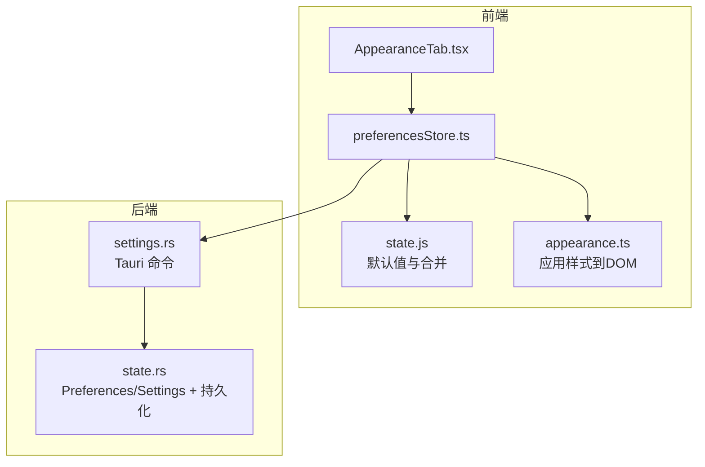
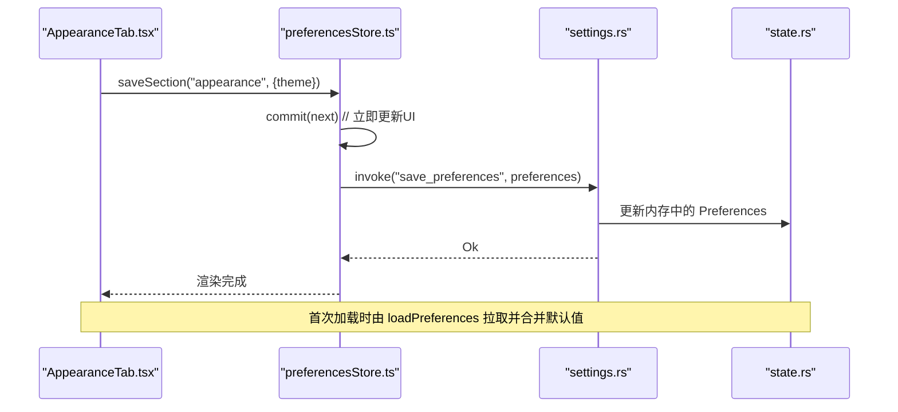
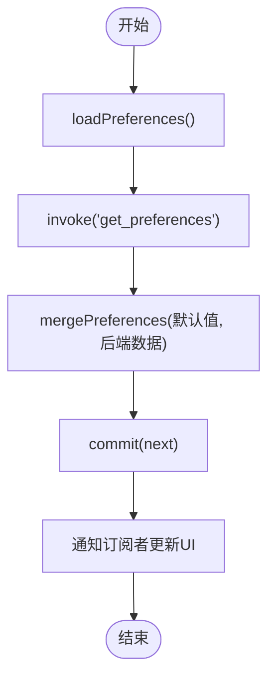
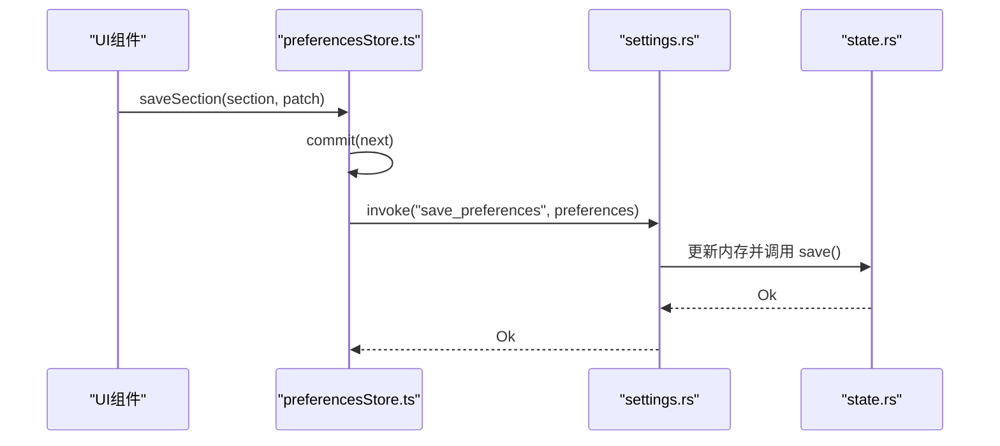
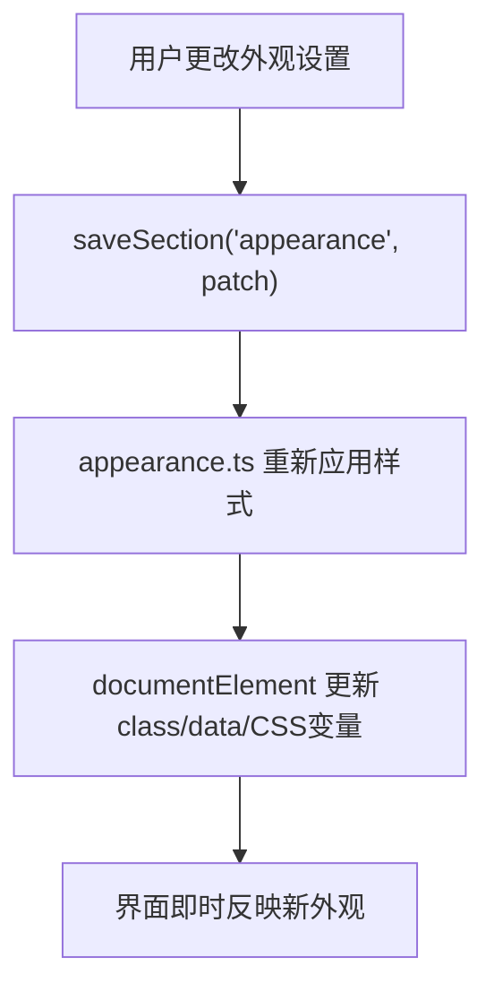
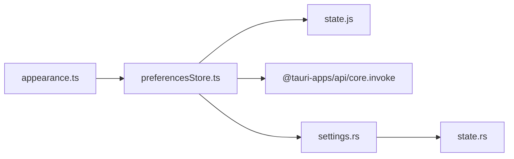

# 偏好设置管理 (preferencesStore)

<cite>
**本文引用的文件**
- [frontend/app/state/preferencesStore.ts](file://frontend/app/state/preferencesStore.ts)
- [frontend/src/js/state.js](file://frontend/src/js/state.js)
- [src-tauri/src/commands/settings.rs](file://src-tauri/src/commands/settings.rs)
- [src-tauri/src/state.rs](file://src-tauri/src/state.rs)
- [frontend/app/views/settings/tabs/AppearanceTab.tsx](file://frontend/app/views/settings/tabs/AppearanceTab.tsx)
- [frontend/app/state/appearance.ts](file://frontend/app/state/appearance.ts)
</cite>

## 目录
1. [简介](#简介)
2. [项目结构](#项目结构)
3. [核心组件](#核心组件)
4. [架构总览](#架构总览)
5. [详细组件分析](#详细组件分析)
6. [依赖关系分析](#依赖关系分析)
7. [性能与可靠性](#性能与可靠性)
8. [故障排查指南](#故障排查指南)
9. [结论](#结论)
10. [附录：实践示例](#附录：实践示例)

## 简介
本文件系统性说明 Codex-Tauri 的偏好设置管理系统，重点围绕前端 preferencesStore 的设计模式、数据结构、持久化与同步机制、默认值与类型、读取/写入/验证流程、版本迁移与兼容性策略，以及错误处理与调试方法。文档同时覆盖后端 Rust 侧的状态存储与 Tauri 命令接口，帮助读者理解从 UI 到持久化的完整链路。

## 项目结构
偏好设置系统横跨前端 React 层与后端 Tauri/Rust 层：
- 前端
  - preferencesStore.ts：React 状态管理与 I/O 封装（加载、订阅、保存）
  - state.js：默认偏好定义与合并逻辑（单点事实来源）
  - appearance.ts：将偏好应用到 DOM（主题、字体、字号、对比度等）
  - AppearanceTab.tsx：外观设置页，演示如何读写偏好
- 后端
  - settings.rs：Tauri 命令 get_preferences/save_preferences 等
  - state.rs：Rust 侧 Preferences/Settings 结构与持久化文件读写

图表来源
- [frontend/app/views/settings/tabs/AppearanceTab.tsx:46-54](file://frontend/app/views/settings/tabs/AppearanceTab.tsx#L46-L54)
- [frontend/app/state/preferencesStore.ts:40-88](file://frontend/app/state/preferencesStore.ts#L40-L88)
- [frontend/src/js/state.js:60-136](file://frontend/src/js/state.js#L60-L136)
- [frontend/app/state/appearance.ts:62-176](file://frontend/app/state/appearance.ts#L62-L176)
- [src-tauri/src/commands/settings.rs:35-52](file://src-tauri/src/commands/settings.rs#L35-L52)
- [src-tauri/src/state.rs:49-64](file://src-tauri/src/state.rs#L49-L64)

章节来源
- [frontend/app/state/preferencesStore.ts:1-94](file://frontend/app/state/preferencesStore.ts#L1-L94)
- [frontend/src/js/state.js:33-136](file://frontend/src/js/state.js#L33-L136)
- [src-tauri/src/commands/settings.rs:1-69](file://src-tauri/src/commands/settings.rs#L1-L69)
- [src-tauri/src/state.rs:27-64](file://src-tauri/src/state.rs#L27-L64)

## 核心组件
- preferencesStore.ts
  - 提供 usePreferences/usePrefSection/getPrefSection 读取偏好
  - 提供 loadPreferences 一次性从后端加载并合并默认值
  - 提供 saveSection 局部更新并持久化整个偏好映射
  - 使用 subscribe/commit 实现最小化重渲染的外部 store
- state.js
  - defaultPreferences() 定义所有偏好分区的默认值（appearance、voice、browser、git、worktrees 等）
  - mergePreferences() 以“默认值优先”的方式合并后端返回数据，保证键存在且类型安全
- settings.rs
  - get_preferences/save_preferences 暴露为 Tauri 命令，读写 Rust 侧 Preferences
- state.rs
  - Preferences 结构体包含固定字段与 extra 动态段（通过 serde(flatten) 保留未知分区）
  - AppState.save() 原子写 shell-state.json（先写临时文件再 rename）

章节来源
- [frontend/app/state/preferencesStore.ts:17-88](file://frontend/app/state/preferencesStore.ts#L17-L88)
- [frontend/src/js/state.js:60-136](file://frontend/src/js/state.js#L60-L136)
- [src-tauri/src/commands/settings.rs:35-52](file://src-tauri/src/commands/settings.rs#L35-L52)
- [src-tauri/src/state.rs:49-64](file://src-tauri/src/state.rs#L49-L64)

## 架构总览
偏好设置的数据流遵循“前端状态驱动 + 后端持久化”的模式：
- 启动时：前端调用 loadPreferences -> Tauri get_preferences -> Rust 读取 shell-state.json -> 返回 Preferences -> 前端 mergePreferences 合并默认值 -> commit 触发 UI 更新
- 用户修改：UI 调用 saveSection(section, patch) -> 本地立即 commit -> 调用 Tauri save_preferences -> Rust 写入内存并持久化
- 样式生效：appearance.ts 订阅偏好变化，将 theme、字体、字号、对比度等应用到 documentElement

图表来源
- [frontend/app/views/settings/tabs/AppearanceTab.tsx:46-54](file://frontend/app/views/settings/tabs/AppearanceTab.tsx#L46-L54)
- [frontend/app/state/preferencesStore.ts:59-88](file://frontend/app/state/preferencesStore.ts#L59-L88)
- [src-tauri/src/commands/settings.rs:35-52](file://src-tauri/src/commands/settings.rs#L35-L52)
- [src-tauri/src/state.rs:176-217](file://src-tauri/src/state.rs#L176-L217)

## 详细组件分析

### 数据结构与默认值
- 前端默认值（state.js）
  - appearance：theme、accent、sidebarStyle、uiFontFamily、codeFontFamily、uiFontSize、codeFontSize、contrast、reduceMotion、pointerCursors、diffMarkers
  - voice：tts、hotkey、keepBar、dictionary、microphone、recent
  - personalization：personality、customInstructions、memoryEnabled
  - pets：selected、directory、size、asleep
  - browser：enabled、openTarget、screenshots、downloads、permissions、developerMode、fullCdpAccess
  - computerUse：anyApp、excel、allowlist
  - git：branchPrefix、mergeMethod、forcePush、draftPR、reviewDelivery、autoMerge、commitInstructions、monitorInstructions、prInstructions
  - environments：projects
  - worktrees：root、autoFetch、autoCleanup、retention
- 后端 Preferences（state.rs）
  - 固定字段：pets_enabled、reduced_motion、compact_mode
  - 动态字段：extra（serde_json::Map），用于承载任意新增分区（如 appearance、voice 等），确保前后端扩展互不阻塞

章节来源
- [frontend/src/js/state.js:60-122](file://frontend/src/js/state.js#L60-L122)
- [src-tauri/src/state.rs:49-64](file://src-tauri/src/state.rs#L49-L64)

### 读取流程与合并策略
- 首次加载
  - loadPreferences 调用 get_preferences，获取后端 Preferences
  - 使用 mergePreferences 将后端数据与默认值按分区合并，缺失键自动补齐
  - commit 后触发 UI 订阅者更新
- 运行时读取
  - usePreferences/usePrefSection 基于 useSyncExternalStore 订阅外部 store，保证 React 渲染一致性
  - getPrefSection 提供非 React 环境下的同步读取

图表来源
- [frontend/app/state/preferencesStore.ts:59-68](file://frontend/app/state/preferencesStore.ts#L59-L68)
- [frontend/src/js/state.js:128-136](file://frontend/src/js/state.js#L128-L136)

章节来源
- [frontend/app/state/preferencesStore.ts:40-68](file://frontend/app/state/preferencesStore.ts#L40-L68)
- [frontend/src/js/state.js:128-136](file://frontend/src/js/state.js#L128-L136)

### 写入流程与持久化
- 局部更新
  - saveSection(section, patch) 将 patch 合并到对应分区，生成新的 Preferences 对象
  - 先 commit 本地状态，再异步调用 save_preferences 持久化
- 后端持久化
  - settings.rs 接收 Preferences，更新 InnerState.preferences
  - 调用 save_ok -> AppState.save() 原子写入 shell-state.json（先写 .tmp 再 rename）

图表来源
- [frontend/app/state/preferencesStore.ts:76-88](file://frontend/app/state/preferencesStore.ts#L76-L88)
- [src-tauri/src/commands/settings.rs:45-52](file://src-tauri/src/commands/settings.rs#L45-L52)
- [src-tauri/src/state.rs:209-217](file://src-tauri/src/state.rs#L209-L217)

章节来源
- [frontend/app/state/preferencesStore.ts:70-88](file://frontend/app/state/preferencesStore.ts#L70-L88)
- [src-tauri/src/commands/settings.rs:45-52](file://src-tauri/src/commands/settings.rs#L45-L52)
- [src-tauri/src/state.rs:209-217](file://src-tauri/src/state.rs#L209-L217)

### 样式应用与同步
- appearance.ts 负责将偏好应用到 documentElement：
  - applyTheme：根据 theme 设置 theme-dark/theme-light 类
  - applyAppearanceVars：设置字体、字号、对比度、动效、光标、差异标记等 data-* 属性或 CSS 变量
  - startAppearance：初始化并订阅偏好变化，监听系统主题切换
- AppearanceTab.tsx 通过 saveSection 更新 appearance 分区，并通过 emitShellEvent 触发壳层事件

图表来源
- [frontend/app/views/settings/tabs/AppearanceTab.tsx:46-54](file://frontend/app/views/settings/tabs/AppearanceTab.tsx#L46-L54)
- [frontend/app/state/appearance.ts:62-176](file://frontend/app/state/appearance.ts#L62-L176)

章节来源
- [frontend/app/state/appearance.ts:62-176](file://frontend/app/state/appearance.ts#L62-L176)
- [frontend/app/views/settings/tabs/AppearanceTab.tsx:46-54](file://frontend/app/views/settings/tabs/AppearanceTab.tsx#L46-L54)

### 版本迁移与数据兼容性
- 前端合并策略
  - mergePreferences 以默认值为基线，仅用后端数据覆盖已有键，确保新增字段有默认值，旧字段不会丢失
- 后端兼容
  - Preferences.extra 使用 serde(flatten) 保留未知分区，新增分区无需后端改动即可持久化
- 启动默认值兜底
  - Rust 侧在加载时为空字段提供默认值（如 theme、language），避免空配置导致异常

章节来源
- [frontend/src/js/state.js:128-136](file://frontend/src/js/state.js#L128-L136)
- [src-tauri/src/state.rs:49-64](file://src-tauri/src/state.rs#L49-L64)
- [src-tauri/src/state.rs:176-207](file://src-tauri/src/state.rs#L176-L207)

## 依赖关系分析
- 前端依赖
  - preferencesStore.ts 依赖 @tauri-apps/api/core.invoke 与 React hooks
  - 依赖 state.js 的默认值与合并函数
  - appearance.ts 依赖 preferencesStore 的读取与订阅能力
- 后端依赖
  - settings.rs 依赖 state.rs 的 AppState/Preferences
  - state.rs 依赖文件系统与序列化库进行持久化

图表来源
- [frontend/app/state/preferencesStore.ts:13-15](file://frontend/app/state/preferencesStore.ts#L13-L15)
- [src-tauri/src/commands/settings.rs:1-2](file://src-tauri/src/commands/settings.rs#L1-L2)
- [src-tauri/src/state.rs:1-7](file://src-tauri/src/state.rs#L1-L7)

章节来源
- [frontend/app/state/preferencesStore.ts:13-15](file://frontend/app/state/preferencesStore.ts#L13-L15)
- [src-tauri/src/commands/settings.rs:1-2](file://src-tauri/src/commands/settings.rs#L1-L2)
- [src-tauri/src/state.rs:1-7](file://src-tauri/src/state.rs#L1-L7)

## 性能与可靠性
- 性能
  - 局部更新：saveSection 仅合并变更分区，减少不必要的全量重写
  - 合并策略：mergePreferences 按分区合并，避免深层拷贝开销
  - 样式应用：appearance.ts 仅在偏好变化时更新必要 CSS 变量与 data-* 属性
- 可靠性
  - 原子写入：Rust 侧先写临时文件再 rename，降低损坏风险
  - 容错加载：loadPreferences 捕获异常并使用默认值，避免白屏
  - 并发安全：InnerState 使用 Mutex 保护共享状态

章节来源
- [src-tauri/src/state.rs:209-217](file://src-tauri/src/state.rs#L209-L217)
- [frontend/app/state/preferencesStore.ts:59-68](file://frontend/app/state/preferencesStore.ts#L59-L68)
- [frontend/src/js/state.js:128-136](file://frontend/src/js/state.js#L128-L136)

## 故障排查指南
- 常见问题定位
  - 加载失败：检查控制台警告 "[preferences] load failed; using defaults"，确认后端服务可用
  - 保存失败：检查控制台错误 "[preferences] save failed"，确认 Tauri 命令权限与路径可写
  - 样式未生效：确认 appearance.ts 已启动并订阅偏好变化；检查 theme 与 data-* 属性是否正确设置
- 调试建议
  - 在 AppearanceTab 中打印当前 appearance 分区，确认 patch 正确
  - 在浏览器 DevTools 中观察 documentElement 的 class/data-* 属性变化
  - 查看 shell-state.json 是否被更新（位于配置目录）

章节来源
- [frontend/app/state/preferencesStore.ts:59-88](file://frontend/app/state/preferencesStore.ts#L59-L88)
- [frontend/app/state/appearance.ts:152-176](file://frontend/app/state/appearance.ts#L152-L176)
- [src-tauri/src/state.rs:176-217](file://src-tauri/src/state.rs#L176-L217)

## 结论
preferencesStore 通过“默认值合并 + 分区化存储 + 原子持久化”的设计，实现了可扩展、健壮且高性能的偏好设置管理。前端以 React 外部 store 模式提供响应式读取，后端以灵活结构体与扁平化字段支持未来扩展。整体架构清晰、职责分明，便于维护与演进。

## 附录：实践示例
以下示例展示如何在项目中添加新偏好项、读取与更新设置值，以及如何处理错误与调试。

- 添加新的偏好设置项
  - 在前端默认值中添加新分区或字段（state.js 的 defaultPreferences）
  - 在相应设置页调用 saveSection("yourSection", { newKey: value }) 写入
  - 若需后端识别，可在 Rust Preferences 增加字段或使用 extra 动态段（无需后端改动）
  - 参考路径
    - [frontend/src/js/state.js:60-122](file://frontend/src/js/state.js#L60-L122)
    - [frontend/app/state/preferencesStore.ts:76-88](file://frontend/app/state/preferencesStore.ts#L76-L88)
    - [src-tauri/src/state.rs:49-64](file://src-tauri/src/state.rs#L49-L64)

- 读取用户偏好
  - 在 React 组件中使用 usePrefSection<T>("section") 获取合并后的分区
  - 在非 React 场景使用 getPrefSection("section") 同步读取
  - 参考路径
    - [frontend/app/state/preferencesStore.ts:45-53](file://frontend/app/state/preferencesStore.ts#L45-L53)

- 更新设置值
  - 调用 saveSection("section", { key: newValue }) 进行局部更新并持久化
  - 如需全局设置（如语言、主题），可通过 appStore 的 saveSettings 配合
  - 参考路径
    - [frontend/app/views/settings/tabs/AppearanceTab.tsx:46-54](file://frontend/app/views/settings/tabs/AppearanceTab.tsx#L46-L54)
    - [frontend/app/state/preferencesStore.ts:76-88](file://frontend/app/state/preferencesStore.ts#L76-L88)

- 错误处理与调试
  - 捕获 load/save 异常并降级到默认值
  - 使用 console.warn/error 输出日志，结合 DevTools 检查 DOM 属性与配置文件
  - 参考路径
    - [frontend/app/state/preferencesStore.ts:59-88](file://frontend/app/state/preferencesStore.ts#L59-L88)
    - [frontend/app/state/appearance.ts:152-176](file://frontend/app/state/appearance.ts#L152-L176)