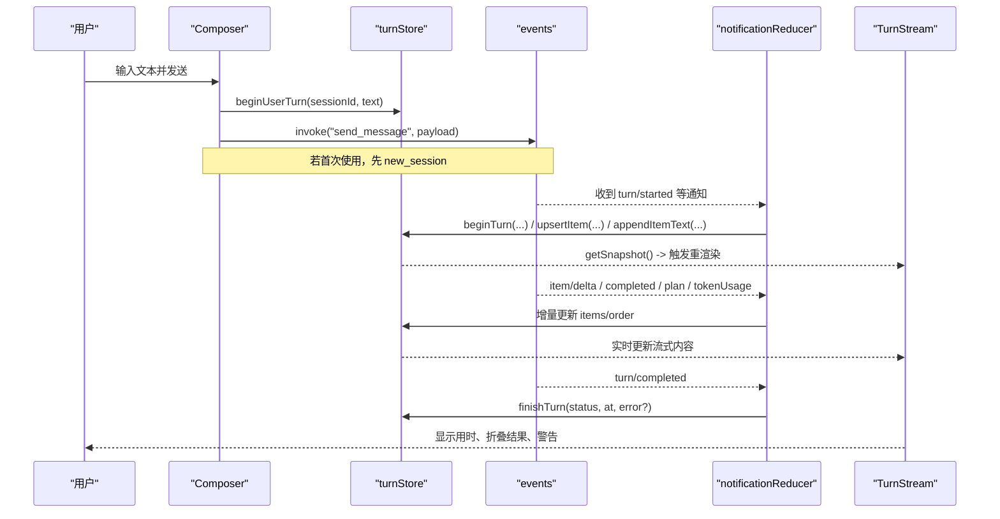
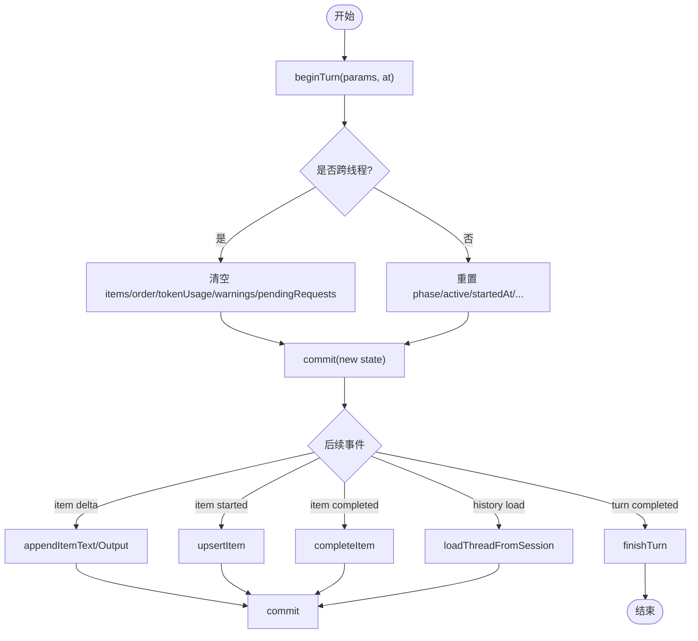
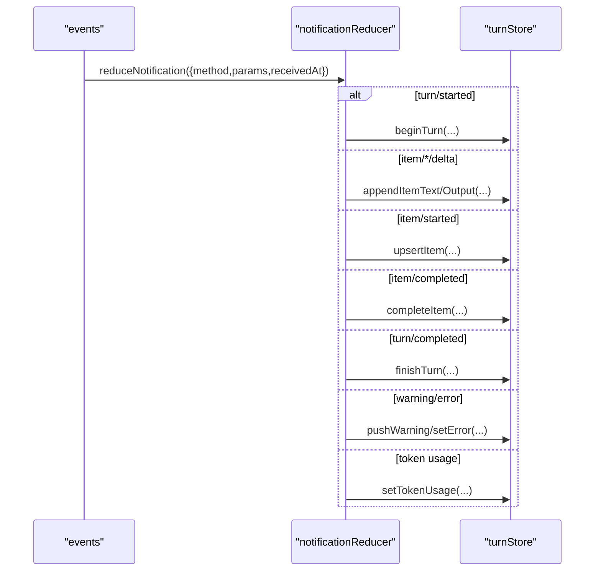
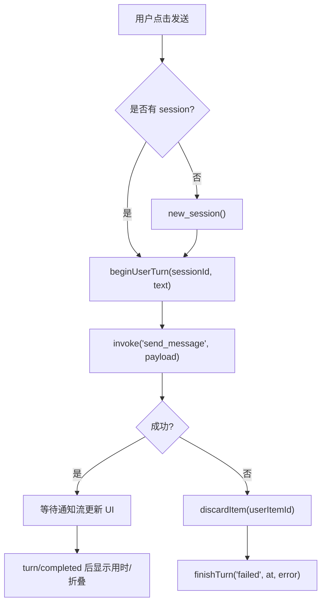
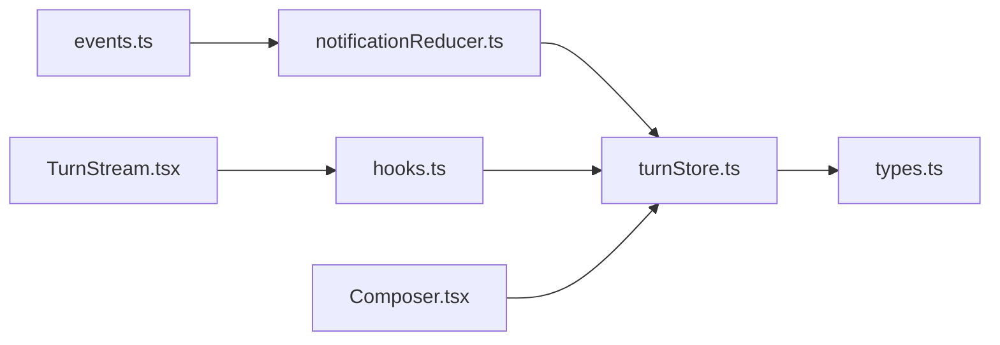

# 对话轮次管理 (turnStore)

<cite>
**本文引用的文件**
- [frontend/app/state/turnStore.ts](file://frontend/app/state/turnStore.ts)
- [frontend/app/state/types.ts](file://frontend/app/state/types.ts)
- [frontend/app/state/hooks.ts](file://frontend/app/state/hooks.ts)
- [frontend/app/bridge/events.ts](file://frontend/app/bridge/events.ts)
- [frontend/app/state/notificationReducer.ts](file://frontend/app/state/notificationReducer.ts)
- [frontend/app/views/TurnStream.tsx](file://frontend/app/views/TurnStream.tsx)
- [frontend/app/views/Composer.tsx](file://frontend/app/views/Composer.tsx)
- [frontend/app/state/mockTurn.ts](file://frontend/app/state/mockTurn.ts)
</cite>

## 目录
1. [简介](#简介)
2. [项目结构](#项目结构)
3. [核心组件](#核心组件)
4. [架构总览](#架构总览)
5. [详细组件分析](#详细组件分析)
6. [依赖关系分析](#依赖关系分析)
7. [性能考量](#性能考量)
8. [故障排查指南](#故障排查指南)
9. [结论](#结论)
10. [附录：使用示例与最佳实践](#附录使用示例与最佳实践)

## 简介
本文件围绕 Codex-Tauri 前端的“对话轮次状态管理”展开，聚焦 turnStore 的单一事实源设计、消息轮次的创建/更新/删除、实时消息流处理（事件桥 + 通知归约）、以及历史加载策略。文档同时给出数据模型、关键流程时序图、流程图和性能优化建议，帮助读者快速理解并正确使用该子系统。

## 项目结构
- 状态层
  - turnStore：全局不可变状态与变更操作（beginTurn、upsertItem、appendItemText、finishTurn 等）
  - types：TurnState、TurnItem、TokenUsage、PlanStep、ServerWarning、PendingRequest 等类型定义
  - hooks：React 绑定 useTurnState/useTurnItems/useTurnActive 等
- 事件与协议
  - events：Tauri 事件桥，统一订阅所有 NOTIFICATION_METHODS 与服务器请求通道
  - notificationReducer：将服务端通知映射为 turnStore 动作
- UI 层
  - Composer：用户输入、发送消息、错误回滚、模拟回合
  - TurnStream：渲染当前轮次、计时、折叠、警告展示
  - mockTurn：前端模拟通知序列，用于演示与对比

```mermaid
graph TB
subgraph "UI"
C["Composer"]
TS["TurnStream"]
end
subgraph "状态"
HS["hooks.ts"]
TS_store["turnStore.ts"]
TYP["types.ts"]
end
subgraph "事件"
EV["events.ts"]
NR["notificationReducer.ts"]
end
C --> |调用 beginUserTurn/send_message| TS_store
C --> |finishTurn(失败时)| TS_store
TS --> |useTurnState/useTurnItems| HS
HS --> |subscribe/getSnapshot| TS_store
EV --> |onNotification| NR
NR --> |reduceNotification| TS_store
TS_store --> |getSnapshot| HS
```

图表来源
- [frontend/app/state/turnStore.ts:1-467](file://frontend/app/state/turnStore.ts#L1-L467)
- [frontend/app/state/hooks.ts:1-43](file://frontend/app/state/hooks.ts#L1-L43)
- [frontend/app/bridge/events.ts:1-172](file://frontend/app/bridge/events.ts#L1-L172)
- [frontend/app/state/notificationReducer.ts:1-446](file://frontend/app/state/notificationReducer.ts#L1-L446)

章节来源
- [frontend/app/state/turnStore.ts:1-467](file://frontend/app/state/turnStore.ts#L1-L467)
- [frontend/app/state/types.ts:1-146](file://frontend/app/state/types.ts#L1-L146)
- [frontend/app/state/hooks.ts:1-43](file://frontend/app/state/hooks.ts#L1-L43)
- [frontend/app/bridge/events.ts:1-172](file://frontend/app/bridge/events.ts#L1-L172)
- [frontend/app/state/notificationReducer.ts:1-446](file://frontend/app/state/notificationReducer.ts#L1-L446)
- [frontend/app/views/TurnStream.tsx:1-187](file://frontend/app/views/TurnStream.tsx#L1-L187)
- [frontend/app/views/Composer.tsx:1-800](file://frontend/app/views/Composer.tsx#L1-L800)
- [frontend/app/state/mockTurn.ts:1-153](file://frontend/app/state/mockTurn.ts#L1-L153)

## 核心组件
- turnStore
  - 职责：维护 TurnState；提供 beginTurn、beginUserTurn、upsertItem、appendItemText、appendItemOutput、completeItem、finishTurn、loadThreadFromSession 等原子操作；通过 subscribe/getSnapshot 暴露给 React。
  - 关键特性：
    - 以 items[id] + order[] 实现 O(1) 查找与稳定渲染顺序
    - 严格区分“会话内切换”与“跨线程切换”，避免误清历史
    - 乐观插入用户消息气泡，失败时仅丢弃该气泡而不破坏历史
- types
  - 定义 TurnItem、TurnState、TokenUsage、PlanStep、ServerWarning、PendingRequest 等数据结构
- hooks
  - 基于 useSyncExternalStore 将高频率通知流与 React 解耦，避免不必要的重渲染
- events
  - 统一监听所有通知方法，封装为 NotificationEnvelope，转发给处理器
- notificationReducer
  - 将每种通知映射到 turnStore 的具体动作，保证“所见即所得”（不本地臆造状态）
- Composer / TurnStream
  - Composer：发起 send_message、错误回滚、模拟回合
  - TurnStream：渲染当前轮次、计算耗时、折叠已完成的工具流、展示警告

章节来源
- [frontend/app/state/turnStore.ts:1-467](file://frontend/app/state/turnStore.ts#L1-L467)
- [frontend/app/state/types.ts:1-146](file://frontend/app/state/types.ts#L1-L146)
- [frontend/app/state/hooks.ts:1-43](file://frontend/app/state/hooks.ts#L1-L43)
- [frontend/app/bridge/events.ts:1-172](file://frontend/app/bridge/events.ts#L1-L172)
- [frontend/app/state/notificationReducer.ts:1-446](file://frontend/app/state/notificationReducer.ts#L1-L446)
- [frontend/app/views/Composer.tsx:1-800](file://frontend/app/views/Composer.tsx#L1-L800)
- [frontend/app/views/TurnStream.tsx:1-187](file://frontend/app/views/TurnStream.tsx#L1-L187)

## 架构总览
下图展示了从用户输入到 UI 渲染的完整链路：



图表来源
- [frontend/app/views/Composer.tsx:711-785](file://frontend/app/views/Composer.tsx#L711-L785)
- [frontend/app/bridge/events.ts:145-159](file://frontend/app/bridge/events.ts#L145-L159)
- [frontend/app/state/notificationReducer.ts:189-446](file://frontend/app/state/notificationReducer.ts#L189-L446)
- [frontend/app/state/turnStore.ts:71-256](file://frontend/app/state/turnStore.ts#L71-L256)
- [frontend/app/views/TurnStream.tsx:64-187](file://frontend/app/views/TurnStream.tsx#L64-L187)

## 详细组件分析

### turnStore：状态机与数据流
- 状态结构
  - TurnState：包含 sessionId、turnId、active、phase、items、order、时间戳、error、reconnectAttempt/Frozen、tokenUsage、plan、warnings、pendingRequests
  - TurnItem：id、type、status、text/output/progress、阶段、命令参数、MCP 信息、时间戳、错误
- 生命周期
  - beginTurn：重置轮次级字段；仅在“跨线程切换”时清空 items/order/tokenUsage/warnings/pendingRequests
  - beginUserTurn：立即插入乐观用户气泡，返回 id 以便失败回滚
  - upsertItem/appendItemText/appendItemOutput：增量追加文本或输出，自动创建缺失项
  - completeItem：标记完成并计算 durationMs
  - finishTurn：关闭轮次，记录状态、耗时、错误
  - loadThreadFromSession：从 get_session 与 get_runtime_events 恢复历史，优先 thread.messages，否则 timeline；必要时注入 preview 作为首条用户消息
- 并发与一致性
  - commit 集中提交，遍历 listeners 触发更新
  - 使用 Set 保存订阅者，避免重复订阅
  - userSeq 防止 back-to-back 发送的用户气泡 ID 冲突



图表来源
- [frontend/app/state/turnStore.ts:71-256](file://frontend/app/state/turnStore.ts#L71-L256)
- [frontend/app/state/turnStore.ts:328-467](file://frontend/app/state/turnStore.ts#L328-L467)

章节来源
- [frontend/app/state/turnStore.ts:1-467](file://frontend/app/state/turnStore.ts#L1-L467)
- [frontend/app/state/types.ts:1-146](file://frontend/app/state/types.ts#L1-L146)

### 事件桥与通知归约
- events
  - startEventBridge：并行绑定所有 NOTIFICATION_METHODS，并监听 approval/user-input 两个固定通道
  - tauriEventName：将协议方法名转换为 Tauri 事件名（替换 . 与 /）
  - onNotification/onServerRequest：分发通知与请求至处理器集合
- notificationReducer
  - reduceNotification：根据 method 分派到具体 turnStore 动作
  - 支持 item/started、item/completed、各类 delta、turn 生命周期、tokenUsage、warning/error、hook 等
  - 对未知但协议存在的方法，推入 warnings，便于可见性追踪
  - 对“环境型”通知（如 thread/realtime/*）归类为 AMBIENT_METHODS，不直接渲染到 turn stream



图表来源
- [frontend/app/bridge/events.ts:145-159](file://frontend/app/bridge/events.ts#L145-L159)
- [frontend/app/state/notificationReducer.ts:189-446](file://frontend/app/state/notificationReducer.ts#L189-L446)

章节来源
- [frontend/app/bridge/events.ts:1-172](file://frontend/app/bridge/events.ts#L1-L172)
- [frontend/app/state/notificationReducer.ts:1-446](file://frontend/app/state/notificationReducer.ts#L1-L446)

### UI 渲染与交互
- Composer
  - 发送流程：若无 session 则 new_session；随后 beginUserTurn 插入乐观气泡；调用 send_message；异常时 discardItem(userItemId) 并 finishTurn("failed", ...)
  - 中断：cancelMockTurn 或 interrupt_session
- TurnStream
  - 头部状态机：thinking → live → done；基于 active/startedAt/durationMs 计算
  - 折叠：已完成轮次可折叠工具流，保留用户气泡可见
  - 警告：渲染 warnings 列表



图表来源
- [frontend/app/views/Composer.tsx:711-785](file://frontend/app/views/Composer.tsx#L711-L785)
- [frontend/app/views/TurnStream.tsx:64-187](file://frontend/app/views/TurnStream.tsx#L64-L187)

章节来源
- [frontend/app/views/Composer.tsx:1-800](file://frontend/app/views/Composer.tsx#L1-L800)
- [frontend/app/views/TurnStream.tsx:1-187](file://frontend/app/views/TurnStream.tsx#L1-L187)

### 历史加载策略
- 优先使用 thread.messages；若为空，则回退到 get_runtime_events 的 timeline
- 对每条消息/条目进行 blockType 映射，生成 TurnItem 并加入 items/order
- 若最终仍无内容，且存在 preview，则注入一条“预览用户消息”
- 加载完成后，state 处于 inactive/idle，等待新的 turn

章节来源
- [frontend/app/state/turnStore.ts:328-467](file://frontend/app/state/turnStore.ts#L328-L467)

## 依赖关系分析
- 松耦合
  - turnStore 不依赖 React，通过 subscribe/getSnapshot 暴露
  - events 只负责事件分发，不关心业务逻辑
  - notificationReducer 唯一职责是将通知映射为 store 动作
- 外部依赖
  - @tauri-apps/api/core/event：invoke/listen
  - @protocol/status：ItemStatus、TurnPhase
  - 生成的 NOTIFICATION_METHODS/SERVER_REQUEST_METHODS
- 潜在循环
  - 无直接循环导入；store 被 reducer 调用，reducer 不被 store 反向引用



图表来源
- [frontend/app/state/turnStore.ts:1-467](file://frontend/app/state/turnStore.ts#L1-L467)
- [frontend/app/state/notificationReducer.ts:1-446](file://frontend/app/state/notificationReducer.ts#L1-L446)
- [frontend/app/bridge/events.ts:1-172](file://frontend/app/bridge/events.ts#L1-L172)
- [frontend/app/state/hooks.ts:1-43](file://frontend/app/state/hooks.ts#L1-L43)
- [frontend/app/views/Composer.tsx:1-800](file://frontend/app/views/Composer.tsx#L1-L800)
- [frontend/app/views/TurnStream.tsx:1-187](file://frontend/app/views/TurnStream.tsx#L1-L187)

## 性能考量
- 渲染性能
  - 使用 items[id]+order[] 保证 O(1) 查找与稳定顺序，减少重排
  - hooks 使用 useSyncExternalStore，避免高频通知导致的上下文传播开销
  - TurnStream 中仅对活跃轮次启动定时器（~4Hz），降低空闲刷新成本
- 内存优化
  - 跨线程切换时清空 items/order 等，避免历史泄漏
  - 历史加载采用“按需构建”模式，仅构造必要字段
  - 进度消息使用数组累积，注意在长轮次中控制长度（可在上层做截断策略）
- 网络与事件
  - events 并行绑定所有通知通道，缩短启动延迟
  - 对未知方法记录 warning，避免静默丢失导致的问题定位困难
- 建议
  - 对超长文本/输出考虑分页或虚拟滚动（在视图层）
  - 对 progress 列表增加上限与去重策略
  - 对大 history 加载可考虑分批渲染或懒加载

[本节为通用指导，无需特定文件来源]

## 故障排查指南
- 常见问题
  - 发送失败：检查 Composer 的错误分支，确认 discardItem 与 finishTurn("failed") 是否执行
  - 历史未显示：确认 loadThreadFromSession 是否正确读取 messages/timeline，并正确映射 blockType
  - 通知未生效：检查 events 是否成功绑定对应 channel，以及 notificationReducer 是否覆盖该方法
  - 状态不同步：确认 turnStore 的 commit 是否被调用，以及 React 是否通过 useSyncExternalStore 订阅
- 调试要点
  - 查看 TurnStream 的 warnings 列表，了解未处理的通知或配置警告
  - 关注 beginTurn 的“跨线程切换”日志，确保历史清理符合预期
  - 使用 mockTurn 验证 UI 渲染路径是否正常

章节来源
- [frontend/app/views/Composer.tsx:711-785](file://frontend/app/views/Composer.tsx#L711-L785)
- [frontend/app/state/turnStore.ts:71-107](file://frontend/app/state/turnStore.ts#L71-L107)
- [frontend/app/state/notificationReducer.ts:437-446](file://frontend/app/state/notificationReducer.ts#L437-L446)
- [frontend/app/views/TurnStream.tsx:171-187](file://frontend/app/views/TurnStream.tsx#L171-L187)

## 结论
turnStore 以“单一事实源 + 纯函数式更新”为核心，结合事件桥与通知归约，实现了高吞吐、低耦合的对话轮次状态管理。其乐观插入、严格的历史隔离、稳定的渲染顺序与完善的错误处理，使其既能支撑实时流式体验，又能可靠地承载历史回放。配合 hooks 与 UI 组件，整体架构清晰、可扩展性强。

[本节为总结，无需特定文件来源]

## 附录：使用示例与最佳实践

- 创建新对话并发送消息
  - 步骤
    - 若无 session：调用 new_session
    - 调用 beginUserTurn(sessionId, text) 插入乐观气泡
    - 调用 send_message 发送
    - 等待 turn/started 与 item 通知流驱动 UI
  - 参考路径
    - [frontend/app/views/Composer.tsx:711-785](file://frontend/app/views/Composer.tsx#L711-L785)
    - [frontend/app/state/turnStore.ts:118-133](file://frontend/app/state/turnStore.ts#L118-L133)

- 接收响应与流式更新
  - 事件桥接收通知 → notificationReducer 映射 → turnStore 增量更新 → hooks 订阅 → TurnStream 渲染
  - 参考路径
    - [frontend/app/bridge/events.ts:145-159](file://frontend/app/bridge/events.ts#L145-L159)
    - [frontend/app/state/notificationReducer.ts:276-357](file://frontend/app/state/notificationReducer.ts#L276-L357)
    - [frontend/app/state/turnStore.ts:159-207](file://frontend/app/state/turnStore.ts#L159-L207)

- 处理异常情况
  - 发送失败：discardItem(userItemId) + finishTurn("failed", at, error)
  - 未知通知：会在 warnings 中体现，便于定位
  - 参考路径
    - [frontend/app/views/Composer.tsx:762-769](file://frontend/app/views/Composer.tsx#L762-L769)
    - [frontend/app/state/notificationReducer.ts:437-446](file://frontend/app/state/notificationReducer.ts#L437-L446)

- 加载历史
  - 调用 loadThreadFromSession(sessionId)，内部会尝试 messages 与 timeline，并在必要时注入 preview
  - 参考路径
    - [frontend/app/state/turnStore.ts:328-467](file://frontend/app/state/turnStore.ts#L328-L467)

- 最佳实践
  - 始终通过 beginTurn/upsertItem/appendItemText/completeItem/finishTurn 等 API 更新状态，不要直接修改 state
  - 对高频流式内容（文本/输出/progress）使用 append* 系列接口，避免整段重建
  - 在跨线程切换时依赖 beginTurn 的内置清理逻辑，避免手动维护历史
  - 利用 TurnStream 的折叠能力提升长对话的可读性
  - 使用 hooks 订阅派生数据，减少不必要重渲染

[本节为实践指导，无需特定文件来源]