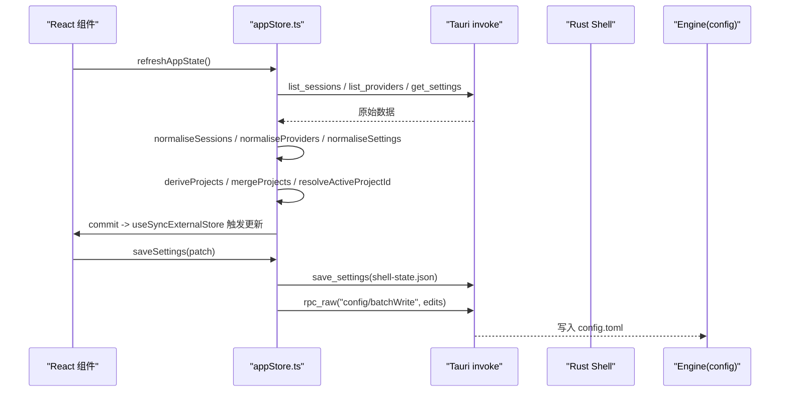
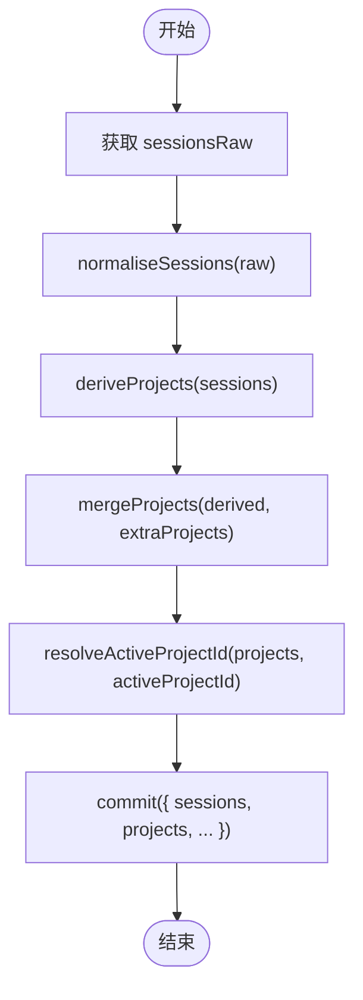
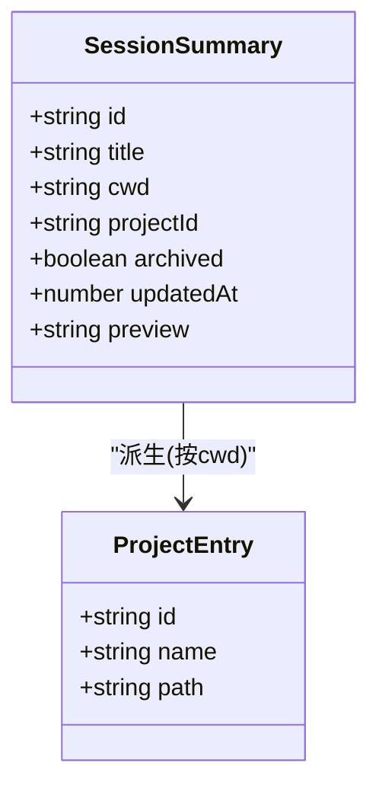
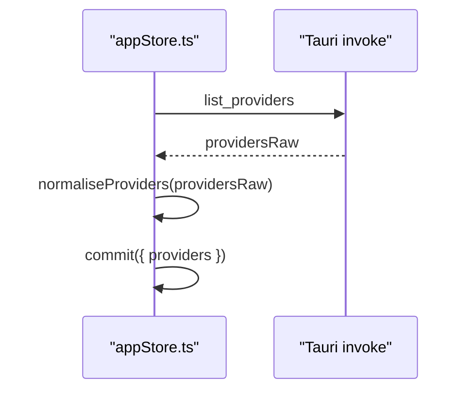
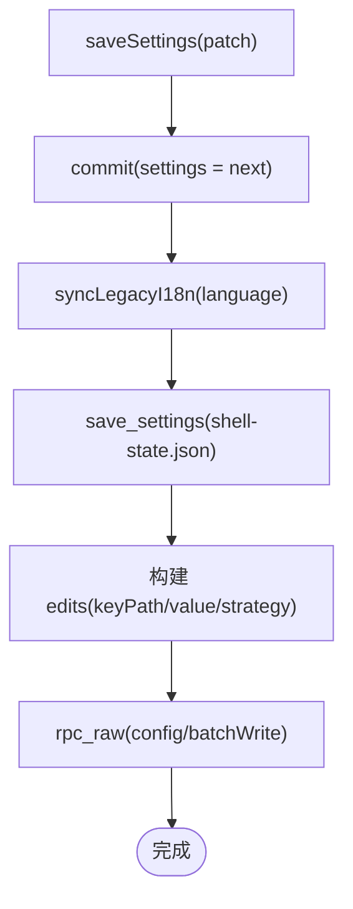
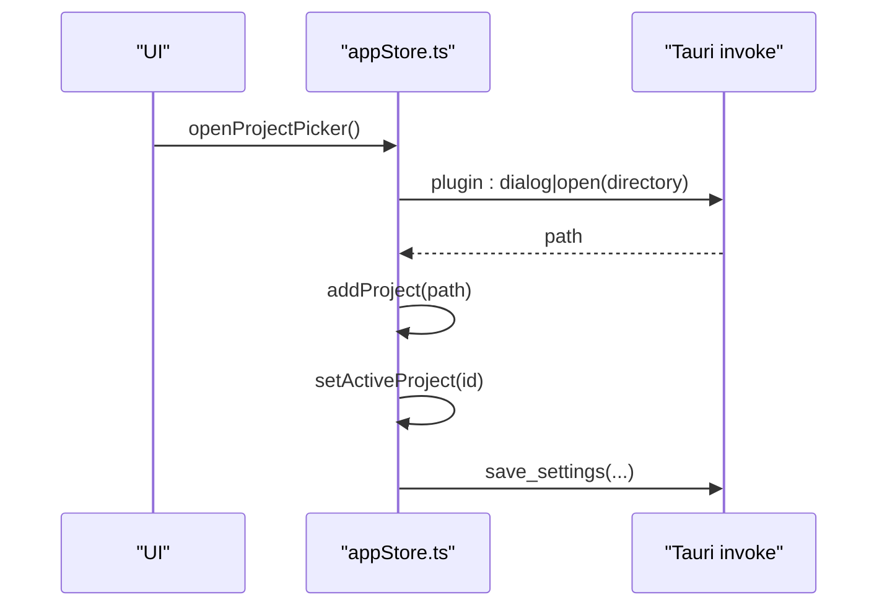
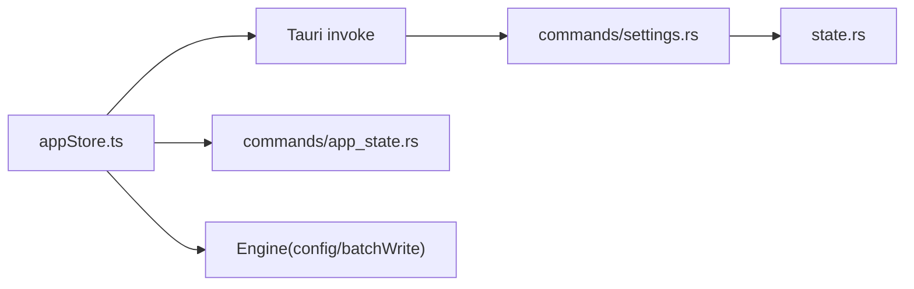

# 应用状态管理 (appStore)

<cite>
**本文引用的文件**
- [frontend/app/state/appStore.ts](file://frontend/app/state/appStore.ts)
- [frontend/app/state/types.ts](file://frontend/app/state/types.ts)
- [frontend/app/state/hooks.ts](file://frontend/app/state/hooks.ts)
- [frontend/app/state/turnStore.ts](file://frontend/app/state/turnStore.ts)
- [frontend/app/state/preferencesStore.ts](file://frontend/app/state/preferencesStore.ts)
- [src-tauri/src/state.rs](file://src-tauri/src/state.rs)
- [src-tauri/src/commands/settings.rs](file://src-tauri/src/commands/settings.rs)
- [src-tauri/src/commands/app_state.rs](file://src-tauri/src/commands/app_state.rs)
</cite>

## 目录
1. [简介](#简介)
2. [项目结构](#项目结构)
3. [核心组件](#核心组件)
4. [架构总览](#架构总览)
5. [详细组件分析](#详细组件分析)
6. [依赖关系分析](#依赖关系分析)
7. [性能考虑](#性能考虑)
8. [故障排查指南](#故障排查指南)
9. [结论](#结论)
10. [附录](#附录)

## 简介
本模块为 Codex-Tauri 的前端应用状态管理中心，围绕会话（sessions）、项目（projects）、提供商（providers）与设置（settings）进行统一建模、规范化、派生与持久化。其核心设计要点包括：
- 使用 useSyncExternalStore 将外部 store 接入 React，避免高频更新导致的渲染风暴。
- 会话数据从后端拉取并规范化；项目列表由会话 cwd 派生；提供商信息同步到前端。
- 设置采用“双写”策略：shell-state.json（本地 shell 配置）与 engine 的 config.toml（通过 batchWrite 写入引擎配置）。
- 提供清晰的订阅/更新机制与错误处理路径，确保 UI 始终可响应且具备容错能力。

## 项目结构
前端状态管理集中在 frontend/app/state 目录下，关键文件职责如下：
- appStore.ts：应用级状态（会话、项目、提供商、设置），对外暴露 useAppState 与一系列 action。
- types.ts：流式对话（turn）相关的数据模型定义。
- hooks.ts：基于 turnStore 的 React 绑定，提供细粒度选择器。
- turnStore.ts：运行中对话的状态机，维护 items、order、阶段等。
- preferencesStore.ts：偏好设置的分段存储与持久化。

Rust 侧负责本地状态持久化与命令暴露：
- state.rs：定义 Settings、Preferences 等数据结构，实现 AppState 的加载、保存与快照。
- commands/settings.rs：暴露 get_settings/save_settings/get_preferences/save_preferences 等命令。
- commands/app_state.rs：暴露 get_state/check_dependencies 等诊断命令。

```mermaid
graph TB
subgraph "前端"
A["appStore.ts"]
B["turnStore.ts"]
C["preferencesStore.ts"]
D["hooks.ts"]
end
subgraph "Rust Shell"
E["state.rs"]
F["commands/settings.rs"]
G["commands/app_state.rs"]
end
A --> |invoke save_settings / rpc_raw| F
A --> |invoke get_settings| F
A --> |invoke list_sessions / list_providers| G
B --> |invoke get_session / get_runtime_events| G
C --> |invoke get_preferences / save_preferences| F
E < --> F
```

图表来源
- [frontend/app/state/appStore.ts:130-155](file://frontend/app/state/appStore.ts#L130-L155)
- [frontend/app/state/turnStore.ts:28-49](file://frontend/app/state/turnStore.ts#L28-L49)
- [frontend/app/state/preferencesStore.ts:20-43](file://frontend/app/state/preferencesStore.ts#L20-L43)
- [src-tauri/src/state.rs:176-231](file://src-tauri/src/state.rs#L176-L231)
- [src-tauri/src/commands/settings.rs:8-52](file://src-tauri/src/commands/settings.rs#L8-L52)
- [src-tauri/src/commands/app_state.rs:5-8](file://src-tauri/src/commands/app_state.rs#L5-L8)

章节来源
- [frontend/app/state/appStore.ts:1-155](file://frontend/app/state/appStore.ts#L1-L155)
- [frontend/app/state/turnStore.ts:1-49](file://frontend/app/state/turnStore.ts#L1-L49)
- [frontend/app/state/preferencesStore.ts:1-43](file://frontend/app/state/preferencesStore.ts#L1-L43)
- [src-tauri/src/state.rs:176-231](file://src-tauri/src/state.rs#L176-L231)
- [src-tauri/src/commands/settings.rs:1-69](file://src-tauri/src/commands/settings.rs#L1-L69)
- [src-tauri/src/commands/app_state.rs:1-62](file://src-tauri/src/commands/app_state.rs#L1-L62)

## 核心组件
- 应用状态（AppState）：包含 sessions、projects、providers、settings、activeSessionId、activeProjectId、extraProjects、engineStatus、loaded、error。
- 会话（SessionSummary）：id、title、cwd、projectId、archived、updatedAt、preview。
- 项目（ProjectEntry）：id（cwd）、name、path。
- 提供商（ProviderEntry）：id、name、models、hasApiKey、protocol、baseUrl。
- 设置（SettingsState）：activeModel、activeProviderId、modelReasoningEffort、approvalPolicy、fullAccess、sidebarCollapsed、language、sandbox、webSearch、outputVerbosity、reasoningSummary、activeProjectPath。
- 引擎状态（EngineStatus）：connected、initialize。

这些类型在 appStore.ts 中集中定义，并通过 useSyncExternalStore 暴露给 React 组件。

章节来源
- [frontend/app/state/appStore.ts:31-113](file://frontend/app/state/appStore.ts#L31-L113)

## 架构总览
appStore 采用“外部 store + React 订阅”的模式：
- 外部 store：一个全局 state 对象，配合 listeners Set 实现发布-订阅。
- React 集成：useSyncExternalStore(subscribe, getSnapshot, getSnapshot) 订阅变更并触发重渲染。
- 数据源：所有数据来自后端（list_sessions、list_providers、get_settings），前端不预置种子数据。
- 派生逻辑：项目列表由会话 cwd 去重派生；活动项目优先从 settings.activeProjectPath 恢复。
- 持久化：设置变更先落盘 shell-state.json，再调用 engine 的 config/batchWrite 写入 config.toml。



图表来源
- [frontend/app/state/appStore.ts:378-408](file://frontend/app/state/appStore.ts#L378-L408)
- [frontend/app/state/appStore.ts:446-511](file://frontend/app/state/appStore.ts#L446-L511)
- [src-tauri/src/commands/settings.rs:18-33](file://src-tauri/src/commands/settings.rs#L18-L33)

章节来源
- [frontend/app/state/appStore.ts:130-155](file://frontend/app/state/appStore.ts#L130-L155)
- [frontend/app/state/appStore.ts:378-408](file://frontend/app/state/appStore.ts#L378-L408)
- [frontend/app/state/appStore.ts:446-511](file://frontend/app/state/appStore.ts#L446-L511)

## 详细组件分析

### 会话管理（Sessions）
- 数据来源：list_sessions(archived=false)。
- 规范化：normaliseSessions 将后端返回的结构转换为 SessionSummary[]，兼容 data 包裹或裸数组。
- 派生项目：deriveProjects 根据 distinct session.cwd 生成 ProjectEntry[]，作为 sidebar 的项目列表基础。
- 活动项目恢复：resolveActiveProjectId 优先使用 activeProjectPath，否则回退到首个项目。



图表来源
- [frontend/app/state/appStore.ts:169-193](file://frontend/app/state/appStore.ts#L169-L193)
- [frontend/app/state/appStore.ts:215-236](file://frontend/app/state/appStore.ts#L215-L236)
- [frontend/app/state/appStore.ts:238-245](file://frontend/app/state/appStore.ts#L238-L245)
- [frontend/app/state/appStore.ts:378-408](file://frontend/app/state/appStore.ts#L378-L408)

章节来源
- [frontend/app/state/appStore.ts:169-193](file://frontend/app/state/appStore.ts#L169-L193)
- [frontend/app/state/appStore.ts:215-245](file://frontend/app/state/appStore.ts#L215-L245)
- [frontend/app/state/appStore.ts:378-408](file://frontend/app/state/appStore.ts#L378-L408)

### 项目管理（Projects）
- 派生规则：以 session.cwd 为唯一标识，去重后生成项目条目。
- 额外项目：用户通过原生文件夹选择器打开的目录会加入 extraProjects，即使尚无对应会话也会显示在侧边栏。
- 选择项目：setActiveProject 同时更新 activeProjectId 与 settings.activeProjectPath，并异步持久化。



图表来源
- [frontend/app/state/appStore.ts:31-47](file://frontend/app/state/appStore.ts#L31-L47)
- [frontend/app/state/appStore.ts:215-236](file://frontend/app/state/appStore.ts#L215-L236)

章节来源
- [frontend/app/state/appStore.ts:215-236](file://frontend/app/state/appStore.ts#L215-L236)
- [frontend/app/state/appStore.ts:253-277](file://frontend/app/state/appStore.ts#L253-L277)
- [frontend/app/state/appStore.ts:321-372](file://frontend/app/state/appStore.ts#L321-L372)

### 提供商管理（Providers）
- 数据来源：list_providers。
- 规范化：normaliseProviders 提取 providers 数组，映射字段名兼容 realBaseUrl/base_url。
- 同步策略：refreshAppState 并行拉取 sessions/providers/settings，合并后提交。



图表来源
- [frontend/app/state/appStore.ts:195-213](file://frontend/app/state/appStore.ts#L195-L213)
- [frontend/app/state/appStore.ts:378-408](file://frontend/app/state/appStore.ts#L378-L408)

章节来源
- [frontend/app/state/appStore.ts:195-213](file://frontend/app/state/appStore.ts#L195-L213)
- [frontend/app/state/appStore.ts:378-408](file://frontend/app/state/appStore.ts#L378-L408)

### 设置状态与持久化（Settings）
- 双写策略：
  - 第一写：save_settings 写入 shell-state.json（Rust 侧持久化）。
  - 第二写：rpc_raw("config/batchWrite", edits) 写入 engine 的 config.toml。
- 配置映射规则：
  - activeModel -> model
  - activeProviderId -> model_provider
  - modelReasoningEffort -> model_reasoning_effort
  - approvalPolicy -> approval_policy（never -> never，其他 -> on-request）
  - sandbox -> sandbox_mode 与 sandbox
  - webSearch -> web_search
  - outputVerbosity -> model_output_verbosity
  - reasoningSummary -> model_reasoning_summary
- 语言同步：语言变更后调用 updateLegacySettings 与 applyLanguage，使非 React 层也能读取最新语言。



图表来源
- [frontend/app/state/appStore.ts:446-511](file://frontend/app/state/appStore.ts#L446-L511)
- [src-tauri/src/commands/settings.rs:18-33](file://src-tauri/src/commands/settings.rs#L18-L33)

章节来源
- [frontend/app/state/appStore.ts:446-511](file://frontend/app/state/appStore.ts#L446-L511)
- [src-tauri/src/state.rs:176-231](file://src-tauri/src/state.rs#L176-L231)
- [src-tauri/src/commands/settings.rs:1-69](file://src-tauri/src/commands/settings.rs#L1-L69)

### 会话与项目的交互操作示例
- 打开项目选择器：openProjectPicker -> pickProjectDirectory -> addProject -> setActiveProject -> save_settings。
- 选择项目：setActiveProject -> 更新 activeProjectId 与 activeProjectPath -> 异步 save_settings。
- 刷新应用状态：refreshAppState -> 并行获取 sessions/providers/settings -> 规范化与派生 -> 提交。



图表来源
- [frontend/app/state/appStore.ts:283-372](file://frontend/app/state/appStore.ts#L283-L372)
- [frontend/app/state/appStore.ts:253-277](file://frontend/app/state/appStore.ts#L253-L277)

章节来源
- [frontend/app/state/appStore.ts:283-372](file://frontend/app/state/appStore.ts#L283-L372)
- [frontend/app/state/appStore.ts:253-277](file://frontend/app/state/appStore.ts#L253-L277)

### 异步操作与错误处理
- 刷新状态：refreshAppState 捕获异常并设置 error，保证 loaded=true 以便 UI 展示错误。
- 选择器失败：pickProjectDirectory/pickAttachmentFiles 捕获异常并返回空结果，避免中断流程。
- 引擎离线：batchWrite 失败时记录警告，shell 已保存，不影响 UI。

章节来源
- [frontend/app/state/appStore.ts:378-408](file://frontend/app/state/appStore.ts#L378-L408)
- [frontend/app/state/appStore.ts:283-308](file://frontend/app/state/appStore.ts#L283-L308)
- [frontend/app/state/appStore.ts:502-511](file://frontend/app/state/appStore.ts#L502-L511)

### 与 turnStore 的关系
- turnStore 专注运行中的对话状态（items、order、phase、tokenUsage、warnings、pendingRequests），通过 hooks.ts 暴露 useTurnState/useTurnItems 等选择器。
- appStore 与 turnStore 解耦：appStore 管理会话/项目/提供商/设置；turnStore 管理当前 turn 的实时流。
- 两者均使用 useSyncExternalStore 模式，保持高频率更新时的性能与稳定性。

章节来源
- [frontend/app/state/hooks.ts:1-43](file://frontend/app/state/hooks.ts#L1-L43)
- [frontend/app/state/turnStore.ts:1-49](file://frontend/app/state/turnStore.ts#L1-L49)

## 依赖关系分析
- appStore 依赖 Tauri invoke 与 Rust 命令：
  - list_sessions、list_providers、get_settings、save_settings、get_preferences、save_preferences、rpc_raw。
- Rust 侧 state.rs 提供 Settings/Preferences 的持久化与默认值填充。
- 设置持久化路径：
  - shell-state.json：Rust 侧通过 save() 原子写入（tmp+rename）。
  - config.toml：通过 engine 的 config/batchWrite 写入。



图表来源
- [frontend/app/state/appStore.ts:378-408](file://frontend/app/state/appStore.ts#L378-L408)
- [frontend/app/state/appStore.ts:446-511](file://frontend/app/state/appStore.ts#L446-L511)
- [src-tauri/src/commands/settings.rs:1-69](file://src-tauri/src/commands/settings.rs#L1-L69)
- [src-tauri/src/state.rs:176-231](file://src-tauri/src/state.rs#L176-L231)

章节来源
- [frontend/app/state/appStore.ts:378-408](file://frontend/app/state/appStore.ts#L378-L408)
- [frontend/app/state/appStore.ts:446-511](file://frontend/app/state/appStore.ts#L446-L511)
- [src-tauri/src/commands/settings.rs:1-69](file://src-tauri/src/commands/settings.rs#L1-L69)
- [src-tauri/src/state.rs:176-231](file://src-tauri/src/state.rs#L176-L231)

## 性能考虑
- 使用 useSyncExternalStore 避免上下文提供者与 prop drilling，适合高频更新场景（如 turnStore 的消息增量）。
- 项目列表派生使用 Set 去重，时间复杂度 O(n)，空间复杂度 O(n)。
- 并行请求：refreshAppState 使用 Promise.all 并行获取 sessions/providers/settings，减少首屏等待。
- 原子写入：Rust 侧 save() 使用 tmp+rename 避免部分写入导致的数据损坏。
- 建议：
  - 对大对象进行浅拷贝与选择性更新，避免全量替换。
  - 对高频事件（如消息增量）使用 appendItemText/appendItemOutput，减少重建成本。
  - 对网络请求增加重试与超时控制，提升鲁棒性。

[本节为通用性能指导，不直接分析具体文件]

## 故障排查指南
- 刷新失败：检查 refreshAppState 的 error 字段，确认 list_sessions/list_providers/get_settings 是否成功。
- 引擎离线：batchWrite 失败时记录警告，确认 engine 是否在线；shell 配置已保存。
- 项目选择器失败：检查权限与平台差异，捕获异常并返回空结果。
- 语言不同步：确认 syncLegacyI18n 被调用，updateLegacySettings 与 applyLanguage 执行成功。

章节来源
- [frontend/app/state/appStore.ts:378-408](file://frontend/app/state/appStore.ts#L378-L408)
- [frontend/app/state/appStore.ts:502-511](file://frontend/app/state/appStore.ts#L502-L511)
- [frontend/app/state/appStore.ts:283-308](file://frontend/app/state/appStore.ts#L283-L308)
- [frontend/app/state/appStore.ts:24-28](file://frontend/app/state/appStore.ts#L24-L28)

## 结论
appStore 通过清晰的状态分层、严格的规范化与派生逻辑、以及稳健的双写持久化策略，实现了会话、项目、提供商与设置的统一管理。结合 useSyncExternalStore，既保证了高性能的实时更新，又维持了代码的可维护性与扩展性。建议在后续迭代中继续强化错误处理、重试机制与性能监控，以提升用户体验与系统稳定性。

[本节为总结性内容，不直接分析具体文件]

## 附录
- 常用 API 参考：
  - refreshAppState：刷新会话、提供商、设置。
  - saveSettings：保存设置并双写持久化。
  - openProjectPicker/pickProjectDirectory：选择项目目录。
  - setActiveProject：选择项目并持久化。
  - useAppState：React 订阅应用状态。
  - useTurnState/useTurnItems：订阅运行中对话状态。

章节来源
- [frontend/app/state/appStore.ts:378-408](file://frontend/app/state/appStore.ts#L378-L408)
- [frontend/app/state/appStore.ts:446-511](file://frontend/app/state/appStore.ts#L446-L511)
- [frontend/app/state/appStore.ts:283-372](file://frontend/app/state/appStore.ts#L283-L372)
- [frontend/app/state/appStore.ts:149-155](file://frontend/app/state/appStore.ts#L149-L155)
- [frontend/app/state/hooks.ts:17-43](file://frontend/app/state/hooks.ts#L17-L43)