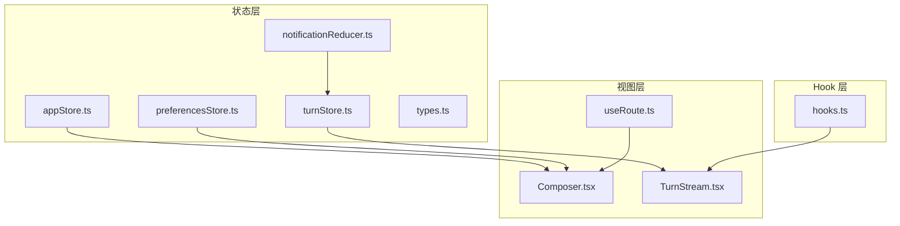
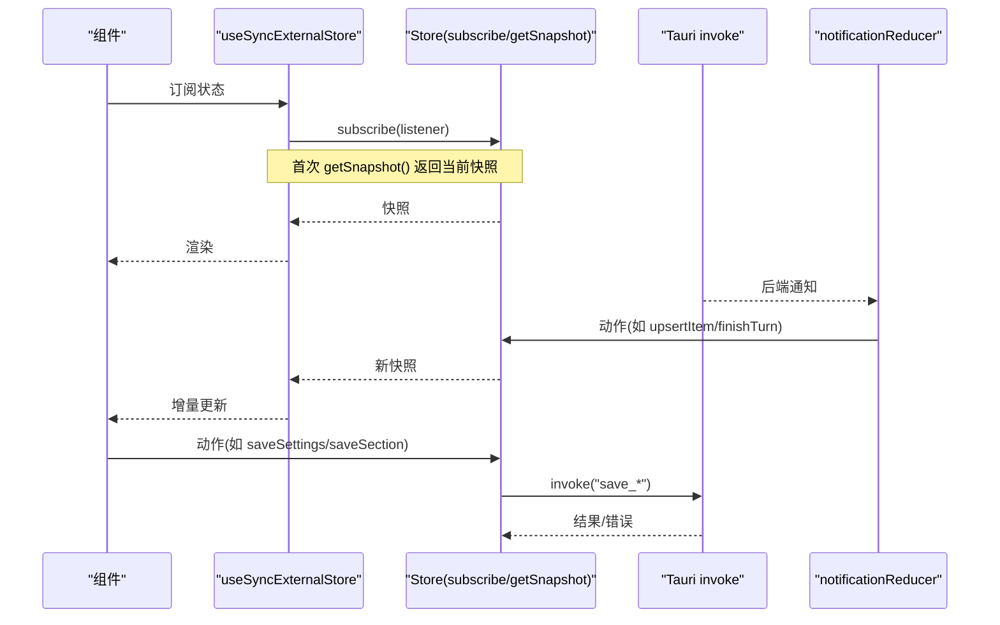
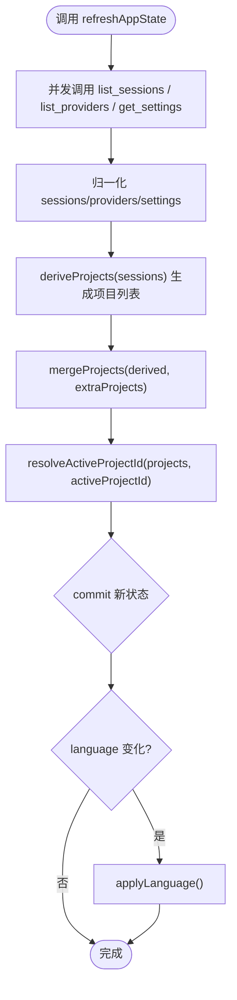
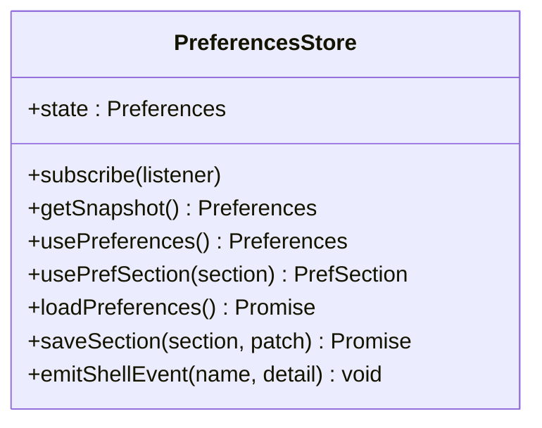
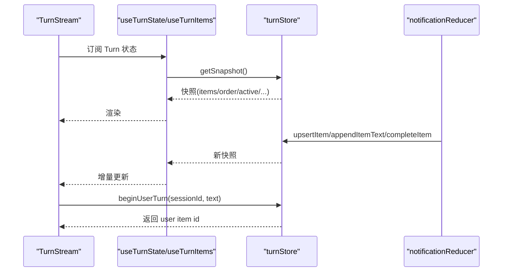
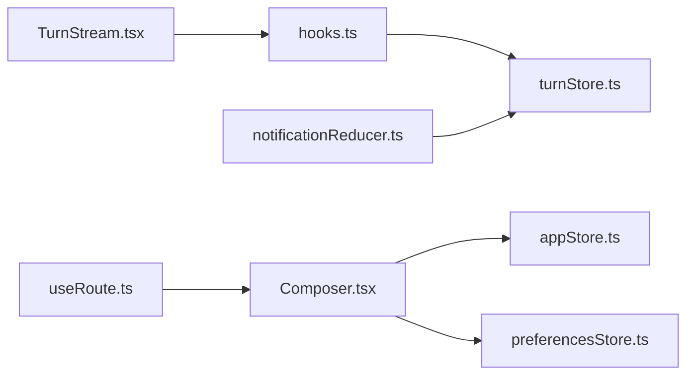

# 状态 Hooks 工具

<cite>
**本文引用的文件**
- [hooks.ts](file://frontend/app/state/hooks.ts)
- [appStore.ts](file://frontend/app/state/appStore.ts)
- [preferencesStore.ts](file://frontend/app/state/preferencesStore.ts)
- [turnStore.ts](file://frontend/app/state/turnStore.ts)
- [types.ts](file://frontend/app/state/types.ts)
- [notificationReducer.ts](file://frontend/app/state/notificationReducer.ts)
- [Composer.tsx](file://frontend/app/views/Composer.tsx)
- [TurnStream.tsx](file://frontend/app/views/TurnStream.tsx)
- [useRoute.ts](file://frontend/app/shell/useRoute.ts)
</cite>

## 目录
1. [简介](#简介)
2. [项目结构](#项目结构)
3. [核心组件](#核心组件)
4. [架构总览](#架构总览)
5. [详细组件分析](#详细组件分析)
6. [依赖关系分析](#依赖关系分析)
7. [性能考量](#性能考量)
8. [故障排查指南](#故障排查指南)
9. [结论](#结论)
10. [附录](#附录)

## 简介
本文件面向 Codex-Tauri 前端的状态管理 Hooks 工具集，系统性说明其设计模式与实现原理，重点覆盖：
- 基于 useSyncExternalStore 的“外部 Store + React Hook”订阅模型
- 数据获取（Tauri invoke）与副作用处理的封装方式
- 各 Hook 的功能与使用场景：useAppState、usePreferences、useTurnState/useTurnItems/useTurnActive/usePendingRequests 等
- 性能优化策略：memoization、依赖分析、重渲染控制
- Hook 的组合使用模式与最佳实践
- 错误处理、调试技巧与常见问题解决方案
- 如何在组件中组合使用这些 Hook，以及如何创建新的自定义 Hook

## 项目结构
状态层位于 frontend/app/state，围绕三个独立 Store 组织：
- appStore：应用级状态（会话、项目、提供者、设置、引擎状态），通过 Tauri 命令加载与持久化
- preferencesStore：偏好设置（按 section 分区的键值映射），合并默认值并持久化
- turnStore：运行中的 Turn 流式状态（消息、工具调用、计划、警告、待审批请求等）

Hook 层位于 hooks.ts，将 turnStore 暴露为 React Hook；其他 Store 也提供各自的 Hook（如 useAppState、usePreferences）。视图层通过 Hook 读取状态并触发动作。

图表来源
- [appStore.ts:1-151](file://frontend/app/state/appStore.ts#L1-L151)
- [preferencesStore.ts:1-94](file://frontend/app/state/preferencesStore.ts#L1-L94)
- [turnStore.ts:1-107](file://frontend/app/state/turnStore.ts#L1-L107)
- [hooks.ts:1-43](file://frontend/app/state/hooks.ts#L1-L43)
- [notificationReducer.ts:189-215](file://frontend/app/state/notificationReducer.ts#L189-L215)
- [useRoute.ts:1-54](file://frontend/app/shell/useRoute.ts#L1-L54)

章节来源
- [appStore.ts:1-151](file://frontend/app/state/appStore.ts#L1-L151)
- [preferencesStore.ts:1-94](file://frontend/app/state/preferencesStore.ts#L1-L94)
- [turnStore.ts:1-107](file://frontend/app/state/turnStore.ts#L1-L107)
- [hooks.ts:1-43](file://frontend/app/state/hooks.ts#L1-L43)
- [useRoute.ts:1-54](file://frontend/app/shell/useRoute.ts#L1-L54)

## 核心组件
- useAppState：订阅应用全局状态（会话、项目、提供者、设置、引擎状态、加载与错误），用于选择项目、切换会话、更新设置等
- usePreferences：订阅偏好设置（按 section 分区），支持读取单个 section 或整体 map，并提供 saveSection 持久化
- useTurnState / useTurnItems / useTurnActive / usePendingRequests：订阅 Turn 流状态，包括活跃态、消息列表、待审批请求等
- 辅助 Hook：useRoute（路由）、以及 store 内部提供的 subscribe/getSnapshot 以配合 useSyncExternalStore

章节来源
- [appStore.ts:149-155](file://frontend/app/state/appStore.ts#L149-L155)
- [preferencesStore.ts:41-53](file://frontend/app/state/preferencesStore.ts#L41-L53)
- [hooks.ts:17-42](file://frontend/app/state/hooks.ts#L17-L42)
- [useRoute.ts:40-46](file://frontend/app/shell/useRoute.ts#L40-L46)

## 架构总览
整体采用“外部 Store + React Hook”的模式：
- Store 维护不可变快照，提供 subscribe 和 getSnapshot
- 组件通过 useSyncExternalStore 订阅 Store 变更，避免 Context Provider 与 prop drilling
- 数据获取通过 Tauri invoke 完成，失败时记录错误或降级
- 通知驱动：后端通知经 notificationReducer 映射到 turnStore 的动作，驱动 UI 增量更新

图表来源
- [hooks.ts:17-20](file://frontend/app/state/hooks.ts#L17-L20)
- [appStore.ts:133-151](file://frontend/app/state/appStore.ts#L133-L151)
- [preferencesStore.ts:24-43](file://frontend/app/state/preferencesStore.ts#L24-L43)
- [turnStore.ts:33-49](file://frontend/app/state/turnStore.ts#L33-L49)
- [notificationReducer.ts:189-215](file://frontend/app/state/notificationReducer.ts#L189-L215)

## 详细组件分析

### useAppState（应用状态 Hook）
- 职责：订阅应用全局状态，包含 sessions、projects、providers、settings、engineStatus、loaded、error 等
- 数据源：通过 Promise.all 并发调用 list_sessions、list_providers、get_settings，归一化后 commit
- 持久化：保存设置时同时写入 shell 配置与 engine 配置（config/batchWrite），语言变化同步到旧版 i18n
- 常用动作：setActiveSession、setActiveProject、openProjectPicker、addProject、refreshAppState、saveSettings

图表来源
- [appStore.ts:378-408](file://frontend/app/state/appStore.ts#L378-L408)
- [appStore.ts:215-245](file://frontend/app/state/appStore.ts#L215-L245)
- [appStore.ts:446-511](file://frontend/app/state/appStore.ts#L446-L511)

章节来源
- [appStore.ts:98-155](file://frontend/app/state/appStore.ts#L98-L155)
- [appStore.ts:249-376](file://frontend/app/state/appStore.ts#L249-L376)
- [appStore.ts:378-511](file://frontend/app/state/appStore.ts#L378-L511)

### usePreferences（偏好设置 Hook）
- 职责：订阅偏好设置（按 section 分区），提供 usePrefSection 读取某个 section，saveSection 合并并持久化
- 默认值：从 src/js/state.js 的 defaultPreferences 合并，保证新旧层一致
- 加载：loadPreferences 仅加载一次，失败不影响页面显示
- 事件：emitShellEvent 派发 Shell 级 CustomEvent，供非 React 模块响应

图表来源
- [preferencesStore.ts:17-94](file://frontend/app/state/preferencesStore.ts#L17-L94)

章节来源
- [preferencesStore.ts:17-94](file://frontend/app/state/preferencesStore.ts#L17-L94)

### useTurnState / useTurnItems / useTurnActive / usePendingRequests（Turn 流 Hook）
- 职责：订阅 Turn 流状态，提供完整状态、有序 items、活跃态、待审批请求等
- 数据源：由 notificationReducer 将后端通知转换为 turnStore 动作，驱动状态更新
- 关键动作：beginTurn、finishTurn、upsertItem、appendItemText/Output、completeItem、setPlan、pushWarning、addPendingRequest/removePendingRequest、setError
- 历史加载：loadThreadFromSession 从 get_session 与 get_runtime_events 恢复历史消息

图表来源
- [hooks.ts:17-42](file://frontend/app/state/hooks.ts#L17-L42)
- [turnStore.ts:53-157](file://frontend/app/state/turnStore.ts#L53-L157)
- [notificationReducer.ts:189-357](file://frontend/app/state/notificationReducer.ts#L189-L357)

章节来源
- [hooks.ts:17-42](file://frontend/app/state/hooks.ts#L17-L42)
- [turnStore.ts:28-157](file://frontend/app/state/turnStore.ts#L28-L157)
- [notificationReducer.ts:189-357](file://frontend/app/state/notificationReducer.ts#L189-L357)

### 类型定义（types.ts）
- TurnItem：单条可渲染单元（文本、命令输出、MCP 进度、时间戳、错误等）
- TurnState：Turn 流的全局状态（sessionId、turnId、active、phase、items、order、tokenUsage、plan、warnings、pendingRequests 等）
- TokenUsage、PlanStep、ServerWarning、PendingRequest：辅助类型

章节来源
- [types.ts:11-146](file://frontend/app/state/types.ts#L11-L146)

### 通知归约器（notificationReducer.ts）
- 职责：将后端通知方法映射到 turnStore 动作，确保所有协议方法都有处理器
- 分类：Turn 生命周期、Item 生命周期、流式增量、线程级状态、诊断信息、Hooks 等
- 未处理的方法会记录为 warning，便于发现缺口

章节来源
- [notificationReducer.ts:189-446](file://frontend/app/state/notificationReducer.ts#L189-L446)

### 视图层示例
- Composer.tsx：使用 useAppState 读取项目/提供者，使用 usePrefSection 读取发送快捷键，使用 turnStore.beginUserTurn 发起用户消息，处理发送中断与错误回滚
- TurnStream.tsx：使用 useTurnState/useTurnItems 渲染 Turn 流，计算已处理时长，折叠/展开已完成 Turn

章节来源
- [Composer.tsx:600-800](file://frontend/app/views/Composer.tsx#L600-L800)
- [TurnStream.tsx:64-187](file://frontend/app/views/TurnStream.tsx#L64-L187)

## 依赖关系分析
- Store 之间松耦合：appStore 与 preferencesStore 各自独立；turnStore 由通知驱动
- Hook 层薄封装：hooks.ts 仅对 turnStore 做 React 绑定；其他 Store 直接暴露 Hook
- 视图层通过 Hook 订阅状态，并通过 Store 动作触发副作用（invoke 持久化、刷新等）
- 路由 useRoute 同样基于 useSyncExternalStore，保持统一订阅模式

图表来源
- [Composer.tsx:600-800](file://frontend/app/views/Composer.tsx#L600-L800)
- [TurnStream.tsx:64-187](file://frontend/app/views/TurnStream.tsx#L64-L187)
- [hooks.ts:17-42](file://frontend/app/state/hooks.ts#L17-L42)
- [notificationReducer.ts:189-215](file://frontend/app/state/notificationReducer.ts#L189-L215)
- [useRoute.ts:40-46](file://frontend/app/shell/useRoute.ts#L40-L46)

章节来源
- [Composer.tsx:600-800](file://frontend/app/views/Composer.tsx#L600-L800)
- [TurnStream.tsx:64-187](file://frontend/app/views/TurnStream.tsx#L64-L187)
- [hooks.ts:17-42](file://frontend/app/state/hooks.ts#L17-L42)
- [notificationReducer.ts:189-215](file://frontend/app/state/notificationReducer.ts#L189-L215)
- [useRoute.ts:40-46](file://frontend/app/shell/useRoute.ts#L40-L46)

## 性能考量
- 使用 useSyncExternalStore 避免 Context Provider 与 prop drilling，适合高频流式更新（agent message deltas、command output）
- 派生选择器：useTurnSelector 可按需选择子集，减少不必要重渲染
- memoization：
  - Composer 中对 providersWithModels、过滤项目列表使用 useMemo
  - TurnStream 中对节点分组 groupProcessItems 进行缓存
- 依赖分析：
  - useEffect/useCallback 精确声明依赖，避免多余执行
  - 仅在 active/startedAt 变化时启动/清理定时器
- 重渲染控制：
  - Store 的 commit 仅触发订阅者回调，React 通过快照比较决定是否更新
  - 流式增量通过 appendItemText/Output 局部更新，避免全量重建

[本节为通用性能指导，不直接分析具体文件]

## 故障排查指南
- 数据加载失败：
  - appStore.refreshAppState 捕获异常并设置 error，组件应检查 loaded/error 状态
  - preferencesStore.loadPreferences 失败时使用默认值，避免白屏
- 发送失败回滚：
  - Composer 在 send 失败时调用 discardItem 回滚乐观气泡，并 finishTurn 标记失败
- 未处理的通知：
  - notificationReducer 对未知方法记录 warning，便于发现协议扩展点
- 连接与重连：
  - turnStore 保留 reconnectAttempt/reconnectFrozen，finishTurn 时重置，避免残留状态影响后续 Turn

章节来源
- [appStore.ts:378-408](file://frontend/app/state/appStore.ts#L378-L408)
- [preferencesStore.ts:59-68](file://frontend/app/state/preferencesStore.ts#L59-L68)
- [Composer.tsx:711-785](file://frontend/app/views/Composer.tsx#L711-L785)
- [notificationReducer.ts:437-446](file://frontend/app/state/notificationReducer.ts#L437-L446)
- [turnStore.ts:241-260](file://frontend/app/state/turnStore.ts#L241-L260)

## 结论
Codex-Tauri 的状态管理通过“外部 Store + useSyncExternalStore”实现了高内聚、低耦合的状态订阅与更新机制。appStore、preferencesStore、turnStore 各司其职，分别负责应用级状态、偏好设置与 Turn 流状态。Hook 层提供简洁的 API，视图层通过 Hook 组合实现复杂交互。该模式具备良好的可扩展性与性能表现，适合高频流式数据与多端协同的场景。

[本节为总结性内容，不直接分析具体文件]

## 附录

### 使用示例（路径引用）
- 在组件中使用 useAppState 读取项目与提供者，并使用 setProject/setSession 等动作
  - 参考：[Composer.tsx:600-800](file://frontend/app/views/Composer.tsx#L600-L800)
- 在组件中使用 usePreferences 读取发送快捷键，并保存修改
  - 参考：[preferencesStore.ts:41-88](file://frontend/app/state/preferencesStore.ts#L41-L88)
- 在组件中使用 useTurnState/useTurnItems 渲染 Turn 流，并处理活跃态与折叠
  - 参考：[TurnStream.tsx:64-187](file://frontend/app/views/TurnStream.tsx#L64-L187)

### 创建新的自定义 Hook（步骤）
- 定义 Store：实现 subscribe/getSnapshot/commit，暴露动作函数
- 编写 Hook：使用 useSyncExternalStore 订阅 Store，必要时提供派生选择器
- 在组件中组合：通过 Hook 读取状态，调用 Store 动作触发副作用
- 测试与调试：利用 notificationReducer 的 warning 机制与 console 日志定位问题

[本节为通用指导，不直接分析具体文件]