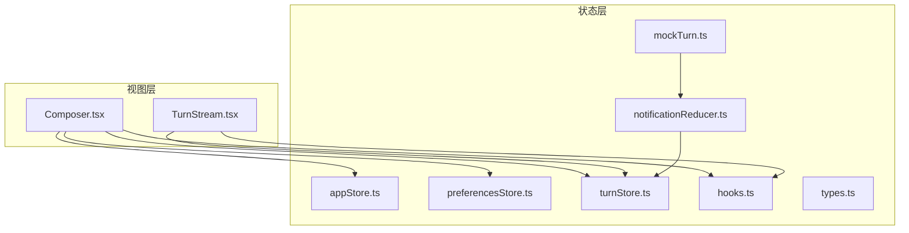
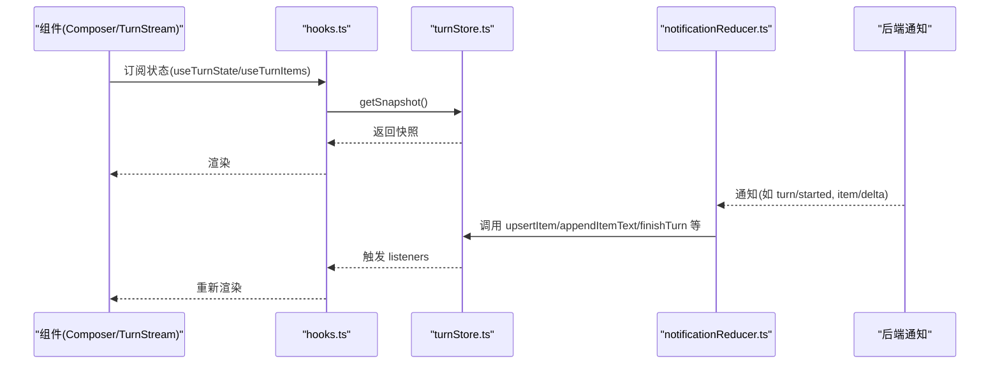
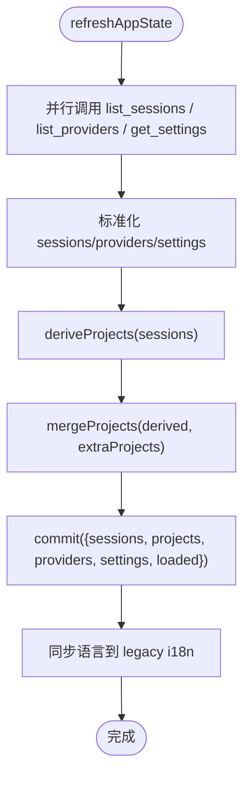
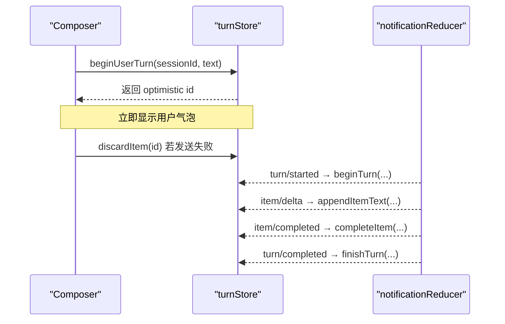
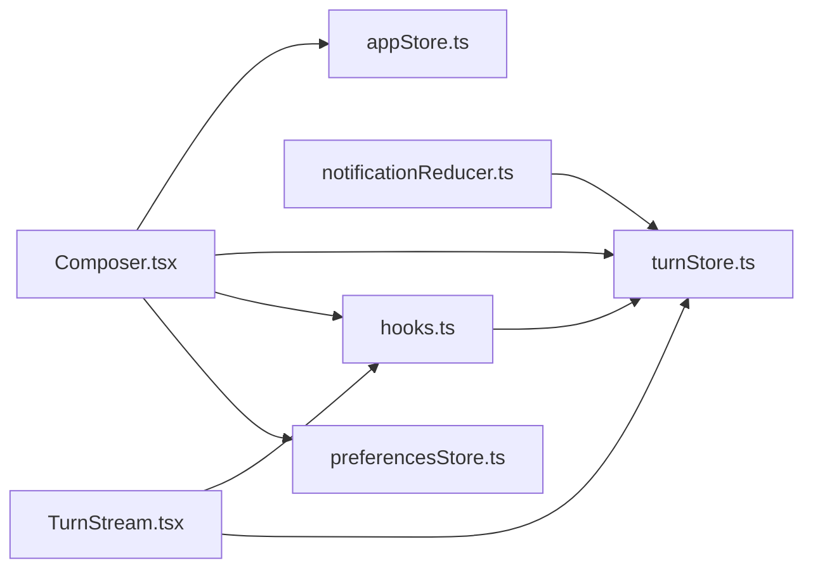

# 状态管理

<cite>
**本文引用的文件**
- [appStore.ts](file://frontend/app/state/appStore.ts)
- [preferencesStore.ts](file://frontend/app/state/preferencesStore.ts)
- [turnStore.ts](file://frontend/app/state/turnStore.ts)
- [hooks.ts](file://frontend/app/state/hooks.ts)
- [types.ts](file://frontend/app/state/types.ts)
- [notificationReducer.ts](file://frontend/app/state/notificationReducer.ts)
- [mockTurn.ts](file://frontend/app/state/mockTurn.ts)
- [Composer.tsx](file://frontend/app/views/Composer.tsx)
- [TurnStream.tsx](file://frontend/app/views/TurnStream.tsx)
</cite>

## 目录
1. [简介](#简介)
2. [项目结构](#项目结构)
3. [核心组件](#核心组件)
4. [架构总览](#架构总览)
5. [详细组件分析](#详细组件分析)
6. [依赖关系分析](#依赖关系分析)
7. [性能考量](#性能考量)
8. [故障排查指南](#故障排查指南)
9. [结论](#结论)
10. [附录：使用示例与迁移指南](#附录：使用示例与迁移指南)

## 简介
本文件系统性说明 Codex-Tauri 前端的状态管理方案。该方案未采用 Zustand，而是基于 React 的 useSyncExternalStore 构建轻量、可订阅的外部 Store，并通过“通知归约器”将后端事件统一映射到状态更新。整体分为三大模块：
- appStore：应用级状态（会话、项目、提供者、设置等），负责从后端加载并持久化设置。
- preferencesStore：偏好设置（按 section 分片），提供默认值合并与持久化。
- turnStore：对话轮次状态（当前轮次的消息流、计划、警告、令牌用量等），由后端通知驱动。

此外，通过自定义 hooks 暴露订阅能力，组件以声明式方式消费状态；通知归约器集中处理所有后端通知，保证 UI 与后端一致。

## 项目结构
状态相关代码集中在 frontend/app/state 目录下，配合 views 中的组件进行消费：
- appStore.ts：应用全局状态与设置持久化。
- preferencesStore.ts：偏好设置的分片读写与持久化。
- turnStore.ts：对话轮次状态机与消息流。
- hooks.ts：面向 React 的订阅钩子。
- types.ts：类型定义与工厂函数。
- notificationReducer.ts：后端通知到 store actions 的统一映射。
- mockTurn.ts：前端模拟回放，用于调试与演示。

图表来源
- [appStore.ts:1-526](file://frontend/app/state/appStore.ts#L1-L526)
- [preferencesStore.ts:1-94](file://frontend/app/state/preferencesStore.ts#L1-L94)
- [turnStore.ts:1-467](file://frontend/app/state/turnStore.ts#L1-L467)
- [hooks.ts:1-43](file://frontend/app/state/hooks.ts#L1-L43)
- [types.ts:1-146](file://frontend/app/state/types.ts#L1-L146)
- [notificationReducer.ts:1-446](file://frontend/app/state/notificationReducer.ts#L1-L446)
- [mockTurn.ts:1-153](file://frontend/app/state/mockTurn.ts#L1-L153)
- [Composer.tsx:1-200](file://frontend/app/views/Composer.tsx#L1-L200)
- [TurnStream.tsx:1-187](file://frontend/app/views/TurnStream.tsx#L1-L187)

章节来源
- [appStore.ts:1-526](file://frontend/app/state/appStore.ts#L1-L526)
- [preferencesStore.ts:1-94](file://frontend/app/state/preferencesStore.ts#L1-L94)
- [turnStore.ts:1-467](file://frontend/app/state/turnStore.ts#L1-L467)
- [hooks.ts:1-43](file://frontend/app/state/hooks.ts#L1-L43)
- [types.ts:1-146](file://frontend/app/state/types.ts#L1-L146)
- [notificationReducer.ts:1-446](file://frontend/app/state/notificationReducer.ts#L1-L446)
- [mockTurn.ts:1-153](file://frontend/app/state/mockTurn.ts#L1-L153)
- [Composer.tsx:1-200](file://frontend/app/views/Composer.tsx#L1-L200)
- [TurnStream.tsx:1-187](file://frontend/app/views/TurnStream.tsx#L1-L187)

## 核心组件
- appStore：维护 sessions/projects/providers/settings/engineStatus 等应用级数据，提供刷新、保存设置、选择项目/会话等动作。通过 useSyncExternalStore 暴露给 React。
- preferencesStore：按 section 组织偏好，支持默认值合并、读取单个 section、保存整个 map。
- turnStore：维护当前轮次的所有 item、顺序、阶段、计划、警告、令牌用量、重连状态等，提供 beginUserTurn、appendItemText、completeItem 等高频率操作。
- hooks：封装 useTurnState/useTurnItems/useTurnActive/usePendingRequests 等便捷订阅方法。
- notificationReducer：将后端通知（如 turn/started、item/delta、thread/tokenUsage/updated）转换为 turnStore 的动作。
- mockTurn：通过定时触发 reduceNotification，模拟真实对话流程，便于本地验证 UI。

章节来源
- [appStore.ts:1-526](file://frontend/app/state/appStore.ts#L1-L526)
- [preferencesStore.ts:1-94](file://frontend/app/state/preferencesStore.ts#L1-L94)
- [turnStore.ts:1-467](file://frontend/app/state/turnStore.ts#L1-L467)
- [hooks.ts:1-43](file://frontend/app/state/hooks.ts#L1-L43)
- [notificationReducer.ts:1-446](file://frontend/app/state/notificationReducer.ts#L1-L446)
- [mockTurn.ts:1-153](file://frontend/app/state/mockTurn.ts#L1-L153)

## 架构总览
状态管理的核心思想是“外部 Store + 订阅 + 通知归约”。Store 独立于 React 生命周期，通过 subscribe/getSnapshot 暴露给 useSyncExternalStore；通知归约器作为唯一入口，确保 UI 仅反映后端事实。

图表来源
- [hooks.ts:1-43](file://frontend/app/state/hooks.ts#L1-L43)
- [turnStore.ts:1-467](file://frontend/app/state/turnStore.ts#L1-L467)
- [notificationReducer.ts:1-446](file://frontend/app/state/notificationReducer.ts#L1-L446)

## 详细组件分析

### appStore 应用状态
职责
- 管理会话列表、项目列表、模型提供者、设置、引擎状态、加载状态与错误。
- 从后端加载数据并标准化为内部结构。
- 持久化设置到 shell 与 engine 配置。
- 提供选择项目/会话、打开项目目录、刷新应用状态等动作。

关键设计
- 使用闭包 state + listeners 实现最小化的 Store。
- 通过 useSyncExternalStore 暴露 useAppState，避免上下文传递。
- 设置持久化双写：shell 的 save_settings 与 engine 的 config/batchWrite。
- 项目列表由会话 cwd 派生，额外项目来自用户选择的文件夹。

典型流程（刷新应用状态）

图表来源
- [appStore.ts:378-408](file://frontend/app/state/appStore.ts#L378-L408)
- [appStore.ts:215-245](file://frontend/app/state/appStore.ts#L215-L245)
- [appStore.ts:446-511](file://frontend/app/state/appStore.ts#L446-L511)

章节来源
- [appStore.ts:1-526](file://frontend/app/state/appStore.ts#L1-L526)

### preferencesStore 偏好设置
职责
- 维护 per-section 的偏好 map，提供默认值合并。
- 读取/保存整个 preferences map。
- 暴露 usePrefSection 获取某个 section 的合并结果。

关键点
- 首次加载失败时回退到默认值，不阻断页面。
- 保存时先 commit 本地状态，再异步持久化，允许上层捕获失败。
- 通过 emitShellEvent 派发 shell 级别事件，供非 React 层监听。

章节来源
- [preferencesStore.ts:1-94](file://frontend/app/state/preferencesStore.ts#L1-L94)

### turnStore 对话轮次状态
职责
- 维护当前轮次的所有 item（消息、命令执行、文件变更、推理等）、到达顺序、阶段、计划、警告、令牌用量、重连状态。
- 提供 beginUserTurn（乐观插入用户消息）、appendItemText/Output（增量追加）、completeItem（标记完成）、setPlan/setTokenUsage/pushWarning 等高频操作。
- 支持从后端历史恢复会话内容（loadThreadFromSession）。

高并发优化
- 使用 items[id] + order[] 的结构，O(1) 查找与稳定渲染顺序。
- 增量追加文本/输出，避免全量重建。
- 通过 notify 机制批量触发订阅者，减少重渲染次数。

典型流程（开始一轮对话）

图表来源
- [turnStore.ts:53-133](file://frontend/app/state/turnStore.ts#L53-L133)
- [turnStore.ts:143-234](file://frontend/app/state/turnStore.ts#L143-L234)
- [turnStore.ts:241-285](file://frontend/app/state/turnStore.ts#L241-L285)
- [notificationReducer.ts:189-254](file://frontend/app/state/notificationReducer.ts#L189-L254)

章节来源
- [turnStore.ts:1-467](file://frontend/app/state/turnStore.ts#L1-L467)
- [notificationReducer.ts:1-446](file://frontend/app/state/notificationReducer.ts#L1-L446)

### hooks 自定义钩子
职责
- 封装 useSyncExternalStore 订阅 turnStore，提供 useTurnState/useTurnItems/useTurnActive/usePendingRequests。
- 让组件以最小代价订阅高频更新的对话流。

使用模式
- 在组件中直接调用 hooks 获取状态或派生数据。
- 对高频渲染场景，优先使用 useTurnItems 获取有序数组，避免重复计算。

章节来源
- [hooks.ts:1-43](file://frontend/app/state/hooks.ts#L1-L43)

### 通知归约器
职责
- 将后端通知（turn/item/thread 等）映射到 turnStore 的具体 action。
- 对未知但协议存在的方法记录警告，避免静默丢弃。
- 对无关 UI 的通知（ambient methods）直接忽略。

覆盖规则
- 新增通知方法必须在此处添加处理逻辑，否则测试会失败。

章节来源
- [notificationReducer.ts:1-446](file://frontend/app/state/notificationReducer.ts#L1-L446)

### 模拟回放
职责
- 通过定时器触发 reduceNotification，模拟完整对话流程（推理、计划、文件变更、命令执行、令牌用量、完成）。
- 用于无后端环境下的 UI 验证与对比。

章节来源
- [mockTurn.ts:1-153](file://frontend/app/state/mockTurn.ts#L1-L153)

## 依赖关系分析
- hooks.ts 依赖 turnStore 的 subscribe/getSnapshot。
- notificationReducer.ts 依赖 turnStore 的 actions。
- Composer.tsx 依赖 appStore、turnStore、hooks、preferencesStore。
- TurnStream.tsx 依赖 hooks 和 turnStore。

图表来源
- [hooks.ts:1-43](file://frontend/app/state/hooks.ts#L1-L43)
- [notificationReducer.ts:1-446](file://frontend/app/state/notificationReducer.ts#L1-L446)
- [Composer.tsx:1-200](file://frontend/app/views/Composer.tsx#L1-L200)
- [TurnStream.tsx:1-187](file://frontend/app/views/TurnStream.tsx#L1-L187)

章节来源
- [hooks.ts:1-43](file://frontend/app/state/hooks.ts#L1-L43)
- [notificationReducer.ts:1-446](file://frontend/app/state/notificationReducer.ts#L1-L446)
- [Composer.tsx:1-200](file://frontend/app/views/Composer.tsx#L1-L200)
- [TurnStream.tsx:1-187](file://frontend/app/views/TurnStream.tsx#L1-L187)

## 性能考量
- 外部 Store + useSyncExternalStore：避免 Context 与 prop drilling，降低重渲染范围。
- 增量更新：turnStore 的 appendItemText/Output 仅追加字符串片段，避免重建整条消息。
- 有序渲染：items[id] + order[] 保证 O(1) 查找与稳定顺序，适合高频流式数据。
- 并行加载：appStore.refreshAppState 并行请求 sessions/providers/settings，缩短首屏时间。
- 延迟持久化：preferencesStore 与 appStore 的设置保存采用先本地 commit 再异步持久化，提升响应速度。
- 节流渲染：TurnStream 使用 ~4Hz 的 tick 更新已处理时长，避免过度重绘。

[本节为通用性能建议，无需具体文件引用]

## 故障排查指南
- 设置保存失败：检查 appStore.saveSettings 的双写路径（shell 与 engine），关注 console.warn 提示是否因引擎离线导致。
- 偏好加载失败：preferencesStore.loadPreferences 捕获异常并回退到默认值，查看控制台日志定位网络或权限问题。
- 通知未生效：确认 notificationReducer 是否包含对应 method；未处理的协议方法会记录警告。
- 对话流异常：通过 mockTurn 回放对比，定位是否为后端通知缺失或字段不一致。
- 重连状态：turnStore 的 reconnectAttempt/reconnectFrozen 可用于诊断连接恢复过程中的状态残留。

章节来源
- [appStore.ts:446-511](file://frontend/app/state/appStore.ts#L446-L511)
- [preferencesStore.ts:59-88](file://frontend/app/state/preferencesStore.ts#L59-L88)
- [notificationReducer.ts:437-446](file://frontend/app/state/notificationReducer.ts#L437-L446)
- [turnStore.ts:258-285](file://frontend/app/state/turnStore.ts#L258-L285)

## 结论
该状态管理方案以最小依赖实现了高性能、可维护的前端状态管理。通过外部 Store、订阅机制与通知归约器，确保了 UI 与后端的一致性；同时提供了清晰的扩展点（新增通知、新增 section、新增应用设置）与完善的调试手段（模拟回放、警告记录）。建议在后续开发中遵循现有模式，保持单一数据源与单向数据流。

[本节为总结性内容，无需具体文件引用]

## 附录：使用示例与迁移指南

### 创建新的状态模块（推荐模式）
- 定义状态结构与默认值（参考 types.ts 的 emptyTurn/newItem）。
- 实现闭包 state + listeners + commit/subscribe/getSnapshot（参考 turnStore 的模式）。
- 暴露 useXxx 钩子（参考 hooks.ts）。
- 如需持久化，提供 saveXxx 动作并在失败时降级（参考 preferencesStore.saveSection）。
- 如有后端事件，新增归约器处理（参考 notificationReducer）。

章节来源
- [turnStore.ts:28-49](file://frontend/app/state/turnStore.ts#L28-L49)
- [hooks.ts:17-43](file://frontend/app/state/hooks.ts#L17-L43)
- [preferencesStore.ts:76-88](file://frontend/app/state/preferencesStore.ts#L76-L88)
- [notificationReducer.ts:189-446](file://frontend/app/state/notificationReducer.ts#L189-L446)

### 使用现有状态
- 应用设置：在组件中使用 useAppState 读取 sessions/projects/providers/settings，调用 setActiveProject/openProjectPicker/saveSettings 等动作。
- 偏好设置：使用 usePrefSection("appearance") 等读取某 section，调用 saveSection(section, patch) 保存。
- 对话流：使用 useTurnState/useTurnItems 订阅当前轮次，结合 TurnStream 渲染；通过 beginUserTurn 发起新轮次。

章节来源
- [appStore.ts:149-155](file://frontend/app/state/appStore.ts#L149-L155)
- [appStore.ts:249-372](file://frontend/app/state/appStore.ts#L249-L372)
- [preferencesStore.ts:41-53](file://frontend/app/state/preferencesStore.ts#L41-L53)
- [hooks.ts:17-43](file://frontend/app/state/hooks.ts#L17-L43)
- [turnStore.ts:118-133](file://frontend/app/state/turnStore.ts#L118-L133)

### 状态持久化机制
- appStore：设置保存双写（shell 与 engine），失败时保留本地状态并记录警告。
- preferencesStore：按 section 合并后保存整个 preferences map，失败时记录错误。
- turnStore：不持久化，仅内存态，重启后通过 loadThreadFromSession 恢复。

章节来源
- [appStore.ts:446-511](file://frontend/app/state/appStore.ts#L446-L511)
- [preferencesStore.ts:76-88](file://frontend/app/state/preferencesStore.ts#L76-L88)
- [turnStore.ts:328-467](file://frontend/app/state/turnStore.ts#L328-L467)

### 状态同步策略
- 通知驱动：所有 UI 变化由后端通知经 reduceNotification 驱动，避免本地模拟。
- 乐观更新：beginUserTurn 立即显示用户消息，发送失败时通过 discardItem 回滚。
- 派生状态：projects 由 sessions 派生，activeProjectId 根据 settings.activeProjectPath 解析。

章节来源
- [notificationReducer.ts:189-446](file://frontend/app/state/notificationReducer.ts#L189-L446)
- [turnStore.ts:118-141](file://frontend/app/state/turnStore.ts#L118-L141)
- [appStore.ts:215-245](file://frontend/app/state/appStore.ts#L215-L245)

### 性能优化技巧
- 增量追加：appendItemText/Output 仅拼接字符串片段。
- 有序渲染：order[] 保证稳定顺序，避免重排。
- 并行加载：refreshAppState 并行请求多个后端接口。
- 低频次 tick：TurnStream 使用 ~4Hz 更新已处理时长。

章节来源
- [turnStore.ts:159-194](file://frontend/app/state/turnStore.ts#L159-L194)
- [appStore.ts:378-408](file://frontend/app/state/appStore.ts#L378-L408)
- [TurnStream.tsx:47-60](file://frontend/app/views/TurnStream.tsx#L47-L60)

### 错误处理策略
- 网络/权限错误：preferencesStore.loadPreferences 捕获异常并回退默认值。
- 引擎离线：appStore.saveSettings 的 engine 写入失败记录警告，不影响 shell 保存。
- 未知通知：notificationReducer 记录警告，避免静默丢弃。

章节来源
- [preferencesStore.ts:59-68](file://frontend/app/state/preferencesStore.ts#L59-L68)
- [appStore.ts:502-511](file://frontend/app/state/appStore.ts#L502-L511)
- [notificationReducer.ts:437-446](file://frontend/app/state/notificationReducer.ts#L437-L446)

### 调试方法
- 使用 mockTurn 回放完整对话流程，验证 UI 行为。
- 观察 TurnStream 的 header 状态（thinking/live/done）与 elapsed 计时。
- 通过 warnings 列表查看未处理通知或系统警告。

章节来源
- [mockTurn.ts:48-153](file://frontend/app/state/mockTurn.ts#L48-L153)
- [TurnStream.tsx:64-103](file://frontend/app/views/TurnStream.tsx#L64-L103)
- [TurnStream.tsx:175-183](file://frontend/app/views/TurnStream.tsx#L175-L183)

### 版本兼容性与迁移
- 字段兼容：appStore.normaliseSettings 同时接受 camelCase 与 snake_case，适配前后端命名差异。
- 通知兼容：notificationReducer.blockTypeOf 兼容多种 itemType 变体（如 command_execution/commandExecution）。
- 历史恢复：turnStore.loadThreadFromSession 兼容 thread.messages 为空时使用 timeline 恢复。

章节来源
- [appStore.ts:410-433](file://frontend/app/state/appStore.ts#L410-L433)
- [notificationReducer.ts:77-92](file://frontend/app/state/notificationReducer.ts#L77-L92)
- [turnStore.ts:328-467](file://frontend/app/state/turnStore.ts#L328-L467)