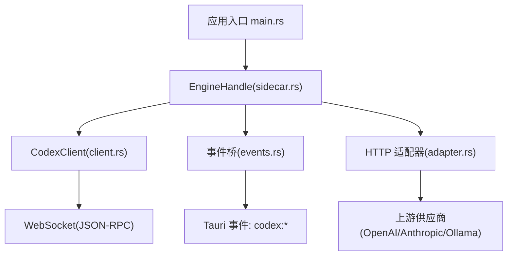
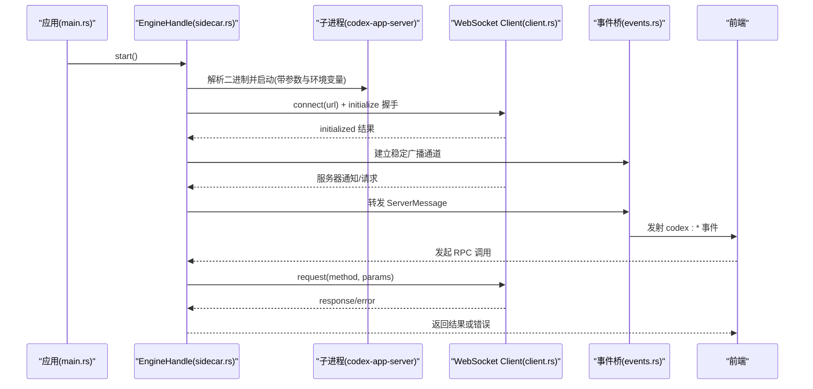
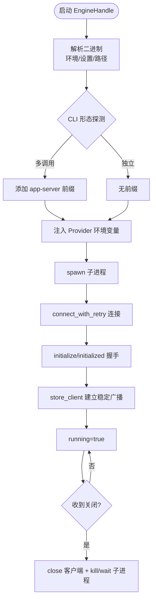
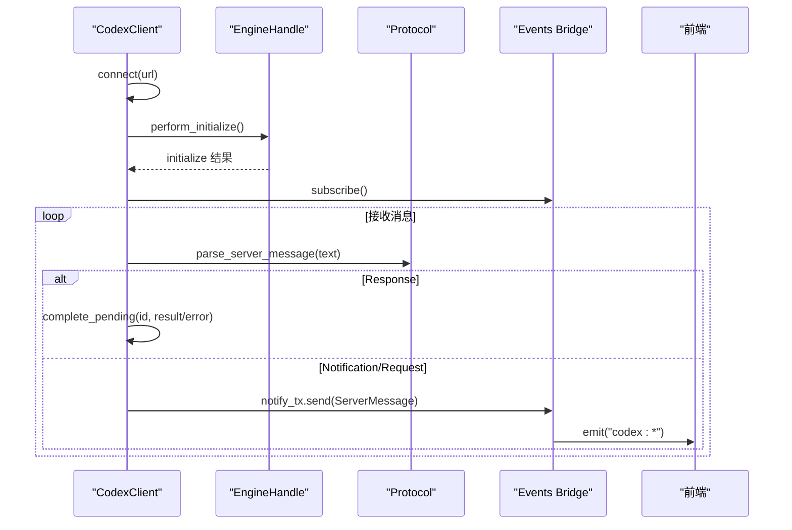
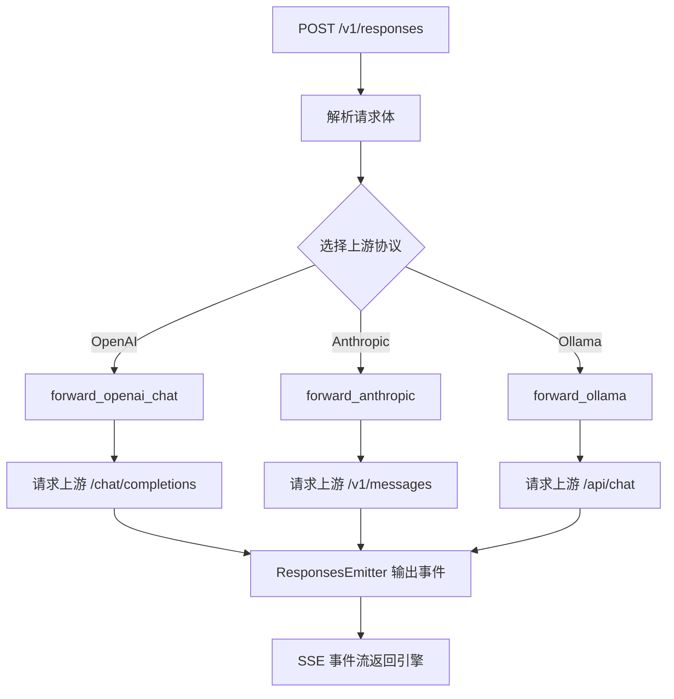
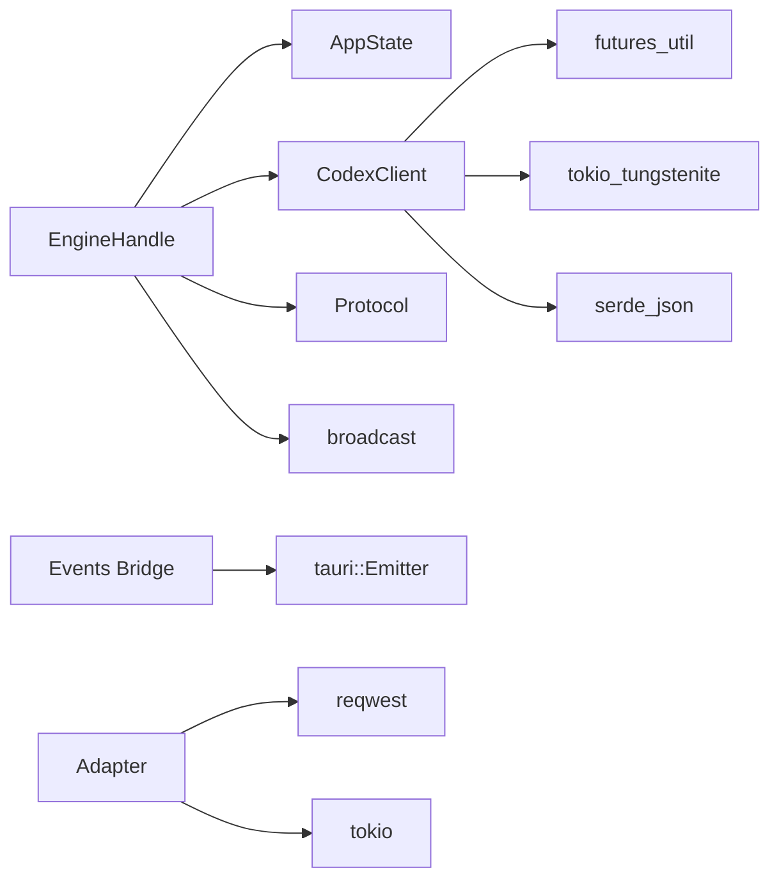

# Sidecar 进程管理

<cite>
**本文引用的文件**
- [sidecar.rs](file://src-tauri/src/codex/sidecar.rs)
- [client.rs](file://src-tauri/src/codex/client.rs)
- [protocol.rs](file://src-tauri/src/codex/protocol.rs)
- [events.rs](file://src-tauri/src/codex/events.rs)
- [adapter.rs](file://src-tauri/src/codex/adapter.rs)
- [state.rs](file://src-tauri/src/state.rs)
- [main.rs](file://src-tauri/src/main.rs)
- [README.md](file://README.md)
</cite>

## 目录
1. [简介](#简介)
2. [项目结构](#项目结构)
3. [核心组件](#核心组件)
4. [架构总览](#架构总览)
5. [详细组件分析](#详细组件分析)
6. [依赖关系分析](#依赖关系分析)
7. [性能与资源考量](#性能与资源考量)
8. [故障排除指南](#故障排除指南)
9. [结论](#结论)

## 简介
本文件面向 Sidecar 进程管理系统，聚焦外部进程（codex-app-server）的生命周期管理、二进制解析与参数注入、WebSocket JSON-RPC 通信、消息路由与事件广播、健康检查与异常恢复、以及内存/CPU 监控与资源限制策略。文档同时覆盖协议适配器对第三方模型供应商的适配能力，并提供可操作的故障排查与调优建议。

## 项目结构
Sidecar 相关逻辑集中在 Rust 后端模块 codex 下，包含：
- sidecar：负责侧车进程的启动、停止、重启、参数与环境变量注入、二进制解析与健康探测
- client：WebSocket JSON-RPC 客户端，维护连接、请求/响应映射、通知广播
- protocol：定义方法名、消息类型与解析
- events：将引擎通知桥接到前端 Tauri 事件通道
- adapter：本地 HTTP 适配器，将引擎的 Responses 请求转发到 OpenAI/Anthropic/Ollama 等上游并回写 SSE 流

图表来源
- [main.rs:4-6](file://src-tauri/src/main.rs#L4-L6)
- [sidecar.rs:22-125](file://src-tauri/src/codex/sidecar.rs#L22-L125)
- [client.rs:37-94](file://src-tauri/src/codex/client.rs#L37-L94)
- [events.rs:12-43](file://src-tauri/src/codex/events.rs#L12-L43)
- [adapter.rs:85-111](file://src-tauri/src/codex/adapter.rs#L85-L111)

章节来源
- [README.md:1-58](file://README.md#L1-L58)
- [main.rs:4-6](file://src-tauri/src/main.rs#L4-L6)

## 核心组件
- EngineHandle：封装子进程生命周期、WebSocket 客户端、事件广播与 RPC 调用
- CodexClient：异步 WebSocket JSON-RPC 客户端，维护请求待处理表、通知广播、初始化握手
- Protocol：JSON-RPC 方法常量、消息类型与解析器
- Events Bridge：订阅 EngineHandle 的稳定广播，映射为前端 Tauri 事件
- Protocol Adapter：本地 HTTP 服务，将 Responses 请求适配到不同上游协议并回写 SSE

章节来源
- [sidecar.rs:22-125](file://src-tauri/src/codex/sidecar.rs#L22-L125)
- [client.rs:23-94](file://src-tauri/src/codex/client.rs#L23-L94)
- [protocol.rs:103-156](file://src-tauri/src/codex/protocol.rs#L103-L156)
- [events.rs:12-43](file://src-tauri/src/codex/events.rs#L12-L43)
- [adapter.rs:68-111](file://src-tauri/src/codex/adapter.rs#L68-L111)

## 架构总览
系统通过 Tauri 壳程序启动并管理 codex-app-server 作为独立子进程，使用 WebSocket JSON-RPC 进行双向通信；同时提供本地 HTTP 适配器以兼容多种上游模型供应商。事件从引擎经稳定广播分发至前端。

图表来源
- [main.rs:4-6](file://src-tauri/src/main.rs#L4-L6)
- [sidecar.rs:31-125](file://src-tauri/src/codex/sidecar.rs#L31-L125)
- [client.rs:37-94](file://src-tauri/src/codex/client.rs#L37-L94)
- [events.rs:12-43](file://src-tauri/src/codex/events.rs#L12-L43)

## 详细组件分析

### 进程生命周期管理（启动、停止、重启、清理）
- 启动流程
  - 读取监听地址配置，默认回退到本地环回地址
  - 解析并安装二进制（内容寻址目录），避免旧版本覆盖
  - 注入 Provider API Key 环境变量，按约定命名规则生成键名
  - 探测 CLI 形态（多调用 vs 独立二进制），决定是否添加子命令前缀与 session-source 参数
  - 在 Windows 上隐藏控制台窗口
  - 记录日志并保存子进程句柄
- 运行态检测
  - is_running 综合 AtomicBool 与客户端连接状态
  - sidecar_alive 通过 try_wait 判断子进程是否存活
- 连接重试
  - connect_with_retry 仅在检测到已启动的子进程时进行有限次重试，避免冷启动阻塞 UI
- 关闭与资源清理
  - shutdown 先关闭 WebSocket 客户端，再 kill/wait 子进程，重置 running 标志

图表来源
- [sidecar.rs:31-125](file://src-tauri/src/codex/sidecar.rs#L31-L125)
- [sidecar.rs:177-222](file://src-tauri/src/codex/sidecar.rs#L177-L222)
- [sidecar.rs:262-275](file://src-tauri/src/codex/sidecar.rs#L262-L275)
- [sidecar.rs:294-360](file://src-tauri/src/codex/sidecar.rs#L294-L360)
- [state.rs:13-25](file://src-tauri/src/state.rs#L13-L25)

章节来源
- [sidecar.rs:31-125](file://src-tauri/src/codex/sidecar.rs#L31-L125)
- [sidecar.rs:177-222](file://src-tauri/src/codex/sidecar.rs#L177-L222)
- [sidecar.rs:262-275](file://src-tauri/src/codex/sidecar.rs#L262-L275)
- [sidecar.rs:294-360](file://src-tauri/src/codex/sidecar.rs#L294-L360)
- [state.rs:13-25](file://src-tauri/src/state.rs#L13-L25)

### 二进制解析与参数配置、环境变量
- 二进制解析优先级
  - CODEX_APP_SERVER 环境变量绝对路径优先
  - settings.app_server_binary 配置项
  - 安装包资源目录与 exe 相邻目录查找
  - 开发期 binaries 目录
  - 最后回退到本地数据目录中最近的内容哈希安装
- 内容寻址安装
  - 计算 FNV-1a 64 位哈希，写入 %LOCALAPPDATA%\CodexDesktop\bin\<hash>\ 目录
  - 原子写入（临时文件 + rename），Unix 平台设置执行权限
- 参数与环境变量
  - --listen 监听地址来自配置或默认值
  - --session-source 仅在帮助文本支持时传递
  - Provider API Key 通过环境变量注入，键名由 provider_id 规范化生成

章节来源
- [sidecar.rs:362-539](file://src-tauri/src/codex/sidecar.rs#L362-L539)
- [state.rs:13-25](file://src-tauri/src/state.rs#L13-L25)

### WebSocket 通信协议、消息路由与事件广播
- 协议与方法
  - 使用 JSON-RPC，方法名集中定义于 protocol 模块
  - 初始化握手：initialize → initialized 通知
- 客户端实现
  - 读写任务分离，发送队列通过 mpsc 控制
  - 请求-响应通过 oneshot 通道与 pending map 匹配
  - 超时控制：初始化与常规请求分别设置超时
- 消息路由
  - 响应完成 pending 任务
  - 通知与请求通过 broadcast 分发
- 事件桥
  - 订阅 EngineHandle 的稳定广播，映射为 codex:* 事件
  - 特殊请求（审批、用户输入、elicitation）映射到专用频道

图表来源
- [client.rs:37-94](file://src-tauri/src/codex/client.rs#L37-L94)
- [client.rs:148-194](file://src-tauri/src/codex/client.rs#L148-L194)
- [protocol.rs:103-156](file://src-tauri/src/codex/protocol.rs#L103-L156)
- [events.rs:12-43](file://src-tauri/src/codex/events.rs#L12-L43)

章节来源
- [client.rs:37-94](file://src-tauri/src/codex/client.rs#L37-L94)
- [client.rs:148-194](file://src-tauri/src/codex/client.rs#L148-L194)
- [protocol.rs:103-156](file://src-tauri/src/codex/protocol.rs#L103-L156)
- [events.rs:12-43](file://src-tauri/src/codex/events.rs#L12-L43)

### 协议适配器（HTTP 到上游供应商）
- 角色
  - 接收引擎 POST /v1/responses 请求
  - 转换为上游协议（OpenAI Chat、Anthropic Messages、Ollama）
  - 将上游 SSE 流转换为 Responses 规范事件流
- 关键实现
  - 解析 HTTP 头与 body，路由到对应 forward_* 函数
  - 构建上游请求体，携带 model、messages、tools、stream 等字段
  - 错误处理：上游失败返回 502 或状态码+body
  - ResponsesEmitter：维护 output_index、消息开启/关闭、function_call 聚合与完成事件

图表来源
- [adapter.rs:113-191](file://src-tauri/src/codex/adapter.rs#L113-L191)
- [adapter.rs:194-220](file://src-tauri/src/codex/adapter.rs#L194-L220)
- [adapter.rs:222-343](file://src-tauri/src/codex/adapter.rs#L222-L343)
- [adapter.rs:345-494](file://src-tauri/src/codex/adapter.rs#L345-L494)
- [adapter.rs:496-601](file://src-tauri/src/codex/adapter.rs#L496-L601)
- [adapter.rs:604-724](file://src-tauri/src/codex/adapter.rs#L604-L724)

章节来源
- [adapter.rs:113-191](file://src-tauri/src/codex/adapter.rs#L113-L191)
- [adapter.rs:194-220](file://src-tauri/src/codex/adapter.rs#L194-L220)
- [adapter.rs:222-343](file://src-tauri/src/codex/adapter.rs#L222-L343)
- [adapter.rs:345-494](file://src-tauri/src/codex/adapter.rs#L345-L494)
- [adapter.rs:496-601](file://src-tauri/src/codex/adapter.rs#L496-L601)
- [adapter.rs:604-724](file://src-tauri/src/codex/adapter.rs#L604-L724)

### 健康检查、异常处理与自动恢复
- 健康检查
  - sidecar_alive 通过 try_wait 判断子进程是否存活
  - is_connected 基于 AtomicBool 与客户端连接状态
- 异常处理
  - spawn 失败记录警告日志
  - connect_with_retry 捕获连接错误并延迟重试
  - 上游适配器错误统一包装为网关错误并返回 HTTP 状态码
- 自动恢复
  - 当子进程退出后，下次 rpc 调用会尝试重新连接（connect_with_retry）
  - 事件桥在 lagged 情况下记录警告并继续消费

章节来源
- [sidecar.rs:177-222](file://src-tauri/src/codex/sidecar.rs#L177-L222)
- [sidecar.rs:262-275](file://src-tauri/src/codex/sidecar.rs#L262-L275)
- [adapter.rs:270-295](file://src-tauri/src/codex/adapter.rs#L270-L295)
- [adapter.rs:388-412](file://src-tauri/src/codex/adapter.rs#L388-L412)
- [adapter.rs:527-545](file://src-tauri/src/codex/adapter.rs#L527-L545)
- [events.rs:33-39](file://src-tauri/src/codex/events.rs#L33-L39)

### 内存管理、CPU 监控与资源限制
- 内存管理
  - 客户端使用 oneshot 通道与 HashMap 维护 pending 请求，及时移除已完成项
  - 事件广播容量固定，lagged 时记录告警，避免无限堆积
  - 适配器使用缓冲区累积 SSE 行，逐行解析释放内存
- CPU 使用
  - 读/写任务分离，避免阻塞主循环
  - 上游流式响应 chunk 处理采用非阻塞读取
- 资源限制
  - 请求超时：初始化与常规请求分别设置超时
  - 适配器上游请求设置超时时间
  - 子进程隐藏控制台窗口（Windows）减少资源占用

章节来源
- [client.rs:148-194](file://src-tauri/src/codex/client.rs#L148-L194)
- [events.rs:33-39](file://src-tauri/src/codex/events.rs#L33-L39)
- [adapter.rs:222-343](file://src-tauri/src/codex/adapter.rs#L222-L343)
- [adapter.rs:345-494](file://src-tauri/src/codex/adapter.rs#L345-L494)
- [adapter.rs:496-601](file://src-tauri/src/codex/adapter.rs#L496-L601)

## 依赖关系分析
- EngineHandle 依赖：
  - state::AppState 获取配置与 Provider 密钥
  - client::CodexClient 进行 WebSocket 通信
  - protocol 模块定义方法与消息类型
  - tokio::sync::broadcast 用于事件广播
- CodexClient 依赖：
  - futures_util、tokio_tungstenite 进行 WebSocket 操作
  - serde_json 进行序列化/反序列化
- Events Bridge 依赖：
  - tauri::Emitter 将事件发送到前端
- Adapter 依赖：
  - reqwest 发起上游 HTTP 请求
  - tokio 网络 I/O

图表来源
- [sidecar.rs:3-11](file://src-tauri/src/codex/sidecar.rs#L3-L11)
- [client.rs:8-15](file://src-tauri/src/codex/client.rs#L8-L15)
- [events.rs:7-9](file://src-tauri/src/codex/events.rs#L7-L9)
- [adapter.rs:17-26](file://src-tauri/src/codex/adapter.rs#L17-L26)

章节来源
- [sidecar.rs:3-11](file://src-tauri/src/codex/sidecar.rs#L3-L11)
- [client.rs:8-15](file://src-tauri/src/codex/client.rs#L8-L15)
- [events.rs:7-9](file://src-tauri/src/codex/events.rs#L7-L9)
- [adapter.rs:17-26](file://src-tauri/src/codex/adapter.rs#L17-L26)

## 性能与资源考量
- 启动优化
  - 二进制解析与安装仅一次，后续复用内容哈希目录
  - CLI 形态探测成本约数百毫秒，仅在启动时执行
- 连接与重试
  - 仅在检测到子进程存活时进行有限次重试，避免 UI 阻塞
- 流式处理
  - 适配器对上游 SSE 流进行增量解析，减少内存峰值
- 超时与背压
  - 请求超时防止长时间挂起
  - 事件广播容量限制，lagged 时记录告警

[本节为通用指导，不直接分析具体文件]

## 故障排除指南
- 无法连接引擎
  - 检查子进程是否成功 spawn，查看日志中的 spawn 警告
  - 确认监听地址配置正确，默认 ws://127.0.0.1:17457
  - 若未找到二进制，检查环境变量、设置项与安装目录
- 启动后立即断开
  - 检查 CLI 形态探测是否失败，回退到文件名启发式
  - 确认 --session-source 参数是否被支持
- 上游适配器错误
  - 观察 502 Bad Gateway 或上游状态码响应
  - 检查上游 base_url、API Key、模型名称与工具定义
- 事件丢失
  - 关注 lagged 告警，确保前端消费速度足够
  - 检查 Tauri 事件通道是否正常注册

章节来源
- [sidecar.rs:95-116](file://src-tauri/src/codex/sidecar.rs#L95-L116)
- [sidecar.rs:177-222](file://src-tauri/src/codex/sidecar.rs#L177-L222)
- [sidecar.rs:294-360](file://src-tauri/src/codex/sidecar.rs#L294-L360)
- [adapter.rs:270-295](file://src-tauri/src/codex/adapter.rs#L270-L295)
- [events.rs:33-39](file://src-tauri/src/codex/events.rs#L33-L39)

## 结论
Sidecar 进程管理系统通过 EngineHandle 统一管理外部进程生命周期，结合 WebSocket JSON-RPC 与稳定事件广播，实现了可靠的引擎通信与前端集成。协议适配器扩展了对多种上游模型的支持，提升了系统的灵活性与兼容性。通过内容寻址安装、超时控制与流式处理，系统在性能与资源利用方面具备良好表现。故障排除指南覆盖了常见问题的定位与修复路径，有助于快速恢复服务。