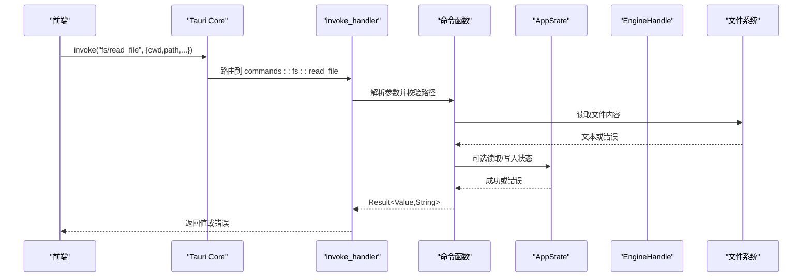
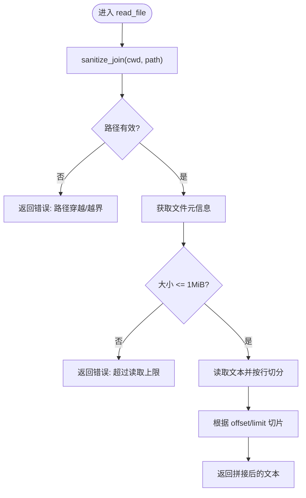
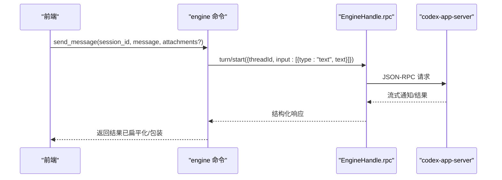
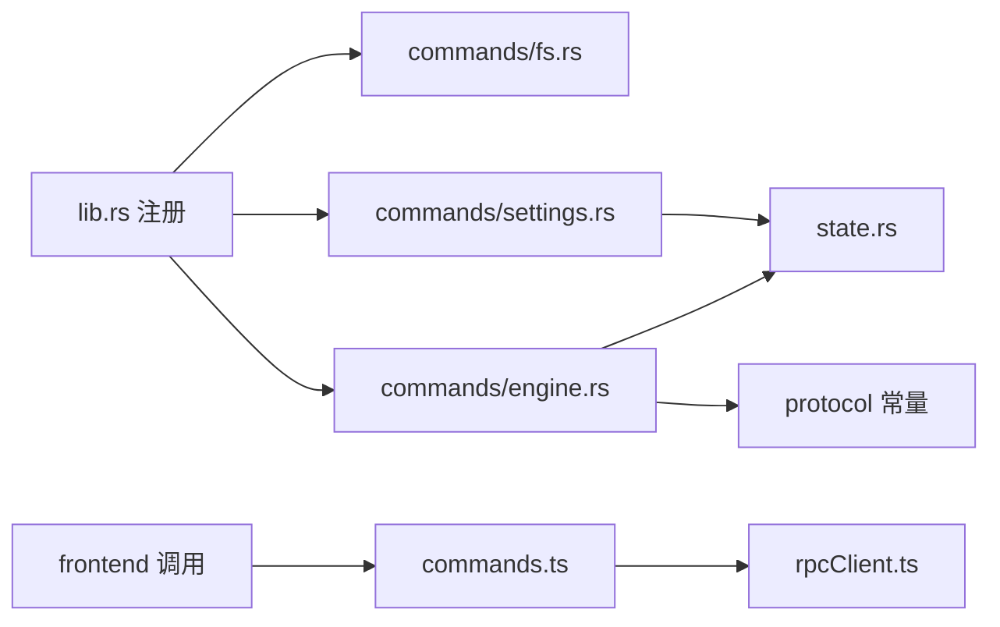

# Tauri 命令系统

<cite>
**本文引用的文件**
- [lib.rs](file://src-tauri/src/lib.rs)
- [main.rs](file://src-tauri/src/main.rs)
- [commands/mod.rs](file://src-tauri/src/commands/mod.rs)
- [commands/fs.rs](file://src-tauri/src/commands/fs.rs)
- [commands/engine.rs](file://src-tauri/src/commands/engine.rs)
- [commands/settings.rs](file://src-tauri/src/commands/settings.rs)
- [state.rs](file://src-tauri/src/state.rs)
- [tauri.conf.json](file://src-tauri/tauri.conf.json)
- [frontend/app/devbridge/tauri-core.ts](file://frontend/app/devbridge/tauri-core.ts)
- [frontend/app/devbridge/commands.ts](file://frontend/app/devbridge/commands.ts)
- [frontend/app/devbridge/rpcClient.ts](file://frontend/app/devbridge/rpcClient.ts)
</cite>

## 目录
1. [简介](#简介)
2. [项目结构](#项目结构)
3. [核心组件](#核心组件)
4. [架构总览](#架构总览)
5. [详细组件分析](#详细组件分析)
6. [依赖关系分析](#依赖关系分析)
7. [性能考量](#性能考量)
8. [故障排查指南](#故障排查指南)
9. [结论](#结论)
10. [附录：命令清单与调用示例](#附录命令清单与调用示例)

## 简介
本文件面向 Tauri 命令系统的实现与使用，覆盖前后端通信机制（命令注册、参数传递、返回值处理）、文件系统操作命令、引擎控制命令、设置管理命令的实现细节；解释异步命令处理、错误传播、状态同步机制；提供命令定义示例、调用方式与最佳实践；说明安全验证、权限控制与输入校验策略；并给出调试技巧与性能优化建议。

## 项目结构
后端以 Rust 编写，通过 Tauri 的 invoke_handler 将前端调用映射到具体命令函数；前端在桌面模式下通过 Tauri API 调用命令，在浏览器开发模式下通过 devbridge 将同名命令路由到本地存储或 WebSocket 代理到官方 codex-app-server。

```mermaid
graph TB
FE["前端<br/>React/Vite"] --> |invoke(cmd, args)| TauriCore["Tauri Core 桥接<br/>tauri-core.ts"]
TauriCore --> |dispatchCommand| DevBridge["DevBridge 命令分发<br/>commands.ts"]
DevBridge --> |engine.*| RPC["WebSocket JSON-RPC<br/>rpcClient.ts"]
DevBridge --> |store.*| LocalStore["localStorage 镜像"]
TauriCore --> |生产模式| TauriInvoke["Tauri invoke_handler<br/>lib.rs"]
TauriInvoke --> Cmds["命令模块<br/>commands/*"]
Cmds --> State["应用状态<br/>state.rs"]
Cmds --> Engine["引擎侧车<br/>codex::EngineHandle"]
Cmds --> FS["文件系统插件<br/>tauri_plugin_fs"]
```

图表来源
- [lib.rs:16-148](file://src-tauri/src/lib.rs#L16-L148)
- [frontend/app/devbridge/tauri-core.ts:10-17](file://frontend/app/devbridge/tauri-core.ts#L10-L17)
- [frontend/app/devbridge/commands.ts:669-682](file://frontend/app/devbridge/commands.ts#L669-L682)
- [frontend/app/devbridge/rpcClient.ts:201-221](file://frontend/app/devbridge/rpcClient.ts#L201-L221)

章节来源
- [lib.rs:16-148](file://src-tauri/src/lib.rs#L16-L148)
- [commands/mod.rs:1-11](file://src-tauri/src/commands/mod.rs#L1-L11)
- [tauri.conf.json:29-59](file://src-tauri/tauri.conf.json#L29-L59)

## 核心组件
- 命令注册中心：在 lib.rs 中集中注册所有命令，形成统一入口。
- 命令模块：按功能划分 fs、engine、settings 等子模块，职责清晰。
- 状态管理：AppState 持久化 UI 相关配置与数据，支持线程安全的读写。
- 引擎桥接：engine 命令将请求转发至官方 codex-app-server，进行会话、消息、插件、MCP 等能力交互。
- 前端桥接：devbridge 在浏览器模式下复现相同命令语义，保证开发与生产行为一致。

章节来源
- [lib.rs:71-148](file://src-tauri/src/lib.rs#L71-L148)
- [state.rs:150-232](file://src-tauri/src/state.rs#L150-L232)
- [commands/engine.rs:13-20](file://src-tauri/src/commands/engine.rs#L13-L20)
- [frontend/app/devbridge/commands.ts:69-368](file://frontend/app/devbridge/commands.ts#L69-L368)

## 架构总览
Tauri 命令系统采用“前端 invoke -> 后端 handler -> 业务逻辑 -> 外部资源”的分层架构。命令函数通过 tauri::command 宏暴露给前端；异步命令使用 async 函数并通过 Tauri 异步运行时执行；错误通过 Result 类型返回字符串错误信息，前端可据此降级展示。



图表来源
- [lib.rs:71-148](file://src-tauri/src/lib.rs#L71-L148)
- [commands/fs.rs:101-121](file://src-tauri/src/commands/fs.rs#L101-L121)
- [commands/settings.rs:8-33](file://src-tauri/src/commands/settings.rs#L8-L33)

## 详细组件分析

### 文件系统操作命令（fs）
- list_files：列出工作区目录下的文件与文件夹，过滤隐藏文件和忽略目录，返回标准化条目。
- read_file：限制最大读取大小，支持分页读取行范围。
- write_file：创建父目录并写入文件内容。

安全与校验
- 路径穿越防护：拒绝包含 ".." 的路径，并在规范化后确保仍在根目录下。
- 大小限制：读文件上限为 1MiB，防止大文件导致内存压力。
- 忽略目录：跳过 node_modules、dist、build、out、target、.git、.idea、.vscode、vendor 等。



图表来源
- [commands/fs.rs:31-48](file://src-tauri/src/commands/fs.rs#L31-L48)
- [commands/fs.rs:101-121](file://src-tauri/src/commands/fs.rs#L101-L121)

章节来源
- [commands/fs.rs:1-132](file://src-tauri/src/commands/fs.rs#L1-L132)

### 引擎控制命令（engine）
- 会话管理：new_session、list_sessions、get_session、delete_session、archive_session、unarchive_session。
- 消息与中断：send_message、interrupt_session。
- 审批与响应：resolve_approval、respond_server_request。
- 提供者与配置：list_providers、save_provider、probe_provider。
- MCP 与技能/插件：list_mcp_servers、save_mcp_server、test_mcp_connection、set_mcp_server_enabled、list_skills、reload_skills、list_plugins、set_plugin_enabled。
- Shell 与 Git：open_shell、write_shell、read_shell、close_shell、git_status、get_runtime_events、list_agent_tools、rpc_raw。

关键实现要点
- 统一 rpc 封装：内部函数将方法名与参数转换为 JSON-RPC 调用，统一错误处理。
- 结果归一化：对 threadStart、providers、servers、skills、plugins 等返回结构进行适配，便于前端消费。
- Provider 保存：仅写入官方 schema 字段，API Key 不写入配置文件，而是保存在 shell store 并通过环境变量注入 sidecar。
- Provider 探测：直接 HTTP 探测网关模型列表，兼容 OpenAI/Anthropic/Ollama 多种协议。
- Shell 生命周期：open_shell 返回 processId，write_shell 发送 base64 编码的 stdin，close_shell 先关闭 stdin 再终止进程。



图表来源
- [commands/engine.rs:102-127](file://src-tauri/src/commands/engine.rs#L102-L127)
- [commands/engine.rs:13-20](file://src-tauri/src/commands/engine.rs#L13-L20)

章节来源
- [commands/engine.rs:22-800](file://src-tauri/src/commands/engine.rs#L22-L800)

### 设置管理命令（settings）
- get_settings/save_settings：读取/保存应用设置，包括主题、语言、活跃 provider、终端 shell、审批策略、沙箱、app server 地址与二进制路径。
- get_preferences/save_preferences：读取/保存偏好项，支持扩展字段 flatten。
- list_shortcuts/save_shortcuts：快捷键列表的读取与保存。

状态持久化
- AppState 使用 Mutex 保护并发访问，save 时写临时文件再原子重命名，避免损坏。
- save_settings 会更新协议适配器活跃 provider，确保路由生效。

章节来源
- [commands/settings.rs:1-69](file://src-tauri/src/commands/settings.rs#L1-L69)
- [state.rs:176-232](file://src-tauri/src/state.rs#L176-L232)

### 前后端通信机制
- 命令注册：lib.rs 中通过 generate_handler! 集中注册命令，形成统一入口。
- 参数传递：Tauri 自动将 camelCase/snake_case 参数映射到 Rust 函数参数；前端 devbridge 也兼容两种键名。
- 返回值处理：Rust 命令返回 Result<T, String>，错误以字符串形式返回；前端在 dev 模式下同样抛出错误，保持行为一致。
- 事件广播：sidecar 通知经事件桥接到前端，用于 approval、user-input、server-request 等场景。

章节来源
- [lib.rs:71-148](file://src-tauri/src/lib.rs#L71-L148)
- [frontend/app/devbridge/commands.ts:44-47](file://frontend/app/devbridge/commands.ts#L44-L47)
- [frontend/app/devbridge/rpcClient.ts:103-148](file://frontend/app/devbridge/rpcClient.ts#L103-L148)

## 依赖关系分析
- 命令模块依赖：
  - engine 命令依赖 EngineHandle 与 protocol 常量，负责与 codex-app-server 通信。
  - settings 命令依赖 AppState，负责 UI 状态的读写与持久化。
  - fs 命令依赖 std::fs 与路径校验逻辑，确保安全性。
- 前端依赖：
  - tauri-core.ts 在浏览器模式下将 invoke 路由到 dispatchCommand。
  - commands.ts 维护 engineCommands、storeCommands、pluginCommands 三类处理器。
  - rpcClient.ts 实现 JSON-RPC 客户端，负责握手、超时、重连与事件分发。



图表来源
- [lib.rs:71-148](file://src-tauri/src/lib.rs#L71-L148)
- [commands/engine.rs:13-20](file://src-tauri/src/commands/engine.rs#L13-L20)
- [commands/settings.rs:1-69](file://src-tauri/src/commands/settings.rs#L1-L69)
- [frontend/app/devbridge/commands.ts:669-682](file://frontend/app/devbridge/commands.ts#L669-L682)
- [frontend/app/devbridge/rpcClient.ts:201-221](file://frontend/app/devbridge/rpcClient.ts#L201-L221)

章节来源
- [commands/mod.rs:1-11](file://src-tauri/src/commands/mod.rs#L1-L11)
- [state.rs:150-232](file://src-tauri/src/state.rs#L150-L232)

## 性能考量
- 文件读取限制：read_file 限制单次读取 1MiB，避免大文件导致内存峰值。
- 异步处理：engine 命令使用 async 函数，减少阻塞；shell 输出通过通知流式推送，避免轮询。
- 连接复用：rpcClient 维护单例 WebSocket，带超时与重连，降低连接开销。
- 配置批量写入：save_provider 使用 batchWrite 合并多次编辑，减少往返。
- 状态持久化：AppState.save 使用临时文件+原子重命名，提升可靠性。

[本节为通用指导，无需特定文件引用]

## 故障排查指南
- 常见错误来源
  - 路径穿越被拒：检查传入路径是否包含 ".." 或越界。
  - 文件过大：read_file 超过 1MiB 会报错，需分页或调整策略。
  - 引擎未连接：engine_status 返回 connected=false，检查 WebSocket 连接与代理。
  - Provider 鉴权失败：probe_provider 返回 401/403，核对 API Key 与协议头。
- 调试技巧
  - 启用 tracing：lib.rs 初始化日志过滤器，可按模块调整级别。
  - 浏览器模式：通过 vite 代理与 ?engine=ws://host:port 指定引擎地址，观察 WS 帧。
  - 命令回放：devbridge 的 commands.ts 记录每个命令的参数与返回值，便于对比生产与开发差异。
- 恢复策略
  - 重启应用：provider 密钥注入在启动时生效。
  - 清理状态：删除 shell-state.json 或使用默认值重建。
  - 重试机制：rpcClient 自动重连，必要时重置连接。

章节来源
- [commands/fs.rs:31-48](file://src-tauri/src/commands/fs.rs#L31-L48)
- [commands/engine.rs:416-521](file://src-tauri/src/commands/engine.rs#L416-L521)
- [frontend/app/devbridge/rpcClient.ts:150-187](file://frontend/app/devbridge/rpcClient.ts#L150-L187)
- [lib.rs:9-14](file://src-tauri/src/lib.rs#L9-L14)

## 结论
该 Tauri 命令系统通过清晰的模块化设计与统一的 invoke_handler，实现了前后端一致的命令语义。文件系统命令注重安全与性能；引擎命令对接官方服务并提供丰富的会话与工具管理能力；设置命令保障 UI 状态的可配置性与持久化。结合 devbridge，开发与生产环境保持一致的行为与错误处理，便于快速定位问题与优化体验。

[本节为总结性内容，无需特定文件引用]

## 附录：命令清单与调用示例
- 文件系统
  - list_files(cwd, dir)：返回目录条目数组。
  - read_file(cwd, path, offset?, limit?)：返回文本片段。
  - write_file(cwd, path, content)：写入文件。
- 引擎控制
  - engine_status()：返回连接状态与初始化元信息。
  - new_session(project_path?)：创建新会话。
  - send_message(session_id, message, attachments?)：发送消息。
  - resolve_approval(request_id, approved, kind?, session_scope?)：审批决策。
  - probe_provider(provider_id?, base_url?, protocol?, api_key?, model?)：探测提供者连通性。
  - open_shell(session_id?, shell?, cwd?)：打开交互式 shell。
- 设置管理
  - get_settings() / save_settings(settings)：读取/保存应用设置。
  - get_preferences() / save_preferences(preferences)：读取/保存偏好。
  - list_shortcuts() / save_shortcuts(shortcuts)：快捷键列表。

调用方式
- 桌面模式：通过 Tauri invoke(cmd, args) 调用。
- 浏览器模式：通过 devbridge 的 dispatchCommand(cmd, args) 调用，行为与桌面一致。

最佳实践
- 始终校验用户输入，尤其是路径与 URL。
- 对敏感信息（如 API Key）不要写入明文配置，使用 shell store 与环境变量注入。
- 使用批量写入减少网络往返。
- 对长耗时操作使用异步与流式通知，避免阻塞 UI。

章节来源
- [lib.rs:71-148](file://src-tauri/src/lib.rs#L71-L148)
- [commands/fs.rs:50-132](file://src-tauri/src/commands/fs.rs#L50-L132)
- [commands/engine.rs:22-800](file://src-tauri/src/commands/engine.rs#L22-L800)
- [commands/settings.rs:8-69](file://src-tauri/src/commands/settings.rs#L8-L69)
- [frontend/app/devbridge/tauri-core.ts:10-17](file://frontend/app/devbridge/tauri-core.ts#L10-L17)
- [frontend/app/devbridge/commands.ts:669-682](file://frontend/app/devbridge/commands.ts#L669-L682)