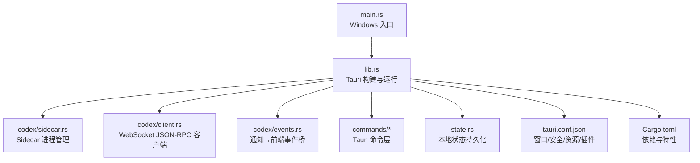
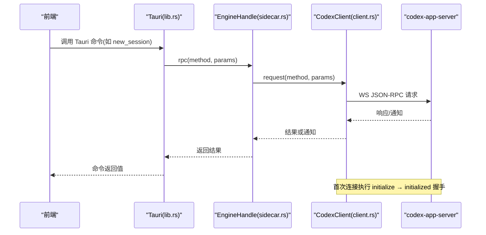
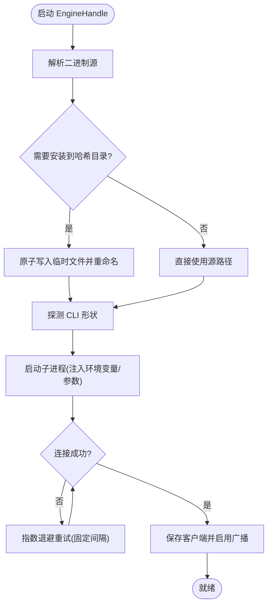
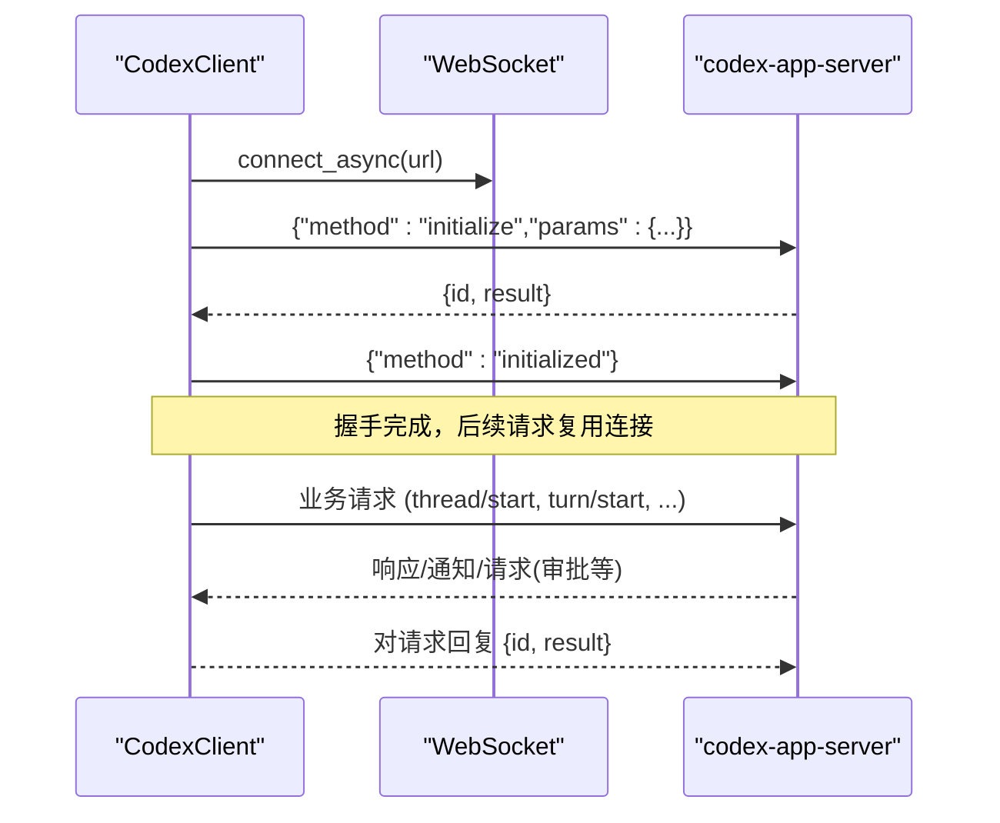
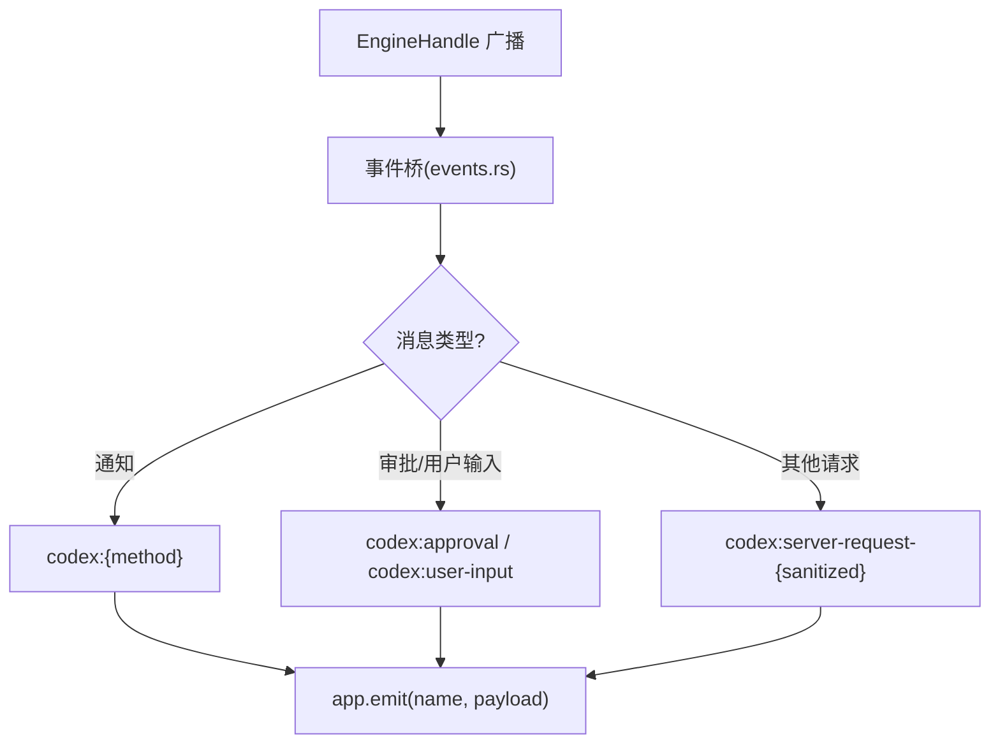
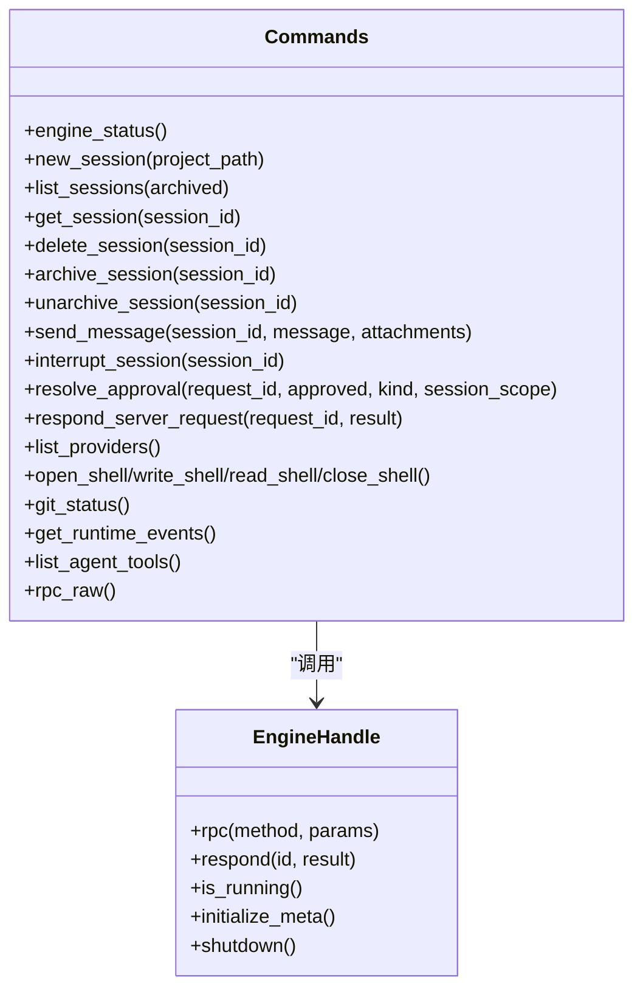
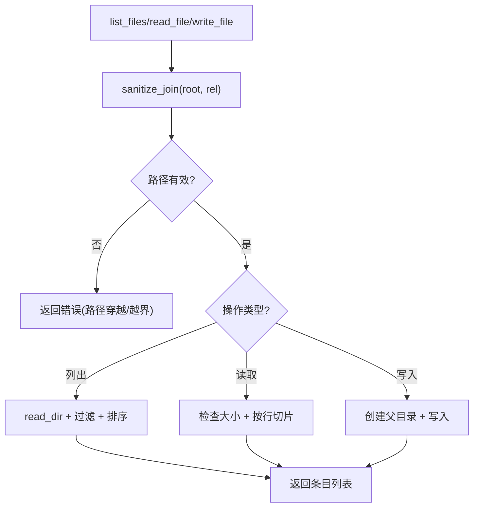
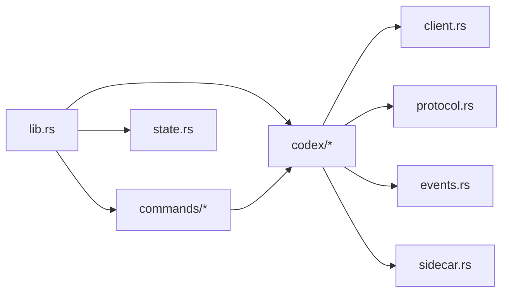

# 后端开发

<cite>
**本文引用的文件**
- [src-tauri/src/main.rs](file://src-tauri/src/main.rs)
- [src-tauri/src/lib.rs](file://src-tauri/src/lib.rs)
- [src-tauri/Cargo.toml](file://src-tauri/Cargo.toml)
- [src-tauri/tauri.conf.json](file://src-tauri/tauri.conf.json)
- [src-tauri/src/codex/mod.rs](file://src-tauri/src/codex/mod.rs)
- [src-tauri/src/codex/sidecar.rs](file://src-tauri/src/codex/sidecar.rs)
- [src-tauri/src/codex/client.rs](file://src-tauri/src/codex/client.rs)
- [src-tauri/src/codex/events.rs](file://src-tauri/src/codex/events.rs)
- [src-tauri/src/codex/protocol.rs](file://src-tauri/src/codex/protocol.rs)
- [src-tauri/src/state.rs](file://src-tauri/src/state.rs)
- [src-tauri/src/commands/mod.rs](file://src-tauri/src/commands/mod.rs)
- [src-tauri/src/commands/engine.rs](file://src-tauri/src/commands/engine.rs)
- [src-tauri/src/commands/fs.rs](file://src-tauri/src/commands/fs.rs)
- [src-tauri/src/commands/settings.rs](file://src-tauri/src/commands/settings.rs)
- [docs/RUST_BACKEND.md](file://docs/RUST_BACKEND.md)
</cite>

## 目录
1. [简介](#简介)
2. [项目结构](#项目结构)
3. [核心组件](#核心组件)
4. [架构总览](#架构总览)
5. [详细组件分析](#详细组件分析)
6. [依赖关系分析](#依赖关系分析)
7. [性能考虑](#性能考虑)
8. [故障排查指南](#故障排查指南)
9. [结论](#结论)
10. [附录](#附录)

## 简介
本文件面向 Codex-Tauri 的后端开发者，系统性说明 Rust 后端的整体架构与关键实现：Tauri 命令系统、Sidecar 进程管理、引擎生命周期控制、异步模型、错误处理、资源管理、文件系统与安全访问、日志与调试、以及性能监控方法。文档同时给出与官方 codex-app-server 的集成模式、API 映射与事件桥接机制，并提供开发与测试建议。

## 项目结构
- 入口与初始化
  - Windows GUI 入口在 main.rs，调用库函数 run() 完成 Tauri 应用启动。
  - lib.rs 中注册插件、菜单、状态、命令处理器，并启动协议适配器与 Sidecar 引擎，建立事件桥。
- 模块划分
  - codex：封装与官方引擎交互（客户端、协议常量、事件桥、Sidecar 管理）。
  - commands：Tauri 命令集合（应用状态、设置、文件系统、引擎转发等）。
  - state：本地桌面状态持久化（设置、偏好、宠物、日历、连接器、快捷方式、计划任务、提供商密钥等）。
- 配置与打包
  - Cargo.toml 声明依赖与特性；tauri.conf.json 定义窗口、安全策略、资源与插件权限。

**图表来源**
- [src-tauri/src/main.rs:1-7](file://src-tauri/src/main.rs#L1-L7)
- [src-tauri/src/lib.rs:1-162](file://src-tauri/src/lib.rs#L1-L162)
- [src-tauri/src/codex/sidecar.rs:1-125](file://src-tauri/src/codex/sidecar.rs#L1-L125)
- [src-tauri/src/codex/client.rs:1-94](file://src-tauri/src/codex/client.rs#L1-L94)
- [src-tauri/src/codex/events.rs:1-43](file://src-tauri/src/codex/events.rs#L1-L43)
- [src-tauri/src/commands/mod.rs:1-11](file://src-tauri/src/commands/mod.rs#L1-L11)
- [src-tauri/src/state.rs:1-331](file://src-tauri/src/state.rs#L1-L331)
- [src-tauri/tauri.conf.json:1-61](file://src-tauri/tauri.conf.json#L1-L61)
- [src-tauri/Cargo.toml:1-58](file://src-tauri/Cargo.toml#L1-L58)

**章节来源**
- [src-tauri/src/main.rs:1-7](file://src-tauri/src/main.rs#L1-L7)
- [src-tauri/src/lib.rs:1-162](file://src-tauri/src/lib.rs#L1-L162)
- [src-tauri/tauri.conf.json:1-61](file://src-tauri/tauri.conf.json#L1-L61)
- [src-tauri/Cargo.toml:1-58](file://src-tauri/Cargo.toml#L1-L58)

## 核心组件
- Tauri 应用骨架
  - 初始化日志订阅器，注册对话框、Shell、FS、Store 插件，构建菜单与事件处理。
  - 加载 AppState，启动协议适配器（用于自定义 Provider 路由），管理 EngineHandle，启动事件桥。
  - 注册大量 Tauri 命令，覆盖应用状态、设置、文件系统、引擎转发、市场等。
- Sidecar 引擎管理
  - 负责二进制解析、内容寻址安装、CLI 形状探测、进程启动、连接重试、RPC 转发、响应服务端请求、优雅关闭。
- WebSocket JSON-RPC 客户端
  - 维护读写任务、待处理请求映射、连接状态、广播通知通道；执行 initialize/initialized 握手；支持超时与错误传播。
- 事件桥
  - 将引擎通知与请求映射为 Tauri 事件（如 codex:turn-completed、codex:approval、codex:user-input），供前端订阅。
- 本地状态
  - 集中存储设置、偏好、宠物、日历、连接器、快捷键、计划任务、提供商密钥与协议信息；提供快照与原子写入。

**章节来源**
- [src-tauri/src/lib.rs:8-162](file://src-tauri/src/lib.rs#L8-L162)
- [src-tauri/src/codex/sidecar.rs:22-276](file://src-tauri/src/codex/sidecar.rs#L22-L276)
- [src-tauri/src/codex/client.rs:23-199](file://src-tauri/src/codex/client.rs#L23-L199)
- [src-tauri/src/codex/events.rs:1-82](file://src-tauri/src/codex/events.rs#L1-L82)
- [src-tauri/src/state.rs:150-232](file://src-tauri/src/state.rs#L150-L232)

## 架构总览
Codex-Tauri 作为 Tauri Shell，通过 WebSocket 与官方 codex-app-server 通信。Shell 负责：
- 进程管理：发现/安装/启动 Sidecar，注入环境变量（Provider API Key），探测 CLI 参数。
- 协议适配：维护 JSON-RPC 客户端，执行握手，转发请求/响应，广播通知。
- 事件桥：将引擎消息转换为 Tauri 事件，驱动前端 UI。
- 命令层：暴露 Tauri 命令给前端，封装引擎 RPC、本地状态与文件系统操作。

**图表来源**
- [src-tauri/src/lib.rs:71-148](file://src-tauri/src/lib.rs#L71-L148)
- [src-tauri/src/codex/sidecar.rs:224-244](file://src-tauri/src/codex/sidecar.rs#L224-L244)
- [src-tauri/src/codex/client.rs:37-133](file://src-tauri/src/codex/client.rs#L37-L133)
- [docs/RUST_BACKEND.md:144-171](file://docs/RUST_BACKEND.md#L144-L171)

## 详细组件分析

### Sidecar 进程管理与引擎生命周期
- 二进制解析与安装
  - 优先级：环境变量 > 用户配置路径 > 打包资源/相邻目录/开发路径 > 历史内容哈希目录 > PATH。
  - 内容哈希目录：基于文件字节计算 FNV-1a 哈希，原子写入临时文件再重命名，避免部分写入。
- CLI 形状探测
  - 通过运行帮助输出判断是否为多调用二进制（需 app-server 子命令）及是否接受 --session-source。
- 进程启动与参数
  - 注入 Provider API Key 环境变量；根据设置选择监听地址；隐藏控制台窗口（Windows 发布版）。
- 连接与重试
  - 冷启动时多次尝试连接，避免与 Sidecar 端口绑定竞争导致的瞬时失败。
- 生命周期
  - 启动时创建事件广播通道；连接成功后保存客户端并广播通知；关闭时断开 WS、终止子进程、重置运行标志。

**图表来源**
- [src-tauri/src/codex/sidecar.rs:366-513](file://src-tauri/src/codex/sidecar.rs#L366-L513)
- [src-tauri/src/codex/sidecar.rs:294-340](file://src-tauri/src/codex/sidecar.rs#L294-L340)
- [src-tauri/src/codex/sidecar.rs:188-222](file://src-tauri/src/codex/sidecar.rs#L188-L222)
- [src-tauri/src/codex/sidecar.rs:262-275](file://src-tauri/src/codex/sidecar.rs#L262-L275)

**章节来源**
- [src-tauri/src/codex/sidecar.rs:32-125](file://src-tauri/src/codex/sidecar.rs#L32-L125)
- [src-tauri/src/codex/sidecar.rs:188-276](file://src-tauri/src/codex/sidecar.rs#L188-L276)
- [docs/RUST_BACKEND.md:71-116](file://docs/RUST_BACKEND.md#L71-L116)

### WebSocket JSON-RPC 客户端与握手
- 连接与任务
  - 拆分读写任务；写任务接收命令发送文本帧；读任务解析消息并分发。
- 握手流程
  - 发送 initialize 请求（包含客户端信息与能力），等待响应；随后发送 initialized 通知（无 params）。
- 请求/响应
  - 使用 oneshot 通道维护 pending 映射；超时控制：initialize 10s，普通请求 120s。
- 通知与广播
  - 通知与请求通过 broadcast 通道分发，容量 256，避免阻塞请求映射。
- 服务端请求回复
  - respond(id, result) 以 JSON-RPC 结果形式回复服务端请求（审批、用户输入、elicitation）。

**图表来源**
- [src-tauri/src/codex/client.rs:37-133](file://src-tauri/src/codex/client.rs#L37-L133)
- [src-tauri/src/codex/client.rs:148-194](file://src-tauri/src/codex/client.rs#L148-L194)
- [src-tauri/src/codex/protocol.rs:103-156](file://src-tauri/src/codex/protocol.rs#L103-L156)
- [docs/RUST_BACKEND.md:144-171](file://docs/RUST_BACKEND.md#L144-L171)

**章节来源**
- [src-tauri/src/codex/client.rs:1-234](file://src-tauri/src/codex/client.rs#L1-L234)
- [src-tauri/src/codex/protocol.rs:1-207](file://src-tauri/src/codex/protocol.rs#L1-L207)
- [docs/RUST_BACKEND.md:144-171](file://docs/RUST_BACKEND.md#L144-L171)

### 事件桥与前端集成
- 订阅与转发
  - 启动时延迟订阅 EngineHandle 的事件通道；收到消息后映射为 Tauri 事件名（替换 / 和 . 为 -）。
- 事件分类
  - 通知 → codex:{method}
  - 审批/用户输入/elicitation → codex:approval / codex:user-input
  - 其他服务端请求 → codex:server-request-{sanitized}
- 前端对接
  - 前端通过 Tauri 事件订阅这些频道；bridge.js 将 codex:* 映射为 agent:* 自定义事件。

**图表来源**
- [src-tauri/src/codex/events.rs:11-43](file://src-tauri/src/codex/events.rs#L11-L43)
- [src-tauri/src/codex/events.rs:45-82](file://src-tauri/src/codex/events.rs#L45-L82)

**章节来源**
- [src-tauri/src/codex/events.rs:1-82](file://src-tauri/src/codex/events.rs#L1-L82)

### Tauri 命令系统与引擎转发
- 命令注册
  - 在 lib.rs 中集中注册命令，涵盖应用状态、设置、文件系统、引擎转发、市场等。
- 引擎命令
  - engine_status、new_session、list_sessions、get_session、delete_session、archive/unarchive、send_message、interrupt、resolve_approval、respond_server_request、list_providers、MCP/Skills/Plugins/Hooks 相关、Shell 执行、Git 状态、运行时事件、工具列表、rpc_raw 等。
- 数据规范化
  - 对 thread/start 响应进行扁平化处理；provider 列表从 config/read 归一化为 providers 数组。

**图表来源**
- [src-tauri/src/lib.rs:71-148](file://src-tauri/src/lib.rs#L71-L148)
- [src-tauri/src/commands/engine.rs:1-200](file://src-tauri/src/commands/engine.rs#L1-L200)
- [src-tauri/src/codex/sidecar.rs:224-276](file://src-tauri/src/codex/sidecar.rs#L224-L276)

**章节来源**
- [src-tauri/src/commands/engine.rs:1-200](file://src-tauri/src/commands/engine.rs#L1-L200)
- [src-tauri/src/lib.rs:71-148](file://src-tauri/src/lib.rs#L71-L148)

### 文件系统操作与安全访问控制
- 白名单与路径校验
  - 忽略常见目录（node_modules、dist、build、out、target、.git、.idea、.vscode、vendor）。
  - sanitize_join 拒绝路径穿越，并在 canonicalize 后验证仍在根目录下。
- 读取限制
  - 单次读取上限 1MiB；支持按行偏移与限长读取。
- 写入保护
  - 自动创建父目录；异常统一转为字符串错误返回。

**图表来源**
- [src-tauri/src/commands/fs.rs:31-48](file://src-tauri/src/commands/fs.rs#L31-L48)
- [src-tauri/src/commands/fs.rs:50-132](file://src-tauri/src/commands/fs.rs#L50-L132)

**章节来源**
- [src-tauri/src/commands/fs.rs:1-132](file://src-tauri/src/commands/fs.rs#L1-L132)

### 本地状态与资源管理
- 状态结构
  - Settings、Preferences、Pet、CalendarEvent、CinemaTimeline/Job、Connector、Shortcut、ScheduledTask、PullRequest、Provider 密钥与协议映射。
- 持久化
  - 数据目录位于系统配置目录下的 CodexDesktop；shell-state.json 采用原子写入（先写临时文件再重命名）。
- 默认值与初始化
  - 主题、语言、监听地址、默认计划任务等；Provider 密钥通过环境变量注入 Sidecar，不写入配置文件。

**章节来源**
- [src-tauri/src/state.rs:1-331](file://src-tauri/src/state.rs#L1-L331)

### 协议与方法映射
- 方法清单
  - 线程、回合、配置、模型、账户、MCP、技能、插件、钩子、Shell/Exec、文件系统、项目等。
- 注意事项
  - 某些方法名与前端生成表保持一致；注意 response 形状差异（如 thread/list 返回 data 字段而非 threads）。
  - 审批与用户输入通过服务端请求 id 回复，而非专用客户端方法。

**章节来源**
- [src-tauri/src/codex/protocol.rs:1-207](file://src-tauri/src/codex/protocol.rs#L1-L207)
- [docs/RUST_BACKEND.md:173-277](file://docs/RUST_BACKEND.md#L173-L277)

## 依赖关系分析
- 外部依赖
  - tauri、tauri-plugin-*、tokio、tokio-tungstenite、futures-util、serde、uuid、thiserror、anyhow、reqwest、tracing、dirs、chrono、notify-rust、cron、walkdir、regex。
- 内部依赖
  - lib.rs 聚合 codex、commands、menu、state；commands 依赖 codex 与 state；sidecar 依赖 client 与 protocol；events 依赖 protocol 与 EngineHandle。

**图表来源**
- [src-tauri/src/lib.rs:1-162](file://src-tauri/src/lib.rs#L1-L162)
- [src-tauri/src/codex/mod.rs:1-9](file://src-tauri/src/codex/mod.rs#L1-L9)
- [src-tauri/Cargo.toml:17-49](file://src-tauri/Cargo.toml#L17-L49)

**章节来源**
- [src-tauri/Cargo.toml:1-58](file://src-tauri/Cargo.toml#L1-L58)
- [src-tauri/src/codex/mod.rs:1-9](file://src-tauri/src/codex/mod.rs#L1-L9)

## 性能考虑
- 连接与重试
  - 冷启动时多次短间隔重试连接，降低首次 RPC 失败概率。
- 事件广播
  - 使用 tokio::sync::broadcast 通道（容量 256）广播通知，避免阻塞请求映射；记录丢包日志以便调优。
- 超时控制
  - initialize 10s、普通请求 120s；超时后清理 pending 映射，防止泄漏。
- 文件读取限制
  - 单文件读取上限 1MiB，避免大文件导致内存压力。
- 进程管理
  - 内容哈希目录确保原子写入；关闭时显式终止子进程，释放资源。

[本节为通用指导，不直接分析具体文件]

## 故障排查指南
- 无法连接 Sidecar
  - 检查二进制是否解析成功（环境变量/配置/资源目录/PATH）；查看日志中的“no codex-app-server binary resolved”提示。
  - 确认监听地址与端口未被占用；必要时调整 settings.app_server_listen。
- 握手失败
  - 确认 initialize 响应与 initialized 通知顺序正确；检查客户端版本与能力字段。
- 事件未到达前端
  - 检查事件桥是否订阅成功；关注 Lagged 日志；确认前端订阅了正确的 codex:* 事件。
- 审批/用户输入卡住
  - 确认通过 respond_server_request 或 resolve_approval 回复了对应 request id；核对 availableDecisions。
- 文件系统错误
  - 检查路径穿越防护与根目录约束；确认 cwd 存在且可读；关注 1MiB 读取限制。

**章节来源**
- [src-tauri/src/codex/sidecar.rs:110-116](file://src-tauri/src/codex/sidecar.rs#L110-L116)
- [src-tauri/src/codex/client.rs:121-133](file://src-tauri/src/codex/client.rs#L121-L133)
- [src-tauri/src/codex/events.rs:33-39](file://src-tauri/src/codex/events.rs#L33-L39)
- [src-tauri/src/commands/fs.rs:31-48](file://src-tauri/src/commands/fs.rs#L31-L48)

## 结论
Codex-Tauri 后端以 Tauri 为壳，通过 Sidecar 与官方引擎解耦，实现了稳健的进程管理、可靠的 WebSocket JSON-RPC 通信、清晰的事件桥与命令层。结合本地状态持久化与严格的安全访问控制，提供了可扩展的桌面体验。建议在后续迭代中增强存活检测、SHA-256 校验与更完善的请求快速失败机制。

[本节为总结性内容，不直接分析具体文件]

## 附录
- 开发环境搭建
  - 准备 Sidecar 二进制：放入 src-tauri/binaries/ 或通过环境变量 CODEX_APP_SERVER 指定路径。
  - 构建与运行：使用 scripts/build.ps1 与 CI 脚本；本地开发可通过 Tauri dev 模式加载前端。
- 调试技巧
  - 使用 tracing-subscriber 与环境变量控制日志级别；关注 Sidecar 启动与连接重试日志。
  - 通过 Tauri 事件面板观察 codex:* 事件流；在前端 bridge.js 中确认事件映射。
- 测试策略
  - 单元测试：针对命令层与状态持久化逻辑。
  - 集成测试：模拟 Sidecar 启动与握手，验证事件桥与命令转发。
  - 协议一致性：对照 docs/RUST_BACKEND.md 的方法清单与响应形状，确保前后端一致。

[本节为通用指导，不直接分析具体文件]