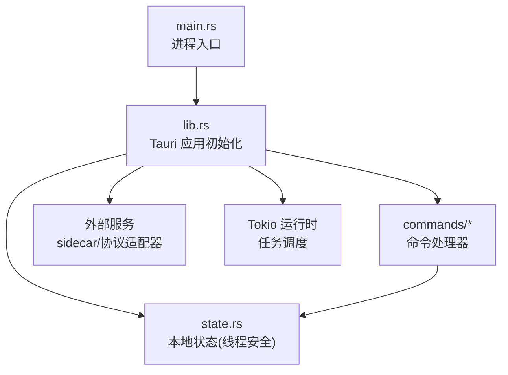
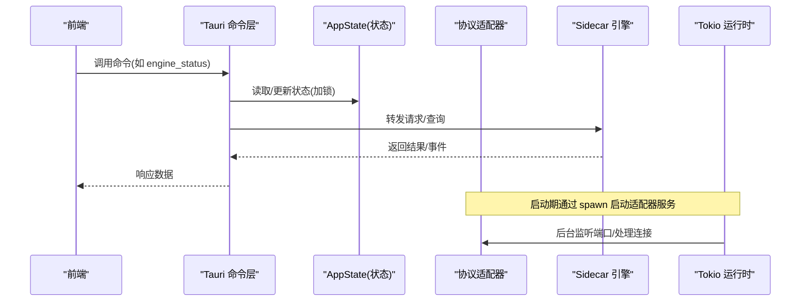
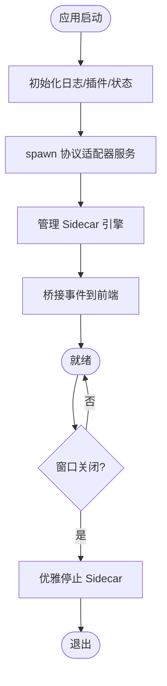
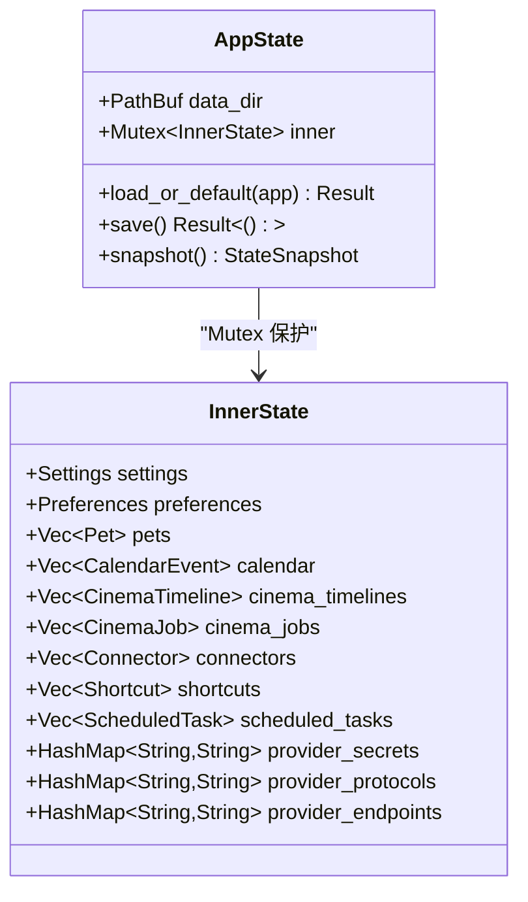
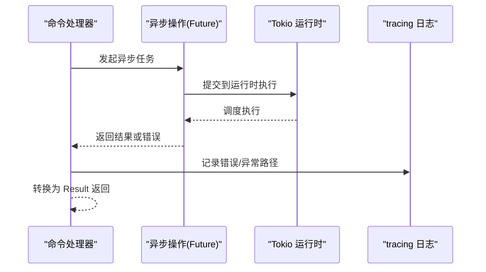
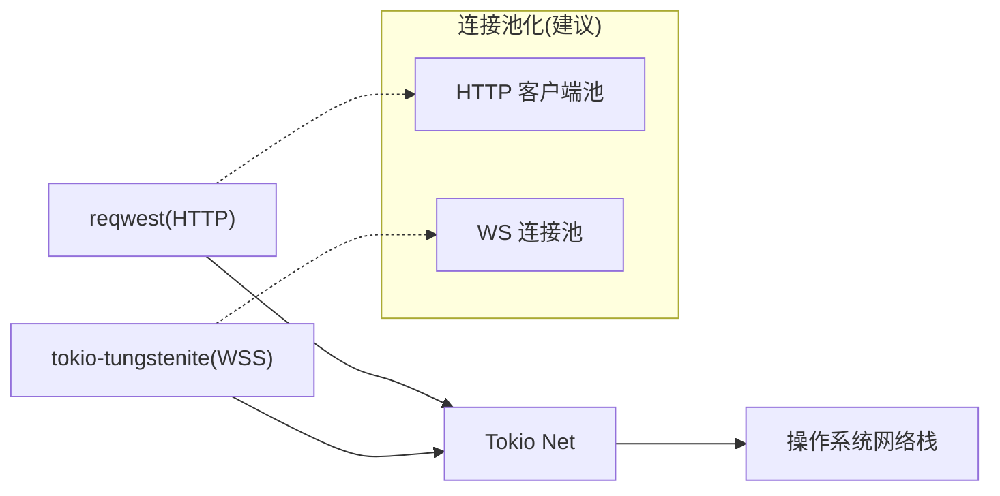
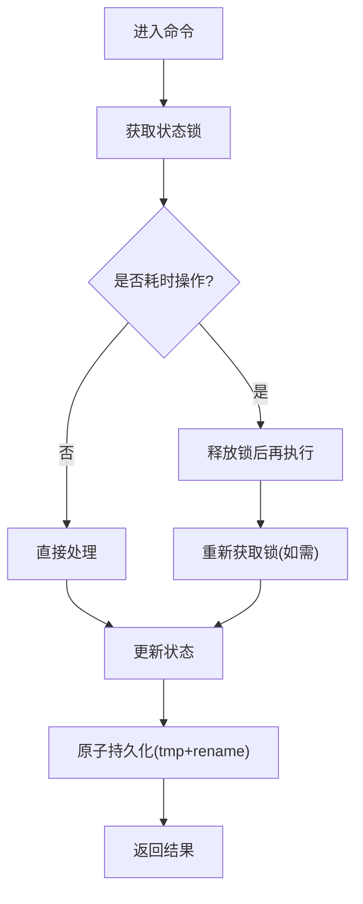
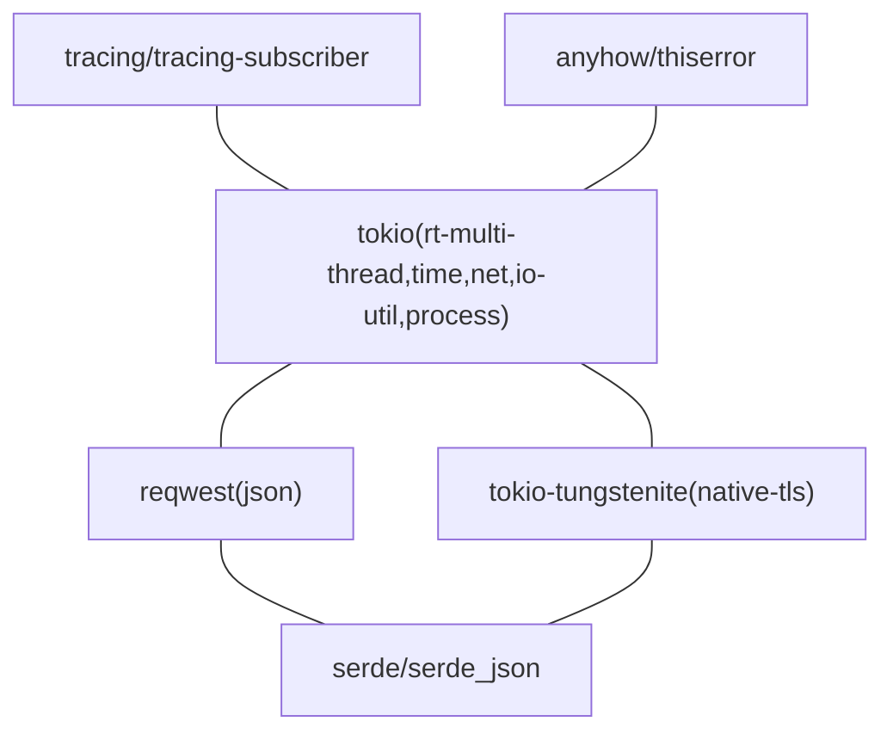

# 异步编程模型

<cite>
**本文引用的文件**
- [Cargo.toml](file://src-tauri/Cargo.toml)
- [main.rs](file://src-tauri/src/main.rs)
- [lib.rs](file://src-tauri/src/lib.rs)
- [state.rs](file://src-tauri/src/state.rs)
- [scheduled.rs](file://src-tauri/src/commands/scheduled.rs)
</cite>

## 目录
1. [简介](#简介)
2. [项目结构](#项目结构)
3. [核心组件](#核心组件)
4. [架构总览](#架构总览)
5. [详细组件分析](#详细组件分析)
6. [依赖关系分析](#依赖关系分析)
7. [性能考量](#性能考量)
8. [故障排查指南](#故障排查指南)
9. [结论](#结论)
10. [附录](#附录)

## 简介
本文件围绕该 Tauri 桌面应用的异步编程模型进行系统化说明，重点覆盖：
- Tokio 运行时配置与任务调度策略
- Future 处理、错误传播与并发控制
- 异步 I/O、网络连接管理与资源池化思路
- 协程间通信、共享状态同步与死锁预防
- 性能监控、瓶颈识别与优化技巧
- 异步编程最佳实践与常见陷阱规避

本项目基于 Tauri 2.x，后端使用 Rust + Tokio 运行时，通过 tauri::async_runtime 启动后台任务，结合命令层（tauri::command）暴露给前端调用。应用启动时初始化日志、插件、菜单、状态，并启动协议适配器与 sidecar 引擎，同时桥接 sidecar 通知到前端事件。

## 项目结构
- 入口与运行
  - Windows GUI 入口在 main.rs，仅转发到库的 run()。
  - 应用初始化与生命周期在 lib.rs 中完成，包含日志、插件、状态、命令注册、窗口关闭钩子等。
- 状态管理
  - state.rs 提供本地 UI 状态的持久化与线程安全访问（Mutex）。
- 命令层
  - commands/* 模块按功能划分，如 scheduled.rs 展示了对共享状态的读取与保存。
- 构建与依赖
  - Cargo.toml 声明了 tokio 及其特性（rt-multi-thread、time、net、io-util 等），以及 reqwest、tokio-tungstenite 等网络相关依赖。

图表来源
- [main.rs:1-7](file://src-tauri/src/main.rs#L1-L7)
- [lib.rs:8-160](file://src-tauri/src/lib.rs#L8-L160)

章节来源
- [main.rs:1-7](file://src-tauri/src/main.rs#L1-L7)
- [lib.rs:8-160](file://src-tauri/src/lib.rs#L8-L160)
- [Cargo.toml:17-49](file://src-tauri/Cargo.toml#L17-L49)

## 核心组件
- 应用初始化与异步任务
  - 在 lib.rs 的 setup 阶段，初始化日志、插件、菜单，创建并管理协议适配器与 sidecar 引擎，并通过 tauri::async_runtime::spawn 启动后台服务器任务。
  - 窗口关闭事件中优雅停止 sidecar，确保资源释放。
- 状态与并发
  - state.rs 中的 AppState 以 Mutex 保护内部状态，所有读写需获取锁；save() 采用原子写入（临时文件+rename）避免损坏。
- 命令与异步 I/O
  - commands/scheduled.rs 展示了命令如何安全读取/更新共享状态，并在必要时触发持久化。

章节来源
- [lib.rs:8-160](file://src-tauri/src/lib.rs#L8-L160)
- [state.rs:150-232](file://src-tauri/src/state.rs#L150-L232)
- [scheduled.rs:11-47](file://src-tauri/src/commands/scheduled.rs#L11-L47)

## 架构总览
下图展示了从前端到后端的异步调用链路与关键组件交互：

图表来源
- [lib.rs:23-68](file://src-tauri/src/lib.rs#L23-L68)
- [lib.rs:71-148](file://src-tauri/src/lib.rs#L71-L148)
- [lib.rs:149-160](file://src-tauri/src/lib.rs#L149-L160)

## 详细组件分析

### Tokio 运行时配置与任务调度
- 运行时特性
  - Cargo.toml 启用 rt-multi-thread、time、net、io-util、process 等特性，支持多线程运行时、定时器、网络 I/O、进程管理等能力。
- 任务调度
  - 使用 tauri::async_runtime::spawn 启动后台任务（如协议适配器服务），由 Tokio 调度执行。
  - 窗口关闭时主动 shutdown 侧边车，体现“启动即守护、退出即清理”的策略。

图表来源
- [lib.rs:8-68](file://src-tauri/src/lib.rs#L8-L68)
- [lib.rs:149-160](file://src-tauri/src/lib.rs#L149-L160)

章节来源
- [Cargo.toml:17-49](file://src-tauri/Cargo.toml#L17-L49)
- [lib.rs:8-68](file://src-tauri/src/lib.rs#L8-L68)
- [lib.rs:149-160](file://src-tauri/src/lib.rs#L149-L160)

### 并发控制与共享状态同步
- 共享状态
  - AppState 内部使用 Mutex<InnerState> 保护多字段集合，所有访问需显式加锁。
- 并发模式
  - 命令层通过 State<'_, AppState> 注入共享状态，读取/修改时遵循“短临界区”原则，减少锁持有时间。
  - 持久化采用“写临时文件再 rename”的方式，保证原子性与一致性。

图表来源
- [state.rs:150-174](file://src-tauri/src/state.rs#L150-L174)
- [state.rs:176-232](file://src-tauri/src/state.rs#L176-L232)

章节来源
- [state.rs:150-232](file://src-tauri/src/state.rs#L150-L232)

### 异步函数编写、Future 处理与错误传播
- 异步函数
  - 命令处理器为同步封装，内部可调用异步操作（如网络请求、I/O），通过 Tokio 运行时驱动 Future 完成。
- Future 处理
  - 后台任务通过 spawn 提交，主流程不阻塞；适配器服务长期运行，持续处理连接。
- 错误传播
  - 命令返回 Result<T, String>，上层统一处理并反馈前端；日志通过 tracing 记录关键错误路径。

图表来源
- [lib.rs:23-68](file://src-tauri/src/lib.rs#L23-L68)
- [Cargo.toml:37-38](file://src-tauri/Cargo.toml#L37-L38)

章节来源
- [lib.rs:23-68](file://src-tauri/src/lib.rs#L23-L68)
- [Cargo.toml:37-38](file://src-tauri/Cargo.toml#L37-L38)

### 异步 I/O、网络连接管理与资源池化
- 网络栈
  - 依赖 tokio-tungstenite（WebSocket）、reqwest（HTTP JSON），配合 Tokio 的 net/io-util 特性实现非阻塞 I/O。
- 连接管理
  - 协议适配器作为独立服务监听端口，接收上游请求并路由至目标 provider；sidecar 通过 WebSocket 与前端交互。
- 资源池化建议
  - 对高频 HTTP 请求可使用 reqwest 客户端池化（复用连接、TLS 会话）；对 WebSocket 连接可按业务域建立连接池，限制最大连接数与空闲超时。

图表来源
- [Cargo.toml:30-31](file://src-tauri/Cargo.toml#L30-L31)
- [Cargo.toml:49](file://src-tauri/Cargo.toml#L49)

章节来源
- [Cargo.toml:30-31](file://src-tauri/Cargo.toml#L30-L31)
- [Cargo.toml:49](file://src-tauri/Cargo.toml#L49)

### 协程间通信、共享状态同步与死锁预防
- 协程间通信
  - 通过 Tauri 命令层与事件系统实现前后端通信；sidecar 通知经事件桥转发到前端。
- 共享状态同步
  - 使用 Mutex 保护状态，命令层在短临界区内完成读/写，避免长时间持锁。
- 死锁预防
  - 禁止在持有锁时发起阻塞 I/O；将耗时操作移出临界区；使用“先克隆/快照再落盘”的模式降低竞争。

图表来源
- [state.rs:209-217](file://src-tauri/src/state.rs#L209-L217)
- [scheduled.rs:11-47](file://src-tauri/src/commands/scheduled.rs#L11-L47)

章节来源
- [state.rs:209-217](file://src-tauri/src/state.rs#L209-L217)
- [scheduled.rs:11-47](file://src-tauri/src/commands/scheduled.rs#L11-L47)

### 性能监控、瓶颈识别与优化技巧
- 监控
  - 使用 tracing/tracing-subscriber 输出结构化日志，可通过环境变量过滤级别；对关键路径添加 span/trace 标记。
- 瓶颈识别
  - 关注 I/O 等待（网络、磁盘）、锁竞争（长临界区）、CPU 密集计算（应 offload 到线程池或外部进程）。
- 优化技巧
  - 批量化 I/O、合并小请求；合理设置连接池大小与超时；避免在 UI 线程或主循环中执行阻塞操作；使用异步流处理大数据集。

章节来源
- [lib.rs:8-14](file://src-tauri/src/lib.rs#L8-L14)
- [Cargo.toml:37-38](file://src-tauri/Cargo.toml#L37-L38)

## 依赖关系分析
- 运行时与特性
  - tokio 启用 rt-multi-thread、time、net、io-util、process，支撑多线程运行时、定时任务、网络 I/O 与进程管理。
- 网络与序列化
  - reqwest 用于 HTTP JSON 请求；tokio-tungstenite 用于 WebSocket；serde/serde_json 用于序列化。
- 日志与工具
  - tracing/tracing-subscriber 用于结构化日志；anyhow/thiserror 用于错误处理；chrono/dirs 用于时间与路径。

图表来源
- [Cargo.toml:17-49](file://src-tauri/Cargo.toml#L17-L49)

章节来源
- [Cargo.toml:17-49](file://src-tauri/Cargo.toml#L17-L49)

## 性能考量
- 运行时选择
  - 多线程运行时适合 I/O 密集型与混合负载；若 CPU 密集占比高，可考虑分离计算任务到专用线程池。
- 连接与超时
  - 为 HTTP/WS 设置合理的连接池大小、空闲超时与请求超时，避免资源泄漏与雪崩。
- 锁粒度
  - 缩小临界区，避免在锁内做 I/O；优先使用不可变快照或只读视图减少竞争。
- 背压与限流
  - 对高频事件（如 sidecar 通知）采用队列与速率限制，防止前端过载。
- 观测性
  - 在关键路径埋点指标（延迟、吞吐、错误率），结合日志定位热点与异常。

[本节为通用指导，无需特定文件引用]

## 故障排查指南
- 常见问题
  - 适配器服务启动失败：检查端口占用与日志；确认环境变量与密钥注入正确。
  - 状态文件损坏：确保原子写入（tmp+rename）成功；回滚机制可用。
  - 锁竞争导致卡顿：审查命令中的临界区长度，移除阻塞 I/O。
- 诊断步骤
  - 调整日志级别，捕获错误堆栈；复现问题并收集上下文信息。
  - 使用 tracing 的 span 追踪跨组件调用链路。
  - 对网络请求增加超时与重试策略，观察失败模式。

章节来源
- [lib.rs:23-68](file://src-tauri/src/lib.rs#L23-L68)
- [state.rs:209-217](file://src-tauri/src/state.rs#L209-L217)

## 结论
本项目以 Tauri + Tokio 为核心，构建了清晰的异步分层：入口与初始化、命令层、状态管理与外部服务集成。通过 Tokio 的多线程运行时与 spawn 机制，实现了后台任务的可靠调度；借助 Mutex 与原子持久化，保证了共享状态的一致性与安全性。建议在后续迭代中加强连接池化、背压与观测性建设，进一步提升稳定性与性能。

[本节为总结，无需特定文件引用]

## 附录
- 最佳实践
  - 始终使用异步 I/O，避免阻塞；将耗时任务放入后台任务或线程池。
  - 明确错误边界，统一错误类型与日志格式；对外部依赖设置超时与重试。
  - 保持临界区短小，避免在锁内做 I/O；优先使用不可变数据传递。
- 常见陷阱
  - 忘记设置超时导致连接泄漏；在 UI 线程执行阻塞操作导致界面卡顿；未处理取消信号导致资源泄露。
  - 过度使用全局可变状态，引发难以调试的竞争条件。

[本节为通用指导，无需特定文件引用]