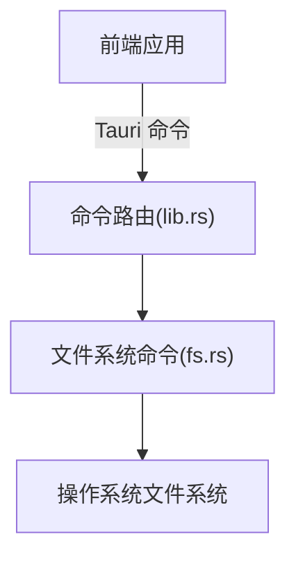
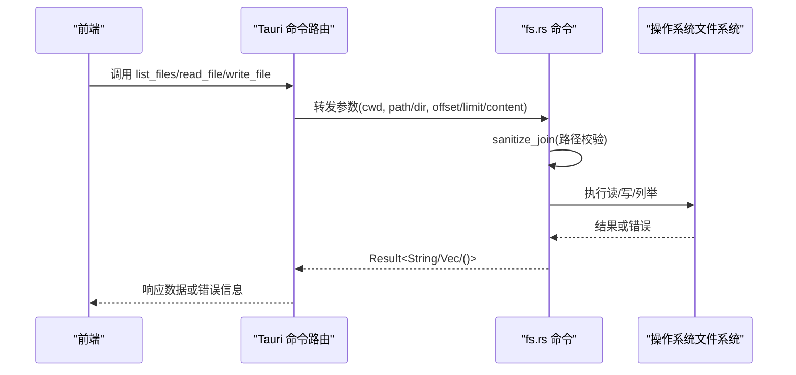
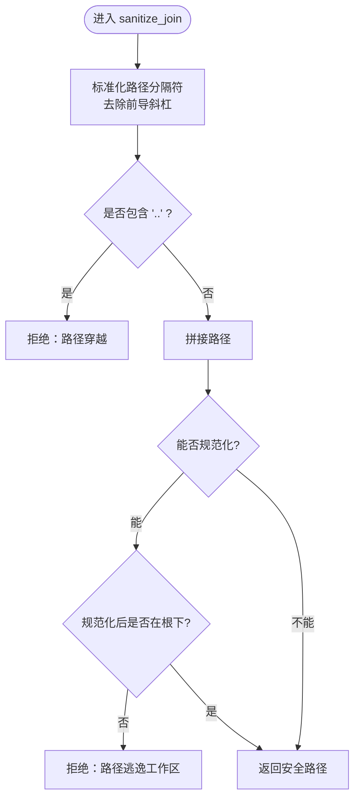
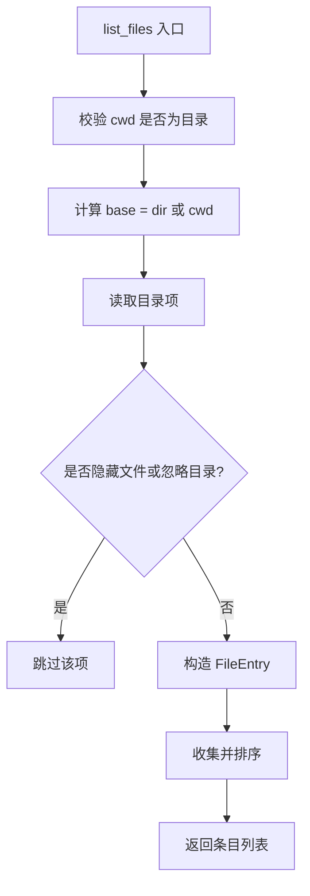
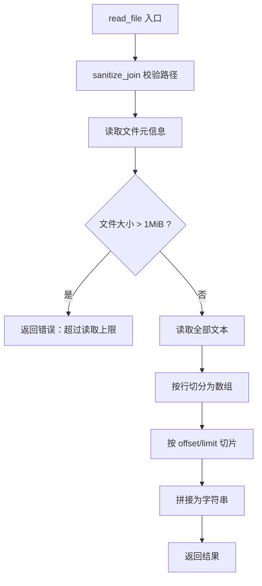
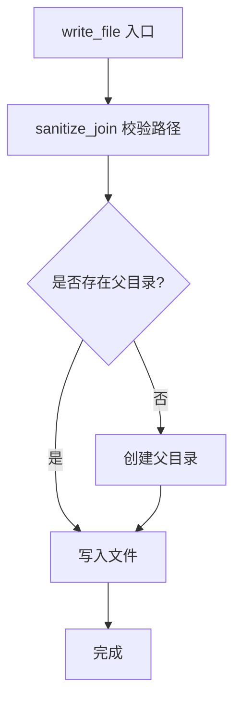
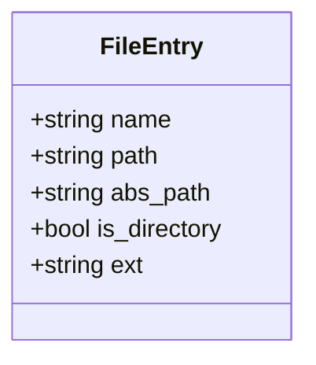
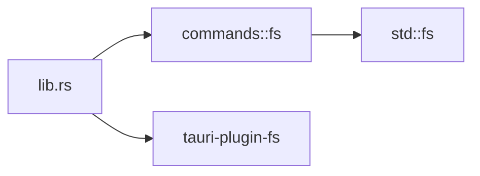

# 文件系统操作

<cite>
**本文引用的文件**
- [src-tauri/src/commands/fs.rs](file://src-tauri/src/commands/fs.rs)
- [src-tauri/src/lib.rs](file://src-tauri/src/lib.rs)
- [src-tauri/Cargo.toml](file://src-tauri/Cargo.toml)
</cite>

## 目录
1. [简介](#简介)
2. [项目结构](#项目结构)
3. [核心组件](#核心组件)
4. [架构总览](#架构总览)
5. [详细组件分析](#详细组件分析)
6. [依赖分析](#依赖分析)
7. [性能考虑](#性能考虑)
8. [故障排查指南](#故障排查指南)
9. [结论](#结论)
10. [附录](#附录)

## 简介
本模块提供面向前端的本地文件系统能力，包括安全的文件列举、读取与写入。其设计重点在于：
- 路径安全校验与访问边界控制，防止越权访问工作区之外的路径
- 大文件读取保护，限制单次读取大小并支持按行分页
- 跨平台兼容的读写实现
- 通过 Tauri 命令暴露给前端调用

当前实现覆盖基础的文件系统操作；更高级的能力（如流式读取、文件监听、变更通知、增量同步、符号链接处理、事务性写入等）在现有代码中未直接实现，将在“性能考虑”和“扩展建议”中给出指导。

## 项目结构
文件系统能力集中在 commands 层，作为 Tauri 命令暴露给前端。核心入口位于 lib.rs，负责注册命令与插件；具体实现位于 fs.rs。

图表来源
- [src-tauri/src/lib.rs:71-101](file://src-tauri/src/lib.rs#L71-L101)
- [src-tauri/src/commands/fs.rs:50-131](file://src-tauri/src/commands/fs.rs#L50-L131)

章节来源
- [src-tauri/src/lib.rs:71-101](file://src-tauri/src/lib.rs#L71-L101)
- [src-tauri/src/commands/fs.rs:1-132](file://src-tauri/src/commands/fs.rs#L1-L132)

## 核心组件
- 路径清理与校验：sanitize_join，确保相对路径不包含“..”，并在规范化后仍位于根目录下
- 文件列举：list_files，列出目录内容，过滤隐藏文件和忽略目录，返回结构化条目
- 文件读取：read_file，限制最大读取字节数，支持按行偏移与数量截取
- 文件写入：write_file，自动创建父目录并写入内容

章节来源
- [src-tauri/src/commands/fs.rs:31-48](file://src-tauri/src/commands/fs.rs#L31-L48)
- [src-tauri/src/commands/fs.rs:50-99](file://src-tauri/src/commands/fs.rs#L50-L99)
- [src-tauri/src/commands/fs.rs:101-121](file://src-tauri/src/commands/fs.rs#L101-L121)
- [src-tauri/src/commands/fs.rs:123-131](file://src-tauri/src/commands/fs.rs#L123-L131)

## 架构总览
前端通过 Tauri 调用后端命令，命令路由将请求分发到具体实现。fs.rs 中的函数使用标准库进行文件系统操作，并通过错误字符串向上返回。

图表来源
- [src-tauri/src/lib.rs:71-101](file://src-tauri/src/lib.rs#L71-L101)
- [src-tauri/src/commands/fs.rs:31-48](file://src-tauri/src/commands/fs.rs#L31-L48)
- [src-tauri/src/commands/fs.rs:50-131](file://src-tauri/src/commands/fs.rs#L50-L131)

## 详细组件分析

### 路径验证与安全边界
- 输入预处理：统一反斜杠为正斜杠，去除前导斜杠
- 遍历段检查：拒绝包含“..”的路径片段
- 规范化校验：尝试 canonicalize 后确认最终路径以根目录开头，否则拒绝
- 作用域：所有操作均基于传入的 cwd 根目录，避免逃逸

图表来源
- [src-tauri/src/commands/fs.rs:31-48](file://src-tauri/src/commands/fs.rs#L31-L48)

章节来源
- [src-tauri/src/commands/fs.rs:31-48](file://src-tauri/src/commands/fs.rs#L31-L48)

### 文件列举(list_files)
- 入参：cwd（工作区根）、dir（子目录，可为空）
- 行为：
  - 校验 cwd 为目录
  - 计算 base 目录（为空则使用 cwd）
  - 读取目录项，跳过隐藏文件（以“.”开头）
  - 跳过忽略目录集合（如 node_modules、.git 等）
  - 生成 FileEntry 列表，包含名称、相对路径、绝对路径、是否目录、扩展名
  - 排序：目录优先，其次按名称不区分大小写排序
- 输出：Vec<FileEntry>

图表来源
- [src-tauri/src/commands/fs.rs:50-99](file://src-tauri/src/commands/fs.rs#L50-L99)

章节来源
- [src-tauri/src/commands/fs.rs:50-99](file://src-tauri/src/commands/fs.rs#L50-L99)

### 文件读取(read_file)
- 入参：cwd、path、可选 offset、可选 limit
- 行为：
  - 路径校验与规范化
  - 获取元信息，限制最大读取大小为 1MiB
  - 读取文本并按行切分
  - 根据 offset 与 limit 截取行范围
  - 返回拼接后的文本
- 注意：当前实现一次性加载至内存，适合中小文本；超大文件建议使用流式方案（见“扩展建议”）

图表来源
- [src-tauri/src/commands/fs.rs:101-121](file://src-tauri/src/commands/fs.rs#L101-L121)

章节来源
- [src-tauri/src/commands/fs.rs:101-121](file://src-tauri/src/commands/fs.rs#L101-L121)

### 文件写入(write_file)
- 入参：cwd、path、content
- 行为：
  - 路径校验与规范化
  - 自动创建父目录（不存在时）
  - 写入内容
- 注意：当前为原子写入（一次性写入），未实现事务性或回滚机制（见“扩展建议”）

图表来源
- [src-tauri/src/commands/fs.rs:123-131](file://src-tauri/src/commands/fs.rs#L123-L131)

章节来源
- [src-tauri/src/commands/fs.rs:123-131](file://src-tauri/src/commands/fs.rs#L123-L131)

### 数据模型
- FileEntry：用于列举结果的条目结构，包含 name、path、abs_path、is_directory、ext

图表来源
- [src-tauri/src/commands/fs.rs:20-29](file://src-tauri/src/commands/fs.rs#L20-L29)

章节来源
- [src-tauri/src/commands/fs.rs:20-29](file://src-tauri/src/commands/fs.rs#L20-L29)

## 依赖分析
- Tauri 命令注册：lib.rs 中将 fs 模块的命令注册为可调用接口
- 插件：启用 tauri-plugin-fs（尽管当前实现主要使用标准库）
- 运行时：tokio 等异步运行时可用，但当前 fs 命令为同步实现

图表来源
- [src-tauri/src/lib.rs:71-101](file://src-tauri/src/lib.rs#L71-L101)
- [src-tauri/Cargo.toml:17-44](file://src-tauri/Cargo.toml#L17-L44)

章节来源
- [src-tauri/src/lib.rs:71-101](file://src-tauri/src/lib.rs#L71-L101)
- [src-tauri/Cargo.toml:17-44](file://src-tauri/Cargo.toml#L17-L44)

## 性能考虑
- 大文件读取限制：read_file 限制单次读取不超过 1MiB，避免内存峰值过高
- 行级分页：通过 offset 与 limit 减少传输体积，适合前端按需渲染
- 内存优化建议：
  - 对超大文件采用流式读取（例如 tokio::fs::File 配合 BufReader 分块读取）
  - 在前端侧进行增量渲染与虚拟滚动，降低 UI 压力
- 并发与阻塞：当前实现为同步 IO，若未来扩展为异步 IO，需评估线程池与背压策略
- 缓存策略：对频繁读取的小文件可引入进程内缓存（注意失效策略）

[本节为通用性能建议，不直接分析具体文件]

## 故障排查指南
- 常见错误类型：
  - 路径穿越/逃逸：sanitize_join 会拒绝包含“..”或规范化后不在根下的路径
  - 非目录：list_files 要求 cwd 为目录
  - 权限不足：读取/写入失败时会返回底层错误信息
  - 文件过大：read_file 超过 1MiB 会直接报错
- 定位方法：
  - 查看前端调用栈与 Tauri 日志
  - 核对 cwd 与工作区根是否一致
  - 检查目标路径是否存在及权限设置
- 重试逻辑：当前未实现自动重试；可在上层封装带退避的重试策略

章节来源
- [src-tauri/src/commands/fs.rs:31-48](file://src-tauri/src/commands/fs.rs#L31-L48)
- [src-tauri/src/commands/fs.rs:50-99](file://src-tauri/src/commands/fs.rs#L50-L99)
- [src-tauri/src/commands/fs.rs:101-121](file://src-tauri/src/commands/fs.rs#L101-L121)
- [src-tauri/src/commands/fs.rs:123-131](file://src-tauri/src/commands/fs.rs#L123-L131)

## 结论
当前文件系统模块提供了安全、简洁的基础文件操作能力，适用于工作区内的文件列举、小中型文本读取与写入。通过严格的路径校验与读取上限控制，有效降低了安全风险与内存风险。后续可根据业务需求扩展流式读取、文件监听、增量同步、符号链接处理与事务性写入等能力。

[本节为总结性内容，不直接分析具体文件]

## 附录

### 安全与最佳实践
- 始终基于可信的 cwd 根目录进行路径拼接与校验
- 对用户输入的路径进行白名单或黑名单过滤（当前已实现忽略目录集合）
- 对敏感目录（如 .git、.idea、.vscode）默认忽略，避免不必要扫描
- 对大文件读取强制限制大小，结合前端分页展示
- 写入前确保父目录存在，必要时记录操作审计日志

[本节为通用最佳实践，不直接分析具体文件]

### 扩展建议（未在现有代码中实现）
- 流式读取：使用异步 IO 分块读取，避免一次性加载大文件
- 文件监听与变更通知：集成 notify 或平台原生 API，实现增量同步
- 符号链接处理：检测并解析符号链接，决定是否跟随或拒绝
- 事务性写入：采用临时文件+原子替换的方式，保证写入一致性
- 权限检查：在关键写入前检查可写权限，提前失败并提示

[本节为概念性扩展建议，不直接分析具体文件]