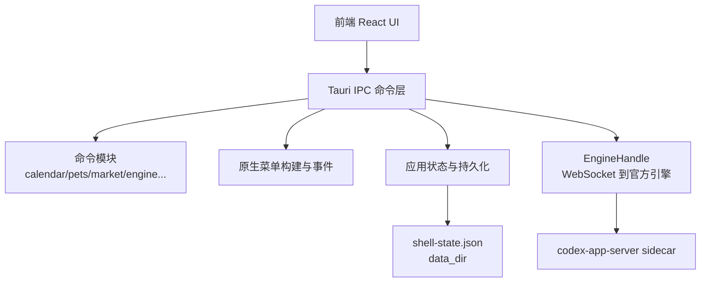
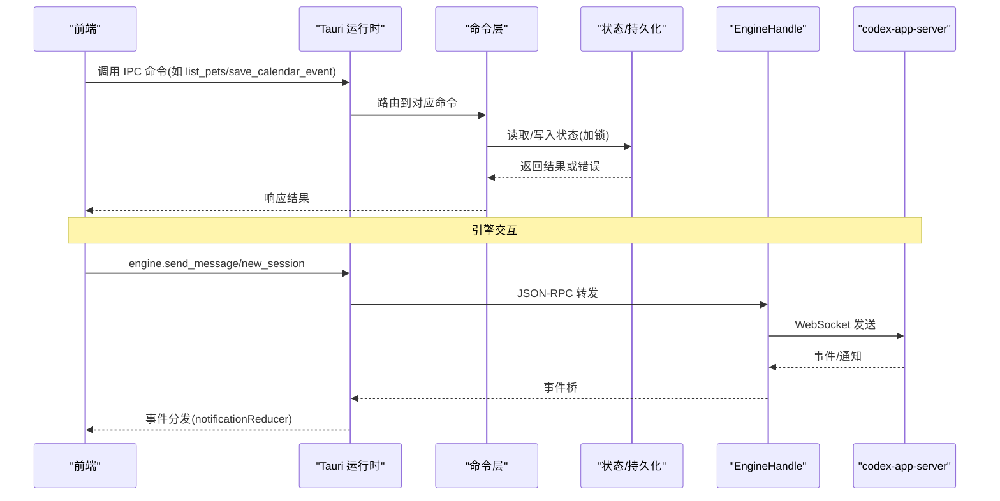
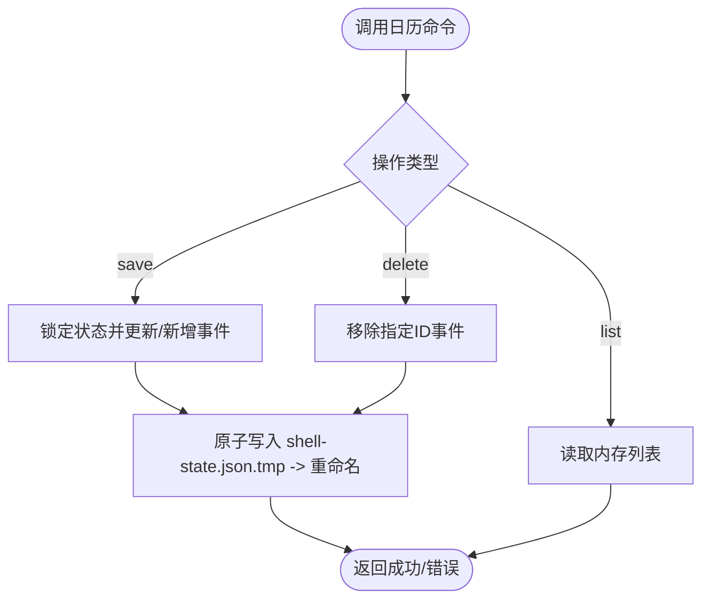
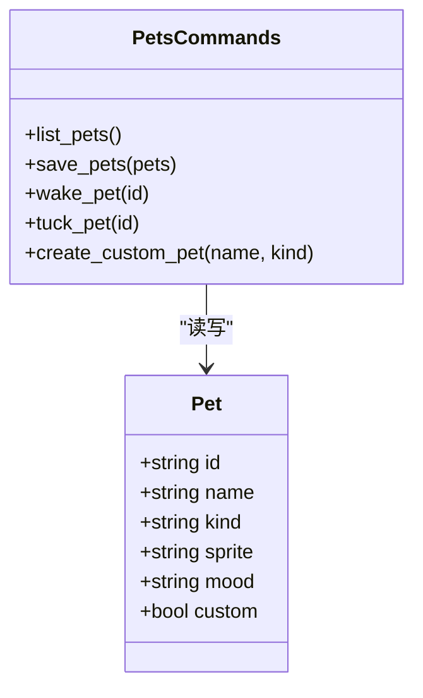
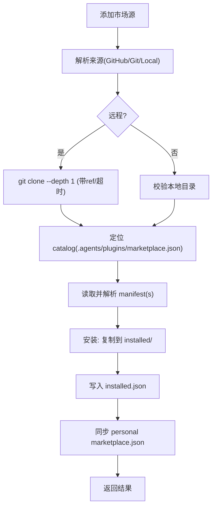
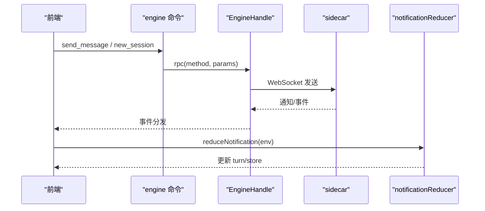
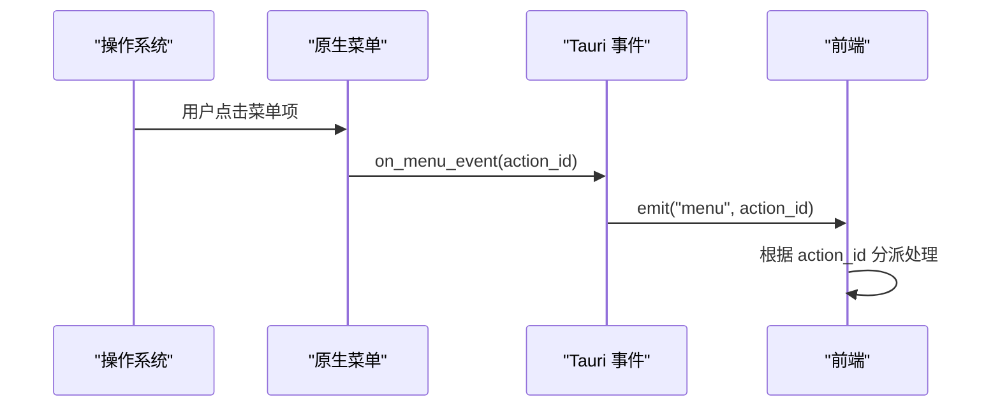
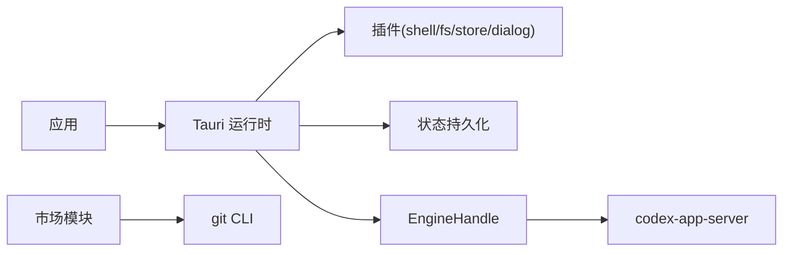

# 系统集成接口

<cite>
**本文引用的文件**
- [README.md](file://README.md)
- [main.rs](file://src-tauri/src/main.rs)
- [lib.rs](file://src-tauri/src/lib.rs)
- [tauri.conf.json](file://src-tauri/tauri.conf.json)
- [Cargo.toml](file://src-tauri/Cargo.toml)
- [menu.rs](file://src-tauri/src/menu.rs)
- [state.rs](file://src-tauri/src/state.rs)
- [calendar.rs](file://src-tauri/src/commands/calendar.rs)
- [pets.rs](file://src-tauri/src/commands/pets.rs)
- [market.rs](file://src-tauri/src/commands/market.rs)
- [engine.rs](file://src-tauri/src/commands/engine.rs)
- [menuTree.ts](file://frontend/app/shell/menuTree.ts)
- [notificationReducer.ts](file://frontend/app/state/notificationReducer.ts)
</cite>

## 目录
1. [简介](#简介)
2. [项目结构](#项目结构)
3. [核心组件](#核心组件)
4. [架构总览](#架构总览)
5. [详细组件分析](#详细组件分析)
6. [依赖关系分析](#依赖关系分析)
7. [性能与资源监控](#性能与资源监控)
8. [故障诊断与测试](#故障诊断与测试)
9. [安全、隐私与数据持久化](#安全隐私与数据持久化)
10. [结论](#结论)

## 简介
本文件面向系统集成接口，覆盖操作系统级能力集成（日历事件管理、系统托盘/菜单定制）、宠物系统、市场功能与通知机制的实现；说明跨平台兼容性处理、权限请求与用户授权流程；并给出系统资源监控、性能指标收集、日志记录策略、安全与隐私保护、数据持久化方案以及集成测试方法与故障诊断工具。

## 项目结构
本项目采用 Tauri v2 壳 + 官方 codex-app-server sidecar 的架构：前端 React UI 通过 Tauri IPC 调用 Rust 后端命令，Rust 侧负责本地状态持久化、原生菜单/窗口/文件系统/存储等能力，并通过 WebSocket 与官方引擎通信。

**图表来源**
- [lib.rs:8-159](file://src-tauri/src/lib.rs#L8-L159)
- [tauri.conf.json:12-35](file://src-tauri/tauri.conf.json#L12-L35)
- [state.rs:176-217](file://src-tauri/src/state.rs#L176-L217)

**章节来源**
- [README.md:16-22](file://README.md#L16-L22)
- [lib.rs:8-159](file://src-tauri/src/lib.rs#L8-L159)
- [tauri.conf.json:12-35](file://src-tauri/tauri.conf.json#L12-L35)

## 核心组件
- 入口与初始化：主进程入口调用库函数启动 Tauri 应用，注册插件、菜单、全局状态、协议适配器与 sidecar，并暴露大量 IPC 命令。
- 命令层：按功能域拆分 calendar、pets、market、engine、fs、scheduled 等命令模块，统一通过 tauri::command 暴露给前端。
- 状态与持久化：AppState 维护设置、偏好、宠物、日历、连接器、快捷键、计划任务等，使用原子写 tmp+rename 保证一致性。
- 菜单与事件：原生菜单项与前端标题栏菜单树保持一致，点击后以“menu”事件回传 action id。
- 引擎桥接：engine 命令将 JSON-RPC 方法转发至官方引擎，封装会话、消息、审批、MCP、插件等能力。
- 通知与流式更新：sidecar 通知经事件桥转发到前端，由 notificationReducer 映射为 UI 状态变更。

**章节来源**
- [lib.rs:8-159](file://src-tauri/src/lib.rs#L8-L159)
- [state.rs:150-231](file://src-tauri/src/state.rs#L150-L231)
- [menu.rs:8-219](file://src-tauri/src/menu.rs#L8-L219)
- [engine.rs:13-20](file://src-tauri/src/commands/engine.rs#L13-L20)
- [notificationReducer.ts:189-445](file://frontend/app/state/notificationReducer.ts#L189-L445)

## 架构总览
下图展示从前端到引擎的完整链路，包括本地状态、菜单事件与通知流。

**图表来源**
- [lib.rs:71-148](file://src-tauri/src/lib.rs#L71-L148)
- [engine.rs:22-127](file://src-tauri/src/commands/engine.rs#L22-L127)
- [notificationReducer.ts:189-445](file://frontend/app/state/notificationReducer.ts#L189-L445)

## 详细组件分析

### 日历事件管理
- 能力：列出、保存、删除本地日历事件。
- 数据模型：CalendarEvent（id、title、starts_at、ends_at、notes）。
- 实现要点：
  - 读操作直接克隆内存中的列表。
  - 写操作在 Mutex 保护下修改后调用 save()，使用 tmp+rename 原子落盘。
- 复杂度：O(n) 查找/插入/删除（n 为事件数），I/O 成本取决于状态文件大小。

**图表来源**
- [calendar.rs:4-32](file://src-tauri/src/commands/calendar.rs#L4-L32)
- [state.rs:209-217](file://src-tauri/src/state.rs#L209-L217)

**章节来源**
- [calendar.rs:4-32](file://src-tauri/src/commands/calendar.rs#L4-L32)
- [state.rs:79-89](file://src-tauri/src/state.rs#L79-L89)
- [state.rs:209-217](file://src-tauri/src/state.rs#L209-L217)

### 宠物系统
- 能力：列出、批量保存、唤醒/隐藏单个宠物、创建自定义宠物。
- 数据模型：Pet（id、name、kind、sprite、mood、custom）。
- 实现要点：
  - 所有写操作均持久化。
  - 自定义宠物生成新 UUID 并标记 custom=true。
- 复杂度：O(n) 遍历查找。

**图表来源**
- [pets.rs:4-65](file://src-tauri/src/commands/pets.rs#L4-L65)
- [state.rs:66-77](file://src-tauri/src/state.rs#L66-L77)

**章节来源**
- [pets.rs:4-65](file://src-tauri/src/commands/pets.rs#L4-L65)
- [state.rs:66-77](file://src-tauri/src/state.rs#L66-L77)

### 市场功能（插件市场）
- 能力：添加/移除市场源、列举插件、安装/卸载/启用/禁用插件、同步个人市场清单。
- 关键路径：
  - 解析来源：GitHub 简写、Git URL、本地目录。
  - 拉取源码：git clone --depth 1，超时保护。
  - 解析清单：支持 plugin.json 与 .codex-plugin/plugin.json。
  - 安装：复制目录到 data_dir/plugins/installed/<id>，写入 installed.json，并同步 personal marketplace。
  - 技能扫描：扫描 skills/<skill>/SKILL.md frontmatter。
- 复杂度：clone 与拷贝为 I/O 密集型；解析清单 O(m)（m 为插件条目数）。

**图表来源**
- [market.rs:285-384](file://src-tauri/src/commands/market.rs#L285-L384)
- [market.rs:412-517](file://src-tauri/src/commands/market.rs#L412-L517)
- [market.rs:659-709](file://src-tauri/src/commands/market.rs#L659-L709)

**章节来源**
- [market.rs:1-800](file://src-tauri/src/commands/market.rs#L1-L800)

### 引擎与通知机制
- 引擎命令：会话管理、消息发送、中断、审批响应、提供商/MCP/技能/插件管理等，全部转发至官方引擎 JSON-RPC。
- 通知流：sidecar 产生的通知经事件桥转发到前端，notificationReducer 将不同 method 映射为 turn/store 动作，包含流式增量、计划步骤、令牌用量、错误/警告等。
- 兼容性与降级：未知/可选端点返回结构化错误，UI 可优雅降级。

**图表来源**
- [engine.rs:22-183](file://src-tauri/src/commands/engine.rs#L22-L183)
- [notificationReducer.ts:189-445](file://frontend/app/state/notificationReducer.ts#L189-L445)

**章节来源**
- [engine.rs:22-183](file://src-tauri/src/commands/engine.rs#L22-L183)
- [notificationReducer.ts:189-445](file://frontend/app/state/notificationReducer.ts#L189-L445)

### 菜单定制与系统托盘
- 原生菜单：File/Edit/View/Help 子菜单，绑定快捷键，点击后通过 on_menu_event 发射“menu”事件携带 action id。
- 前端菜单树：menuTree.ts 定义标题栏内菜单结构与快捷键，与原生菜单保持一致，作为单一事实来源。
- 托盘图标：启用 tray-icon 特性，可在后续扩展托盘菜单与交互。

**图表来源**
- [menu.rs:8-219](file://src-tauri/src/menu.rs#L8-L219)
- [menuTree.ts:24-87](file://frontend/app/shell/menuTree.ts#L24-L87)
- [Cargo.toml:23](file://src-tauri/Cargo.toml#L23)

**章节来源**
- [menu.rs:8-219](file://src-tauri/src/menu.rs#L8-L219)
- [menuTree.ts:24-87](file://frontend/app/shell/menuTree.ts#L24-L87)
- [Cargo.toml:23](file://src-tauri/Cargo.toml#L23)

### 跨平台兼容性与权限
- 跨平台：Tauri 配置中启用 assetProtocol 与 shell/fs 插件，便于在不同平台上访问资源与文件系统；Windows 子系统由 tauri-build/cargo 配置控制。
- 权限：通过 Tauri 插件与配置声明所需能力；敏感操作（如文件系统）需遵循最小权限原则与白名单。
- 授权流程：提供商密钥不落地明文配置文件，而是注入 sidecar 环境变量；首次连接时可通过探针检查连通性。

**章节来源**
- [tauri.conf.json:29-59](file://src-tauri/tauri.conf.json#L29-L59)
- [state.rs:8-25](file://src-tauri/src/state.rs#L8-L25)
- [engine.rs:185-200](file://src-tauri/src/commands/engine.rs#L185-L200)

## 依赖关系分析
- 运行时依赖：tauri、tauri-plugin-*、tokio、reqwest、tracing、dirs、chrono、notify-rust、cron、walkdir、regex 等。
- 外部进程：git（用于市场源拉取）、codex-app-server（sidecar）。
- 前端依赖：React/Vite 生态，通过 Tauri IPC 与后端交互。

**图表来源**
- [Cargo.toml:17-49](file://src-tauri/Cargo.toml#L17-L49)
- [market.rs:354-384](file://src-tauri/src/commands/market.rs#L354-L384)

**章节来源**
- [Cargo.toml:17-49](file://src-tauri/Cargo.toml#L17-L49)

## 性能与资源监控
- 日志记录：tracing_subscriber 初始化，默认 info 级别，模块 codex_tauri=debug；可通过环境变量调整过滤规则。
- 性能追踪：菜单提供“Launch Performance Trace”入口，便于采集性能数据。
- 资源限制：git clone 设置超时（180s），避免阻塞；状态写入采用 tmp+rename 原子操作，降低损坏风险。
- 建议：
  - 对大文件/长任务增加进度反馈与取消机制。
  - 对高频通知做节流/合并，减少渲染压力。
  - 定期清理临时文件与过时缓存。

**章节来源**
- [lib.rs:9-14](file://src-tauri/src/lib.rs#L9-L14)
- [menu.rs:181-191](file://src-tauri/src/menu.rs#L181-L191)
- [market.rs:367-383](file://src-tauri/src/commands/market.rs#L367-L383)
- [state.rs:209-217](file://src-tauri/src/state.rs#L209-L217)

## 故障诊断与测试
- 集成测试：
  - 前端静态检查与类型检查（lint/typecheck/build）。
  - 脚本验证协议覆盖率与通知覆盖（verify-notification-coverage.mjs 等）。
- 调试手段：
  - 浏览器调试模式（BROWSER-DEV.md）在不编译 Rust 的情况下运行真实引擎进行联调。
  - 通过 tracing 日志定位问题；结合菜单“System Status”“Troubleshooting”快速查看状态。
- 常见问题：
  - git 未安装导致市场源添加失败：提示安装 git。
  - 市场源缺少 catalog 或 manifest：需重新添加或修正清单。
  - 引擎不可达：检查 WebSocket 地址与 sidecar 进程状态。

**章节来源**
- [README.md:29-57](file://README.md#L29-L57)
- [market.rs:370-383](file://src-tauri/src/commands/market.rs#L370-L383)
- [menu.rs:174-191](file://src-tauri/src/menu.rs#L174-L191)

## 安全、隐私与数据持久化
- 安全：
  - 提供商 API Key 仅保存在 shell store，并以环境变量名形式注入 sidecar，避免明文落盘。
  - 资产协议与插件权限受 Tauri 配置约束。
- 隐私：
  - 本地数据存储在用户配置目录下（CodexDesktop），仅应用自身访问。
  - 市场安装目录位于 data_dir/plugins，便于审计与清理。
- 持久化：
  - 状态文件 shell-state.json 使用 tmp+rename 原子写入，确保一致性。
  - 市场相关清单 marketplaces.json、installed.json、marketplace-personal.json 同样采用原子写。

**章节来源**
- [state.rs:8-25](file://src-tauri/src/state.rs#L8-L25)
- [state.rs:176-217](file://src-tauri/src/state.rs#L176-L217)
- [market.rs:66-78](file://src-tauri/src/commands/market.rs#L66-L78)
- [market.rs:691-709](file://src-tauri/src/commands/market.rs#L691-L709)

## 结论
本系统集成接口以 Tauri 为核心，将前端 UI 与本地系统能力、官方引擎紧密耦合，提供了日历事件、宠物、市场、引擎交互与通知流等关键能力。通过严谨的状态持久化、安全的密钥管理、完善的日志与调试工具，以及清晰的菜单/事件通道，实现了跨平台一致的桌面体验。建议在后续迭代中继续强化错误降级、性能观测与自动化测试覆盖，以提升稳定性与可维护性。