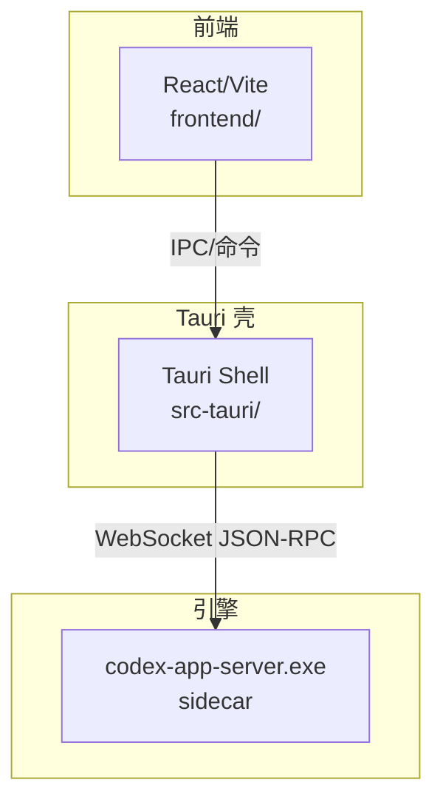
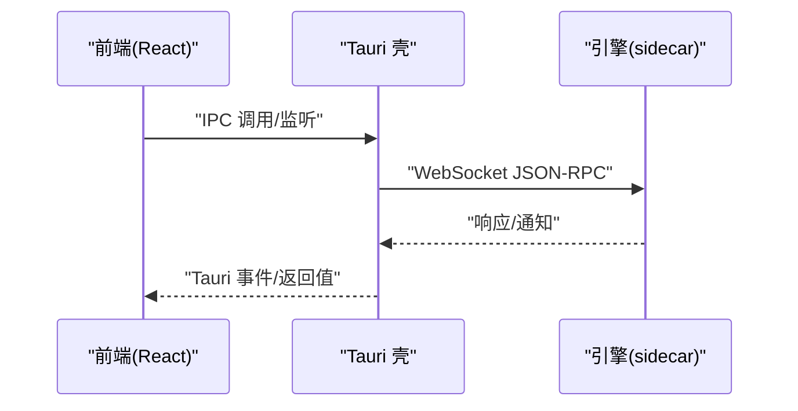
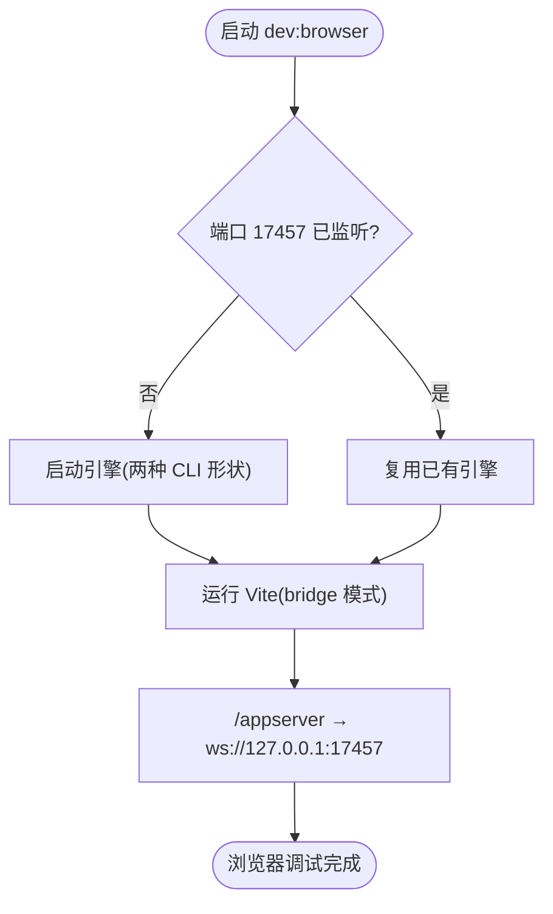
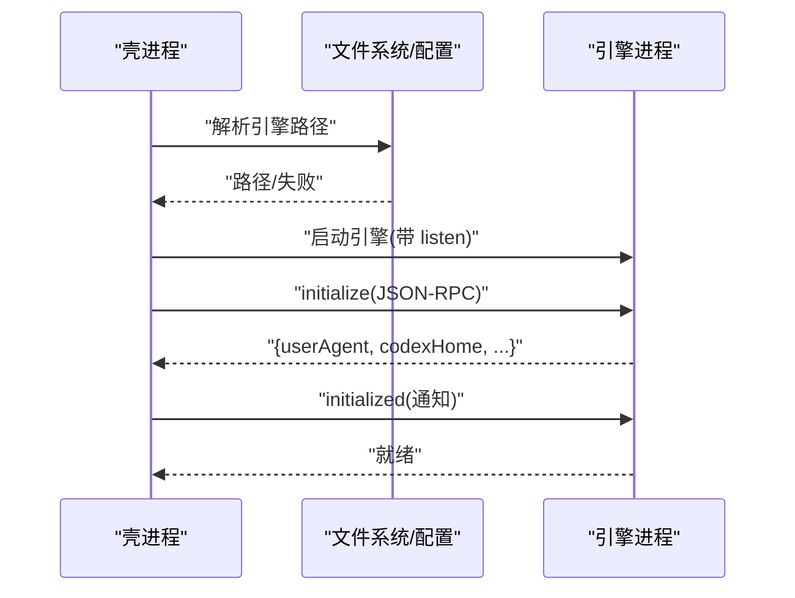
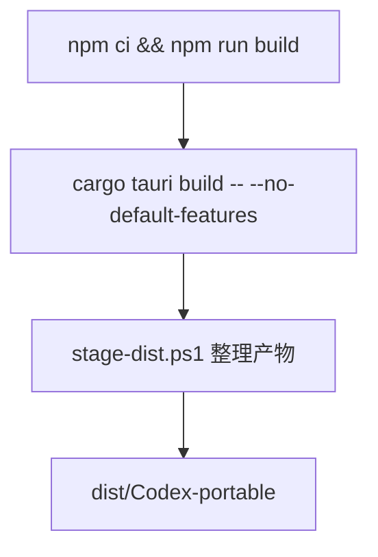
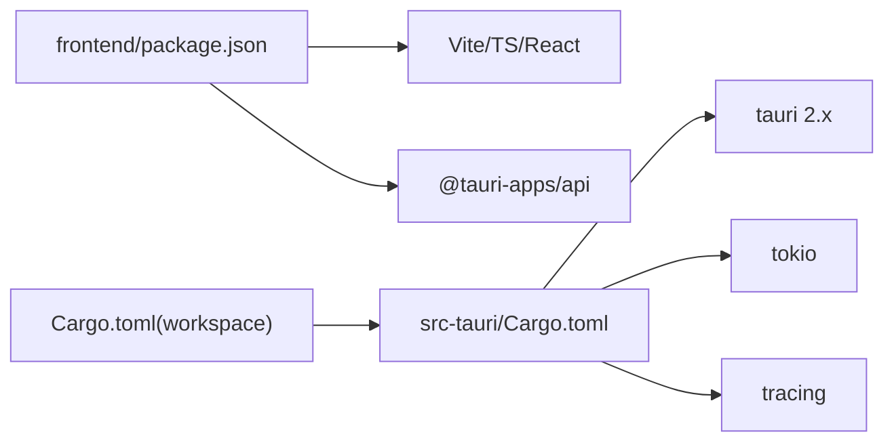

# 开发指南

<cite>
**本文引用的文件**
- [README.md](file://README.md)
- [Cargo.toml](file://Cargo.toml)
- [src-tauri/Cargo.toml](file://src-tauri/Cargo.toml)
- [src-tauri/tauri.conf.json](file://src-tauri/tauri.conf.json)
- [frontend/package.json](file://frontend/package.json)
- [frontend/vite.config.ts](file://frontend/vite.config.ts)
- [src-tauri/src/main.rs](file://src-tauri/src/main.rs)
- [.github/workflows/build-fast.yml](file://.github/workflows/build-fast.yml)
- [.github/workflows/build-release.yml](file://.github/workflows/build-release.yml)
- [.github/workflows/lint-check.yml](file://.github/workflows/lint-check.yml)
- [scripts/build.ps1](file://scripts/build.ps1)
- [scripts/dev-browser.ps1](file://scripts/dev-browser.ps1)
- [scripts/stage-dist.ps1](file://scripts/stage-dist.ps1)
- [docs/BROWSER-DEV.md](file://docs/BROWSER-DEV.md)
- [docs/RUST_BACKEND.md](file://docs/RUST_BACKEND.md)
</cite>

## 目录
1. [简介](#简介)
2. [项目结构](#项目结构)
3. [核心组件](#核心组件)
4. [架构总览](#架构总览)
5. [详细组件分析](#详细组件分析)
6. [依赖分析](#依赖分析)
7. [性能考虑](#性能考虑)
8. [故障排除指南](#故障排除指南)
9. [结论](#结论)
10. [附录](#附录)

## 简介
本指南面向参与 Codex-Tauri 项目的开发者，覆盖本地环境搭建、依赖安装与工具配置；本地开发与调试流程（含浏览器模式）；测试策略；构建与部署（CI/CD）；代码与提交规范；常见问题与优化建议。目标是帮助你在最短时间内完成“能跑、能改、能发布”的闭环。

## 项目结构
仓库采用“前端 React + Tauri 壳 + 官方引擎 sidecar”的分层设计：
- 前端：React + Vite，位于 frontend/
- Tauri 壳：Rust，位于 src-tauri/
- 官方引擎：预编译 codex-app-server.exe，作为 sidecar 被壳进程启动并通过 WebSocket JSON-RPC 通信
- 脚本与 CI：scripts/ 与 .github/workflows/

图表来源
- [src-tauri/tauri.conf.json:1-61](file://src-tauri/tauri.conf.json#L1-L61)
- [docs/RUST_BACKEND.md:25-129](file://docs/RUST_BACKEND.md#L25-L129)

章节来源
- [README.md:16-57](file://README.md#L16-L57)
- [src-tauri/tauri.conf.json:1-61](file://src-tauri/tauri.conf.json#L1-L61)

## 核心组件
- 前端应用：React + Vite，提供 UI 与状态管理，通过 Tauri IPC 调用后端能力
- Tauri 壳：暴露产品级 IPC 命令，负责侧车引擎生命周期、协议握手、事件桥接与本地桌面能力
- 官方引擎：以独立进程运行，提供线程、回合、配置、插件等核心能力
- 构建与发布：Vite 构建前端产物到 dist/；cargo tauri build 打包；CI 下载并嵌入官方引擎二进制

章节来源
- [frontend/package.json:1-31](file://frontend/package.json#L1-L31)
- [src-tauri/Cargo.toml:1-58](file://src-tauri/Cargo.toml#L1-L58)
- [docs/RUST_BACKEND.md:1-24](file://docs/RUST_BACKEND.md#L1-L24)

## 架构总览
Codex-Tauri 的运行时数据流如下：
- 前端发起命令或监听事件
- Tauri 壳将请求转发至官方引擎（WebSocket JSON-RPC）
- 引擎返回结果与通知，壳将其映射为 Tauri 事件供前端订阅
- 本地能力（设置、宠物、日历等）由壳直接处理，不经过引擎

图表来源
- [docs/RUST_BACKEND.md:144-171](file://docs/RUST_BACKEND.md#L144-L171)
- [src-tauri/tauri.conf.json:1-61](file://src-tauri/tauri.conf.json#L1-L61)

## 详细组件分析

### 前端开发与调试
- 开发服务器：端口 1420，支持热更新
- 浏览器调试模式：通过 vite 插件将 /appserver 代理到引擎 WS，绕过 Origin 限制，实现“零改动前端 + 真实引擎”的本地调试
- 类型检查与构建：使用 TypeScript 严格检查与 Vite 构建

图表来源
- [scripts/dev-browser.ps1:1-48](file://scripts/dev-browser.ps1#L1-L48)
- [frontend/vite.config.ts:19-57](file://frontend/vite.config.ts#L19-L57)
- [docs/BROWSER-DEV.md:1-93](file://docs/BROWSER-DEV.md#L1-L93)

章节来源
- [frontend/vite.config.ts:59-104](file://frontend/vite.config.ts#L59-L104)
- [docs/BROWSER-DEV.md:31-48](file://docs/BROWSER-DEV.md#L31-L48)

### Tauri 壳与引擎交互
- 引擎启动：按优先级解析二进制位置（环境变量、用户配置、资源目录、内容寻址目录、PATH），复制后启动
- 握手流程：initialize → 服务端响应 → initialized 通知，缺少任一环节会导致后续方法被拒绝
- 传输方式：当前仅支持 ws://127.0.0.1:17457，无鉴权，仅限本机回环
- 降级策略：找不到引擎时壳仍可启动，但引擎相关功能不可用

图表来源
- [docs/RUST_BACKEND.md:71-129](file://docs/RUST_BACKEND.md#L71-L129)
- [docs/RUST_BACKEND.md:144-171](file://docs/RUST_BACKEND.md#L144-L171)

章节来源
- [docs/RUST_BACKEND.md:71-129](file://docs/RUST_BACKEND.md#L71-L129)
- [docs/RUST_BACKEND.md:144-171](file://docs/RUST_BACKEND.md#L144-L171)

### 构建与打包
- 本地构建：scripts/build.ps1 会校验 sidecar 存在并执行 cargo tauri build，随后 stage 到 dist/
- 可移植包：scripts/stage-dist.ps1 收集 shell exe、WebView2Loader.dll（如有）、engine sidecar，输出到 dist/Codex-portable
- CI 快速构建：build-fast.yml 缓存引擎与 Rust 增量，使用 sccache 加速，产出可移植包
- 正式发行：build-release.yml 在打 tag 时触发，产出长期保留的可移植包

图表来源
- [scripts/build.ps1:1-24](file://scripts/build.ps1#L1-L24)
- [scripts/stage-dist.ps1:1-75](file://scripts/stage-dist.ps1#L1-L75)
- [.github/workflows/build-fast.yml:186-232](file://.github/workflows/build-fast.yml#L186-L232)
- [.github/workflows/build-release.yml:146-179](file://.github/workflows/build-release.yml#L146-L179)

章节来源
- [scripts/build.ps1:1-24](file://scripts/build.ps1#L1-L24)
- [scripts/stage-dist.ps1:1-75](file://scripts/stage-dist.ps1#L1-L75)
- [.github/workflows/build-fast.yml:67-197](file://.github/workflows/build-fast.yml#L67-L197)
- [.github/workflows/build-release.yml:46-157](file://.github/workflows/build-release.yml#L46-L157)

### 质量检查与规范
- 前端静态检查：scripts/check-frontend.mjs、verify-notification-coverage.mjs、migration-status.mjs
- 类型检查：npm run typecheck
- Rust 格式化：cargo fmt --check
- 工作流：lint-check.yml 并行执行前端与 Rust 格式检查，不阻塞构建

章节来源
- [.github/workflows/lint-check.yml:21-85](file://.github/workflows/lint-check.yml#L21-L85)
- [frontend/package.json:7-14](file://frontend/package.json#L7-L14)

## 依赖分析
- 前端依赖：React、@tauri-apps/api、Vite、TypeScript
- Rust 依赖：Tauri 2.x、tokio、tracing、reqwest 等
- 工作区：根 Cargo.toml 统一版本与 lint 规则；src-tauri 为唯一成员

图表来源
- [frontend/package.json:15-29](file://frontend/package.json#L15-L29)
- [src-tauri/Cargo.toml:17-49](file://src-tauri/Cargo.toml#L17-L49)
- [Cargo.toml:1-18](file://Cargo.toml#L1-L18)

章节来源
- [frontend/package.json:1-31](file://frontend/package.json#L1-L31)
- [src-tauri/Cargo.toml:1-58](file://src-tauri/Cargo.toml#L1-L58)
- [Cargo.toml:1-18](file://Cargo.toml#L1-L18)

## 性能考虑
- 前端构建目标 es2022，开启 sourcemap，产物命名带 hash，利于缓存
- Rust 构建启用 sccache，CI 使用 fast/release profile 平衡速度与体积
- 引擎通信使用广播通道承载通知，避免阻塞请求映射
- WebView2 加载器按需拷贝，减少安装包体积

章节来源
- [frontend/vite.config.ts:82-104](file://frontend/vite.config.ts#L82-L104)
- [.github/workflows/build-fast.yml:29-52](file://.github/workflows/build-fast.yml#L29-L52)
- [docs/RUST_BACKEND.md:169-171](file://docs/RUST_BACKEND.md#L169-L171)
- [scripts/stage-dist.ps1:49-66](file://scripts/stage-dist.ps1#L49-L66)

## 故障排除指南
- 无法连接引擎
  - 确认 17457 端口是否被占用或被其他程序占用
  - 使用 scripts/dev-browser.ps1 一键拉起引擎，或手动启动引擎并指定监听地址
  - 若未找到引擎二进制，按提示放置到 src-tauri/binaries/ 或设置环境变量
- 浏览器模式无法直连引擎
  - 必须通过 vite 的 /appserver 代理，因为引擎拒绝携带 Origin 头的升级请求
- 构建失败
  - 确保已安装 Node 22、Rust 工具链与 Tauri CLI
  - CI 中通过缓存加速，本地可参考 CI 步骤安装依赖
- 可移植包缺少引擎
  - 运行 scripts/stage-dist.ps1 前需确保 binaries/ 中存在引擎二进制
- 引擎握手失败
  - 检查 initialize/initialized 流程是否完整，超时与重试逻辑请参考文档

章节来源
- [docs/BROWSER-DEV.md:8-14](file://docs/BROWSER-DEV.md#L8-L14)
- [scripts/dev-browser.ps1:20-41](file://scripts/dev-browser.ps1#L20-L41)
- [scripts/stage-dist.ps1:58-66](file://scripts/stage-dist.ps1#L58-L66)
- [docs/RUST_BACKEND.md:144-171](file://docs/RUST_BACKEND.md#L144-L171)

## 结论
Codex-Tauri 以“壳 + 预编译引擎”的方式实现了稳定、可维护的桌面端方案。通过清晰的职责划分、完善的 CI 与脚本工具链，开发者可以高效地进行本地调试、持续集成与发布。遵循本文档的流程与规范，可显著降低协作成本与出错概率。

## 附录

### 环境与依赖安装
- 系统要求
  - Windows 平台（主要目标）
  - Node.js 22
  - Rust 工具链（MSVC target）
  - Tauri CLI（CI 固定版本，本地可通过 cargo install 或下载）
- 安装步骤
  - 克隆仓库并初始化子模块
  - 安装前端依赖：进入 frontend 目录执行依赖安装
  - 准备引擎二进制：从官方 release 下载并放入 src-tauri/binaries/
  - 验证：运行浏览器调试模式或本地构建

章节来源
- [README.md:42-57](file://README.md#L42-L57)
- [docs/RUST_BACKEND.md:117-142](file://docs/RUST_BACKEND.md#L117-L142)

### 本地开发工作流程
- 前端开发
  - 启动开发服务器：npm run dev
  - 浏览器调试模式：scripts/dev-browser.ps1 或 npm run dev:browser
- 壳开发
  - 修改 Rust 代码后重新构建：cargo tauri build
- 联合调试
  - 保持引擎运行于 17457，前端通过 vite 代理访问

章节来源
- [frontend/package.json:7-14](file://frontend/package.json#L7-L14)
- [scripts/dev-browser.ps1:1-48](file://scripts/dev-browser.ps1#L1-L48)
- [frontend/vite.config.ts:19-57](file://frontend/vite.config.ts#L19-L57)

### 构建与部署（CI/CD）
- 快速构建（PR/Push）
  - 触发：.github/workflows/build-fast.yml
  - 步骤：前端检查与构建 → 下载引擎 → 构建壳 → 生成可移植包
- 正式发布（Tag）
  - 触发：.github/workflows/build-release.yml
  - 步骤：同快速构建，产物保留更久
- 质量门禁
  - 触发：.github/workflows/lint-check.yml
  - 步骤：前端静态检查 + 类型检查 + Rust 格式检查

章节来源
- [.github/workflows/build-fast.yml:18-232](file://.github/workflows/build-fast.yml#L18-L232)
- [.github/workflows/build-release.yml:1-179](file://.github/workflows/build-release.yml#L1-L179)
- [.github/workflows/lint-check.yml:1-85](file://.github/workflows/lint-check.yml#L1-L85)

### 代码规范与协作
- 前端
  - 使用 TypeScript 进行类型检查
  - 遵循现有 CSS DOM/class 契约，避免破坏兼容
- Rust
  - 使用 rustfmt 保证格式一致
  - 遵循工作区 lint 规则
- 协议
  - 以官方 app-server generate-ts 输出为准，禁止猜测方法名
- 变更原则
  - 不随意修改引擎核心逻辑
  - 所有 UI 控件走真实 Tauri IPC，禁止假回调

章节来源
- [README.md:51-57](file://README.md#L51-L57)
- [.github/workflows/lint-check.yml:57-85](file://.github/workflows/lint-check.yml#L57-L85)
- [docs/RUST_BACKEND.md:173-181](file://docs/RUST_BACKEND.md#L173-L181)

### 常用命令行示例
- 前端
  - 安装依赖：cd frontend && npm ci
  - 类型检查：npm run typecheck
  - 构建：npm run build
  - 浏览器调试：npm run dev:browser
- 壳与引擎
  - 本地构建：scripts/build.ps1
  - 浏览器模式一键启动：scripts/dev-browser.ps1
  - 打包可移植包：scripts/stage-dist.ps1
- CI
  - 触发快速构建：push 到 main/master 或创建 PR
  - 触发正式构建：推送 v* 标签

章节来源
- [frontend/package.json:7-14](file://frontend/package.json#L7-L14)
- [scripts/build.ps1:1-24](file://scripts/build.ps1#L1-L24)
- [scripts/dev-browser.ps1:1-48](file://scripts/dev-browser.ps1#L1-L48)
- [scripts/stage-dist.ps1:1-75](file://scripts/stage-dist.ps1#L1-L75)
- [.github/workflows/build-fast.yml:18-232](file://.github/workflows/build-fast.yml#L18-L232)
- [.github/workflows/build-release.yml:1-179](file://.github/workflows/build-release.yml#L1-L179)

### 配置文件说明
- Tauri 配置
  - 产品名称、标识、窗口尺寸、安全策略、资源与插件权限
- 前端配置
  - Vite 别名、构建输出、代理插件、开发服务器端口
- 工作区配置
  - 统一版本、edition、license、workspace members、lint 规则、profile

章节来源
- [src-tauri/tauri.conf.json:1-61](file://src-tauri/tauri.conf.json#L1-L61)
- [frontend/vite.config.ts:59-104](file://frontend/vite.config.ts#L59-L104)
- [Cargo.toml:1-18](file://Cargo.toml#L1-L18)
- [Cargo.toml:242-353](file://Cargo.toml#L242-L353)

### 入口与主流程
- 壳入口：main.rs 调用库函数 run()
- 前端入口：index.html 与 app/main.tsx（由 Vite 构建）
- 引擎入口：外部二进制，通过 shell 启动并监听 WS

章节来源
- [src-tauri/src/main.rs:1-7](file://src-tauri/src/main.rs#L1-L7)
- [frontend/vite.config.ts:82-104](file://frontend/vite.config.ts#L82-L104)
- [docs/RUST_BACKEND.md:25-49](file://docs/RUST_BACKEND.md#L25-L49)