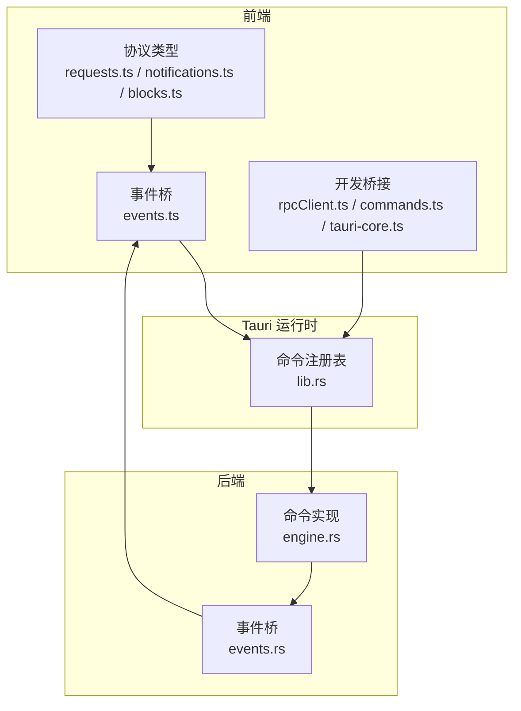
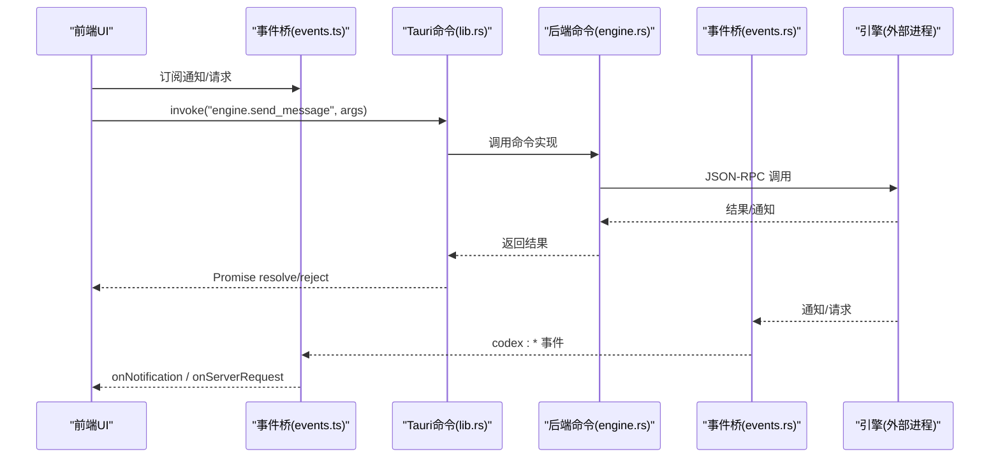
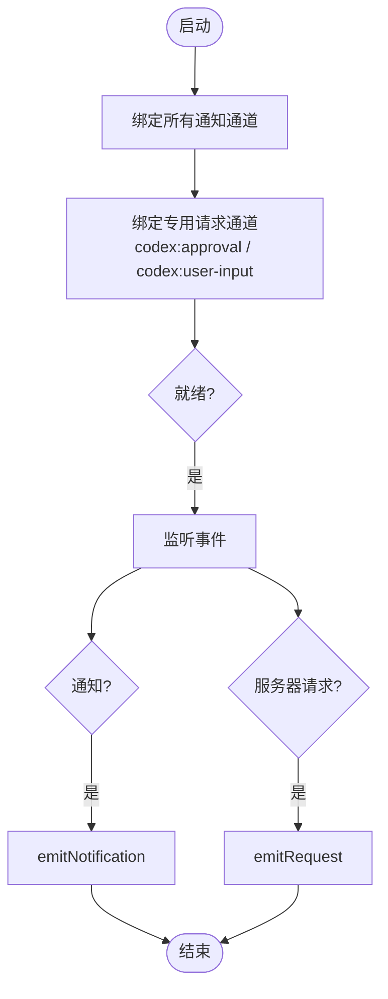
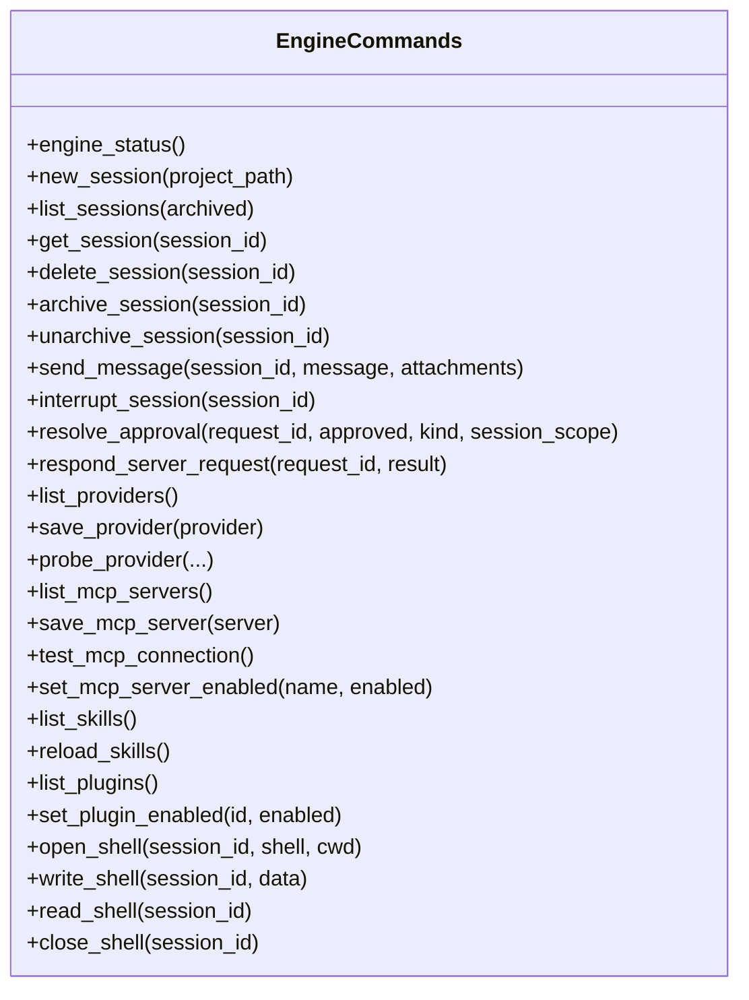
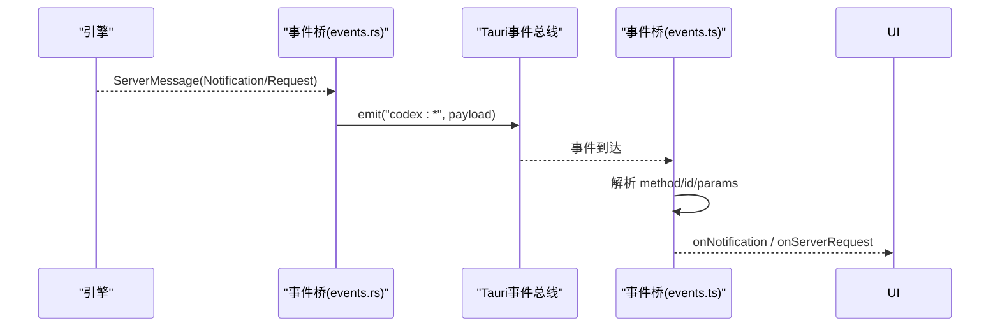
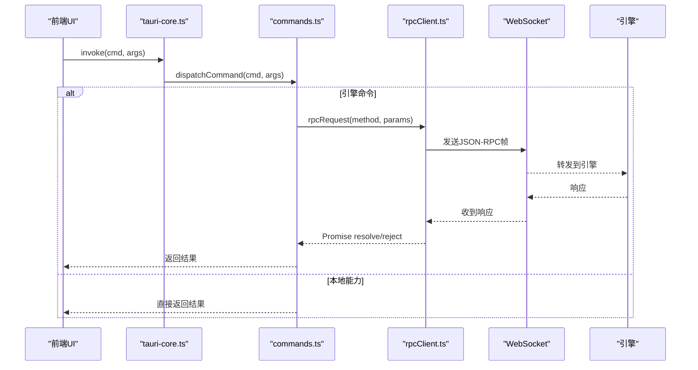
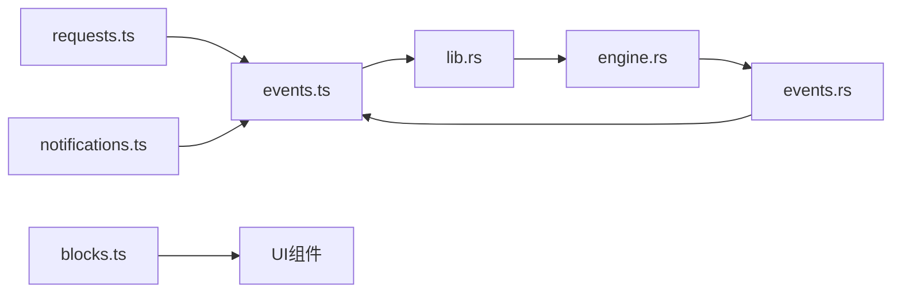

# Tauri IPC 通信机制

<cite>
**本文引用的文件**
- [requests.ts](file://frontend/src/protocol/requests.ts)
- [notifications.ts](file://frontend/src/protocol/notifications.ts)
- [blocks.ts](file://frontend/src/protocol/blocks.ts)
- [events.ts](file://frontend/app/bridge/events.ts)
- [rpcClient.ts](file://frontend/app/devbridge/rpcClient.ts)
- [commands.ts](file://frontend/app/devbridge/commands.ts)
- [tauri-core.ts](file://frontend/app/devbridge/tauri-core.ts)
- [lib.rs](file://src-tauri/src/lib.rs)
- [engine.rs](file://src-tauri/src/commands/engine.rs)
- [events.rs](file://src-tauri/src/codex/events.rs)
</cite>

## 目录
1. [简介](#简介)
2. [项目结构](#项目结构)
3. [核心组件](#核心组件)
4. [架构总览](#架构总览)
5. [详细组件分析](#详细组件分析)
6. [依赖关系分析](#依赖关系分析)
7. [性能与可靠性](#性能与可靠性)
8. [故障排查指南](#故障排查指南)
9. [结论](#结论)
10. [附录：调用示例与最佳实践](#附录调用示例与最佳实践)

## 简介
本文面向使用 Tauri 构建的桌面应用，系统性说明前后端通过 Tauri 框架进行 IPC 通信的核心机制。重点包括：
- 命令调用、参数传递与返回值处理
- 服务器请求（审批、用户输入、工具调用等）的处理模式
- TypeScript 类型定义如何保障前后端数据一致性
- 自动生成协议文件的作用与再生成方式
- 前端发起 IPC 调用、处理异步响应与错误的具体流程

## 项目结构
本项目的 IPC 通信由“前端协议层 + 前端事件桥 + 后端命令注册 + 后端事件桥”共同构成：
- 前端协议层：自动生成 TypeScript 类型与常量，描述通知方法、服务器请求方法与块类型
- 前端事件桥：订阅 Tauri 事件，将服务端推送的通知与请求分发到 UI
- 后端命令注册：在 Tauri 启动时注册所有命令，暴露给前端 invoke
- 后端事件桥：将引擎通知转发为 Tauri 事件，供前端监听

**图表来源**
- [lib.rs:71-148](file://src-tauri/src/lib.rs#L71-L148)
- [events.rs:51-80](file://src-tauri/src/codex/events.rs#L51-L80)
- [events.ts:145-159](file://frontend/app/bridge/events.ts#L145-L159)

**章节来源**
- [lib.rs:71-148](file://src-tauri/src/lib.rs#L71-L148)
- [events.ts:145-159](file://frontend/app/bridge/events.ts#L145-L159)

## 核心组件
- 协议类型与常量
  - requests.ts：定义服务器→客户端的请求方法集合、分类（审批、用户输入、工具调用等），以及方法到变体名称的映射
  - notifications.ts：定义所有通知方法、实验性通知方法，以及方法到 Rust 变体的映射
  - blocks.ts：定义渲染块类型及分组（工具类、文本类、计划类）
- 前端事件桥
  - events.ts：统一订阅所有通知与两类专用请求通道（审批、用户输入），并对外提供 onNotification/onServerRequest 回调
- 后端命令与事件
  - lib.rs：集中注册所有 Tauri 命令（本地能力与引擎转发）
  - engine.rs：实现引擎相关命令（会话、消息、审批、工具、MCP、插件、Shell 等）
  - events.rs：将引擎通知与请求映射为 Tauri 事件（codex:*）
- 开发模式桥接
  - rpcClient.ts：浏览器开发模式下通过 WebSocket 直连引擎，模拟 JSON-RPC 握手与请求/响应
  - commands.ts：在浏览器模式下重放后端命令行为（本地存储、虚拟 FS、引擎转发）
  - tauri-core.ts：在浏览器模式下将 @tauri-apps/api/core.invoke 路由到本地 dispatchCommand

**章节来源**
- [requests.ts:10-48](file://frontend/src/protocol/requests.ts#L10-L48)
- [notifications.ts:10-97](file://frontend/src/protocol/notifications.ts#LL10-L97)
- [blocks.ts:10-85](file://frontend/src/protocol/blocks.ts#L10-L85)
- [events.ts:57-159](file://frontend/app/bridge/events.ts#L57-L159)
- [lib.rs:71-148](file://src-tauri/src/lib.rs#L71-L148)
- [engine.rs:22-183](file://src-tauri/src/commands/engine.rs#L22-L183)
- [events.rs:11-80](file://src-tauri/src/codex/events.rs#L11-L80)
- [rpcClient.ts:70-229](file://frontend/app/devbridge/rpcClient.ts#L70-L229)
- [commands.ts:69-368](file://frontend/app/devbridge/commands.ts#L69-L368)
- [tauri-core.ts:10-17](file://frontend/app/devbridge/tauri-core.ts#L10-L17)

## 架构总览
下图展示了从前端发起调用到后端处理、再到事件回推的完整链路。

**图表来源**
- [lib.rs:71-148](file://src-tauri/src/lib.rs#L71-L148)
- [engine.rs:102-183](file://src-tauri/src/commands/engine.rs#L102-L183)
- [events.rs:51-80](file://src-tauri/src/codex/events.rs#L51-L80)
- [events.ts:145-159](file://frontend/app/bridge/events.ts#L145-L159)

## 详细组件分析

### 服务器请求类型与分类（requests.ts）
- SERVER_REQUEST_METHODS：枚举所有服务器→客户端的请求方法，如命令执行审批、文件变更审批、权限审批、工具调用、用户输入、elicitation 等
- SERVER_REQUEST_VARIANTS：将方法名映射到后端 Rust 变体名，便于追踪来源
- APPROVAL_REQUEST_METHODS：必须给出审批决策的请求集合
- USER_INPUT_REQUEST_METHODS：需要向用户提问的自由文本输入请求集合

这些常量是前端事件桥与 UI 路由的依据，确保新增请求类型只需更新生成文件即可生效。

**章节来源**
- [requests.ts:10-48](file://frontend/src/protocol/requests.ts#L10-L48)

### 通知类型与分组（notifications.ts, blocks.ts）
- NOTIFICATION_METHODS：列出所有可能的通知方法，用于自动绑定监听
- EXPERIMENTAL_NOTIFICATION_METHODS：标记实验性功能的通知
- NOTIFICATION_VARIANTS：方法到 Rust 变体名的映射，便于调试与日志
- BLOCK_TYPES/TOOL_BLOCK_TYPES/TEXT_BLOCK_TYPES/PLAN_BLOCK_TYPES：定义 UI 渲染块类型与分组，指导界面展示

**章节来源**
- [notifications.ts:10-213](file://frontend/src/protocol/notifications.ts#L10-L213)
- [blocks.ts:10-85](file://frontend/src/protocol/blocks.ts#L10-L85)

### 前端事件桥（events.ts）
- 统一入口：onNotification/onServerRequest 分别接收通知与服务器请求
- 事件命名：将方法中的 "/" 和 "." 替换为 "-"，形成 Tauri 事件名（如 turn/completed → codex:turn-completed）
- 专用通道：审批与用户输入走固定通道（codex:approval、codex:user-input），其他服务器请求走 codex:server-request-{method}
- 安全过滤：仅允许白名单中的方法进入，未知方法将被忽略并记录警告

**图表来源**
- [events.ts:99-159](file://frontend/app/bridge/events.ts#L99-L159)

**章节来源**
- [events.ts:23-159](file://frontend/app/bridge/events.ts#L23-L159)

### 后端命令注册与实现（lib.rs, engine.rs）
- lib.rs：集中注册所有命令，包括本地能力（设置、文件系统、宠物、日历等）与引擎转发（会话、消息、审批、工具、MCP、插件、Shell 等）
- engine.rs：实现引擎相关命令，关键点包括：
  - 会话管理：new_session/list/get/delete/archive/unarchive
  - 消息发送：send_message（构造 TurnStartParams.input）
  - 中断：interrupt_session
  - 审批与通用请求回复：resolve_approval/respond_server_request
  - 配置与提供者：list_providers/save_provider/probe_provider
  - MCP：list/save/test/set enabled
  - Shell：open/write/read/close

**图表来源**
- [engine.rs:22-800](file://src-tauri/src/commands/engine.rs#L22-L800)

**章节来源**
- [lib.rs:71-148](file://src-tauri/src/lib.rs#L71-L148)
- [engine.rs:22-800](file://src-tauri/src/commands/engine.rs#L22-L800)

### 后端事件桥（events.rs）
- 将引擎通知映射为 Tauri 事件：codex:{method with / and . replaced by -}
- 将服务器请求映射为三类事件：
  - 审批：codex:approval
  - 用户输入/elicitation：codex:user-input
  - 其他请求：codex:server-request-{sanitized-method}
- 携带 id/method/params 信封，供前端按请求 ID 回复

**图表来源**
- [events.rs:51-80](file://src-tauri/src/codex/events.rs#L51-L80)
- [events.ts:119-159](file://frontend/app/bridge/events.ts#L119-L159)

**章节来源**
- [events.rs:11-80](file://src-tauri/src/codex/events.rs#L11-L80)
- [events.ts:119-159](file://frontend/app/bridge/events.ts#L119-L159)

### 开发模式下的 IPC 桥接（rpcClient.ts, commands.ts, tauri-core.ts）
- tauri-core.ts：在浏览器模式下将 invoke 路由到本地 dispatchCommand
- commands.ts：重放后端命令行为，引擎命令通过 rpcClient 以 JSON-RPC 形式与引擎通信；本地能力通过 localStorage 或内存 FS 模拟
- rpcClient.ts：建立 WebSocket 连接，完成三步握手（initialize → response → initialized），维护 pending 请求与超时，支持 rpcRequest/rpcRespond

**图表来源**
- [tauri-core.ts:10-17](file://frontend/app/devbridge/tauri-core.ts#L10-L17)
- [commands.ts:69-368](file://frontend/app/devbridge/commands.ts#L69-L368)
- [rpcClient.ts:70-229](file://frontend/app/devbridge/rpcClient.ts#L70-L229)

**章节来源**
- [tauri-core.ts:10-17](file://frontend/app/devbridge/tauri-core.ts#L10-L17)
- [commands.ts:69-368](file://frontend/app/devbridge/commands.ts#L69-L368)
- [rpcClient.ts:70-229](file://frontend/app/devbridge/rpcClient.ts#L70-L229)

## 依赖关系分析
- 前端协议文件（requests.ts、notifications.ts、blocks.ts）被事件桥与 UI 消费，保证类型一致性与可维护性
- 事件桥依赖协议常量，动态绑定监听通道
- 后端命令注册依赖 engine.rs 的实现，集中暴露给前端
- 事件桥将引擎消息转换为 Tauri 事件，解耦引擎与前端
- 开发模式桥接复用相同命令表面，提升开发体验

**图表来源**
- [requests.ts:10-48](file://frontend/src/protocol/requests.ts#L10-L48)
- [notifications.ts:10-213](file://frontend/src/protocol/notifications.ts#L10-L213)
- [events.ts:145-159](file://frontend/app/bridge/events.ts#L145-L159)
- [lib.rs:71-148](file://src-tauri/src/lib.rs#L71-L148)
- [engine.rs:22-800](file://src-tauri/src/commands/engine.rs#L22-L800)
- [events.rs:51-80](file://src-tauri/src/codex/events.rs#L51-L80)

**章节来源**
- [requests.ts:10-48](file://frontend/src/protocol/requests.ts#L10-L48)
- [notifications.ts:10-213](file://frontend/src/protocol/notifications.ts#L10-L213)
- [events.ts:145-159](file://frontend/app/bridge/events.ts#L145-L159)
- [lib.rs:71-148](file://src-tauri/src/lib.rs#L71-L148)
- [engine.rs:22-800](file://src-tauri/src/commands/engine.rs#L22-L800)
- [events.rs:51-80](file://src-tauri/src/codex/events.rs#L51-L80)

## 性能与可靠性
- 事件桥采用广播通道，若前端处理慢会丢包并记录告警（lagged）
- 请求带超时控制（初始化与常规请求），避免悬挂
- 连接断开后自动重连，失败时清理待处理请求
- 命令实现中对异常路径进行结构化错误返回，使 UI 能优雅降级

[本节为通用性能讨论，不直接分析具体文件]

## 故障排查指南
- 未知服务器请求方法：事件桥会记录警告并忽略，检查协议是否已更新并重新生成
- 连接失败：检查 WebSocket 地址与代理配置，确认引擎已启动且端口可达
- 请求超时：检查网络延迟与引擎负载，必要时调整超时策略
- 审批/用户输入未响应：确认已通过 respond_server_request 或 rpcRespond 按请求 ID 回复
- 事件丢失：关注事件桥日志中的 lagged 提示，优化 UI 处理速度

**章节来源**
- [events.ts:121-138](file://frontend/app/bridge/events.ts#L121-L138)
- [rpcClient.ts:150-187](file://frontend/app/devbridge/rpcClient.ts#L150-L187)
- [events.rs:33-39](file://src-tauri/src/codex/events.rs#L33-L39)

## 结论
本项目通过“协议类型 + 事件桥 + 命令注册 + 事件桥”的分层设计，实现了前后端稳定、可扩展的 IPC 通信。TypeScript 生成的协议文件确保了类型安全与一致性，事件桥提供了统一的订阅与分发机制，后端命令集中管理与转发引擎能力，整体架构清晰、易于维护与扩展。

[本节为总结性内容，不直接分析具体文件]

## 附录：调用示例与最佳实践

### 发起 IPC 调用（桌面模式）
- 通过 @tauri-apps/api/core.invoke 调用后端命令
- 参数遵循驼峰或下划线兼容（后端命令接受两种风格）
- 返回值由 Promise 承载，错误通过 reject 抛出

参考路径
- [lib.rs:71-148](file://src-tauri/src/lib.rs#L71-L148)
- [engine.rs:102-183](file://src-tauri/src/commands/engine.rs#L102-L183)

### 发起 IPC 调用（浏览器开发模式）
- tauri-core.ts 将 invoke 路由到本地 dispatchCommand
- 引擎命令通过 rpcClient 以 JSON-RPC 与引擎通信
- 本地能力通过 localStorage/内存 FS 模拟

参考路径
- [tauri-core.ts:10-17](file://frontend/app/devbridge/tauri-core.ts#L10-L17)
- [commands.ts:69-368](file://frontend/app/devbridge/commands.ts#L69-L368)
- [rpcClient.ts:70-229](file://frontend/app/devbridge/rpcClient.ts#L70-L229)

### 处理服务器请求（审批/用户输入/工具调用）
- 审批：通过 resolve_approval 或 respond_server_request 按请求 ID 回复决策
- 用户输入：通过 respond_server_request 返回用户输入结果
- 工具调用：根据 availableDecisions 选择合适决策并回复

参考路径
- [engine.rs:137-183](file://src-tauri/src/commands/engine.rs#L137-L183)
- [events.rs:58-77](file://src-tauri/src/codex/events.rs#L58-L77)
- [requests.ts:37-48](file://frontend/src/protocol/requests.ts#L37-L48)

### 处理异步响应与错误
- 请求带超时，超时后清理 pending 并拒绝 Promise
- 连接关闭时清理所有 pending 请求
- 错误信息包含代码与消息，便于 UI 展示

参考路径
- [rpcClient.ts:201-229](file://frontend/app/devbridge/rpcClient.ts#L201-L229)
- [rpcClient.ts:62-68](file://frontend/app/devbridge/rpcClient.ts#L62-L68)

### 自动生成协议文件
- 通过脚本生成 TypeScript 协议文件，确保前后端契约一致
- 新增通知或请求需更新源定义并重新生成

参考路径
- [requests.ts:1-8](file://frontend/src/protocol/requests.ts#L1-L8)
- [notifications.ts:1-8](file://frontend/src/protocol/notifications.ts#L1-L8)
- [blocks.ts:1-8](file://frontend/src/protocol/blocks.ts#L1-L8)