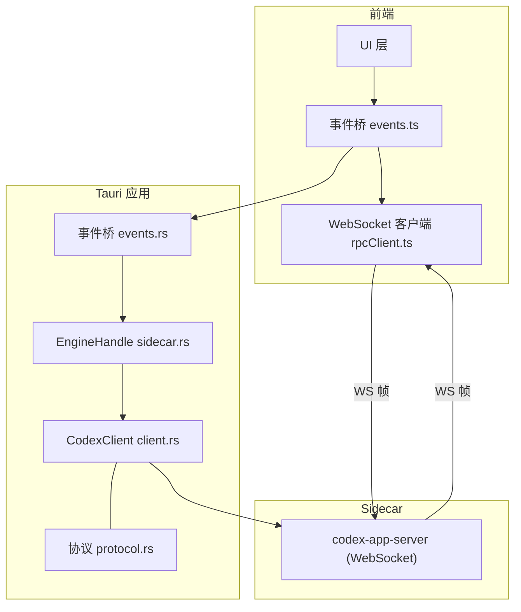
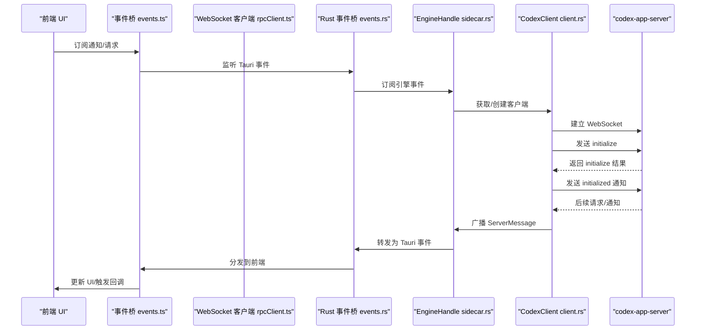
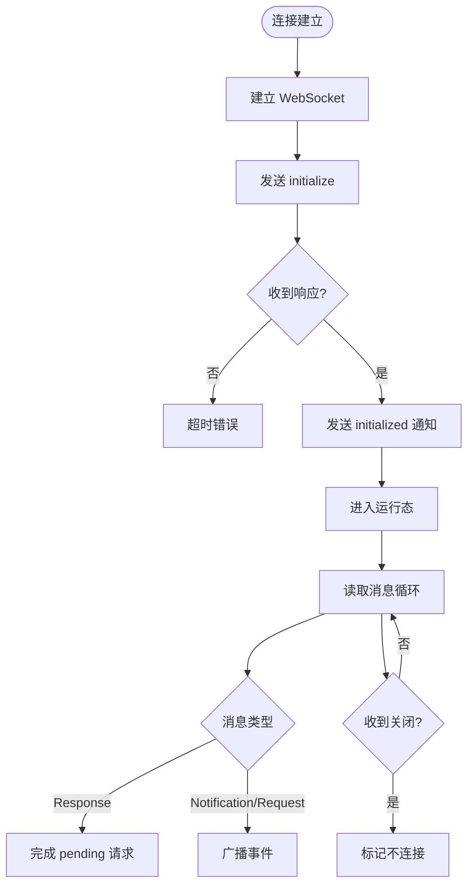
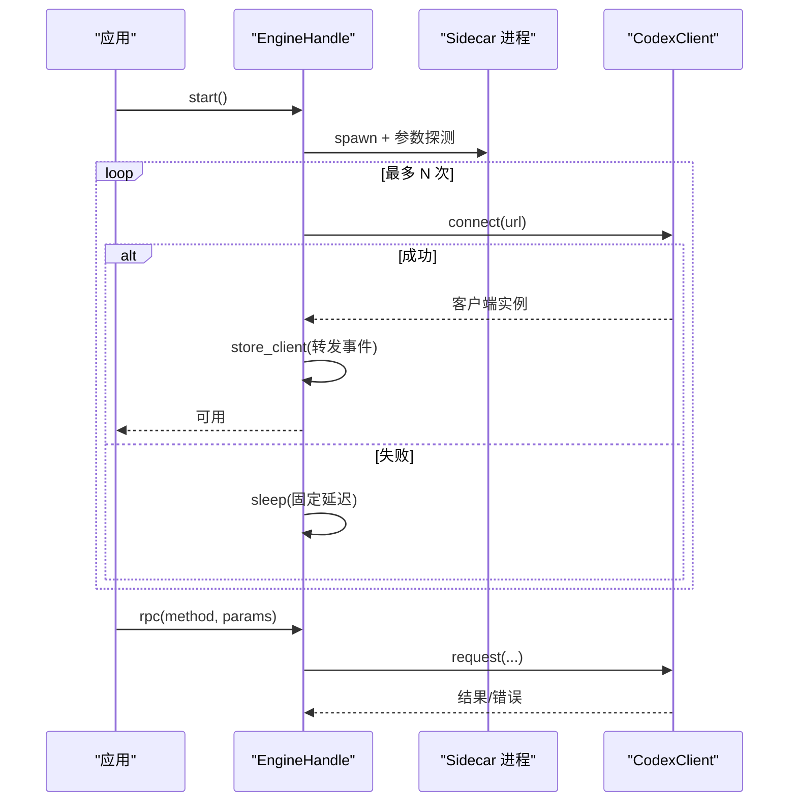
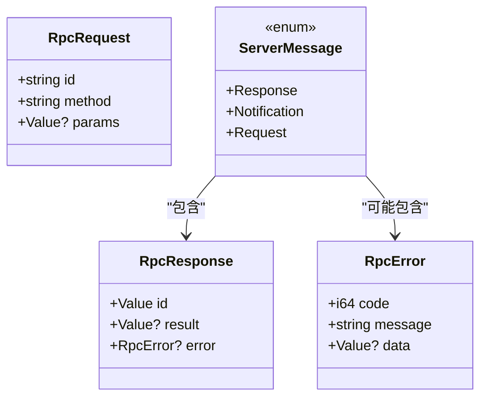
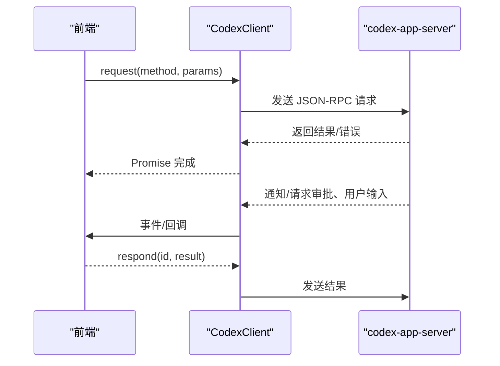
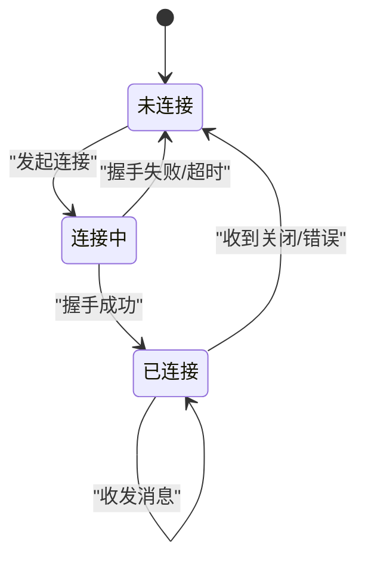
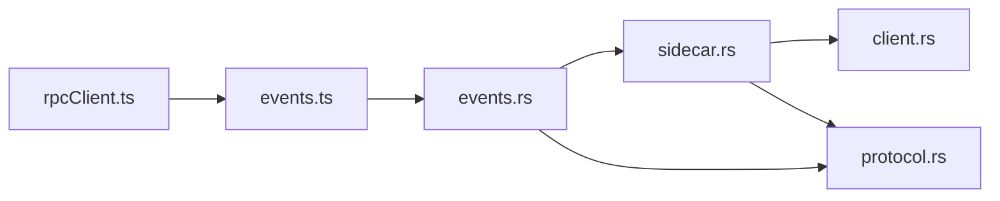

# WebSocket 实时通信

<cite>
**本文引用的文件**
- [client.rs](file://src-tauri/src/codex/client.rs)
- [sidecar.rs](file://src-tauri/src/codex/sidecar.rs)
- [protocol.rs](file://src-tauri/src/codex/protocol.rs)
- [events.rs](file://src-tauri/src/codex/events.rs)
- [rpcClient.ts](file://frontend/app/devbridge/rpcClient.ts)
- [events.ts](file://frontend/app/bridge/events.ts)
- [App.tsx](file://frontend/app/App.tsx)
</cite>

## 目录
1. [简介](#简介)
2. [项目结构](#项目结构)
3. [核心组件](#核心组件)
4. [架构总览](#架构总览)
5. [详细组件分析](#详细组件分析)
6. [依赖关系分析](#依赖关系分析)
7. [性能与连接池](#性能与连接池)
8. [故障排除指南](#故障排除指南)
9. [结论](#结论)
10. [附录：示例与最佳实践](#附录示例与最佳实践)

## 简介
本文件围绕客户端与 sidecar（codex-app-server）之间的 WebSocket 实时通信，系统性说明连接的建立、维护与断开流程；消息的编解码格式、协议版本兼容性与安全认证流程；以及客户端与 sidecar 的双向通信模式（请求-响应与事件推送）。同时给出连接状态图、重连策略、性能优化建议与常见问题排查方法。

## 项目结构
本项目在 Tauri 应用中通过 Rust 侧的 sidecar 管理 codex-app-server 进程，并通过 WebSocket 与其进行 JSON-RPC 通信；前端通过浏览器 WebSocket（开发桥）或 Tauri 事件通道与后端交互。关键路径如下：
- Rust 侧：
  - client.rs：WebSocket 客户端、JSON-RPC 请求/通知、初始化握手、超时与广播分发
  - sidecar.rs：启动/停止 sidecar 进程、连接重试、事件稳定广播
  - protocol.rs：协议常量、消息类型定义、解析器
  - events.rs：将服务端消息映射为 Tauri 事件并转发到前端
- 前端侧：
  - rpcClient.ts：浏览器端 WebSocket 客户端（开发桥），实现握手、请求-响应、自动重连
  - events.ts：Tauri 事件桥，订阅所有通知与服务端请求通道
  - App.tsx：应用根组件，订阅通知与服务器请求，驱动 UI 状态

**图表来源**
- [client.rs:37-94](file://src-tauri/src/codex/client.rs#L37-L94)
- [sidecar.rs:22-168](file://src-tauri/src/codex/sidecar.rs#L22-L168)
- [protocol.rs:103-198](file://src-tauri/src/codex/protocol.rs#L103-L198)
- [events.rs:12-43](file://src-tauri/src/codex/events.rs#L12-L43)
- [rpcClient.ts:70-101](file://frontend/app/devbridge/rpcClient.ts#L70-L101)
- [events.ts:57-159](file://frontend/app/bridge/events.ts#L57-L159)

**章节来源**
- [client.rs:1-234](file://src-tauri/src/codex/client.rs#L1-L234)
- [sidecar.rs:1-540](file://src-tauri/src/codex/sidecar.rs#L1-L540)
- [protocol.rs:1-207](file://src-tauri/src/codex/protocol.rs#L1-L207)
- [events.rs:1-82](file://src-tauri/src/codex/events.rs#L1-L82)
- [rpcClient.ts:1-230](file://frontend/app/devbridge/rpcClient.ts#L1-L230)
- [events.ts:1-172](file://frontend/app/bridge/events.ts#L1-L172)

## 核心组件
- CodexClient（Rust 侧 WebSocket JSON-RPC 客户端）
  - 负责建立 WebSocket 连接、完成 initialize/initialized 握手、发送请求、处理响应与通知、维护待处理请求映射、广播事件、关闭连接
- EngineHandle（sidecar 管理器）
  - 负责启动/停止 codex-app-server 子进程、探测 CLI 参数、安装二进制、连接重试、稳定事件广播、对外暴露 RPC 与事件接口
- Protocol（协议层）
  - 定义 JSON-RPC 方法名、消息结构（Request/Response/Notification）、解析函数、错误结构
- 事件桥（Rust 与前端）
  - Rust 侧 events.rs 将 ServerMessage 映射为 Tauri 事件；前端 events.ts 订阅这些事件并分发给 UI
- 浏览器 WebSocket 客户端（开发桥）
  - 实现与 Rust 侧一致的握手、请求-响应、通知分发与自动重连

**章节来源**
- [client.rs:23-199](file://src-tauri/src/codex/client.rs#L23-L199)
- [sidecar.rs:22-276](file://src-tauri/src/codex/sidecar.rs#L22-L276)
- [protocol.rs:103-198](file://src-tauri/src/codex/protocol.rs#L103-L198)
- [events.rs:12-82](file://src-tauri/src/codex/events.rs#L12-L82)
- [rpcClient.ts:70-230](file://frontend/app/devbridge/rpcClient.ts#L70-L230)
- [events.ts:57-159](file://frontend/app/bridge/events.ts#L57-L159)

## 架构总览
下图展示了从前端到 sidecar 的端到端数据流，包括握手、请求-响应与事件推送。

**图表来源**
- [client.rs:37-94](file://src-tauri/src/codex/client.rs#L37-L94)
- [sidecar.rs:146-168](file://src-tauri/src/codex/sidecar.rs#L146-L168)
- [events.rs:12-43](file://src-tauri/src/codex/events.rs#L12-L43)
- [rpcClient.ts:70-101](file://frontend/app/devbridge/rpcClient.ts#L70-L101)

## 详细组件分析

### 连接建立与维护（Rust 侧）
- 连接建立
  - 使用异步 WebSocket 连接至 sidecar 地址（默认 ws://127.0.0.1:17457）
  - 拆分读写通道，分别由独立任务处理
- 握手流程
  - 发送 initialize 请求（包含客户端信息、能力声明）
  - 等待响应后，立即发送 initialized 通知（无 params）
- 维护
  - 读任务持续接收文本帧，解析为 ServerMessage
  - 根据消息类型路由：
    - Response：匹配 pending 请求并 resolve/reject
    - Notification/Request：广播给订阅者
  - 连接关闭时设置 connected=false，供上层检测

**图表来源**
- [client.rs:37-94](file://src-tauri/src/codex/client.rs#L37-L94)
- [client.rs:196-234](file://src-tauri/src/codex/client.rs#L196-L234)

**章节来源**
- [client.rs:37-94](file://src-tauri/src/codex/client.rs#L37-L94)
- [client.rs:148-199](file://src-tauri/src/codex/client.rs#L148-L199)
- [client.rs:201-234](file://src-tauri/src/codex/client.rs#L201-L234)

### Sidecar 管理与自动重连
- 进程生命周期
  - 启动 codex-app-server，注入环境变量（如 provider secrets）
  - 探测 CLI 形状（多调用 vs 独立可执行），决定是否传递 --session-source
  - 将二进制安装到内容哈希目录，保证幂等与可回滚
- 连接重试
  - connect_with_retry：在 sidecar 存活时多次尝试连接，避免冷启动竞态
  - 首次成功连接后缓存客户端，后续直接复用
- 事件稳定广播
  - 将客户端的 broadcast 转发到 EngineHandle 的稳定 channel，屏蔽客户端重连对事件的影响

**图表来源**
- [sidecar.rs:31-125](file://src-tauri/src/codex/sidecar.rs#L31-L125)
- [sidecar.rs:188-244](file://src-tauri/src/codex/sidecar.rs#L188-L244)
- [sidecar.rs:278-340](file://src-tauri/src/codex/sidecar.rs#L278-L340)

**章节来源**
- [sidecar.rs:31-125](file://src-tauri/src/codex/sidecar.rs#L31-L125)
- [sidecar.rs:188-244](file://src-tauri/src/codex/sidecar.rs#L188-L244)
- [sidecar.rs:278-340](file://src-tauri/src/codex/sidecar.rs#L278-L340)

### 消息编解码与协议兼容性
- 协议版本
  - 注释明确与官方 app-server-protocol v0.154.0 保持同步
- 消息格式
  - Request：{ id, method, params? }
  - Response：{ id, result? | error? }
  - Notification：{ method, params? }
  - 服务端→客户端 Request：{ id, method, params? }（用于审批、用户输入、elicitation）
- 解析逻辑
  - parse_server_message 依据字段存在性区分三类消息
  - rpc_id_key 统一 id 键以适配字符串与整数 id
- 兼容性
  - 客户端 initialize 携带 clientInfo 与 capabilities
  - 浏览器端与 Rust 端保持一致的握手与超时策略

**图表来源**
- [protocol.rs:103-198](file://src-tauri/src/codex/protocol.rs#L103-L198)

**章节来源**
- [protocol.rs:1-207](file://src-tauri/src/codex/protocol.rs#L1-L207)

### 安全认证流程
- 当前实现未包含显式鉴权（如 token 校验）
- 连接仅绑定本地回环地址（默认 ws://127.0.0.1:17457），限制外部访问
- 通过 sidecar 环境变量注入 provider 密钥，避免配置泄露
- 浏览器开发桥通过 Vite 代理转发，去除 Origin 头以避免服务端拒绝升级请求

**章节来源**
- [sidecar.rs:13-19](file://src-tauri/src/codex/sidecar.rs#L13-L19)
- [sidecar.rs:53-66](file://src-tauri/src/codex/sidecar.rs#L53-L66)
- [rpcClient.ts:43-50](file://frontend/app/devbridge/rpcClient.ts#L43-L50)

### 双向通信模式
- 请求-响应模式
  - 客户端发送带唯一 id 的请求，服务端返回对应 id 的结果或错误
  - 客户端维护 pending 映射，支持超时与错误传播
- 事件推送模式
  - 服务端主动推送通知（如 turn 进度、item 增量）
  - Rust 侧通过 broadcast 分发，前端通过 Tauri 事件桥订阅
  - 特殊请求（审批、用户输入）走专用通道，需客户端回复 id

**图表来源**
- [client.rs:148-199](file://src-tauri/src/codex/client.rs#L148-L199)
- [events.rs:51-82](file://src-tauri/src/codex/events.rs#L51-L82)
- [rpcClient.ts:201-230](file://frontend/app/devbridge/rpcClient.ts#L201-L230)

**章节来源**
- [client.rs:148-199](file://src-tauri/src/codex/client.rs#L148-L199)
- [events.rs:51-82](file://src-tauri/src/codex/events.rs#L51-L82)
- [rpcClient.ts:201-230](file://frontend/app/devbridge/rpcClient.ts#L201-L230)

### 心跳检测与断线重连
- 心跳检测
  - 代码中未发现显式 ping/pong 心跳机制；连接健康由 read/write 错误与 close 事件推断
- 断线重连
  - 浏览器端：onclose/onerror 触发 scheduleReconnect，固定延迟重连
  - Rust 侧：EngineHandle 在首次连接失败时多次重试；客户端内部检测到 close 后标记不连接，上层可据此重建
- 建议
  - 可在 WebSocket 层增加周期性 ping/pong 以更快感知半开连接
  - 重连退避可采用指数退避与抖动，降低瞬时拥塞

**章节来源**
- [rpcClient.ts:150-187](file://frontend/app/devbridge/rpcClient.ts#L150-L187)
- [sidecar.rs:188-222](file://src-tauri/src/codex/sidecar.rs#L188-L222)
- [client.rs:64-79](file://src-tauri/src/codex/client.rs#L64-L79)

### 连接状态图

[此图为概念性状态图，无需源码映射]

## 依赖关系分析
- 模块耦合
  - sidecar.rs 依赖 client.rs 与 protocol.rs，封装进程与连接细节
  - events.rs 依赖 EngineHandle 与 protocol.rs，负责事件映射
  - 前端 events.ts 依赖 Tauri 事件 API，与 Rust 侧命名约定一致
- 外部依赖
  - tokio_tungstenite：WebSocket 传输
  - serde_json：JSON 编解码
  - tauri：进程管理与事件系统

**图表来源**
- [sidecar.rs:1-10](file://src-tauri/src/codex/sidecar.rs#L1-L10)
- [client.rs:1-15](file://src-tauri/src/codex/client.rs#L1-L15)
- [events.rs:1-10](file://src-tauri/src/codex/events.rs#L1-L10)
- [events.ts:13-21](file://frontend/app/bridge/events.ts#L13-L21)
- [rpcClient.ts:1-20](file://frontend/app/devbridge/rpcClient.ts#L1-L20)

**章节来源**
- [sidecar.rs:1-10](file://src-tauri/src/codex/sidecar.rs#L1-L10)
- [client.rs:1-15](file://src-tauri/src/codex/client.rs#L1-L15)
- [events.rs:1-10](file://src-tauri/src/codex/events.rs#L1-L10)
- [events.ts:13-21](file://frontend/app/bridge/events.ts#L13-L21)
- [rpcClient.ts:1-20](file://frontend/app/devbridge/rpcClient.ts#L1-L20)

## 性能与连接池
- 连接复用
  - EngineHandle 缓存单个 CodexClient，避免频繁握手开销
  - 浏览器端维护单例 WebSocket，避免重复连接
- 并发与背压
  - Rust 侧使用 broadcast channel 分发事件，容量有限（256），滞后会记录日志
  - pending 请求使用 oneshot 通道，避免阻塞
- 超时控制
  - initialize 超时 10s，普通请求超时 120s，防止长时间挂起
- 优化建议
  - 批量发送合并小消息
  - 对高频通知做节流或去抖
  - 考虑引入连接池以支持多租户或多会话场景（当前为单连接）

**章节来源**
- [client.rs:19-21](file://src-tauri/src/codex/client.rs#L19-L21)
- [client.rs:143-146](file://src-tauri/src/codex/client.rs#L143-L146)
- [sidecar.rs:146-168](file://src-tauri/src/codex/sidecar.rs#L146-L168)
- [rpcClient.ts:22-24](file://frontend/app/devbridge/rpcClient.ts#L22-L24)

## 故障排除指南
- 无法连接
  - 检查 sidecar 是否已启动且监听端口可达
  - 确认 CLI 参数探测正确（多调用 vs 独立可执行）
  - 查看日志中的“failed to spawn”或“no binary resolved”
- 握手失败
  - 确认 initialize 参数符合规范（clientInfo、capabilities）
  - 确保 initialized 通知在响应后立即发送
- 请求超时
  - 检查服务端是否处理请求并返回结果
  - 调整 REQUEST_TIMEOUT 或排查服务端瓶颈
- 事件丢失
  - 关注 broadcast lag 日志，必要时增大容量或优化消费者速度
- 浏览器端重连
  - 确认代理路径 /appserver 可用，Origin 头被移除
  - 观察 onclose 触发原因，必要时增加网络诊断

**章节来源**
- [sidecar.rs:106-116](file://src-tauri/src/codex/sidecar.rs#L106-L116)
- [sidecar.rs:188-222](file://src-tauri/src/codex/sidecar.rs#L188-L222)
- [client.rs:121-132](file://src-tauri/src/codex/client.rs#L121-L132)
- [events.rs:33-39](file://src-tauri/src/codex/events.rs#L33-L39)
- [rpcClient.ts:150-187](file://frontend/app/devbridge/rpcClient.ts#L150-L187)

## 结论
该实现通过 Rust 侧的 WebSocket 客户端与 sidecar 进程管理，结合前端的稳定事件桥，提供了可靠的实时通信能力。协议遵循官方规范，具备完善的握手、请求-响应与事件推送机制。当前未实现显式心跳与连接池，但可通过扩展增强健壮性与扩展性。建议在关键路径加入心跳检测与更灵活的重连策略，以提升在高延迟或不稳定网络下的鲁棒性。

## 附录：示例与最佳实践
- 建立连接
  - Rust 侧：调用 EngineHandle::start 并等待 is_running 为真
  - 浏览器端：初始化 rpcClient 并等待 engineConnected 为真
- 发送消息（请求-响应）
  - Rust 侧：EngineHandle::rpc(method, params)
  - 浏览器端：rpcRequest(method, params)
- 处理断线重连
  - 浏览器端：onclose/onerror 触发重连；Rust 侧 detect close 后重置状态
- 优化网络性能
  - 合并小消息、节流高频通知、合理设置超时与重连间隔

**章节来源**
- [sidecar.rs:31-125](file://src-tauri/src/codex/sidecar.rs#L31-L125)
- [rpcClient.ts:150-230](file://frontend/app/devbridge/rpcClient.ts#L150-L230)
- [App.tsx:15-46](file://frontend/app/App.tsx#L15-L46)