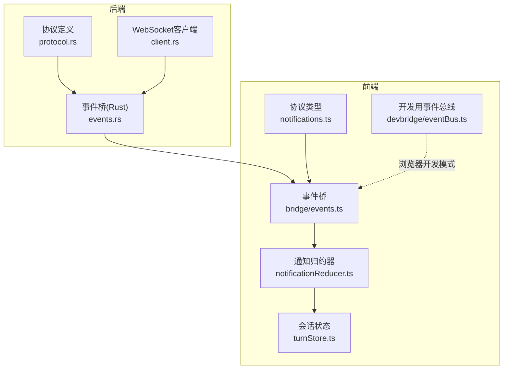
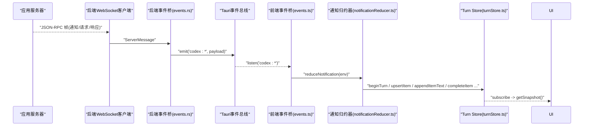
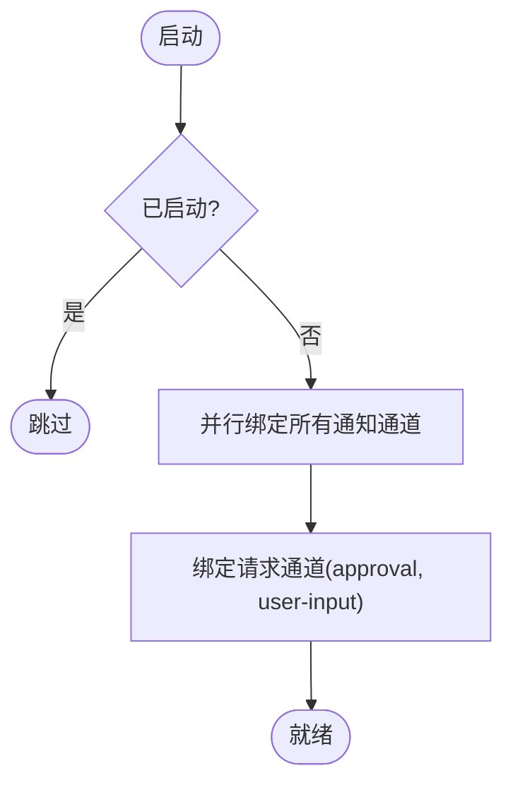
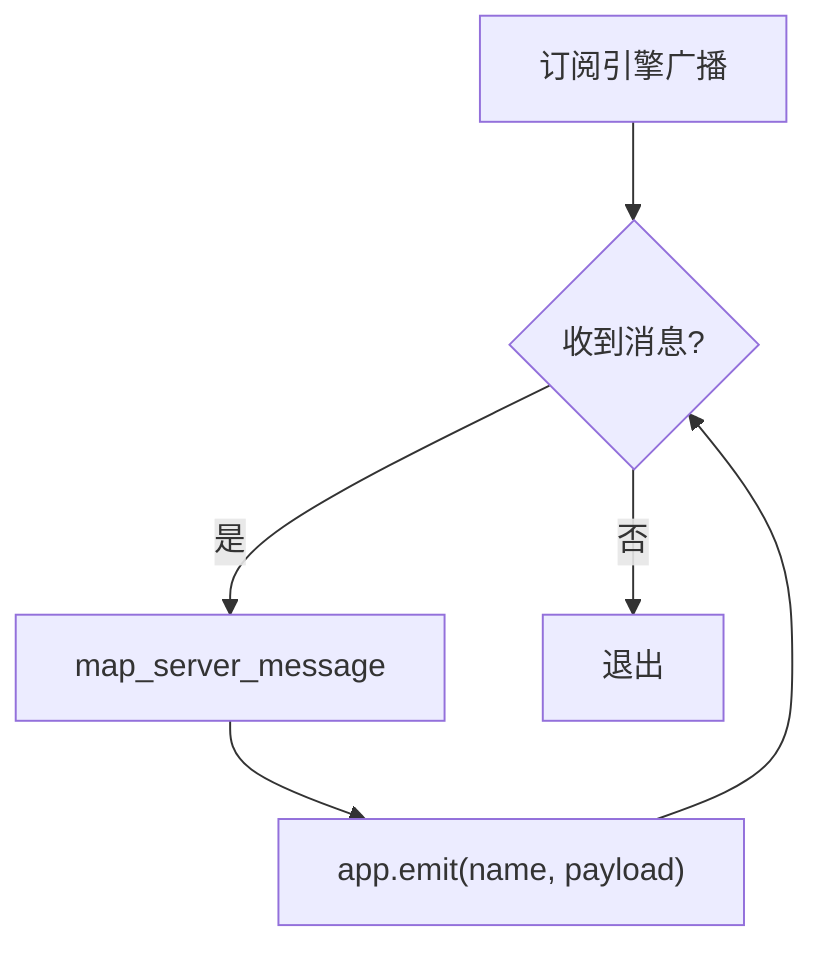
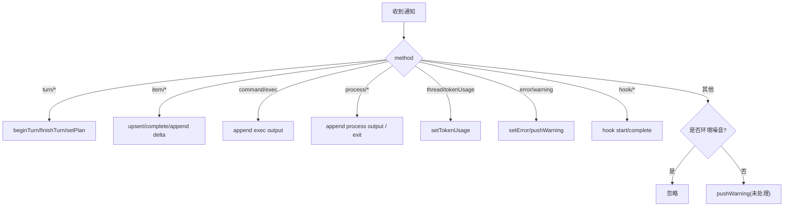
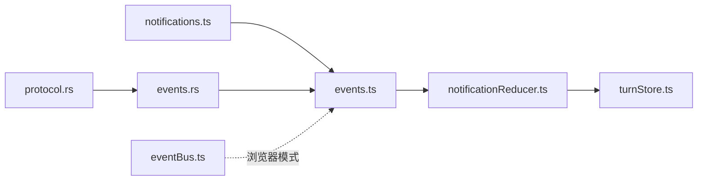
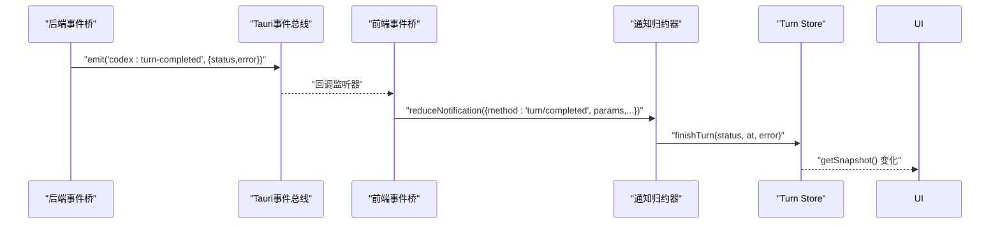

# 事件通知系统

<cite>
**本文引用的文件**
- [notifications.ts](file://frontend/src/protocol/notifications.ts)
- [events.ts](file://frontend/app/bridge/events.ts)
- [events.rs](file://src-tauri/src/codex/events.rs)
- [notificationReducer.ts](file://frontend/app/state/notificationReducer.ts)
- [turnStore.ts](file://frontend/app/state/turnStore.ts)
- [eventBus.ts](file://frontend/app/devbridge/eventBus.ts)
- [protocol.rs](file://src-tauri/src/codex/protocol.rs)
- [client.rs](file://src-tauri/src/codex/client.rs)
</cite>

## 目录
1. [简介](#简介)
2. [项目结构](#项目结构)
3. [核心组件](#核心组件)
4. [架构总览](#架构总览)
5. [详细组件分析](#详细组件分析)
6. [依赖关系分析](#依赖关系分析)
7. [性能考虑](#性能考虑)
8. [故障排查指南](#故障排查指南)
9. [结论](#结论)
10. [附录：示例与最佳实践](#附录示例与最佳实践)

## 简介
本文件为“事件通知系统”的完整技术文档，聚焦于以下目标：
- 深入解析前端协议类型与事件结构（notifications.ts），涵盖实时消息推送、状态变更通知与系统事件。
- 详解事件桥接实现（bridge/events.ts）：Tauri 事件监听、订阅注册与消息路由。
- 解释后端事件桥（Rust events.rs）如何将引擎通知广播到前端 Tauri 事件通道。
- 阐述事件驱动架构模式：发布-订阅与事件总线在系统中的落地方式。
- 提供订阅事件、发送自定义事件、处理事件生命周期的具体示例与流程图。
- 给出性能优化建议与常见问题排查方法。

## 项目结构
事件通知系统横跨前端与后端两部分：
- 前端协议层：定义所有通知方法与实验性方法集合，用于类型安全与自动绑定。
- 前端事件桥：统一接入 Tauri 事件，将服务器推送的消息分发到订阅者。
- 前端状态层：将通知转换为 UI 可消费的状态变更（Turn Store）。
- 后端事件桥：从引擎接收 ServerMessage，映射为 Tauri 事件并广播。
- 后端协议层：定义 JSON-RPC 请求/响应/通知结构与解析逻辑。
- 后端客户端：通过 WebSocket 连接服务端，维护消息收发与重连。

**图表来源**
- [notifications.ts:10-126](file://frontend/src/protocol/notifications.ts#L10-L126)
- [events.ts:13-159](file://frontend/app/bridge/events.ts#L13-L159)
- [events.rs:1-82](file://src-tauri/src/codex/events.rs#L1-L82)
- [protocol.rs:139-198](file://src-tauri/src/codex/protocol.rs#L139-L198)
- [client.rs:37-62](file://src-tauri/src/codex/client.rs#L37-L62)

**章节来源**
- [notifications.ts:10-126](file://frontend/src/protocol/notifications.ts#L10-L126)
- [events.ts:13-159](file://frontend/app/bridge/events.ts#L13-L159)
- [events.rs:1-82](file://src-tauri/src/codex/events.rs#L1-L82)
- [protocol.rs:139-198](file://src-tauri/src/codex/protocol.rs#L139-L198)
- [client.rs:37-62](file://src-tauri/src/codex/client.rs#L37-L62)

## 核心组件
- 协议类型与常量：集中声明所有通知方法名、实验性方法名及 Rust 变体映射，提供类型安全的校验工具。
- 事件桥（前端）：启动时按协议表批量订阅所有通知通道；对服务器请求（审批、用户输入等）使用固定通道；封装统一的入站消息信封；提供 onNotification/onServerRequest 订阅 API。
- 事件桥（后端）：订阅引擎广播通道，将 ServerMessage 映射为 Tauri 事件名与载荷，并发出；对请求类消息进行归类（approval/user-input）。
- 通知归约器：将每个通知方法映射到 Turn Store 的具体操作（开始/结束 turn、追加流式文本、完成 item、设置 token 用量、警告等）。
- 会话状态（Turn Store）：单一事实源，保存当前 turn、item 列表、计划步骤、token 用量、警告、待处理请求等；提供 subscribe/getSnapshot 供 UI 消费。
- 开发事件总线：在浏览器模式下模拟 Tauri 事件语义，便于本地调试。

**章节来源**
- [notifications.ts:10-222](file://frontend/src/protocol/notifications.ts#L10-L222)
- [events.ts:23-172](file://frontend/app/bridge/events.ts#L23-L172)
- [events.rs:11-82](file://src-tauri/src/codex/events.rs#L11-L82)
- [notificationReducer.ts:189-445](file://frontend/app/state/notificationReducer.ts#L189-L445)
- [turnStore.ts:28-285](file://frontend/app/state/turnStore.ts#L28-L285)
- [eventBus.ts:10-47](file://frontend/app/devbridge/eventBus.ts#L10-L47)

## 架构总览
系统采用“后端发布-订阅 + 前端事件总线”的事件驱动架构：
- 后端通过 WebSocket 连接应用服务器，解析 JSON-RPC 帧，区分 Notification/Request/Response。
- 事件桥将 Notification 转为 Tauri 事件（如 codex:turn-completed），将 Request 归类到专用通道（codex:approval、codex:user-input）。
- 前端事件桥在启动时按协议表批量订阅所有通知通道，并将消息分发给已注册的处理器。
- 通知归约器将消息转换为 Turn Store 的状态变更，UI 通过订阅获取最新快照渲染。

**图表来源**
- [client.rs:37-62](file://src-tauri/src/codex/client.rs#L37-L62)
- [protocol.rs:139-198](file://src-tauri/src/codex/protocol.rs#L139-L198)
- [events.rs:11-82](file://src-tauri/src/codex/events.rs#L11-L82)
- [events.ts:95-159](file://frontend/app/bridge/events.ts#L95-L159)
- [notificationReducer.ts:189-445](file://frontend/app/state/notificationReducer.ts#L189-L445)
- [turnStore.ts:71-285](file://frontend/app/state/turnStore.ts#L71-L285)

## 详细组件分析

### 通知类型与事件结构（notifications.ts）
- 定义所有通知方法名常量数组，以及实验性方法集合。
- 提供 method 到 Rust 变体的映射表，便于追踪来源。
- 提供 isNotificationMethod 校验函数，确保仅处理已知方法。
- 该文件由脚本生成，保证前后端协议一致性。

**章节来源**
- [notifications.ts:10-222](file://frontend/src/protocol/notifications.ts#L10-L222)

### 事件桥（前端 bridge/events.ts）
- tauriEventName：将协议方法名中的“.”和“/”替换为“-”，形成 Tauri 事件名（如 codex:turn-completed）。
- 订阅 API：onNotification、onServerRequest，返回取消订阅函数。
- 消息分发：emitNotification/emitRequest 遍历处理器集合调用，捕获异常避免单点失败影响整体。
- 通道绑定：
  - 对所有 NOTIFICATION_METHODS 并行绑定监听。
  - 对服务器请求绑定固定通道 codex:approval 与 codex:user-input。
- 生命周期：startEventBridge 一次性初始化，stopEventBridge 清理所有监听。

**图表来源**
- [events.ts:145-159](file://frontend/app/bridge/events.ts#L145-L159)

**章节来源**
- [events.ts:23-172](file://frontend/app/bridge/events.ts#L23-L172)

### 事件桥（后端 src-tauri/events.rs）
- 启动后延迟订阅 EngineHandle 的广播通道，确保引擎句柄可用。
- 循环接收消息，调用 map_server_message 将 ServerMessage 映射为 Tauri 事件名与载荷。
- 对 Notification：方法名中的“/”或“.”替换为“-”，前缀 codex:。
- 对 Request：根据方法名归类到 approval 或 user-input，否则生成 server-request-* 通道。
- 错误处理：记录 lagged/dropped 与 channel closed 情况。

**图表来源**
- [events.rs:11-82](file://src-tauri/src/codex/events.rs#L11-L82)

**章节来源**
- [events.rs:11-82](file://src-tauri/src/codex/events.rs#L11-L82)

### 通知归约器（notificationReducer.ts）
- 将每种通知方法映射到 Turn Store 的具体操作：
  - Turn 生命周期：beginTurn、finishTurn、setPlan。
  - Item 生命周期：upsertItem、completeItem、appendItemText/Output。
  - 流式增量：agentMessage、reasoning、commandExecution、fileChange、plan、mcpToolCall。
  - 独立执行/进程：command/exec/outputDelta、process/outputDelta、process/exited。
  - 线程级状态：tokenUsage 更新。
  - 诊断与告警：error、warning、guardianWarning、configWarning、model/rerouted。
  - Hooks：hook/started、hook/completed。
- 未知方法且非环境噪音时，记录警告以便发现未覆盖的通知。

**图表来源**
- [notificationReducer.ts:189-445](file://frontend/app/state/notificationReducer.ts#L189-L445)

**章节来源**
- [notificationReducer.ts:189-445](file://frontend/app/state/notificationReducer.ts#L189-L445)

### 会话状态（turnStore.ts）
- 单一事实源，保存当前 turn、items、计划、token 用量、警告、待处理请求等。
- beginTurn：检测 threadId 切换，必要时清空 items；重置 turn 级别字段。
- appendItemText/Output：支持增量拼接，若 item 不存在则创建。
- completeItem：计算持续时间，标记完成时间。
- setPhase、setTokenUsage、setPlan、pushWarning、addPendingRequest/removePendingRequest、setError。
- loadThreadFromSession：从 get_session 与 get_runtime_events 恢复历史，构建初始 items。

**章节来源**
- [turnStore.ts:28-285](file://frontend/app/state/turnStore.ts#L28-L285)
- [turnStore.ts:328-467](file://frontend/app/state/turnStore.ts#L328-L467)

### 开发事件总线（devbridge/eventBus.ts）
- 在浏览器模式下提供 listen/emit 语义，模拟 Tauri 事件行为。
- handlers 以 Map<string, Set<Handler>> 管理，支持异步监听与取消。
- emit 时捕获异常，避免单个处理器失败影响整体。

**章节来源**
- [eventBus.ts:10-47](file://frontend/app/devbridge/eventBus.ts#L10-L47)

### 协议与客户端（protocol.rs、client.rs）
- protocol.rs：定义 JSON-RPC 方法名常量、请求/响应/通知结构，以及 parse_server_message 解析逻辑。
- client.rs：建立 WebSocket 连接，拆分读写任务，维护 pending 请求与通知广播通道。

**章节来源**
- [protocol.rs:1-207](file://src-tauri/src/codex/protocol.rs#L1-L207)
- [client.rs:37-62](file://src-tauri/src/codex/client.rs#L37-L62)

## 依赖关系分析
- notifications.ts 被 events.ts 导入，用于自动生成订阅通道。
- events.ts 依赖 Tauri event API，并调用 notificationReducer 与 turnStore。
- events.rs 依赖 protocol.rs 的 ServerMessage 枚举与解析结果。
- notificationReducer.ts 依赖 turnStore.ts 暴露的状态操作方法。
- devbridge/eventBus.ts 仅在浏览器开发模式替代 Tauri 事件能力。

**图表来源**
- [notifications.ts:10-126](file://frontend/src/protocol/notifications.ts#L10-L126)
- [events.ts:13-159](file://frontend/app/bridge/events.ts#L13-L159)
- [events.rs:1-82](file://src-tauri/src/codex/events.rs#L1-L82)
- [protocol.rs:139-198](file://src-tauri/src/codex/protocol.rs#L139-L198)

**章节来源**
- [notifications.ts:10-126](file://frontend/src/protocol/notifications.ts#L10-L126)
- [events.ts:13-159](file://frontend/app/bridge/events.ts#L13-L159)
- [events.rs:1-82](file://src-tauri/src/codex/events.rs#L1-L82)
- [protocol.rs:139-198](file://src-tauri/src/codex/protocol.rs#L139-L198)

## 性能考虑
- 批量订阅：前端启动时对 NOTIFICATION_METHODS 并行绑定监听，减少串行开销。
- 防抖与节流：高频流式增量（如 agentMessage/delta、process/outputDelta）建议在 UI 层做节流合并，避免频繁重绘。
- 状态不可变更新：turnStore 每次提交新快照，利于 React 高效 diff。
- 丢弃策略：后端广播通道 lagged 会记录并丢弃部分事件，需关注业务容忍度。
- 内存管理：及时取消订阅（onNotification/onServerRequest 返回的取消函数），防止内存泄漏。

[本节为通用指导，不直接分析具体文件]

## 故障排查指南
- 事件未到达前端：
  - 检查后端是否正确 emit（events.rs 日志中是否有 emit failed）。
  - 确认前端已调用 startEventBridge 且 started 标志为真。
- 处理器崩溃导致后续事件丢失：
  - 事件桥对每个处理器调用包裹 try/catch，不会中断其余处理器；检查控制台错误日志定位问题处理器。
- 未知方法警告：
  - 若出现“无处理器”的警告，说明新增通知未在 notificationReducer 中处理；补充对应 case。
- 连接断开与重连：
  - 后端 WebSocket 断开会触发关闭流程；检查 client.rs 的重连逻辑与重试策略。
- 浏览器开发模式：
  - 使用 devbridge/eventBus.ts 的 bridgeListen/bridgeEmit 验证事件流转，再切回 Tauri 环境。

**章节来源**
- [events.ts:69-87](file://frontend/app/bridge/events.ts#L69-L87)
- [events.rs:24-42](file://src-tauri/src/codex/events.rs#L24-L42)
- [notificationReducer.ts:437-445](file://frontend/app/state/notificationReducer.ts#L437-L445)
- [client.rs:37-62](file://src-tauri/src/codex/client.rs#L37-L62)

## 结论
本事件通知系统通过严格的协议定义、稳定的事件桥与清晰的状态归约，实现了高内聚、低耦合的事件驱动架构。前端基于协议表自动绑定通道，后端将引擎通知可靠地广播到 Tauri 事件总线，最终转化为 UI 可消费的 Turn Store 状态。该设计具备良好的扩展性与可维护性，适合持续演进的通知体系。

[本节为总结，不直接分析具体文件]

## 附录：示例与最佳实践

### 订阅事件
- 订阅所有通知：
  - 在前端模块中调用 onNotification(handler)，并在组件卸载时调用返回的取消函数。
  - 参考路径：[events.ts:57-67](file://frontend/app/bridge/events.ts#L57-L67)
- 订阅服务器请求（审批、用户输入）：
  - 调用 onServerRequest(handler)，处理 id/method/params，并按协议回复。
  - 参考路径：[events.ts:63-67](file://frontend/app/bridge/events.ts#L63-L67)

**章节来源**
- [events.ts:57-67](file://frontend/app/bridge/events.ts#L57-L67)

### 发送自定义事件（开发模式）
- 在浏览器开发模式下，使用 bridgeEmit(event, payload) 模拟后端事件。
- 使用 bridgeListen(event, handler) 订阅并测试事件流转。
- 参考路径：[eventBus.ts:21-47](file://frontend/app/devbridge/eventBus.ts#L21-L47)

**章节来源**
- [eventBus.ts:21-47](file://frontend/app/devbridge/eventBus.ts#L21-L47)

### 处理事件生命周期
- 典型流程：
  - 后端收到通知 → 映射为 Tauri 事件 → 前端事件桥分发 → 通知归约器更新状态 → UI 订阅快照渲染。
- 关键路径：
  - 后端映射：[events.rs:45-82](file://src-tauri/src/codex/events.rs#L45-L82)
  - 前端分发：[events.ts:95-159](file://frontend/app/bridge/events.ts#L95-L159)
  - 状态更新：[notificationReducer.ts:189-445](file://frontend/app/state/notificationReducer.ts#L189-L445)
  - 状态订阅：[turnStore.ts:38-49](file://frontend/app/state/turnStore.ts#L38-L49)

**章节来源**
- [events.rs:45-82](file://src-tauri/src/codex/events.rs#L45-L82)
- [events.ts:95-159](file://frontend/app/bridge/events.ts#L95-L159)
- [notificationReducer.ts:189-445](file://frontend/app/state/notificationReducer.ts#L189-L445)
- [turnStore.ts:38-49](file://frontend/app/state/turnStore.ts#L38-L49)

### 事件流程图（端到端）

**图表来源**
- [events.rs:45-82](file://src-tauri/src/codex/events.rs#L45-L82)
- [events.ts:95-159](file://frontend/app/bridge/events.ts#L95-L159)
- [notificationReducer.ts:204-208](file://frontend/app/state/notificationReducer.ts#L204-L208)
- [turnStore.ts:241-256](file://frontend/app/state/turnStore.ts#L241-L256)

### 最佳实践
- 始终使用 onNotification/onServerRequest 的取消函数管理订阅生命周期。
- 对高频流式数据在 UI 层做节流/合并，降低渲染压力。
- 新增通知方法时，同步补充 notificationReducer 的处理分支，避免“未处理”警告。
- 在浏览器开发模式优先验证事件流转，再切换到 Tauri 环境。
- 关注后端 lagged 日志，评估业务对丢事件的容忍度，必要时增加缓冲或重试。

[本节为通用指导，不直接分析具体文件]