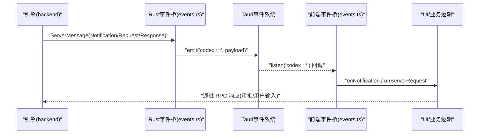
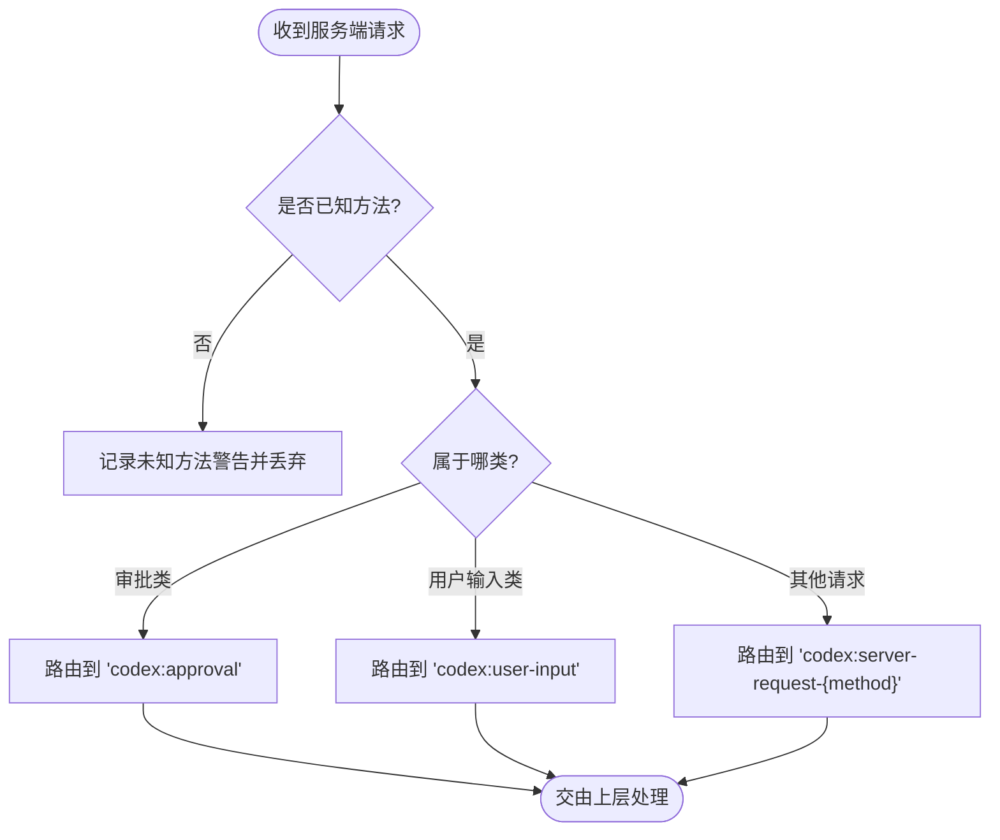
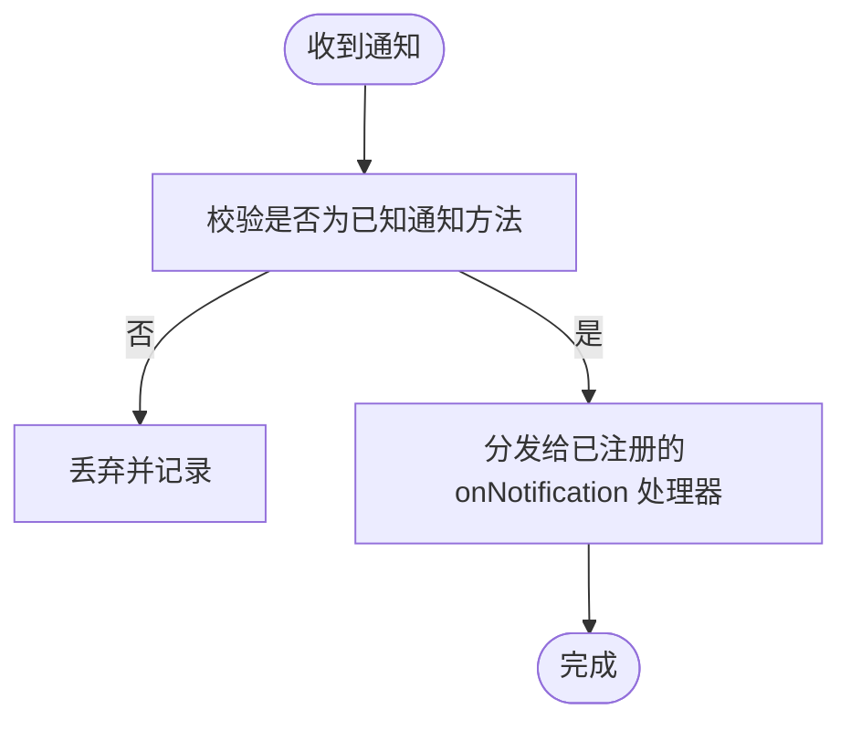
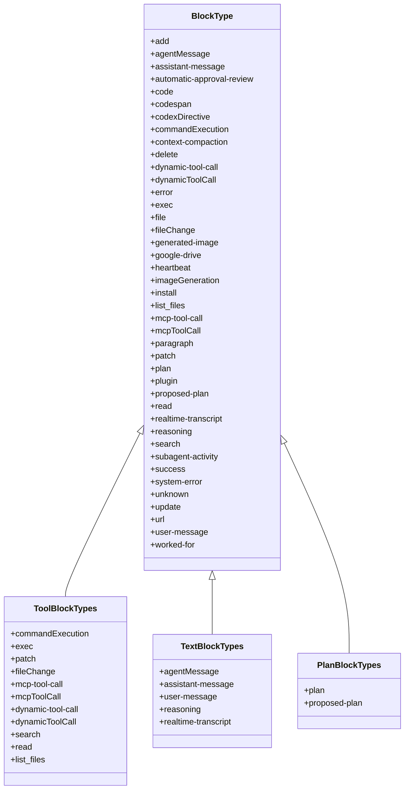
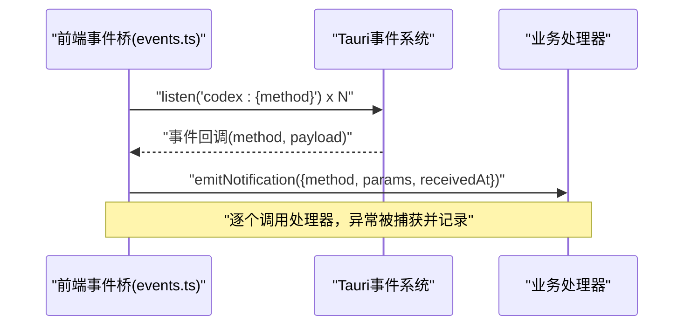
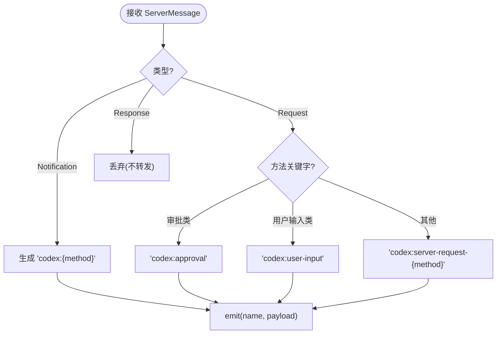
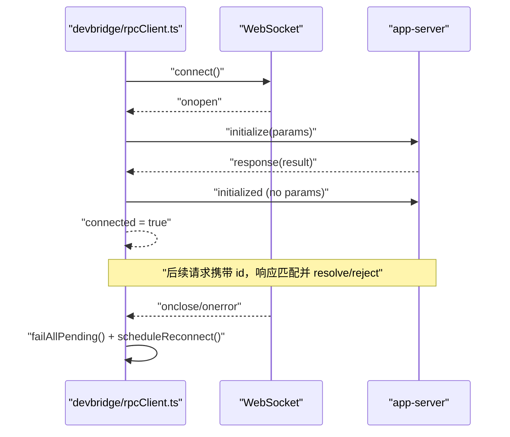
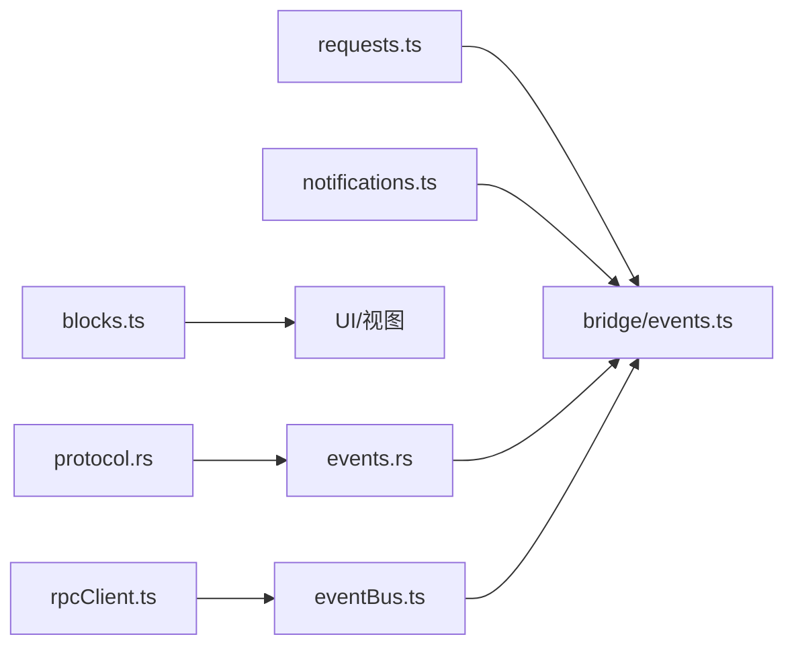
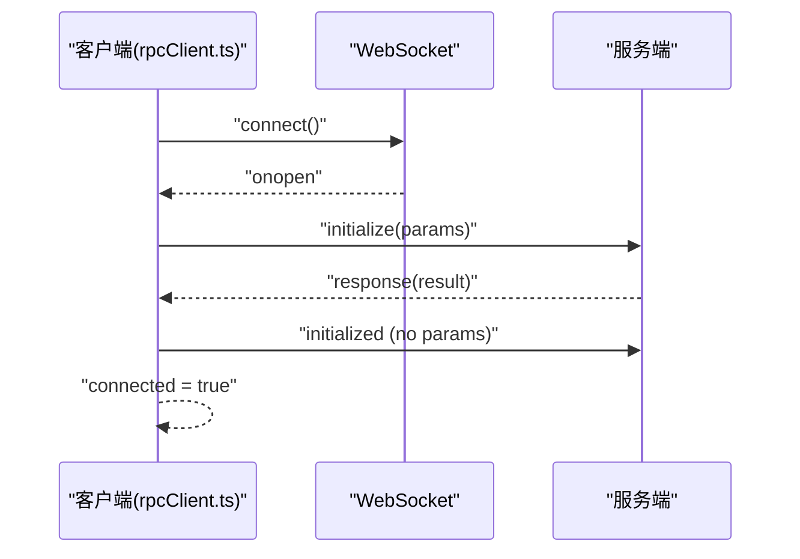
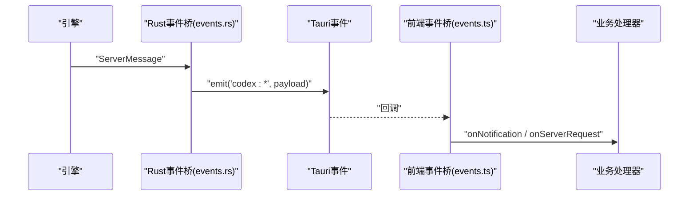

# 前后端通信协议

<cite>
**本文引用的文件**
- [frontend/src/protocol/requests.ts](file://frontend/src/protocol/requests.ts)
- [frontend/src/protocol/notifications.ts](file://frontend/src/protocol/notifications.ts)
- [frontend/src/protocol/blocks.ts](file://frontend/src/protocol/blocks.ts)
- [frontend/app/bridge/events.ts](file://frontend/app/bridge/events.ts)
- [src-tauri/src/codex/events.rs](file://src-tauri/src/codex/events.rs)
- [src-tauri/src/codex/protocol.rs](file://src-tauri/src/codex/protocol.rs)
- [frontend/app/devbridge/rpcClient.ts](file://frontend/app/devbridge/rpcClient.ts)
- [frontend/app/devbridge/eventBus.ts](file://frontend/app/devbridge/eventBus.ts)
- [frontend/app/devbridge/tauri-event.ts](file://frontend/app/devbridge/tauri-event.ts)
</cite>

## 目录
1. [简介](#简介)
2. [项目结构](#项目结构)
3. [核心组件](#核心组件)
4. [架构总览](#架构总览)
5. [详细组件分析](#详细组件分析)
6. [依赖关系分析](#依赖关系分析)
7. [性能与可靠性](#性能与可靠性)
8. [故障排查指南](#故障排查指南)
9. [结论](#结论)
10. [附录：协议规范与时序图](#附录协议规范与时序图)

## 简介
本文件为 Codex-Tauri 的前后端通信协议文档，聚焦 Tauri IPC 机制、请求-响应模式、事件通知系统与实时数据流处理。重点覆盖：
- requests.ts 中的服务端请求方法定义与分类
- notifications.ts 的通知方法与实验特性开关
- blocks.ts 的数据块类型与分组
- bridge/events.ts 的事件桥接实现（订阅、路由、错误隔离）
- src-tauri 侧 events.rs 的 Rust 事件桥接与消息映射
- 开发环境下的 WebSocket 客户端 rpcClient.ts 的连接管理、握手、重连与错误重试

## 项目结构
前端协议层位于 frontend/src/protocol，提供类型化常量与方法名集合；事件桥接在 frontend/app/bridge/events.ts；Rust 侧事件桥接在 src-tauri/src/codex/events.rs；开发环境的 WebSocket 客户端在 frontend/app/devbridge。

```mermaid
graph TB
subgraph "前端"
A["协议常量<br/>requests.ts / notifications.ts / blocks.ts"]
B["事件桥接<br/>bridge/events.ts"]
C["开发环境 WS 客户端<br/>devbridge/rpcClient.ts"]
D["浏览器事件总线<br/>devbridge/eventBus.ts"]
end
subgraph "Tauri/Rust"
E["事件桥接<br/>codex/events.rs"]
F["协议定义<br/>codex/protocol.rs"]
end
A --> B
C --> D
D --> B
B < --> E
E --> F
```

图表来源
- [frontend/src/protocol/requests.ts:10-48](file://frontend/src/protocol/requests.ts#L10-L48)
- [frontend/src/protocol/notifications.ts:10-123](file://frontend/src/protocol/notifications.ts#L10-L123)
- [frontend/src/protocol/blocks.ts:10-85](file://frontend/src/protocol/blocks.ts#L10-L85)
- [frontend/app/bridge/events.ts:13-159](file://frontend/app/bridge/events.ts#L13-L159)
- [src-tauri/src/codex/events.rs:11-81](file://src-tauri/src/codex/events.rs#L11-L81)
- [src-tauri/src/codex/protocol.rs:139-198](file://src-tauri/src/codex/protocol.rs#L139-L198)
- [frontend/app/devbridge/rpcClient.ts:70-148](file://frontend/app/devbridge/rpcClient.ts#L70-L148)
- [frontend/app/devbridge/eventBus.ts:19-46](file://frontend/app/devbridge/eventBus.ts#L19-L46)

章节来源
- [frontend/src/protocol/requests.ts:10-48](file://frontend/src/protocol/requests.ts#L10-L48)
- [frontend/src/protocol/notifications.ts:10-123](file://frontend/src/protocol/notifications.ts#L10-L123)
- [frontend/src/protocol/blocks.ts:10-85](file://frontend/src/protocol/blocks.ts#L10-L85)
- [frontend/app/bridge/events.ts:13-159](file://frontend/app/bridge/events.ts#L13-L159)
- [src-tauri/src/codex/events.rs:11-81](file://src-tauri/src/codex/events.rs#L11-L81)
- [src-tauri/src/codex/protocol.rs:139-198](file://src-tauri/src/codex/protocol.rs#L139-L198)
- [frontend/app/devbridge/rpcClient.ts:70-148](file://frontend/app/devbridge/rpcClient.ts#L70-L148)
- [frontend/app/devbridge/eventBus.ts:19-46](file://frontend/app/devbridge/eventBus.ts#L19-L46)

## 核心组件
- 协议常量与类型
  - 服务端请求方法集合与分类（审批、用户输入等）
  - 通知方法集合与实验特性白名单
  - 数据块类型与分组（工具调用、文本、计划等）
- 事件桥接（前端）
  - 统一入口：监听所有通知与特定请求通道
  - 事件名规范化：将“.”和“/”替换为“-”，前缀 codex:
  - 分发器：对每个处理器捕获异常，避免单点失败影响整体
- 事件桥接（Rust）
  - 从引擎广播通道接收 ServerMessage，映射到 Tauri 事件
  - 请求分流：审批、用户输入走专用通道，其他请求走通用通道
  - 容错：忽略丢失或关闭的错误，记录日志
- 开发环境 WebSocket 客户端
  - 三阶段握手：initialize → response → initialized
  - 请求-响应：带超时与待处理队列
  - 重连策略：固定延迟重连，断开时清理状态并失败挂起请求

章节来源
- [frontend/src/protocol/requests.ts:10-48](file://frontend/src/protocol/requests.ts#L10-L48)
- [frontend/src/protocol/notifications.ts:10-123](file://frontend/src/protocol/notifications.ts#L10-L123)
- [frontend/src/protocol/blocks.ts:10-85](file://frontend/src/protocol/blocks.ts#L10-L85)
- [frontend/app/bridge/events.ts:23-159](file://frontend/app/bridge/events.ts#L23-L159)
- [src-tauri/src/codex/events.rs:11-81](file://src-tauri/src/codex/events.rs#L11-L81)
- [frontend/app/devbridge/rpcClient.ts:70-148](file://frontend/app/devbridge/rpcClient.ts#L70-L148)

## 架构总览
下图展示了从 Rust 引擎到前端 UI 的完整消息路径，包括通知、请求与响应。



图表来源
- [src-tauri/src/codex/events.rs:11-81](file://src-tauri/src/codex/events.rs#L11-L81)
- [frontend/app/bridge/events.ts:95-159](file://frontend/app/bridge/events.ts#L95-L159)
- [frontend/app/devbridge/rpcClient.ts:103-148](file://frontend/app/devbridge/rpcClient.ts#L103-L148)

## 详细组件分析

### 请求-响应模式（requests.ts）
- 服务端请求方法清单用于类型约束与校验，确保只处理已知方法
- 分类：
  - 必须审批的请求：命令执行、文件变更、权限审批
  - 需要用户输入的请求：工具调用、MCP 询问
- 这些方法在 Rust 侧会被映射到特定 Tauri 事件通道，便于集中处理



图表来源
- [frontend/src/protocol/requests.ts:10-48](file://frontend/src/protocol/requests.ts#L10-L48)
- [src-tauri/src/codex/events.rs:51-79](file://src-tauri/src/codex/events.rs#L51-L79)
- [frontend/app/bridge/events.ts:119-139](file://frontend/app/bridge/events.ts#L119-L139)

章节来源
- [frontend/src/protocol/requests.ts:10-48](file://frontend/src/protocol/requests.ts#L10-L48)
- [src-tauri/src/codex/events.rs:51-79](file://src-tauri/src/codex/events.rs#L51-L79)
- [frontend/app/bridge/events.ts:119-139](file://frontend/app/bridge/events.ts#L119-L139)

### 事件通知系统（notifications.ts）
- 通知方法清单涵盖线程、回合、工具输出、账户、MCP、实时会话等
- 实验性通知方法需显式开启能力标志，避免不稳定功能影响生产
- 提供 isNotificationMethod 校验，保证仅处理合法方法



图表来源
- [frontend/src/protocol/notifications.ts:10-123](file://frontend/src/protocol/notifications.ts#L10-L123)
- [frontend/src/protocol/notifications.ts:215-220](file://frontend/src/protocol/notifications.ts#L215-L220)
- [frontend/app/bridge/events.ts:57-77](file://frontend/app/bridge/events.ts#L57-L77)

章节来源
- [frontend/src/protocol/notifications.ts:10-123](file://frontend/src/protocol/notifications.ts#L10-L123)
- [frontend/src/protocol/notifications.ts:215-220](file://frontend/src/protocol/notifications.ts#L215-L220)
- [frontend/app/bridge/events.ts:57-77](file://frontend/app/bridge/events.ts#L57-L77)

### 数据块传输协议（blocks.ts）
- 定义渲染为独立块的 item 标签类型
- 分组：
  - 工具/命令调用块：具有生命周期，如命令执行、文件变更、MCP 工具调用等
  - 文本块：承载助手对话、推理过程、实时转录等
  - 计划块：供用户审阅的计划项
- 该列表驱动 UI 渲染与交互，确保前后端对“块”的理解一致



图表来源
- [frontend/src/protocol/blocks.ts:10-85](file://frontend/src/protocol/blocks.ts#L10-L85)

章节来源
- [frontend/src/protocol/blocks.ts:10-85](file://frontend/src/protocol/blocks.ts#L10-L85)

### 事件桥接实现（bridge/events.ts）
- 事件名规范化：将“.”和“/”替换为“-”，并以“codex:”为前缀
- 订阅模型：
  - onNotification：注册通知处理器，启动时并行绑定所有通知通道
  - onServerRequest：注册请求处理器，绑定两个专用请求通道
- 分发器：遍历处理器并捕获异常，避免单个处理器失败影响其他处理器
- 生命周期：startEventBridge 初始化，stopEventBridge 清理监听器



图表来源
- [frontend/app/bridge/events.ts:23-159](file://frontend/app/bridge/events.ts#L23-L159)

章节来源
- [frontend/app/bridge/events.ts:23-159](file://frontend/app/bridge/events.ts#L23-L159)

### Rust 事件桥接（events.rs）
- 订阅引擎广播通道，循环接收 ServerMessage
- 映射规则：
  - Notification：直接转换为 codex:{method} 事件
  - Request：根据方法关键字分流到 approval、user-input 或 server-request-{method}
  - Response：不转发给前端
- 容错：忽略 Lagged/Closed 错误，记录日志



图表来源
- [src-tauri/src/codex/events.rs:11-81](file://src-tauri/src/codex/events.rs#L11-L81)

章节来源
- [src-tauri/src/codex/events.rs:11-81](file://src-tauri/src/codex/events.rs#L11-L81)

### 开发环境 WebSocket 客户端（rpcClient.ts）
- 连接管理：
  - 自动选择 ws/wss，支持通过查询参数覆盖目标地址
  - 连接成功即执行握手
- 握手流程：
  - 发送 initialize（含客户端信息与能力）
  - 等待响应后发送 initialized 通知（无 params）
  - 标记连接就绪
- 请求-响应：
  - 每次请求分配唯一 id，维护 pending 表与超时
  - 收到响应或错误后清理 pending
- 错误与重连：
  - 连接关闭或错误时清空状态、失败挂起请求
  - 定时重连，避免频繁尝试



图表来源
- [frontend/app/devbridge/rpcClient.ts:70-148](file://frontend/app/devbridge/rpcClient.ts#L70-L148)
- [frontend/app/devbridge/rpcClient.ts:150-187](file://frontend/app/devbridge/rpcClient.ts#L150-L187)

章节来源
- [frontend/app/devbridge/rpcClient.ts:70-148](file://frontend/app/devbridge/rpcClient.ts#L70-L148)
- [frontend/app/devbridge/rpcClient.ts:150-187](file://frontend/app/devbridge/rpcClient.ts#L150-L187)

### 浏览器事件总线（eventBus.ts）与别名（tauri-event.ts）
- eventBus.ts 提供内存事件总线，模拟 Tauri 的 listen/emit 语义
- tauri-event.ts 在浏览器模式下将 @tauri-apps/api/event 别名到 eventBus，使同一份代码在 Tauri 与浏览器下运行

章节来源
- [frontend/app/devbridge/eventBus.ts:19-46](file://frontend/app/devbridge/eventBus.ts#L19-L46)
- [frontend/app/devbridge/tauri-event.ts:1-23](file://frontend/app/devbridge/tauri-event.ts#L1-L23)

## 依赖关系分析
- 前端协议常量被事件桥接消费，用于：
  - 校验通知方法
  - 校验服务端请求方法
  - 驱动 UI 渲染（blocks）
- Rust 事件桥接依赖协议定义解析消息类型
- 开发环境客户端复用相同的事件命名约定，保证跨平台一致性



图表来源
- [frontend/src/protocol/requests.ts:10-48](file://frontend/src/protocol/requests.ts#L10-L48)
- [frontend/src/protocol/notifications.ts:10-123](file://frontend/src/protocol/notifications.ts#L10-L123)
- [frontend/src/protocol/blocks.ts:10-85](file://frontend/src/protocol/blocks.ts#L10-L85)
- [frontend/app/bridge/events.ts:95-159](file://frontend/app/bridge/events.ts#L95-L159)
- [src-tauri/src/codex/events.rs:11-81](file://src-tauri/src/codex/events.rs#L11-L81)
- [src-tauri/src/codex/protocol.rs:139-198](file://src-tauri/src/codex/protocol.rs#L139-L198)
- [frontend/app/devbridge/rpcClient.ts:70-148](file://frontend/app/devbridge/rpcClient.ts#L70-L148)
- [frontend/app/devbridge/eventBus.ts:19-46](file://frontend/app/devbridge/eventBus.ts#L19-L46)

章节来源
- [frontend/src/protocol/requests.ts:10-48](file://frontend/src/protocol/requests.ts#L10-L48)
- [frontend/src/protocol/notifications.ts:10-123](file://frontend/src/protocol/notifications.ts#L10-L123)
- [frontend/src/protocol/blocks.ts:10-85](file://frontend/src/protocol/blocks.ts#L10-L85)
- [frontend/app/bridge/events.ts:95-159](file://frontend/app/bridge/events.ts#L95-L159)
- [src-tauri/src/codex/events.rs:11-81](file://src-tauri/src/codex/events.rs#L11-L81)
- [src-tauri/src/codex/protocol.rs:139-198](file://src-tauri/src/codex/protocol.rs#L139-L198)
- [frontend/app/devbridge/rpcClient.ts:70-148](file://frontend/app/devbridge/rpcClient.ts#L70-L148)
- [frontend/app/devbridge/eventBus.ts:19-46](file://frontend/app/devbridge/eventBus.ts#L19-L46)

## 性能与可靠性
- 批量订阅：启动时并行绑定所有通知通道，减少初始化时间
- 错误隔离：通知与请求分发器捕获异常，避免单点失败
- 背压与丢帧：Rust 侧广播通道出现滞后时记录告警，允许丢帧以保吞吐
- 超时与重试：
  - 握手超时与请求超时保护
  - 连接断开后定时重连，清理挂起请求
- 事件名规范化：统一命名避免 Tauri 限制导致的兼容问题

[本节为通用指导，不直接分析具体文件]

## 故障排查指南
- 无法收到通知
  - 检查 startEventBridge 是否已调用且未重复启动
  - 确认 NOTIFICATION_METHODS 中方法是否存在
  - 查看控制台是否有监听失败的错误日志
- 审批/用户输入未触发
  - 确认 Rust 侧 map_server_message 是否正确分流到 codex:approval 或 codex:user-input
  - 检查前端是否注册了 onServerRequest 处理器
- 开发环境连接失败
  - 检查 ws/wss 地址与代理配置
  - 查看握手是否完成（initialize → response → initialized）
  - 关注 onclose/onerror 的重连逻辑与 pending 请求失败原因
- 事件名不一致
  - 确认前后端均使用“codex:”前缀并将“.”和“/”替换为“-”
  - 核对 Rust 与前端的事件名映射函数保持一致

章节来源
- [frontend/app/bridge/events.ts:95-159](file://frontend/app/bridge/events.ts#L95-L159)
- [src-tauri/src/codex/events.rs:51-81](file://src-tauri/src/codex/events.rs#L51-L81)
- [frontend/app/devbridge/rpcClient.ts:150-187](file://frontend/app/devbridge/rpcClient.ts#L150-L187)

## 结论
Codex-Tauri 通过严格的协议常量、统一的事件命名与桥接层，实现了稳定可靠的前后端通信。Rust 侧负责消息解析与路由，前端侧负责订阅与分发，开发环境通过 WebSocket 客户端保持与真实引擎一致的交互体验。该设计具备良好的扩展性与可维护性，新增方法只需更新协议常量即可生效。

[本节为总结，不直接分析具体文件]

## 附录：协议规范与时序图

### 协议要点
- 事件命名
  - 通知：codex:{method}，其中 method 的“.”和“/”替换为“-”
  - 请求：审批与用户输入走专用通道，其他请求走 codex:server-request-{method}
- JSON-RPC
  - 请求：包含 id、method、可选 params
  - 响应：包含 id、result 或 error
  - 通知：包含 method、可选 params
- 握手
  - initialize → response → initialized（无 params）
- 超时与重连
  - 握手与请求均有超时
  - 连接断开后定时重连

章节来源
- [src-tauri/src/codex/protocol.rs:139-198](file://src-tauri/src/codex/protocol.rs#L139-L198)
- [frontend/app/devbridge/rpcClient.ts:70-148](file://frontend/app/devbridge/rpcClient.ts#L70-L148)

### 关键时序图

#### 握手与连接建立


图表来源
- [frontend/app/devbridge/rpcClient.ts:70-148](file://frontend/app/devbridge/rpcClient.ts#L70-L148)

#### 通知与请求分发


图表来源
- [src-tauri/src/codex/events.rs:11-81](file://src-tauri/src/codex/events.rs#L11-L81)
- [frontend/app/bridge/events.ts:95-159](file://frontend/app/bridge/events.ts#L95-L159)