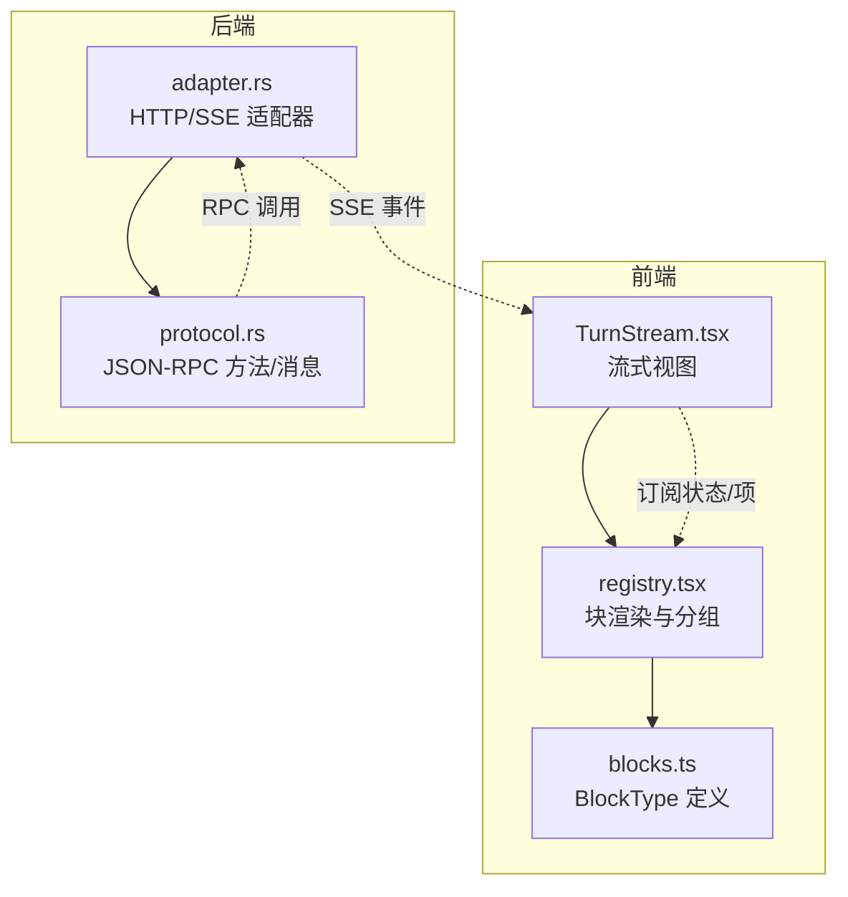
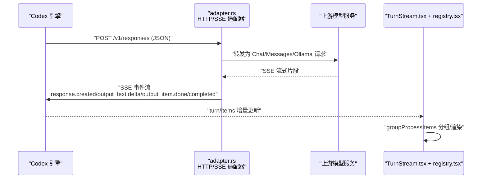
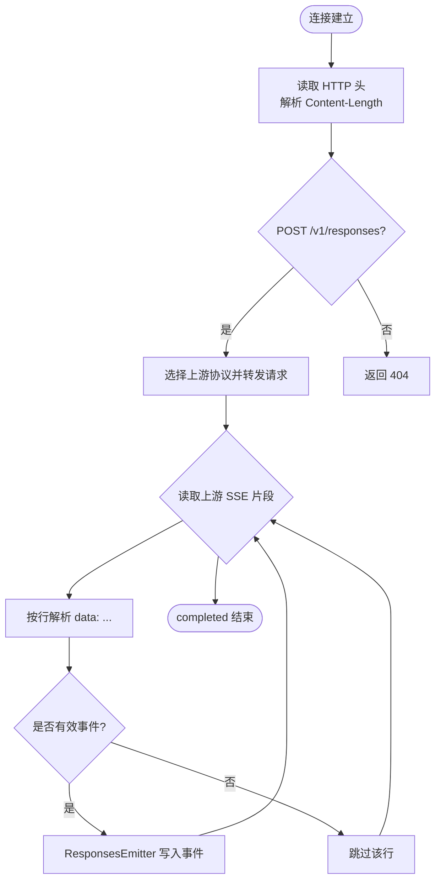
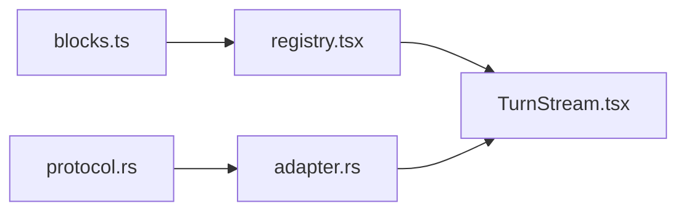
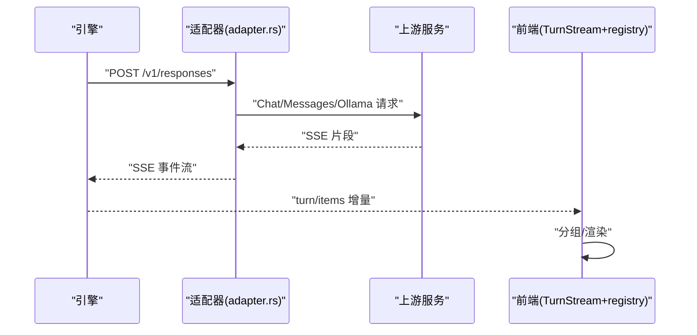
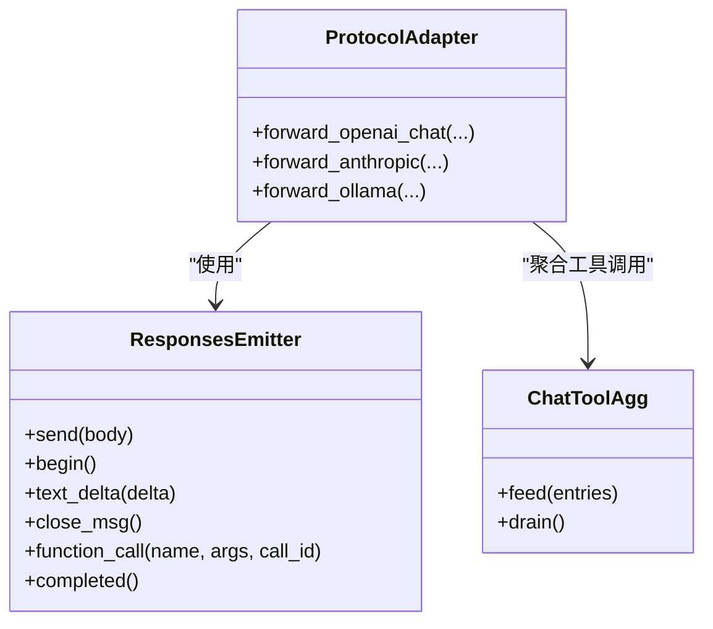

# 数据块传输协议

<cite>
**本文引用的文件**
- [blocks.ts](file://frontend/src/protocol/blocks.ts)
- [TurnStream.tsx](file://frontend/app/views/TurnStream.tsx)
- [registry.tsx](file://frontend/app/blocks/registry.tsx)
- [adapter.rs](file://src-tauri/src/codex/adapter.rs)
- [protocol.rs](file://src-tauri/src/codex/protocol.rs)
</cite>

## 目录
1. [简介](#简介)
2. [项目结构](#项目结构)
3. [核心组件](#核心组件)
4. [架构总览](#架构总览)
5. [详细组件分析](#详细组件分析)
6. [依赖关系分析](#依赖关系分析)
7. [性能考量](#性能考量)
8. [故障排查指南](#故障排查指南)
9. [结论](#结论)
10. [附录](#附录)

## 简介
本文件围绕“数据块传输协议”展开，聚焦于前端协议类型定义、流式渲染与分组聚合、以及后端适配器对多种上游模型协议的适配与响应。文档重点包括：
- 数据块结构与传输格式（基于 blocks.ts 的 BlockType 分类）
- 流式数据传输机制（SSE 事件到前端 TurnStream 的渲染管线）
- 增量更新与大数据量处理（行级滚动、批处理分组、输出行数限制）
- 序列化与错误恢复（JSON-RPC 解析、SSE 缓冲与容错）
- 适配器层对不同数据类型的转换与验证（OpenAI Chat、Anthropic Messages、Ollama）
- 发送与接收数据块的示例流程、数据流图与性能优化建议

## 项目结构
本项目在前后端共同实现“数据块”的端到端传输与展示：
- 前端协议类型与渲染：
  - 协议类型枚举与分类：blocks.ts
  - 流式渲染与生命周期：TurnStream.tsx
  - 块渲染注册表与分组逻辑：registry.tsx
- 后端适配器与协议：
  - 本地 HTTP 适配器与 SSE 发射器：adapter.rs
  - JSON-RPC 方法名与消息解析：protocol.rs

图表来源
- [TurnStream.tsx:1-187](file://frontend/app/views/TurnStream.tsx#L1-L187)
- [registry.tsx:1-824](file://frontend/app/blocks/registry.tsx#L1-L824)
- [blocks.ts:1-87](file://frontend/src/protocol/blocks.ts#L1-L87)
- [adapter.rs:1-1045](file://src-tauri/src/codex/adapter.rs#L1-L1045)
- [protocol.rs:1-207](file://src-tauri/src/codex/protocol.rs#L1-L207)

章节来源
- [TurnStream.tsx:1-187](file://frontend/app/views/TurnStream.tsx#L1-L187)
- [registry.tsx:1-824](file://frontend/app/blocks/registry.tsx#L1-L824)
- [blocks.ts:1-87](file://frontend/src/protocol/blocks.ts#L1-L87)
- [adapter.rs:1-1045](file://src-tauri/src/codex/adapter.rs#L1-L1045)
- [protocol.rs:1-207](file://src-tauri/src/codex/protocol.rs#L1-L207)

## 核心组件
- 数据块类型与分类（blocks.ts）
  - 定义了所有可渲染的数据块类型集合 BLOCK_TYPES，并进一步划分工具类、文本类、计划类等子集，用于前端差异化渲染与行为控制。
- 流式视图与生命周期（TurnStream.tsx）
  - 管理“正在思考/已处理时长/用时”等头部状态；根据 turn 活跃状态与首个助手内容定位锚点；将 items 通过 groupProcessItems 分组后渲染为 Block 或 ProcGroup。
- 块渲染与分组（registry.tsx）
  - 提供不同 block 类型的渲染器映射；实现连续完成工具的分组策略（groupProcessItems），并对 shell、文件操作、差异、计划等进行专门渲染；包含输出行数上限与自动折叠策略。
- 适配器与 SSE 发射器（adapter.rs）
  - 监听本地端口，转发 POST /v1/responses 请求至上游（OpenAI Chat、Anthropic Messages、Ollama），并将上游流式响应转换为规范 Responses SSE 事件流返回给引擎。
  - 使用 ResponsesEmitter 维护 output_index、消息开启/关闭、文本增量与函数调用聚合。
- JSON-RPC 方法与消息解析（protocol.rs）
  - 集中声明 JSON-RPC 方法名常量；提供 parse_server_message 将服务端消息解析为 Response/Notification/Request 三种形态，便于客户端路由与处理。

章节来源
- [blocks.ts:10-87](file://frontend/src/protocol/blocks.ts#L10-L87)
- [TurnStream.tsx:1-187](file://frontend/app/views/TurnStream.tsx#L1-L187)
- [registry.tsx:1-824](file://frontend/app/blocks/registry.tsx#L1-L824)
- [adapter.rs:85-192](file://src-tauri/src/codex/adapter.rs#L85-L192)
- [adapter.rs:604-724](file://src-tauri/src/codex/adapter.rs#L604-L724)
- [protocol.rs:1-207](file://src-tauri/src/codex/protocol.rs#L1-L207)

## 架构总览
整体数据流从后端适配器开始，经 SSE 事件到达前端，再由 TurnStream 与 registry 渲染为 UI。

图表来源
- [adapter.rs:194-343](file://src-tauri/src/codex/adapter.rs#L194-L343)
- [adapter.rs:345-494](file://src-tauri/src/codex/adapter.rs#L345-L494)
- [adapter.rs:496-601](file://src-tauri/src/codex/adapter.rs#L496-L601)
- [TurnStream.tsx:64-166](file://frontend/app/views/TurnStream.tsx#L64-L166)
- [registry.tsx:558-595](file://frontend/app/blocks/registry.tsx#L558-L595)

## 详细组件分析

### 数据块类型与传输格式（blocks.ts）
- 作用：集中定义所有数据块类型及分类，作为前后端一致的契约基础。
- 关键点：
  - BLOCK_TYPES 列举全部块类型，供渲染器与业务逻辑使用。
  - TOOL_BLOCK_TYPES 标识具有生命周期的工具/命令调用块。
  - TEXT_BLOCK_TYPES 标识携带流式文本的块类型。
  - PLAN_BLOCK_TYPES 标识用户可审阅的计划块。
- 复杂度：类型集合为 O(1) 查找（数组/只读数组），无复杂算法。

章节来源
- [blocks.ts:10-87](file://frontend/src/protocol/blocks.ts#L10-L87)

### 流式视图与生命周期（TurnStream.tsx）
- 作用：管理 turn 的生命周期状态机（thinking/live/done），计算已处理时长，定位首条助手内容以固定头部位置，并按组渲染块。
- 关键点：
  - 使用 useLiveElapsed 定时刷新显示“已处理 X 秒”。
  - 通过 groupProcessItems 将 items 转为 StreamNode（item/group）。
  - 根据 turn.active 与 turn.turnStatus 决定头部文案与折叠行为。
  - 最终助手回答标记为 summary，用于突出显示。
- 性能：
  - 仅在当前 turn 活跃时启动定时器，避免无效刷新。
  - 通过分组减少 DOM 节点数量，提升大列表渲染性能。

章节来源
- [TurnStream.tsx:33-166](file://frontend/app/views/TurnStream.tsx#L33-L166)

### 块渲染与分组（registry.tsx）
- 作用：将 TurnItem 按类型渲染为对应 UI，并对连续完成的同类工具进行分组聚合。
- 关键点：
  - classifyTool 将工具名归类为 write/shell/search/read/browser/mcp/other。
  - procStatusClass 将状态映射为样式 token。
  - groupProcessItems 实现“活动/非工具项单独显示，连续完成同类工具合并为一组”的策略。
  - ShellCard 限制最大显示行数（MAX_LINES=400），避免长输出撑爆 DOM。
  - FileOpBlock 解析 diff 统计增删行数，支持复制 diff。
- 性能：
  - 分组显著降低重复渲染开销。
  - 行数限制与懒展开（仅在运行/失败/拒绝时展开）控制内存与重绘成本。

章节来源
- [registry.tsx:49-125](file://frontend/app/blocks/registry.tsx#L49-L125)
- [registry.tsx:171-241](file://frontend/app/blocks/registry.tsx#L171-L241)
- [registry.tsx:243-404](file://frontend/app/blocks/registry.tsx#L243-L404)
- [registry.tsx:406-509](file://frontend/app/blocks/registry.tsx#L406-L509)
- [registry.tsx:515-595](file://frontend/app/blocks/registry.tsx#L515-L595)

### 适配器与 SSE 发射器（adapter.rs）
- 作用：接收 Codex 引擎的请求，适配为上游模型协议，并将上游流式响应转回规范的 Responses SSE 事件流。
- 关键流程：
  - handle_connection：读取 HTTP 头与 body，路由到 forward_responses_request。
  - forward_openai_chat / forward_anthropic / forward_ollama：分别适配不同上游协议，构建请求并发送。
  - ResponsesEmitter：维护 output_index、消息开启/关闭、文本增量与函数调用，生成 response.output_item.added/delta/done 与 completed。
  - ChatToolAgg：聚合 OpenAI Chat 的 delta.tool_calls 为完整 function_call。
- 错误恢复：
  - 上游不可达或非成功状态码时，直接写回错误响应。
  - SSE 缓冲按行解析，跳过非法行或解析失败片段，保证鲁棒性。
- 性能：
  - 使用 keep-alive 与 text/event-stream 保持长连接。
  - 逐行解析与增量拼接，避免整段缓冲。

图表来源
- [adapter.rs:113-192](file://src-tauri/src/codex/adapter.rs#L113-L192)
- [adapter.rs:194-343](file://src-tauri/src/codex/adapter.rs#L194-L343)
- [adapter.rs:345-494](file://src-tauri/src/codex/adapter.rs#L345-L494)
- [adapter.rs:496-601](file://src-tauri/src/codex/adapter.rs#L496-L601)
- [adapter.rs:604-724](file://src-tauri/src/codex/adapter.rs#L604-L724)

章节来源
- [adapter.rs:85-192](file://src-tauri/src/codex/adapter.rs#L85-L192)
- [adapter.rs:194-343](file://src-tauri/src/codex/adapter.rs#L194-L343)
- [adapter.rs:345-494](file://src-tauri/src/codex/adapter.rs#L345-L494)
- [adapter.rs:496-601](file://src-tauri/src/codex/adapter.rs#L496-L601)
- [adapter.rs:604-724](file://src-tauri/src/codex/adapter.rs#L604-L724)

### JSON-RPC 方法与消息解析（protocol.rs）
- 作用：集中声明 JSON-RPC 方法名常量，并提供解析函数将服务端消息识别为 Response/Notification/Request。
- 关键点：
  - 方法名覆盖线程、回合、配置、MCP、插件、命令执行、文件系统、项目等模块。
  - parse_server_message 依据字段 presence 区分消息类型，兼容 id 为字符串或整数。
  - rpc_id_key 统一 id 键值，便于待处理映射。
- 适用场景：客户端需要处理服务端发起的审批、用户输入、MCP 获取等请求。

章节来源
- [protocol.rs:1-207](file://src-tauri/src/codex/protocol.rs#L1-L207)

## 依赖关系分析
- 前端依赖：
  - TurnStream.tsx 依赖 registry.tsx 的 groupProcessItems 与 Block 渲染器。
  - registry.tsx 依赖 blocks.ts 的 BlockType 定义。
- 后端依赖：
  - adapter.rs 依赖 protocol.rs 的方法名与消息解析（在更上层通过 RPC 交互）。
  - adapter.rs 内部依赖 reqwest、tokio 进行网络 I/O 与异步流处理。
- 耦合与内聚：
  - 前后端通过 SSE 事件与 JSON-RPC 解耦；adapter.rs 屏蔽上游协议差异，提高内聚性。
  - 分组与渲染逻辑集中在 registry.tsx，便于维护与扩展。

图表来源
- [blocks.ts:10-87](file://frontend/src/protocol/blocks.ts#L10-L87)
- [registry.tsx:1-824](file://frontend/app/blocks/registry.tsx#L1-L824)
- [TurnStream.tsx:1-187](file://frontend/app/views/TurnStream.tsx#L1-L187)
- [protocol.rs:1-207](file://src-tauri/src/codex/protocol.rs#L1-L207)
- [adapter.rs:1-1045](file://src-tauri/src/codex/adapter.rs#L1-L1045)

章节来源
- [blocks.ts:10-87](file://frontend/src/protocol/blocks.ts#L10-L87)
- [registry.tsx:1-824](file://frontend/app/blocks/registry.tsx#L1-L824)
- [TurnStream.tsx:1-187](file://frontend/app/views/TurnStream.tsx#L1-L187)
- [protocol.rs:1-207](file://src-tauri/src/codex/protocol.rs#L1-L207)
- [adapter.rs:1-1045](file://src-tauri/src/codex/adapter.rs#L1-L1045)

## 性能考量
- 流式渲染：
  - 使用 text/event-stream 与 keep-alive 维持低延迟传输。
  - 按行解析 SSE，避免整段缓冲，降低内存占用。
- 大数据量处理：
  - ShellCard 限制最大显示行数（400），隐藏早期行并提示数量，防止 DOM 膨胀。
  - groupProcessItems 将连续完成工具合并为组，减少渲染节点。
- 增量更新：
  - TurnStream 仅在 turn 活跃时启动定时器，避免无效刷新。
  - 分组与折叠策略减少重排与重绘。
- 适配器层优化：
  - 上游错误快速返回，避免长时间挂起。
  - 工具调用聚合（ChatToolAgg）减少多次 emit 开销。

[本节为通用性能指导，不直接分析具体文件]

## 故障排查指南
- 适配器连接错误：
  - 监听错误或连接异常会记录日志并短暂休眠重试，检查端口占用与防火墙设置。
- 上游错误：
  - 非成功状态码会直接写回错误响应，检查上游 base_url、鉴权与超时配置。
- SSE 解析失败：
  - 按行解析遇到非法行或 JSON 解析失败会跳过，检查上游事件格式是否符合预期。
- 前端渲染异常：
  - 确认 BlockType 是否在 BLOCK_RENDERERS 中映射；检查 groupProcessItems 分组逻辑是否符合预期。
  - 若出现卡顿，检查 ShellCard 行数限制与分组是否生效。

章节来源
- [adapter.rs:85-192](file://src-tauri/src/codex/adapter.rs#L85-L192)
- [adapter.rs:194-343](file://src-tauri/src/codex/adapter.rs#L194-L343)
- [adapter.rs:345-494](file://src-tauri/src/codex/adapter.rs#L345-L494)
- [adapter.rs:496-601](file://src-tauri/src/codex/adapter.rs#L496-L601)
- [registry.tsx:515-595](file://frontend/app/blocks/registry.tsx#L515-L595)

## 结论
该数据块传输协议通过前后端协作实现了高效、可扩展的流式数据传输与渲染：
- 前端以类型化块为基础，结合分组与行数限制，保障大流量下的流畅体验。
- 后端适配器屏蔽上游协议差异，统一输出规范 SSE 事件，确保引擎侧一致性。
- JSON-RPC 方法集中管理与解析，简化跨模块通信。
建议在后续迭代中继续优化 SSE 缓冲策略、增强错误上报与监控，并扩展更多上游协议适配。

[本节为总结性内容，不直接分析具体文件]

## 附录

### 发送与接收数据块示例流程
- 发送请求：
  - 引擎向适配器发送 POST /v1/responses（JSON 体包含 model、input、tools 等）。
- 适配器转发：
  - 根据 route.protocol 选择上游协议（openai_chat/anthropic/ollama），构造请求并发送。
- 流式响应：
  - 上游返回 SSE 片段，适配器解析并转换为 Responses SSE 事件（created/output_text.delta/output_item.done/completed）。
- 前端渲染：
  - TurnStream 接收增量更新，调用 groupProcessItems 分组，渲染为 Block 或 ProcGroup。

图表来源
- [adapter.rs:194-343](file://src-tauri/src/codex/adapter.rs#L194-L343)
- [adapter.rs:345-494](file://src-tauri/src/codex/adapter.rs#L345-L494)
- [adapter.rs:496-601](file://src-tauri/src/codex/adapter.rs#L496-L601)
- [TurnStream.tsx:64-166](file://frontend/app/views/TurnStream.tsx#L64-L166)
- [registry.tsx:558-595](file://frontend/app/blocks/registry.tsx#L558-L595)

### 数据流图（代码级）

图表来源
- [adapter.rs:604-724](file://src-tauri/src/codex/adapter.rs#L604-L724)
- [adapter.rs:726-769](file://src-tauri/src/codex/adapter.rs#L726-L769)
- [adapter.rs:194-343](file://src-tauri/src/codex/adapter.rs#L194-L343)
- [adapter.rs:345-494](file://src-tauri/src/codex/adapter.rs#L345-L494)
- [adapter.rs:496-601](file://src-tauri/src/codex/adapter.rs#L496-L601)