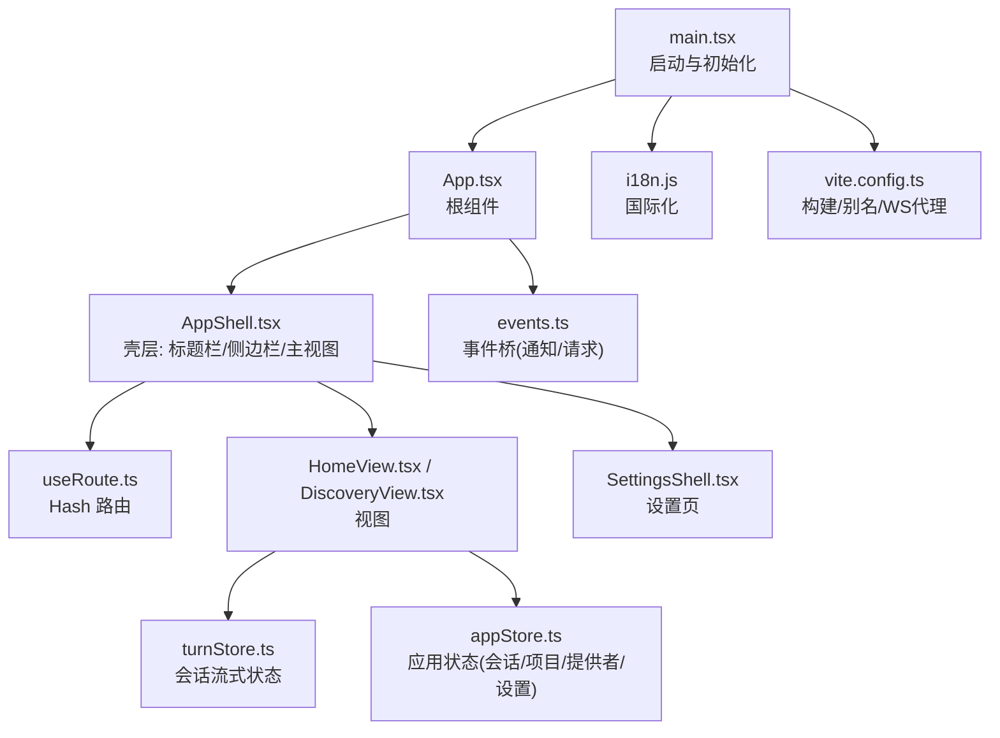
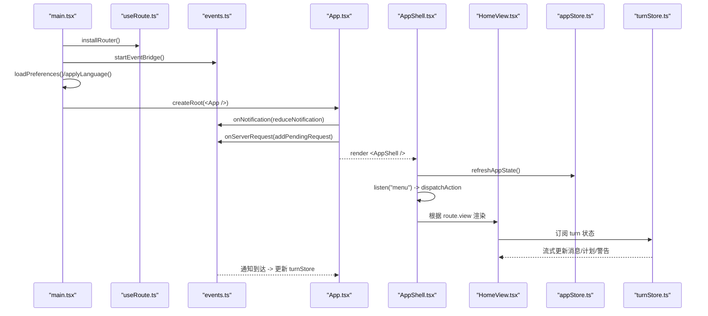
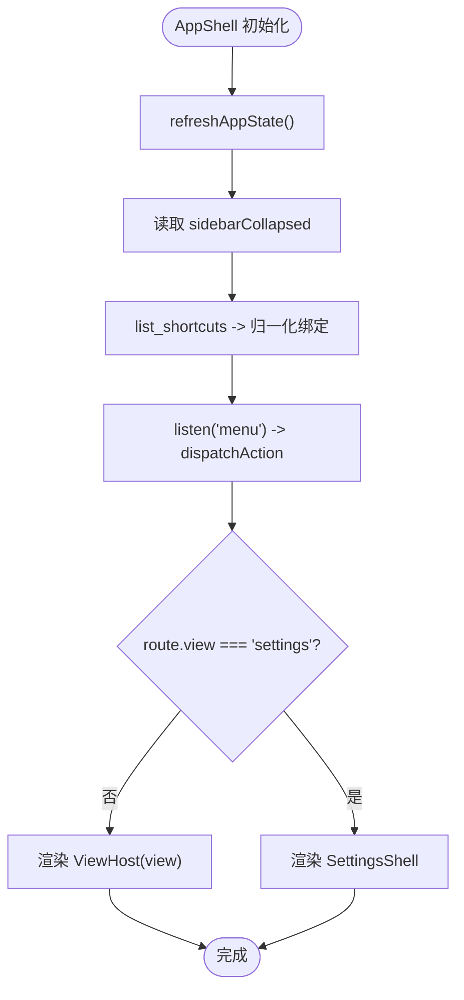
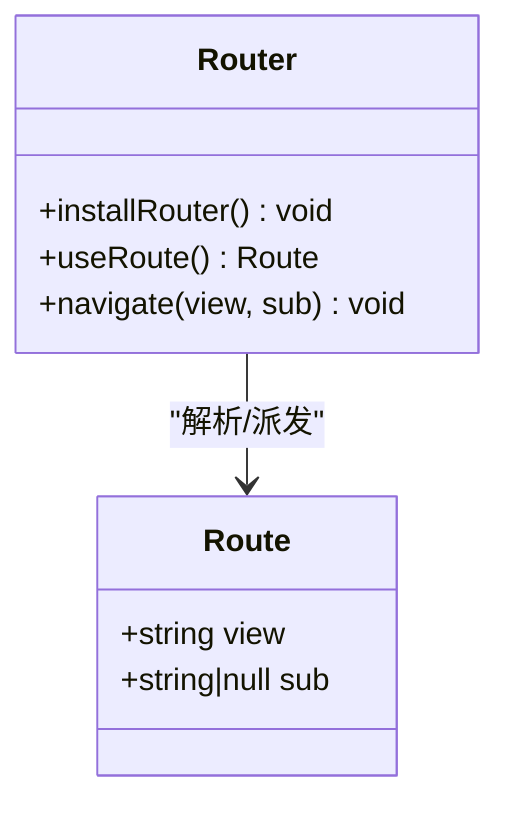
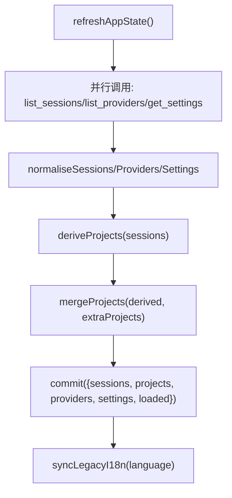
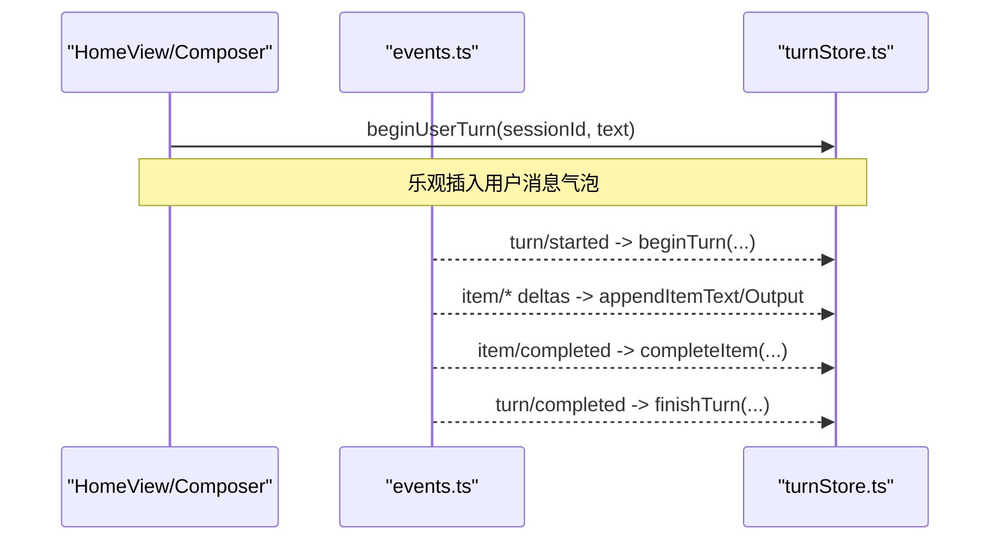
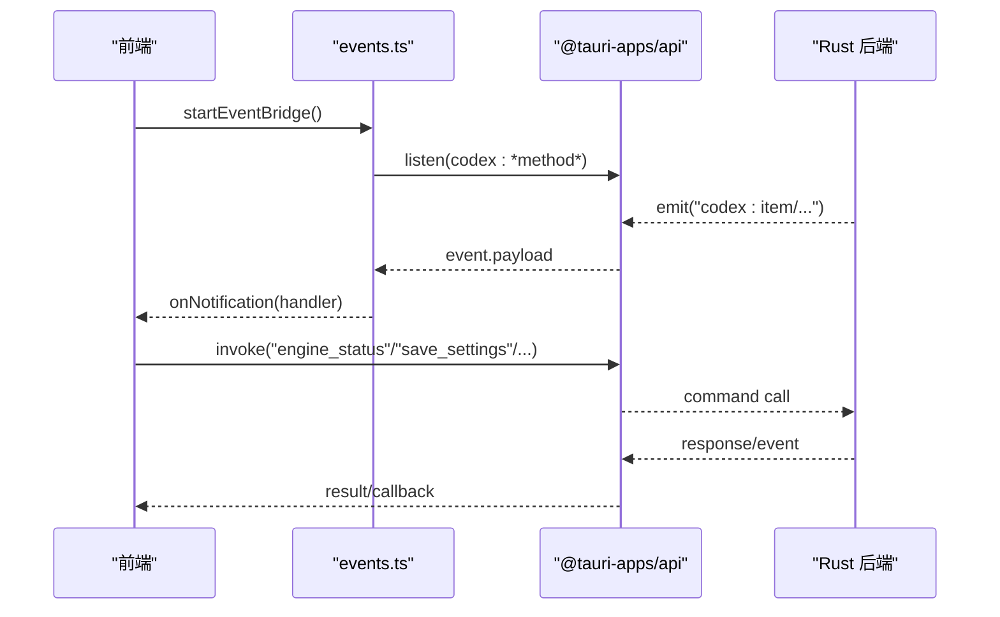
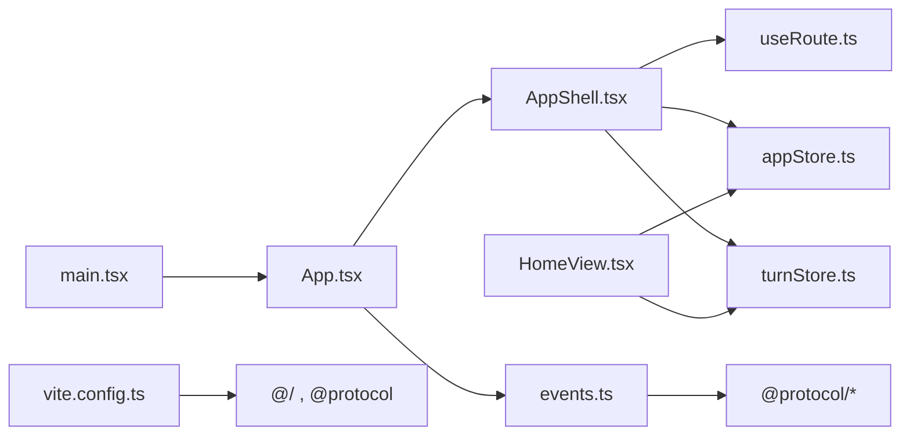

# 前端架构

<cite>
**本文引用的文件**
- [frontend/app/main.tsx](file://frontend/app/main.tsx)
- [frontend/app/App.tsx](file://frontend/app/App.tsx)
- [frontend/app/shell/AppShell.tsx](file://frontend/app/shell/AppShell.tsx)
- [frontend/app/shell/useRoute.ts](file://frontend/app/shell/useRoute.ts)
- [frontend/app/bridge/events.ts](file://frontend/app/bridge/events.ts)
- [frontend/app/state/appStore.ts](file://frontend/app/state/appStore.ts)
- [frontend/app/state/turnStore.ts](file://frontend/app/state/turnStore.ts)
- [frontend/app/views/HomeView.tsx](file://frontend/app/views/HomeView.tsx)
- [frontend/app/views/Composer.tsx](file://frontend/app/views/Composer.tsx)
- [frontend/src/js/i18n.js](file://frontend/src/js/i18n.js)
- [frontend/vite.config.ts](file://frontend/vite.config.ts)
- [frontend/package.json](file://frontend/package.json)
- [frontend/src/styles/tokens.css](file://frontend/src/styles/tokens.css)
</cite>

## 目录
1. [简介](#简介)
2. [项目结构](#项目结构)
3. [核心组件](#核心组件)
4. [架构总览](#架构总览)
5. [详细组件分析](#详细组件分析)
6. [依赖关系分析](#依赖关系分析)
7. [性能考量](#性能考量)
8. [故障排查指南](#故障排查指南)
9. [结论](#结论)
10. [附录](#附录)

## 简介
本文件为 Codex-Tauri 的前端架构文档，聚焦 React + TypeScript 前端在 Tauri 壳层中的整体设计。内容涵盖：
- 组件层次与职责划分（AppShell、视图、状态、桥接）
- 状态管理方案（应用级 store、会话流式 turn store、偏好与主题）
- 路由与导航机制（Hash 路由、菜单与快捷键驱动）
- 前后端通信机制（Tauri 事件桥、命令调用、WebSocket 代理）
- Vite 构建配置、模块组织与开发工作流
- 响应式设计、国际化与主题系统
- 架构图表展示组件依赖与数据流向

## 项目结构
前端位于 frontend 目录，采用“按功能域组织”的目录结构：
- app：React 应用入口、壳层、视图、状态、桥接、样式
- src：静态资源与旧版 vanilla 模块（CSS、字体、协议类型、国际化字典等）
- vite.config.ts：Vite 构建与开发模式配置
- package.json：脚本与依赖

图表来源
- [frontend/app/main.tsx:1-87](file://frontend/app/main.tsx#L1-L87)
- [frontend/app/App.tsx:1-47](file://frontend/app/App.tsx#L1-L47)
- [frontend/app/shell/AppShell.tsx:1-205](file://frontend/app/shell/AppShell.tsx#L1-L205)
- [frontend/app/shell/useRoute.ts:1-79](file://frontend/app/shell/useRoute.ts#L1-L79)
- [frontend/app/bridge/events.ts:1-172](file://frontend/app/bridge/events.ts#L1-L172)
- [frontend/app/state/appStore.ts:1-526](file://frontend/app/state/appStore.ts#L1-L526)
- [frontend/app/state/turnStore.ts:1-451](file://frontend/app/state/turnStore.ts#L1-L451)
- [frontend/app/views/HomeView.tsx:1-207](file://frontend/app/views/HomeView.tsx#L1-L207)
- [frontend/src/js/i18n.js:1-800](file://frontend/src/js/i18n.js#L1-L800)
- [frontend/vite.config.ts:1-104](file://frontend/vite.config.ts#L1-L104)

章节来源
- [frontend/app/main.tsx:1-87](file://frontend/app/main.tsx#L1-L87)
- [frontend/vite.config.ts:1-104](file://frontend/vite.config.ts#L1-L104)
- [frontend/package.json:1-31](file://frontend/package.json#L1-L31)

## 核心组件
- 入口与初始化
  - main.tsx：安装路由、启动事件桥、加载偏好与语言、挂载 React 根节点、控制启动屏显隐
  - App.tsx：订阅后端通知与服务器请求，将状态写入 turnStore 与 pending requests
- 壳层与导航
  - AppShell.tsx：标题栏、侧边栏、主视图容器；监听原生菜单事件；维护快捷键绑定；切换设置视图
  - useRoute.ts：基于 Hash 的路由实现，提供 useRoute/useSyncExternalStore 读取与 navigate 跳转
- 状态管理
  - appStore.ts：应用级状态（会话、项目、提供者、设置），通过 useSyncExternalStore 暴露给组件
  - turnStore.ts：会话流式状态（消息项、计划、警告、使用量），由通知驱动更新
- 视图
  - HomeView.tsx：对话首页，组合空态引导、TurnStream 与 Composer
  - Composer.tsx：输入框、发送/停止、权限/模型/项目选择面板
- 前后端通信
  - events.ts：统一事件桥，订阅所有通知方法与两类服务器请求通道
- 国际化与主题
  - i18n.js：多语言字典与切换逻辑
  - tokens.css：设计令牌（间距、字号、圆角、颜色、阴影、动画等）

章节来源
- [frontend/app/App.tsx:1-47](file://frontend/app/App.tsx#L1-L47)
- [frontend/app/shell/AppShell.tsx:1-205](file://frontend/app/shell/AppShell.tsx#L1-L205)
- [frontend/app/shell/useRoute.ts:1-79](file://frontend/app/shell/useRoute.ts#L1-L79)
- [frontend/app/state/appStore.ts:1-526](file://frontend/app/state/appStore.ts#L1-L526)
- [frontend/app/state/turnStore.ts:1-451](file://frontend/app/state/turnStore.ts#L1-L451)
- [frontend/app/views/HomeView.tsx:1-207](file://frontend/app/views/HomeView.tsx#L1-L207)
- [frontend/app/views/Composer.tsx:1-200](file://frontend/app/views/Composer.tsx#L1-L200)
- [frontend/app/bridge/events.ts:1-172](file://frontend/app/bridge/events.ts#L1-L172)
- [frontend/src/js/i18n.js:1-800](file://frontend/src/js/i18n.js#L1-L800)
- [frontend/src/styles/tokens.css:1-200](file://frontend/src/styles/tokens.css#L1-L200)

## 架构总览
下图展示了从启动到渲染、再到事件驱动的完整流程，以及各模块之间的依赖关系。

图表来源
- [frontend/app/main.tsx:1-87](file://frontend/app/main.tsx#L1-L87)
- [frontend/app/shell/useRoute.ts:1-79](file://frontend/app/shell/useRoute.ts#L1-L79)
- [frontend/app/bridge/events.ts:1-172](file://frontend/app/bridge/events.ts#L1-L172)
- [frontend/app/App.tsx:1-47](file://frontend/app/App.tsx#L1-L47)
- [frontend/app/shell/AppShell.tsx:1-205](file://frontend/app/shell/AppShell.tsx#L1-L205)
- [frontend/app/views/HomeView.tsx:1-207](file://frontend/app/views/HomeView.tsx#L1-L207)
- [frontend/app/state/appStore.ts:1-526](file://frontend/app/state/appStore.ts#L1-L526)
- [frontend/app/state/turnStore.ts:1-451](file://frontend/app/state/turnStore.ts#L1-L451)

## 详细组件分析

### AppShell 壳层组件
- 职责
  - 组织标题栏、侧边栏与主视图容器
  - 同步 body 类名以复用现有 CSS 布局规则（如 settings-open、sidebar-collapsed）
  - 监听 Rust 菜单事件并分发到 action 处理器
  - 维护快捷键绑定（优先后端列表，回退到菜单树）
  - 根据路由决定渲染主视图或设置页
- 关键交互
  - 启动时刷新应用状态、恢复侧边栏折叠状态
  - 通过 invoke 获取/保存设置
  - 通过 useShortcutDispatcher 将快捷键映射到动作

图表来源
- [frontend/app/shell/AppShell.tsx:1-205](file://frontend/app/shell/AppShell.tsx#L1-L205)

章节来源
- [frontend/app/shell/AppShell.tsx:1-205](file://frontend/app/shell/AppShell.tsx#L1-L205)

### 路由与导航
- 基于 Hash 的路由，兼容旧版 URL 形态
- 通过 useSyncExternalStore 暴露当前路由快照，避免 Provider 依赖
- 自动同步 body 类名以复用样式（如 settings-open）
- 提供 navigate(view, sub?) 进行跳转

图表来源
- [frontend/app/shell/useRoute.ts:1-79](file://frontend/app/shell/useRoute.ts#L1-L79)

章节来源
- [frontend/app/shell/useRoute.ts:1-79](file://frontend/app/shell/useRoute.ts#L1-L79)

### 状态管理：应用级 Store（appStore）
- 单一外部存储，通过 useSyncExternalStore 暴露给 React
- 数据来源：后端 list_sessions、list_providers、get_settings
- 派生数据：projects 由 sessions.cwd 推导
- 操作：setActiveSession、openProjectPicker、saveSettings、refreshAppState 等
- 持久化：save_settings 与 engine config/batchWrite 双写

图表来源
- [frontend/app/state/appStore.ts:1-526](file://frontend/app/state/appStore.ts#L1-L526)

章节来源
- [frontend/app/state/appStore.ts:1-526](file://frontend/app/state/appStore.ts#L1-L526)

### 状态管理：会话流式 Store（turnStore）
- 唯一真实来源：由后端通知驱动，不本地模拟进度
- 支持乐观用户气泡（beginUserTurn），失败可丢弃
- 支持历史加载（loadThreadFromSession）：优先 thread.messages，回退 timeline
- 支持流式追加文本/输出、MCP 进度、完成标记、阶段切换、错误与警告

图表来源
- [frontend/app/state/turnStore.ts:1-451](file://frontend/app/state/turnStore.ts#L1-L451)
- [frontend/app/bridge/events.ts:1-172](file://frontend/app/bridge/events.ts#L1-L172)

章节来源
- [frontend/app/state/turnStore.ts:1-451](file://frontend/app/state/turnStore.ts#L1-L451)

### 前后端通信机制
- 事件桥（events.ts）
  - 动态订阅所有 NOTIFICATION_METHODS 与两类服务器请求通道
  - 将原始 payload 包装为统一信封，分发给已注册处理器
  - 对未知方法或异常进行安全降级（日志记录，不中断）
- 命令调用
  - 通过 @tauri-apps/api/core.invoke 调用 Rust 命令（如 get_settings、save_settings、engine_status 等）
- 浏览器开发模式
  - Vite 插件将 /appserver 路径代理到 CODEX_APP_SERVER_WS 指向的后端 WebSocket，绕过 Origin 限制

图表来源
- [frontend/app/bridge/events.ts:1-172](file://frontend/app/bridge/events.ts#L1-L172)
- [frontend/app/App.tsx:1-47](file://frontend/app/App.tsx#L1-L47)
- [frontend/app/state/appStore.ts:1-526](file://frontend/app/state/appStore.ts#L1-L526)

章节来源
- [frontend/app/bridge/events.ts:1-172](file://frontend/app/bridge/events.ts#L1-L172)
- [frontend/app/App.tsx:1-47](file://frontend/app/App.tsx#L1-L47)
- [frontend/app/state/appStore.ts:1-526](file://frontend/app/state/appStore.ts#L1-L526)

### 视图组件组织
- HomeView：组合空态引导、TurnStream、Composer；负责会话创建回调、引擎状态探测
- Composer：输入、发送/停止、权限/模型/项目选择；与 appStore/turnStore 协作
- 设置页：通过 AppShell 条件渲染 SettingsShell，与主视图并列以避免被隐藏

章节来源
- [frontend/app/views/HomeView.tsx:1-207](file://frontend/app/views/HomeView.tsx#L1-L207)
- [frontend/app/views/Composer.tsx:1-200](file://frontend/app/views/Composer.tsx#L1-L200)
- [frontend/app/shell/AppShell.tsx:1-205](file://frontend/app/shell/AppShell.tsx#L1-L205)

### 国际化与主题系统
- 国际化
  - i18n.js：集中定义多语言字典与 LOCALES；提供 t() 与 applyLanguage/detectSystemLanguage
  - useI18n Hook：通过订阅语言修订号触发重渲染，确保常驻组件（如 TitleBar）也能响应语言切换
- 主题
  - tokens.css：定义设计令牌（字体、字号、行高、圆角、间距、颜色、阴影、动画等）
  - 通过 CSS 变量与 body 类名（如 settings-open、sidebar-collapsed）控制布局与主题表现

章节来源
- [frontend/src/js/i18n.js:1-800](file://frontend/src/js/i18n.js#L1-L800)
- [frontend/app/shell/useI18n.ts:1-15](file://frontend/app/shell/useI18n.ts#L1-L15)
- [frontend/src/styles/tokens.css:1-200](file://frontend/src/styles/tokens.css#L1-L200)

## 依赖关系分析
- 模块耦合
  - AppShell 依赖 useRoute、appStore、turnStore、事件桥、菜单与快捷键
  - HomeView 依赖 appStore、turnStore、Composer、TurnStream
  - 事件桥依赖协议枚举（notifications/requests/status），保证新增方法无需手动接线
- 外部依赖
  - @tauri-apps/api：invoke 与 listen
  - Vite：React 插件、别名、构建产物命名
  - ws：浏览器开发模式的 WebSocket 代理

图表来源
- [frontend/app/main.tsx:1-87](file://frontend/app/main.tsx#L1-L87)
- [frontend/app/App.tsx:1-47](file://frontend/app/App.tsx#L1-L47)
- [frontend/app/shell/AppShell.tsx:1-205](file://frontend/app/shell/AppShell.tsx#L1-L205)
- [frontend/app/shell/useRoute.ts:1-79](file://frontend/app/shell/useRoute.ts#L1-L79)
- [frontend/app/state/appStore.ts:1-526](file://frontend/app/state/appStore.ts#L1-L526)
- [frontend/app/state/turnStore.ts:1-451](file://frontend/app/state/turnStore.ts#L1-L451)
- [frontend/app/bridge/events.ts:1-172](file://frontend/app/bridge/events.ts#L1-L172)
- [frontend/vite.config.ts:1-104](file://frontend/vite.config.ts#L1-L104)

章节来源
- [frontend/vite.config.ts:1-104](file://frontend/vite.config.ts#L1-L104)
- [frontend/package.json:1-31](file://frontend/package.json#L1-L31)

## 性能考量
- 首屏体验
  - 最小启动屏时长与移除逻辑，避免快速开发环境下的闪烁
- 渲染优化
  - 使用 useSyncExternalStore 减少不必要的重渲染
  - 事件桥对每个通知处理器包裹 try/catch，避免单点故障影响整体
- 网络与 I/O
  - 并行拉取 sessions/providers/settings，缩短冷启动时间
  - 设置保存采用“尽力而为”策略，UI 不阻塞等待后端
- 构建产物
  - 现代目标 es2022，开启 sourcemap，稳定文件名便于缓存

[本节为通用指导，不直接分析具体文件]

## 故障排查指南
- 事件桥未生效
  - 检查 startEventBridge 是否被调用；确认 NOTIFICATION_METHODS 已包含目标方法
  - 查看控制台日志中 failed to listen on ... 的错误信息
- 路由异常
  - 确认 installRouter 已在首次渲染前调用；检查 window.location.hash 变化
- 状态不同步
  - 检查 appStore.refreshAppState 是否成功；留意 error 字段
  - 检查 turnStore 的 beginTurn/finishTurn 是否成对出现
- 国际化未更新
  - 确认 useI18n Hook 已用于需要响应语言变化的组件
- 构建问题
  - 浏览器模式下确认 /appserver 代理可用；检查 CODEX_APP_SERVER_WS 环境变量

章节来源
- [frontend/app/bridge/events.ts:1-172](file://frontend/app/bridge/events.ts#L1-L172)
- [frontend/app/shell/useRoute.ts:1-79](file://frontend/app/shell/useRoute.ts#L1-L79)
- [frontend/app/state/appStore.ts:1-526](file://frontend/app/state/appStore.ts#L1-L526)
- [frontend/app/state/turnStore.ts:1-451](file://frontend/app/state/turnStore.ts#L1-L451)
- [frontend/app/shell/useI18n.ts:1-15](file://frontend/app/shell/useI18n.ts#L1-L15)
- [frontend/vite.config.ts:1-104](file://frontend/vite.config.ts#L1-L104)

## 结论
Codex-Tauri 前端采用清晰的分层与职责划分：入口负责初始化与全局装配，壳层负责布局与导航，视图负责业务呈现，状态管理通过外部 store 与流式 turn store 解耦 UI 与数据源，事件桥统一接入后端通知与请求。配合 Vite 的别名与开发代理，实现了高效的开发与构建流程。主题与国际化通过 CSS 变量与集中字典管理，保证了视觉一致性与多语言支持。该架构具备良好的可扩展性与可维护性，适合持续迭代与功能扩展。

[本节为总结性内容，不直接分析具体文件]

## 附录
- 开发工作流
  - 开发：vite dev（端口 1420）
  - 浏览器模式：vite --mode browser（启用 WS 代理）
  - 构建：tsc --noEmit && vite build（输出至 dist）
- 关键脚本
  - dev/build/typecheck/preview/dev:browser

章节来源
- [frontend/package.json:1-31](file://frontend/package.json#L1-L31)
- [frontend/vite.config.ts:1-104](file://frontend/vite.config.ts#L1-L104)