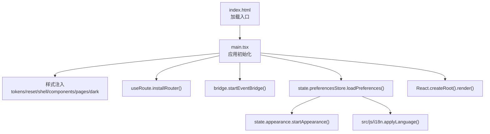
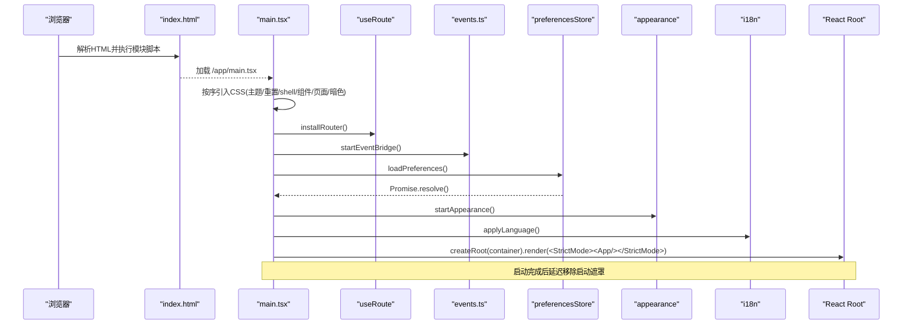
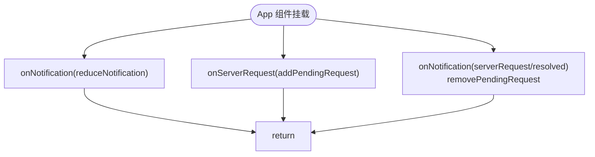
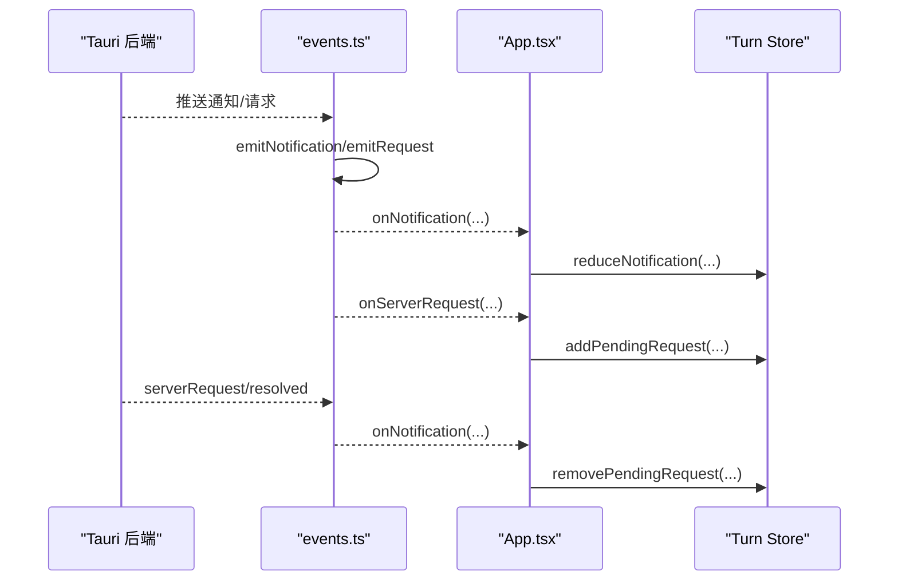
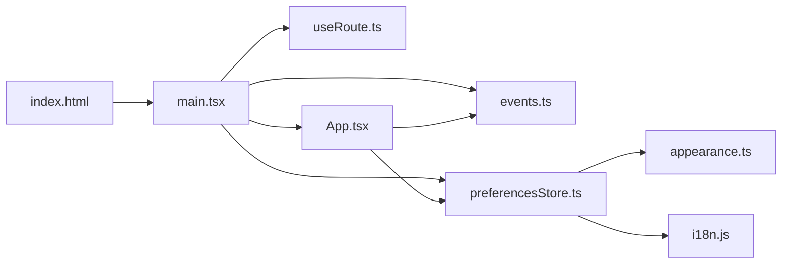

# 应用入口与初始化

<cite>
**本文引用的文件**
- [frontend/index.html](file://frontend/index.html)
- [frontend/app/main.tsx](file://frontend/app/main.tsx)
- [frontend/app/App.tsx](file://frontend/app/App.tsx)
- [frontend/app/bridge/events.ts](file://frontend/app/bridge/events.ts)
- [frontend/app/shell/useRoute.ts](file://frontend/app/shell/useRoute.ts)
- [frontend/app/state/preferencesStore.ts](file://frontend/app/state/preferencesStore.ts)
- [frontend/app/state/appearance.ts](file://frontend/app/state/appearance.ts)
- [frontend/src/js/i18n.js](file://frontend/src/js/i18n.js)
- [frontend/src/js/state.js](file://frontend/src/js/state.js)
- [frontend/vite.config.ts](file://frontend/vite.config.ts)
</cite>

## 目录
1. [简介](#简介)
2. [项目结构](#项目结构)
3. [核心组件](#核心组件)
4. [架构总览](#架构总览)
5. [详细组件分析](#详细组件分析)
6. [依赖关系分析](#依赖关系分析)
7. [性能考虑](#性能考虑)
8. [故障排查指南](#故障排查指南)
9. [结论](#结论)

## 简介
本文聚焦 Codex-Tauri 前端应用的启动入口与初始化流程，系统说明 main.tsx 中的样式加载顺序、路由安装、事件桥接初始化、偏好设置加载与国际化配置；解释 App 根组件的职责与 StrictMode 的使用；梳理启动时的资源加载策略、错误处理机制与性能优化措施。文末提供启动时序图与依赖关系图，帮助读者理解各模块的执行顺序与数据流向。

## 项目结构
前端采用 Vite + React 构建，入口为 index.html，通过模块脚本加载 frontend/app/main.tsx。main.tsx 负责：
- 按固定顺序引入全局样式（主题 token、重置、shell、组件、页面等）
- 安装基于 hash 的路由
- 启动 Tauri 事件桥接，确保首屏前不丢失通知
- 异步加载偏好设置并应用外观与语言
- 挂载 React 根节点并使用 StrictMode 包裹 App

图表来源
- [frontend/index.html:147-160](file://frontend/index.html#L147-L160)
- [frontend/app/main.tsx:4-31](file://frontend/app/main.tsx#L4-L31)
- [frontend/app/main.tsx:38-60](file://frontend/app/main.tsx#L38-L60)

章节来源
- [frontend/index.html:147-160](file://frontend/index.html#L147-L160)
- [frontend/app/main.tsx:4-60](file://frontend/app/main.tsx#L4-L60)

## 核心组件
- 入口与引导：main.tsx
- 根组件：App.tsx（订阅通知与服务端请求，渲染 AppShell）
- 路由：useRoute.ts（hash 路由，同步到 body class）
- 事件桥：events.ts（Tauri 事件监听分发）
- 偏好设置：preferencesStore.ts（读取/合并默认值，持久化）
- 外观：appearance.ts（主题、字体、字号、数据集等）
- 国际化：i18n.js（多语言包与切换）
- 构建配置：vite.config.ts（别名、代理、产物命名）

章节来源
- [frontend/app/main.tsx:1-60](file://frontend/app/main.tsx#L1-L60)
- [frontend/app/App.tsx:1-47](file://frontend/app/App.tsx#L1-L47)
- [frontend/app/shell/useRoute.ts:1-79](file://frontend/app/shell/useRoute.ts#L1-L79)
- [frontend/app/bridge/events.ts:1-172](file://frontend/app/bridge/events.ts#L1-L172)
- [frontend/app/state/preferencesStore.ts:1-94](file://frontend/app/state/preferencesStore.ts#L1-L94)
- [frontend/app/state/appearance.ts:1-177](file://frontend/app/state/appearance.ts#L1-L177)
- [frontend/src/js/i18n.js:1-12](file://frontend/src/js/i18n.js#L1-L12)
- [frontend/vite.config.ts:59-103](file://frontend/vite.config.ts#L59-L103)

## 架构总览
下图展示从浏览器加载到 React 可交互的完整链路，包括样式、路由、事件、偏好、国际化与根组件挂载的顺序与依赖。

图表来源
- [frontend/index.html:147-160](file://frontend/index.html#L147-L160)
- [frontend/app/main.tsx:4-60](file://frontend/app/main.tsx#L4-L60)
- [frontend/app/shell/useRoute.ts:68-79](file://frontend/app/shell/useRoute.ts#L68-L79)
- [frontend/app/bridge/events.ts:145-159](file://frontend/app/bridge/events.ts#L145-L159)
- [frontend/app/state/preferencesStore.ts:59-68](file://frontend/app/state/preferencesStore.ts#L59-L68)
- [frontend/app/state/appearance.ts:152-177](file://frontend/app/state/appearance.ts#L152-L177)
- [frontend/src/js/i18n.js:1-12](file://frontend/src/js/i18n.js#L1-L12)

## 详细组件分析

### 入口 main.tsx：启动流程与职责
- 样式加载顺序
  - 先引入全局主题与基础样式（tokens、official-tokens、reset），再引入 shell、components、controls、home、discovery、settings、settings-pages、dark，最后引入 React 层新增的 approvals、modal、turn、settings-general 样式。该顺序保证主题变量优先于覆盖样式生效。
- 路由安装
  - 在首次渲染前调用 installRouter()，确保初始路由已知，并将当前视图映射到 body 的 class（如 settings-open）。
- 事件桥接初始化
  - 调用 startEventBridge() 建立所有通知与两类服务端请求通道，避免首屏丢失消息。
- 偏好设置与外观
  - 异步加载 preferences，成功后立即启动 appearance 以应用主题、字体、字号、数据集等。
- 国际化配置
  - 从 general 偏好中读取 language，若为空则检测系统语言；将语言写入 legacy state 并调用 applyLanguage() 完成切换。
- 根节点挂载与 StrictMode
  - 使用 createRoot 挂载 <StrictMode><App/></StrictMode>，便于在开发期捕获潜在问题。
- 启动遮罩与容错
  - 根据 performance.timeOrigin 计算已耗时，确保最小显示时长后隐藏 splash，并清理失败保护定时器。

章节来源
- [frontend/app/main.tsx:4-31](file://frontend/app/main.tsx#L4-L31)
- [frontend/app/main.tsx:38-60](file://frontend/app/main.tsx#L38-L60)
- [frontend/app/main.tsx:62-87](file://frontend/app/main.tsx#L62-L87)

### App 根组件：职责边界与数据流
- 订阅通知：将 onNotification 接入 reduceNotification，驱动 turn store 更新。
- 订阅服务端请求：对 serverRequest 加入 pending 队列，并在 resolved 时移除。
- 渲染：仅返回 AppShell，保持根组件职责单一。

图表来源
- [frontend/app/App.tsx:15-46](file://frontend/app/App.tsx#L15-L46)

章节来源
- [frontend/app/App.tsx:1-47](file://frontend/app/App.tsx#L1-L47)

### 路由 useRoute：Hash 路由与 Body 类名同步
- 解析 hash 为 view/subview，暴露 useSyncExternalStore 供任意组件读取。
- installRouter 监听 hashchange，并将当前视图同步到 body.classList（例如 settings 视图添加 settings-open），以便复用原有样式布局规则。
- navigate 统一修改 hash，避免重复赋值。

章节来源
- [frontend/app/shell/useRoute.ts:1-79](file://frontend/app/shell/useRoute.ts#L1-L79)

### 事件桥 events：Tauri 事件总线
- 事件命名：将协议方法名中的点/斜杠替换为短横线，适配 Tauri 限制。
- 订阅：onNotification/onServerRequest 维护处理器集合，支持安全卸载。
- 绑定：startEventBridge 并行绑定所有通知方法与两类服务端请求通道，失败仅记录日志不影响其他通道。
- 派发：emitNotification/emitRequest 遍历处理器并捕获异常，保证单条消息处理失败不影响后续。

图表来源
- [frontend/app/bridge/events.ts:23-30](file://frontend/app/bridge/events.ts#L23-L30)
- [frontend/app/bridge/events.ts:57-87](file://frontend/app/bridge/events.ts#L57-L87)
- [frontend/app/bridge/events.ts:145-159](file://frontend/app/bridge/events.ts#L145-L159)
- [frontend/app/App.tsx:15-46](file://frontend/app/App.tsx#L15-L46)

章节来源
- [frontend/app/bridge/events.ts:1-172](file://frontend/app/bridge/events.ts#L1-L172)
- [frontend/app/App.tsx:15-46](file://frontend/app/App.tsx#L15-L46)

### 偏好设置 preferencesStore：加载、合并与持久化
- 默认值：来自 src/js/state.js 的 defaultPreferences，确保新旧层一致。
- 加载：loadPreferences 调用 invoke("get_preferences")，合并默认值后提交状态；失败降级为默认值。
- 读写：saveSection 先本地提交再持久化，保证 UI 即时响应。
- 订阅：usePreferences/usePrefSection 基于 useSyncExternalStore 提供稳定快照。

章节来源
- [frontend/app/state/preferencesStore.ts:1-94](file://frontend/app/state/preferencesStore.ts#L1-L94)
- [frontend/src/js/state.js:60-136](file://frontend/src/js/state.js#L60-L136)

### 外观 appearance：主题、字体、字号与数据集
- 主题：根据 preference 设置 html 的 theme-dark/theme-light 或跟随系统。
- 字号：仅在用户自定义时重写 tokens 的 type scale，避免与 CSS 变量冲突。
- 字体与数据集：动态设置 --font-sans/--font-mono 及 sidebarStyle/contrast/reduceMotion/pointerCursors/diffMarkers 等 data-* 属性。
- 联动：startAppearance 订阅偏好变化，自动重应用；同时监听系统主题变化。

章节来源
- [frontend/app/state/appearance.ts:1-177](file://frontend/app/state/appearance.ts#L1-L177)

### 国际化 i18n：语言检测与应用
- 支持语言：en、zh-CN、zh-TW、ja、ko。
- 启动时优先使用 general.language，否则检测系统语言，写入 legacy state 并调用 applyLanguage。
- 多语言文本集中管理，缺失键回退至英文。

章节来源
- [frontend/src/js/i18n.js:1-12](file://frontend/src/js/i18n.js#L1-L12)
- [frontend/app/main.tsx:47-54](file://frontend/app/main.tsx#L47-L54)
- [frontend/src/js/state.js:33-58](file://frontend/src/js/state.js#L33-L58)

### 构建与开发配置 vite.config.ts
- 别名：@ 指向 app，@protocol 指向 protocol，browser 模式下将 @tauri-apps/api 别名到 devbridge。
- 代理：开发模式提供 /appserver WebSocket 代理，绕过 Origin 限制连接引擎。
- 构建：输出到 dist，启用 sourcemap，目标 es2022，产物文件名带哈希。

章节来源
- [frontend/vite.config.ts:19-103](file://frontend/vite.config.ts#L19-L103)

## 依赖关系分析
下图展示入口与各模块之间的依赖与调用方向。

图表来源
- [frontend/index.html:147-160](file://frontend/index.html#L147-L160)
- [frontend/app/main.tsx:4-60](file://frontend/app/main.tsx#L4-L60)
- [frontend/app/App.tsx:15-46](file://frontend/app/App.tsx#L15-L46)

章节来源
- [frontend/app/main.tsx:4-60](file://frontend/app/main.tsx#L4-L60)
- [frontend/app/App.tsx:15-46](file://frontend/app/App.tsx#L15-L46)

## 性能考虑
- 样式预加载：在入口顶部集中引入 CSS，减少运行时样式抖动，保证首屏视觉稳定。
- 路由与事件前置：在 render 之前安装路由与事件桥，避免首帧丢失导航与通知。
- 最小启动遮罩：基于 performance.timeOrigin 计算已耗时，确保至少展示一次完整的 shimmer 动画，提升感知性能。
- 并行初始化：事件通道与请求通道并行绑定，缩短启动时间。
- 构建优化：开启 sourcemap、现代目标 es2022、产物带哈希缓存，利于生产环境加载与调试。

[本节为通用性能建议，不直接分析具体代码行]

## 故障排查指南
- 启动失败兜底
  - index.html 内嵌非模块脚本提供启动失败保护：超时自动隐藏 splash 并显示错误信息；监听全局 error 事件收集错误原因。
- 事件通道绑定失败
  - events.ts 对单个通道监听失败仅记录日志，不影响其他通道；可通过控制台查看 [events] 相关日志定位。
- 偏好加载失败
  - preferencesStore 在 invoke 失败时降级为默认值并打印警告，不会导致白屏。
- 路由未生效
  - 确认 installRouter 已在 render 前调用；检查 window.location.hash 格式是否符合 view/subview。
- 外观未应用
  - 确认 preferencesStore 已加载成功且 appearance 已启动；检查 html 的 theme 类与 data-* 属性是否正确设置。

章节来源
- [frontend/index.html:15-62](file://frontend/index.html#L15-L62)
- [frontend/app/bridge/events.ts:145-159](file://frontend/app/bridge/events.ts#L145-L159)
- [frontend/app/state/preferencesStore.ts:59-68](file://frontend/app/state/preferencesStore.ts#L59-L68)
- [frontend/app/shell/useRoute.ts:68-79](file://frontend/app/shell/useRoute.ts#L68-L79)
- [frontend/app/state/appearance.ts:152-177](file://frontend/app/state/appearance.ts#L152-L177)

## 结论
Codex-Tauri 的前端启动流程以 main.tsx 为核心，遵循“样式先行、路由与事件前置、偏好与国际化异步准备、React 挂载”的顺序，确保首屏可用性与一致性。App 组件保持职责单一，专注于事件到状态的映射。配合 index.html 的启动兜底与 vite 的构建优化，整体启动体验稳定可靠。