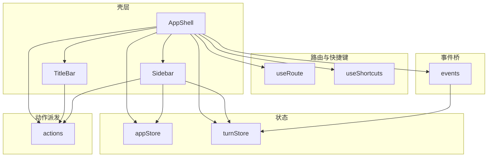
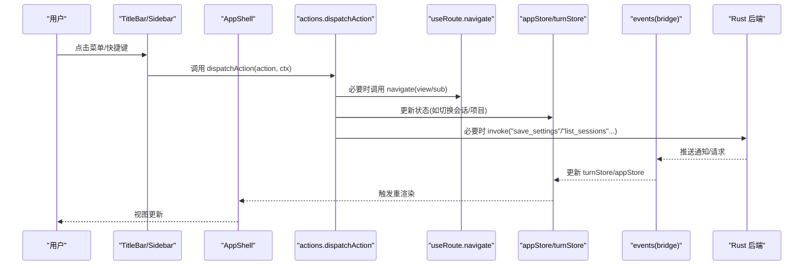
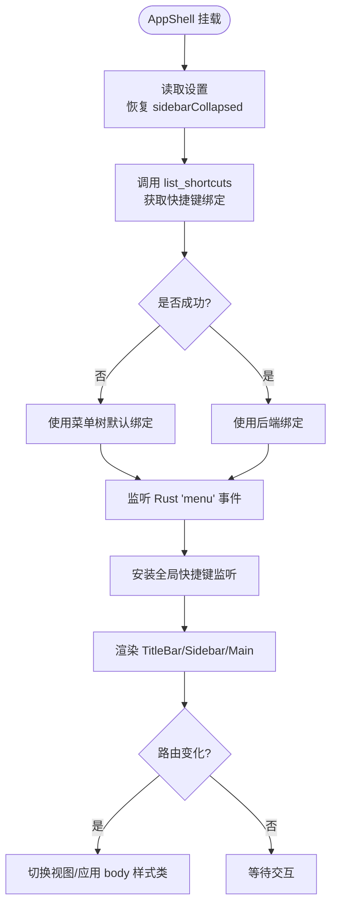
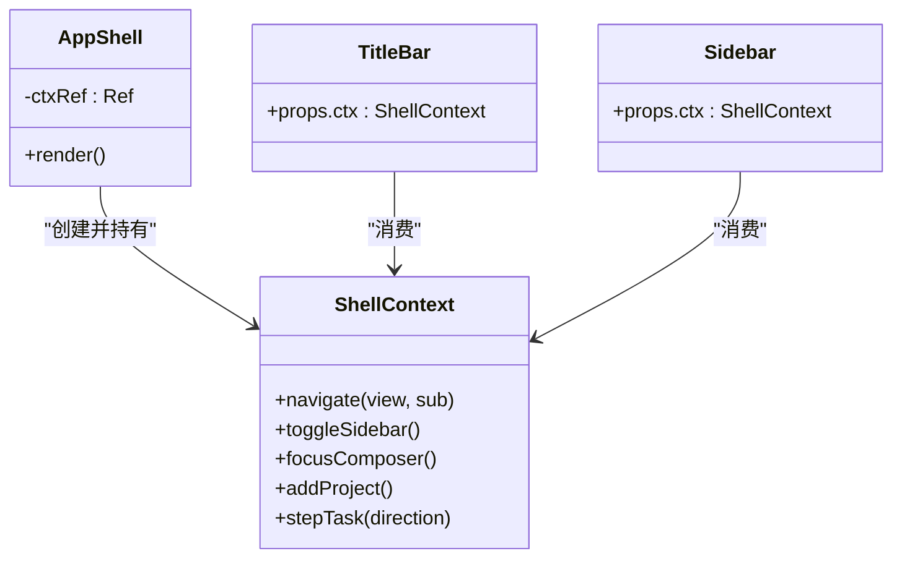
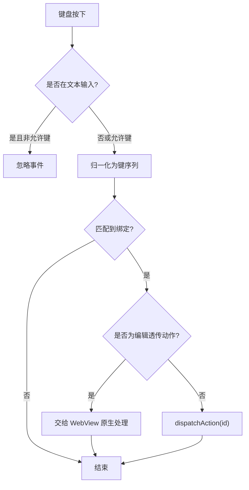
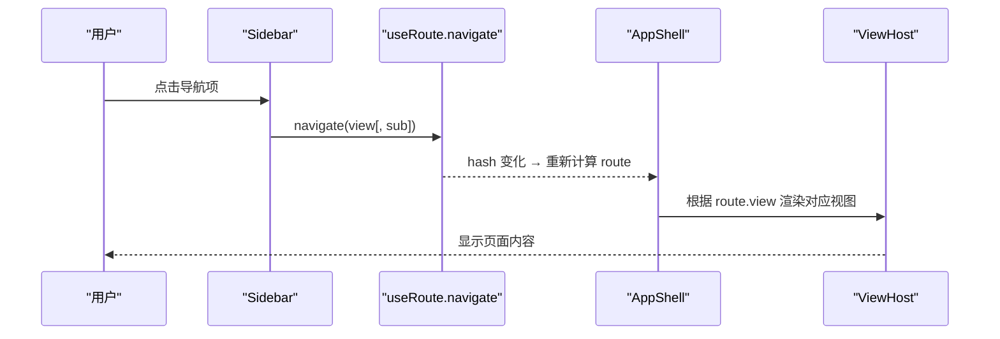
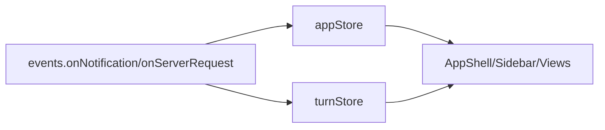
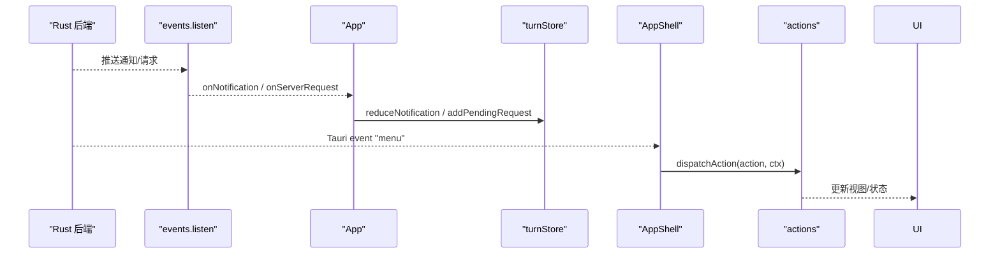
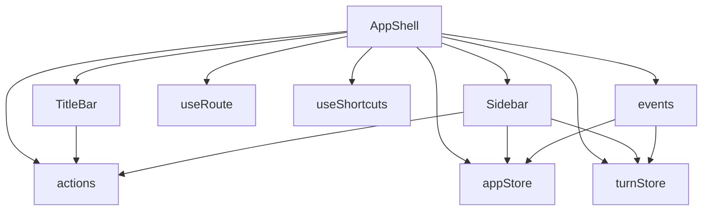

# AppShell 主组件

<cite>
**本文引用的文件**
- [AppShell.tsx](file://frontend/app/shell/AppShell.tsx)
- [actions.ts](file://frontend/app/shell/actions.ts)
- [useRoute.ts](file://frontend/app/shell/useRoute.ts)
- [useShortcuts.ts](file://frontend/app/shell/useShortcuts.ts)
- [TitleBar.tsx](file://frontend/app/shell/TitleBar.tsx)
- [Sidebar.tsx](file://frontend/app/shell/Sidebar.tsx)
- [menuTree.ts](file://frontend/app/shell/menuTree.ts)
- [appStore.ts](file://frontend/app/state/appStore.ts)
- [turnStore.ts](file://frontend/app/state/turnStore.ts)
- [events.ts](file://frontend/app/bridge/events.ts)
- [App.tsx](file://frontend/app/App.tsx)
</cite>

## 目录
1. [简介](#简介)
2. [项目结构](#项目结构)
3. [核心组件](#核心组件)
4. [架构总览](#架构总览)
5. [详细组件分析](#详细组件分析)
6. [依赖关系分析](#依赖关系分析)
7. [性能考量](#性能考量)
8. [故障排查指南](#故障排查指南)
9. [结论](#结论)

## 简介
本文件为 AppShell 主组件的权威技术文档，聚焦其作为应用壳层的职责：整体布局管理、生命周期协调、状态管理与事件分发。重点说明：
- 侧边栏状态的初始化与持久化
- 快捷键绑定的加载与冲突处理
- 路由切换与视图渲染策略
- ShellContext 的设计模式与作用域管理
- 来自 Rust 后端的事件监听与动作派发
- 用户交互端到端数据流（从输入到视图更新）

## 项目结构
AppShell 位于前端 React 应用的 shell 层，负责顶层容器、菜单、侧边栏与主内容区的编排，并通过 Tauri IPC 与 Rust 后端通信。关键文件组织如下：
- 壳层组件：AppShell、TitleBar、Sidebar
- 路由与快捷键：useRoute、useShortcuts
- 动作派发：actions（统一入口）
- 状态存储：appStore（全局应用状态）、turnStore（会话/回合状态）
- 事件桥接：events（Tauri 事件通道）
- 根装配：App（订阅通知与服务器请求）

图表来源
- [AppShell.tsx:1-205](file://frontend/app/shell/AppShell.tsx#L1-L205)
- [TitleBar.tsx:1-164](file://frontend/app/shell/TitleBar.tsx#L1-L164)
- [Sidebar.tsx:1-351](file://frontend/app/shell/Sidebar.tsx#L1-L351)
- [useRoute.ts:1-79](file://frontend/app/shell/useRoute.ts#L1-L79)
- [useShortcuts.ts:1-146](file://frontend/app/shell/useShortcuts.ts#L1-L146)
- [actions.ts:1-201](file://frontend/app/shell/actions.ts#L1-L201)
- [appStore.ts:1-519](file://frontend/app/state/appStore.ts#L1-L519)
- [turnStore.ts:1-200](file://frontend/app/state/turnStore.ts#L1-L200)
- [events.ts:1-172](file://frontend/app/bridge/events.ts#L1-L172)

章节来源
- [AppShell.tsx:1-205](file://frontend/app/shell/AppShell.tsx#L1-L205)
- [App.tsx:1-47](file://frontend/app/App.tsx#L1-L47)

## 核心组件
- AppShell：应用壳层容器，负责标题栏、侧边栏、主视图区渲染；初始化侧边栏折叠状态、加载快捷键绑定、监听 Rust 菜单事件、安装全局快捷键；根据路由选择视图并注入 ShellContext。
- TitleBar：无装饰标题栏，渲染 File/Edit/View/Help 菜单与窗口控制按钮，所有菜单项通过 MENU_TREE 驱动，点击后统一调用 dispatchAction。
- Sidebar：导航、项目列表、最近会话、模型与思考等级调节、待决权限提示等；与 appStore/turnStore 交互，支持删除会话、切换项目与会话。
- actions：集中式动作派发器，将字符串 action 映射到具体行为（导航、窗口控制、剪贴板、缩放、任务切换等）。
- useRoute：基于 URL hash 的路由，提供 navigate 与 useRoute hook，并在 body 上同步样式类以兼容旧样式。
- useShortcuts：全局快捷键监听与匹配，支持修饰键顺序、文本输入时过滤、编辑操作透传、冲突检测。
- appStore：全局应用状态（会话、项目、提供者、设置、引擎状态），提供刷新、保存设置、打开项目选择器等能力。
- turnStore：当前会话/回合的状态，受服务端通知驱动，提供开始/结束回合、追加消息、工具输出等。
- events：Tauri 事件桥，统一订阅 NOTIFICATION_METHODS 与特定 server request 通道，转发给上层 store。

章节来源
- [AppShell.tsx:1-205](file://frontend/app/shell/AppShell.tsx#L1-L205)
- [TitleBar.tsx:1-164](file://frontend/app/shell/TitleBar.tsx#L1-L164)
- [Sidebar.tsx:1-351](file://frontend/app/shell/Sidebar.tsx#L1-L351)
- [actions.ts:1-201](file://frontend/app/shell/actions.ts#L1-L201)
- [useRoute.ts:1-79](file://frontend/app/shell/useRoute.ts#L1-L79)
- [useShortcuts.ts:1-146](file://frontend/app/shell/useShortcuts.ts#L1-L146)
- [appStore.ts:1-519](file://frontend/app/state/appStore.ts#L1-L519)
- [turnStore.ts:1-200](file://frontend/app/state/turnStore.ts#L1-L200)
- [events.ts:1-172](file://frontend/app/bridge/events.ts#L1-L172)

## 架构总览
AppShell 作为壳层，组合了 UI 子组件与状态/事件基础设施，形成“事件→动作→状态→视图”的单向数据流。Rust 后端通过 Tauri 事件与命令向前端推送消息或触发操作，前端通过 invoke 调用后端能力（如设置、会话、对话框等）。

图表来源
- [TitleBar.tsx:48-51](file://frontend/app/shell/TitleBar.tsx#L48-L51)
- [actions.ts:56-200](file://frontend/app/shell/actions.ts#L56-L200)
- [useRoute.ts:48-54](file://frontend/app/shell/useRoute.ts#L48-L54)
- [appStore.ts:378-408](file://frontend/app/state/appStore.ts#L378-L408)
- [events.ts:145-159](file://frontend/app/bridge/events.ts#L145-L159)

## 详细组件分析

### AppShell：壳层容器与生命周期协调
- 职责
  - 初始化侧边栏折叠状态：启动时读取设置，若 sidebarCollapsed 为真则折叠。
  - 加载快捷键绑定：优先使用后端 list_shortcuts 返回的用户可编辑绑定；失败时回退到菜单树中的默认绑定。
  - 监听 Rust 菜单事件：通过 Tauri listen("menu") 接收来自 Rust 菜单 on_menu_event 的动作字符串，交由 dispatchAction 处理。
  - 安装全局快捷键：useShortcutDispatcher 注册 document keydown 监听，匹配 bindings 并调用 dispatchAction。
  - 路由与视图：根据 route.view 渲染 HomeView/DiscoveryView/SettingsShell，并将 settings 视图作为 .main 的同级节点，以便样式正确隐藏侧边栏与主区域。
  - 注入 ShellContext：提供 navigate、toggleSidebar、focusComposer、addProject、stepTask 等方法供其他组件与动作系统使用。
- 关键点
  - 侧边栏折叠通过 document.body.classList.toggle("sidebar-collapsed") 与样式联动，避免在 aside 上加类导致兼容性问题。
  - 快捷键解析支持字符串与数组两种格式，并对修饰键进行归一化。
  - 菜单事件与快捷键最终都走同一派发路径，保证行为一致。

图表来源
- [AppShell.tsx:84-117](file://frontend/app/shell/AppShell.tsx#L84-L117)
- [AppShell.tsx:163-186](file://frontend/app/shell/AppShell.tsx#L163-L186)
- [useRoute.ts:63-78](file://frontend/app/shell/useRoute.ts#L63-L78)

章节来源
- [AppShell.tsx:78-205](file://frontend/app/shell/AppShell.tsx#L78-L205)

### ShellContext：设计模式与作用域
- 设计模式
  - 通过 useMemo 创建稳定的上下文对象，包含导航、侧边栏切换、焦点管理、项目添加、任务切换等能力。
  - 使用 useRef 持有最新 ctx 引用，确保事件回调能访问到最新的上下文（避免闭包过期）。
- 作用域
  - 仅 AppShell 内部创建与持有，通过 props 传递给 TitleBar/Sidebar，或通过 actions 间接使用。
  - 不暴露全局变量，降低耦合度，便于测试与替换实现。

图表来源
- [actions.ts:18-28](file://frontend/app/shell/actions.ts#L18-L28)
- [AppShell.tsx:132-161](file://frontend/app/shell/AppShell.tsx#L132-L161)
- [TitleBar.tsx:15-19](file://frontend/app/shell/TitleBar.tsx#L15-L19)
- [Sidebar.tsx:84-96](file://frontend/app/shell/Sidebar.tsx#L84-L96)

章节来源
- [actions.ts:18-28](file://frontend/app/shell/actions.ts#L18-L28)
- [AppShell.tsx:132-161](file://frontend/app/shell/AppShell.tsx#L132-L161)

### 快捷键系统：绑定、匹配与冲突
- 绑定来源
  - 优先使用后端 list_shortcuts 返回的可编辑绑定；失败时回退到菜单树中定义的默认绑定。
  - 支持 keys 为字符串（如 "Ctrl+N"）或字符串数组，自动解析为标准化键序列。
- 匹配规则
  - 修饰键顺序固定为 Ctrl、Shift、Alt、Meta，确保显示与匹配一致。
  - 文本输入时忽略非允许键（Escape/Enter/Tab），避免打断用户输入。
  - 编辑相关动作（undo/cut/copy/paste/delete/select-all）直接透传给 WebView 原生处理，避免吞掉粘贴等操作。
- 冲突检测
  - 提供 findConflicts 工具函数，用于发现重复键绑定，辅助设置页展示与修复。

图表来源
- [useShortcuts.ts:24-45](file://frontend/app/shell/useShortcuts.ts#L24-L45)
- [useShortcuts.ts:47-68](file://frontend/app/shell/useShortcuts.ts#L47-L68)
- [useShortcuts.ts:92-132](file://frontend/app/shell/useShortcuts.ts#L92-L132)
- [AppShell.tsx:42-76](file://frontend/app/shell/AppShell.tsx#L42-L76)

章节来源
- [useShortcuts.ts:1-146](file://frontend/app/shell/useShortcuts.ts#L1-L146)
- [AppShell.tsx:42-76](file://frontend/app/shell/AppShell.tsx#L42-L76)

### 路由与视图渲染
- 路由实现
  - 基于 URL hash（#view 或 #view/sub），提供 navigate 与 useRoute hook。
  - 安装 router 时监听 hashchange，并在 body 上切换样式类（如 settings-open），以兼容旧样式。
- 视图选择
  - AppShell 根据 route.view 决定渲染 HomeView、DiscoveryView 或 SettingsShell。
  - Settings 视图作为 main 的同级节点，配合样式隐藏侧边栏与主区域，保持全屏设置界面。

图表来源
- [useRoute.ts:48-78](file://frontend/app/shell/useRoute.ts#L48-L78)
- [AppShell.tsx:188-201](file://frontend/app/shell/AppShell.tsx#L188-L201)
- [Sidebar.tsx:171-192](file://frontend/app/shell/Sidebar.tsx#L171-L192)

章节来源
- [useRoute.ts:1-79](file://frontend/app/shell/useRoute.ts#L1-L79)
- [AppShell.tsx:188-201](file://frontend/app/shell/AppShell.tsx#L188-L201)
- [Sidebar.tsx:171-192](file://frontend/app/shell/Sidebar.tsx#L171-L192)

### 状态管理：appStore 与 turnStore
- appStore
  - 维护 sessions、projects、providers、settings、engineStatus 等全局状态。
  - 提供 refreshAppState 并行拉取会话、提供者与设置，并派生项目列表；saveSettings 同时写入 shell 设置与引擎配置。
  - 支持打开项目选择器、新增项目、切换活跃项目与会话。
- turnStore
  - 维护当前会话/回合状态，受服务端通知驱动；提供 beginTurn、upsertItem、appendItemText/Output 等方法。
  - 支持乐观用户气泡与回滚机制，保证发送失败时的用户体验。
- 事件桥
  - events 统一订阅 NOTIFICATION_METHODS 与特定 server request 通道，将通知与请求分发给各 store。

图表来源
- [events.ts:57-159](file://frontend/app/bridge/events.ts#L57-L159)
- [appStore.ts:378-408](file://frontend/app/state/appStore.ts#L378-L408)
- [turnStore.ts:71-107](file://frontend/app/state/turnStore.ts#L71-L107)

章节来源
- [appStore.ts:1-519](file://frontend/app/state/appStore.ts#L1-L519)
- [turnStore.ts:1-200](file://frontend/app/state/turnStore.ts#L1-L200)
- [events.ts:1-172](file://frontend/app/bridge/events.ts#L1-L172)

### 来自 Rust 后端的事件监听
- 菜单事件
  - AppShell 监听 "menu" 事件，收到动作字符串后调用 dispatchAction，从而执行导航、窗口控制、剪贴板等操作。
- 通知与请求
  - App 在根组件中订阅 onNotification 与 onServerRequest，分别用于更新 turnStore 与处理审批/用户输入等请求。
- IPC 调用
  - 通过 invoke 调用后端命令（如 get_settings、list_shortcuts、list_sessions、save_settings、rpc_raw 等），完成状态读写与配置下发。

图表来源
- [App.tsx:15-45](file://frontend/app/App.tsx#L15-L45)
- [events.ts:145-159](file://frontend/app/bridge/events.ts#L145-L159)
- [AppShell.tsx:163-177](file://frontend/app/shell/AppShell.tsx#L163-L177)
- [actions.ts:56-200](file://frontend/app/shell/actions.ts#L56-L200)

章节来源
- [App.tsx:15-45](file://frontend/app/App.tsx#L15-L45)
- [AppShell.tsx:163-177](file://frontend/app/shell/AppShell.tsx#L163-L177)
- [events.ts:145-159](file://frontend/app/bridge/events.ts#L145-L159)

## 依赖关系分析
- 组件耦合
  - AppShell 依赖 TitleBar、Sidebar、useRoute、useShortcuts、actions、appStore、turnStore、events。
  - TitleBar 与 Sidebar 通过 ShellContext 解耦于 AppShell 的具体实现。
  - actions 依赖 appStore 与 turnStore 的能力，但不直接持有状态，保持纯函数特性。
- 外部依赖
  - Tauri API：invoke、listen 用于 IPC 与事件监听。
  - 协议层：NOTIFICATION_METHODS、SERVER_REQUEST_METHODS 由生成代码提供，确保前后端契约一致。
- 潜在循环依赖
  - 通过 context 与事件桥解耦，避免组件间直接相互引用导致的循环依赖。

图表来源
- [AppShell.tsx:11-24](file://frontend/app/shell/AppShell.tsx#L11-L24)
- [TitleBar.tsx:9-13](file://frontend/app/shell/TitleBar.tsx#L9-L13)
- [Sidebar.tsx:7-27](file://frontend/app/shell/Sidebar.tsx#L7-L27)
- [actions.ts:14-17](file://frontend/app/shell/actions.ts#L14-L17)
- [events.ts:13-21](file://frontend/app/bridge/events.ts#L13-L21)

章节来源
- [AppShell.tsx:11-24](file://frontend/app/shell/AppShell.tsx#L11-L24)
- [TitleBar.tsx:9-13](file://frontend/app/shell/TitleBar.tsx#L9-L13)
- [Sidebar.tsx:7-27](file://frontend/app/shell/Sidebar.tsx#L7-L27)
- [actions.ts:14-17](file://frontend/app/shell/actions.ts#L14-L17)
- [events.ts:13-21](file://frontend/app/bridge/events.ts#L13-L21)

## 性能考量
- 并行数据加载：refreshAppState 使用 Promise.all 并行拉取会话、提供者与设置，减少首屏等待时间。
- 最小化重渲染：useSyncExternalStore 与快照模式避免不必要的 Provider 重渲染；useMemo 稳定上下文引用。
- 快捷键高效匹配：normalizeKey 与 sameKeys 比较键序列，避免复杂正则；文本输入时快速过滤，减少无效匹配。
- 事件桥健壮性：每个通道绑定失败仅记录日志，不影响其他通道；通知处理器异常被捕获，防止中断后续处理。

[本节为通用性能建议，无需特定文件引用]

## 故障排查指南
- 快捷键无效
  - 检查 list_shortcuts 是否返回有效绑定；确认 normalizeKey 与 sameKeys 逻辑是否正确匹配。
  - 确认是否在文本输入场景下触发了编辑透传动作（如 Ctrl+V）。
  - 参考路径：[useShortcuts.ts:92-132](file://frontend/app/shell/useShortcuts.ts#L92-L132)、[AppShell.tsx:100-110](file://frontend/app/shell/AppShell.tsx#L100-L110)
- 侧边栏状态未持久化
  - 检查 get_settings 与 save_settings 调用是否成功；确认 sidebarCollapsed 字段是否正确写入。
  - 参考路径：[AppShell.tsx:89-98](file://frontend/app/shell/AppShell.tsx#L89-L98)、[AppShell.tsx:119-130](file://frontend/app/shell/AppShell.tsx#L119-L130)
- 路由切换异常
  - 确认 installRouter 已调用；检查 body 样式类是否正确切换（如 settings-open）。
  - 参考路径：[useRoute.ts:63-78](file://frontend/app/shell/useRoute.ts#L63-L78)
- 后端事件未生效
  - 检查 startEventBridge 是否已启动；确认 NOTIFICATION_METHODS 与 SERVER_REQUEST_METHODS 是否覆盖所需方法。
  - 参考路径：[events.ts:145-159](file://frontend/app/bridge/events.ts#L145-L159)、[App.tsx:15-45](file://frontend/app/App.tsx#L15-L45)
- 设置保存失败
  - 检查 saveSettings 对 shell 设置与引擎配置的两次写入是否均成功；关注 rpc_raw 调用结果。
  - 参考路径：[appStore.ts:446-511](file://frontend/app/state/appStore.ts#L446-L511)

章节来源
- [useShortcuts.ts:92-132](file://frontend/app/shell/useShortcuts.ts#L92-L132)
- [AppShell.tsx:89-130](file://frontend/app/shell/AppShell.tsx#L89-L130)
- [useRoute.ts:63-78](file://frontend/app/shell/useRoute.ts#L63-L78)
- [events.ts:145-159](file://frontend/app/bridge/events.ts#L145-L159)
- [App.tsx:15-45](file://frontend/app/App.tsx#L15-L45)
- [appStore.ts:446-511](file://frontend/app/state/appStore.ts#L446-L511)

## 结论
AppShell 作为应用壳层，承担了布局编排、生命周期协调、状态管理与事件分发的核心职责。通过 ShellContext 将导航、侧边栏控制、焦点管理等能力注入到子组件与动作系统中，实现了松耦合与高内聚。快捷键系统与路由模块保证了用户交互的一致性与可预测性。与 Rust 后端的 IPC 与事件桥接确保了数据驱动的视图更新，提升了系统的可维护性与扩展性。整体架构清晰、职责明确，适合持续演进与功能扩展。

[本节为总结性内容，无需特定文件引用]