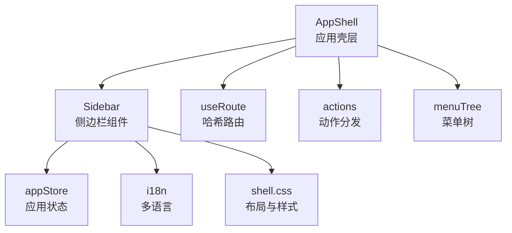
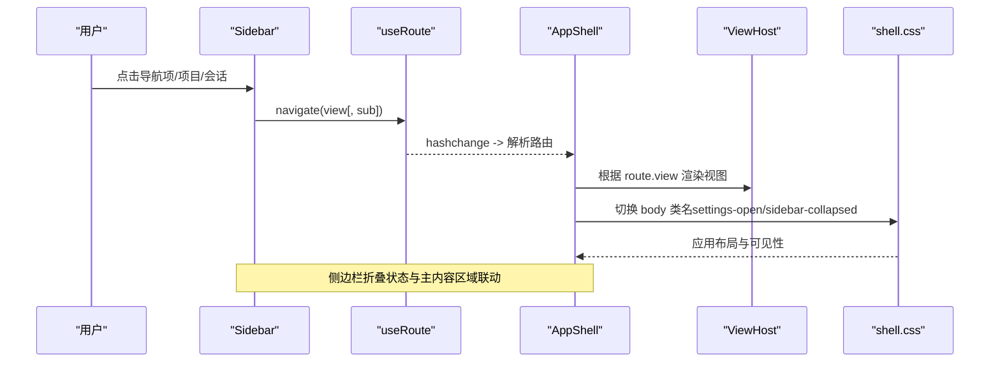
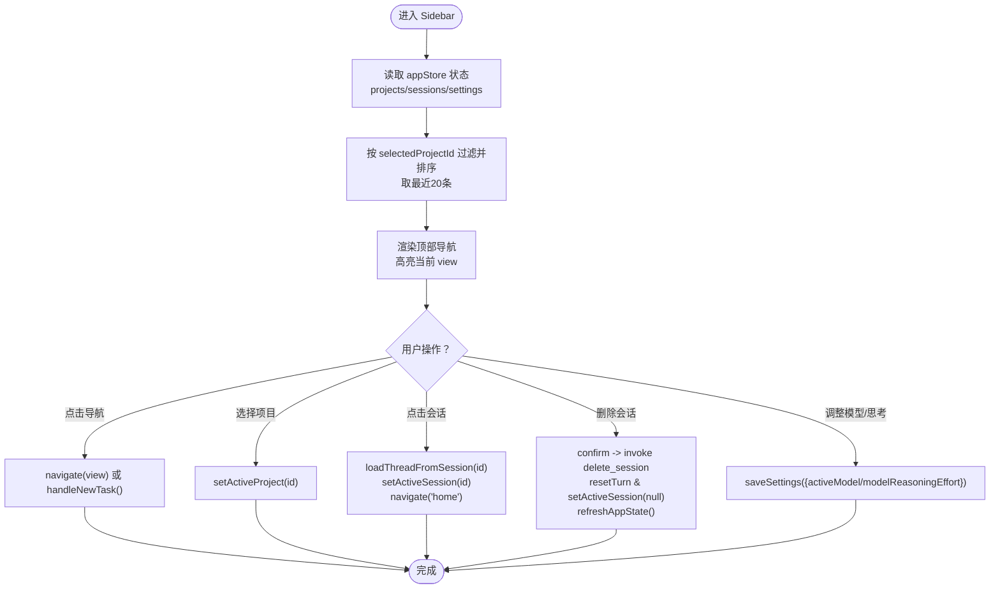
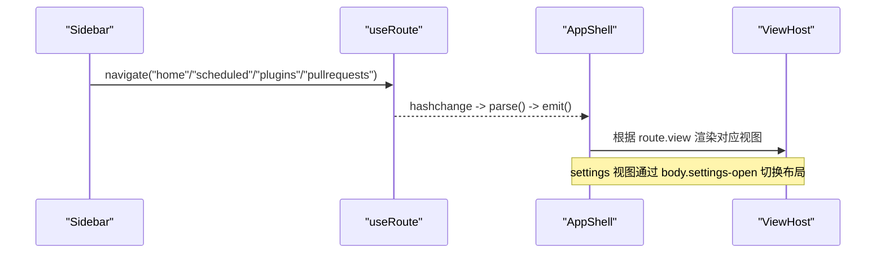
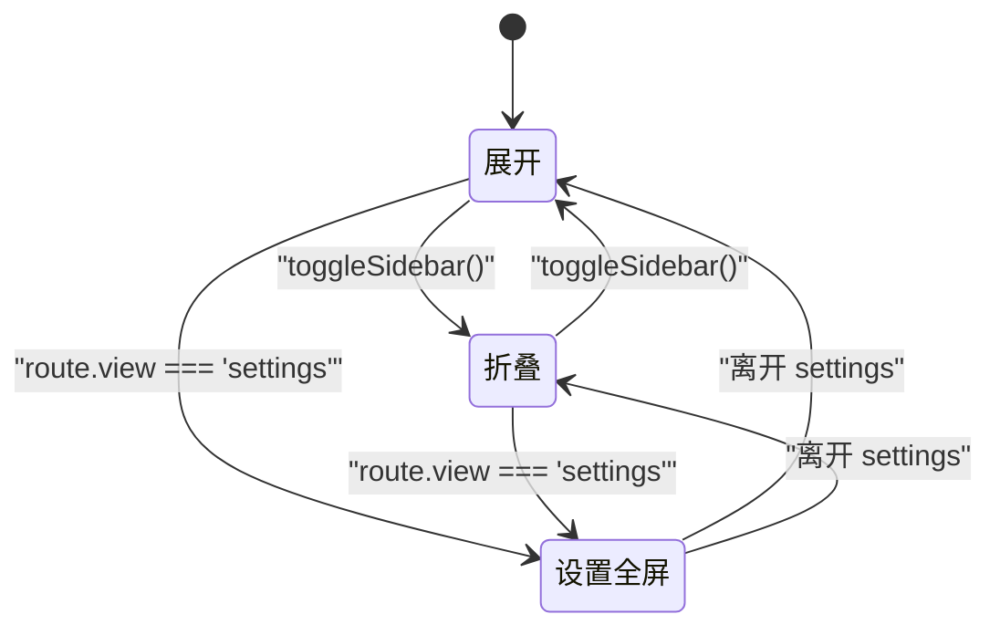
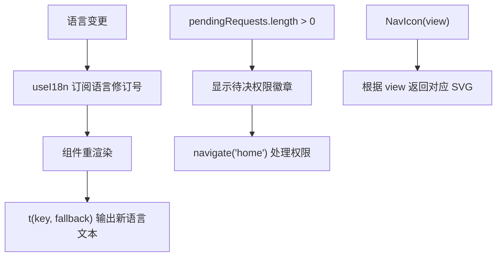
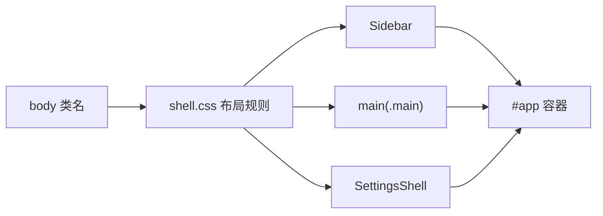
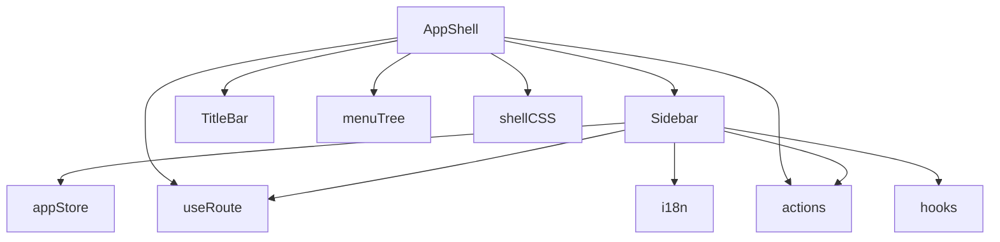

# 侧边栏导航系统

<cite>
**本文引用的文件**
- [frontend/app/shell/Sidebar.tsx](file://frontend/app/shell/Sidebar.tsx)
- [frontend/app/shell/AppShell.tsx](file://frontend/app/shell/AppShell.tsx)
- [frontend/app/shell/useRoute.ts](file://frontend/app/shell/useRoute.ts)
- [frontend/app/shell/actions.ts](file://frontend/app/shell/actions.ts)
- [frontend/app/shell/menuTree.ts](file://frontend/app/shell/menuTree.ts)
- [frontend/app/state/appStore.ts](file://frontend/app/state/appStore.ts)
- [frontend/src/styles/shell.css](file://frontend/src/styles/shell.css)
- [frontend/src/js/i18n.js](file://frontend/src/js/i18n.js)
- [frontend/app/shell/useI18n.ts](file://frontend/app/shell/useI18n.ts)
- [frontend/app/state/hooks.ts](file://frontend/app/state/hooks.ts)
</cite>

## 目录
1. [简介](#简介)
2. [项目结构](#项目结构)
3. [核心组件](#核心组件)
4. [架构总览](#架构总览)
5. [详细组件分析](#详细组件分析)
6. [依赖关系分析](#依赖关系分析)
7. [性能考量](#性能考量)
8. [故障排查指南](#故障排查指南)
9. [结论](#结论)
10. [附录](#附录)

## 简介
本文件为“侧边栏导航系统”的技术文档，聚焦于 Sidebar 组件的实现与协作机制。内容涵盖：
- 导航菜单的动态生成、路由集成与响应式行为
- 折叠/展开状态管理、本地存储持久化以及与主内容区域的协调
- 导航项的权限控制、多语言支持与图标显示逻辑
- 交互流程图与状态转换图，完整呈现用户导航体验

该侧边栏位于应用壳层（AppShell）中，通过哈希路由驱动视图切换，结合应用状态（appStore）、国际化（i18n）与样式（shell.css）共同完成布局与交互。

## 项目结构
侧边栏相关代码主要分布在以下位置：
- 组件与壳层：Sidebar.tsx、AppShell.tsx
- 路由与动作分发：useRoute.ts、actions.ts、menuTree.ts
- 状态与数据：appStore.ts、hooks.ts
- 样式与主题：shell.css
- 国际化：i18n.js、useI18n.ts

图表来源
- [frontend/app/shell/AppShell.tsx:78-205](file://frontend/app/shell/AppShell.tsx#L78-L205)
- [frontend/app/shell/Sidebar.tsx:89-351](file://frontend/app/shell/Sidebar.tsx#L89-L351)
- [frontend/app/shell/useRoute.ts:1-79](file://frontend/app/shell/useRoute.ts#L1-L79)
- [frontend/app/shell/actions.ts:57-201](file://frontend/app/shell/actions.ts#L57-L201)
- [frontend/app/shell/menuTree.ts:24-87](file://frontend/app/shell/menuTree.ts#L24-L87)
- [frontend/app/state/appStore.ts:98-151](file://frontend/app/state/appStore.ts#L98-L151)
- [frontend/src/styles/shell.css:85-105](file://frontend/src/styles/shell.css#L85-L105)
- [frontend/src/js/i18n.js:4-12](file://frontend/src/js/i18n.js#L4-L12)

章节来源
- [frontend/app/shell/AppShell.tsx:78-205](file://frontend/app/shell/AppShell.tsx#L78-L205)
- [frontend/app/shell/Sidebar.tsx:89-351](file://frontend/app/shell/Sidebar.tsx#L89-L351)
- [frontend/app/shell/useRoute.ts:1-79](file://frontend/app/shell/useRoute.ts#L1-L79)
- [frontend/app/shell/actions.ts:57-201](file://frontend/app/shell/actions.ts#L57-L201)
- [frontend/app/shell/menuTree.ts:24-87](file://frontend/app/shell/menuTree.ts#L24-L87)
- [frontend/app/state/appStore.ts:98-151](file://frontend/app/state/appStore.ts#L98-L151)
- [frontend/src/styles/shell.css:85-105](file://frontend/src/styles/shell.css#L85-L105)
- [frontend/src/js/i18n.js:4-12](file://frontend/src/js/i18n.js#L4-L12)

## 核心组件
- Sidebar：渲染品牌区、顶部导航、项目列表、最近会话、底部操作区；处理删除会话、模型与思考等级设置、待决权限提示等。
- AppShell：承载标题栏、侧边栏与主内容区域；负责侧边栏折叠状态、全局快捷键、菜单事件监听与视图宿主。
- useRoute：基于 window.location.hash 的轻量路由，提供读取与导航能力，并同步 body 类名以适配样式。
- actions：集中处理来自菜单或快捷键的动作，如新建任务、切换侧边栏、窗口控制、打开外部链接等。
- menuTree：定义标题栏菜单树与快捷键映射，作为前端可访问的菜单配置源。
- appStore：维护 sessions、projects、providers、settings 等全局状态，并提供刷新、保存、选择项目/会话等操作。
- shell.css：定义侧边栏布局、折叠态、选中态、悬停态及设置页全屏覆盖等样式规则。
- i18n / useI18n：提供多语言资源与 React 订阅，确保界面文本随语言切换即时更新。

章节来源
- [frontend/app/shell/Sidebar.tsx:89-351](file://frontend/app/shell/Sidebar.tsx#L89-L351)
- [frontend/app/shell/AppShell.tsx:78-205](file://frontend/app/shell/AppShell.tsx#L78-L205)
- [frontend/app/shell/useRoute.ts:1-79](file://frontend/app/shell/useRoute.ts#L1-L79)
- [frontend/app/shell/actions.ts:57-201](file://frontend/app/shell/actions.ts#L57-L201)
- [frontend/app/shell/menuTree.ts:24-87](file://frontend/app/shell/menuTree.ts#L24-L87)
- [frontend/app/state/appStore.ts:98-151](file://frontend/app/state/appStore.ts#L98-L151)
- [frontend/src/styles/shell.css:85-105](file://frontend/src/styles/shell.css#L85-L105)
- [frontend/src/js/i18n.js:4-12](file://frontend/src/js/i18n.js#L4-L12)
- [frontend/app/shell/useI18n.ts:1-15](file://frontend/app/shell/useI18n.ts#L1-L15)

## 架构总览
侧边栏导航系统的整体流程如下：
- 用户在 Sidebar 点击导航项或项目/会话时，触发 navigate(view/sub) 更新哈希路由。
- useRoute 解析 hash 变化，通知订阅者并重绘视图宿主 ViewHost。
- AppShell 根据 route.view 决定渲染 HomeView 或 DiscoveryView；当进入 settings 时，通过 body.settings-open 隐藏侧边栏与主内容，展示 SettingsShell。
- 侧边栏折叠由 AppShell 维护 collapsed 状态，并通过 body.sidebar-collapsed 控制样式；同时尝试持久化到后端设置。
- 动作分发（actions）统一处理菜单/快捷键触发的行为，包括新建任务、切换侧边栏、窗口控制等。
- 多语言通过 i18n.js 与 useI18n 钩子实现，界面文本在语言变更时即时更新。

图表来源
- [frontend/app/shell/Sidebar.tsx:171-193](file://frontend/app/shell/Sidebar.tsx#L171-L193)
- [frontend/app/shell/useRoute.ts:48-78](file://frontend/app/shell/useRoute.ts#L48-L78)
- [frontend/app/shell/AppShell.tsx:188-205](file://frontend/app/shell/AppShell.tsx#L188-L205)
- [frontend/src/styles/shell.css:85-105](file://frontend/src/styles/shell.css#L85-L105)

## 详细组件分析

### Sidebar 组件分析
- 动态导航菜单：NAV_ITEMS 数组定义顶部导航项，使用 t(key, fallback) 进行多语言渲染；当前激活项通过 route.view 对比高亮。
- 项目与最近会话：从 appStore 获取 projects/sessions，按 selectedProjectId 过滤并按 updatedAt 排序，最多显示 20 条。
- 权限提示：当存在 pendingRequests 时，显示带点徽标的入口，引导至 home 页面处理。
- 模型与思考等级：通过 Dropdown 选择 activeModel 与 modelReasoningEffort，调用 saveSettings 持久化。
- 删除会话：调用 delete_session IPC，若删除的是当前会话则重置 turn 并清空 activeSession，最后刷新应用状态。
- 底部操作：个人资料按钮跳转到 settings/account，帮助按钮跳转到 settings/general。

图表来源
- [frontend/app/shell/Sidebar.tsx:29-42](file://frontend/app/shell/Sidebar.tsx#L29-L42)
- [frontend/app/shell/Sidebar.tsx:98-128](file://frontend/app/shell/Sidebar.tsx#L98-L128)
- [frontend/app/shell/Sidebar.tsx:171-193](file://frontend/app/shell/Sidebar.tsx#L171-L193)
- [frontend/app/shell/Sidebar.tsx:230-298](file://frontend/app/shell/Sidebar.tsx#L230-L298)
- [frontend/app/shell/Sidebar.tsx:203-228](file://frontend/app/shell/Sidebar.tsx#L203-L228)

章节来源
- [frontend/app/shell/Sidebar.tsx:29-42](file://frontend/app/shell/Sidebar.tsx#L29-L42)
- [frontend/app/shell/Sidebar.tsx:89-128](file://frontend/app/shell/Sidebar.tsx#L89-L128)
- [frontend/app/shell/Sidebar.tsx:171-193](file://frontend/app/shell/Sidebar.tsx#L171-L193)
- [frontend/app/shell/Sidebar.tsx:203-228](file://frontend/app/shell/Sidebar.tsx#L203-L228)
- [frontend/app/shell/Sidebar.tsx:230-298](file://frontend/app/shell/Sidebar.tsx#L230-L298)

### 路由集成与视图宿主
- 路由采用哈希形式 #view 或 #view/subpage，支持 deep link。
- useRoute 暴露 useRoute() 与 navigate()，并在安装时监听 hashchange 事件，同步 body 类名以适配样式。
- AppShell 中的 ViewHost 根据 route.view 决定渲染 HomeView 或 DiscoveryView；当 route.view === "settings" 时隐藏 .main 与 .sidebar，显示 SettingsShell。

图表来源
- [frontend/app/shell/useRoute.ts:16-78](file://frontend/app/shell/useRoute.ts#L16-L78)
- [frontend/app/shell/AppShell.tsx:26-32](file://frontend/app/shell/AppShell.tsx#L26-L32)
- [frontend/app/shell/AppShell.tsx:188-205](file://frontend/app/shell/AppShell.tsx#L188-L205)

章节来源
- [frontend/app/shell/useRoute.ts:16-78](file://frontend/app/shell/useRoute.ts#L16-L78)
- [frontend/app/shell/AppShell.tsx:26-32](file://frontend/app/shell/AppShell.tsx#L26-L32)
- [frontend/app/shell/AppShell.tsx:188-205](file://frontend/app/shell/AppShell.tsx#L188-L205)

### 折叠/展开状态管理与本地存储持久化
- AppShell 维护 collapsed 状态，并在每次切换时尝试读取并写入后端设置（get_settings/save_settings），以 best-effort 方式持久化 sidebarCollapsed。
- 样式层面通过 body.sidebar-collapsed 控制侧边栏可见性与主内容圆角等；当进入 settings 时，body.settings-open 隐藏侧边栏与主内容。
- 快捷键与菜单可通过 actions 触发 toggle-sidebar，统一走 dispatchAction。

图表来源
- [frontend/app/shell/AppShell.tsx:89-130](file://frontend/app/shell/AppShell.tsx#L89-L130)
- [frontend/src/styles/shell.css:97-105](file://frontend/src/styles/shell.css#L97-L105)
- [frontend/app/shell/actions.ts:97-99](file://frontend/app/shell/actions.ts#L97-L99)

章节来源
- [frontend/app/shell/AppShell.tsx:89-130](file://frontend/app/shell/AppShell.tsx#L89-L130)
- [frontend/src/styles/shell.css:97-105](file://frontend/src/styles/shell.css#L97-L105)
- [frontend/app/shell/actions.ts:97-99](file://frontend/app/shell/actions.ts#L97-L99)

### 导航项的权限控制、多语言支持与图标显示逻辑
- 权限控制：通过 usePendingRequests 获取待决请求数量，当大于 0 时在侧边栏显示徽章，引导用户前往 home 处理。
- 多语言支持：所有 UI 文本通过 t(key, fallback) 渲染，语言切换时 useI18n 钩子订阅语言修订号，强制重渲染。
- 图标显示：NavIcon 根据 view 类型返回不同 SVG 图标；项目与会话列表也包含内联 SVG 图标，保持无外部依赖。

图表来源
- [frontend/app/shell/Sidebar.tsx:195-201](file://frontend/app/shell/Sidebar.tsx#L195-L201)
- [frontend/app/shell/useI18n.ts:1-15](file://frontend/app/shell/useI18n.ts#L1-L15)
- [frontend/src/js/i18n.js:4-12](file://frontend/src/js/i18n.js#L4-L12)
- [frontend/app/shell/Sidebar.tsx:44-82](file://frontend/app/shell/Sidebar.tsx#L44-L82)

章节来源
- [frontend/app/shell/Sidebar.tsx:195-201](file://frontend/app/shell/Sidebar.tsx#L195-L201)
- [frontend/app/shell/useI18n.ts:1-15](file://frontend/app/shell/useI18n.ts#L1-L15)
- [frontend/src/js/i18n.js:4-12](file://frontend/src/js/i18n.js#L4-L12)
- [frontend/app/shell/Sidebar.tsx:44-82](file://frontend/app/shell/Sidebar.tsx#L44-L82)

### 与主内容区域的协调机制
- AppShell 将 Sidebar 与 main 并列放置；当进入 settings 视图时，通过 body.settings-open 隐藏两者，使 SettingsShell 占满 #app。
- 折叠状态下，body.sidebar-collapsed 将侧边栏宽度置零并隐藏，主内容自动扩展。
- 视图宿主 ViewHost 根据 route.view 渲染 HomeView 或 DiscoveryView，保证导航与内容一致。

图表来源
- [frontend/app/shell/AppShell.tsx:190-205](file://frontend/app/shell/AppShell.tsx#L190-L205)
- [frontend/src/styles/shell.css:85-105](file://frontend/src/styles/shell.css#L85-L105)

章节来源
- [frontend/app/shell/AppShell.tsx:190-205](file://frontend/app/shell/AppShell.tsx#L190-L205)
- [frontend/src/styles/shell.css:85-105](file://frontend/src/styles/shell.css#L85-L105)

## 依赖关系分析
- Sidebar 依赖：
  - appStore：读取 projects/sessions/settings，执行 setActiveProject/setActiveSession/refreshAppState/saveSettings
  - useRoute：导航到指定视图
  - actions：通过 ctx 调用 navigate/toggleSidebar/focusComposer/addProject/stepTask
  - i18n：多语言文本渲染
  - hooks：usePendingRequests 获取待决权限数量
- AppShell 依赖：
  - TitleBar/Sidebar：渲染壳层元素
  - useRoute：读取当前路由
  - actions：dispatchAction 处理菜单/快捷键事件
  - menuTree：构建快捷键绑定
  - shell.css：通过 body 类名控制布局
- 样式依赖：
  - shell.css 定义侧边栏网格布局、折叠态、设置页覆盖态、选中/悬停态等

图表来源
- [frontend/app/shell/Sidebar.tsx:89-351](file://frontend/app/shell/Sidebar.tsx#L89-L351)
- [frontend/app/shell/AppShell.tsx:78-205](file://frontend/app/shell/AppShell.tsx#L78-L205)
- [frontend/app/state/appStore.ts:98-151](file://frontend/app/state/appStore.ts#L98-L151)
- [frontend/app/shell/actions.ts:57-201](file://frontend/app/shell/actions.ts#L57-L201)
- [frontend/app/shell/menuTree.ts:24-87](file://frontend/app/shell/menuTree.ts#L24-L87)
- [frontend/src/styles/shell.css:85-105](file://frontend/src/styles/shell.css#L85-L105)

章节来源
- [frontend/app/shell/Sidebar.tsx:89-351](file://frontend/app/shell/Sidebar.tsx#L89-L351)
- [frontend/app/shell/AppShell.tsx:78-205](file://frontend/app/shell/AppShell.tsx#L78-L205)
- [frontend/app/state/appStore.ts:98-151](file://frontend/app/state/appStore.ts#L98-L151)
- [frontend/app/shell/actions.ts:57-201](file://frontend/app/shell/actions.ts#L57-L201)
- [frontend/app/shell/menuTree.ts:24-87](file://frontend/app/shell/menuTree.ts#L24-L87)
- [frontend/src/styles/shell.css:85-105](file://frontend/src/styles/shell.css#L85-L105)

## 性能考量
- 状态订阅：appStore 与 useRoute 均使用 useSyncExternalStore，避免不必要的重渲染，适合高频更新场景（如会话流）。
- 列表渲染：最近会话限制为 20 条，减少 DOM 节点数量，提升滚动性能。
- 异步持久化：侧边栏折叠状态与设置保存采用 best-effort 异步调用，不阻塞 UI。
- 样式切换：通过 body 类名切换布局，避免大量 class 操作与复杂条件样式。

[本节为通用指导，无需特定文件引用]

## 故障排查指南
- 侧边栏未折叠：检查 AppShell 中 collapsed 状态与 body.sidebar-collapsed 类名是否同步；确认 get_settings/save_settings 调用是否成功。
- 路由无效：确认 navigate(view/sub) 是否正确设置 window.location.hash；检查 useRoute 的 installRouter 是否已执行。
- 多语言未更新：确认 useI18n 钩子是否被调用；检查 i18n.js 的语言包是否加载；确认语言变更后 applyLanguage 是否被调用。
- 权限徽章不显示：检查 usePendingRequests 返回值是否为空；确认 pendingRequests 状态是否与 turnStore 同步。
- 删除会话失败：查看控制台错误日志；确认 delete_session IPC 是否可用；检查 refreshAppState 是否重新拉取数据。

章节来源
- [frontend/app/shell/AppShell.tsx:89-130](file://frontend/app/shell/AppShell.tsx#L89-L130)
- [frontend/app/shell/useRoute.ts:68-78](file://frontend/app/shell/useRoute.ts#L68-L78)
- [frontend/app/shell/useI18n.ts:1-15](file://frontend/app/shell/useI18n.ts#L1-L15)
- [frontend/src/js/i18n.js:4-12](file://frontend/src/js/i18n.js#L4-L12)
- [frontend/app/shell/Sidebar.tsx:105-122](file://frontend/app/shell/Sidebar.tsx#L105-L122)

## 结论
侧边栏导航系统通过清晰的组件职责划分与状态管理，实现了动态菜单、路由集成、响应式布局与多语言支持。AppShell 统一管理折叠状态与主内容协调，actions 集中处理动作分发，appStore 提供全局状态与持久化能力。整体设计兼顾性能与可维护性，便于后续扩展与优化。

[本节为总结，无需特定文件引用]

## 附录
- 快捷键与菜单：menuTree 定义了文件/编辑/视图/帮助菜单条目与快捷键；AppShell 将其转换为 ShortcutBinding，并通过 useShortcutDispatcher 绑定全局快捷键。
- 设置页全屏：当 route.view === "settings" 时，body.settings-open 隐藏侧边栏与主内容，SettingsShell 占满 #app，提供完整的设置体验。

章节来源
- [frontend/app/shell/menuTree.ts:24-87](file://frontend/app/shell/menuTree.ts#L24-L87)
- [frontend/app/shell/AppShell.tsx:100-110](file://frontend/app/shell/AppShell.tsx#L100-L110)
- [frontend/app/shell/AppShell.tsx:188-205](file://frontend/app/shell/AppShell.tsx#L188-L205)