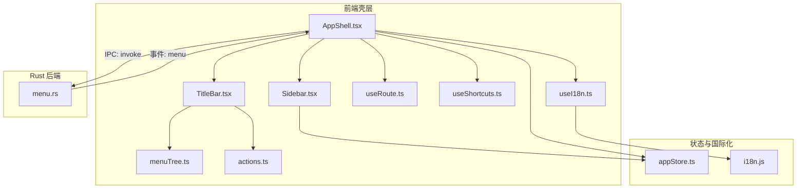
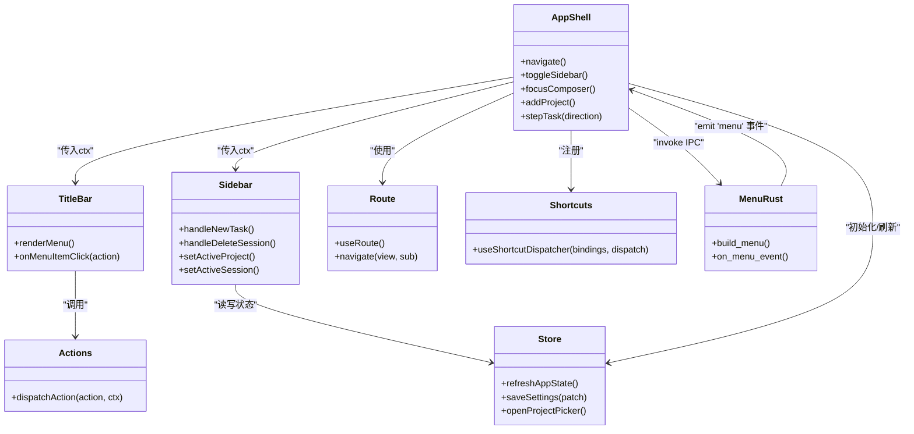
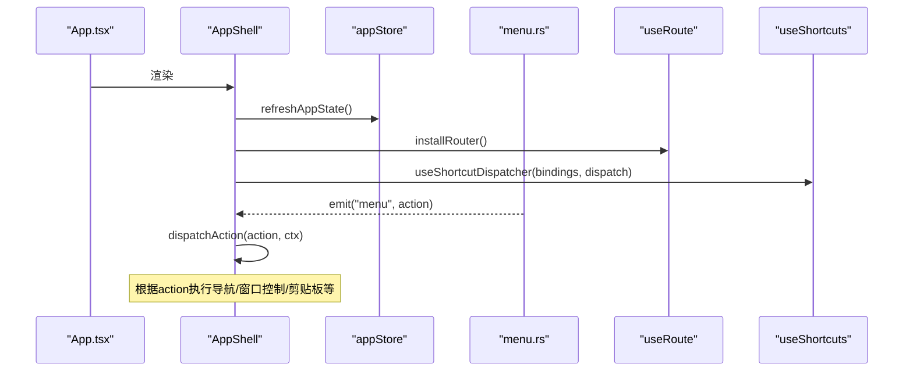
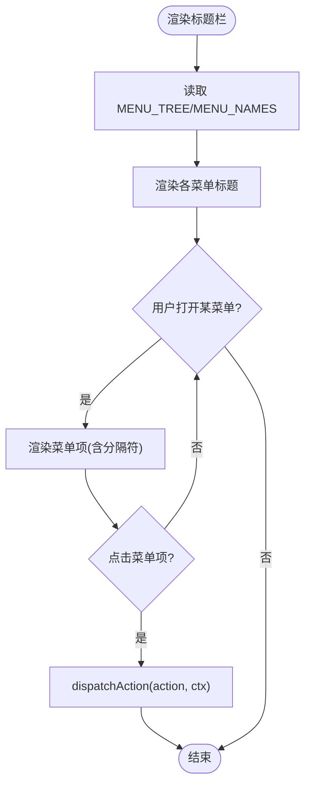
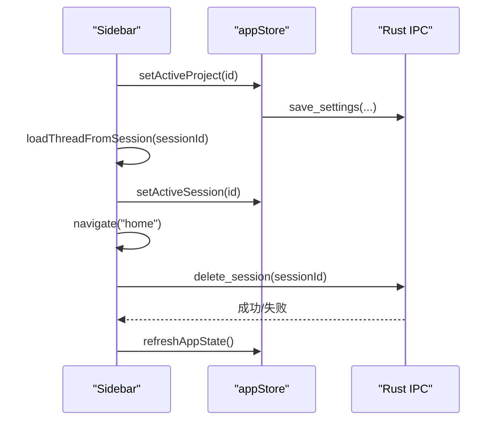
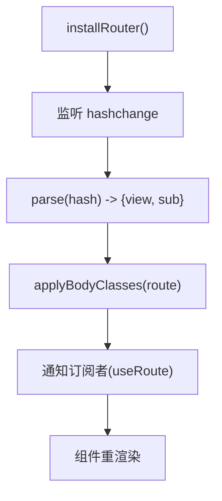
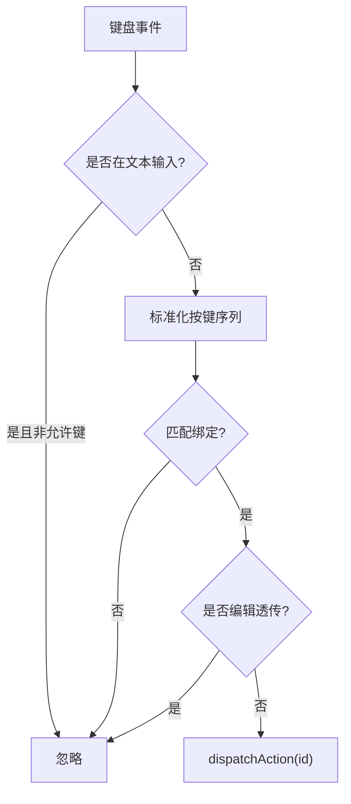
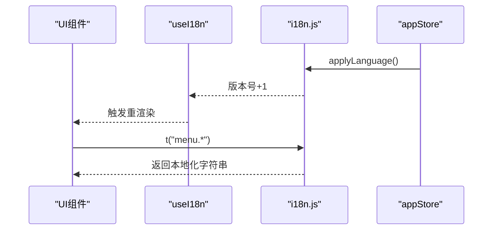
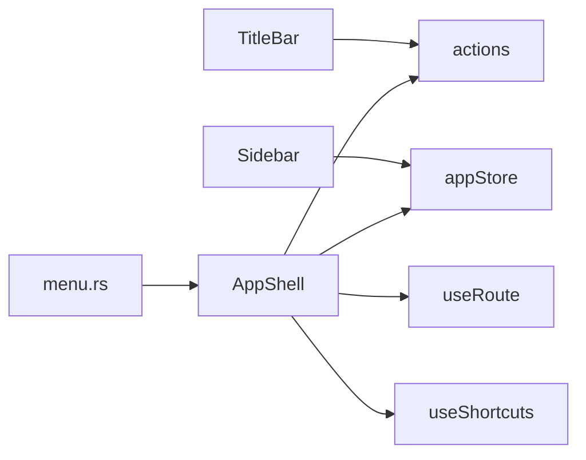

# 应用壳层架构

<cite>
**本文引用的文件**
- [AppShell.tsx](file://frontend/app/shell/AppShell.tsx)
- [TitleBar.tsx](file://frontend/app/shell/TitleBar.tsx)
- [Sidebar.tsx](file://frontend/app/shell/Sidebar.tsx)
- [menuTree.ts](file://frontend/app/shell/menuTree.ts)
- [actions.ts](file://frontend/app/shell/actions.ts)
- [useRoute.ts](file://frontend/app/shell/useRoute.ts)
- [useShortcuts.ts](file://frontend/app/shell/useShortcuts.ts)
- [useI18n.ts](file://frontend/app/shell/useI18n.ts)
- [appStore.ts](file://frontend/app/state/appStore.ts)
- [i18n.js](file://frontend/src/js/i18n.js)
- [App.tsx](file://frontend/app/App.tsx)
- [menu.rs](file://src-tauri/src/menu.rs)
</cite>

## 目录
1. [简介](#简介)
2. [项目结构](#项目结构)
3. [核心组件](#核心组件)
4. [架构总览](#架构总览)
5. [详细组件分析](#详细组件分析)
6. [依赖关系分析](#依赖关系分析)
7. [性能考量](#性能考量)
8. [故障排查指南](#故障排查指南)
9. [结论](#结论)
10. [附录](#附录)

## 简介
本文件面向 Codex-Tauri 的“应用壳层”（App Shell）架构，系统性阐述 AppShell 组件如何组织布局、侧边栏导航、标题栏与菜单树、全局快捷键、路由与多语言，以及它如何协调子组件生命周期并与 Rust 后端交互。文档包含架构图、类图、时序图和流程图，帮助读者从高层到代码级理解数据流与控制流。

## 项目结构
前端采用 React + Tauri 的组合：
- 壳层位于 frontend/app/shell，负责窗口框架、菜单、侧边栏、主视图容器、全局快捷键与路由。
- 状态集中在 frontend/app/state，通过 useSyncExternalStore 暴露给任意组件订阅。
- 国际化在 frontend/src/js/i18n.js，React 侧通过 useI18n hook 响应语言变更。
- 原生菜单与事件桥接在 src-tauri/src/menu.rs，将系统菜单动作以事件形式发往前端。

图表来源
- [AppShell.tsx:1-205](file://frontend/app/shell/AppShell.tsx#L1-L205)
- [TitleBar.tsx:1-164](file://frontend/app/shell/TitleBar.tsx#L1-L164)
- [Sidebar.tsx:1-351](file://frontend/app/shell/Sidebar.tsx#L1-L351)
- [menuTree.ts:1-87](file://frontend/app/shell/menuTree.ts#L1-L87)
- [actions.ts:1-201](file://frontend/app/shell/actions.ts#L1-L201)
- [useRoute.ts:1-79](file://frontend/app/shell/useRoute.ts#L1-L79)
- [useShortcuts.ts:1-146](file://frontend/app/shell/useShortcuts.ts#L1-L146)
- [useI18n.ts:1-15](file://frontend/app/shell/useI18n.ts#L1-L15)
- [appStore.ts:1-519](file://frontend/app/state/appStore.ts#L1-L519)
- [i18n.js:1-800](file://frontend/src/js/i18n.js#L1-L800)
- [menu.rs:1-220](file://src-tauri/src/menu.rs#L1-L220)

章节来源
- [AppShell.tsx:1-205](file://frontend/app/shell/AppShell.tsx#L1-L205)
- [App.tsx:1-47](file://frontend/app/App.tsx#L1-L47)

## 核心组件
- AppShell：应用壳根组件，装配 TitleBar、Sidebar、主视图容器；初始化路由、快捷键、菜单事件监听；维护侧边栏折叠状态与上下文能力。
- TitleBar：无装饰标题栏，渲染 File/Edit/View/Help 菜单与窗口控制按钮；菜单项来自 MENU_TREE，点击后统一走 dispatchAction。
- Sidebar：品牌区、主导航、项目列表、最近会话、模型与思考等级调节、待决权限提示、底部账户与帮助入口。
- actions：集中处理所有菜单/快捷键触发的动作（新建任务、打开设置、缩放、全屏、剪贴板等）。
- useRoute：基于 hash 的路由，提供 view/sub 解析与 body class 同步，供各组件读取当前视图。
- useShortcuts：全局快捷键分发器，支持绑定、冲突检测、文本输入时行为控制。
- useI18n：订阅 i18n 版本变化，驱动 React 组件重渲染。
- appStore：应用状态（会话、项目、提供者、设置），持久化与引擎配置写入。
- menu.rs：Rust 侧构建原生菜单并转发为前端事件。

章节来源
- [AppShell.tsx:78-205](file://frontend/app/shell/AppShell.tsx#L78-L205)
- [TitleBar.tsx:26-164](file://frontend/app/shell/TitleBar.tsx#L26-L164)
- [Sidebar.tsx:89-351](file://frontend/app/shell/Sidebar.tsx#L89-L351)
- [actions.ts:57-201](file://frontend/app/shell/actions.ts#L57-L201)
- [useRoute.ts:1-79](file://frontend/app/shell/useRoute.ts#L1-L79)
- [useShortcuts.ts:104-133](file://frontend/app/shell/useShortcuts.ts#L104-L133)
- [useI18n.ts:12-14](file://frontend/app/shell/useI18n.ts#L12-L14)
- [appStore.ts:130-151](file://frontend/app/state/appStore.ts#L130-L151)
- [menu.rs:8-220](file://src-tauri/src/menu.rs#L8-L220)

## 架构总览
下图展示壳层组件之间的层次与交互关系，以及前后端的事件通道。

图表来源
- [AppShell.tsx:78-205](file://frontend/app/shell/AppShell.tsx#L78-L205)
- [TitleBar.tsx:26-164](file://frontend/app/shell/TitleBar.tsx#L26-L164)
- [Sidebar.tsx:89-351](file://frontend/app/shell/Sidebar.tsx#L89-L351)
- [actions.ts:57-201](file://frontend/app/shell/actions.ts#L57-L201)
- [useRoute.ts:40-79](file://frontend/app/shell/useRoute.ts#L40-L79)
- [useShortcuts.ts:104-133](file://frontend/app/shell/useShortcuts.ts#L104-L133)
- [appStore.ts:378-408](file://frontend/app/state/appStore.ts#L378-L408)
- [menu.rs:215-220](file://src-tauri/src/menu.rs#L215-L220)

## 详细组件分析

### AppShell：布局与生命周期协调
- 布局契约：保持 body > #root > .app-toolbar + #app > .sidebar + .main 的结构，设置页作为 main 的同级节点，通过 body.settings-open 切换显示。
- 生命周期：
  - 启动时刷新应用状态（会话、项目、提供者、设置）。
  - 恢复侧边栏折叠状态（读取设置）。
  - 加载快捷键绑定（优先后端 list_shortcuts，否则回退到菜单树）。
  - 监听 Rust 菜单事件，统一派发 action。
  - 安装全局快捷键分发器。
- 上下文：提供 navigate、toggleSidebar、focusComposer、addProject、stepTask 等能力，被 TitleBar、Sidebar 共享。
- 响应式布局：通过 body.sidebar-collapsed 与 CSS 规则联动，避免在 React 中重复样式逻辑。

图表来源
- [App.tsx:15-46](file://frontend/app/App.tsx#L15-L46)
- [AppShell.tsx:84-186](file://frontend/app/shell/AppShell.tsx#L84-L186)
- [menu.rs:215-220](file://src-tauri/src/menu.rs#L215-L220)
- [useRoute.ts:68-79](file://frontend/app/shell/useRoute.ts#L68-L79)
- [useShortcuts.ts:104-133](file://frontend/app/shell/useShortcuts.ts#L104-L133)

章节来源
- [AppShell.tsx:1-205](file://frontend/app/shell/AppShell.tsx#L1-L205)

### 标题栏与菜单树：动态生成与多语言
- 菜单树：MENU_TREE 是单一事实源，定义 File/Edit/View/Help 四个菜单及其条目（含 action/key/keys）。
- 渲染：TitleBar 遍历 MENU_NAMES 与 MENU_TREE[name]，渲染菜单面板与分隔符；点击菜单项调用 dispatchAction。
- 多语言：菜单标签通过 t("menu.*") 获取，缺失时回退到 key 的友好形式。
- 快捷键：菜单项的 keys 同时用于 UI 展示与快捷键匹配。

图表来源
- [menuTree.ts:24-87](file://frontend/app/shell/menuTree.ts#L24-L87)
- [TitleBar.tsx:92-128](file://frontend/app/shell/TitleBar.tsx#L92-L128)
- [actions.ts:57-201](file://frontend/app/shell/actions.ts#L57-L201)

章节来源
- [TitleBar.tsx:26-164](file://frontend/app/shell/TitleBar.tsx#L26-L164)
- [menuTree.ts:1-87](file://frontend/app/shell/menuTree.ts#L1-L87)

### 侧边栏导航：项目与会话管理
- 导航项：新任务、定时任务、插件、拉取请求，点击触发 navigate 或重置会话。
- 项目列表：从 appStore 派生，选择项目会更新 activeProjectId 并持久化。
- 最近会话：按更新时间排序，点击加载线程并切换到 home。
- 模型与思考等级：下拉选择，直接保存设置并同步到引擎配置。
- 权限提示：当有待决请求时显示徽章，引导至首页处理。
- 删除会话：确认后调用后端删除接口，必要时重置 turn 并刷新状态。

图表来源
- [Sidebar.tsx:124-128](file://frontend/app/shell/Sidebar.tsx#L124-L128)
- [Sidebar.tsx:237-256](file://frontend/app/shell/Sidebar.tsx#L237-L256)
- [Sidebar.tsx:265-297](file://frontend/app/shell/Sidebar.tsx#L265-L297)
- [appStore.ts:249-277](file://frontend/app/state/appStore.ts#L249-L277)
- [appStore.ts:446-511](file://frontend/app/state/appStore.ts#L446-L511)

章节来源
- [Sidebar.tsx:1-351](file://frontend/app/shell/Sidebar.tsx#L1-L351)
- [appStore.ts:215-277](file://frontend/app/state/appStore.ts#L215-L277)

### 路由与响应式布局
- Hash 路由：view/sub 格式，兼容旧版 deep link。
- 同步 body class：当 route.view === "settings" 时添加 settings-open，使设置页全屏覆盖。
- 组件订阅：useRoute 通过 useSyncExternalStore 暴露，任何组件可读取当前视图。

图表来源
- [useRoute.ts:16-79](file://frontend/app/shell/useRoute.ts#L16-L79)

章节来源
- [useRoute.ts:1-79](file://frontend/app/shell/useRoute.ts#L1-L79)

### 全局快捷键：动态生成与权限控制
- 绑定来源：优先后端 list_shortcuts，否则回退到菜单树中的 keys。
- 匹配策略：忽略文本输入时的普通键（保留 Esc/Enter/Tab），编辑相关快捷键透传给 WebView 原生处理。
- 冲突检测：findConflicts 可报告重复绑定。
- 分发：useShortcutDispatcher 将匹配的 id 交给 dispatchAction，与菜单项共用同一执行路径。

图表来源
- [useShortcuts.ts:27-45](file://frontend/app/shell/useShortcuts.ts#L27-L45)
- [useShortcuts.ts:60-90](file://frontend/app/shell/useShortcuts.ts#L60-L90)
- [useShortcuts.ts:104-133](file://frontend/app/shell/useShortcuts.ts#L104-L133)
- [actions.ts:57-201](file://frontend/app/shell/actions.ts#L57-L201)

章节来源
- [useShortcuts.ts:1-146](file://frontend/app/shell/useShortcuts.ts#L1-L146)
- [actions.ts:1-201](file://frontend/app/shell/actions.ts#L1-L201)

### 多语言支持：动态生效
- 语言包：i18n.js 维护多语言字典，支持 en/zh-CN/zh-TW/ja/ko。
- React 集成：useI18n 订阅语言版本变化，确保标题栏、侧边栏等常驻组件能即时刷新。
- 设置同步：appStore 在刷新设置时同步语言到 legacy store 并触发 applyLanguage。

图表来源
- [useI18n.ts:12-14](file://frontend/app/shell/useI18n.ts#L12-L14)
- [i18n.js:4-12](file://frontend/src/js/i18n.js#L4-L12)
- [appStore.ts:378-408](file://frontend/app/state/appStore.ts#L378-L408)

章节来源
- [useI18n.ts:1-15](file://frontend/app/shell/useI18n.ts#L1-L15)
- [i18n.js:1-800](file://frontend/src/js/i18n.js#L1-L800)
- [appStore.ts:378-408](file://frontend/app/state/appStore.ts#L378-L408)

### 权限控制与待决请求
- 待决请求：Sidebar 通过 usePendingRequests 显示徽章，引导用户回到首页处理。
- 审批策略：appStore 的 approvalPolicy 映射到引擎配置（on-request/never），影响运行时权限询问行为。
- 安全提示：设置中明确全量访问风险，建议按需开启。

章节来源
- [Sidebar.tsx:195-201](file://frontend/app/shell/Sidebar.tsx#L195-L201)
- [appStore.ts:410-433](file://frontend/app/state/appStore.ts#L410-L433)
- [appStore.ts:472-485](file://frontend/app/state/appStore.ts#L472-L485)

## 依赖关系分析
- 组件耦合：
  - AppShell 作为编排中心，持有 ShellContext，向 TitleBar/Sidebar 注入能力。
  - TitleBar 与 actions 强耦合，菜单项与动作一一对应。
  - Sidebar 依赖 appStore 进行项目与会话管理。
  - 全局快捷键与 actions 解耦，仅通过 id 分发。
- 外部依赖：
  - Tauri IPC：invoke(plugin:window|*, plugin:dialog|*, rpc_raw, get_settings/save_settings/list_sessions/list_providers)。
  - 原生菜单：menu.rs 构建并转发事件。
- 潜在循环：
  - 无直接循环引用；通过事件与 store 解耦。

图表来源
- [TitleBar.tsx:48-51](file://frontend/app/shell/TitleBar.tsx#L48-L51)
- [Sidebar.tsx:9-26](file://frontend/app/shell/Sidebar.tsx#L9-L26)
- [AppShell.tsx:11-24](file://frontend/app/shell/AppShell.tsx#L11-L24)
- [menu.rs:215-220](file://src-tauri/src/menu.rs#L215-L220)

章节来源
- [AppShell.tsx:1-205](file://frontend/app/shell/AppShell.tsx#L1-L205)
- [actions.ts:1-201](file://frontend/app/shell/actions.ts#L1-L201)
- [appStore.ts:1-519](file://frontend/app/state/appStore.ts#L1-L519)
- [menu.rs:1-220](file://src-tauri/src/menu.rs#L1-L220)

## 性能考量
- 最小化重渲染：useSyncExternalStore 避免 provider 依赖，store 变更仅通知订阅者。
- 懒加载与回退：快捷键绑定先尝试后端，失败则回退菜单树，保证可用性。
- 异步操作不阻塞：设置持久化与 IPC 调用均为异步且不阻塞 UI。
- 缩放与全屏：通过 DOM 属性与 API 实现，避免复杂状态计算。

[本节为通用指导，无需特定文件来源]

## 故障排查指南
- 菜单无响应：检查 menu.rs 是否正确 emit("menu", id)，前端是否监听该事件。
- 快捷键无效：确认 bindings 已正确加载，是否存在冲突（findConflicts），是否在文本输入时被忽略。
- 设置未保存：检查 save_settings 与 config/batchWrite 调用是否成功，注意引擎离线时的降级处理。
- 语言不生效：确认 useI18n 订阅了语言版本变化，applyLanguage 是否被调用。

章节来源
- [menu.rs:215-220](file://src-tauri/src/menu.rs#L215-L220)
- [useShortcuts.ts:75-90](file://frontend/app/shell/useShortcuts.ts#L75-L90)
- [appStore.ts:446-511](file://frontend/app/state/appStore.ts#L446-L511)
- [useI18n.ts:12-14](file://frontend/app/shell/useI18n.ts#L12-L14)

## 结论
Codex-Tauri 的应用壳层以 AppShell 为核心，通过统一的 actions 机制、hash 路由、全局快捷键与 i18n 钩子，实现了可扩展、可维护的前端框架。菜单树作为单一事实源，保证了 UI 与行为的一致性；Rust 原生菜单与前端事件桥接提供了跨平台一致的体验。整体设计清晰分层、低耦合，便于后续扩展与优化。

[本节为总结性内容，无需特定文件来源]

## 附录
- 关键流程参考：
  - 菜单动作执行：TitleBar -> actions -> 具体功能（导航/窗口控制/剪贴板/外链）。
  - 项目与会话切换：Sidebar -> appStore -> 后端 IPC -> 刷新视图。
  - 快捷键匹配：useShortcuts -> actions -> 复用菜单动作逻辑。
  - 多语言切换：appStore -> i18n -> useI18n -> 组件重渲染。

[本节为补充说明，无需特定文件来源]