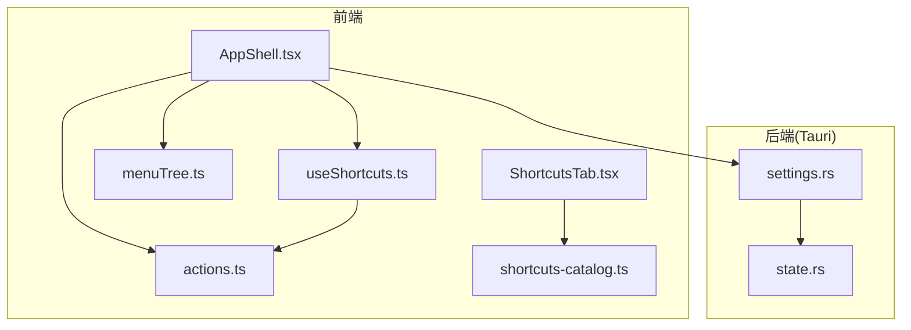
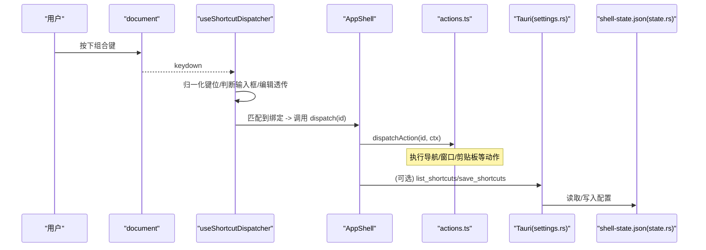
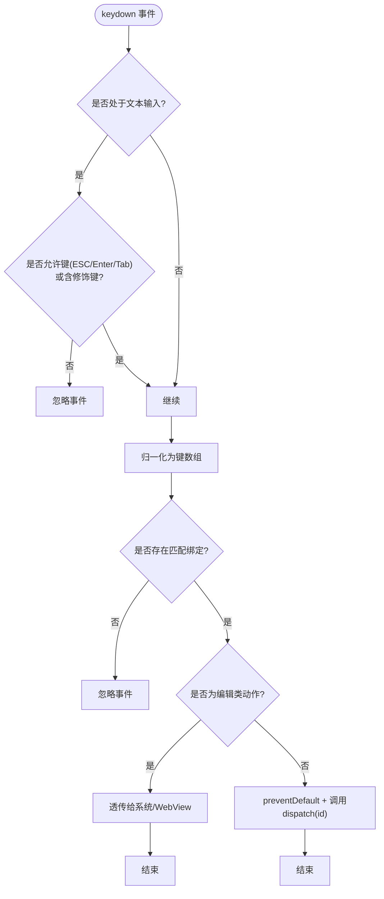
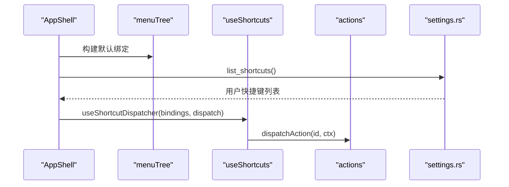
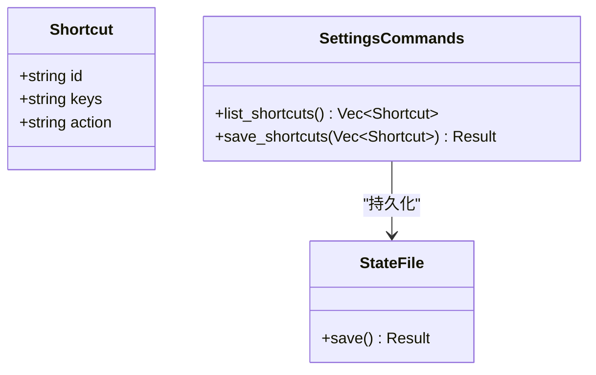
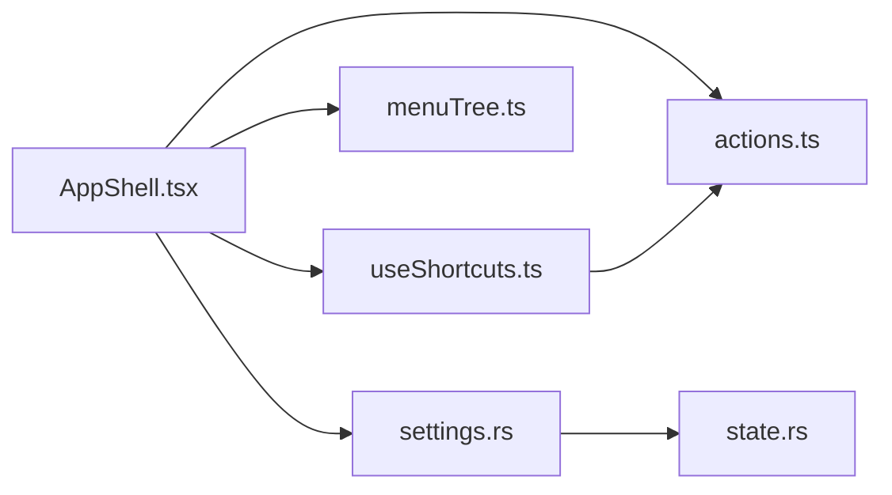
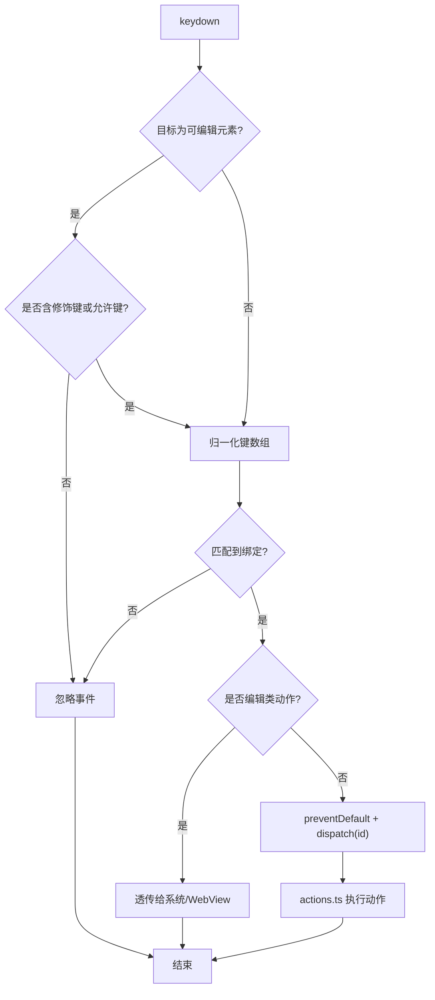

# 快捷键管理系统

<cite>
**本文引用的文件**
- [useShortcuts.ts](file://frontend/app/shell/useShortcuts.ts)
- [AppShell.tsx](file://frontend/app/shell/AppShell.tsx)
- [menuTree.ts](file://frontend/app/shell/menuTree.ts)
- [actions.ts](file://frontend/app/shell/actions.ts)
- [ShortcutsTab.tsx](file://frontend/app/views/settings/tabs/ShortcutsTab.tsx)
- [shortcuts-catalog.ts](file://frontend/app/data/shortcuts-catalog.ts)
- [settings.rs](file://src-tauri/src/commands/settings.rs)
- [state.rs](file://src-tauri/src/state.rs)
</cite>

## 目录
1. [简介](#简介)
2. [项目结构](#项目结构)
3. [核心组件](#核心组件)
4. [架构总览](#架构总览)
5. [详细组件分析](#详细组件分析)
6. [依赖关系分析](#依赖关系分析)
7. [性能考虑](#性能考虑)
8. [故障排查指南](#故障排查指南)
9. [结论](#结论)
10. [附录：快捷键映射表与事件处理流程](#附录快捷键映射表与事件处理流程)

## 简介
本文件系统性地梳理并文档化前端全局快捷键管理方案，重点围绕 useShortcuts Hook 的实现（注册、监听、分发）、快捷键配置的解析与验证、持久化机制、与后端 Rust 状态的同步、冲突检测与优先级策略。文档同时提供快捷键映射表和事件处理流程图，帮助读者快速理解从键盘事件到动作分发的完整链路。

## 项目结构
快捷键相关的前端逻辑集中在 React Shell 层，后端通过 Tauri 命令暴露状态读写能力，Rust 侧负责持久化。

图表来源
- [AppShell.tsx:100-110](file://frontend/app/shell/AppShell.tsx#L100-L110)
- [useShortcuts.ts:104-133](file://frontend/app/shell/useShortcuts.ts#L104-L133)
- [menuTree.ts:24-79](file://frontend/app/shell/menuTree.ts#L24-L79)
- [actions.ts:79-135](file://frontend/app/shell/actions.ts#L79-L135)
- [settings.rs:54-68](file://src-tauri/src/commands/settings.rs#L54-L68)
- [state.rs:118-122](file://src-tauri/src/state.rs#L118-L122)

章节来源
- [AppShell.tsx:100-110](file://frontend/app/shell/AppShell.tsx#L100-L110)
- [useShortcuts.ts:104-133](file://frontend/app/shell/useShortcuts.ts#L104-L133)
- [menuTree.ts:24-79](file://frontend/app/shell/menuTree.ts#L24-L79)
- [actions.ts:79-135](file://frontend/app/shell/actions.ts#L79-L135)
- [settings.rs:54-68](file://src-tauri/src/commands/settings.rs#L54-L68)
- [state.rs:118-122](file://src-tauri/src/state.rs#L118-L122)

## 核心组件
- useShortcuts Hook：全局键盘事件监听、键位归一化、冲突检测、编辑类快捷键透传、动作分发。
- AppShell：启动时加载用户自定义快捷键（来自后端），回退使用菜单树中的快捷键；将匹配到的动作 ID 交给 actions 统一处理。
- menuTree：定义内置菜单项及其加速键，作为初始绑定来源和展示。
- actions：根据动作 ID 执行具体行为（导航、窗口控制、剪贴板等）。
- ShortcutsTab + shortcuts-catalog：快捷键设置页与官方快捷键目录，当前为只读展示与搜索过滤。
- settings.rs + state.rs：后端提供 list_shortcuts/save_shortcuts 命令，持久化到 shell-state.json。

章节来源
- [useShortcuts.ts:13-90](file://frontend/app/shell/useShortcuts.ts#L13-L90)
- [AppShell.tsx:34-76](file://frontend/app/shell/AppShell.tsx#L34-L76)
- [menuTree.ts:24-79](file://frontend/app/shell/menuTree.ts#L24-L79)
- [actions.ts:79-135](file://frontend/app/shell/actions.ts#L79-L135)
- [ShortcutsTab.tsx:88-164](file://frontend/app/views/settings/tabs/ShortcutsTab.tsx#L88-L164)
- [shortcuts-catalog.ts:21-800](file://frontend/app/data/shortcuts-catalog.ts#L21-L800)
- [settings.rs:54-68](file://src-tauri/src/commands/settings.rs#L54-L68)
- [state.rs:118-122](file://src-tauri/src/state.rs#L118-L122)

## 架构总览
前端在应用壳中安装全局快捷键分发器，启动时优先加载用户自定义快捷键，否则回退到菜单树定义的快捷键。按键事件经归一化后与绑定列表匹配，命中后调用统一动作分发器。后端通过 Tauri 命令提供快捷键配置读取与保存，数据落盘至本地 JSON。

图表来源
- [useShortcuts.ts:104-133](file://frontend/app/shell/useShortcuts.ts#L104-L133)
- [AppShell.tsx:100-110](file://frontend/app/shell/AppShell.tsx#L100-L110)
- [actions.ts:79-135](file://frontend/app/shell/actions.ts#L79-L135)
- [settings.rs:54-68](file://src-tauri/src/commands/settings.rs#L54-L68)
- [state.rs:209-216](file://src-tauri/src/state.rs#L209-L216)

## 详细组件分析

### useShortcuts Hook：注册、监听与分发
- 键位归一化：将 KeyboardEvent 的修饰键与主键标准化为内部数组格式，便于比较。
- 文本输入场景处理：当焦点位于可编辑区域且无修饰键时，仅放行 Escape/Enter/Tab，避免打断输入体验。
- 编辑类快捷键透传：对 undo/redo/cut/copy/paste/delete/select-all 等动作直接交由 WebView2 原生处理，不拦截。
- 冲突检测：findConflicts 扫描所有绑定，返回共享同一组合键的冲突组，供 UI 提示。
- 全局监听：在 document 上注册 keydown，匹配成功后阻止默认行为并调用上层 dispatch。

图表来源
- [useShortcuts.ts:47-98](file://frontend/app/shell/useShortcuts.ts#L47-L98)
- [useShortcuts.ts:104-133](file://frontend/app/shell/useShortcuts.ts#L104-L133)

章节来源
- [useShortcuts.ts:47-98](file://frontend/app/shell/useShortcuts.ts#L47-L98)
- [useShortcuts.ts:104-133](file://frontend/app/shell/useShortcuts.ts#L104-L133)

### AppShell：绑定加载与动作路由
- 初始化绑定：先以菜单树中的 keys 生成默认绑定，保证快捷键即刻可用。
- 异步加载用户配置：调用后端 list_shortcuts，若返回有效列表则覆盖默认绑定。
- 动作分发：将匹配到的动作 ID 交给 actions 统一处理，确保与菜单点击路径一致。

图表来源
- [AppShell.tsx:34-76](file://frontend/app/shell/AppShell.tsx#L34-L76)
- [AppShell.tsx:100-110](file://frontend/app/shell/AppShell.tsx#L100-L110)
- [AppShell.tsx:179-186](file://frontend/app/shell/AppShell.tsx#L179-L186)
- [menuTree.ts:24-79](file://frontend/app/shell/menuTree.ts#L24-L79)
- [settings.rs:54-68](file://src-tauri/src/commands/settings.rs#L54-L68)

章节来源
- [AppShell.tsx:34-76](file://frontend/app/shell/AppShell.tsx#L34-L76)
- [AppShell.tsx:100-110](file://frontend/app/shell/AppShell.tsx#L100-L110)
- [AppShell.tsx:179-186](file://frontend/app/shell/AppShell.tsx#L179-L186)

### 快捷键配置解析、验证与持久化
- 解析：后端 Shortcut 结构包含 id、keys、action；前端 normaliseBindings 兼容字符串与数组两种 keys 格式，并提取 id/label。
- 验证：前端 findConflicts 检测重复组合键；ShortcutsTab 当前为只读展示，未实现重绑定入口。
- 持久化：后端 save_shortcuts 更新内存状态并调用 save() 写入 shell-state.json；get_settings/get_preferences 同理。

图表来源
- [state.rs:118-122](file://src-tauri/src/state.rs#L118-L122)
- [settings.rs:54-68](file://src-tauri/src/commands/settings.rs#L54-L68)
- [state.rs:209-216](file://src-tauri/src/state.rs#L209-L216)

章节来源
- [AppShell.tsx:34-64](file://frontend/app/shell/AppShell.tsx#L34-L64)
- [useShortcuts.ts:75-90](file://frontend/app/shell/useShortcuts.ts#L75-L90)
- [settings.rs:54-68](file://src-tauri/src/commands/settings.rs#L54-L68)
- [state.rs:118-122](file://src-tauri/src/state.rs#L118-L122)
- [state.rs:209-216](file://src-tauri/src/state.rs#L209-L216)

### 与后端系统的同步、冲突检测与优先级
- 同步：AppShell 启动时调用 list_shortcuts 获取用户配置；后续可通过 save_shortcuts 持久化（当前前端未暴露重绑定入口）。
- 冲突检测：findConflicts 基于 keys.join("+") 聚合，返回冲突组；可用于 UI 提示。
- 优先级：
  - 运行时：第一个匹配的绑定被触发（按 bindings 顺序）。
  - 启动时：用户配置覆盖菜单树默认绑定。
  - 编辑类动作：即使命中也不会拦截，交由 WebView2 原生处理。

章节来源
- [AppShell.tsx:66-76](file://frontend/app/shell/AppShell.tsx#L66-L76)
- [AppShell.tsx:100-110](file://frontend/app/shell/AppShell.tsx#L100-L110)
- [useShortcuts.ts:75-90](file://frontend/app/shell/useShortcuts.ts#L75-L90)
- [useShortcuts.ts:30-45](file://frontend/app/shell/useShortcuts.ts#L30-L45)

### 设置页与目录：只读展示与搜索
- ShortcutsTab 渲染官方目录（shortcuts-catalog.ts），支持文本搜索与“按快捷键搜索”模式（捕获非修饰键用于过滤）。
- 当前未实现重绑定按钮交互，所有编辑按钮禁用，避免伪造后端命令。

章节来源
- [ShortcutsTab.tsx:88-164](file://frontend/app/views/settings/tabs/ShortcutsTab.tsx#L88-L164)
- [shortcuts-catalog.ts:21-800](file://frontend/app/data/shortcuts-catalog.ts#L21-L800)

## 依赖关系分析
- AppShell 依赖 useShortcuts、menuTree、actions 以及 Tauri 命令。
- useShortcuts 独立于业务，仅提供通用分发能力。
- actions 集中处理动作语义，屏蔽底层差异（导航、窗口、剪贴板）。
- 后端 settings.rs 暴露命令，state.rs 提供数据结构与持久化。

图表来源
- [AppShell.tsx:100-110](file://frontend/app/shell/AppShell.tsx#L100-L110)
- [useShortcuts.ts:104-133](file://frontend/app/shell/useShortcuts.ts#L104-L133)
- [actions.ts:79-135](file://frontend/app/shell/actions.ts#L79-L135)
- [settings.rs:54-68](file://src-tauri/src/commands/settings.rs#L54-L68)
- [state.rs:118-122](file://src-tauri/src/state.rs#L118-L122)

章节来源
- [AppShell.tsx:100-110](file://frontend/app/shell/AppShell.tsx#L100-L110)
- [useShortcuts.ts:104-133](file://frontend/app/shell/useShortcuts.ts#L104-L133)
- [actions.ts:79-135](file://frontend/app/shell/actions.ts#L79-L135)
- [settings.rs:54-68](file://src-tauri/src/commands/settings.rs#L54-L68)
- [state.rs:118-122](file://src-tauri/src/state.rs#L118-L122)

## 性能考虑
- 事件监听仅在 document 上注册一次，避免重复开销。
- 使用 useRef 缓存最新 bindings 与 dispatch，减少重新绑定监听器的成本。
- 键位匹配采用线性查找，适用于当前规模；若未来绑定数量增长，可考虑哈希索引优化。
- 文本输入场景的快速短路可减少不必要的归一化与匹配计算。

[本节为通用性能建议，不直接分析具体文件]

## 故障排查指南
- 快捷键无效：
  - 检查是否在文本输入框内且无修饰键，此时会被忽略（除非为 ESC/Enter/Tab）。
  - 确认绑定的 keys 格式是否正确（字符串或数组），normaliseBindings 会过滤空 keys。
  - 查看是否存在冲突（findConflicts），多个绑定共用同一组合键会导致只有首个生效。
- 编辑类快捷键失效：
  - 如 copy/paste 等动作已设计为透传给 WebView2，不应期望 JS 拦截。
- 配置未持久化：
  - 确认后端 save_shortcuts 被调用（当前前端未暴露重绑定入口）。
  - 检查 shell-state.json 是否可写。

章节来源
- [useShortcuts.ts:27-45](file://frontend/app/shell/useShortcuts.ts#L27-L45)
- [useShortcuts.ts:75-90](file://frontend/app/shell/useShortcuts.ts#L75-L90)
- [AppShell.tsx:34-64](file://frontend/app/shell/AppShell.tsx#L34-L64)
- [settings.rs:54-68](file://src-tauri/src/commands/settings.rs#L54-L68)
- [state.rs:209-216](file://src-tauri/src/state.rs#L209-L216)

## 结论
本方案通过 useShortcuts Hook 实现了稳定、可扩展的全局快捷键分发，结合菜单树默认绑定与后端用户配置，形成清晰的优先级与扩展点。当前设置页为只读展示，未来可在 ShortcutsTab 中接入重绑定与冲突提示，完善端到端的快捷键定制体验。

[本节为总结性内容，不直接分析具体文件]

## 附录：快捷键映射表与事件处理流程

### 快捷键映射表（节选）
以下列出部分菜单项与其加速键，来源于菜单树定义。更多条目请参考菜单树文件。

- 新建任务：Ctrl+N
- 打开文件夹：Ctrl+O
- 关闭：Ctrl+W
- 设置：Ctrl+,
- 退出：Ctrl+Q
- 撤销：Ctrl+Z
- 重做：Ctrl+Y
- 剪切：Ctrl+X
- 复制：Ctrl+C
- 粘贴：Ctrl+V
- 删除：Del
- 全选：Ctrl+A
- 切换侧边栏：Ctrl+B
- 打开终端：Ctrl+`
- 查找：Ctrl+F
- 放大/缩小/实际大小：Ctrl+= / Ctrl+- / Ctrl+0
- 全屏：F11
- 打开快捷键页面：Ctrl+Shift+/

章节来源
- [menuTree.ts:24-79](file://frontend/app/shell/menuTree.ts#L24-L79)

### 事件处理流程图（完整版）

图表来源
- [useShortcuts.ts:47-98](file://frontend/app/shell/useShortcuts.ts#L47-L98)
- [useShortcuts.ts:104-133](file://frontend/app/shell/useShortcuts.ts#L104-L133)
- [actions.ts:79-135](file://frontend/app/shell/actions.ts#L79-L135)