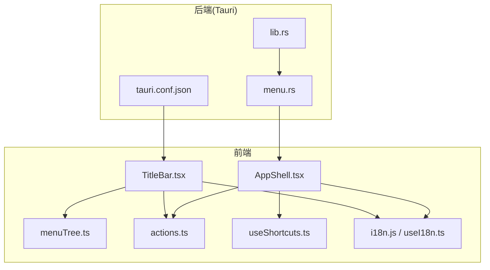
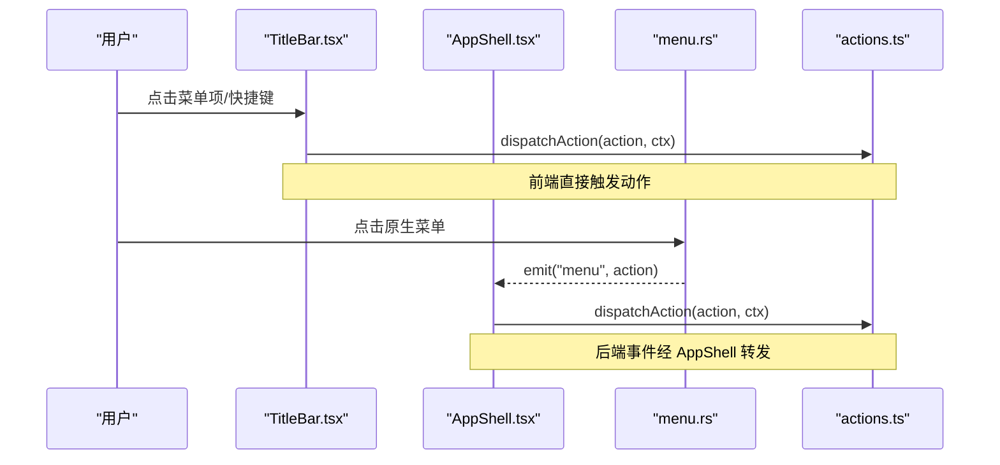
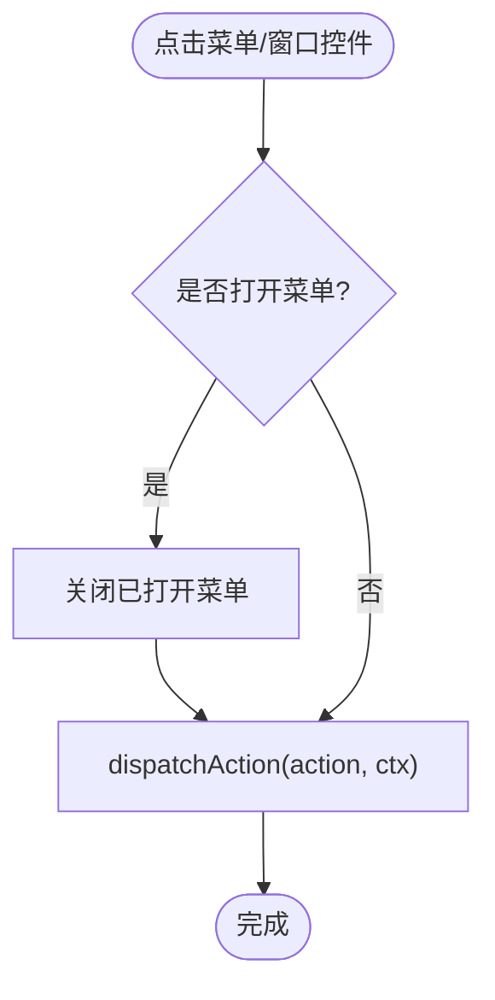
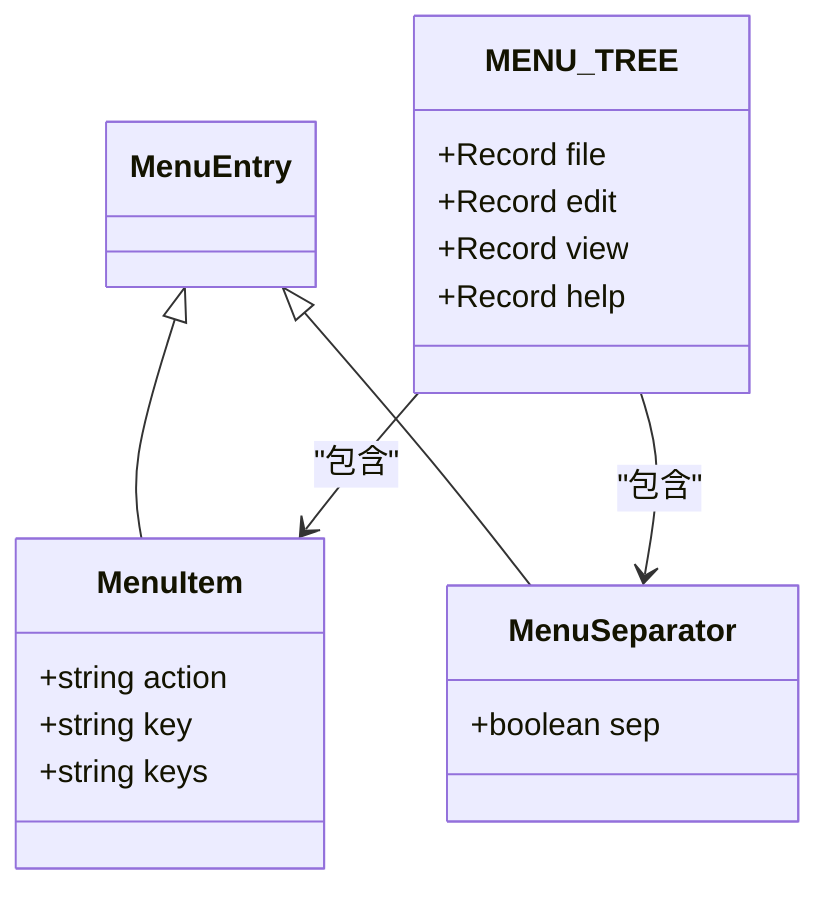
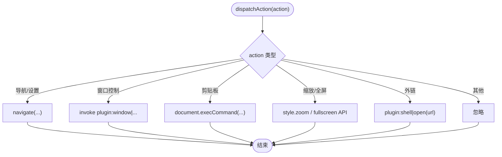
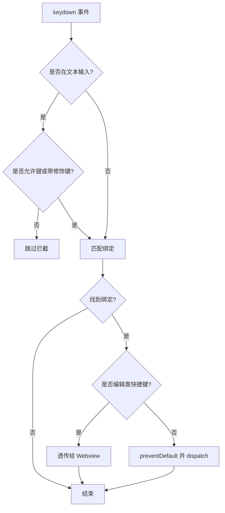
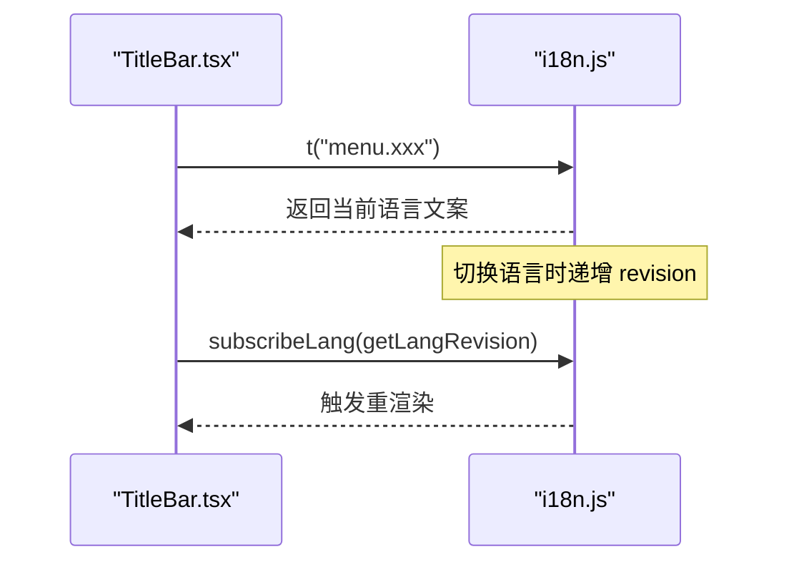
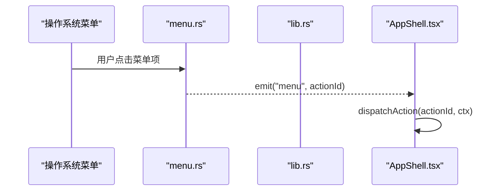
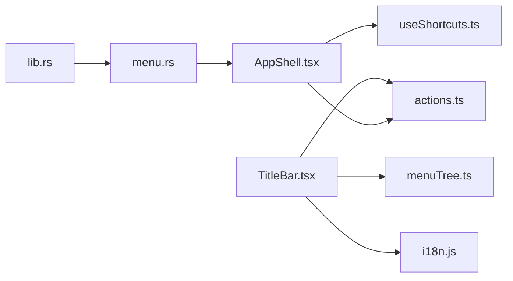

# 标题栏集成

<cite>
**本文引用的文件**
- [TitleBar.tsx](file://frontend/app/shell/TitleBar.tsx)
- [menuTree.ts](file://frontend/app/shell/menuTree.ts)
- [actions.ts](file://frontend/app/shell/actions.ts)
- [useShortcuts.ts](file://frontend/app/shell/useShortcuts.ts)
- [AppShell.tsx](file://frontend/app/shell/AppShell.tsx)
- [i18n.js](file://frontend/src/js/i18n.js)
- [useI18n.ts](file://frontend/app/shell/useI18n.ts)
- [menu.rs](file://src-tauri/src/menu.rs)
- [lib.rs](file://src-tauri/src/lib.rs)
- [tauri.conf.json](file://src-tauri/tauri.conf.json)
</cite>

## 目录
1. [简介](#简介)
2. [项目结构](#项目结构)
3. [核心组件](#核心组件)
4. [架构总览](#架构总览)
5. [详细组件分析](#详细组件分析)
6. [依赖关系分析](#依赖关系分析)
7. [性能考量](#性能考量)
8. [故障排查指南](#故障排查指南)
9. [结论](#结论)

## 简介
本文件围绕“标题栏集成”展开，系统性说明前端 TitleBar 组件、原生菜单系统、快捷键绑定与国际化支持的设计与实现。重点包括：
- 原生窗口控制（最小化、最大化/还原、关闭）
- 菜单系统集成（原生菜单与内嵌菜单树的一致性）
- 动态菜单生成与事件分发机制
- 跨平台兼容性处理（无装饰窗口、拖拽区域、Webview 编辑行为）
- 快捷键绑定与冲突检测
- 国际化（i18n）在菜单与标题栏中的落地

## 项目结构
标题栏相关的前端逻辑集中在 shell 模块，后端通过 Tauri 构建原生菜单并向前端派发事件；配置项定义无装饰窗口与拖拽区域等特性。

图表来源
- [TitleBar.tsx:1-164](file://frontend/app/shell/TitleBar.tsx#L1-L164)
- [menuTree.ts:1-87](file://frontend/app/shell/menuTree.ts#L1-L87)
- [actions.ts:1-201](file://frontend/app/shell/actions.ts#L1-L201)
- [useShortcuts.ts:1-146](file://frontend/app/shell/useShortcuts.ts#L1-L146)
- [AppShell.tsx:1-205](file://frontend/app/shell/AppShell.tsx#L1-L205)
- [menu.rs:1-220](file://src-tauri/src/menu.rs#L1-L220)
- [lib.rs:1-162](file://src-tauri/src/lib.rs#L1-L162)
- [tauri.conf.json:1-61](file://src-tauri/tauri.conf.json#L1-L61)

章节来源
- [TitleBar.tsx:1-164](file://frontend/app/shell/TitleBar.tsx#L1-L164)
- [menuTree.ts:1-87](file://frontend/app/shell/menuTree.ts#L1-L87)
- [actions.ts:1-201](file://frontend/app/shell/actions.ts#L1-L201)
- [useShortcuts.ts:1-146](file://frontend/app/shell/useShortcuts.ts#L1-L146)
- [AppShell.tsx:1-205](file://frontend/app/shell/AppShell.tsx#L1-L205)
- [menu.rs:1-220](file://src-tauri/src/menu.rs#L1-L220)
- [lib.rs:1-162](file://src-tauri/src/lib.rs#L1-L162)
- [tauri.conf.json:1-61](file://src-tauri/tauri.conf.json#L1-L61)

## 核心组件
- 标题栏 UI：渲染导航按钮、应用菜单条、窗口控制按钮，并支持拖拽区域。
- 菜单树：集中定义 File/Edit/View/Help 的菜单项、动作标识、快捷键提示与分隔符。
- 动作分发：统一将菜单点击、快捷键触发的事件路由到具体业务逻辑（导航、窗口控制、缩放、全屏等）。
- 快捷键系统：全局监听键盘事件，归一化按键组合，支持冲突检测与文本输入场景下的透传策略。
- 国际化：菜单文案与标签通过 i18n 键值映射，支持多语言切换与回退。
- 原生菜单：Rust 侧构建与前端一致的菜单，并将用户操作以事件形式发回前端。

章节来源
- [TitleBar.tsx:1-164](file://frontend/app/shell/TitleBar.tsx#L1-L164)
- [menuTree.ts:1-87](file://frontend/app/shell/menuTree.ts#L1-L87)
- [actions.ts:1-201](file://frontend/app/shell/actions.ts#L1-L201)
- [useShortcuts.ts:1-146](file://frontend/app/shell/useShortcuts.ts#L1-L146)
- [i18n.js:1-800](file://frontend/src/js/i18n.js#L1-L800)
- [menu.rs:1-220](file://src-tauri/src/menu.rs#L1-L220)

## 架构总览
标题栏集成的数据与控制流如下：
- 前端 TitleBar 渲染菜单与窗口控件，点击后调用 dispatchAction。
- 后端 menu.rs 构建原生菜单，用户操作时通过 on_menu_event 发射 “menu” 事件。
- AppShell 订阅 “menu” 事件，同样调用 dispatchAction。
- actions.ts 根据 action 字符串执行对应逻辑（导航、窗口控制、缩放、全屏、外部链接等）。
- 快捷键由 useShortcuts.ts 全局监听，匹配后也进入同一 dispatchAction 路径。
- 所有显示文案通过 i18n 获取，支持运行时切换语言。

图表来源
- [TitleBar.tsx:48-51](file://frontend/app/shell/TitleBar.tsx#L48-L51)
- [AppShell.tsx:163-177](file://frontend/app/shell/AppShell.tsx#L163-L177)
- [menu.rs:215-220](file://src-tauri/src/menu.rs#L215-L220)
- [actions.ts:56-201](file://frontend/app/shell/actions.ts#L56-L201)

## 详细组件分析

### 标题栏组件（TitleBar）
- 功能要点
  - 导航区：侧边栏开关、前进/后退。
  - 菜单区：基于 MENU_TREE 渲染 File/Edit/View/Help 四个主菜单及其子项，支持分隔符。
  - 窗口控制：最小化、最大化/还原、关闭，均通过 dispatchAction 调用后端窗口能力。
  - 拖拽区域：使用 data-tauri-drag-region 使标题栏可拖拽移动窗口。
  - 交互细节：点击外部或按 Escape 关闭打开的菜单；菜单项支持显示快捷键提示。
- 国际化：菜单标题与项文案通过 t() 获取，缺失时回退到键名。
- 无障碍：为关键按钮提供 aria-label，菜单面板使用 role="menu" 与 role="menuitem"。

图表来源
- [TitleBar.tsx:31-51](file://frontend/app/shell/TitleBar.tsx#L31-L51)
- [TitleBar.tsx:92-128](file://frontend/app/shell/TitleBar.tsx#L92-L128)
- [TitleBar.tsx:132-160](file://frontend/app/shell/TitleBar.tsx#L132-L160)

章节来源
- [TitleBar.tsx:1-164](file://frontend/app/shell/TitleBar.tsx#L1-L164)

### 菜单树（menuTree）
- 数据结构
  - MenuItem：包含 action（动作标识）、key（i18n 键）、keys（快捷键提示）。
  - MenuSeparator：分隔符标记。
  - MENU_TREE：四组菜单（file/edit/view/help）的条目数组。
  - MENU_NAMES：菜单顺序与类型约束。
- 设计原则
  - 单一事实来源：菜单渲染与动作分发共享同一份定义，避免不一致。
  - 快捷键提示与前端快捷键系统共用 keys 字段，便于设置页展示与冲突检测。
- 扩展性
  - 新增菜单项只需在对应分组追加条目，无需修改渲染逻辑。

图表来源
- [menuTree.ts:10-22](file://frontend/app/shell/menuTree.ts#L10-L22)
- [menuTree.ts:24-82](file://frontend/app/shell/menuTree.ts#L24-L82)

章节来源
- [menuTree.ts:1-87](file://frontend/app/shell/menuTree.ts#L1-L87)

### 动作分发器（actions）
- 职责
  - 将 action 字符串映射到具体行为：导航、窗口控制、缩放、全屏、外部链接打开、剪贴板命令等。
  - 对未知 action 静默忽略，保证健壮性。
- 窗口控制
  - 通过 Tauri 插件调用 minimize/toggle_maximize/close，label 固定为 main。
- 剪贴板与编辑
  - 使用 document.execCommand 调用系统剪贴板能力（在 Webview2 环境下仍有效）。
- 缩放与全屏
  - 通过根元素 style.zoom 控制缩放，范围限制在 0.7~1.5；全屏通过浏览器 Fullscreen API。
- 外部链接
  - 通过 shell 插件 open 打开 URL。

图表来源
- [actions.ts:39-54](file://frontend/app/shell/actions.ts#L39-L54)
- [actions.ts:56-201](file://frontend/app/shell/actions.ts#L56-L201)

章节来源
- [actions.ts:1-201](file://frontend/app/shell/actions.ts#L1-L201)

### 快捷键系统（useShortcuts）
- 全局监听
  - 注册 document keydown 监听，归一化按键组合（Ctrl/Shift/Alt/Meta + 主键）。
- 文本输入场景
  - 当焦点在输入框/可编辑区域且非允许键（Esc/Enter/Tab）且无修饰键时，跳过拦截，避免打断输入。
- 编辑类快捷键透传
  - undo/redo/cut/copy/paste/delete/select-all 等交由 Webview 原生处理，不阻止默认行为。
- 冲突检测
  - findConflicts 汇总重复绑定，供设置页提示。
- 与菜单树联动
  - AppShell 启动时从 menuTree 生成 fallback 绑定，确保在 settings 未加载前快捷键可用。

图表来源
- [useShortcuts.ts:24-45](file://frontend/app/shell/useShortcuts.ts#L24-L45)
- [useShortcuts.ts:47-98](file://frontend/app/shell/useShortcuts.ts#L47-L98)
- [useShortcuts.ts:100-133](file://frontend/app/shell/useShortcuts.ts#L100-L133)
- [AppShell.tsx:66-76](file://frontend/app/shell/AppShell.tsx#L66-L76)

章节来源
- [useShortcuts.ts:1-146](file://frontend/app/shell/useShortcuts.ts#L1-L146)
- [AppShell.tsx:66-76](file://frontend/app/shell/AppShell.tsx#L66-L76)

### 国际化（i18n）
- 键空间
  - 菜单相关文案位于 menu.* 命名空间，如 menu.file、menu.newTask 等。
- 运行时切换
  - applyLanguage 会更新文档 lang 属性、刷新 data-i18n 节点，并递增 revision 触发 React 重渲染。
- 组件集成
  - TitleBar 使用 useI18n hook 订阅语言变更，确保菜单文案即时更新。
- 回退策略
  - 找不到翻译时回退到英文或传入的 fallback。

图表来源
- [TitleBar.tsx:21-24](file://frontend/app/shell/TitleBar.tsx#L21-L24)
- [i18n.js:1974-2085](file://frontend/src/js/i18n.js#L1974-L2085)
- [useI18n.ts:1-14](file://frontend/app/shell/useI18n.ts#L1-L14)

章节来源
- [i18n.js:1-800](file://frontend/src/js/i18n.js#L1-L800)
- [useI18n.ts:1-14](file://frontend/app/shell/useI18n.ts#L1-L14)

### 原生菜单与事件桥接（menu.rs / lib.rs）
- 菜单构建
  - Rust 侧构建与前端一致的 File/Edit/View/Help 菜单，并为部分项设置快捷键。
  - 使用 PredefinedMenuItem 提供标准编辑命令（撤销/重做/剪切/复制/粘贴/全选）。
- 事件派发
  - on_menu_event 将用户点击的原生菜单项转换为 “menu” 事件，payload 为 action id。
- 应用初始化
  - lib.rs 中通过 .menu() 注册菜单，.on_menu_event() 注册事件处理器，并在 setup 中初始化插件与状态。

图表来源
- [menu.rs:8-213](file://src-tauri/src/menu.rs#L8-L213)
- [menu.rs:215-220](file://src-tauri/src/menu.rs#L215-L220)
- [lib.rs:16-22](file://src-tauri/src/lib.rs#L16-L22)
- [AppShell.tsx:163-177](file://frontend/app/shell/AppShell.tsx#L163-L177)

章节来源
- [menu.rs:1-220](file://src-tauri/src/menu.rs#L1-L220)
- [lib.rs:1-162](file://src-tauri/src/lib.rs#L1-L162)

### 跨平台兼容性与窗口控制
- 无装饰窗口
  - tauri.conf.json 中 decorations: false，因此需要自定义标题栏与窗口控制。
- 拖拽区域
  - TitleBar 根容器使用 data-tauri-drag-region，允许拖动窗口。
- 窗口控制
  - 通过 Tauri window 插件调用 minimize/toggle_maximize/close，label 指定 main。
- Webview 编辑行为
  - 编辑类快捷键在 useShortcuts 中透传给 Webview，避免覆盖系统行为。

章节来源
- [tauri.conf.json:12-27](file://src-tauri/tauri.conf.json#L12-L27)
- [TitleBar.tsx:54-54](file://frontend/app/shell/TitleBar.tsx#L54-L54)
- [actions.ts:39-47](file://frontend/app/shell/actions.ts#L39-L47)
- [useShortcuts.ts:31-45](file://frontend/app/shell/useShortcuts.ts#L31-L45)

## 依赖关系分析
- 组件耦合
  - TitleBar 依赖 menuTree 与 actions，以及 i18n。
  - AppShell 负责订阅原生菜单事件、管理快捷键绑定与上下文注入。
  - actions 作为中央调度，解耦 UI 与业务逻辑。
- 前后端契约
  - 通过 “menu” 事件传递 action id，保持前后端菜单一致性。
- 外部依赖
  - Tauri 插件：window、shell、fs、store 等。
  - 浏览器 API：Fullscreen、execCommand、history。

图表来源
- [TitleBar.tsx:9-13](file://frontend/app/shell/TitleBar.tsx#L9-L13)
- [AppShell.tsx:11-24](file://frontend/app/shell/AppShell.tsx#L11-L24)
- [menu.rs:1-6](file://src-tauri/src/menu.rs#L1-L6)
- [lib.rs:1-22](file://src-tauri/src/lib.rs#L1-L22)

章节来源
- [TitleBar.tsx:1-164](file://frontend/app/shell/TitleBar.tsx#L1-L164)
- [AppShell.tsx:1-205](file://frontend/app/shell/AppShell.tsx#L1-L205)
- [menu.rs:1-220](file://src-tauri/src/menu.rs#L1-L220)
- [lib.rs:1-162](file://src-tauri/src/lib.rs#L1-L162)

## 性能考量
- 渲染优化
  - 菜单渲染基于静态 MENU_TREE，避免频繁计算。
  - 使用 useI18n 订阅语言变更，仅重渲染必要组件。
- 事件处理
  - 全局快捷键监听仅在 AppShell 中注册一次，避免重复绑定。
  - 文本输入场景下快速跳过拦截，减少不必要的匹配开销。
- 窗口控制
  - 窗口控制通过插件调用，异步执行，不阻塞 UI。

[本节为通用指导，不直接分析具体文件]

## 故障排查指南
- 菜单点击无效
  - 检查 menuTree 中是否存在对应 action 与 key。
  - 确认 AppShell 已订阅 “menu” 事件并正确调用 dispatchAction。
- 快捷键不生效
  - 确认 useShortcuts 已注册，且未被文本输入场景拦截。
  - 检查绑定列表是否正确加载（优先使用后端 list_shortcuts，否则回退到 menuTree）。
- 窗口控制失败
  - 确认 tauri.conf.json 中 decorations: false，且窗口 label 为 main。
  - 检查 actions.ts 中 windowCall 调用是否抛出异常。
- 国际化文案不更新
  - 确认 useI18n 已订阅语言变更，且 i18n.js 中 applyLanguage 被调用。
- 原生菜单与前端不一致
  - 对比 menu.rs 与 menuTree.ts 的 action 与快捷键，确保一致。

章节来源
- [AppShell.tsx:163-177](file://frontend/app/shell/AppShell.tsx#L163-L177)
- [useShortcuts.ts:100-133](file://frontend/app/shell/useShortcuts.ts#L100-L133)
- [actions.ts:39-47](file://frontend/app/shell/actions.ts#L39-L47)
- [i18n.js:2064-2085](file://frontend/src/js/i18n.js#L2064-L2085)
- [menu.rs:8-213](file://src-tauri/src/menu.rs#L8-L213)

## 结论
本方案通过“菜单树即事实源”的设计，实现了前端内嵌菜单与原生菜单的一致性；借助统一的动作分发器，将 UI 交互、快捷键与后端事件汇聚到同一处理路径，简化了维护成本。结合 i18n 与跨平台窗口控制，提供了完整的桌面级标题栏体验。未来可在以下方面持续优化：
- 动态菜单：根据权限或环境动态增删菜单项。
- 更细粒度的快捷键管理：支持用户自定义与持久化。
- 增强错误上报：对窗口控制与外链打开进行更完善的日志与重试策略。

[本节为总结性内容，不直接分析具体文件]