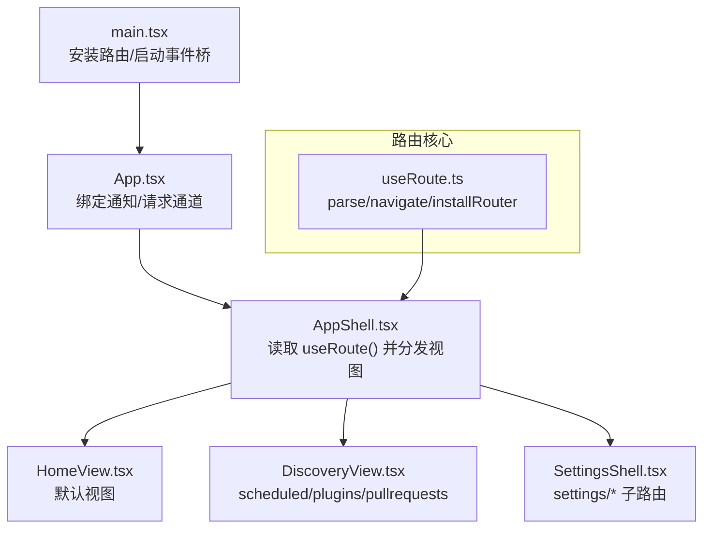
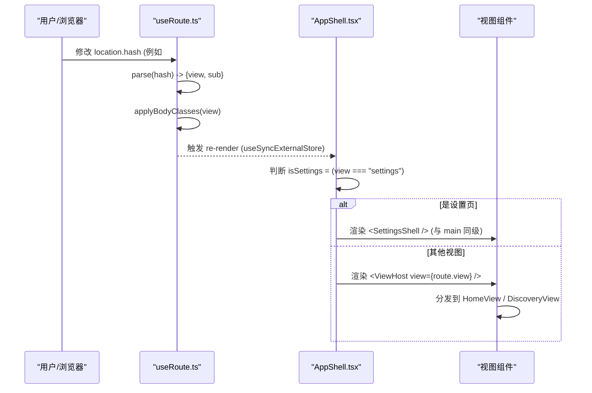
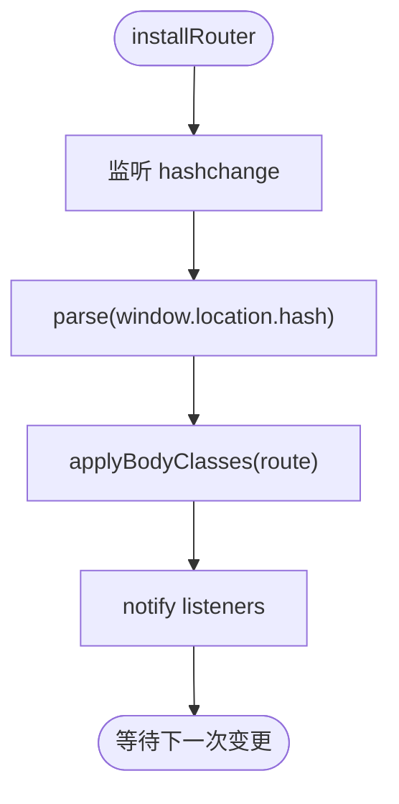
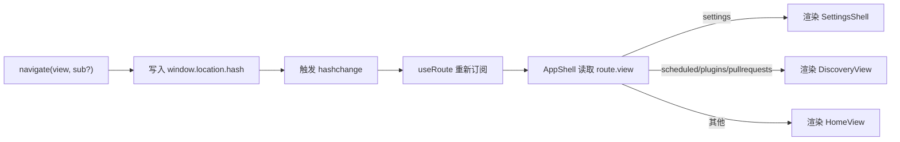
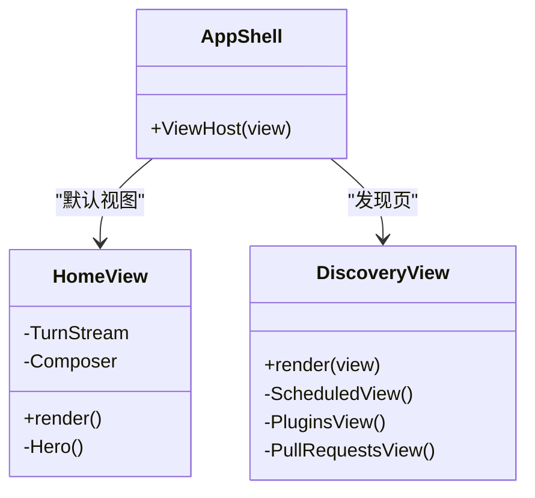
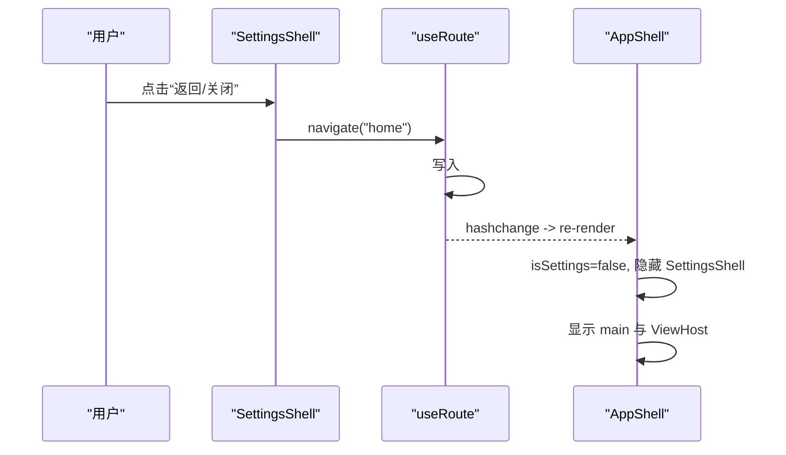
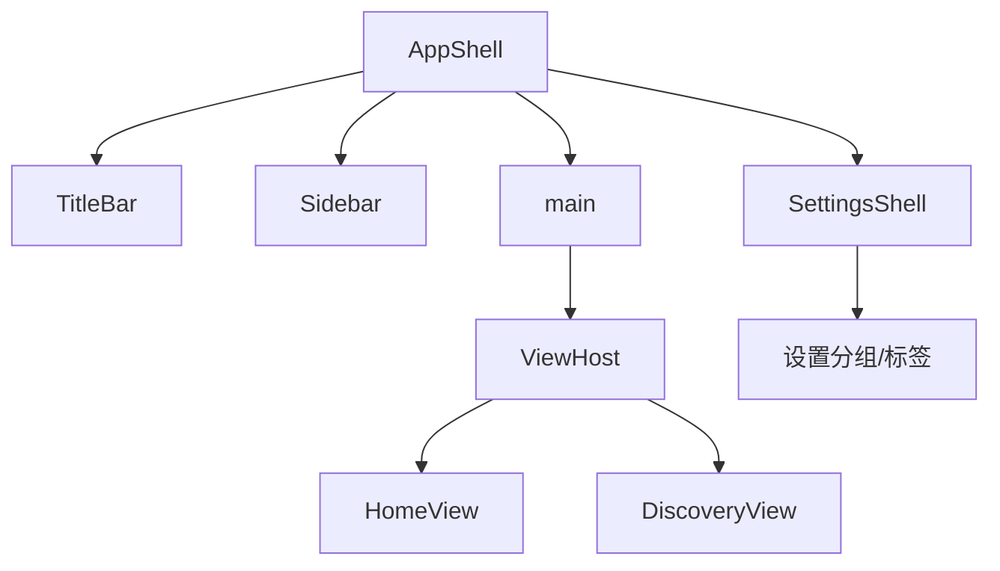
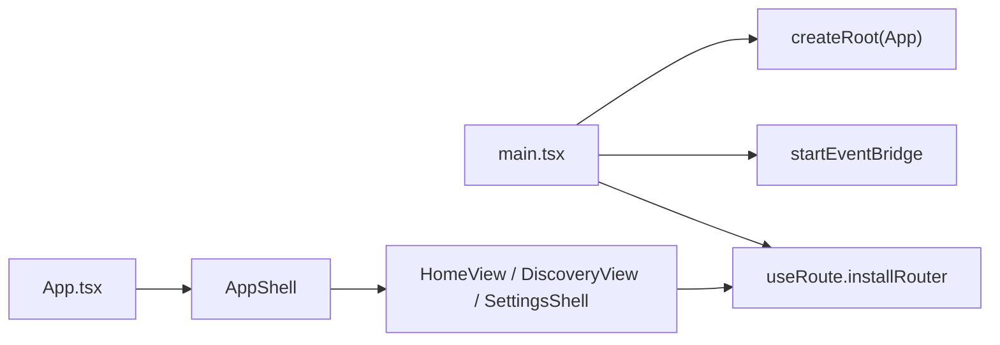

# 路由系统

<cite>
**本文引用的文件**
- [useRoute.ts](file://frontend/app/shell/useRoute.ts)
- [AppShell.tsx](file://frontend/app/shell/AppShell.tsx)
- [HomeView.tsx](file://frontend/app/views/HomeView.tsx)
- [DiscoveryView.tsx](file://frontend/app/views/DiscoveryView.tsx)
- [SettingsShell.tsx](file://frontend/app/views/settings/SettingsShell.tsx)
- [sections.ts](file://frontend/app/views/settings/sections.ts)
- [main.tsx](file://frontend/app/main.tsx)
- [App.tsx](file://frontend/app/App.tsx)
</cite>

## 目录
1. [简介](#简介)
2. [项目结构](#项目结构)
3. [核心组件](#核心组件)
4. [架构总览](#架构总览)
5. [详细组件分析](#详细组件分析)
6. [依赖关系分析](#依赖关系分析)
7. [性能考量](#性能考量)
8. [故障排查指南](#故障排查指南)
9. [结论](#结论)

## 简介
本文件为前端路由系统的完整技术文档，聚焦于基于 Hash 的轻量路由实现与视图映射、导航函数、设置页面的特殊处理以及视图切换行为。通过 useRoute Hook 暴露统一的路由状态，配合 AppShell 中的视图分发逻辑，将 URL 片段（hash）映射到 HomeView、DiscoveryView（含 scheduled/plugins/pullrequests）和 SettingsShell。同时说明设置页面如何通过 body 类名切换布局，以及与主内容区的层级关系。

## 项目结构
- 路由核心：位于 shell/useRoute.ts，提供 parse、navigate、useRoute、installRouter 等能力，并监听 hashchange 同步全局路由状态。
- 应用外壳：shell/AppShell.tsx 根据当前 route.view 渲染主视图或设置视图；设置视图作为 main 的同级节点渲染，以复用现有样式规则。
- 视图层：views/HomeView.tsx、views/DiscoveryView.tsx、views/settings/SettingsShell.tsx 分别承载对话首页、发现页（计划任务/插件/拉取请求）和设置页。
- 入口与装配：main.tsx 在首次渲染前安装路由并启动事件桥；App.tsx 负责协议事件与 store 的绑定，最终渲染 AppShell。

图表来源
- [main.tsx:38-42](file://frontend/app/main.tsx#L38-L42)
- [App.tsx:15-45](file://frontend/app/App.tsx#L15-L45)
- [AppShell.tsx:26-32](file://frontend/app/shell/AppShell.tsx#L26-L32)
- [useRoute.ts:16-78](file://frontend/app/shell/useRoute.ts#L16-L78)

章节来源
- [main.tsx:38-42](file://frontend/app/main.tsx#L38-L42)
- [App.tsx:15-45](file://frontend/app/App.tsx#L15-L45)
- [AppShell.tsx:26-32](file://frontend/app/shell/AppShell.tsx#L26-L32)
- [useRoute.ts:16-78](file://frontend/app/shell/useRoute.ts#L16-L78)

## 核心组件
- 路由核心 useRoute.ts
  - 解析规则：将 #view 或 #view/subpage 解析为 { view, sub }，默认 view 为 home。
  - 状态管理：维护 current Route 与 listeners 集合，通过 useSyncExternalStore 暴露给 React 组件订阅。
  - 导航函数：navigate(view, sub?) 写入 window.location.hash，避免重复赋值。
  - 副作用：installRouter() 监听 hashchange，更新 current、应用 body 类名并触发重渲染。
  - 设置页适配：applyBodyClasses 在 view === "settings" 时切换 body.settings-open，使样式按原设计生效。

- 应用外壳 AppShell.tsx
  - 视图分发：根据 route.view 选择 DiscoveryView（scheduled/plugins/pullrequests）或 HomeView；当 view === "settings" 时隐藏 main 并渲染同级 SettingsShell。
  - 上下文：提供 navigate、toggleSidebar、focusComposer、stepTask 等能力供子组件使用。
  - 快捷键与菜单：监听 Rust 菜单事件与全局快捷键，统一派发 action。

- 视图层
  - HomeView.tsx：对话首页，包含空态引导、TurnStream 与 Composer。
  - DiscoveryView.tsx：发现页，根据传入的 view 参数渲染 scheduled/plugins/pullrequests 三个子视图。
  - SettingsShell.tsx：设置页壳，左侧分组导航 + 右侧内容区，支持搜索过滤与返回/关闭操作。

章节来源
- [useRoute.ts:11-78](file://frontend/app/shell/useRoute.ts#L11-L78)
- [AppShell.tsx:26-32](file://frontend/app/shell/AppShell.tsx#L26-L32)
- [AppShell.tsx:188-200](file://frontend/app/shell/AppShell.tsx#L188-L200)
- [HomeView.tsx:135-206](file://frontend/app/views/HomeView.tsx#L135-L206)
- [DiscoveryView.tsx:261-265](file://frontend/app/views/DiscoveryView.tsx#L261-L265)
- [SettingsShell.tsx:66-160](file://frontend/app/views/settings/SettingsShell.tsx#L66-L160)

## 架构总览
下图展示了从 URL 变更到视图渲染的完整流程，包括路由解析、状态同步、视图分发与设置页的特殊布局处理。

图表来源
- [useRoute.ts:16-78](file://frontend/app/shell/useRoute.ts#L16-L78)
- [AppShell.tsx:26-32](file://frontend/app/shell/AppShell.tsx#L26-L32)
- [AppShell.tsx:188-200](file://frontend/app/shell/AppShell.tsx#L188-L200)

## 详细组件分析

### useRoute Hook 与路由状态管理
- 数据结构：Route 包含 view 与 sub 两个字段，sub 用于 settings 的子路由（如 account）。
- 解析与默认值：未提供 hash 时默认为 #home；split("/") 后首段为 view，其余拼接为 sub。
- 订阅机制：通过 useSyncExternalStore 将外部 store（window.location.hash）暴露为 React 状态，保证最小化重渲染。
- 导航：navigate 仅在不改变 hash 时才写入，减少不必要的 hashchange。
- 副作用：installRouter 在挂载时立即执行一次 onChange，确保初始路由正确。

图表来源
- [useRoute.ts:68-78](file://frontend/app/shell/useRoute.ts#L68-L78)
- [useRoute.ts:16-20](file://frontend/app/shell/useRoute.ts#L16-L20)
- [useRoute.ts:63-66](file://frontend/app/shell/useRoute.ts#L63-L66)

章节来源
- [useRoute.ts:11-78](file://frontend/app/shell/useRoute.ts#L11-L78)

### 视图映射与导航函数
- 视图映射规则：
  - scheduled/plugins/pullrequests -> DiscoveryView
  - 其他（含未知）-> HomeView
  - settings -> 不进入 ViewHost，而是直接渲染 SettingsShell
- 导航调用点：
  - Sidebar 中导航至 home/settings
  - DiscoveryView 中创建任务后跳转 home 并触发 prompt
  - SettingsShell 中“返回”与“关闭”均导航回 home
  - Composer 中跳转到 settings 的特定 tab

图表来源
- [useRoute.ts:48-54](file://frontend/app/shell/useRoute.ts#L48-L54)
- [AppShell.tsx:26-32](file://frontend/app/shell/AppShell.tsx#L26-L32)
- [AppShell.tsx:188-200](file://frontend/app/shell/AppShell.tsx#L188-L200)

章节来源
- [AppShell.tsx:26-32](file://frontend/app/shell/AppShell.tsx#L26-L32)
- [AppShell.tsx:188-200](file://frontend/app/shell/AppShell.tsx#L188-L200)
- [DiscoveryView.tsx:261-265](file://frontend/app/views/DiscoveryView.tsx#L261-L265)

### 内置视图：HomeView 与 DiscoveryView
- HomeView
  - 职责：对话首页，组合空态引导、TurnStream 与 Composer。
  - 数据流：通过 appStore 与 turnStore 同步会话与历史；首次加载探测引擎状态。
  - 交互：提示卡片通过自定义事件驱动 Composer 填充输入。

- DiscoveryView
  - 职责：发现页容器，根据 view 参数渲染 scheduled/plugins/pullrequests。
  - 数据获取：封装 useBackendList 统一处理 IPC 失败时的本地存储与种子数据。
  - 导航：创建任务后可导航回 home 并通过事件注入 prompt。

图表来源
- [HomeView.tsx:135-206](file://frontend/app/views/HomeView.tsx#L135-L206)
- [DiscoveryView.tsx:261-265](file://frontend/app/views/DiscoveryView.tsx#L261-L265)
- [AppShell.tsx:26-32](file://frontend/app/shell/AppShell.tsx#L26-L32)

章节来源
- [HomeView.tsx:135-206](file://frontend/app/views/HomeView.tsx#L135-L206)
- [DiscoveryView.tsx:261-265](file://frontend/app/views/DiscoveryView.tsx#L261-L265)

### 设置页面的特殊处理与视图切换
- 布局特殊性
  - SettingsShell 作为 main 的同级节点渲染，避免被 .main 隐藏。
  - 通过 body.settings-open 控制侧边栏与主内容的显示，保持与原有样式一致。
- 子路由与分组
  - settings 的子路由通过 route.sub 表示，如 #settings/account。
  - sections.ts 定义分组与标签，SettingsShell 据此渲染侧边栏与内容区。
- 导航与动画
  - “返回”与“关闭”按钮均调用 navigate("home") 回到首页。
  - 抽屉式面板（ManualSchedDrawer）通过 CSS 过渡实现打开/关闭动画（由组件内部 state 控制）。

图表来源
- [SettingsShell.tsx:85-160](file://frontend/app/views/settings/SettingsShell.tsx#L85-L160)
- [useRoute.ts:48-54](file://frontend/app/shell/useRoute.ts#L48-L54)
- [AppShell.tsx:188-200](file://frontend/app/shell/AppShell.tsx#L188-L200)

章节来源
- [SettingsShell.tsx:85-160](file://frontend/app/views/settings/SettingsShell.tsx#L85-L160)
- [sections.ts:44-95](file://frontend/app/views/settings/sections.ts#L44-L95)
- [useRoute.ts:63-66](file://frontend/app/shell/useRoute.ts#L63-L66)

### 路由图与视图层次结构
- 路由图
  - #home -> HomeView
  - #scheduled -> DiscoveryView(scheduled)
  - #plugins -> DiscoveryView(plugins)
  - #pullrequests -> DiscoveryView(pullrequests)
  - #settings -> SettingsShell（无子路由时默认 general）
  - #settings/<tab> -> SettingsShell 对应 tab

- 视图层次
  - AppShell 顶层容器
    - TitleBar
    - Sidebar
    - main（隐藏时为设置页）
      - ViewHost（HomeView 或 DiscoveryView）
    - SettingsShell（与 main 同级）

图表来源
- [AppShell.tsx:190-200](file://frontend/app/shell/AppShell.tsx#L190-L200)
- [AppShell.tsx:26-32](file://frontend/app/shell/AppShell.tsx#L26-L32)
- [SettingsShell.tsx:85-160](file://frontend/app/views/settings/SettingsShell.tsx#L85-L160)

## 依赖关系分析
- 入口装配
  - main.tsx 在渲染前安装路由并启动事件桥，确保首次绘制时路由已知。
  - App.tsx 负责协议事件与 store 的绑定，最终渲染 AppShell。
- 组件耦合
  - AppShell 依赖 useRoute 获取当前路由，并决定渲染哪个视图。
  - 各视图通过 navigate 进行跨视图导航，形成松耦合的单向数据流。
  - 设置页通过 sections.ts 的配置驱动 UI，避免硬编码路由字符串。

图表来源
- [main.tsx:38-42](file://frontend/app/main.tsx#L38-L42)
- [App.tsx:15-45](file://frontend/app/App.tsx#L15-L45)
- [AppShell.tsx:26-32](file://frontend/app/shell/AppShell.tsx#L26-L32)

章节来源
- [main.tsx:38-42](file://frontend/app/main.tsx#L38-L42)
- [App.tsx:15-45](file://frontend/app/App.tsx#L15-L45)
- [AppShell.tsx:26-32](file://frontend/app/shell/AppShell.tsx#L26-L32)

## 性能考量
- 路由状态订阅
  - 使用 useSyncExternalStore 直接订阅外部 store，避免额外中间层带来的重渲染开销。
- 导航去抖
  - navigate 仅在 hash 变化时写入，避免重复触发 hashchange。
- 视图分发
  - AppShell 中简单的条件分支决定渲染目标，复杂度低，易于扩展新视图。
- 设置页布局
  - 通过 body 类名切换布局，复用现有 CSS，减少 DOM 结构调整成本。

[本节为通用指导，无需具体文件引用]

## 故障排查指南
- 设置页布局异常
  - 现象：设置页未全屏或侧边栏仍可见。
  - 排查：确认 installRouter 已调用且 body.settings-open 是否正确切换。
  - 参考：[useRoute.ts:63-66](file://frontend/app/shell/useRoute.ts#L63-L66)

- 路由未生效
  - 现象：导航后视图未更新。
  - 排查：检查 navigate 是否写入 hash；确认 AppShell 是否读取 useRoute；确认 installRouter 是否在渲染前调用。
  - 参考：[useRoute.ts:48-54](file://frontend/app/shell/useRoute.ts#L48-L54)、[AppShell.tsx:188-200](file://frontend/app/shell/AppShell.tsx#L188-L200)、[main.tsx:38-42](file://frontend/app/main.tsx#L38-L42)

- 设置页子路由无效
  - 现象：#settings/account 无法定位到对应标签。
  - 排查：确认 sections.ts 中是否存在该 tab id；SettingsShell 是否正确读取 route.sub。
  - 参考：[sections.ts:44-95](file://frontend/app/views/settings/sections.ts#L44-L95)、[SettingsShell.tsx:66-84](file://frontend/app/views/settings/SettingsShell.tsx#L66-L84)

章节来源
- [useRoute.ts:63-66](file://frontend/app/shell/useRoute.ts#L63-L66)
- [useRoute.ts:48-54](file://frontend/app/shell/useRoute.ts#L48-L54)
- [AppShell.tsx:188-200](file://frontend/app/shell/AppShell.tsx#L188-L200)
- [main.tsx:38-42](file://frontend/app/main.tsx#L38-L42)
- [sections.ts:44-95](file://frontend/app/views/settings/sections.ts#L44-L95)
- [SettingsShell.tsx:66-84](file://frontend/app/views/settings/SettingsShell.tsx#L66-L84)

## 结论
本项目采用极简的 Hash 路由方案，通过 useRoute Hook 统一管理路由状态，并在 AppShell 中进行视图分发。HomeView 与 DiscoveryView 覆盖主要业务场景，设置页通过特殊的同级渲染与 body 类名切换实现与原有样式的一致性。整体架构清晰、扩展性强，便于后续新增视图与子路由。

[本节为总结性内容，无需具体文件引用]