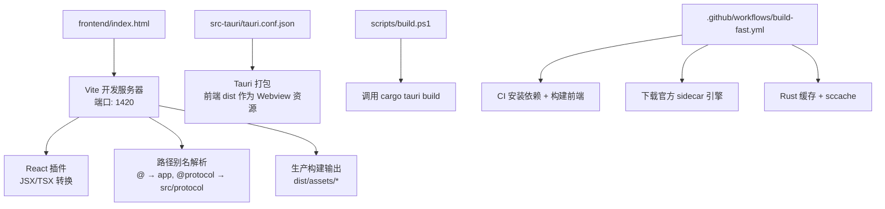
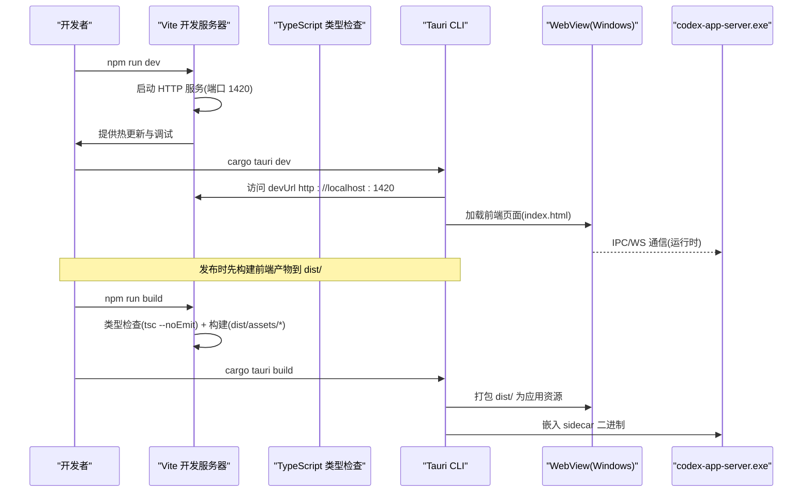
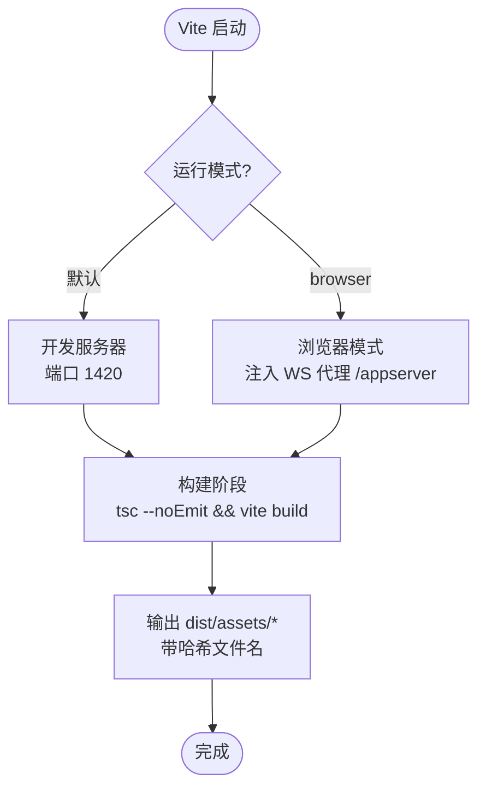
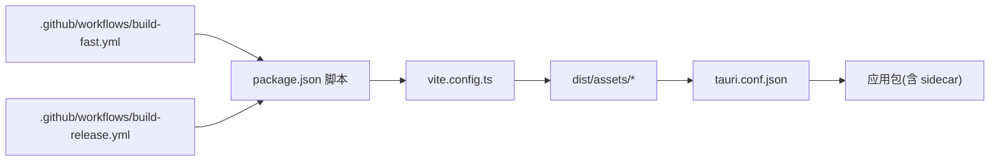

# 构建与开发配置

<cite>
**本文引用的文件**
- [frontend/package.json](file://frontend/package.json)
- [frontend/vite.config.ts](file://frontend/vite.config.ts)
- [frontend/tsconfig.json](file://frontend/tsconfig.json)
- [frontend/index.html](file://frontend/index.html)
- [src-tauri/tauri.conf.json](file://src-tauri/tauri.conf.json)
- [scripts/build.ps1](file://scripts/build.ps1)
- [.github/workflows/build-fast.yml](file://.github/workflows/build-fast.yml)
- [.github/workflows/build-release.yml](file://.github/workflows/build-release.yml)
</cite>

## 目录
1. [简介](#简介)
2. [项目结构](#项目结构)
3. [核心组件](#核心组件)
4. [架构总览](#架构总览)
5. [详细组件分析](#详细组件分析)
6. [依赖关系分析](#依赖关系分析)
7. [性能考量](#性能考量)
8. [故障排查指南](#故障排查指南)
9. [结论](#结论)
10. [附录](#附录)

## 简介
本文件面向 Codex-Tauri 前端构建与开发配置，系统性梳理 Vite 构建工具、TypeScript 编译、路径别名、类型检查规则、package.json 脚本命令与 CI/CD 工作流。文档同时给出从源码到可执行文件的完整构建流程图与优化策略，帮助开发者快速理解并高效维护前端工程。

## 项目结构
前端位于 frontend 目录，采用 React + TypeScript + Vite 的现代前端工程化方案；Tauri 壳层位于 src-tauri，负责将前端产物打包为桌面应用。关键入口与配置文件如下：
- 前端入口 HTML：index.html
- 前端构建配置：vite.config.ts
- TypeScript 配置：tsconfig.json
- 包管理与脚本：package.json
- Tauri 配置：src-tauri/tauri.conf.json
- 本地构建脚本：scripts/build.ps1
- CI/CD 工作流：.github/workflows/*.yml

图表来源
- [frontend/vite.config.ts:59-103](file://frontend/vite.config.ts#L59-L103)
- [frontend/index.html:157-161](file://frontend/index.html#L157-L161)
- [src-tauri/tauri.conf.json:6-11](file://src-tauri/tauri.conf.json#L6-L11)
- [scripts/build.ps1:11-18](file://scripts/build.ps1#L11-L18)
- [.github/workflows/build-fast.yml:67-93](file://.github/workflows/build-fast.yml#L67-L93)

章节来源
- [frontend/vite.config.ts:59-103](file://frontend/vite.config.ts#L59-L103)
- [frontend/index.html:157-161](file://frontend/index.html#L157-L161)
- [src-tauri/tauri.conf.json:6-11](file://src-tauri/tauri.conf.json#L6-L11)
- [scripts/build.ps1:11-18](file://scripts/build.ps1#L11-L18)
- [.github/workflows/build-fast.yml:67-93](file://.github/workflows/build-fast.yml#L67-L93)

## 核心组件
本节聚焦前端构建的核心配置项与职责划分：
- Vite 构建与开发服务器：端口、严格端口、输出目录、目标引擎、SourceMap、Rollup 输出命名、插件注册、浏览器模式代理等
- TypeScript 编译：目标、模块解析、严格模式、路径映射、类型声明、仅类型检查
- package.json 脚本：开发、构建、预览、浏览器模式、类型检查
- Tauri 集成：devUrl、前端产物目录、安全策略、资源嵌入

章节来源
- [frontend/vite.config.ts:59-103](file://frontend/vite.config.ts#L59-L103)
- [frontend/tsconfig.json:1-35](file://frontend/tsconfig.json#L1-L35)
- [frontend/package.json:7-14](file://frontend/package.json#L7-L14)
- [src-tauri/tauri.conf.json:6-11](file://src-tauri/tauri.conf.json#L6-L11)

## 架构总览
下图展示从源代码到可执行文件的端到端流程，包括开发模式与发布模式的差异点。

图表来源
- [frontend/vite.config.ts:97-100](file://frontend/vite.config.ts#L97-L100)
- [frontend/package.json:7-14](file://frontend/package.json#L7-L14)
- [src-tauri/tauri.conf.json:6-11](file://src-tauri/tauri.conf.json#L6-L11)
- [.github/workflows/build-fast.yml:67-93](file://.github/workflows/build-fast.yml#L67-L93)

## 详细组件分析

### Vite 构建配置（开发服务器、生产优化、插件与代码分割）
- 开发服务器
  - 端口固定为 1420，strictPort 确保不自动切换端口，便于 Tauri devUrl 稳定指向
  - clearScreen 关闭以保留终端历史，便于调试
- 生产构建
  - outDir 输出至 dist，emptyOutDir 清理旧产物
  - target 设置为 es2022，适配现代 WebView2/WebKit
  - sourcemap 开启，便于线上问题定位
  - Rollup 输出命名使用哈希，利于缓存与版本管理
- 插件与别名
  - 启用 @vitejs/plugin-react，支持 JSX/TSX
  - 路径别名：@ → app，@protocol → src/protocol
  - 浏览器模式（npm run dev:browser）下，将 @tauri-apps/api/core 与 event 重定向到本地 devbridge 实现，并提供 /appserver WebSocket 代理，用于在浏览器中回放 shell 命令表面
- 公共静态资源
  - publicDir 禁用，所有资源走 Vite 管线，保证现有样式中的 url() 引用正确解析

图表来源
- [frontend/vite.config.ts:19-57](file://frontend/vite.config.ts#L19-L57)
- [frontend/vite.config.ts:59-103](file://frontend/vite.config.ts#L59-L103)
- [frontend/package.json:7-14](file://frontend/package.json#L7-L14)

章节来源
- [frontend/vite.config.ts:19-57](file://frontend/vite.config.ts#L19-L57)
- [frontend/vite.config.ts:59-103](file://frontend/vite.config.ts#L59-L103)
- [frontend/package.json:7-14](file://frontend/package.json#L7-L14)

### TypeScript 编译配置（目标、模块、路径别名与类型检查）
- 目标与库
  - target ES2022，lib 包含 ES2023、DOM、DOM.Iterable，匹配现代环境
- 模块与解析
  - module ESNext，moduleResolution bundler，适配 Vite 的模块解析策略
- JSX
  - jsx react-jsx，配合 React 19 的新 JSX 运行时
- 类型与严格性
  - strict 开启，noUncheckedIndexedAccess、noImplicitOverride、noFallthroughCasesInSwitch 提升健壮性
  - noEmit true，仅做类型检查，由 Vite 负责转译与打包
  - isolatedModules、verbatimModuleSyntax 提升增量编译与模块语义一致性
  - skipLibCheck true 加速构建
  - allowJs true 允许渐进迁移，checkJs false 避免对 JS 进行类型检查
- 路径映射
  - baseUrl "."，paths 定义 @/* → app/*，@protocol/* → src/protocol/*
  - 与 vite.config.ts 的 resolve.alias 保持一致，确保 IDE 与构建一致

章节来源
- [frontend/tsconfig.json:1-35](file://frontend/tsconfig.json#L1-L35)

### package.json 依赖管理与脚本命令
- 依赖
  - 运行时依赖：react、react-dom、@tauri-apps/api
  - 开发依赖：typescript、vite、@vitejs/plugin-react、ws 及其类型
- 脚本命令
  - dev：启动 Vite 开发服务器
  - build：先执行 tsc --noEmit 类型检查，再执行 vite build
  - build:only：跳过类型检查直接构建
  - typecheck：仅类型检查
  - preview：预览构建产物
  - dev:browser：以 browser 模式启动，启用 WebSocket 代理与 Tauri API 桥接

章节来源
- [frontend/package.json:15-29](file://frontend/package.json#L15-L29)
- [frontend/package.json:7-14](file://frontend/package.json#L7-L14)

### Tauri 集成与产物组织
- 构建配置
  - devUrl 指向 http://localhost:1420，与 Vite 开发服务器端口一致
  - frontendDist 指向 ../frontend/dist，Tauri 打包时将此处产物作为 Webview 资源
- 应用与安全
  - withGlobalTauri 开启，方便全局访问 Tauri API
  - 窗口尺寸、最小尺寸、可调整大小、无边框等 UI 行为
  - security.csp 为空，assetProtocol 启用并开放范围，便于资源访问
- 打包资源
  - bundle.resources 嵌入 codex-app-server.exe 作为 sidecar
  - windows.webviewInstallMode 使用 downloadBootstrapper 安装 WebView2

章节来源
- [src-tauri/tauri.conf.json:6-11](file://src-tauri/tauri.conf.json#L6-L11)
- [src-tauri/tauri.conf.json:12-35](file://src-tauri/tauri.conf.json#L12-L35)
- [src-tauri/tauri.conf.json:37-51](file://src-tauri/tauri.conf.json#L37-L51)

### 启动页与错误兜底
- index.html 内置启动动画与错误提示逻辑
- 若模块图无法加载或解析失败，超时后显示错误信息，避免界面永久卡住
- 通过 window.__codexRevealSplash 暴露方法供主流程调用以隐藏启动页

章节来源
- [frontend/index.html:15-62](file://frontend/index.html#L15-L62)
- [frontend/index.html:147-161](file://frontend/index.html#L147-L161)

## 依赖关系分析
- 前端与 Tauri
  - Vite 构建产物输出到 dist，Tauri 读取该目录作为 Webview 资源
  - 开发模式下，Tauri 通过 devUrl 连接 Vite 开发服务器
- 浏览器模式与 WebSocket 代理
  - 在浏览器模式下，Vite 插件拦截 /appserver 升级请求，转发到后端引擎地址（可通过环境变量 CODEX_APP_SERVER_WS 指定），解决浏览器 Origin 限制
- CI/CD 与工作流
  - build-fast：日常构建，Node 22，安装依赖、类型检查与构建前端，下载官方 sidecar，Rust 缓存与 sccache 加速，最终产出 portable 包
  - build-release：正式发行构建，步骤类似但产物上传为长期保留制品

图表来源
- [frontend/package.json:7-14](file://frontend/package.json#L7-L14)
- [frontend/vite.config.ts:59-103](file://frontend/vite.config.ts#L59-L103)
- [src-tauri/tauri.conf.json:6-11](file://src-tauri/tauri.conf.json#L6-L11)
- [.github/workflows/build-fast.yml:67-93](file://.github/workflows/build-fast.yml#L67-L93)
- [.github/workflows/build-release.yml:46-60](file://.github/workflows/build-release.yml#L46-L60)

章节来源
- [frontend/package.json:7-14](file://frontend/package.json#L7-L14)
- [frontend/vite.config.ts:59-103](file://frontend/vite.config.ts#L59-L103)
- [src-tauri/tauri.conf.json:6-11](file://src-tauri/tauri.conf.json#L6-L11)
- [.github/workflows/build-fast.yml:67-93](file://.github/workflows/build-fast.yml#L67-L93)
- [.github/workflows/build-release.yml:46-60](file://.github/workflows/build-release.yml#L46-L60)

## 性能考量
- 构建目标与兼容性
  - 目标 es2022，充分利用现代引擎能力，减少 polyfill 体积
- SourceMap
  - 生产开启 sourcemap，便于线上问题定位；如需进一步减小体积可在发布前按需关闭
- 资源与缓存
  - 输出文件名带哈希，利于浏览器与 CDN 缓存
  - 禁用 publicDir，所有资源经 Vite 管线处理，避免重复与未优化资源
- 类型检查分离
  - 构建前执行 tsc --noEmit，类型检查与打包解耦，提高迭代速度
- CI 加速
  - 使用 sccache、Rust 缓存、预缓存 cargo-tauri 与官方 sidecar，显著缩短构建时间

[本节为通用性能建议，无需特定文件引用]

## 故障排查指南
- 启动页卡死或无响应
  - 检查 index.html 中的启动页逻辑与错误捕获，确认模块图是否成功加载
  - 若出现解析或加载错误，会显示错误信息并移除启动页
- 开发服务器端口冲突
  - Vite 配置 strictPort 为 true，端口固定为 1420；如被占用需释放端口或修改配置
- 浏览器模式 WebSocket 代理不可用
  - 确认已使用 npm run dev:browser 启动，且后端引擎地址可通过 CODEX_APP_SERVER_WS 设置
  - 检查 /appserver 路径是否被正确代理到上游引擎
- 构建失败
  - 先执行 npm run typecheck 定位类型错误
  - 查看构建日志与 sourcemap 定位问题
- Tauri 打包找不到前端产物
  - 确认 frontend/dist 存在且包含预期资源
  - 检查 tauri.conf.json 的 frontendDist 指向是否正确

章节来源
- [frontend/index.html:15-62](file://frontend/index.html#L15-L62)
- [frontend/vite.config.ts:97-100](file://frontend/vite.config.ts#L97-L100)
- [frontend/vite.config.ts:19-57](file://frontend/vite.config.ts#L19-L57)
- [src-tauri/tauri.conf.json:6-11](file://src-tauri/tauri.conf.json#L6-L11)

## 结论
本项目通过 Vite + TypeScript + Tauri 的组合，实现了现代化的前端构建与桌面应用打包流程。Vite 提供了高效的开发与构建体验，TypeScript 保证了类型安全与可维护性，Tauri 将前端产物无缝集成到原生应用中。CI/CD 工作流确保了构建的一致性与可重复性。遵循本文的配置说明与最佳实践，可有效提升开发效率与产品质量。

[本节为总结性内容，无需特定文件引用]

## 附录
- 常用命令
  - 开发：npm run dev
  - 构建：npm run build
  - 仅构建：npm run build:only
  - 类型检查：npm run typecheck
  - 预览：npm run preview
  - 浏览器模式：npm run dev:browser
- 本地构建脚本
  - scripts/build.ps1：封装 Rust 与 Tauri 构建流程，生成安装包并整理产物

章节来源
- [frontend/package.json:7-14](file://frontend/package.json#L7-L14)
- [scripts/build.ps1:1-24](file://scripts/build.ps1#L1-L24)