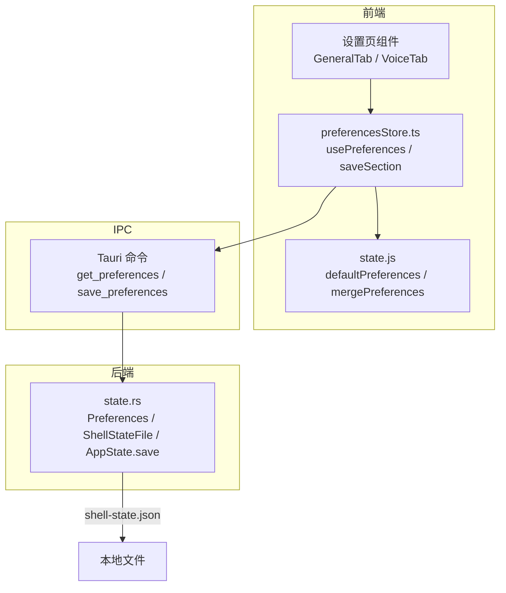
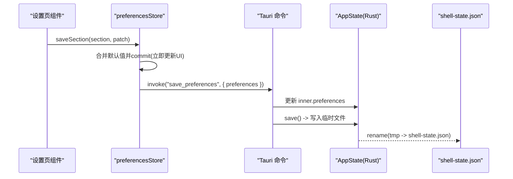
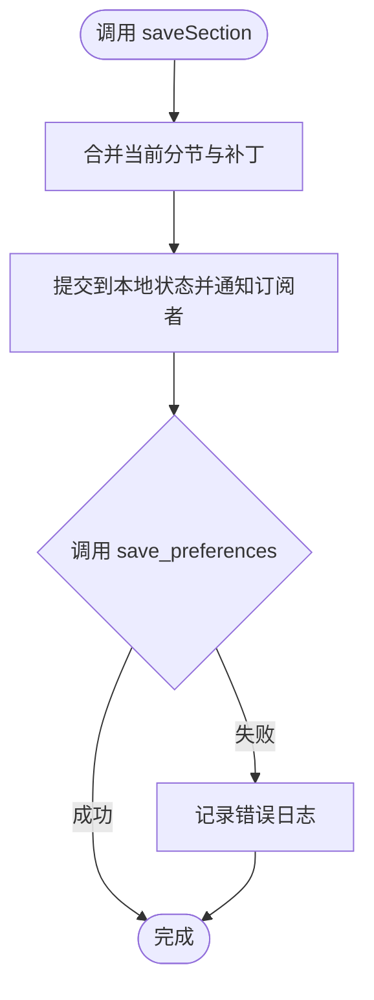
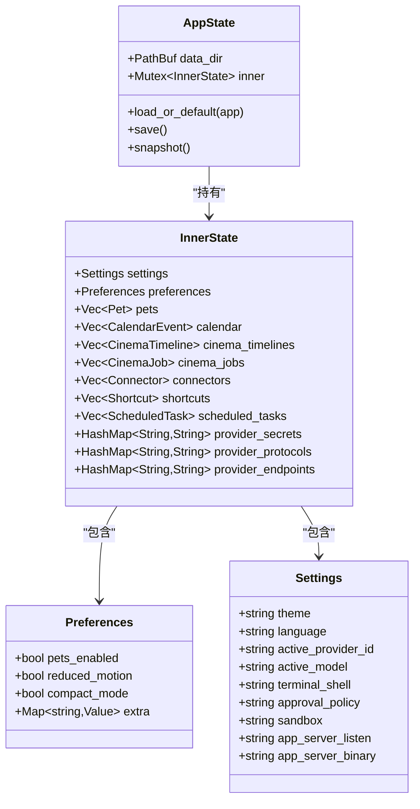
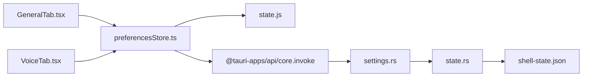

# 偏好设置存储 (preferencesStore)

<cite>
**本文引用的文件**
- [preferencesStore.ts](file://frontend/app/state/preferencesStore.ts)
- [state.js](file://frontend/src/js/state.js)
- [settings.rs](file://src-tauri/src/commands/settings.rs)
- [state.rs](file://src-tauri/src/state.rs)
- [GeneralTab.tsx](file://frontend/app/views/settings/tabs/GeneralTab.tsx)
- [VoiceTab.tsx](file://frontend/app/views/settings/tabs/VoiceTab.tsx)
</cite>

## 目录
1. [简介](#简介)
2. [项目结构](#项目结构)
3. [核心组件](#核心组件)
4. [架构总览](#架构总览)
5. [详细组件分析](#详细组件分析)
6. [依赖关系分析](#依赖关系分析)
7. [性能考量](#性能考量)
8. [故障排查指南](#故障排查指南)
9. [结论](#结论)
10. [附录：使用示例与最佳实践](#附录使用示例与最佳实践)

## 简介
本模块为 Codex-Tauri 的“偏好设置存储”子系统，负责在 React 前端维护用户偏好（appearance、voice、browser、git、worktrees 等），并通过 Tauri IPC 与 Rust 后端交互，将偏好持久化到本地 shell-state.json。其设计目标包括：
- 以“分节对象”组织偏好，新增分节无需改动后端；
- 默认值作为唯一事实来源，前后端保持一致；
- 先更新 UI 再落盘，保证即时响应；
- 具备容错加载与错误恢复策略，避免启动失败导致页面空白；
- 通过版本迁移与合并策略保障数据兼容性。

## 项目结构
偏好设置涉及前端状态管理、默认值定义、Tauri 命令与 Rust 状态持久化四个层面：
- 前端状态层：preferencesStore.ts 提供订阅式状态、读取/写入 API；
- 默认值层：state.js 定义各分节的默认结构与字段；
- IPC 命令层：settings.rs 暴露 get_preferences/save_preferences 等命令；
- 持久化层：state.rs 中的 Preferences 结构体与 ShellStateFile 负责序列化/反序列化与磁盘 IO。

图表来源
- [preferencesStore.ts:40-88](file://frontend/app/state/preferencesStore.ts#L40-L88)
- [state.js:60-136](file://frontend/src/js/state.js#L60-L136)
- [settings.rs:35-52](file://src-tauri/src/commands/settings.rs#L35-L52)
- [state.rs:49-64](file://src-tauri/src/state.rs#L49-L64)
- [state.rs:176-217](file://src-tauri/src/state.rs#L176-L217)

章节来源
- [preferencesStore.ts:1-94](file://frontend/app/state/preferencesStore.ts#L1-L94)
- [state.js:60-136](file://frontend/src/js/state.js#L60-L136)
- [settings.rs:35-52](file://src-tauri/src/commands/settings.rs#L35-L52)
- [state.rs:49-64](file://src-tauri/src/state.rs#L49-L64)
- [state.rs:176-217](file://src-tauri/src/state.rs#L176-L217)

## 核心组件
- 前端状态与订阅：
  - usePreferences/usePrefSection/getPrefSection：提供全局偏好快照与按分节读取；
  - loadPreferences：一次性从后端加载并合并默认值；
  - saveSection：局部补丁合并后写回整个 preferences 映射；
  - emitShellEvent：触发壳层事件以联动其他模块。
- 默认值与合并：
  - defaultPreferences：定义 appearance、voice、personalization、pets、browser、computerUse、git、environments、worktrees 等分节及默认值；
  - mergePreferences：按分节深度合并，确保新字段有默认值且旧字段不丢失。
- 后端命令与持久化：
  - get_preferences/save_preferences：读写 Rust 侧 Preferences；
  - Preferences 结构体包含 pets_enabled/reduced_motion/compact_mode 以及用 flatten 扩展的 extra 任意分节；
  - AppState.save：原子写入 shell-state.json（先写临时文件再 rename）。

章节来源
- [preferencesStore.ts:17-94](file://frontend/app/state/preferencesStore.ts#L17-L94)
- [state.js:60-136](file://frontend/src/js/state.js#L60-L136)
- [settings.rs:35-52](file://src-tauri/src/commands/settings.rs#L35-L52)
- [state.rs:49-64](file://src-tauri/src/state.rs#L49-L64)
- [state.rs:176-217](file://src-tauri/src/state.rs#L176-L217)

## 架构总览
偏好设置的数据流遵循“前端优先更新 + 异步落盘”的模式：
- 读取流程：应用启动时调用 loadPreferences，通过 invoke("get_preferences") 获取后端存储的原始偏好，再用 mergePreferences 与默认值合并，提交到本地状态并通知订阅者；
- 写入流程：UI 变更调用 saveSection(section, patch)，先合并生成新的 preferences 并提交到本地状态（立即刷新 UI），再异步调用 invoke("save_preferences", { preferences }) 持久化；
- 持久化：Rust 侧保存至 AppState.inner.preferences，并在 save_ok 中调用 AppState.save 将整体状态写入 shell-state.json。

图表来源
- [preferencesStore.ts:76-88](file://frontend/app/state/preferencesStore.ts#L76-L88)
- [settings.rs:45-52](file://src-tauri/src/commands/settings.rs#L45-L52)
- [state.rs:209-217](file://src-tauri/src/state.rs#L209-L217)

## 详细组件分析

### 前端偏好状态 store（preferencesStore.ts）
- 数据结构：
  - PrefSection = Record<string, unknown>
  - Preferences = Record<string, PrefSection>
- 关键行为：
  - subscribe/getSnapshot：基于 useSyncExternalStore 实现 React 外部状态订阅；
  - loadPreferences：仅首次加载，捕获异常并降级为默认值；
  - saveSection：先本地 commit，再异步持久化，失败记录日志但不阻断 UI；
  - emitShellEvent：用于跨模块广播偏好变化（如外观、宠物等）。

图表来源
- [preferencesStore.ts:76-88](file://frontend/app/state/preferencesStore.ts#L76-L88)

章节来源
- [preferencesStore.ts:17-94](file://frontend/app/state/preferencesStore.ts#L17-L94)

### 默认值与合并策略（state.js）
- 默认分节与字段：
  - appearance：主题、强调色、字体、字号、对比度、动效、指针光标、差异标记等；
  - voice：TTS、快捷键、保留栏、词典、麦克风、最近项；
  - personalization：人格、自定义指令、记忆开关；
  - pets：选中宠物、目录、尺寸、睡眠状态；
  - browser：启用、打开目标、截图策略、下载路径、权限、开发者模式、CDP 访问；
  - computerUse：任意应用、Excel、白名单；
  - git：分支前缀、合并方式、强制推送、草稿 PR、审查交付、自动合并、各类指令模板；
  - environments/worktrees：环境与工作树相关配置。
- 合并逻辑：
  - mergePreferences 对每个分节进行浅合并，确保新增字段有默认值，同时保留已有值；
  - 该函数是“单一事实来源”，React 与旧版 vanilla 层共享，防止漂移。

章节来源
- [state.js:60-136](file://frontend/src/js/state.js#L60-L136)

### 后端命令与状态（settings.rs / state.rs）
- 命令：
  - get_preferences：返回 AppState.inner.preferences；
  - save_preferences：替换 AppState.inner.preferences 并调用 save_ok 持久化。
- 数据结构：
  - Preferences：包含 pets_enabled/reduced_motion/compact_mode 以及用 #[serde(flatten)] 的 extra 字段，用于承载任意分节键值对；
  - ShellStateFile：与 InnerState 双向转换，统一序列化；
  - AppState.save：原子写入 shell-state.json（先写 .tmp 再 rename）。
- 版本迁移与兼容性：
  - 由于 extra 使用 flatten，新增分节不会破坏反序列化；
  - 前端 mergePreferences 保证缺失字段有默认值，从而兼容历史数据。

图表来源
- [state.rs:27-64](file://src-tauri/src/state.rs#L27-L64)
- [state.rs:150-174](file://src-tauri/src/state.rs#L150-L174)
- [state.rs:176-217](file://src-tauri/src/state.rs#L176-L217)

章节来源
- [settings.rs:35-52](file://src-tauri/src/commands/settings.rs#L35-L52)
- [state.rs:27-64](file://src-tauri/src/state.rs#L27-L64)
- [state.rs:150-174](file://src-tauri/src/state.rs#L150-L174)
- [state.rs:176-217](file://src-tauri/src/state.rs#L176-L217)

### 设置页使用示例（GeneralTab / VoiceTab）
- GeneralTab：
  - 使用 usePrefSection("general") 读取 general 分节；
  - 通过 saveSection("general", patch) 保存各项设置（如任务文件夹、终端 Shell、底部面板、提示建议、插件开关、发送快捷键、跟随处理模式、弹出窗口快捷键、独立聊天、通知策略、彩纸特效等）。
- VoiceTab：
  - 使用 usePrefSection("voice") 读取 voice 分节；
  - 保存麦克风选择、语音语言重试状态、按住/切换快捷键、词典条目等。

章节来源
- [GeneralTab.tsx:93-113](file://frontend/app/views/settings/tabs/GeneralTab.tsx#L93-L113)
- [VoiceTab.tsx:45-77](file://frontend/app/views/settings/tabs/VoiceTab.tsx#L45-L77)

## 依赖关系分析
- 前端依赖：
  - preferencesStore.ts 依赖 state.js 的 defaultPreferences/mergePreferences；
  - 设置页组件依赖 preferencesStore 提供的 usePrefSection/saveSection；
  - 通过 @tauri-apps/api/core 的 invoke 调用后端命令。
- 后端依赖：
  - settings.rs 依赖 state.rs 的 AppState/Preferences；
  - 持久化依赖文件系统（dirs::config_dir 下的 CodexDesktop/shell-state.json）。

图表来源
- [GeneralTab.tsx:93-113](file://frontend/app/views/settings/tabs/GeneralTab.tsx#L93-L113)
- [VoiceTab.tsx:45-77](file://frontend/app/views/settings/tabs/VoiceTab.tsx#L45-L77)
- [preferencesStore.ts:13-15](file://frontend/app/state/preferencesStore.ts#L13-L15)
- [settings.rs:35-52](file://src-tauri/src/commands/settings.rs#L35-L52)
- [state.rs:176-217](file://src-tauri/src/state.rs#L176-L217)

章节来源
- [preferencesStore.ts:13-15](file://frontend/app/state/preferencesStore.ts#L13-L15)
- [settings.rs:35-52](file://src-tauri/src/commands/settings.rs#L35-L52)
- [state.rs:176-217](file://src-tauri/src/state.rs#L176-L217)

## 性能考量
- 本地优先更新：saveSection 先 commit 再持久化，减少 UI 等待时间；
- 一次性加载：loadPreferences 使用 loaded 标志避免重复请求；
- 原子写入：Rust 侧先写临时文件再 rename，降低损坏风险；
- 合并开销：mergePreferences 按分节浅合并，复杂度 O(N) 分节数，通常较小；
- 事件广播：emitShellEvent 使用原生 CustomEvent，开销低，适合轻量通知。

[本节为通用指导，不直接分析具体文件]

## 故障排查指南
- 加载失败：
  - 现象：控制台输出 “[preferences] load failed; using defaults”；
  - 原因：invoke("get_preferences") 抛错（例如后端未就绪或数据损坏）；
  - 处理：已降级为默认值，不影响页面渲染；检查后端命令与持久化文件。
- 保存失败：
  - 现象：控制台输出 “[preferences] save failed”；
  - 原因：write 或 rename 失败（权限不足、磁盘满、文件被占用）；
  - 处理：确认数据目录权限与磁盘空间；可重试保存。
- 数据不一致：
  - 现象：重启后部分分节缺失；
  - 原因：前端未正确合并或缺少默认值；
  - 处理：检查 mergePreferences 是否覆盖新增分节；确认后端 Preferences.extra 是否正确 flatten。

章节来源
- [preferencesStore.ts:59-68](file://frontend/app/state/preferencesStore.ts#L59-L68)
- [preferencesStore.ts:83-87](file://frontend/app/state/preferencesStore.ts#L83-L87)
- [state.rs:209-217](file://src-tauri/src/state.rs#L209-L217)

## 结论
preferencesStore 以“分节化 + 默认值合并 + 本地优先更新”的设计，实现了稳定、可扩展且对用户友好的偏好设置系统。借助 Rust 侧的 flatten 机制与原子写入，既保证了向后兼容，又提升了可靠性。设置页组件通过统一的 API 读写偏好，便于扩展新分节与维护一致性。

[本节为总结性内容，不直接分析具体文件]

## 附录：使用示例与最佳实践
- 读取偏好：
  - 使用 usePrefSection<T>("section") 获取带默认值的分节对象；
  - 使用 usePreferences() 获取完整偏好快照。
- 更新偏好：
  - 调用 saveSection("section", patch) 进行局部更新；
  - 如需批量更新多个分节，分别调用多次 saveSection。
- 监听变化：
  - 使用 subscribe(listener) 注册回调，或使用 usePreferences 在 React 中自动重渲染；
  - 通过 emitShellEvent(name, detail) 广播偏好变化给其他模块。
- 新增分节：
  - 在 state.js 的 defaultPreferences 中添加新分节与默认值；
  - 在设置页中使用 usePrefSection/saveSection 读写；
  - 无需修改后端，Preferences.extra 会透明持久化。
- 验证与错误恢复：
  - 前端合并默认值确保字段存在；
  - 加载/保存失败均有日志与降级策略；
  - 后端原子写入降低数据损坏风险。

章节来源
- [preferencesStore.ts:40-94](file://frontend/app/state/preferencesStore.ts#L40-L94)
- [state.js:60-136](file://frontend/src/js/state.js#L60-L136)
- [GeneralTab.tsx:93-113](file://frontend/app/views/settings/tabs/GeneralTab.tsx#L93-L113)
- [VoiceTab.tsx:45-77](file://frontend/app/views/settings/tabs/VoiceTab.tsx#L45-L77)