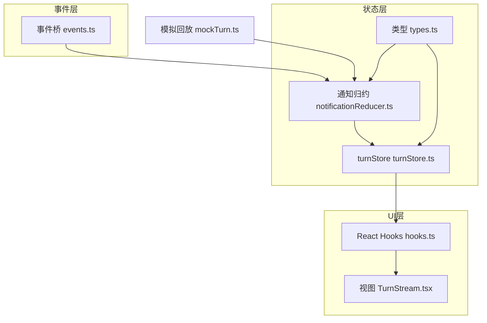
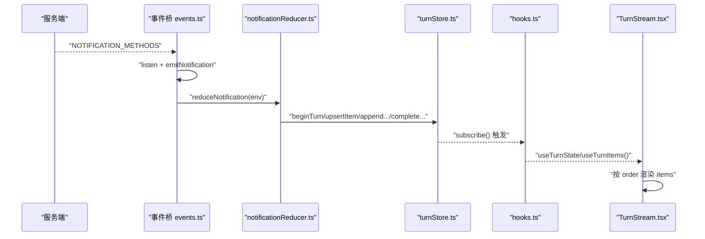
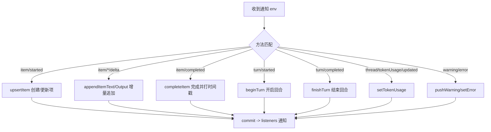
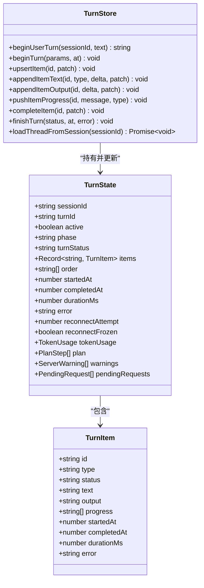
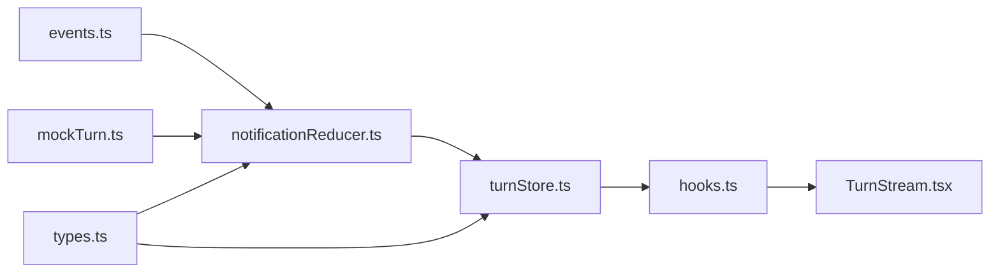

# 对话状态存储 (turnStore)

<cite>
**本文引用的文件**
- [turnStore.ts](file://frontend/app/state/turnStore.ts)
- [types.ts](file://frontend/app/state/types.ts)
- [hooks.ts](file://frontend/app/state/hooks.ts)
- [notificationReducer.ts](file://frontend/app/state/notificationReducer.ts)
- [events.ts](file://frontend/app/bridge/events.ts)
- [TurnStream.tsx](file://frontend/app/views/TurnStream.tsx)
- [mockTurn.ts](file://frontend/app/state/mockTurn.ts)
</cite>

## 目录
1. [简介](#简介)
2. [项目结构](#项目结构)
3. [核心组件](#核心组件)
4. [架构总览](#架构总览)
5. [详细组件分析](#详细组件分析)
6. [依赖关系分析](#依赖关系分析)
7. [性能考量](#性能考量)
8. [故障排查指南](#故障排查指南)
9. [结论](#结论)
10. [附录：使用示例与最佳实践](#附录使用示例与最佳实践)

## 简介
本模块负责 Codex-Tauri 前端“对话流”的单一事实来源（Single Source of Truth），以 turnStore 为核心，集中管理当前 Turn 的生命周期、消息项（Item）的创建/更新/完成、历史加载、计划步骤、Token 用量、警告与待处理请求等。所有 UI 渲染均基于该 store 的状态，并通过 React hooks 订阅变更；服务端通知通过事件桥统一接入，再交由 reducer 映射为对 turnStore 的操作，确保“所见即所得”，不凭空构造状态。

## 项目结构
- 数据模型定义：types.ts
- 状态存储与操作：turnStore.ts
- 通知到状态的映射：notificationReducer.ts
- 事件桥接（Tauri 事件监听分发）：events.ts
- React 绑定与选择器：hooks.ts
- 视图层消费：TurnStream.tsx
- 演示回放（模拟通知流）：mockTurn.ts

图表来源
- [events.ts:145-159](file://frontend/app/bridge/events.ts#L145-L159)
- [notificationReducer.ts:189-446](file://frontend/app/state/notificationReducer.ts#L189-L446)
- [turnStore.ts:28-49](file://frontend/app/state/turnStore.ts#L28-L49)
- [hooks.ts:17-32](file://frontend/app/state/hooks.ts#L17-L32)
- [TurnStream.tsx:64-67](file://frontend/app/views/TurnStream.tsx#L64-L67)
- [mockTurn.ts:49-152](file://frontend/app/state/mockTurn.ts#L49-L152)

章节来源
- [events.ts:145-159](file://frontend/app/bridge/events.ts#L145-L159)
- [notificationReducer.ts:189-446](file://frontend/app/state/notificationReducer.ts#L189-L446)
- [turnStore.ts:28-49](file://frontend/app/state/turnStore.ts#L28-L49)
- [hooks.ts:17-32](file://frontend/app/state/hooks.ts#L17-L32)
- [TurnStream.tsx:64-67](file://frontend/app/views/TurnStream.tsx#L64-L67)
- [mockTurn.ts:49-152](file://frontend/app/state/mockTurn.ts#L49-L152)

## 核心组件
- TurnState / TurnItem：描述一次对话回合的全量状态与可渲染单元，包含消息文本、工具输出、进度、时间戳、状态标记等。
- turnStore：不可变更新的状态机，提供 beginUserTurn、upsertItem、appendItemText、completeItem、finishTurn、loadThreadFromSession 等能力。
- notificationReducer：将服务端通知方法映射为 turnStore 动作，保证协议扩展时自动覆盖。
- events：统一监听 Tauri 事件并分发给通知处理器。
- hooks：useSyncExternalStore 绑定，避免高频流导致重渲染风暴。
- TurnStream：根据 active/phase/duration 展示思考、实时、已完成三种头部状态，并按 order 渲染 items。

章节来源
- [types.ts:12-109](file://frontend/app/state/types.ts#L12-L109)
- [turnStore.ts:51-285](file://frontend/app/state/turnStore.ts#L51-L285)
- [notificationReducer.ts:189-446](file://frontend/app/state/notificationReducer.ts#L189-L446)
- [events.ts:57-159](file://frontend/app/bridge/events.ts#L57-L159)
- [hooks.ts:17-32](file://frontend/app/state/hooks.ts#L17-L32)
- [TurnStream.tsx:64-187](file://frontend/app/views/TurnStream.tsx#L64-L187)

## 架构总览
下图展示了从服务端通知到 UI 渲染的完整链路：

图表来源
- [events.ts:145-159](file://frontend/app/bridge/events.ts#L145-L159)
- [notificationReducer.ts:189-446](file://frontend/app/state/notificationReducer.ts#L189-L446)
- [turnStore.ts:28-49](file://frontend/app/state/turnStore.ts#L28-L49)
- [hooks.ts:17-32](file://frontend/app/state/hooks.ts#L17-L32)
- [TurnStream.tsx:64-67](file://frontend/app/views/TurnStream.tsx#L64-L67)

## 详细组件分析

### Turn 数据结构与时间戳管理
- TurnState
  - sessionId/turnId：会话与回合标识
  - active/phase/turnStatus：回合生命周期控制
  - items/order：O(1) 查找 + 稳定渲染顺序
  - startedAt/completedAt/durationMs：计时与耗时统计
  - tokenUsage/plan/warnings/pendingRequests：附加信息
- TurnItem
  - id/type/status：唯一标识、块类型、状态
  - text/output/progress：流式内容或工具输出
  - startedAt/completedAt/durationMs：起止时间与时长
  - error：错误信息
- 时间戳策略
  - 开始时间优先来自 receivedAt（通知到达时间），便于精确计时
  - 完成时间由 completeItem/finishTurn 设置，durationMs 由差值计算
  - 用户乐观气泡立即显示，失败时可回滚

章节来源
- [types.ts:12-109](file://frontend/app/state/types.ts#L12-L109)
- [turnStore.ts:118-133](file://frontend/app/state/turnStore.ts#L118-L133)
- [turnStore.ts:209-234](file://frontend/app/state/turnStore.ts#L209-L234)
- [turnStore.ts:241-256](file://frontend/app/state/turnStore.ts#L241-L256)

### 对话状态创建、更新与删除
- 创建
  - beginUserTurn：立即插入用户消息（乐观更新），返回 item id 以便失败回滚
  - loadThreadFromSession：从 get_session/get_runtime_events 恢复历史，构建 items 与 order
- 更新
  - upsertItem：新增或合并已有项，保持 order
  - appendItemText/appendItemOutput：增量追加文本或工具输出
  - pushItemProgress：追加 MCP 进度消息
  - setPhase/setPlan/setTokenUsage/pushWarning/addPendingRequest/removePendingRequest/setError：元信息更新
- 删除/回滚
  - discardItem：移除指定项（用于回滚失败的乐观气泡）
  - resetTurn：重置为空状态（谨慎使用，通常由会话切换触发）

章节来源
- [turnStore.ts:53-55](file://frontend/app/state/turnStore.ts#L53-L55)
- [turnStore.ts:71-107](file://frontend/app/state/turnStore.ts#L71-L107)
- [turnStore.ts:118-141](file://frontend/app/state/turnStore.ts#L118-L141)
- [turnStore.ts:143-207](file://frontend/app/state/turnStore.ts#L143-L207)
- [turnStore.ts:236-285](file://frontend/app/state/turnStore.ts#L236-L285)
- [turnStore.ts:328-466](file://frontend/app/state/turnStore.ts#L328-L466)

### 实时消息处理机制
- 事件桥
  - startEventBridge：一次性注册所有 NOTIFICATION_METHODS 的 Tauri 监听
  - onNotification/onServerRequest：订阅通知与服务端请求
- 归约器
  - reduceNotification：将通知映射为 turnStore 动作，包括 item 生命周期、流式 delta、计划、Token 用量、警告等
- 同步策略
  - 所有 UI 变更来自服务端通知，无本地模拟（除 mockTurn 演示）
  - 高频率 delta 通过 useSyncExternalStore 订阅，避免上下文传递与过度渲染

图表来源
- [events.ts:145-159](file://frontend/app/bridge/events.ts#L145-L159)
- [notificationReducer.ts:189-446](file://frontend/app/state/notificationReducer.ts#L189-L446)
- [turnStore.ts:28-49](file://frontend/app/state/turnStore.ts#L28-L49)

章节来源
- [events.ts:57-159](file://frontend/app/bridge/events.ts#L57-L159)
- [notificationReducer.ts:189-446](file://frontend/app/state/notificationReducer.ts#L189-L446)
- [hooks.ts:17-32](file://frontend/app/state/hooks.ts#L17-L32)

### 对话状态生命周期管理
- 会话切换
  - beginTurn 检测 threadId 变化，若发生切换则清空 items/order/tokenUsage/warnings/pendingRequests，仅保留会话级字段
  - loadThreadFromSession 在加载新会话前先 commit 一个干净的空 Turn，防止历史泄漏
- 资源释放
  - finishTurn 关闭 active、记录 durationMs、清理 reconnect 残留
  - stopEventBridge 在测试/热重载时卸载所有监听

章节来源
- [turnStore.ts:71-107](file://frontend/app/state/turnStore.ts#L71-L107)
- [turnStore.ts:328-336](file://frontend/app/state/turnStore.ts#L328-L336)
- [turnStore.ts:241-256](file://frontend/app/state/turnStore.ts#L241-L256)
- [events.ts:161-171](file://frontend/app/bridge/events.ts#L161-L171)

### 消息排序、过滤与搜索
- 排序
  - order 数组维护稳定的到达顺序，渲染时按 order 遍历 items
  - groupProcessItems（外部模块）可将连续同类工具项折叠分组
- 过滤
  - TurnStream 根据边界（最后一个 user-message）定位当前回合范围，仅在该范围内显示 header
  - visible 函数支持折叠已完成的回合体
- 搜索
  - 当前实现未内置全文检索；可在 useTurnItems 基础上叠加前端过滤逻辑（例如按 type/text 筛选）

章节来源
- [turnStore.ts:91-93](file://frontend/app/state/turnStore.ts#L91-L93)
- [TurnStream.tsx:71-110](file://frontend/app/views/TurnStream.tsx#L71-L110)

### 类图：核心对象关系

图表来源
- [types.ts:12-109](file://frontend/app/state/types.ts#L12-L109)
- [turnStore.ts:51-285](file://frontend/app/state/turnStore.ts#L51-L285)

## 依赖关系分析
- events.ts 依赖 protocol 生成的 NOTIFICATION_METHODS，启动时并行绑定所有通道
- notificationReducer.ts 依赖 turnStore 的动作 API，将通知映射为状态变更
- turnStore.ts 依赖 types.ts 的数据结构，并提供 subscribe/getSnapshot 供 React 订阅
- hooks.ts 通过 useSyncExternalStore 将 turnStore 暴露为 React 状态源
- TurnStream.tsx 消费 hooks 提供的 state/items，并调用 groupProcessItems 进行分组渲染
- mockTurn.ts 通过 reduceNotification 注入模拟通知，驱动真实渲染路径

图表来源
- [events.ts:145-159](file://frontend/app/bridge/events.ts#L145-L159)
- [notificationReducer.ts:189-446](file://frontend/app/state/notificationReducer.ts#L189-L446)
- [turnStore.ts:28-49](file://frontend/app/state/turnStore.ts#L28-L49)
- [hooks.ts:17-32](file://frontend/app/state/hooks.ts#L17-L32)
- [TurnStream.tsx:64-67](file://frontend/app/views/TurnStream.tsx#L64-L67)
- [mockTurn.ts:49-152](file://frontend/app/state/mockTurn.ts#L49-L152)
- [types.ts:12-109](file://frontend/app/state/types.ts#L12-L109)

章节来源
- [events.ts:145-159](file://frontend/app/bridge/events.ts#L145-L159)
- [notificationReducer.ts:189-446](file://frontend/app/state/notificationReducer.ts#L189-L446)
- [turnStore.ts:28-49](file://frontend/app/state/turnStore.ts#L28-L49)
- [hooks.ts:17-32](file://frontend/app/state/hooks.ts#L17-L32)
- [TurnStream.tsx:64-67](file://frontend/app/views/TurnStream.tsx#L64-L67)
- [mockTurn.ts:49-152](file://frontend/app/state/mockTurn.ts#L49-L152)
- [types.ts:12-109](file://frontend/app/state/types.ts#L12-L109)

## 性能考量
- 不可变更新与最小化重渲染
  - 每次 commit 生成新 state，配合 useSyncExternalStore 仅在订阅者回调触发时更新
- O(1) 查找与稳定渲染
  - items 以 id 为键，order 维持渲染顺序，避免全量 diff
- 流式增量更新
  - appendItemText/Output 仅追加 delta，减少重建成本
- 批量初始化
  - loadThreadFromSession 先清空状态，再批量构建 items/order，最后一次性 commit
- 定时器节流
  - TurnStream 使用 setInterval 刷新“已处理 X 秒”，避免频繁计算

[本节为通用性能建议，无需特定文件引用]

## 故障排查指南
- 通知未生效
  - 检查 startEventBridge 是否已调用，确认 NOTIFICATION_METHODS 已包含目标方法
  - 查看 console 中 events 日志，确认 listen 成功
- 未知通知方法
  - 归约器会将未处理的方法记录为 warning，可在 UI 中观察
- 历史加载异常
  - loadThreadFromSession 会捕获 get_session/get_runtime_events 的错误并 setError，检查错误信息
- 会话切换后状态错乱
  - beginTurn 检测到 threadId 变化会清空 items，确认 threadId 正确传入
- 连接重试残留
  - finishTurn 会保留 reconnectFrozen 标志，必要时手动 resetTurn

章节来源
- [events.ts:145-159](file://frontend/app/bridge/events.ts#L145-L159)
- [notificationReducer.ts:437-446](file://frontend/app/state/notificationReducer.ts#L437-L446)
- [turnStore.ts:328-348](file://frontend/app/state/turnStore.ts#L328-L348)
- [turnStore.ts:71-107](file://frontend/app/state/turnStore.ts#L71-L107)
- [turnStore.ts:241-256](file://frontend/app/state/turnStore.ts#L241-L256)

## 结论
turnStore 作为对话流的单一事实来源，结合事件桥与通知归约器，实现了高可靠、可扩展、高性能的实时对话状态管理。其设计遵循“服务端驱动 UI”的原则，通过不可变更新、稳定顺序与增量追加，保障了在高频流场景下的流畅体验。同时，完善的会话切换与生命周期管理确保了多会话环境下的状态隔离与资源释放。

[本节为总结性内容，无需特定文件引用]

## 附录：使用示例与最佳实践

- 在组件中订阅 turn 状态
  - 使用 useTurnState 获取 TurnState，使用 useTurnItems 获取按序排列的 TurnItem 列表
  - 参考路径：[hooks.ts:17-32](file://frontend/app/state/hooks.ts#L17-L32)、[TurnStream.tsx:64-67](file://frontend/app/views/TurnStream.tsx#L64-L67)

- 发起一轮对话
  - 调用 beginUserTurn 立即显示用户消息，随后等待 turn/started 与后续 item 通知
  - 参考路径：[turnStore.ts:118-133](file://frontend/app/state/turnStore.ts#L118-L133)

- 处理 item 生命周期
  - 通过 notificationReducer 将 item/started → item/*/delta → item/completed 映射为 upsertItem/append* → completeItem
  - 参考路径：[notificationReducer.ts:221-254](file://frontend/app/state/notificationReducer.ts#L221-L254)、[turnStore.ts:143-234](file://frontend/app/state/turnStore.ts#L143-L234)

- 加载历史会话
  - 调用 loadThreadFromSession 恢复历史，注意它会先清空状态再重建
  - 参考路径：[turnStore.ts:328-466](file://frontend/app/state/turnStore.ts#L328-L466)

- 调试与演示
  - 使用 mockTurn 播放预设通知序列，验证渲染路径
  - 参考路径：[mockTurn.ts:49-152](file://frontend/app/state/mockTurn.ts#L49-L152)

- 最佳实践
  - 始终通过 turnStore 暴露的 API 修改状态，避免直接操作内部 state
  - 利用 order 保证渲染稳定性，不要自行排序
  - 对高频 delta 使用 appendItemText/Output，避免整项重建
  - 会话切换时依赖 beginTurn 的 threadId 检测，勿手动清空 items

章节来源
- [hooks.ts:17-32](file://frontend/app/state/hooks.ts#L17-L32)
- [turnStore.ts:118-133](file://frontend/app/state/turnStore.ts#L118-L133)
- [notificationReducer.ts:221-254](file://frontend/app/state/notificationReducer.ts#L221-L254)
- [turnStore.ts:143-234](file://frontend/app/state/turnStore.ts#L143-L234)
- [turnStore.ts:328-466](file://frontend/app/state/turnStore.ts#L328-L466)
- [mockTurn.ts:49-152](file://frontend/app/state/mockTurn.ts#L49-L152)